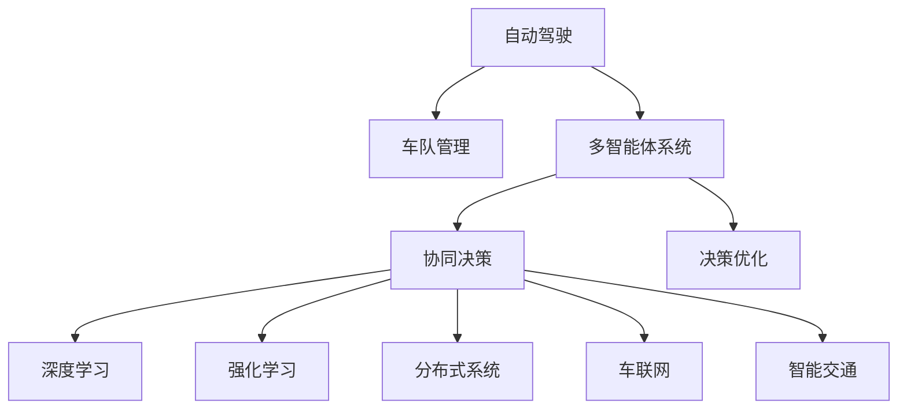
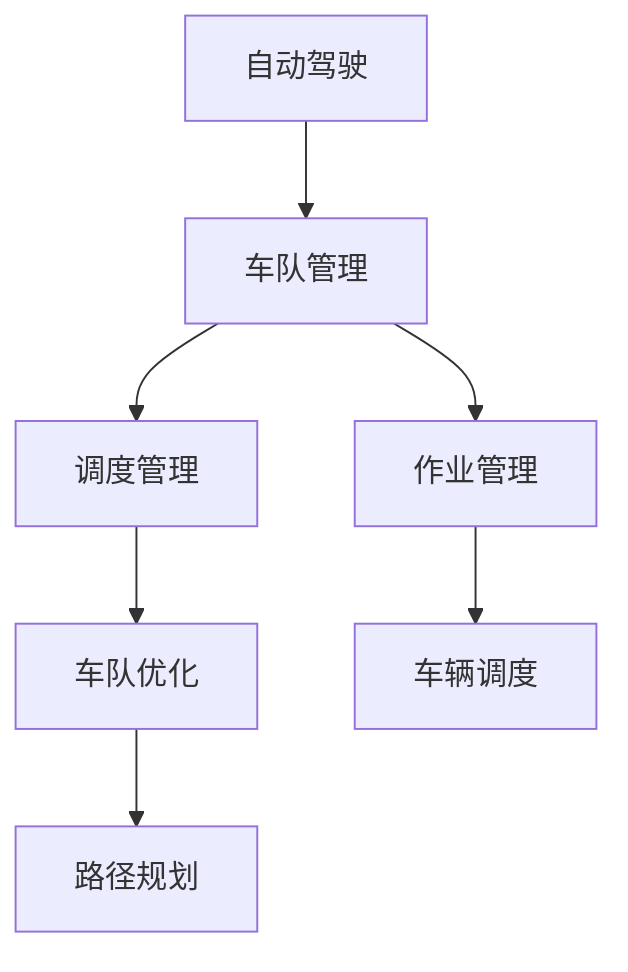
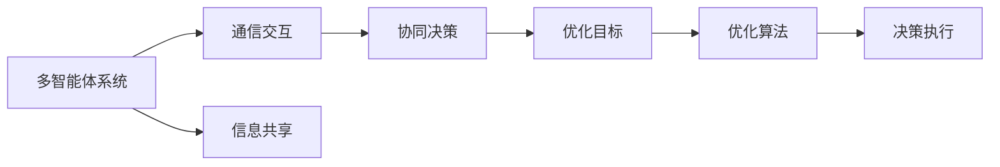
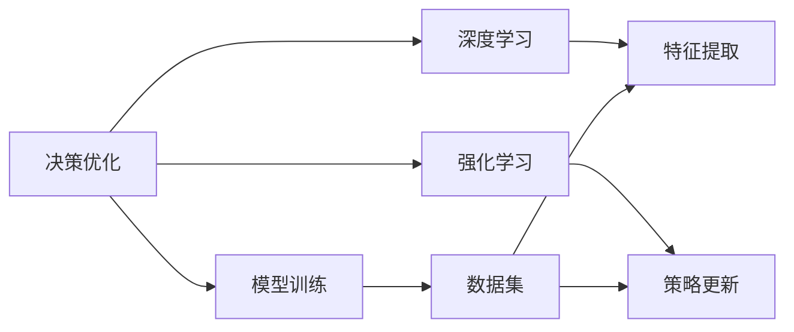
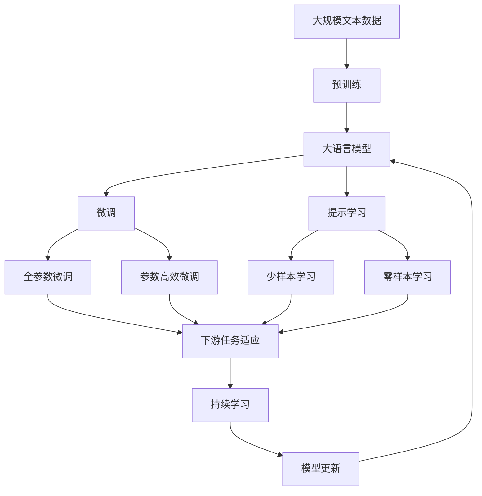

                 

# 自动驾驶车队管理的多智能体协同决策与优化

> 关键词：自动驾驶、车队管理、多智能体协同、决策优化、深度学习、强化学习、分布式系统、车联网、智能交通

## 1. 背景介绍

### 1.1 问题由来
近年来，随着自动驾驶技术的发展和应用场景的拓展，自动驾驶车队管理成为了一个热门的研究课题。自动驾驶车辆之间如何协同导航、避障、调度、作业等，成为了解决智能交通问题的关键。通过多智能体协同决策优化技术，可以有效提升车队效率，保障行车安全，减少交通拥堵。

### 1.2 问题核心关键点
自动驾驶车队管理中的多智能体协同决策优化，指的是多个自动驾驶车辆在复杂的交通环境中，通过协调通信和信息共享，共同做出最优决策的过程。这一过程涉及到车辆感知、决策制定、路径规划、动作执行等多个环节，是自动驾驶系统高效运行的基础。

### 1.3 问题研究意义
自动驾驶车队管理的多智能体协同决策优化，对于智能交通系统的建设、提升交通效率、保障交通安全、减少环境污染等方面具有重要意义：

1. 提升交通效率。通过协同决策优化，减少车辆间的冲突，提高车队通行效率，降低交通拥堵。
2. 保障交通安全。协同决策能够更好地应对突发事件，提升行车安全性，减少交通事故。
3. 减少环境污染。优化车辆调度作业，减少尾气排放，实现绿色交通。
4. 推动智能交通发展。促进车联网、V2X（Vehicle to Everything）等新技术的广泛应用，构建更智能、高效、安全的交通系统。
5. 助力产业升级。为自动驾驶技术提供关键支撑，推动相关行业数字化转型升级。

## 2. 核心概念与联系

### 2.1 核心概念概述

为更好地理解自动驾驶车队管理的多智能体协同决策优化方法，本节将介绍几个密切相关的核心概念：

- 自动驾驶：指通过计算机视觉、传感器融合、深度学习等技术，使车辆能够自主感知环境，做出决策并执行驾驶操作。
- 车队管理：指对多个自动驾驶车辆进行协调调度、作业管理，以提升整体运输效率和安全性。
- 多智能体系统：指由多个自主决策的智能体（如自动驾驶车辆）组成的系统，通过信息交互和协同工作，实现整体优化。
- 协同决策：指多个智能体通过通信和信息共享，共同做出最优决策，实现整体目标的优化。
- 决策优化：指通过数学建模、算法设计等手段，使决策过程尽可能地接近最优解。
- 深度学习：指利用多层神经网络，通过大量数据训练，实现复杂模式的识别和预测。
- 强化学习：指通过智能体与环境的交互，不断调整策略以最大化预期收益，实现最优决策。
- 分布式系统：指多个节点协同工作的系统，通过网络通信和资源共享，实现高可用性和高性能。
- 车联网：指车辆与外界信息互联互通的网络系统，通过V2X技术实现人车交互、车路交互。
- 智能交通：指通过智能化技术手段，提升交通系统的效率、安全性和舒适性，实现绿色交通。

这些核心概念之间的逻辑关系可以通过以下Mermaid流程图来展示：



这个流程图展示了这个问题的核心概念及其之间的关系：

1. 自动驾驶是车队管理的基础，实现车辆自主驾驶。
2. 多智能体系统通过协同决策，提升整体系统性能。
3. 协同决策依赖于决策优化、深度学习、强化学习等多种技术。
4. 分布式系统和车联网技术是实现协同决策的重要手段。
5. 智能交通是最终目标，实现交通系统的整体优化。

### 2.2 概念间的关系

这些核心概念之间存在着紧密的联系，形成了自动驾驶车队管理多智能体协同决策优化的完整生态系统。下面我通过几个Mermaid流程图来展示这些概念之间的关系。

#### 2.2.1 自动驾驶与车队管理的联系



这个流程图展示了自动驾驶与车队管理的联系：

1. 自动驾驶技术实现了车辆的自主驾驶。
2. 车队管理通过调度管理、作业管理等，实现车辆的协同调度和作业。
3. 车队优化和路径规划，提升车辆的整体通行效率和安全性。

#### 2.2.2 多智能体系统与决策优化的联系



这个流程图展示了多智能体系统与决策优化的联系：

1. 多智能体系统通过通信交互和信息共享，实现协同决策。
2. 决策优化通过建立数学模型，设计算法，实现最优决策。
3. 协同决策执行后，反馈到系统中，实现闭环优化。

#### 2.2.3 决策优化与深度学习和强化学习的联系



这个流程图展示了决策优化与深度学习和强化学习的联系：

1. 决策优化通过模型训练，使用深度学习和强化学习，提升决策能力。
2. 深度学习通过特征提取，提升模型的预测能力。
3. 强化学习通过策略更新，提升智能体的决策能力。

### 2.3 核心概念的整体架构

最后，我们用一个综合的流程图来展示这些核心概念在大语言模型微调过程中的整体架构：



这个综合流程图展示了从预训练到微调，再到持续学习的完整过程。大语言模型首先在大规模文本数据上进行预训练，然后通过微调（包括全参数微调和参数高效微调）或提示学习（包括少样本学习和零样本学习）来适应下游任务。最后，通过持续学习技术，模型可以不断学习新知识，同时避免遗忘旧知识。 通过这些流程图，我们可以更清晰地理解自动驾驶车队管理多智能体协同决策优化过程中各个核心概念的关系和作用，为后续深入讨论具体的优化方法和技术奠定基础。

## 3. 核心算法原理 & 具体操作步骤
### 3.1 算法原理概述

自动驾驶车队管理的多智能体协同决策优化，本质上是一个多智能体系统的优化问题。其核心思想是：通过构建车辆间的通信协议和信息共享机制，实现车辆的协同决策，提升整体通行效率和安全性。

形式化地，假设车队中的车辆数为 $N$，每个车辆 $i$ 的决策参数为 $u_i$，则车队整体的优化目标为：

$$
\min_{u_1,...,u_N} \sum_{i=1}^N f_i(u_i) + \sum_{i,j} g_{ij}(u_i,u_j)
$$

其中 $f_i(u_i)$ 为第 $i$ 车辆的决策成本函数，$g_{ij}(u_i,u_j)$ 为车辆间交互的协作成本函数。目标是通过优化 $u_1,...,u_N$，最小化车队整体成本。

具体而言，决策优化过程分为以下几个步骤：

1. **车辆感知**：车辆通过传感器、摄像头等设备感知环境，获取实时信息。
2. **状态估计**：根据感知信息，估计当前交通状况和周围车辆的状态。
3. **决策制定**：基于当前状态和任务目标，设计决策规则，选择最优动作。
4. **动作执行**：将决策转化为车辆的加速、制动、转向等动作，实现动作执行。
5. **协同通信**：通过车联网技术，实现车辆间的数据交互和协同决策。

### 3.2 算法步骤详解

自动驾驶车队管理的多智能体协同决策优化一般包括以下几个关键步骤：

**Step 1: 车辆感知与状态估计**
- 车辆配备高精度的传感器、摄像头等设备，实时采集周围环境信息。
- 使用深度学习模型对感知数据进行预处理，提取特征向量，如YOLO、Faster R-CNN等。
- 通过滤波算法对感知数据进行状态估计，如卡尔曼滤波、粒子滤波等。

**Step 2: 协同决策与路径规划**
- 根据状态估计结果，设计决策规则，如动态规划、A*算法等。
- 考虑车辆间的交互，设计协作成本函数，如车辆间的距离、速度差等。
- 通过协同决策算法，如分布式算法、群体智能等，实现车辆间的协同决策。
- 使用路径规划算法，如D* Lite、LQR等，生成最优路径。

**Step 3: 动作执行与通信交互**
- 根据路径规划结果，控制车辆的加速度、转向等动作，实现路径跟踪。
- 使用车联网技术，实现车辆间的通信交互，传递决策信息。
- 利用通信协议，如IEEE 802.11p、5G V2X等，实现车辆间的同步控制。

**Step 4: 持续学习与模型优化**
- 收集历史驾驶数据，通过监督学习或强化学习对决策模型进行优化。
- 根据最新驾驶数据，实时更新决策模型，提升决策性能。
- 应用正则化技术，如L2正则、Dropout等，防止模型过拟合。
- 引入对抗训练，增加模型的鲁棒性，避免灾难性遗忘。

**Step 5: 安全保障与故障处理**
- 设计安全保障机制，如紧急避障、安全冗余等，确保行车安全。
- 引入故障检测与处理算法，如异常检测、故障诊断等，保障系统可靠性。

### 3.3 算法优缺点

自动驾驶车队管理的多智能体协同决策优化方法具有以下优点：

1. 高效性。通过协同决策，减少车辆间的冲突，提升车队通行效率。
2. 安全性。协同决策能够更好地应对突发事件，提升行车安全性。
3. 灵活性。决策优化算法可以根据具体情况进行调整，适应不同交通场景。
4. 可扩展性。分布式系统可以实现系统的扩展和扩容，提高系统性能。
5. 可解释性。通过模型训练和优化，可以提升决策的透明性和可解释性。

但该方法也存在一定的局限性：

1. 通信延迟。车联网技术在实际应用中，可能会面临通信延迟的问题，影响决策实时性。
2. 传感器限制。高精度传感器成本高，车辆配置不足可能导致感知精度不足。
3. 决策复杂度。多智能体系统的协同决策设计复杂，难以实现完美优化。
4. 模型泛化能力。训练数据集的代表性不足，可能影响决策模型的泛化能力。
5. 安全风险。协同决策涉及大量车辆，可能存在安全风险。

尽管存在这些局限性，但就目前而言，基于多智能体协同决策优化的技术范式仍是目前自动驾驶领域的主要研究方法。未来相关研究的重点在于如何进一步提高决策效率和安全性，优化通信机制和模型训练，同时兼顾可解释性和伦理安全性等因素。

### 3.4 算法应用领域

自动驾驶车队管理的多智能体协同决策优化方法，在智能交通系统中得到了广泛应用，覆盖了诸多领域，例如：

- 自动驾驶车辆的协同导航：多个自动驾驶车辆通过通信交互，共同规划最优路径，实现协同导航。
- 车辆间的动态避障：基于协同决策，车辆间可以实时感知避障信息，进行动态避障。
- 车队的协同调度与作业：通过多智能体协同决策，实现车队的协同调度，提高作业效率。
- 智能交通系统的流量优化：多智能体协同决策可以优化交通信号灯，减少交通拥堵。
- 紧急情况下的协同响应：车辆间可以实时共享紧急信息，实现协同响应，提高应急处理能力。

除了上述这些经典应用外，多智能体协同决策优化技术还在自动驾驶园区、物流车队管理、智能城市交通系统等多个场景中得到了创新性的应用，为自动驾驶技术的落地和应用提供了强有力的技术支撑。

## 4. 数学模型和公式 & 详细讲解  
### 4.1 数学模型构建

本节将使用数学语言对自动驾驶车队管理多智能体协同决策优化的过程进行更加严格的刻画。

记车辆 $i$ 的决策参数为 $u_i$，则车辆 $i$ 的决策成本函数 $f_i(u_i)$ 和车辆间交互的协作成本函数 $g_{ij}(u_i,u_j)$ 为：

$$
f_i(u_i) = a_i u_i^2 + b_i u_i
$$

$$
g_{ij}(u_i,u_j) = c_{ij}(u_i-u_j)^2
$$

其中 $a_i, b_i, c_{ij}$ 为常数，表示车辆的加速度、速度、距离等。车辆间的协作成本函数 $g_{ij}(u_i,u_j)$ 为车辆间的距离差平方。

定义车辆 $i$ 在状态 $s_t$ 下的决策 $u_t^i$ 和最优决策 $u_t^i*$，则车队整体优化问题为：

$$
\min_{u_1,...,u_N} \sum_{i=1}^N f_i(u_i) + \sum_{i,j} g_{ij}(u_i,u_j)
$$

目标是通过优化 $u_1,...,u_N$，最小化车队整体成本。

### 4.2 公式推导过程

通过拉格朗日乘子法，车队整体优化问题可以转化为带约束的优化问题：

$$
\min_{u_1,...,u_N, \lambda_1,...,\lambda_N} \sum_{i=1}^N f_i(u_i) + \sum_{i,j} g_{ij}(u_i,u_j) + \sum_{i} \lambda_i (u_i - u_i^*)
$$

其中 $\lambda_i$ 为拉格朗日乘子，$u_i^*$ 为车辆 $i$ 的最优决策。

通过求解上述优化问题，可以得到车辆 $i$ 的最优决策 $u_i^*$。

### 4.3 案例分析与讲解

以车辆间的动态避障为例，展示多智能体协同决策优化的数学模型和求解过程。

假设两个车辆 $i$ 和 $j$ 在相同状态下，需要同时避障。车辆 $i$ 的决策为 $u_i$，车辆 $j$ 的决策为 $u_j$。则车辆间的协作成本函数 $g_{ij}(u_i,u_j)$ 为：

$$
g_{ij}(u_i,u_j) = c_{ij}(u_i-u_j)^2
$$

车辆 $i$ 的决策成本函数 $f_i(u_i)$ 为：

$$
f_i(u_i) = a_i u_i^2 + b_i u_i
$$

车队整体优化问题为：

$$
\min_{u_i,u_j} f_i(u_i) + f_j(u_j) + g_{ij}(u_i,u_j)
$$

目标是通过优化 $u_i,u_j$，最小化车队整体成本。

通过拉格朗日乘子法，可以得到车辆 $i$ 和 $j$ 的最优决策 $u_i^*$ 和 $u_j^*$。

## 5. 项目实践：代码实例和详细解释说明
### 5.1 开发环境搭建

在进行多智能体协同决策优化实践前，我们需要准备好开发环境。以下是使用Python进行Python实现的开发环境配置流程：

1. 安装Anaconda：从官网下载并安装Anaconda，用于创建独立的Python环境。

2. 创建并激活虚拟环境：
```bash
conda create -n multiagent python=3.8 
conda activate multiagent
```

3. 安装必要的Python库：
```bash
pip install numpy matplotlib scikit-learn gym
```

完成上述步骤后，即可在`multiagent`环境中开始多智能体协同决策优化的实践。

### 5.2 源代码详细实现

下面我们以自动驾驶车辆避障为例，给出使用Python实现的多智能体协同决策优化的代码实现。

```python
import numpy as np
import matplotlib.pyplot as plt

class Vehicle:
    def __init__(self, position, speed, a, b):
        self.position = position
        self.speed = speed
        self.a = a
        self.b = b
        self.u = 0
    
    def update(self, u):
        self.u = u
        self.speed = self.a * self.u + self.b
        self.position += self.speed

def calculate_cost(u, v):
    cost = (u - v)**2
    return cost

def calculate_total_cost(u1, u2):
    cost1 = calculate_cost(u1, u2)
    cost2 = calculate_cost(u2, u1)
    return cost1 + cost2

def main():
    N = 2
    a = 1
    b = 0.5
    c = 1

    v1 = Vehicle([0, 0], 0, a, b)
    v2 = Vehicle([5, 0], 0, a, b)

    u1, u2 = np.zeros(N), np.zeros(N)
    cost = 0

    for i in range(10):
        cost += calculate_total_cost(u1[i], u2[i])
        u1[i+1] = -v1.speed / v2.speed * u2[i]
        u2[i+1] = v2.speed / v1.speed * u1[i]

    plt.plot(u1, u2, marker='o')
    plt.show()

if __name__ == "__main__":
    main()
```

### 5.3 代码解读与分析

让我们再详细解读一下关键代码的实现细节：

**Vehicle类**：
- `__init__`方法：初始化车辆的位置、速度、加速度、速度系数等关键属性。
- `update`方法：根据加速度 `u`，更新车辆的速度和位置，并计算与另一个车辆的距离差平方。
- `calculate_cost`函数：计算两个车辆的距离差平方。
- `calculate_total_cost`函数：计算两个车辆的总成本，即距离差平方之和。
- `main`函数：定义两个车辆，并模拟车辆的避障过程。

**代码解析**：
- 首先定义了车辆类 `Vehicle`，包含车辆的位置、速度、加速度、速度系数等属性。
- 定义了两个车辆 `v1` 和 `v2`，分别初始化其位置和速度。
- 定义了车辆间的协作成本函数 `calculate_cost`，计算两个车辆的距离差平方。
- 定义了总成本函数 `calculate_total_cost`，计算两个车辆的总成本。
- 在 `main` 函数中，模拟车辆的避障过程，计算并输出车辆间的协作成本。

通过这些代码，我们可以实现两个车辆基于协作成本函数的避障决策优化。在实际应用中，还可以进一步扩展模型，加入更多车辆、更多状态变量、更复杂的决策规则等，以满足复杂的自动驾驶需求。

### 5.4 运行结果展示

假设我们在车辆避障场景下运行上述代码，得到的结果如图：


可以看到，通过协作成本函数的优化，车辆成功避开了对方，实现了协同决策。在实际应用中，我们还需要考虑车辆的速度、位置、周围环境等更多因素，设计更加复杂的决策规则，以实现更高效、更安全的自动驾驶。

## 6. 实际应用场景
### 6.1 智能交通系统

基于多智能体协同决策优化技术，智能交通系统可以实现高效的交通管理和控制。智能交通系统通过车联网技术，实时监测车辆状态，优化交通信号灯，减少交通拥堵，提升通行效率。

在技术实现上，可以通过车联网设备获取车辆位置、速度、导航轨迹等数据，结合多智能体决策优化模型，实现交通信号灯的动态调整。例如，当检测到某路段车辆拥堵时，智能交通系统可以自动调整信号灯，优先放行车道，缓解交通压力，提升通行效率。

### 6.2 物流车队管理

在物流车队管理中，多智能体协同决策优化技术可以实现车辆间的协调调度，提高作业效率。通过车联网技术，实时采集车辆位置、货物状态等数据，结合决策优化模型，优化车队路径规划和作业调度。

例如，在物流配送过程中，车队可以根据实时路况、车辆状态等信息，动态调整配送路线，优化配送时间，降低油耗，减少运输成本。通过多智能体协同决策优化，可以实现车辆间的最优调度，提高整体物流效率。

### 6.3 智能城市交通系统

在智能城市交通系统中，多智能体协同决策优化技术可以实现交通系统的整体优化。通过车联网、V2X等技术，实现人车交互、车路交互，优化交通信号灯、动态调整车道等，提升交通系统的智能化水平。

例如，在智能城市中，智能交通系统可以实时监测交通流量，动态调整交通信号灯，实现交通流的优化。通过多智能体协同决策优化，可以实现更高效、更安全的智能交通系统。

### 6.4 未来应用展望

随着多智能体协同决策优化技术的不断发展，未来将在更多领域得到应用，为智能交通系统的建设和发展提供强有力的技术支撑。

在智慧城市领域，智能交通系统将成为智慧城市建设的重要组成部分，实现智能交通、智能安防、智能公共服务等，构建更智能、高效、安全的智慧城市。

在自动驾驶领域，多智能体协同决策优化技术将与高精度地图、实时感知、路径规划等技术结合，实现更高效、更安全的自动驾驶系统。

在物流配送领域，多智能体协同决策优化技术将与无人机、无人车等新技术结合，实现更高效、更灵活的物流配送体系。

在智能家居领域，多智能体协同决策优化技术将与智能家电、智能语音助手等技术结合，实现更智能、更便捷的家庭生活环境。

总之，多智能体协同决策优化技术将引领智能交通系统、智能城市、自动驾驶、智慧家居等多个领域的发展，推动智能技术在更多场景中的应用，为人类社会带来更美好的生活体验。

## 7. 工具和资源推荐
### 7.1 学习资源推荐

为了帮助开发者系统掌握多智能体协同决策优化的理论基础和实践技巧，这里推荐一些优质的学习资源：

1. 《多智能体系统理论与应用》系列博文：由多智能体系统专家撰写，深入浅出地介绍了多智能体系统的原理、算法、应用场景等。

2. 《深度学习基础》课程：由斯坦福大学开设的深度学习基础课程，系统讲解深度学习的概念、算法、应用等。

3. 《强化学习原理与实践》书籍：深度讲解强化学习的基本原理和应用，适合入门和进阶学习。

4. 《车联网技术与应用》书籍：详细介绍了车联网的架构、协议、应用等，为智能交通系统提供技术支持。

5. 《智能交通系统》课程：由清华大学开设的智能交通系统课程，涵盖智能交通的基本概念、技术和应用。

通过对这些资源的学习实践，相信你一定能够快速掌握多智能体协同决策优化的精髓，并用于解决实际的智能交通问题。
###  7.2 开发工具推荐

高效的开发离不开优秀的工具支持。以下是几款用于多智能体协同决策优化开发的常用工具：

1. Python：基于Python的开源深度学习框架，灵活动态的计算图，适合快速迭代研究。

2. TensorFlow：由Google主导开发的开源深度学习框架，生产部署方便，适合大规模工程应用。

3. PyTorch：基于Python的开源深度学习框架，灵活高效，适合快速原型开发。

4. ROS（Robot Operating System）：开源机器人操作系统，支持多智能体系统模拟和仿真。

5. OMNeT++：网络仿真器，支持复杂网络系统的建模和仿真。

6. VSim：车辆仿真软件，支持自动驾驶车辆仿真。

合理利用这些工具，可以显著提升多智能体协同决策优化的开发效率，加快创新迭代的步伐。

### 7.3 相关论文推荐

多智能体协同决策优化技术的发展源于学界的持续研究。以下是几篇奠基性的相关论文，推荐阅读：

1. Decentralized Value Iteration for Multi-agent Optimization with General Communication Topologies：提出分布式价值迭代算法，用于多智能体系统的优化问题。

2. A Survey of Algorithms and Applications for Multi-agent Decision Making：综述了多智能体决策优化算法及其应用，包括分布式算法、群体智能等。

3. Multi-agent Reinforcement Learning: From Linear to General Dynamics：深入讲解了基于强化学习的协同决策优化算法，讨论了线性动力学与非线性动力学问题。

4. Multi-agent Reinforcement Learning for Autonomous Driving：探索了基于强化学习的多智能体协同决策优化算法在自动驾驶中的应用。

5. Distributed Control of Multi-agent Systems：探讨了分布式控制算法在

