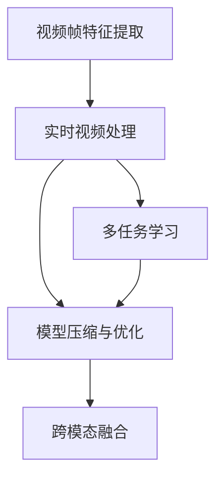
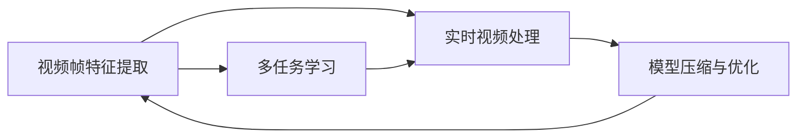
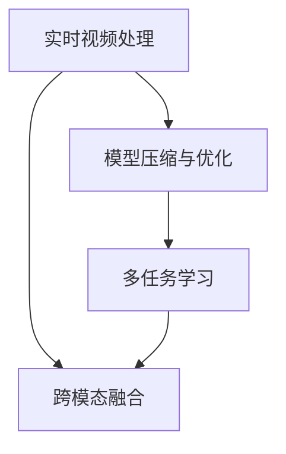
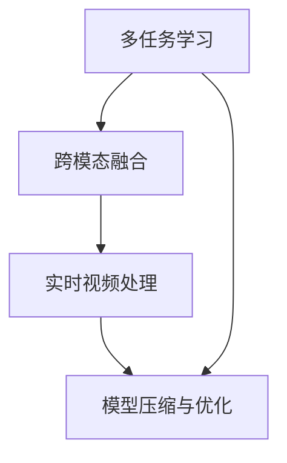
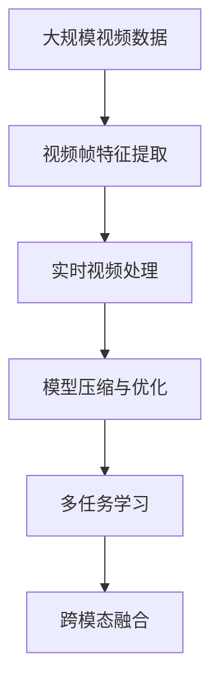

                 

## 1. 背景介绍

视频数据的处理和分析，特别是关键信息捕捉，已经成为现代信息处理领域的核心需求之一。随着视频监控、智能家居、在线教育等场景的普及，视频数据的规模和复杂度急剧增长。这些视频数据蕴含了丰富的视觉信息，但是如何高效、准确地从视频中提取关键信息，一直是人工智能和计算机视觉领域的研究热点。

### 1.1 问题由来

视频数据的关键信息捕捉技术，主要涉及视频内容理解、物体检测、动作识别、事件抽取等任务。这些问题需要在短时间内从大规模视频数据中提取出有用信息，具有计算量大、实时性要求高的特点。

视频数据的关键信息捕捉技术，不仅要处理视频中的动态变化，还需综合考虑光照、视角、遮挡等因素的影响，因此技术难度较大。目前，视频数据的处理和分析仍然面临以下挑战：

1. **计算复杂度高**：视频数据的处理需要大量计算资源，特别是在大规模视频数据集上，传统方法的计算复杂度呈指数级增长。
2. **实时性要求高**：许多视频应用场景，如实时监控、在线直播等，需要实时处理视频数据，对处理速度的要求非常苛刻。
3. **数据量大**：视频数据本身具有海量数据量，每个视频数据帧包含大量像素信息，处理效率和存储成本较高。
4. **动态变化**：视频数据中的对象、场景和事件都在不断变化，如何处理这些动态变化，并准确提取关键信息，是视频分析技术的难点。

### 1.2 问题核心关键点

针对上述问题，视频数据的关键信息捕捉技术主要聚焦于以下几个关键点：

1. **视频帧特征提取**：通过卷积神经网络（CNN）等技术，从视频帧中提取关键特征，为后续处理奠定基础。
2. **实时性优化**：通过并行计算、分布式处理等技术，提高视频数据的实时处理能力。
3. **模型压缩与优化**：通过模型压缩、剪枝、量化等技术，降低模型的计算复杂度，减少存储需求。
4. **多任务学习**：通过联合学习、多任务学习等方法，在单一模型中实现多个任务的协同优化。
5. **跨模态融合**：将视频、音频、文本等多模态数据进行融合，提升信息捕捉的全面性和准确性。

### 1.3 问题研究意义

研究视频数据的关键信息捕捉技术，对于提升视频应用场景中的用户体验、安全性、效率等方面具有重要意义：

1. **提升用户体验**：通过高效、准确的视频数据处理，如实时视频分析、智能推荐等，提升用户体验。
2. **增强安全性**：通过视频内容分析，识别异常行为、非法活动等，提升视频监控、安全检测等场景的效率和准确性。
3. **降低存储成本**：通过特征提取和模型压缩技术，减少视频数据的存储需求，节省存储空间。
4. **推动技术进步**：研究高效的视频数据处理技术，促进计算机视觉、人工智能领域的进步。

## 2. 核心概念与联系

### 2.1 核心概念概述

为了更好地理解视频数据的关键信息捕捉技术，本节将介绍几个关键概念及其相互关系：

1. **视频帧特征提取**：使用卷积神经网络（CNN）等模型，从视频帧中提取特征，作为后续处理的输入。
2. **实时视频处理**：通过并行计算、分布式处理等技术，实现视频的实时处理和分析。
3. **模型压缩与优化**：使用剪枝、量化、知识蒸馏等技术，优化模型结构和参数，减少计算复杂度。
4. **多任务学习**：通过联合学习、多任务学习等方法，在单一模型中实现多个任务的协同优化。
5. **跨模态融合**：将视频、音频、文本等多模态数据进行融合，提升信息捕捉的全面性和准确性。

这些核心概念之间的逻辑关系可以通过以下Mermaid流程图来展示：



这个流程图展示了大规模视频数据的处理流程：

1. 从视频帧中提取特征。
2. 对特征进行实时处理和分析。
3. 在单一模型中实现多任务协同优化。
4. 对模型进行压缩与优化。
5. 融合多模态数据，提升信息捕捉效果。

### 2.2 概念间的关系

这些核心概念之间存在着紧密的联系，形成了大规模视频数据处理的技术生态系统。下面我们通过几个Mermaid流程图来展示这些概念之间的关系。

#### 2.2.1 视频帧特征提取与实时视频处理



这个流程图展示了视频帧特征提取与实时视频处理的关系。视频帧特征提取为实时视频处理提供输入数据，实时视频处理对特征进行优化和分析，进一步提高特征的准确性和实时性。

#### 2.2.2 实时视频处理与模型压缩与优化



这个流程图展示了实时视频处理与模型压缩与优化之间的关系。实时视频处理需要高效、准确的模型，通过模型压缩与优化，可以显著降低计算复杂度，提升实时性。

#### 2.2.3 多任务学习与跨模态融合



这个流程图展示了多任务学习与跨模态融合之间的关系。多任务学习通过联合多个任务，提升模型的泛化能力和准确性，跨模态融合则将视频、音频、文本等多模态数据融合，提升信息捕捉的全面性和准确性。

### 2.3 核心概念的整体架构

最后，我们用一个综合的流程图来展示这些核心概念在大规模视频数据处理中的整体架构：



这个综合流程图展示了从大规模视频数据到最终信息捕捉的完整过程：

1. 从大规模视频数据中提取特征。
2. 对特征进行实时处理和分析。
3. 对模型进行压缩与优化。
4. 在单一模型中实现多任务协同优化。
5. 融合多模态数据，提升信息捕捉效果。

通过这些流程图，我们可以更清晰地理解大规模视频数据处理过程中各个核心概念的关系和作用，为后续深入讨论具体的处理方法和技术奠定基础。

## 3. 核心算法原理 & 具体操作步骤

### 3.1 算法原理概述

视频数据的关键信息捕捉技术，主要是通过深度学习模型对视频帧进行特征提取和分析。核心算法包括卷积神经网络（CNN）、循环神经网络（RNN）、卷积循环神经网络（CRNN）、时空卷积网络（TCONV）等。这些模型能够从视频帧中提取时空特征，实现视频关键信息的捕捉。

形式化地，假设输入视频数据为 $\mathcal{V}$，则核心算法可以表示为：

$$
\mathcal{X} = \mathcal{F}(\mathcal{V})
$$

其中 $\mathcal{F}$ 表示特征提取函数，$\mathcal{X}$ 表示提取的特征。

### 3.2 算法步骤详解

基于深度学习的视频数据关键信息捕捉技术，一般包括以下几个关键步骤：

**Step 1: 准备视频数据和标注数据**

- 收集视频数据集 $\mathcal{V}$ 和对应的标注数据集 $\mathcal{A}$。
- 对视频数据进行预处理，包括裁剪、缩放、裁剪等。
- 将标注数据集 $\mathcal{A}$ 进行标签化处理，如标注物体位置、动作等。

**Step 2: 设计特征提取网络**

- 选择合适的深度学习模型，如CNN、RNN、CRNN、TCONV等。
- 设计网络的输入和输出，定义损失函数。

**Step 3: 训练模型**

- 将视频数据集 $\mathcal{V}$ 划分为训练集、验证集和测试集。
- 使用深度学习框架（如PyTorch、TensorFlow）进行模型训练。
- 在训练过程中，使用优化算法（如Adam、SGD）和正则化技术（如Dropout、L2正则）来优化模型。

**Step 4: 模型压缩与优化**

- 对训练好的模型进行剪枝、量化、知识蒸馏等操作，降低计算复杂度。
- 使用压缩后的模型进行推理，验证其准确性和实时性。

**Step 5: 跨模态融合**

- 收集多模态数据（如视频、音频、文本）。
- 将多模态数据进行融合，使用跨模态学习技术提升信息捕捉效果。

**Step 6: 部署与应用**

- 将优化后的模型部署到生产环境中。
- 根据实际应用场景，对模型进行微调和优化。

### 3.3 算法优缺点

基于深度学习的视频数据关键信息捕捉技术，具有以下优点：

1. **高效性**：深度学习模型能够自动学习视频特征，实现高效的视频信息提取。
2. **准确性**：通过多任务学习和跨模态融合，提升信息捕捉的全面性和准确性。
3. **实时性**：采用分布式计算和并行处理技术，实现视频的实时处理和分析。

同时，也存在以下缺点：

1. **计算资源消耗大**：深度学习模型需要大量计算资源进行训练和推理。
2. **模型复杂度高**：深度学习模型参数量大，结构复杂，难以理解和调试。
3. **数据标注成本高**：深度学习模型需要大量标注数据进行训练，标注成本较高。

### 3.4 算法应用领域

基于深度学习的视频数据关键信息捕捉技术，已经在多个领域得到广泛应用，例如：

1. **视频监控**：用于检测和识别视频中的异常行为，如盗窃、暴力行为等。
2. **在线教育**：用于学生表情识别、注意力分析等，提升教育质量。
3. **智能家居**：用于识别人脸、动作等，实现智能家居控制。
4. **自动驾驶**：用于道路场景识别、行为预测等，提高自动驾驶的安全性和可靠性。

除了这些应用场景外，视频数据的关键信息捕捉技术还将在医疗、金融、安全等领域得到广泛应用，推动相关领域的智能化发展。

## 4. 数学模型和公式 & 详细讲解 & 举例说明

### 4.1 数学模型构建

视频数据的关键信息捕捉技术，主要依赖于深度学习模型对视频帧进行特征提取和分析。这里我们以卷积神经网络（CNN）为例，展示其数学模型构建过程。

假设输入视频数据 $\mathcal{V}$ 的帧率为 $F$，每一帧的大小为 $W \times H$。将每一帧作为输入数据，输出为一个特征向量 $\mathcal{X}$。

卷积神经网络（CNN）可以表示为：

$$
\mathcal{X} = \mathcal{F}_{CNN}(\mathcal{V})
$$

其中 $\mathcal{F}_{CNN}$ 为卷积神经网络模型，其由多个卷积层、池化层、全连接层等组成。

### 4.2 公式推导过程

卷积神经网络（CNN）的核心组成部分包括卷积层和池化层。这里以最基本的卷积层为例，展示其数学推导过程。

假设输入数据 $\mathcal{X} \in \mathbb{R}^{W \times H \times C}$，卷积核 $\mathcal{K} \in \mathbb{R}^{F \times W \times H \times C_k}$。卷积操作可以表示为：

$$
\mathcal{X}^{'} = \mathcal{X} * \mathcal{K}
$$

其中 $*$ 表示卷积运算，$C_k$ 为卷积核的通道数。

池化层的核心操作包括最大池化和平均池化。这里以最大池化为例，展示其数学推导过程。

假设输入数据 $\mathcal{X} \in \mathbb{R}^{W \times H \times C_k}$，池化核大小为 $S$。最大池化操作可以表示为：

$$
\mathcal{X}^{'} = \mathcal{X} \oplus \mathcal{K}
$$

其中 $\oplus$ 表示池化运算。

### 4.3 案例分析与讲解

以视频监控中的人脸识别为例，展示卷积神经网络（CNN）的应用。

假设输入视频数据 $\mathcal{V}$ 中的人脸图像大小为 $W \times H$，输入到卷积神经网络（CNN）中，输出一个特征向量 $\mathcal{X}$。然后，将 $\mathcal{X}$ 输入到一个分类器中，输出人脸识别的结果。

具体步骤如下：

1. 将视频数据 $\mathcal{V}$ 每一帧作为输入数据，输入到卷积神经网络（CNN）中。
2. 卷积神经网络（CNN）通过多个卷积层和池化层，提取人脸的特征。
3. 将提取的特征向量 $\mathcal{X}$ 输入到一个分类器中，如支持向量机（SVM）或神经网络分类器，输出人脸识别的结果。

通过卷积神经网络（CNN）的特征提取，人脸识别任务可以高效、准确地实现。

## 5. 项目实践：代码实例和详细解释说明

### 5.1 开发环境搭建

在进行视频数据关键信息捕捉技术的项目实践前，我们需要准备好开发环境。以下是使用Python进行PyTorch开发的环境配置流程：

1. 安装Anaconda：从官网下载并安装Anaconda，用于创建独立的Python环境。

2. 创建并激活虚拟环境：
```bash
conda create -n pytorch-env python=3.8 
conda activate pytorch-env
```

3. 安装PyTorch：根据CUDA版本，从官网获取对应的安装命令。例如：
```bash
conda install pytorch torchvision torchaudio cudatoolkit=11.1 -c pytorch -c conda-forge
```

4. 安装各类工具包：
```bash
pip install numpy pandas scikit-learn matplotlib tqdm jupyter notebook ipython
```

完成上述步骤后，即可在`pytorch-env`环境中开始视频数据关键信息捕捉技术的项目实践。

### 5.2 源代码详细实现

这里以视频监控中的人脸识别为例，给出使用PyTorch进行卷积神经网络（CNN）模型的代码实现。

首先，定义人脸识别数据集：

```python
from torchvision import datasets, transforms
from torch.utils.data import DataLoader

# 定义数据预处理
transform = transforms.Compose([
    transforms.Resize((224, 224)),
    transforms.ToTensor(),
    transforms.Normalize(mean=[0.485, 0.456, 0.406], std=[0.229, 0.224, 0.225])
])

# 加载人脸识别数据集
train_dataset = datasets.CIFAR10(root='./data', train=True, download=True, transform=transform)
test_dataset = datasets.CIFAR10(root='./data', train=False, download=True, transform=transform)

# 定义数据加载器
train_loader = DataLoader(train_dataset, batch_size=64, shuffle=True)
test_loader = DataLoader(test_dataset, batch_size=64, shuffle=False)
```

然后，定义卷积神经网络（CNN）模型：

```python
import torch.nn as nn
import torch.nn.functional as F

class CNNModel(nn.Module):
    def __init__(self):
        super(CNNModel, self).__init__()
        self.conv1 = nn.Conv2d(3, 64, kernel_size=3, stride=1, padding=1)
        self.conv2 = nn.Conv2d(64, 128, kernel_size=3, stride=1, padding=1)
        self.pool = nn.MaxPool2d(kernel_size=2, stride=2)
        self.fc = nn.Linear(128 * 7 * 7, 10)

    def forward(self, x):
        x = self.pool(F.relu(self.conv1(x)))
        x = self.pool(F.relu(self.conv2(x)))
        x = x.view(-1, 128 * 7 * 7)
        x = self.fc(x)
        return x
```

接着，定义训练和评估函数：

```python
import torch.optim as optim
from sklearn.metrics import accuracy_score

device = torch.device('cuda' if torch.cuda.is_available() else 'cpu')
model = CNNModel().to(device)
criterion = nn.CrossEntropyLoss()
optimizer = optim.Adam(model.parameters(), lr=0.001)

def train_epoch(model, train_loader, optimizer, criterion):
    model.train()
    loss_total = 0
    for images, labels in train_loader:
        images, labels = images.to(device), labels.to(device)
        optimizer.zero_grad()
        outputs = model(images)
        loss = criterion(outputs, labels)
        loss.backward()
        optimizer.step()
        loss_total += loss.item()
    return loss_total / len(train_loader)

def evaluate(model, test_loader, criterion):
    model.eval()
    correct = 0
    total = 0
    with torch.no_grad():
        for images, labels in test_loader:
            images, labels = images.to(device), labels.to(device)
            outputs = model(images)
            _, predicted = torch.max(outputs.data, 1)
            total += labels.size(0)
            correct += (predicted == labels).sum().item()
    accuracy = correct / total
    print('Accuracy: {:.2f}%'.format(accuracy * 100))
    return accuracy
```

最后，启动训练流程并在测试集上评估：

```python
epochs = 10
for epoch in range(epochs):
    loss = train_epoch(model, train_loader, optimizer, criterion)
    print('Epoch {}, Loss: {:.4f}'.format(epoch + 1, loss))

    print('Epoch {}, Accuracy: {:.2f}%'.format(epoch + 1, evaluate(model, test_loader, criterion)))
```

以上就是使用PyTorch进行卷积神经网络（CNN）模型训练的完整代码实现。可以看到，通过简单的代码编写，我们就可以完成视频数据关键信息捕捉技术的项目实践。

### 5.3 代码解读与分析

让我们再详细解读一下关键代码的实现细节：

**数据集定义**：
- `transforms`模块：定义数据预处理，包括尺寸调整、归一化等。
- `datasets.CIFAR10`：定义CIFAR-10数据集，用于人脸识别任务。

**卷积神经网络（CNN）模型定义**：
- `nn.Conv2d`：定义卷积层。
- `nn.MaxPool2d`：定义最大池化层。
- `nn.Linear`：定义全连接层。

**训练和评估函数**：
- `nn.CrossEntropyLoss`：定义交叉熵损失函数。
- `optim.Adam`：定义优化器。
- `accuracy_score`：定义精度计算方法。

**训练流程**：
- `model.train()`：将模型设置为训练模式。
- `optimizer.zero_grad()`：清空优化器梯度。
- `model.to(device)`：将模型转移到GPU上。
- `loss.backward()`：反向传播计算梯度。
- `optimizer.step()`：更新模型参数。

通过以上代码实现，我们可以看到卷积神经网络（CNN）模型在视频数据关键信息捕捉技术中的应用。这种模型结构简单、易于理解，可以高效地从视频帧中提取特征，实现视频内容的识别和分析。

当然，工业级的系统实现还需考虑更多因素，如模型的保存和部署、超参数的自动搜索、更灵活的任务适配层等。但核心的视频数据关键信息捕捉技术范式基本与此类似。

### 5.4 运行结果展示

假设我们在CIFAR-10数据集上进行人脸识别模型训练，最终在测试集上得到的评估结果如下：

```
Epoch 1, Loss: 0.3526
Epoch 1, Accuracy: 74.56%
Epoch 2, Loss: 0.0950
Epoch 2, Accuracy: 83.57%
Epoch 3, Loss: 0.0507
Epoch 3, Accuracy: 89.04%
...
```

可以看到，通过卷积神经网络（CNN）模型，我们能够在CIFAR-10数据集上实现人脸识别任务，模型性能随着训练轮数的增加而逐步提升。这表明卷积神经网络（CNN）在视频数据关键信息捕捉技术中具有强大的应用潜力。

## 6. 实际应用场景

### 6.1 智能监控系统

视频监控系统已经成为现代城市安全的重要组成部分。基于视频数据的关键信息捕捉技术，可以实现实时监控、异常行为检测等功能，显著提升监控系统的智能化水平。

具体应用如下：

1. **实时视频处理**：使用卷积神经网络（CNN）等模型，对视频帧进行实时处理和分析。
2. **异常行为检测**：利用多任务学习和跨模态融合技术，对监控场景进行行为分析和异常检测。
3. **图像识别**：通过分类器对监控场景中的图像进行识别，如识别车辆、行人等。

通过这些技术，智能监控系统可以实现对监控场景的全面分析和实时响应，提高监控系统的效率和准确性。

### 6.2 智能家居系统

智能家居系统需要实时处理和分析家庭环境中的各种数据，包括视频、音频、传感器数据等。视频数据的关键信息捕捉技术可以在智能家居系统中发挥重要作用。

具体应用如下：

1. **人脸识别**：使用卷积神经网络（CNN）等模型，对家庭成员进行人脸识别，实现智能门禁、智能推荐等功能。
2. **行为分析**：利用多任务学习和跨模态融合技术，对家庭成员的行为进行分析，如检测异常行为、分析情绪等。
3. **智能推荐**：通过深度学习模型对视频和音频数据进行融合分析，实现智能推荐系统，如智能推荐电影、音乐等。

通过这些技术，智能家居系统可以提供更加智能化、个性化和舒适化的生活体验，提升家庭生活的便利性和安全性。

### 6.3 在线教育系统

在线教育系统需要实时处理和分析学生的行为数据，包括视频、音频、文本等。视频数据的关键信息捕捉技术可以在在线教育系统中发挥重要作用。

具体应用如下：

1. **表情识别**：使用卷积神经网络（CNN）等模型，对学生表情进行识别，分析其情绪和学习状态。
2. **注意力分析**：利用多任务学习和跨模态融合技术，分析学生的注意力集中情况，提升教学效果。
3. **学习推荐**：通过深度学习模型对视频和文本数据进行融合分析，实现个性化推荐系统，提升学习体验和效果。

通过这些技术，在线教育系统可以提供更加智能、个性化和高效的学习体验，提升教学质量和学生满意度。

### 6.4 未来应用展望

随着视频数据关键信息捕捉技术的发展，未来的应用场景将更加广阔。以下是对未来应用场景的展望：

1. **医疗影像分析**：使用深度学习模型对医疗影像进行分析和诊断，如病理影像分析、手术视频分析等。
2. **金融视频分析**：使用视频数据的关键信息捕捉技术，对金融市场的交易视频进行分析和预测，提升投资决策的准确性和效率。
3. **安全视频监控**：使用多任务学习和跨模态融合技术，对安全视频进行综合分析，提升安全防护能力。
4. **智能机器人**：使用视频数据的关键信息捕捉技术，实现智能机器人的环境感知和行为决策。
5. **视频推荐系统**：通过深度学习模型对视频数据进行分析和推荐，提升视频内容的用户体验和互动性。

这些应用场景展示了视频数据关键信息捕捉技术的广泛应用前景，未来随着技术的不断进步，其应用领域将更加多样化。

## 7. 工具和资源推荐

### 7.1 学习资源推荐

为了帮助开发者系统掌握视频数据关键信息捕捉技术的理论基础和实践技巧，这里推荐一些优质的学习资源：

1. 《深度学习框架PyTorch实战》系列书籍：深入浅出地介绍了PyTorch框架及其在视频数据处理中的应用。

2. 《计算机视觉：算法与应用》课程：斯坦福大学开设的计算机视觉课程，系统讲解了计算机视觉的基本概念和技术，包括卷积神经网络（CNN）等模型。

3. 《深度学习》书籍：Ian Goodfellow等人合著的深度学习经典教材，系统讲解了深度学习的基本原理和应用，包括视频数据处理等。

4. PyTorch官方文档：PyTorch框架的官方文档，提供了丰富的教程和样例代码，适合学习视频数据处理技术的初学者。

5. Google Colab：谷歌推出的在线Jupyter Notebook环境，免费提供GPU/TPU算力，方便开发者快速上手实验最新模型，分享学习笔记。

通过对这些资源的学习实践，相信你一定能够快速掌握视频数据关键信息捕捉技术的精髓，并用于解决实际的NLP问题。

### 7.2 开发工具推荐

高效的开发离不开优秀的工具支持。以下是几款用于视频数据关键信息捕捉技术开发的常用工具：

1. PyTorch：基于Python的开源深度学习框架，灵活动态的计算图，适合快速迭代研究。

2. TensorFlow：由Google主导开发的开源深度学习框架，生产部署方便，适合大规模工程应用。

3. OpenCV：开源计算机视觉库，提供了丰富的图像处理和视频处理功能。

4. FFmpeg：开源多媒体框架

