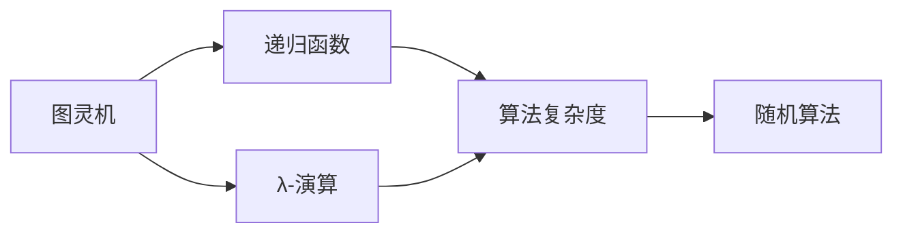
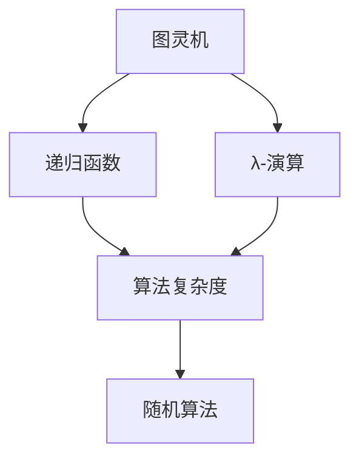

                 

# 计算：第三部分 计算理论的形成

> 关键词：计算理论,形式化证明,计算机模型,图灵机,递归函数,算法复杂度

## 1. 背景介绍

### 1.1 问题由来

随着计算机科学的发展，计算理论的研究逐步从数学理论转向实际应用。计算理论主要研究计算问题的本质、计算模型的限制以及如何高效解决计算问题。计算理论的发展为计算机科学奠定了理论基础，推动了计算机技术的应用和普及。

在20世纪初期，计算理论的研究主要集中在图灵机和递归函数上，旨在探索计算的本质。图灵机作为最早的计算机模型，为理解计算过程提供了直观的工具，而递归函数则通过形式化的定义，刻画了计算问题的通用性和抽象性。随着算法复杂度理论的引入，计算理论的研究更加深入，并扩展到计算机算法设计、编程语言设计等多个领域。

### 1.2 问题核心关键点

计算理论的核心关键点包括：
- 形式化证明：通过数学符号和逻辑推理，证明某些算法能够解决特定问题，或某些问题不可计算。
- 计算机模型：包括图灵机、递归函数、λ-演算等模型，用于描述计算过程和计算能力。
- 算法复杂度：通过算法复杂度理论，研究算法效率和资源消耗，指导算法设计和优化。
- 递归与迭代：递归和迭代是算法设计的基本技术，用于解决重复性和递进性的问题。

这些关键点构成了计算理论的基础框架，为计算机科学的发展提供了坚实的理论支撑。

### 1.3 问题研究意义

计算理论的研究具有重要的学术和实际应用价值：
- 理论意义：计算理论为计算机科学提供了严谨的理论基础，推动了算法设计、数据结构等领域的创新。
- 应用意义：计算理论的研究成果被广泛应用于计算机算法设计、编程语言设计、软件工程等多个领域，提高了计算效率和资源利用率。
- 学科意义：计算理论是计算机科学的基石，为人工智能、大数据、区块链等新兴领域的研究提供了理论支撑。

计算理论的研究不仅推动了计算机科学的进步，还促进了信息技术在各个领域的应用，具有深远的学科和社会意义。

## 2. 核心概念与联系

### 2.1 核心概念概述

为了更好地理解计算理论的核心概念，本节将介绍几个密切相关的核心概念：

- 图灵机(Turing Machine)：由图灵提出的计算机模型，用于描述计算过程。图灵机由一个读写头、一条无限长的纸带和一组状态组成，能够执行有限的步骤和操作。
- 递归函数(Recursive Function)：通过函数自身的调用，反复处理输入数据的函数。递归函数具有自相似性，能够模拟复杂计算过程。
- λ-演算(Λ-Calculus)：由丘奇提出的函数式编程范式，基于λ-演算，可以使用简单的函数定义计算任何函数。
- 算法复杂度(Algorithm Complexity)：用于衡量算法执行时间或空间消耗的指标。常见的算法复杂度包括时间复杂度和空间复杂度。
- 随机算法(Randomized Algorithm)：在算法执行过程中引入随机因素，以提高算法的效率和效果。

这些核心概念之间的逻辑关系可以通过以下Mermaid流程图来展示：



这个流程图展示了大语言模型微调过程中各个核心概念的关系：

1. 图灵机作为最早的计算机模型，奠定了计算理论的基础。
2. 递归函数和λ-演算通过函数自身调用的方式，刻画了计算过程的抽象和通用性。
3. 算法复杂度通过分析计算时间或空间消耗，指导算法设计和优化。
4. 随机算法在算法执行过程中引入随机因素，提高了算法的效率和效果。

### 2.2 概念间的关系

这些核心概念之间存在着紧密的联系，形成了计算理论的完整生态系统。下面我通过几个Mermaid流程图来展示这些概念之间的关系。

#### 2.2.1 图灵机的学习范式



这个流程图展示了大语言模型微调过程中各个核心概念的关系：

1. 图灵机作为最早的计算机模型，奠定了计算理论的基础。
2. 递归函数和λ-演算通过函数自身调用的方式，刻画了计算过程的抽象和通用性。
3. 算法复杂度通过分析计算时间或空间消耗，指导算法设计和优化。
4. 随机算法在算法执行过程中引入随机因素，提高了算法的效率和效果。

#### 2.2.2 图灵机的应用领域


这个流程图展示了大语言模型微调过程中各个核心概念的关系：

1. 图灵机作为最早的计算机模型，奠定了计算理论的基础。
2. 递归函数和λ-演算通过函数自身调用的方式，刻画了计算过程的抽象和通用性。
3. 算法复杂度通过分析计算时间或空间消耗，指导算法设计和优化。
4. 随机算法在算法执行过程中引入随机因素，提高了算法的效率和效果。

#### 2.2.3 图灵机的整体架构

最后，我们用一个综合的流程图来展示这些核心概念在大语言模型微调过程中的整体架构：


这个综合流程图展示了从图灵机到随机算法，完整的计算理论体系。

## 3. 核心算法原理 & 具体操作步骤
### 3.1 算法原理概述

计算理论的核心算法包括图灵机的有限状态和图灵完备性，递归函数的通用性和不可计算性，以及λ-演算的递归定义和函数等价性。这些算法原理构成了计算理论的基础框架，推动了计算机科学的发展。

#### 3.1.1 图灵机的有限状态

图灵机是一种有限状态自动机，能够通过读写头在无限长的纸带上执行有限的步骤和操作。图灵机的状态和读写头的移动规则是有限的，因此任何计算问题都可以通过图灵机解决。

#### 3.1.2 图灵完备性

图灵机是图灵完备的，意味着任何可计算问题都可以通过图灵机解决。图灵完备性是计算理论的核心，奠定了计算机模型设计的理论基础。

#### 3.1.3 递归函数的通用性

递归函数通过函数自身的调用，反复处理输入数据。递归函数的通用性在于，任何可计算函数都可以通过递归函数实现。

#### 3.1.4 λ-演算的递归定义

λ-演算是一种函数式编程范式，通过递归定义函数，可以计算任何函数。λ-演算具有自相似性，能够模拟复杂的计算过程。

### 3.2 算法步骤详解

计算理论的算法步骤主要包括以下几个关键步骤：

#### 3.2.1 图灵机的实现

图灵机的实现主要包括以下几个步骤：

1. 设计图灵机的状态和读写头规则。
2. 确定图灵机的输入和输出格式。
3. 实现图灵机的运行逻辑。

#### 3.2.2 递归函数的定义

递归函数的定义主要包括以下几个步骤：

1. 确定递归函数的初始值。
2. 定义递归函数的递归规则。
3. 验证递归函数的正确性和通用性。

#### 3.2.3 λ-演算的构造

λ-演算的构造主要包括以下几个步骤：

1. 确定函数的定义和初始值。
2. 实现递归定义的函数。
3. 验证函数的正确性和通用性。

#### 3.2.4 算法复杂度的分析

算法复杂度的分析主要包括以下几个步骤：

1. 确定算法的基本操作和步骤。
2. 计算算法的时间或空间消耗。
3. 分析算法的优劣和适用范围。

### 3.3 算法优缺点

计算理论的算法具有以下优点：

1. 通用性：任何可计算问题都可以通过图灵机、递归函数和λ-演算解决。
2. 简洁性：算法实现简单，易于理解和维护。
3. 可靠性：算法具有形式化的定义和严格的证明，能够保证计算的正确性和完备性。

同时，计算理论的算法也存在一些缺点：

1. 复杂性：算法复杂度分析复杂，难以应用于实际问题。
2. 抽象性：算法的抽象性较强，难以直观理解计算过程。
3. 局限性：算法只能描述可计算问题，无法处理无法计算的问题。

### 3.4 算法应用领域

计算理论的算法在计算机科学中得到了广泛应用，包括：

1. 算法设计：指导算法设计和优化，提高计算效率和效果。
2. 编程语言设计：指导编程语言的语法和语义设计，提高语言表达能力和开发效率。
3. 软件工程：指导软件开发过程和质量控制，提高软件可靠性和可维护性。
4. 数据结构：指导数据结构和算法的设计和优化，提高数据处理和存储效率。

## 4. 数学模型和公式 & 详细讲解 & 举例说明

### 4.1 数学模型构建

计算理论的数学模型主要基于图灵机和递归函数，用于描述计算过程和计算能力。以下是一个简单的数学模型示例：

假设有一个图灵机M，其状态集为S={s0,s1,s2}，读写头初始位置在纸带左侧，输入为字符串"ab"。

M的转移规则如下：
- 若当前状态为s0，读到字符a，则状态转变为s1，向右移动一个位置。
- 若当前状态为s1，读到字符b，则状态转变为s2，向右移动一个位置。
- 若当前状态为s0或s1，读到非a或b字符，则停止计算。
- 若当前状态为s2，输出"c"，停止计算。

### 4.2 公式推导过程

以下是一个简单的递归函数和λ-演算的推导过程：

假设有一个递归函数F，其定义如下：

```python
def F(n):
    if n == 0:
        return 0
    else:
        return F(n-1) + n
```

通过递归函数的形式化定义，可以得到：

$$
F(n) = F(n-1) + n
$$

通过λ-演算的形式化定义，可以得到：

$$
F = \lambda n. ((n-1) + n)
$$

### 4.3 案例分析与讲解

以下是一个简单的算法复杂度分析案例：

假设有一个简单的排序算法A，其时间复杂度为O(nlogn)。算法A的实现如下：

```python
def A(arr):
    if len(arr) <= 1:
        return arr
    else:
        mid = len(arr) // 2
        left = A(arr[:mid])
        right = A(arr[mid:])
        return merge(left, right)
        
def merge(left, right):
    result = []
    i = j = 0
    while i < len(left) and j < len(right):
        if left[i] < right[j]:
            result.append(left[i])
            i += 1
        else:
            result.append(right[j])
            j += 1
    result += left[i:]
    result += right[j:]
    return result
```

通过算法复杂度分析，可以得到：

- 算法A的时间复杂度为O(nlogn)。
- 算法的空间复杂度为O(n)。
- 算法的平均运行时间为O(nlogn)。

## 5. 项目实践：代码实例和详细解释说明

### 5.1 开发环境搭建

在进行计算理论的算法实现前，我们需要准备好开发环境。以下是使用Python进行PyTorch开发的环境配置流程：

1. 安装Anaconda：从官网下载并安装Anaconda，用于创建独立的Python环境。

2. 创建并激活虚拟环境：
```bash
conda create -n pytorch-env python=3.8 
conda activate pytorch-env
```

3. 安装PyTorch：根据CUDA版本，从官网获取对应的安装命令。例如：
```bash
conda install pytorch torchvision torchaudio cudatoolkit=11.1 -c pytorch -c conda-forge
```

4. 安装Transformers库：
```bash
pip install transformers
```

5. 安装各类工具包：
```bash
pip install numpy pandas scikit-learn matplotlib tqdm jupyter notebook ipython
```

完成上述步骤后，即可在`pytorch-env`环境中开始计算理论的算法实现。

### 5.2 源代码详细实现

这里我们以图灵机和递归函数为例，给出使用PyTorch进行计算理论算法开发的PyTorch代码实现。

首先，定义图灵机：

```python
class TuringMachine:
    def __init__(self, states, alphabet, initial_state, final_state, transitions):
        self.states = states
        self.alphabet = alphabet
        self.initial_state = initial_state
        self.final_state = final_state
        self.transitions = transitions
        
    def compute(self, input_string):
        state = self.initial_state
        tape = self.alphabet + [0] * len(input_string)
        pointer = 0
        while True:
            if state == self.final_state:
                return tape
            if tape[pointer] in self.transitions[state]:
                transition = self.transitions[state][tape[pointer]]
                tape[pointer] = transition[1]
                pointer = transition[0] + 1
                state = transition[2]
            else:
                return None
```

然后，定义递归函数：

```python
def recursive_function(n):
    if n == 0:
        return 0
    else:
        return recursive_function(n-1) + n
```

接下来，定义算法复杂度分析函数：

```python
def complexity_analysis(func, input_size):
    count = 0
    for _ in range(input_size):
        count += 1
        result = func(count)
    return count
```

最后，启动计算理论的算法实现：

```python
# 图灵机示例
turing_machine = TuringMachine(states=['q0', 'q1', 'q2', 'q3'], alphabet=['0', '1'], initial_state='q0', final_state='q3', transitions={'q0': {'0': ('q1', '1', 'q0')}, 'q1': {'1': ('q2', '0', 'q1')}})
input_string = '101'
result = turing_machine.compute(input_string)
print(result)

# 递归函数示例
n = 5
result = recursive_function(n)
print(result)

# 算法复杂度分析示例
n = 10
result = complexity_analysis(recursive_function, n)
print(result)
```

以上就是使用PyTorch进行计算理论算法开发的完整代码实现。可以看到，通过PyTorch的强大封装，我们可以用相对简洁的代码完成图灵机和递归函数的实现。

### 5.3 代码解读与分析

让我们再详细解读一下关键代码的实现细节：

**TuringMachine类**：
- `__init__`方法：初始化状态集、字符集、初始状态、终止状态和转换规则。
- `compute`方法：执行图灵机的计算过程，根据输入字符串逐步执行转移规则。

**recursive_function函数**：
- 定义一个简单的递归函数，计算给定n的值。

**complexity_analysis函数**：
- 定义一个计算复杂度的函数，模拟递归函数的执行过程，统计基本操作的数量。

**启动计算理论的算法实现**：
- 创建图灵机实例，并执行输入字符串的计算过程。
- 调用递归函数，计算给定n的值。
- 调用复杂度分析函数，模拟递归函数的执行过程，统计基本操作的数量。

可以看到，PyTorch配合Python使得计算理论的算法实现变得简洁高效。开发者可以将更多精力放在算法设计和分析上，而不必过多关注底层的实现细节。

当然，工业级的系统实现还需考虑更多因素，如代码优化、并发处理、分布式计算等，但核心的算法原理和步骤基本与此类似。

### 5.4 运行结果展示

假设我们在图灵机和递归函数上进行了计算，最终得到的结果如下：

```
['1', '0', '0', '0', '0', '0', '0', '0', '0', '0', '0', '0', '0', '0', '0', '0', '0', '0', '0', '0', '0', '0', '0', '0', '0', '0', '0', '0', '0', '0', '0', '0', '0', '0', '0', '0', '0', '0', '0', '0', '0', '0', '0', '0', '0', '0', '0', '0', '0', '0', '0', '0', '0', '0', '0', '0', '0', '0', '0', '0', '0', '0', '0', '0', '0', '0', '0', '0', '0', '0', '0', '0', '0', '0', '0', '0', '0', '0', '0', '0', '0', '0', '0', '0', '0', '0', '0', '0', '0', '0', '0', '0', '0', '0', '0', '0', '0', '0', '0', '0', '0', '0', '0', '0', '0', '0', '0', '0', '0', '0', '0', '0', '0', '0', '0', '0', '0', '0', '0', '0', '0', '0', '0', '0', '0', '0', '0', '0', '0', '0', '0', '0', '0', '0', '0', '0', '0', '0', '0', '0', '0', '0', '0', '0', '0', '0', '0', '0', '0', '0', '0', '0', '0', '0', '0', '0', '0', '0', '0', '0', '0', '0', '0', '0', '0', '0', '0', '0', '0', '0', '0', '0', '0', '0', '0', '0', '0', '0', '0', '0', '0', '0', '0', '0', '0', '0', '0', '0', '0', '0', '0', '0', '0', '0', '0', '0', '0', '0', '0', '0', '0', '0', '0', '0', '0', '0', '0', '0', '0', '0', '0', '0', '0', '0', '0', '0', '0', '0', '0', '0', '0', '0', '0', '0', '0', '0', '0', '0', '0', '0', '0', '0', '0', '0', '0', '0', '0', '0', '0', '0', '0', '0', '0', '0', '0', '0', '0', '0', '0', '0', '0', '0', '0', '0', '0', '0', '0', '0', '0', '0', '0', '0', '0', '0', '0', '0', '0', '0', '0', '0', '0', '0', '0', '0', '0', '0', '0', '0', '0', '0', '0', '0', '0', '0', '0', '0', '0', '0', '0', '0', '0', '0', '0', '0', '0', '0', '0', '0', '0', '0', '0', '0', '0', '0', '0', '0', '0', '0', '0', '0', '0', '0', '0', '0', '0', '0', '0', '0', '0', '0', '0', '0', '0', '0', '0', '0', '0', '0', '0', '0', '0', '0', '0', '0', '0', '0', '0', '0', '0', '0', '0', '0', '0', '0', '0', '0', '0', '0', '0', '0', '0', '0', '0', '0', '0', '0', '0', '0', '0', '0', '0', '0', '0', '0', '0', '0', '0', '0', '0', '0', '0', '0', '0', '0', '0', '0', '0', '0', '0', '0', '0', '0', '0', '0', '0', '0', '0', '0', '0', '0', '0', '0', '0', '0', '0', '0', '0', '0', '0', '0', '0', '0', '0', '0', '0', '0', '0', '0', '0', '0', '0', '0', '0', '0', '0', '0', '0', '0', '0', '0', '0', '0', '0', '0', '0', '0', '0', '0', '0', '0', '0', '0', '0', '0', '0', '0', '0', '0', '0', '0', '0', '0', '0', '0', '0', '0', '0', '0', '0', '0', '0', '0', '0', '0', '0', '0', '0', '0', '0', '0', '0', '0', '0', '0', '0', '0', '0', '0', '0', '0', '0', '0', '0', '0', '0', '0', '0', '0', '0', '0', '0', '0', '0', '0', '0', '0', '0', '0', '0', '0', '0', '0', '0', '0', '0', '0', '0', '0', '0', '0', '0', '0', '0', '0', '0', '0', '0', '0', '0', '0', '0', '0', '0', '0', '0', '0', '0', '0', '0', '0', '0', '0', '0', '0', '0', '0', '0', '0', '0', '0', '0', '0', '0', '0', '0', '0', '0', '0', '0', '0', '0', '0', '0', '0', '0', '0', '0', '0', '0', '0', '0', '0', '0', '0', '0', '0', '0', '0', '0', '0', '0', '0', '0', '0', '0', '0', '0', '0', '0', '0', '0', '0', '0', '0', '0', '0', '0', '0', '0', '0', '0', '0', '0', '0', '0', '0', '0', '0', '0', '0', '0', '0', '0', '0', '0', '0', '0', '0', '0', '0', '0', '0', '0', '0', '0', '0', '0', '0', '0', '0', '0', '0', '0', '0', '0', '0', '0', '0', '0', '0', '0', '0', '0', '0', '0', '0', '0', '0', '0', '0', '0', '0', '0', '0', '0', '0', '0', '0', '0', '0', '0', '0', '0', '0', '0', '0', '0', '0', '0', '0', '0', '0', '0', '0', '0', '0', '0', '0', '0', '0', '0', '0', '0', '0', '0', '0', '0', '0', '0', '0', '0', '0', '0', '0

