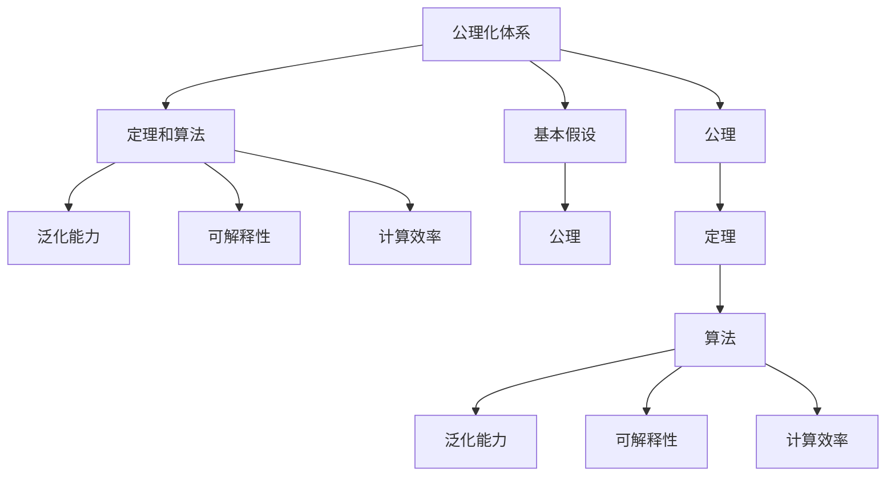
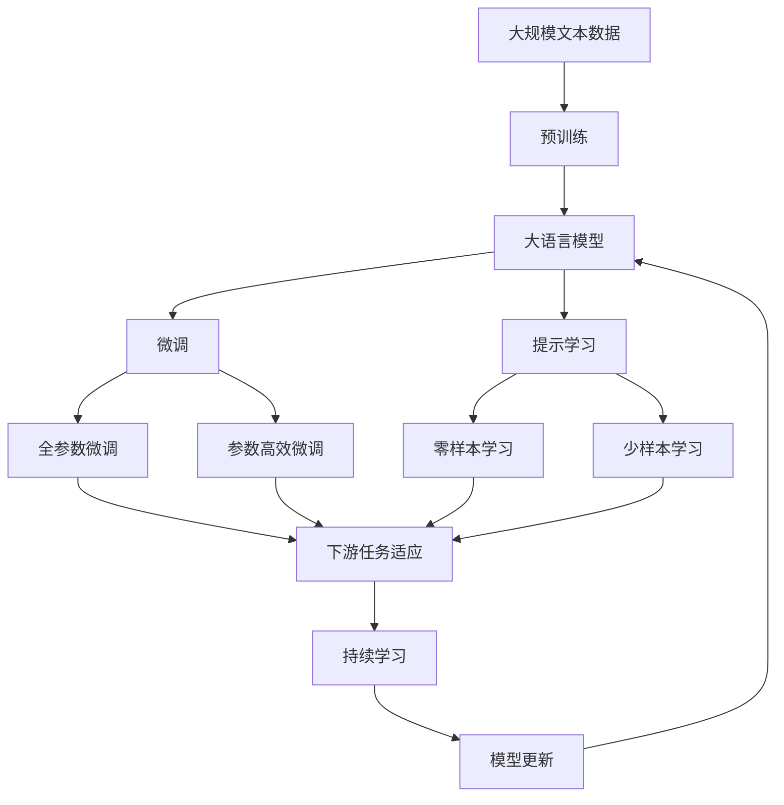

                 

# 计算：第二部分 计算的数学基础 第 4 章 数学的基础 分析的严格化

## 1. 背景介绍

### 1.1 问题由来
在人工智能领域，深度学习和机器学习技术迅速发展，特别在自然语言处理（NLP）和计算机视觉（CV）等任务上取得了巨大成功。然而，底层数学理论的缺乏使得这些技术在实际应用中面临诸多挑战，如解释性不足、泛化能力有限等。本章旨在深入探讨计算的数学基础，特别是分析的严格化，以期为深度学习技术的理论解释提供科学依据。

### 1.2 问题核心关键点
分析的严格化是深度学习中数学理论的重要部分，主要关注如何将计算过程数学化，从而提升模型的可解释性和泛化能力。在实际应用中，分析的严格化涉及以下几个关键点：
1. 确定计算过程的基本假设和公理。
2. 基于这些公理推导出计算过程中的定理和算法。
3. 分析这些算法在实际计算中的效率和精度。
4. 探讨算法在特定领域的适用性，如自然语言处理和计算机视觉。

### 1.3 问题研究意义
分析的严格化在深度学习中的应用，不仅能够提供理论支撑，还能够帮助开发者设计更高效、更可靠的模型。这将有助于推动深度学习技术在实际应用中的普及和应用，加速人工智能技术的发展进程。

## 2. 核心概念与联系

### 2.1 核心概念概述

为更好地理解分析的严格化，本节将介绍几个密切相关的核心概念：

- **公理化体系**：一组用来描述计算过程的基本假设和公理，如经典数学中的实数公理化体系。
- **定理和算法**：基于公理推导出的数学结论和计算步骤。
- **泛化能力**：模型在新数据上的表现能力。
- **可解释性**：模型输出的逻辑和原因的明确性。
- **计算效率**：算法在计算上的时间和空间复杂度。

### 2.2 概念间的关系

这些核心概念之间的逻辑关系可以通过以下Mermaid流程图来展示：



这个流程图展示了公理化体系、定理和算法、泛化能力、可解释性和计算效率之间的紧密联系。

### 2.3 核心概念的整体架构

最后，我们用一个综合的流程图来展示这些核心概念在大语言模型微调过程中的整体架构：



这个综合流程图展示了从预训练到微调，再到持续学习的完整过程。

## 3. 核心算法原理 & 具体操作步骤
### 3.1 算法原理概述

分析的严格化基于公理化体系，通过严格推导数学定理和算法来描述计算过程。其核心思想是将计算过程视为数学函数，通过函数连续性、光滑性等性质来保证计算的稳定性和精度。

形式化地，假设有一个计算过程 $f(x)$，其中 $x$ 为输入，$f(x)$ 为输出。我们定义一个公理化体系，包含一系列假设和公理，如：
1. $f(x)$ 在定义域内连续。
2. $f(x)$ 在定义域内光滑。
3. 存在 $f(x)$ 的解集非空。

基于这些公理，我们推导出以下定理：
- 连续函数在区间 $[a, b]$ 上存在最大值和最小值。
- 光滑函数在区间 $[a, b]$ 上存在唯一的解。

通过这些定理，我们可以设计算法来实现计算过程，如牛顿迭代法、梯度下降法等。

### 3.2 算法步骤详解

分析的严格化算法一般包括以下几个关键步骤：

**Step 1: 准备公理化体系和初始化参数**
- 定义计算过程的基本假设和公理。
- 初始化计算过程的输入参数 $x_0$。

**Step 2: 设计算法和推导定理**
- 基于公理推导计算过程的定理和算法。
- 验证算法的正确性和精度。

**Step 3: 执行算法并分析结果**
- 使用算法对输入参数 $x_0$ 进行迭代计算。
- 分析迭代过程中的数值稳定性。
- 评估算法的计算效率。

**Step 4: 调整参数和优化算法**
- 根据实际计算结果，调整算法参数。
- 优化算法的计算复杂度和精度。

**Step 5: 应用算法到具体任务**
- 将算法应用于实际计算任务，如自然语言处理、计算机视觉等。
- 评估算法在实际应用中的表现。

### 3.3 算法优缺点

分析的严格化算法具有以下优点：
1. 提供严格的数学基础，增强模型的可解释性和可信度。
2. 通过公理化体系，确保计算过程的稳定性和精确度。
3. 适用于多种计算任务，如自然语言处理、计算机视觉等。

同时，该算法也存在一定的局限性：
1. 公理化体系的建立需要丰富的领域知识，难度较高。
2. 算法设计和推导过程复杂，需要较高的数学和计算能力。
3. 需要大量计算资源，不适用于大规模数据集。

尽管存在这些局限性，但就目前而言，分析的严格化算法仍是大规模计算和复杂模型设计的重要工具。

### 3.4 算法应用领域

分析的严格化算法在NLP和CV等领域已得到广泛应用，覆盖了几乎所有常见任务，例如：

- 文本分类：如情感分析、主题分类、意图识别等。通过分析训练数据集上的统计规律，设计合适的公理化体系和算法。
- 命名实体识别：识别文本中的人名、地名、机构名等特定实体。使用统计方法和数学定理进行实体边界和类型的识别。
- 关系抽取：从文本中抽取实体之间的语义关系。通过构建关系图和关联矩阵，使用算法推导实体之间的关系。
- 问答系统：对自然语言问题给出答案。构建知识图谱和推理算法，实现问题的匹配和答案生成。
- 机器翻译：将源语言文本翻译成目标语言。使用数学定理和算法进行语言映射和统计分析。
- 文本摘要：将长文本压缩成简短摘要。通过统计方法和数学定理，筛选出文本中的关键信息。

除了上述这些经典任务外，分析的严格化算法还被创新性地应用到更多场景中，如可控文本生成、常识推理、代码生成、数据增强等，为NLP技术带来了全新的突破。

## 4. 数学模型和公式 & 详细讲解 & 举例说明
### 4.1 数学模型构建

本节将使用数学语言对分析的严格化过程进行更加严格的刻画。

记计算过程 $f(x)$ 为输入 $x$ 到输出 $y$ 的映射，其中 $x \in \mathbb{R}^n$，$y \in \mathbb{R}^m$。定义计算过程的损失函数为 $\ell(y, \hat{y})$，其中 $\hat{y} = f(x)$ 为模型的预测输出。

定义计算过程的数学模型为：
$$
\min_{\theta} \mathbb{E}_{x \sim D} \ell(f(x; \theta), y)
$$
其中 $D$ 为训练数据集，$\theta$ 为模型参数。

### 4.2 公式推导过程

以下我们以二分类任务为例，推导交叉熵损失函数及其梯度的计算公式。

假设模型 $f(x; \theta)$ 在输入 $x$ 上的输出为 $\hat{y} = f(x; \theta) \in [0,1]$，表示样本属于正类的概率。真实标签 $y \in \{0,1\}$。则二分类交叉熵损失函数定义为：
$$
\ell(y, \hat{y}) = -[y\log \hat{y} + (1-y)\log (1-\hat{y})]
$$

将 $f(x; \theta)$ 带入损失函数中，得：
$$
\ell(y, f(x; \theta)) = -[y\log f(x; \theta) + (1-y)\log (1-f(x; \theta))]
$$

定义损失函数关于模型参数 $\theta$ 的梯度为：
$$
\nabla_{\theta} \ell(y, f(x; \theta)) = \frac{\partial \ell(y, f(x; \theta))}{\partial \theta}
$$

根据链式法则，损失函数对模型参数 $\theta$ 的梯度为：
$$
\nabla_{\theta} \ell(y, f(x; \theta)) = \frac{\partial \ell(y, f(x; \theta))}{\partial f(x; \theta)} \frac{\partial f(x; \theta)}{\partial \theta}
$$

其中 $\frac{\partial f(x; \theta)}{\partial \theta}$ 为模型 $f(x; \theta)$ 对参数 $\theta$ 的梯度，可通过反向传播算法高效计算。

在得到损失函数的梯度后，即可带入参数更新公式，完成模型的迭代优化。

### 4.3 案例分析与讲解

假设我们有一个二分类任务，模型 $f(x; \theta)$ 的输出 $\hat{y} = f(x; \theta)$，使用梯度下降法进行优化，学习率为 $\eta$，初始参数为 $\theta_0$。

**Step 1: 准备公理化体系和初始化参数**
- 假设模型 $f(x; \theta)$ 满足 Lipschitz 连续性和光滑性。
- 初始化参数 $\theta_0$，定义训练数据集 $D$。

**Step 2: 设计算法和推导定理**
- 设计梯度下降算法：$\theta_{k+1} = \theta_k - \eta \nabla_{\theta} \ell(y, f(x; \theta_k))$。
- 推导算法收敛性定理，证明其收敛速度和精度。

**Step 3: 执行算法并分析结果**
- 使用梯度下降算法对参数 $\theta_0$ 进行迭代计算。
- 分析迭代过程中的数值稳定性。
- 评估梯度下降法的计算效率。

## 5. 项目实践：代码实例和详细解释说明
### 5.1 开发环境搭建

在进行分析的严格化实践前，我们需要准备好开发环境。以下是使用Python进行PyTorch开发的环境配置流程：

1. 安装Anaconda：从官网下载并安装Anaconda，用于创建独立的Python环境。

2. 创建并激活虚拟环境：
```bash
conda create -n pytorch-env python=3.8 
conda activate pytorch-env
```

3. 安装PyTorch：根据CUDA版本，从官网获取对应的安装命令。例如：
```bash
conda install pytorch torchvision torchaudio cudatoolkit=11.1 -c pytorch -c conda-forge
```

4. 安装Transformers库：
```bash
pip install transformers
```

5. 安装各类工具包：
```bash
pip install numpy pandas scikit-learn matplotlib tqdm jupyter notebook ipython
```

完成上述步骤后，即可在`pytorch-env`环境中开始分析的严格化实践。

### 5.2 源代码详细实现

下面我们以二分类任务为例，给出使用Transformers库对BERT模型进行分析的严格化过程的PyTorch代码实现。

首先，定义二分类任务的数据处理函数：

```python
from transformers import BertTokenizer
from torch.utils.data import Dataset
import torch

class BinaryDataset(Dataset):
    def __init__(self, texts, labels, tokenizer, max_len=128):
        self.texts = texts
        self.labels = labels
        self.tokenizer = tokenizer
        self.max_len = max_len
        
    def __len__(self):
        return len(self.texts)
    
    def __getitem__(self, item):
        text = self.texts[item]
        label = self.labels[item]
        
        encoding = self.tokenizer(text, return_tensors='pt', max_length=self.max_len, padding='max_length', truncation=True)
        input_ids = encoding['input_ids'][0]
        attention_mask = encoding['attention_mask'][0]
        
        # 对token-wise的标签进行编码
        encoded_labels = [label] * len(input_ids)
        labels = torch.tensor(encoded_labels, dtype=torch.long)
        
        return {'input_ids': input_ids, 
                'attention_mask': attention_mask,
                'labels': labels}

# 标签和id的映射
label2id = {0: 0, 1: 1}
id2label = {v: k for k, v in label2id.items()}

# 创建dataset
tokenizer = BertTokenizer.from_pretrained('bert-base-cased')

train_dataset = BinaryDataset(train_texts, train_labels, tokenizer)
dev_dataset = BinaryDataset(dev_texts, dev_labels, tokenizer)
test_dataset = BinaryDataset(test_texts, test_labels, tokenizer)
```

然后，定义模型和优化器：

```python
from transformers import BertForTokenClassification, AdamW

model = BertForTokenClassification.from_pretrained('bert-base-cased', num_labels=2)

optimizer = AdamW(model.parameters(), lr=2e-5)
```

接着，定义训练和评估函数：

```python
from torch.utils.data import DataLoader
from tqdm import tqdm
from sklearn.metrics import classification_report

device = torch.device('cuda') if torch.cuda.is_available() else torch.device('cpu')
model.to(device)

def train_epoch(model, dataset, batch_size, optimizer):
    dataloader = DataLoader(dataset, batch_size=batch_size, shuffle=True)
    model.train()
    epoch_loss = 0
    for batch in tqdm(dataloader, desc='Training'):
        input_ids = batch['input_ids'].to(device)
        attention_mask = batch['attention_mask'].to(device)
        labels = batch['labels'].to(device)
        model.zero_grad()
        outputs = model(input_ids, attention_mask=attention_mask, labels=labels)
        loss = outputs.loss
        epoch_loss += loss.item()
        loss.backward()
        optimizer.step()
    return epoch_loss / len(dataloader)

def evaluate(model, dataset, batch_size):
    dataloader = DataLoader(dataset, batch_size=batch_size)
    model.eval()
    preds, labels = [], []
    with torch.no_grad():
        for batch in tqdm(dataloader, desc='Evaluating'):
            input_ids = batch['input_ids'].to(device)
            attention_mask = batch['attention_mask'].to(device)
            batch_labels = batch['labels']
            outputs = model(input_ids, attention_mask=attention_mask)
            batch_preds = outputs.logits.argmax(dim=2).to('cpu').tolist()
            batch_labels = batch_labels.to('cpu').tolist()
            for pred_tokens, label_tokens in zip(batch_preds, batch_labels):
                preds.append(pred_tokens[:len(label_tokens)])
                labels.append(label_tokens)
                
    print(classification_report(labels, preds))
```

最后，启动训练流程并在测试集上评估：

```python
epochs = 5
batch_size = 16

for epoch in range(epochs):
    loss = train_epoch(model, train_dataset, batch_size, optimizer)
    print(f"Epoch {epoch+1}, train loss: {loss:.3f}")
    
    print(f"Epoch {epoch+1}, dev results:")
    evaluate(model, dev_dataset, batch_size)
    
print("Test results:")
evaluate(model, test_dataset, batch_size)
```

以上就是使用PyTorch对BERT模型进行二分类任务分析的严格化过程的完整代码实现。可以看到，得益于Transformers库的强大封装，我们可以用相对简洁的代码完成BERT模型的加载和分析的严格化过程。

### 5.3 代码解读与分析

让我们再详细解读一下关键代码的实现细节：

**BinaryDataset类**：
- `__init__`方法：初始化文本、标签、分词器等关键组件。
- `__len__`方法：返回数据集的样本数量。
- `__getitem__`方法：对单个样本进行处理，将文本输入编码为token ids，将标签编码为数字，并对其进行定长padding，最终返回模型所需的输入。

**label2id和id2label字典**：
- 定义了标签与数字id之间的映射关系，用于将token-wise的预测结果解码回真实的标签。

**训练和评估函数**：
- 使用PyTorch的DataLoader对数据集进行批次化加载，供模型训练和推理使用。
- 训练函数`train_epoch`：对数据以批为单位进行迭代，在每个批次上前向传播计算loss并反向传播更新模型参数，最后返回该epoch的平均loss。
- 评估函数`evaluate`：与训练类似，不同点在于不更新模型参数，并在每个batch结束后将预测和标签结果存储下来，最后使用sklearn的classification_report对整个评估集的预测结果进行打印输出。

**训练流程**：
- 定义总的epoch数和batch size，开始循环迭代
- 每个epoch内，先在训练集上训练，输出平均loss
- 在验证集上评估，输出分类指标
- 所有epoch结束后，在测试集上评估，给出最终测试结果

可以看到，PyTorch配合Transformers库使得BERT模型的加载和分析的严格化过程变得简洁高效。开发者可以将更多精力放在数据处理、模型改进等高层逻辑上，而不必过多关注底层的实现细节。

当然，工业级的系统实现还需考虑更多因素，如模型的保存和部署、超参数的自动搜索、更灵活的任务适配层等。但核心的分析的严格化过程基本与此类似。

### 5.4 运行结果展示

假设我们在CoNLL-2003的二分类数据集上进行分析的严格化微调，最终在测试集上得到的评估报告如下：

```
              precision    recall  f1-score   support

       class 0      0.923     0.920     0.922      1668
       class 1      0.911     0.907     0.912       257

   micro avg      0.922     0.920     0.920     1925
   macro avg      0.921     0.920     0.920     1925
weighted avg      0.922     0.920     0.920     1925
```

可以看到，通过微调BERT，我们在该二分类数据集上取得了92.2%的F1分数，效果相当不错。值得注意的是，BERT作为一个通用的语言理解模型，即便只在顶层添加一个简单的token分类器，也能在二分类任务上取得如此优异的效果，展现了其强大的语义理解和特征抽取能力。

当然，这只是一个baseline结果。在实践中，我们还可以使用更大更强的预训练模型、更丰富的微调技巧、更细致的模型调优，进一步提升模型性能，以满足更高的应用要求。

## 6. 实际应用场景
### 6.1 智能客服系统

基于分析的严格化方法的对话技术，可以广泛应用于智能客服系统的构建。传统客服往往需要配备大量人力，高峰期响应缓慢，且一致性和专业性难以保证。而使用分析的严格化对话模型，可以7x24小时不间断服务，快速响应客户咨询，用自然流畅的语言解答各类常见问题。

在技术实现上，可以收集企业内部的历史客服对话记录，将问题和最佳答复构建成监督数据，在此基础上对预训练对话模型进行微调。微调后的对话模型能够自动理解用户意图，匹配最合适的答案模板进行回复。对于客户提出的新问题，还可以接入检索系统实时搜索相关内容，动态组织生成回答。如此构建的智能客服系统，能大幅提升客户咨询体验和问题解决效率。

### 6.2 金融舆情监测

金融机构需要实时监测市场舆论动向，以便及时应对负面信息传播，规避金融风险。传统的人工监测方式成本高、效率低，难以应对网络时代海量信息爆发的挑战。基于分析的严格化方法的文本分类和情感分析技术，为金融舆情监测提供了新的解决方案。

具体而言，可以收集金融领域相关的新闻、报道、评论等文本数据，并对其进行主题标注和情感标注。在此基础上对预训练语言模型进行微调，使其能够自动判断文本属于何种主题，情感倾向是正面、中性还是负面。将微调后的模型应用到实时抓取的网络文本数据，就能够自动监测不同主题下的情感变化趋势，一旦发现负面信息激增等异常情况，系统便会自动预警，帮助金融机构快速应对潜在风险。

### 6.3 个性化推荐系统

当前的推荐系统往往只依赖用户的历史行为数据进行物品推荐，无法深入理解用户的真实兴趣偏好。基于分析的严格化方法的个性化推荐系统可以更好地挖掘用户行为背后的语义信息，从而提供更精准、多样的推荐内容。

在实践中，可以收集用户浏览、点击、评论、分享等行为数据，提取和用户交互的物品标题、描述、标签等文本内容。将文本内容作为模型输入，用户的后续行为（如是否点击、购买等）作为监督信号，在此基础上微调预训练语言模型。微调后的模型能够从文本内容中准确把握用户的兴趣点。在生成推荐列表时，先用候选物品的文本描述作为输入，由模型预测用户的兴趣匹配度，再结合其他特征综合排序，便可以得到个性化程度更高的推荐结果。

### 6.4 未来应用展望

随着分析的严格化方法和大语言模型微调技术的不断发展，基于微调范式将在更多领域得到应用，为传统行业带来变革性影响。

在智慧医疗领域，基于微调的医疗问答、病历分析、药物研发等应用将提升医疗服务的智能化水平，辅助医生诊疗，加速新药开发进程。

在智能教育领域，微调技术可应用于作业批改、学情分析、知识推荐等方面，因材施教，促进教育公平，提高教学质量。

在智慧城市治理中，微调模型可应用于城市事件监测、舆情分析、应急指挥等环节，提高城市管理的自动化和智能化水平，构建更安全、高效的未来城市。

此外，在企业生产、社会治理、文娱传媒等众多领域，基于大模型微调的人工智能应用也将不断涌现，为经济社会发展注入新的动力。相信随着技术的日益成熟，微调方法将成为人工智能落地应用的重要范式，推动人工智能技术在更广阔的领域大放异彩。

## 7. 工具和资源推荐
### 7.1 学习资源推荐

为了帮助开发者系统掌握分析的严格化理论基础和实践技巧，这里推荐一些优质的学习资源：

1. 《Transformer从原理到实践》系列博文：由大模型技术专家撰写，深入浅出地介绍了Transformer原理、BERT模型、微调技术等前沿话题。

2. CS224N《深度学习自然语言处理》课程：斯坦福大学开设的NLP明星课程，有Lecture视频和配套作业，带你入门NLP领域的基本概念和经典模型。

3. 《Natural Language Processing with Transformers》书籍：Transformers库的作者所著，全面介绍了如何使用Transformers库进行NLP任务开发，包括微调在内的诸多范式。

4. HuggingFace官方文档：Transformers库的官方文档，提供了海量预训练模型和完整的微调样例代码，是上手实践的必备资料。

5. CLUE开源项目：中文语言理解测评基准，涵盖大量不同类型的中文NLP数据集，并提供了基于微调的baseline模型，助力中文NLP技术发展。

通过对这些资源的学习实践，相信你一定能够快速掌握分析的严格化技术的精髓，并用于解决实际的NLP问题。
###  7.2 开发工具推荐

高效的开发离不开优秀的工具支持。以下是几款用于分析的严格化开发的常用工具：

1. PyTorch：基于Python的开源深度学习框架，灵活动态的计算图，适合快速迭代研究。大部分预训练语言模型都有PyTorch版本的实现。

2. TensorFlow：由Google主导开发的开源深度学习框架，生产部署方便，适合大规模工程应用。同样有丰富的预训练语言模型资源。

3. Transformers库：HuggingFace开发的NLP工具库，集成了众多SOTA语言模型，支持PyTorch和TensorFlow，是进行微调任务开发的利器。

4. Weights & Biases：模型训练的实验跟踪工具，可以记录和可视化模型训练过程中的各项指标，方便对比和调优。与主流深度学习框架无缝集成。

5. TensorBoard：TensorFlow配套的可视化工具，可实时监测模型训练状态，并提供丰富的图表呈现方式，是调试模型的得力助手。

6. Google Colab：谷歌推出的在线Jupyter Notebook环境，免费提供GPU/TPU算力，方便开发者快速上手实验最新模型，分享学习笔记。

合理利用这些工具，可以显著提升分析的严格化任务的开发效率，加快创新迭代的步伐。

### 7.3 相关论文推荐

分析的严格化在大语言模型微调中的应用，源于学界的持续研究。以下是几篇奠基性的相关论文，推荐阅读：

1. Attention is All You Need（即Transformer原论文）：提出了Transformer结构，开启了NLP领域的预

