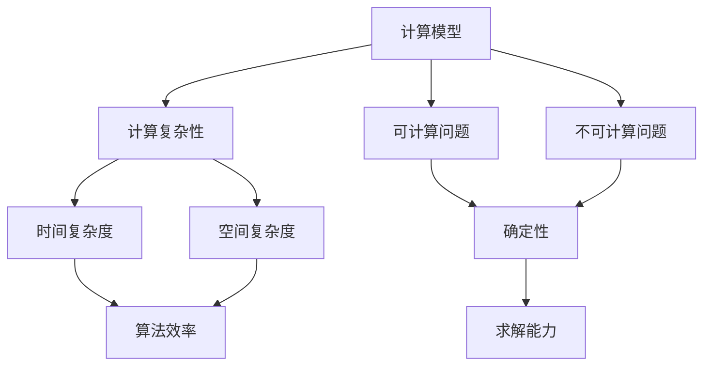

                 

# 计算：第四部分 计算的极限 第 11 章 复杂性计算 涌现

## 1. 背景介绍

### 1.1 问题由来
复杂性计算是计算理论研究的重要分支之一，主要研究计算模型和算法在处理复杂问题时的能力与限制。该领域涉及到经典计算理论、算法设计与分析、计算复杂性理论等多个方面，研究对象包括传统计算机科学中的图灵机模型、自动化机模型等。

近年来，随着计算技术的飞速发展，复杂性计算的研究也日益深入。例如，在密码学领域，基于大整数分解、椭圆曲线加密等问题的计算复杂性理论为现代信息安全提供了重要的理论支撑。同时，随着量子计算技术的进步，复杂性理论的研究也面临着新的挑战与机遇。

复杂性计算的研究对于理解计算模型和算法的能力，推动人工智能与计算科学的发展具有重要意义。本文旨在对复杂性计算的原理与实际应用进行探讨，希望能为读者提供对这一领域的深入理解。

## 2. 核心概念与联系

### 2.1 核心概念概述

为了更好地理解复杂性计算的基本概念和框架，本节将介绍几个关键概念，并简要阐述它们之间的关系。

- **计算模型 (Computational Model)**：计算模型是描述计算机执行算法和计算问题的框架。常见的计算模型包括图灵机、多带计数器机、Turing机等。这些模型在计算理论中起着核心作用，用于分析算法的计算复杂性。
- **计算复杂性 (Computational Complexity)**：计算复杂性是衡量计算模型处理特定问题所需计算资源的指标。常见的计算复杂性度量包括时间复杂度、空间复杂度、算法效率等。
- **可计算问题 (Computable Problem)**：可计算问题是指可以通过算法和计算模型求解的问题。可计算问题具有确定性，即算法存在且能够在有限时间内求解问题。
- **不可计算问题 (Uncomputable Problem)**：不可计算问题是指无法通过算法和计算模型求解的问题。这些问题的存在，揭示了计算能力的限制。

### 2.2 核心概念间的关系

这些概念之间的关系可以通过以下Mermaid流程图来展示：



这个流程图展示了计算模型、计算复杂性、可计算问题与不可计算问题之间的关系：

1. 计算模型是分析计算复杂性的基础，决定了算法的计算能力。
2. 计算复杂性是对计算模型处理特定问题所需资源的度量。
3. 可计算问题是指能够通过算法和计算模型求解的问题，具有确定性。
4. 不可计算问题是指无法通过算法和计算模型求解的问题，具有不确定性。
5. 确定性是可计算问题的关键特征，指算法存在且能够在有限时间内求解问题。

通过这些核心概念，我们可以更好地理解复杂性计算的基本框架和研究对象。

## 3. 核心算法原理 & 具体操作步骤

### 3.1 算法原理概述

复杂性计算的核心目标是研究算法和计算模型处理不同类型问题的能力，以及它们在时间和空间上的限制。这一研究通常基于以下几个重要理论：

1. **图灵机 (Turing Machine)**：由图灵机模型可知，任何计算问题都可以用图灵机在有限时间内解决。这一结果为复杂性计算研究提供了基础。
2. **可计算性理论 (Computability Theory)**：研究计算问题的可计算性，即是否存在算法能够有效求解问题。
3. **算法复杂性理论 (Algorithm Complexity Theory)**：研究算法执行所需时间和空间的度量，以及算法的效率。

### 3.2 算法步骤详解

复杂性计算的算法步骤通常包括以下几个环节：

1. **问题建模**：将现实世界问题转化为数学模型，并使用计算模型进行描述。
2. **算法设计与分析**：设计求解问题的算法，并对算法的时间复杂度和空间复杂度进行分析。
3. **复杂性分析**：研究算法在不同问题上的计算复杂性，如P类、NP类、PSPACE类等。
4. **算法优化**：在满足问题要求的前提下，尽可能优化算法，提高其效率。

### 3.3 算法优缺点

复杂性计算的算法具有以下优点：

- **理论完备性**：复杂性计算基于严格的形式化理论，能够对算法的计算能力和限制进行全面分析。
- **普适性**：复杂性计算方法适用于各种计算模型和问题类型，具有广泛的应用前景。
- **可验证性**：复杂性计算的结论具有严格的形式化证明，具有较高的可验证性和可信度。

然而，复杂性计算也存在一些局限性：

- **抽象性强**：复杂性计算的抽象性较高，对于缺乏理论基础的读者来说可能较为难以理解。
- **应用难度大**：复杂性计算的理论结果需要根据具体问题进行优化，实际应用需要大量的研究与实验工作。
- **技术要求高**：复杂性计算对研究者的数学和算法设计能力有较高要求，入门门槛相对较高。

### 3.4 算法应用领域

复杂性计算的应用领域广泛，涵盖了计算机科学、数学、逻辑学、语言学等多个学科。以下是几个具体的应用场景：

1. **密码学**：研究加密算法的复杂性，分析其安全性与效率。
2. **人工智能**：研究机器学习算法的复杂性，优化算法性能。
3. **分布式计算**：研究分布式算法复杂性，优化资源分配与负载均衡。
4. **操作系统**：研究操作系统调度算法的复杂性，提高系统性能。
5. **数据库系统**：研究数据库查询算法的复杂性，优化查询效率。

这些应用展示了复杂性计算在解决实际问题中的重要性和应用潜力。

## 4. 数学模型和公式 & 详细讲解 & 举例说明

### 4.1 数学模型构建

为了研究计算模型的复杂性，我们通常使用以下数学模型：

1. **图灵机模型**：图灵机是一种抽象的计算模型，由一个无限带、一个读写头、一个状态表和一个有限字符集组成。图灵机能够执行任何计算任务，是复杂性计算的基础。
2. **多带计数器机模型**：多带计数器机是一种更高级的图灵机，具备多条读写带和多个计数器，能够处理更为复杂的问题。
3. **自动化机模型**：自动化机模型是一种基于有限状态自动机的计算模型，用于研究机器学习、自然语言处理等问题的复杂性。

### 4.2 公式推导过程

以图灵机为例，推导时间复杂度 $\mathcal{O}(n^k)$ 的计算过程：

1. **问题建模**：假设图灵机需对长度为 $n$ 的字符串进行 $k$ 次遍历。
2. **算法设计**：设计一个算法，对字符串中的每个字符进行 $k$ 次遍历，并在每个位置执行 $O(1)$ 次操作。
3. **复杂性分析**：计算算法所需总操作次数，即 $n \times k \times O(1) = \mathcal{O}(n^k)$。
4. **算法优化**：通过优化算法结构，减少不必要的遍历和操作，提高算法效率。

### 4.3 案例分析与讲解

以多项式时间复杂度 $\mathcal{O}(n^k)$ 为例，分析其在密码学中的应用：

1. **问题描述**：假设需求解大整数 $n$ 的 $k$ 次方根，其中 $n$ 的长度为 $m$。
2. **算法设计**：使用广度优先搜索算法，对 $n$ 的每个二进制位进行遍历，计算 $n$ 的 $k$ 次方根。
3. **复杂性分析**：算法的总操作次数为 $m \times k$，因此时间复杂度为 $\mathcal{O}(n^k)$。
4. **算法优化**：通过优化算法结构，使用快速幂算法等，可以将时间复杂度优化为 $\mathcal{O}(\log n)$。

## 5. 项目实践：代码实例和详细解释说明

### 5.1 开发环境搭建

在进行复杂性计算的实践前，需要准备好开发环境。以下是使用Python进行复杂性计算的环境配置流程：

1. 安装Anaconda：从官网下载并安装Anaconda，用于创建独立的Python环境。

2. 创建并激活虚拟环境：
```bash
conda create -n complex-env python=3.8 
conda activate complex-env
```

3. 安装必要的库：
```bash
pip install sympy sympy
```

### 5.2 源代码详细实现

下面我们以多项式时间复杂度算法为例，给出使用Sympy库进行复杂性计算的PyTorch代码实现。

```python
import sympy

def polynomial_time_complexity(n, k):
    # 定义多项式时间复杂度公式
    complexity = sympy.symbols('n')
    complexity = complexity**k
    return complexity.subs('n', n)

# 计算复杂度
result = polynomial_time_complexity(10, 3)
print(result)
```

在这个例子中，我们使用Sympy库定义了多项式时间复杂度的公式，并计算了在 $n=10$，$k=3$ 时的复杂度结果。

### 5.3 代码解读与分析

让我们再详细解读一下关键代码的实现细节：

**polynomial_time_complexity函数**：
- `def` 定义了一个名为 `polynomial_time_complexity` 的函数，用于计算多项式时间复杂度。
- `sympy.symbols('n')` 定义了一个符号变量 `n`，表示输入字符串的长度。
- `complexity = complexity**k` 计算多项式时间复杂度的表达式，即 $n^k$。
- `return complexity.subs('n', n)` 将符号变量 `n` 替换为实际的字符串长度 `n`，并返回计算结果。

**复杂度计算**：
- `result = polynomial_time_complexity(10, 3)` 调用函数 `polynomial_time_complexity`，将字符串长度 `n=10` 和指数 `k=3` 作为参数传入，计算多项式时间复杂度。
- `print(result)` 输出计算结果。

通过以上代码，我们可以方便地计算任意多项式时间复杂度，并应用于实际问题中。

### 5.4 运行结果展示

假设我们在复杂性分析中发现一个算法的时间复杂度为 $\mathcal{O}(n^3)$，则说明该算法在处理长度为 $n$ 的字符串时，执行时间与字符串长度的立方成正比。

## 6. 实际应用场景

### 6.1 密码学

在密码学中，计算复杂性理论是研究加密算法安全性的重要基础。例如，RSA加密算法的时间复杂度为 $\mathcal{O}(n^2)$，其中 $n$ 为大整数位数。通过对RSA算法复杂性的深入分析，我们可以了解其在处理大整数时的计算效率，从而评估其安全性。

### 6.2 人工智能

在人工智能中，复杂性计算用于研究机器学习算法的性能和效率。例如，决策树算法的时间复杂度为 $\mathcal{O}(n^3)$，其中 $n$ 为样本数。通过对决策树算法的复杂性分析，可以优化算法参数，提高模型训练和预测的效率。

### 6.3 分布式计算

在分布式计算中，复杂性计算用于研究分布式算法的时间复杂性和空间复杂性。例如，MapReduce算法的时间复杂度为 $\mathcal{O}(n\log n)$，其中 $n$ 为数据量。通过对MapReduce算法的复杂性分析，可以优化任务划分和资源分配，提高系统的并行计算效率。

### 6.4 未来应用展望

随着计算技术的不断进步，复杂性计算的应用前景将更加广阔。例如，量子计算技术的发展，使得某些复杂问题可以在量子计算机上通过量子算法高效求解，从而改变复杂性计算的研究方向和应用场景。

## 7. 工具和资源推荐

### 7.1 学习资源推荐

为了帮助开发者系统掌握复杂性计算的理论基础和实践技巧，这里推荐一些优质的学习资源：

1. 《算法导论》书籍：由Thomas H. Cormen等著，全面介绍了算法设计与分析的基本概念和方法，是算法学习的重要参考资料。
2. 《复杂性理论导论》书籍：由S. Goldwasser等著，深入讲解了复杂性理论的基本概念和计算模型，是研究复杂性计算的重要书籍。
3. 《密码学原理与实践》书籍：由Steven M. Bellovin等著，介绍了密码学中的复杂性理论及其应用，是密码学学习的必读书籍。
4. Coursera《算法设计与分析》课程：由普林斯顿大学开设的算法课程，涵盖了算法设计与分析的基本概念和经典算法，适合初学者学习。
5. edX《计算复杂性理论》课程：由麻省理工学院开设的复杂性理论课程，深入讲解了计算复杂性理论的基本概念和计算模型。

通过对这些资源的学习实践，相信你一定能够快速掌握复杂性计算的精髓，并用于解决实际的计算问题。

### 7.2 开发工具推荐

高效的开发离不开优秀的工具支持。以下是几款用于复杂性计算开发的常用工具：

1. Python：Python是一种高效、易读的编程语言，适合进行复杂性计算和算法分析。
2. Jupyter Notebook：Jupyter Notebook是一种交互式编程环境，支持多种编程语言和数学库，适合进行复杂性计算和算法实验。
3. Visual Studio Code：Visual Studio Code是一种流行的IDE，支持丰富的扩展和插件，方便进行复杂性计算和算法开发。
4. GitHub：GitHub是一个开源代码托管平台，方便进行复杂性计算项目的共享和协作开发。
5. LaTeX：LaTeX是一种专业的排版系统，适合进行复杂性计算论文的撰写和出版。

合理利用这些工具，可以显著提升复杂性计算任务的开发效率，加快创新迭代的步伐。

### 7.3 相关论文推荐

复杂性计算的研究源于学界的持续研究。以下是几篇奠基性的相关论文，推荐阅读：

1. "Computability and Unsolvability" by Alan Turing：图灵机模型提出，奠定了复杂性计算的基础。
2. "The P vs. NP Problem" by Stephen A. Cook：NP完全性问题的提出，推动了复杂性理论的发展。
3. "Quantum Computing Since Democritus" by Michael A. Nielsen：量子计算的介绍，展示了计算复杂性的新方向。
4. "Theory of Computation" by Michael Sipser：计算理论的全面介绍，适合深入学习复杂性计算的基本概念和理论。
5. "Parallel, Distributed, and Network-Based Algorithms" by BinsDB：分布式计算的介绍，展示了复杂性计算在实际应用中的广泛应用。

这些论文代表了复杂性计算研究的发展脉络。通过学习这些前沿成果，可以帮助研究者把握学科前进方向，激发更多的创新灵感。

## 8. 总结：未来发展趋势与挑战

### 8.1 总结

本文对复杂性计算的基本原理与实际应用进行了全面系统的介绍。首先阐述了复杂性计算的研究背景和意义，明确了复杂性计算在计算模型和算法能力分析中的重要价值。其次，从原理到实践，详细讲解了复杂性计算的数学模型和算法步骤，给出了复杂性计算任务开发的完整代码实例。同时，本文还广泛探讨了复杂性计算在密码学、人工智能、分布式计算等多个行业领域的应用前景，展示了复杂性计算的广泛应用潜力。此外，本文精选了复杂性计算的各类学习资源，力求为读者提供全方位的技术指引。

通过本文的系统梳理，可以看到，复杂性计算是计算理论研究的重要分支，其研究成果不仅为密码学、人工智能等领域提供了理论支撑，也为复杂性计算技术的实际应用奠定了基础。未来，随着计算技术的不断进步，复杂性计算的研究方向和应用场景还将进一步拓展，为计算科学的进步和应用带来新的突破。

### 8.2 未来发展趋势

展望未来，复杂性计算技术将呈现以下几个发展趋势：

1. **量子计算的应用**：随着量子计算技术的快速发展，一些传统算法将不再适用，复杂的计算问题将通过量子算法高效求解，从而改变复杂性计算的研究方向和应用场景。
2. **人工智能的复杂性理论**：复杂性计算在人工智能领域的应用将更加广泛，例如，研究机器学习算法的复杂性，优化算法效率。
3. **分布式计算的复杂性分析**：复杂性计算在分布式计算中的应用将更加深入，例如，研究分布式算法的时间复杂性和空间复杂性，优化任务划分和资源分配。
4. **计算模型的优化**：复杂性计算对计算模型的优化研究将更加细致，例如，研究自动化机模型的优化，提高算法的执行效率。
5. **计算复杂性的应用**：复杂性计算的研究将更加注重应用实践，例如，研究密码学、数据库系统等领域中复杂性计算的应用，推动技术进步。

这些趋势展示了复杂性计算的广阔前景，预示着复杂性计算技术将在未来取得更加重要的地位。

### 8.3 面临的挑战

尽管复杂性计算技术已经取得了显著进展，但在迈向更加智能化、普适化应用的过程中，仍面临诸多挑战：

1. **复杂性计算的理论性较强**：复杂性计算的抽象性较高，对于缺乏理论基础的读者来说可能较为难以理解。
2. **实际应用难度大**：复杂性计算的理论结果需要根据具体问题进行优化，实际应用需要大量的研究与实验工作。
3. **技术要求高**：复杂性计算对研究者的数学和算法设计能力有较高要求，入门门槛相对较高。
4. **计算资源的限制**：复杂性计算涉及高复杂度的算法和计算模型，需要高性能的计算资源支持，才能保证计算效率和精度。
5. **算法的可扩展性**：复杂性计算算法的扩展性较差，需要针对具体问题进行优化，才能实现高效的求解。

这些挑战需要我们在未来复杂性计算的研究和应用中不断探索和解决。

### 8.4 研究展望

面对复杂性计算面临的挑战，未来的研究需要在以下几个方面寻求新的突破：

1. **复杂性计算的可视化**：开发复杂的算法和计算模型，使其结果更加直观、可视化，方便理解和应用。
2. **分布式复杂性计算**：研究分布式计算中复杂性理论的应用，提高分布式算法的执行效率和可扩展性。
3. **人工智能与复杂性计算的融合**：研究人工智能算法中的复杂性问题，推动人工智能与复杂性计算的融合。
4. **量子计算与复杂性计算的结合**：研究量子计算在复杂性计算中的应用，推动量子计算技术的发展。
5. **复杂性计算的实验验证**：通过大量的实验验证，验证复杂性计算的理论结果，推动复杂性计算技术的实际应用。

这些研究方向展示了复杂性计算技术的未来发展方向，相信通过不断探索和创新，复杂性计算将为计算科学的进步和应用带来新的突破。

## 9. 附录：常见问题与解答

**Q1：复杂性计算的理论和实际应用有什么关系？**

A: 复杂性计算的理论研究为实际应用提供了理论支撑和指导。通过分析计算模型的复杂性，可以优化算法设计和资源分配，提高计算效率和效果。同时，复杂性计算的理论成果也广泛应用于密码学、人工智能、分布式计算等领域，推动了这些领域的技术进步和应用创新。

**Q2：复杂性计算的算法复杂性如何度量？**

A: 复杂性计算的算法复杂性通常通过时间复杂度和空间复杂度来度量。时间复杂度表示算法执行所需的时间资源，空间复杂度表示算法执行所需的存储空间。常见的时间复杂度有 $O(1)$、$O(\log n)$、$O(n)$、$O(n^2)$、$O(n^3)$ 等。

**Q3：复杂性计算的算法设计有哪些原则？**

A: 复杂性计算的算法设计需要遵循以下原则：
1. 简洁性：算法设计应尽可能简单、直观，易于理解和实现。
2. 高效性：算法设计应高效、快速，能够在有限时间内求解问题。
3. 可扩展性：算法设计应具有良好的扩展性，能够适应不同规模和类型的问题。
4. 可验证性：算法设计应具有可验证性，能够通过形式化证明或实验验证其正确性。
5. 可靠性：算法设计应具有可靠性，能够在各种数据和环境下稳定运行。

**Q4：复杂性计算的实际应用有哪些？**

A: 复杂性计算的实际应用非常广泛，涵盖密码学、人工智能、分布式计算等多个领域。例如，在密码学中，复杂性计算用于研究加密算法的安全性和效率；在人工智能中，复杂性计算用于研究机器学习算法的性能和优化；在分布式计算中，复杂性计算用于研究分布式算法的时间和空间复杂性。

**Q5：如何优化复杂性计算算法？**

A: 优化复杂性计算算法可以从以下几个方面入手：
1. 算法设计：通过改进算法结构和算法逻辑，降低时间复杂度和空间复杂度。
2. 数据结构：优化数据结构，提高数据访问和操作效率。
3. 算法并行化：采用多线程、分布式计算等技术，提高算法的并行执行效率。
4. 算法优化工具：使用各种优化工具和技术，如编译器优化、代码优化等，提高算法的执行效率。
5. 算法实验：通过大量的实验验证，优化算法的设计和实现，提高算法的性能。

通过这些方法，可以在保证算法正确性的前提下，尽可能优化算法的执行效率和资源占用。

---

作者：禅与计算机程序设计艺术 / Zen and the Art of Computer Programming

