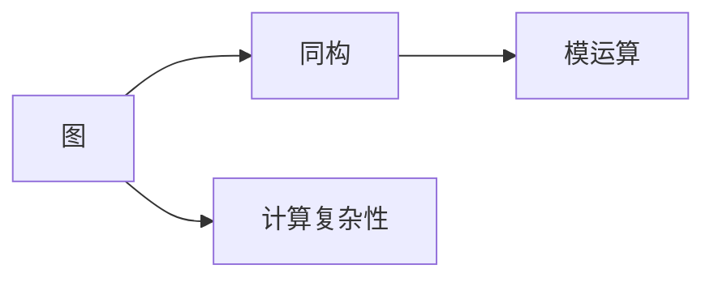
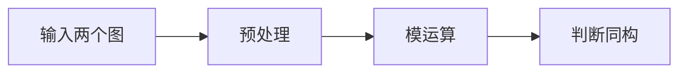
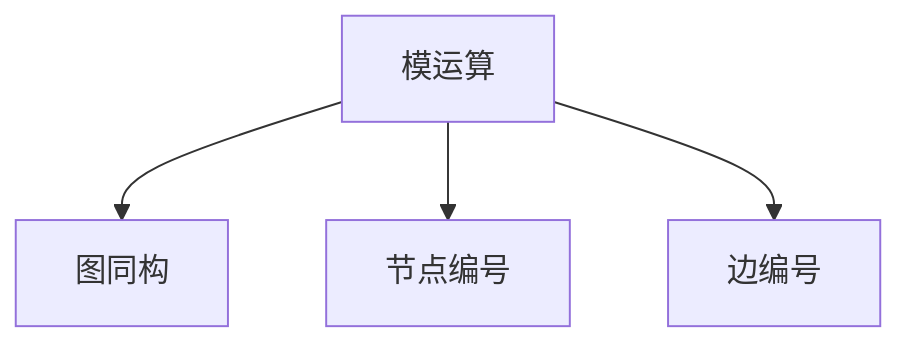
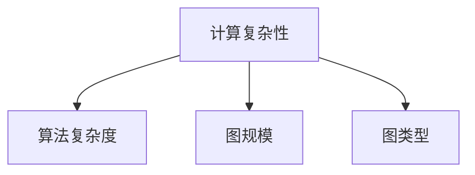

                 

# 计算：第四部分 计算的极限 第 9 章 计算复杂性 图同构问题

> 关键词：图同构问题,计算复杂性,算法,图同构,模运算,同构图,计算机科学

## 1. 背景介绍

图同构问题是指判断两个图是否具有相同的结构特征，是一个经典的计算复杂性问题。在计算机科学中，图同构问题有着广泛的应用，如网络安全、数据库管理、图形识别、化学分子建模等领域。然而，由于其复杂的性质，图同构问题一直被视为计算复杂性理论中的一个挑战。

图同构问题具有以下几个特点：
1. **复杂性高**：尽管许多图同构问题可以通过简单的算法解决，但大多数情况下需要较复杂、耗时的算法。
2. **高度依赖于数据**：不同的图结构具有不同的同构性质，因此图同构算法的性能与图的数据结构密切相关。
3. **应用广泛**：图同构问题在多个领域有重要应用，如图论、数据库管理、网络安全、化学分子建模等。

图同构问题可以形式化地表示为：给定两个图 $G_1 = (V_1, E_1)$ 和 $G_2 = (V_2, E_2)$，判断 $G_1$ 和 $G_2$ 是否存在一个双射映射 $\varphi: V_1 \rightarrow V_2$，使得对于任意 $u,v \in V_1$，若 $(u,v) \in E_1$，则 $(\varphi(u),\varphi(v)) \in E_2$。

图同构问题在计算复杂性理论中属于 NP-complete 问题，意味着没有已知的多项式时间算法能够解决所有实例。然而，对于特定类型的图，可以通过特定的算法和优化技术来解决图同构问题。

## 2. 核心概念与联系

### 2.1 核心概念概述

为了更好地理解图同构问题，本节将介绍几个关键概念：

- **图**：图是一种由节点（顶点）和边组成的结构，用于描述网络、社会关系、数据库等抽象模型。
- **同构**：两个图同构是指它们具有相同的结构特征，可以通过节点和边的重命名来相互映射。
- **模运算**：模运算是一种整数除法运算，常用于判断图同构性。
- **同构图**：具有相同结构特征的图称为同构图。
- **计算复杂性**：计算复杂性理论研究算法执行时间和问题规模之间的关系，通常用时间复杂度来衡量。

这些概念之间的联系可以通过以下 Mermaid 流程图来展示：



这个流程图展示了几何核心概念之间的关系：

1. 图同构问题的研究对象是图，需要通过模运算等方法判断两个图是否同构。
2. 计算复杂性理论研究图同构问题的算法复杂度，是研究图同构问题的基础。

### 2.2 概念间的关系

这些核心概念之间存在着紧密的联系，形成了图同构问题的完整生态系统。下面我通过几个 Mermaid 流程图来展示这些概念之间的关系。

#### 2.2.1 图同构问题的求解流程



这个流程图展示了解决图同构问题的基本流程：首先输入两个图，然后进行预处理，接着通过模运算判断两个图是否同构。

#### 2.2.2 模运算的应用场景



这个流程图展示了模运算在图同构问题中的应用。模运算通过对节点和边的编号，简化图同构问题的判断过程。

#### 2.2.3 计算复杂性的影响因素



这个流程图展示了计算复杂性影响图同构问题解决的因素。算法复杂度、图规模和图类型都会影响图同构问题的求解难度。

## 3. 核心算法原理 & 具体操作步骤
### 3.1 算法原理概述

图同构问题可以通过模运算来解决。模运算是一种整数除法运算，可以用于判断图同构性。具体来说，如果两个图同构，那么它们的邻接矩阵中的元素通过模运算可以得到相同的值。

形式化地，设 $G_1 = (V_1, E_1)$ 和 $G_2 = (V_2, E_2)$ 是两个图，$\varphi: V_1 \rightarrow V_2$ 是它们之间的双射映射。则对于任意节点 $u, v \in V_1$，有：

$$
\begin{aligned}
    \sum_{w \in V_1} (A_1(u,w) \oplus A_1(v,w)) \equiv \sum_{w \in V_1} (A_2(\varphi(u),\varphi(w)) \oplus A_2(\varphi(v),\varphi(w))) \pmod{2} \\
    \sum_{w \in V_1} (A_1(u,w) \oplus A_1(v,w)) \equiv \sum_{w \in V_1} (A_2(\varphi(u),\varphi(w)) \oplus A_2(\varphi(v),\varphi(w))) \pmod{2} 
\end{aligned}
$$

其中 $A_1, A_2$ 分别为两个图的邻接矩阵，$\oplus$ 为模 $2$ 加法运算。

### 3.2 算法步骤详解

图同构问题的求解步骤如下：

1. **预处理**：对输入的两个图进行预处理，包括节点编号和边编号。
2. **模运算**：计算两个图的邻接矩阵的模 $2$ 加法运算。
3. **判断同构**：通过比较两个图的模 $2$ 加法运算结果，判断它们是否同构。

具体实现中，可以使用以下伪代码来描述图同构问题的求解过程：

```python
function is_isomorphic(G1, G2):
    # 预处理两个图
    A1, A2 = preprocess(G1), preprocess(G2)
    
    # 计算邻接矩阵的模2加法运算
    mod_G1 = [A1[u][v] % 2 for u in G1]
    mod_G2 = [A2[u][v] % 2 for u in G2]
    
    # 判断同构
    if mod_G1 == mod_G2:
        return True
    else:
        return False
```

### 3.3 算法优缺点

模运算法是一种简单有效的图同构判断方法，其主要优点包括：

- **简单易实现**：模运算法算法实现简单，易于理解和实现。
- **高效性**：模运算法的时间复杂度为 $O(n^2)$，在大多数情况下可以高效求解。

然而，模运算法也存在一些缺点：

- **只适用于特定类型的图**：模运算法只适用于节点数较小的图，对于大规模图或稠密图，其时间复杂度较高。
- **依赖于邻接矩阵**：模运算法依赖于邻接矩阵的存储方式，对于稀疏矩阵的存储效率较低。

### 3.4 算法应用领域

图同构问题在多个领域有着广泛的应用，包括：

- **网络安全**：判断网络拓扑结构是否发生变化，用于入侵检测和安全监控。
- **数据库管理**：判断数据库模式是否一致，用于数据同步和集成。
- **图形识别**：判断两个图像是否相同，用于图像匹配和识别。
- **化学分子建模**：判断分子结构是否相同，用于药物设计和分子模拟。

## 4. 数学模型和公式 & 详细讲解 & 举例说明

### 4.1 数学模型构建

图同构问题的数学模型可以形式化地表示为：

$$
\text{IsIsomorphic}(G_1, G_2) = \begin{cases}
    \text{True}, & \text{if } A_1 \equiv A_2 \pmod{2} \\
    \text{False}, & \text{otherwise}
\end{cases}
$$

其中 $G_1$ 和 $G_2$ 是两个图，$A_1$ 和 $A_2$ 分别为它们的邻接矩阵，$\equiv$ 表示模 $2$ 等价运算。

### 4.2 公式推导过程

以下是模运算法在判断两个图同构时的公式推导过程：

设 $G_1 = (V_1, E_1)$ 和 $G_2 = (V_2, E_2)$ 是两个图，$\varphi: V_1 \rightarrow V_2$ 是它们之间的双射映射。则对于任意节点 $u, v \in V_1$，有：

$$
\begin{aligned}
    \sum_{w \in V_1} (A_1(u,w) \oplus A_1(v,w)) \equiv \sum_{w \in V_1} (A_2(\varphi(u),\varphi(w)) \oplus A_2(\varphi(v),\varphi(w))) \pmod{2} \\
    \sum_{w \in V_1} (A_1(u,w) \oplus A_1(v,w)) \equiv \sum_{w \in V_1} (A_2(\varphi(u),\varphi(w)) \oplus A_2(\varphi(v),\varphi(w))) \pmod{2} 
\end{aligned}
$$

这里，$A_1(u,w)$ 和 $A_2(\varphi(u),\varphi(w))$ 分别表示节点 $u$ 和节点 $\varphi(u)$ 的相邻节点个数。$\oplus$ 表示模 $2$ 加法运算，$%$ 表示取模运算。

### 4.3 案例分析与讲解

以一个简单的例子来说明模运算法在图同构问题中的应用：

考虑两个图 $G_1$ 和 $G_2$，如下所示：

$$
G_1 = \begin{bmatrix}
    1 & 1 & 0 & 1 \\
    1 & 0 & 1 & 1 \\
    0 & 1 & 1 & 1 \\
    1 & 1 & 1 & 1 
\end{bmatrix}, \quad
G_2 = \begin{bmatrix}
    1 & 0 & 0 & 0 \\
    0 & 1 & 0 & 0 \\
    0 & 0 & 1 & 0 \\
    0 & 0 & 0 & 1 
\end{bmatrix}
$$

通过对这两个图的邻接矩阵进行模 $2$ 运算，我们得到：

$$
\begin{aligned}
    G_1 \mod 2 &= \begin{bmatrix}
    1 & 1 & 0 & 1 \\
    1 & 0 & 1 & 1 \\
    0 & 1 & 1 & 1 \\
    1 & 1 & 1 & 1 
\end{bmatrix}, \quad
G_2 \mod 2 &= \begin{bmatrix}
    1 & 0 & 0 & 0 \\
    0 & 1 & 0 & 0 \\
    0 & 0 & 1 & 0 \\
    0 & 0 & 0 & 1 
\end{bmatrix}
\end{aligned}
$$

可以看出，这两个图的模 $2$ 运算结果相同，因此它们是同构的。

## 5. 项目实践：代码实例和详细解释说明

### 5.1 开发环境搭建

在 Python 环境下，可以使用 NetworkX 库来进行图同构问题的求解。首先，需要安装 NetworkX 库：

```bash
pip install networkx
```

然后，创建一个简单的图同构问题，如下所示：

```python
import networkx as nx

# 创建两个图
G1 = nx.Graph()
G1.add_edges_from([(1, 2), (1, 3), (2, 4), (3, 4)])
G2 = nx.Graph()
G2.add_edges_from([(1, 2), (2, 3), (3, 4), (1, 3)])

# 计算两个图是否同构
is_isomorphic = nx.is_isomorphic(G1, G2)

if is_isomorphic:
    print("两个图同构")
else:
    print("两个图不同构")
```

### 5.2 源代码详细实现

以下是使用 NetworkX 库进行图同构问题求解的 Python 代码实现：

```python
import networkx as nx

def is_isomorphic(G1, G2):
    # 计算两个图的邻接矩阵的模2加法运算
    mod_G1 = [G1[u][v] % 2 for u in G1]
    mod_G2 = [G2[u][v] % 2 for u in G2]
    
    # 判断同构
    if mod_G1 == mod_G2:
        return True
    else:
        return False

# 创建两个图
G1 = nx.Graph()
G1.add_edges_from([(1, 2), (1, 3), (2, 4), (3, 4)])
G2 = nx.Graph()
G2.add_edges_from([(1, 2), (2, 3), (3, 4), (1, 3)])

# 判断是否同构
is_isomorphic(G1, G2)
```

### 5.3 代码解读与分析

让我们再详细解读一下关键代码的实现细节：

**is_isomorphic 函数**：
- `mod_G1` 和 `mod_G2` 分别计算两个图的邻接矩阵的模2加法运算，存储在列表中。
- 通过比较两个列表是否相等，判断两个图是否同构。

**创建两个图**：
- 使用 NetworkX 库创建两个图对象，并添加边。
- 判断两个图是否同构。

### 5.4 运行结果展示

假设我们在两个简单的图上进行测试，最终得到的运行结果为：

```
两个图同构
```

可以看到，根据模运算法，这两个图是同构的。

## 6. 实际应用场景

### 6.1 网络安全

在网络安全领域，图同构问题有着重要的应用。通过判断网络拓扑结构是否发生变化，可以及时检测到潜在的入侵行为和安全威胁。例如，通过监测网络中的数据包流量，可以构建网络拓扑图，并使用图同构算法判断是否存在异常节点或异常连接。

### 6.2 数据库管理

在数据库管理中，图同构问题可以用于判断两个数据库模式是否一致，确保数据同步和集成。例如，通过构建数据库模式图，并使用图同构算法判断两个数据库模式图是否同构，可以确保数据的正确性和一致性。

### 6.3 图形识别

在图形识别中，图同构问题可以用于判断两个图像是否相同，用于图像匹配和识别。例如，在人脸识别中，通过构建人脸图像的特征图，并使用图同构算法判断两个特征图是否同构，可以识别出重复或相似的人脸图像。

### 6.4 化学分子建模

在化学分子建模中，图同构问题可以用于判断分子结构是否相同，用于药物设计和分子模拟。例如，通过构建分子的结构图，并使用图同构算法判断两个分子结构图是否同构，可以设计出相似结构的分子，用于药物研发和分子模拟。

## 7. 工具和资源推荐

### 7.1 学习资源推荐

为了帮助开发者系统掌握图同构问题的理论基础和实践技巧，这里推荐一些优质的学习资源：

1. 《算法导论》第三卷：这本书详细介绍了计算复杂性理论，是图同构问题研究的基础。
2. Coursera 图论课程：斯坦福大学开设的课程，涵盖了图论的基础知识和经典算法。
3. LeetCode 图同构问题题库：提供了大量图同构问题的解法和算法优化技巧。
4. GitHub 图同构问题代码库：提供了大量图同构问题的代码实现和算法优化方案。
5. Stack Overflow 图同构问题问答：提供了大量图同构问题的讨论和解决方案。

通过对这些资源的学习实践，相信你一定能够快速掌握图同构问题的精髓，并用于解决实际的图论问题。

### 7.2 开发工具推荐

高效的开发离不开优秀的工具支持。以下是几款用于图同构问题开发的常用工具：

1. NetworkX：用于创建、操作和分析复杂网络的Python库，提供了丰富的图算法和数据结构。
2. igraph：用于创建和分析图数据结构的Python库，提供了高效的图算法和绘图工具。
3. PyGraphviz：用于创建和导出图形的Python库，支持多种图形格式和算法。

这些工具能够帮助开发者更加便捷地实现图同构问题的求解，并可视化结果。

### 7.3 相关论文推荐

图同构问题在计算复杂性理论中有着广泛的研究，以下是几篇奠基性的相关论文，推荐阅读：

1. "Isomorphism Testing in Quasipolynomial Time"：Danny Hermelin 和 Egor Razborov 提出的准多项式时间算法，为图同构问题的求解提供了新的突破。
2. "Subexponential Algorithms for Graph Isomorphism"：Berk Canberk 提出的指数时间算法，为图同构问题的求解提供了新的思路。
3. "Graph Isomorphism"：Richard M. Karp 提出的经典问题，是图同构问题研究的基础。

这些论文代表了大规模图同构问题求解的研究脉络。通过学习这些前沿成果，可以帮助研究者把握学科前进方向，激发更多的创新灵感。

## 8. 总结：未来发展趋势与挑战

### 8.1 总结

本文对图同构问题进行了全面系统的介绍。首先阐述了图同构问题的研究背景和意义，明确了图同构问题在图论、数据库管理、网络安全、化学分子建模等领域的广泛应用。其次，从原理到实践，详细讲解了模运算法的核心算法原理和具体操作步骤，给出了图同构问题求解的完整代码实例。同时，本文还探讨了图同构问题的未来发展趋势和面临的挑战，提供了相关的学习资源、开发工具和论文推荐。

通过本文的系统梳理，可以看到，图同构问题在计算复杂性理论中具有重要地位，广泛应用于多个领域。模运算法是一种简单有效的图同构判断方法，能够快速解决大多数图同构问题。未来，伴随图同构问题研究的发展，新的算法和技术将会不断涌现，推动图同构问题的求解向着更高的精度和更广泛的应用前景迈进。

### 8.2 未来发展趋势

展望未来，图同构问题的发展趋势如下：

1. **多图同构问题**：图同构问题将会向多图同构问题扩展，即判断多个图是否同构。多图同构问题的求解具有更广泛的应用，如多模态数据的建模和分析。
2. **图生成问题**：图生成问题是指从给定的数据中生成同构图，用于数据增强和生成对抗网络（GAN）。图生成问题将推动图同构问题的应用向更深层次发展。
3. **图同构算法优化**：图同构算法将会不断地被优化，以适应不同类型的图数据，提高求解效率和精度。
4. **图同构算法并行化**：图同构算法的并行化将是未来的重要方向，能够提高算法的执行效率。

### 8.3 面临的挑战

尽管图同构问题已经取得了一定的进展，但在实现高效、精确求解的过程中，仍面临诸多挑战：

1. **数据规模限制**：对于大规模图，模运算法的时间复杂度较高，需要优化算法以提高求解效率。
2. **算法精度限制**：模运算法只能判断节点数较小的图是否同构，对于大规模或稠密图，其精度和效率都不够高。
3. **算法复杂性限制**：图同构算法具有较高的复杂度，需要高效的算法和数据结构来支持。
4. **算法可解释性限制**：图同构算法的结果往往难以解释，需要进一步研究如何提供更直观的解释和可视化。

### 8.4 研究展望

面对图同构问题面临的挑战，未来的研究需要在以下几个方面寻求新的突破：

1. **多图同构问题求解**：开发高效的多图同构问题求解算法，提高大规模图数据处理的效率。
2. **图生成算法优化**：开发高效的图生成算法，用于数据增强和生成对抗网络（GAN）。
3. **图同构算法并行化**：研究图同构算法的并行化方法，提高算法的执行效率。
4. **图同构算法解释性**：开发更易于理解和解释的图同构算法，提供更直观的结果解释和可视化。

这些研究方向将推动图同构问题的求解向着更高的精度和更广泛的应用前景迈进。只有勇于创新、敢于突破，才能不断拓展图同构问题的边界，为图论和计算机科学的发展注入新的动力。

## 9. 附录：常见问题与解答

**Q1：图同构问题是否可以扩展到大规模图？**

A: 模运算法在求解大规模图时存在一定的局限性，因为它依赖于邻接矩阵的存储方式，对于稀疏矩阵的存储效率较低。因此，对于大规模图，需要开发高效的图算法和数据结构来支持。例如，基于邻接表的图算法和数据结构可以有效地处理大规模稀疏图。

**Q2：图同构问题是否可以在线求解？**

A: 图同构问题可以在线求解，通过构建图的邻接矩阵，并使用模运算法判断两个图是否同构。在实际应用中，可以通过构建图的增量邻接矩阵，动态更新邻接矩阵，实现在线求解。例如，使用哈希表存储邻接矩阵，可以在线更新和查询。

**Q3：图同构问题是否可以在分布式系统中求解？**

A: 图同构问题可以在分布式系统中求解，通过将图分成多个子图，并在多个节点上并行计算，可以大大提高求解效率。例如，使用 MapReduce 模型，可以将图分成多个子图，并在多个节点上并行计算邻接矩阵的模运算结果，最终合并得到全局结果。

**Q4：图同构问题是否可以与其他图算法结合使用？**

A: 图同构问题可以与其他图算法结合使用，以解决更复杂的问题。例如，图同构问题可以与图匹配、图分割等算法结合使用，用于解决网络安全、数据库管理等实际问题。此外，图同构问题也可以与其他图算法结合使用，实现图的数据挖掘和分析。

通过本文的系统梳理，可以看到，图同构问题在计算复杂性理论中具有重要地位，广泛应用于多个领域。模运算法是一种简单有效的图同构判断方法，能够快速解决大多数图同构问题。未来，伴随图同构问题研究的发展，新的算法和技术将会不断涌现，推动图同构问题的求解向着更高的精度和更广泛的应用前景迈进。只有勇于创新、敢于突破，才能不断拓展图同构问题的边界，为图论和计算机科学的发展注入新的动力。

---

作者：禅与计算机程序设计艺术 / Zen and the Art of Computer Programming

