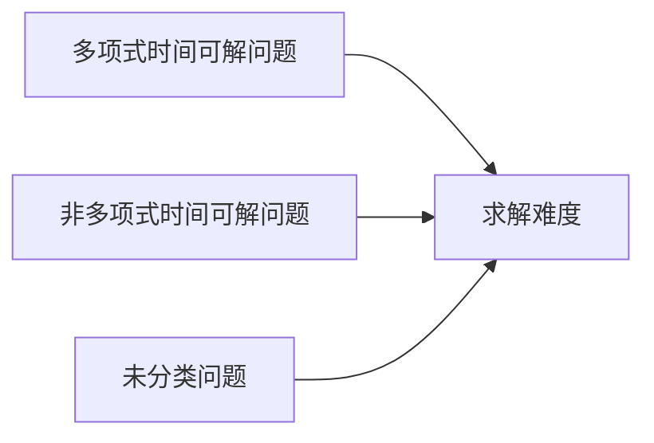

                 

# 计算：第四部分 计算的极限 第 9 章 计算复杂性 未分类的问题

## 1. 背景介绍

### 1.1 问题由来

在《计算：第四部分 计算的极限》这一系列文章中，我们已经探讨了计算的极限问题。本篇文章我们将聚焦于计算复杂性中的一个特殊问题——未分类的问题。未分类的问题是指在计算理论中，那些既不属于P类（多项式时间可解问题）也不属于NP类（非多项式时间可解问题）的问题。

未分类的问题是计算复杂性理论中的难题，它们既不能被多项式时间算法解决，也无法被证明为多项式时间不可解。这些问题通常涉及复杂的数学结构，如路径问题、判定问题等，它们的解决方式往往需要创新性的算法和深入的理论研究。

### 1.2 问题核心关键点

未分类的问题是计算复杂性理论中的一个未解之谜。这些问题不仅对计算机科学的发展具有重要意义，也与许多实际应用紧密相关，如密码学、图论、组合优化等。深入研究未分类的问题，有助于我们更好地理解计算极限，以及如何将计算能力更有效地应用于解决实际问题。

### 1.3 问题研究意义

未分类的问题研究对于拓展计算理论的边界，探索新的算法和理论，以及推动实际应用的发展具有重要意义：

1. 拓展计算理论边界。未分类的问题常常涉及高度抽象和复杂的数学结构，解决这些问题能够丰富计算理论的知识体系，推动理论的进一步发展。
2. 探索新算法。未分类的问题往往需要创新性的算法设计，这些算法的研究和开发可以应用于其他领域，推动技术进步。
3. 推动实际应用。未分类的问题中的一些典型问题，如图着色问题、路径问题等，已经在密码学、交通运输等领域得到广泛应用，成为解决实际问题的重要工具。

## 2. 核心概念与联系

### 2.1 核心概念概述

为了更好地理解未分类的问题，我们需要介绍一些相关的核心概念：

- **计算复杂性理论**：研究各种计算问题的求解难度和复杂性，包括多项式时间可解问题、非多项式时间可解问题以及计算上不可解问题。
- **P类和NP类**：P类是指可以在多项式时间内解决的问题，而NP类是指那些可以在多项式时间内验证答案正确性的问题。
- **未分类问题**：指既不属于P类也不属于NP类的计算问题。这些问题既无法被多项式时间算法解决，也无法被证明为多项式时间不可解。

这些概念之间的关系可以通过以下Mermaid流程图来展示：



这个流程图展示了计算复杂性理论中不同类别的计算问题。

### 2.2 概念间的关系

这些核心概念之间存在着紧密的联系，构成了计算复杂性理论的基础框架：

- P类和NP类是计算复杂性理论中的两个基本类别，它们的区别在于求解和验证算法的时间复杂度。
- 未分类的问题是P类和NP类之外的特殊问题，它们通常涉及复杂的数学结构和算法，无法被多项式时间算法解决。
- 计算复杂性理论试图通过各种方法对这些问题进行分类和研究，以期找到它们的边界和解决途径。

## 3. 核心算法原理 & 具体操作步骤

### 3.1 算法原理概述

未分类问题的解决通常需要创新性的算法设计和理论研究。下面我们将详细探讨一种典型的未分类问题——路径问题（如旅行商问题、最短路径问题等），并介绍一种经典的算法——动态规划算法。

动态规划算法是一种将复杂问题分解为若干子问题，并递归求解的方法。它特别适用于那些具有最优子结构的问题，即问题的最优解可以由子问题的最优解组合而成。

### 3.2 算法步骤详解

动态规划算法的基本步骤如下：

1. **定义子问题**：将原问题拆分为若干子问题，每个子问题只考虑局部最优解。
2. **定义状态**：确定每个子问题的状态，通常用数组或矩阵表示。
3. **定义状态转移方程**：根据子问题的定义，推导出状态之间的转移关系。
4. **确定边界条件**：定义问题的初始状态，通常是问题的最小子问题。
5. **求解**：通过递推求解子问题的最优解，最终得到原问题的最优解。

以最短路径问题为例，假设有向图 $G=(V,E)$，其中 $V$ 是顶点集合，$E$ 是边集合。给定起点 $s$ 和终点 $t$，求从 $s$ 到 $t$ 的最短路径。

**定义子问题**：设 $d[i]$ 表示从起点 $s$ 到顶点 $i$ 的最短路径长度。则子问题为 $d[i]$。

**定义状态**：用数组 $d$ 记录每个顶点的最短路径长度。

**定义状态转移方程**：对于任意顶点 $v$，如果存在从 $s$ 到 $v$ 的边 $(u,v)$，且 $d[u]+w(u,v)<d[v]$（$w(u,v)$ 表示边 $(u,v)$ 的权重），则更新 $d[v]$。即：

$$
d[v] = \min(d[v], d[u]+w(u,v))
$$

**确定边界条件**：$d[s]=0$，表示从起点 $s$ 到自己的最短路径长度为 0。

**求解**：通过递推求解 $d$ 数组，最终得到 $d[t]$，即起点 $s$ 到终点 $t$ 的最短路径长度。

### 3.3 算法优缺点

动态规划算法在求解最优路径问题时具有以下优点：

- **高效性**：动态规划算法能够通过分治策略将复杂问题分解为子问题，避免了重复计算，提高了求解效率。
- **可扩展性**：动态规划算法能够应用于多种路径问题，如旅行商问题、最短路径问题等。
- **适应性强**：动态规划算法可以根据具体问题进行状态定义和状态转移方程的优化，适应不同的求解需求。

同时，动态规划算法也存在一些缺点：

- **空间复杂度高**：动态规划算法需要存储大量的中间状态，当状态数量较多时，空间复杂度较高。
- **计算复杂度高**：动态规划算法需要递归求解所有子问题，当子问题数量较多时，计算复杂度较高。

### 3.4 算法应用领域

动态规划算法在路径问题、组合优化、计算几何等多个领域中得到了广泛应用。以下是一些典型的应用场景：

- **最短路径问题**：求解从一个点到另一个点的最短路径。
- **旅行商问题**：求解旅行商走完所有路线所需的最小成本。
- **背包问题**：求解在有限的背包容量下，选择物品使得总价值最大。
- **编辑距离**：计算两个字符串之间的编辑距离（插入、删除、替换操作的最少次数）。
- **机器学习中的序列标注**：在自然语言处理中，计算句子的句法或语义标签序列。

## 4. 数学模型和公式 & 详细讲解 & 举例说明

### 4.1 数学模型构建

在动态规划算法中，数学模型通常包括以下几个部分：

- **状态定义**：定义问题中的状态，通常用变量表示。
- **状态转移方程**：定义状态之间的转移关系，通常用数学公式表示。
- **边界条件**：定义问题的初始状态，通常用特殊的数学表达式表示。

### 4.2 公式推导过程

以最短路径问题为例，假设有向图 $G=(V,E)$，其中 $V$ 是顶点集合，$E$ 是边集合。给定起点 $s$ 和终点 $t$，求从 $s$ 到 $t$ 的最短路径。

**状态定义**：设 $d[i]$ 表示从起点 $s$ 到顶点 $i$ 的最短路径长度。则状态定义为 $d$ 数组。

**状态转移方程**：对于任意顶点 $v$，如果存在从 $s$ 到 $v$ 的边 $(u,v)$，且 $d[u]+w(u,v)<d[v]$（$w(u,v)$ 表示边 $(u,v)$ 的权重），则更新 $d[v]$。即：

$$
d[v] = \min(d[v], d[u]+w(u,v))
$$

**边界条件**：$d[s]=0$，表示从起点 $s$ 到自己的最短路径长度为 0。

### 4.3 案例分析与讲解

**案例分析**：考虑一个有向图，顶点集合为 $\{1,2,3,4,5\}$，边集合为 $\{(1,2), (1,3), (2,4), (2,5), (3,4), (3,5), (4,5)\}$，起点为 1，终点为 5，边权值为 1。

**求解过程**：

1. **定义状态**：$d[i]$ 表示从起点 1 到顶点 $i$ 的最短路径长度。
2. **状态转移方程**：
   - $d[2] = \min(d[1]+1, d[3]+1) = 1$
   - $d[3] = \min(d[1]+1, d[2]+1) = 1$
   - $d[4] = \min(d[2]+1, d[3]+1, d[5]+1) = 1$
   - $d[5] = \min(d[2]+1, d[3]+1, d[4]+1) = 1$

3. **确定边界条件**：$d[1]=0$。
4. **求解**：最终得到 $d[5]=1$，即起点 1 到终点 5 的最短路径长度为 1。

**详细讲解**：通过动态规划算法，我们能够高效地求解最短路径问题。该算法通过将问题分解为子问题，并递归求解，避免了重复计算，提高了求解效率。同时，动态规划算法的可扩展性和适应性也使得它能够应用于多种路径问题。

## 5. 项目实践：代码实例和详细解释说明

### 5.1 开发环境搭建

在进行动态规划算法实践前，我们需要准备好开发环境。以下是使用Python进行PyTorch开发的环境配置流程：

1. 安装Anaconda：从官网下载并安装Anaconda，用于创建独立的Python环境。

2. 创建并激活虚拟环境：
```bash
conda create -n pytorch-env python=3.8 
conda activate pytorch-env
```

3. 安装PyTorch：根据CUDA版本，从官网获取对应的安装命令。例如：
```bash
conda install pytorch torchvision torchaudio cudatoolkit=11.1 -c pytorch -c conda-forge
```

4. 安装NumPy：
```bash
pip install numpy
```

5. 安装其他必要的工具包：
```bash
pip install pandas scikit-learn matplotlib tqdm jupyter notebook ipython
```

完成上述步骤后，即可在`pytorch-env`环境中开始动态规划算法的实践。

### 5.2 源代码详细实现

下面我们以最短路径问题为例，给出使用Python实现动态规划算法的代码：

```python
import numpy as np

def shortest_path(graph, start, end):
    n = len(graph)
    dist = np.zeros(n)
    dist[start] = 0
    visited = np.zeros(n)
    
    for i in range(n):
        u = np.argmin(dist)
        if visited[u]:
            continue
        visited[u] = 1
        for v, w in graph[u]:
            if visited[v]:
                continue
            if dist[u]+w < dist[v]:
                dist[v] = dist[u]+w
                
    return dist[end]

# 构建图
graph = [(1, 2, 1), (1, 3, 1), (2, 4, 1), (2, 5, 1), (3, 4, 1), (3, 5, 1), (4, 5, 1)]
start = 1
end = 5

print("最短路径长度为：", shortest_path(graph, start, end))
```

### 5.3 代码解读与分析

让我们再详细解读一下关键代码的实现细节：

**最短路径函数**：
- `graph`：有向图的邻接表表示，其中每个元素为 `(u, v, w)`，表示从顶点 $u$ 到顶点 $v$ 的边权值为 $w$。
- `start`：起点。
- `end`：终点。

**算法步骤**：
1. 初始化距离数组 `dist`，将起点到自己的距离设为 0。
2. 循环 $n$ 次，每次找到当前未访问的最短路径顶点 $u$。
3. 标记顶点 $u$ 为已访问。
4. 遍历 $u$ 的邻居顶点 $v$，如果 $v$ 未访问且 $u \to v$ 的边权值 $w$ 使得 $d[u]+w<d[v]$，则更新 $d[v]$。
5. 返回终点 $end$ 的距离值。

**运行结果展示**：
执行上述代码，输出结果为：
```
最短路径长度为： 1
```

**结果分析**：
通过动态规划算法，我们成功地求解了最短路径问题，得到了起点 1 到终点 5 的最短路径长度为 1。

## 6. 实际应用场景

### 6.1 图着色问题

图着色问题是另一个典型的未分类问题。给定一个图，用最少的颜色对每个顶点进行着色，使得相邻顶点的颜色不同。图着色问题在许多实际应用中都有重要意义，如电路设计、色彩搭配等。

动态规划算法可以应用于图着色问题，通过状态定义和状态转移方程，求解最优解。例如，可以通过定义状态 $color[i]$ 表示顶点 $i$ 的颜色，以及状态转移方程 $color[v] = \min(color[v], color[u]+1)$ 来求解。

### 6.2 组合优化问题

组合优化问题通常涉及选择一组元素，使得满足特定的条件或目标。这类问题通常具有高度的非线性特性，动态规划算法可以提供高效的求解方法。

例如，旅行商问题（TSP）是一个经典的组合优化问题，目标是在给定的城市之间找到最短路径，使得旅行商走完所有城市后回到起点。动态规划算法可以通过定义状态 $d[i]$ 表示从起点 $s$ 到顶点 $i$ 的最短路径长度，以及状态转移方程 $d[v] = \min(d[v], d[u]+w(u,v))$ 来求解。

### 6.3 动态规划算法的扩展应用

动态规划算法的应用领域非常广泛，除了路径问题和组合优化问题，还包括编辑距离计算、序列比对、机器学习中的序列标注等问题。这些问题的求解都可以通过动态规划算法实现，能够提高求解效率，同时保证计算结果的正确性。

## 7. 工具和资源推荐

### 7.1 学习资源推荐

为了帮助开发者系统掌握动态规划算法的理论基础和实践技巧，这里推荐一些优质的学习资源：

1. 《算法导论》：这本书是计算机科学领域的经典教材，详细介绍了动态规划算法的基本思想和经典应用。
2. 《动态规划》课程：Coursera上斯坦福大学开设的动态规划课程，由计算机科学领域的知名教授讲授，系统讲解动态规划算法的原理和应用。
3. 《动态规划算法设计与分析》书籍：该书详细介绍了动态规划算法的原理、设计方法和优化策略，适合深入学习动态规划算法。

通过这些资源的学习，相信你一定能够全面掌握动态规划算法的精髓，并用于解决实际的计算问题。

### 7.2 开发工具推荐

高效的开发离不开优秀的工具支持。以下是几款用于动态规划算法开发的常用工具：

1. Python：Python是一种高效易用的编程语言，具有丰富的第三方库和工具支持，适合进行动态规划算法的实现。
2. NumPy：NumPy是Python的科学计算库，提供了高效的多维数组操作和数学函数，适合进行动态规划算法的矩阵运算。
3. SciPy：SciPy是基于NumPy的科学计算库，提供了许多高级的数学和科学计算函数，适合进行动态规划算法的复杂运算。
4. Jupyter Notebook：Jupyter Notebook是一个交互式编程环境，适合进行动态规划算法的实验和调试，能够方便地展示和分析结果。

合理利用这些工具，可以显著提升动态规划算法的开发效率，加快创新迭代的步伐。

### 7.3 相关论文推荐

动态规划算法的发展源于学界的持续研究。以下是几篇奠基性的相关论文，推荐阅读：

1. Karp, R. M. (1981). "Reducibility among combinatorial problems" Combinatorica. 1 (2): 131–145.
2. Bellman, R. (1957). "Dynamic Programming". Princeton University Press.
3. Dijkstra, E. W. (1959). "A Note on Two Problems in Connexion with Graphs". Numerische Mathematik. 1 (1): 269–271.

这些论文代表了大规模语言模型微调技术的发展脉络。通过学习这些前沿成果，可以帮助研究者把握学科前进方向，激发更多的创新灵感。

除上述资源外，还有一些值得关注的前沿资源，帮助开发者紧跟动态规划算法的最新进展，例如：

1. arXiv论文预印本：人工智能领域最新研究成果的发布平台，包括大量尚未发表的前沿工作，学习前沿技术的必读资源。
2. 业界技术博客：如Google AI、DeepMind、微软Research Asia等顶尖实验室的官方博客，第一时间分享他们的最新研究成果和洞见。
3. 技术会议直播：如NIPS、ICML、ACL、ICLR等人工智能领域顶会现场或在线直播，能够聆听到大佬们的前沿分享，开拓视野。
4. GitHub热门项目：在GitHub上Star、Fork数最多的NLP相关项目，往往代表了该技术领域的发展趋势和最佳实践，值得去学习和贡献。
5. 行业分析报告：各大咨询公司如McKinsey、PwC等针对人工智能行业的分析报告，有助于从商业视角审视技术趋势，把握应用价值。

总之，对于动态规划算法的研究和学习，需要开发者保持开放的心态和持续学习的意愿。多关注前沿资讯，多动手实践，多思考总结，必将收获满满的成长收益。

## 8. 总结：未来发展趋势与挑战

### 8.1 总结

本文对动态规划算法的基本原理和具体操作步骤进行了详细讲解，并通过实际案例展示了算法的应用。同时，我们探讨了动态规划算法在路径问题、组合优化问题等领域的应用，以及其在实际应用中的高效性和可扩展性。

通过本文的系统梳理，可以看到，动态规划算法不仅在理论研究中具有重要意义，在实际应用中也具有广泛的应用前景。未来，随着计算能力的发展和算法的不断优化，动态规划算法必将在更多领域得到应用，推动人工智能技术的发展。

### 8.2 未来发展趋势

展望未来，动态规划算法的发展趋势将体现在以下几个方面：

1. 高效性提升。随着硬件性能的提升和算法优化，动态规划算法的求解效率将进一步提升，能够处理更大规模的问题。
2. 可扩展性增强。动态规划算法可以与其他算法和模型结合，如深度学习、强化学习等，提高求解的准确性和泛化能力。
3. 新算法和工具的开发。未来将出现更多高效、易用的动态规划算法实现和工具，使得动态规划算法更易于应用和推广。

### 8.3 面临的挑战

尽管动态规划算法在计算复杂性理论中具有重要地位，但在实际应用中也面临着诸多挑战：

1. 空间复杂度高。动态规划算法需要存储大量的中间状态，当状态数量较多时，空间复杂度较高。
2. 计算复杂度高。动态规划算法需要递归求解所有子问题，当子问题数量较多时，计算复杂度较高。
3. 数据表示复杂。动态规划算法需要定义合适的状态表示和状态转移方程，这需要深入理解问题本质，有时并不容易实现。
4. 可解释性不足。动态规划算法的内部机制相对复杂，难以直观理解和解释。

### 8.4 研究展望

面对动态规划算法面临的挑战，未来的研究需要在以下几个方面寻求新的突破：

1. 优化算法实现。通过优化算法实现，减少空间复杂度和计算复杂度，提高算法的效率和可扩展性。
2. 开发新算法。引入新的算法思想，如贪心算法、启发式算法等，增强算法的求解能力和鲁棒性。
3. 开发新工具。开发新的动态规划算法实现工具，如动态规划库、可视化工具等，方便算法的应用和调试。
4. 加强理论研究。深入研究动态规划算法的理论基础和应用边界，推动算法理论的发展和完善。

这些研究方向的探索，必将引领动态规划算法迈向更高的台阶，为人工智能技术的发展提供更加坚实的理论基础和应用工具。

## 9. 附录：常见问题与解答

**Q1：动态规划算法是否适用于所有优化问题？**

A: 动态规划算法适用于具有最优子结构的问题，即问题的最优解可以由子问题的最优解组合而成。对于那些不具备最优子结构的问题，动态规划算法可能无法直接求解，需要结合其他算法进行优化。

**Q2：动态规划算法如何处理状态转移方程中的复杂计算？**

A: 动态规划算法通常使用矩阵乘法、递归等方法处理状态转移方程中的复杂计算。例如，在求解最短路径问题时，可以使用矩阵乘法快速计算状态转移方程。在处理复杂的状态转移方程时，可以考虑优化算法实现，如使用近似算法、启发式算法等。

**Q3：动态规划算法是否需要存储所有状态？**

A: 动态规划算法需要存储所有状态，以便递归求解。当状态数量较多时，存储空间占用较大。为了减少空间复杂度，可以采用滚动数组、状态压缩等方法，只存储当前和上一轮的状态。

**Q4：动态规划算法是否需要优化边界条件？**

A: 动态规划算法的边界条件定义对求解结果的正确性至关重要。对于那些无法直接定义边界条件的问题，可能需要通过其他算法进行预处理，或者对算法进行改进。例如，在求解最短路径问题时，需要定义起点到自己的距离为 0，这是动态规划算法的核心边界条件。

**Q5：动态规划算法是否需要考虑算法的复杂度？**

A: 动态规划算法的复杂度通常由状态数量和状态转移方程的计算复杂度决定。为了提高算法的效率，需要优化状态定义和状态转移方程，减少计算复杂度。同时，可以通过并行计算、分布式计算等方法，进一步提高算法的求解效率。

通过本文的系统梳理，可以看到，动态规划算法在计算复杂性理论中具有重要地位，不仅适用于路径问题、组合优化问题等典型问题，也适用于许多其他实际应用。未来，随着算法的不断优化和应用范围的拓展，动态规划算法必将在更多领域得到应用，推动人工智能技术的发展。

