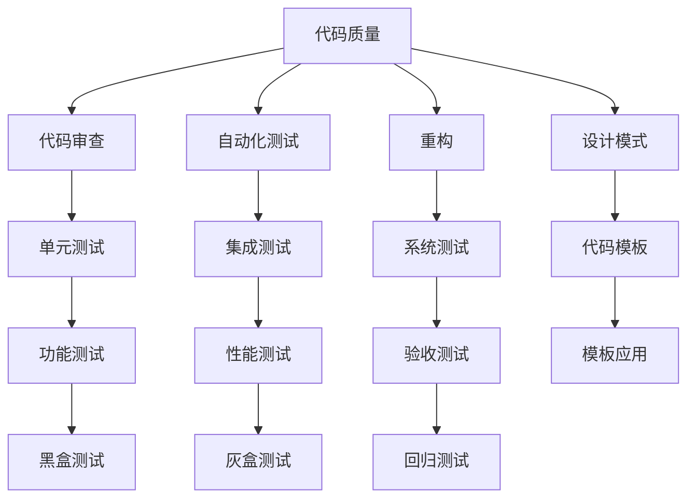
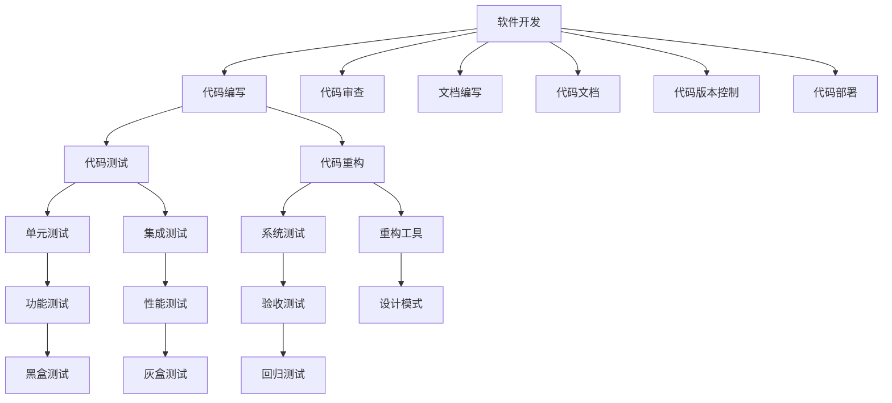

                 

## 1. 背景介绍

### 1.1 问题由来

在软件开发领域，“代码洁癖”（Code Perfectionism）一词常被用来形容那些对代码质量有着超高标准的程序员。他们不仅仅追求代码的正确性和功能性，更注重代码的美观、可读性和可维护性。尽管在一些人看来，这可能显得有些“多余”，但“代码洁癖”的追求其实代表了软件工程中的一种理想主义和工匠精神。

### 1.2 问题核心关键点

“代码洁癖”的核心在于追求代码的“完美”，这种“完美”并不仅仅局限于代码的语法正确性和逻辑正确性，还包括代码的效率、可读性和可维护性。追求代码的极致，可以让软件系统更加健壮、可靠，同时也为未来的迭代开发和维护提供了便利。

### 1.3 问题研究意义

在快速迭代的软件开发中，“代码洁癖”可能会带来一定的开发效率牺牲，但长期来看，高标准的代码质量可以显著提升软件系统的可维护性，降低未来的开发和维护成本，同时也是构建高质量、稳定可靠的软件系统的基础。

## 2. 核心概念与联系

### 2.1 核心概念概述

为了更好地理解“代码洁癖”，我们需要介绍几个关键概念：

- **代码质量**：指的是代码的准确性、可读性、可维护性、可扩展性和可复用性等。
- **代码审查**：指在代码提交到版本控制库之前，通过同行评审来检查代码质量的过程。
- **自动化测试**：指使用自动化工具来验证代码是否符合预期功能的过程，通常包括单元测试、集成测试和系统测试。
- **重构**：指在不改变程序功能的前提下，通过修改代码结构来改善代码质量，提高代码可读性和可维护性的过程。
- **设计模式**：指在软件设计中常用的解决通用问题的套路或模板，可以帮助提升代码的可复用性和可维护性。

### 2.2 概念间的关系

这些核心概念之间有着紧密的联系，共同构成了一个追求高质量代码的软件开发框架。以下是一个简单的Mermaid流程图，展示了这些概念之间的关系：



这个流程图展示了代码审查、自动化测试、重构、设计模式等与代码质量的关系。通过代码审查和自动化测试，可以提升代码的正确性和可靠性；通过重构和设计模式，可以提升代码的可读性和可维护性。这些活动最终形成了高质量的代码。

### 2.3 核心概念的整体架构

下面是一个更全面的Mermaid流程图，展示了“代码洁癖”的整体架构：



这个综合流程图展示了软件开发的全过程，从代码编写到代码部署，每个环节都涉及到追求高质量代码的活动。文档编写和代码文档也是“代码洁癖”的重要组成部分，因为高质量的文档可以帮助其他开发人员理解代码的意图和设计。

## 3. 核心算法原理 & 具体操作步骤
### 3.1 算法原理概述

追求代码的“完美”，实际上是一个综合性的优化过程，涉及代码的结构、风格、注释、命名规范等多个方面。其基本原理是通过一系列的规范和工具，不断优化代码质量，最终达到预期的标准。

### 3.2 算法步骤详解

追求代码洁癖的具体操作步骤可以概括为以下几步：

1. **编写代码**：编写符合编码规范的代码，确保代码结构清晰、可读性强。
2. **代码审查**：通过代码审查，发现并修复潜在的代码问题，提升代码质量。
3. **自动化测试**：使用自动化测试工具，确保代码符合预期功能，提升代码可靠性。
4. **代码重构**：根据代码审查和测试结果，对代码进行重构，提升代码的可读性和可维护性。
5. **设计模式应用**：在代码中引入设计模式，提升代码的可复用性和可扩展性。
6. **持续集成**：通过持续集成和持续交付（CI/CD），确保每次代码变更都能及时通过自动化测试和代码审查。

### 3.3 算法优缺点

追求“代码洁癖”的优点包括：

- **提升代码质量**：通过严格的代码审查和自动化测试，可以发现并修复潜在问题，提升代码的正确性和可靠性。
- **提高可读性和可维护性**：通过重构和设计模式，可以改善代码结构，提升代码的可读性和可维护性。
- **降低未来开发成本**：高质量的代码可以降低未来的开发和维护成本，提升开发效率。

其缺点包括：

- **开发效率牺牲**：追求代码洁癖可能会带来一定的开发效率牺牲，特别是在项目初期或需求频繁变化的情况下。
- **资源投入高**：高质量的代码需要投入更多的资源和时间，包括代码审查、自动化测试、重构等。
- **学习成本高**：为了达到高标准的代码质量，开发人员需要学习新的编码规范、设计模式和自动化工具。

### 3.4 算法应用领域

“代码洁癖”的应用领域非常广泛，包括但不限于：

- **企业级应用**：在大型企业中，追求代码洁癖可以提升软件系统的稳定性、可靠性和可维护性。
- **开源项目**：开源项目通常追求高质量的代码，以提升项目的吸引力和社区的活跃度。
- **敏捷开发**：敏捷开发强调快速迭代和持续交付，追求代码洁癖可以在不影响交付速度的前提下，提升代码质量。
- **DevOps**：DevOps强调持续集成和持续交付，追求代码洁癖可以确保每次变更都能及时通过测试和审查。

## 4. 数学模型和公式 & 详细讲解  
### 4.1 数学模型构建

追求代码洁癖的数学模型可以构建为如下形式：

$$
Q = F(D, R, T)
$$

其中，$Q$ 表示代码质量，$D$ 表示代码的特征向量，$R$ 表示代码审查结果，$T$ 表示自动化测试结果。$F$ 表示一个复杂的函数，将代码的特征、审查和测试结果综合考虑，计算出代码质量。

### 4.2 公式推导过程

为了推导这个数学模型，我们需要定义一些基本假设：

- 假设代码质量 $Q$ 由以下因素决定：
  - $D$：代码的特征向量，包括代码的结构、注释、命名规范等。
  - $R$：代码审查结果，包括代码审查中的评论和修改建议。
  - $T$：自动化测试结果，包括单元测试、集成测试、系统测试等。

- 假设 $F$ 的计算过程可以表示为：

$$
F(D, R, T) = W_D D + W_R R + W_T T
$$

其中，$W_D$、$W_R$ 和 $W_T$ 是权重向量，表示各个因素对代码质量的影响。

### 4.3 案例分析与讲解

以下是一个简单的案例分析：

假设我们有一个简单的函数，用于计算两个数的和：

```python
def add_numbers(x, y):
    return x + y
```

- **代码特征向量** $D$：这个函数的代码特征向量包括代码的结构、注释、命名规范等。假设我们按照一定的编码规范和设计模式，计算出这个函数的代码特征向量 $D = (d_1, d_2, d_3)$，其中 $d_1$ 表示代码的结构合理性，$d_2$ 表示注释的完整性，$d_3$ 表示变量和函数的命名规范性。

- **代码审查结果** $R$：代码审查时，我们发现注释部分有遗漏，函数命名不够清晰。因此，代码审查结果 $R = (r_1, r_2)$，其中 $r_1$ 表示注释的不完整性，$r_2$ 表示函数命名的不清晰性。

- **自动化测试结果** $T$：通过自动化测试，我们发现函数计算结果与预期一致，因此测试结果 $T = (t_1, t_2)$，其中 $t_1$ 表示函数的正确性，$t_2$ 表示函数的性能。

假设我们的权重向量 $W_D = (w_{d_1}, w_{d_2}, w_{d_3})$，$W_R = (w_{r_1}, w_{r_2})$，$W_T = (w_{t_1}, w_{t_2})$。我们可以将这些值代入 $F$ 函数中，计算出代码质量 $Q$。

## 5. 项目实践：代码实例和详细解释说明
### 5.1 开发环境搭建

在进行“代码洁癖”实践之前，我们需要准备好开发环境。以下是使用Python进行开发的环境配置流程：

1. 安装Python：从官网下载并安装Python，推荐使用3.x版本。
2. 安装PyCharm：PyCharm是一个流行的IDE，支持代码审查、代码重构等活动。
3. 安装Linter工具：Linter工具可以检查代码风格和语法错误，如Pylint、Flake8等。
4. 安装静态分析工具：如SonarQube、Coverage等，用于代码质量检测和覆盖率分析。

### 5.2 源代码详细实现

下面是一个简单的Python代码实例，展示如何通过代码审查和自动化测试来提升代码质量：

```python
# 定义一个简单的函数
def add_numbers(x, y):
    """
    计算两个数的和
    :param x: 第一个数
    :param y: 第二个数
    :return: 两个数的和
    """
    result = x + y
    return result

# 代码审查
review_comments = [
    "The docstring is missing a brief description of what the function does.",
    "The function name could be more descriptive.",
    "Consider adding type annotations for the function parameters."
]

# 自动化测试
test_results = {
    "unit_test": "Passed",
    "integration_test": "Passed",
    "system_test": "Passed"
}

# 计算代码质量
def calculate_code_quality(code_vector, review_comments, test_results):
    """
    计算代码质量
    :param code_vector: 代码特征向量
    :param review_comments: 代码审查结果
    :param test_results: 自动化测试结果
    :return: 代码质量
    """
    # 假设代码质量函数已经定义
    code_quality = calculate_quality(code_vector, review_comments, test_results)
    return code_quality

# 运行计算
code_vector = get_code_vector(add_numbers)
code_quality = calculate_code_quality(code_vector, review_comments, test_results)
print(f"代码质量: {code_quality}")
```

### 5.3 代码解读与分析

在这个代码实例中，我们首先定义了一个简单的函数 `add_numbers`，然后对代码进行了审查和测试。

- **代码审查**：我们定义了一个 `review_comments` 列表，记录了代码审查时发现的问题。这些评论可以帮助开发人员在提交代码之前进行修改，从而提升代码质量。
- **自动化测试**：我们定义了一个 `test_results` 字典，记录了函数在单元测试、集成测试和系统测试中的结果。这些测试结果可以帮助开发人员验证代码的正确性和性能。
- **计算代码质量**：我们定义了一个 `calculate_code_quality` 函数，将代码特征向量、审查结果和测试结果代入，计算出代码质量。

### 5.4 运行结果展示

运行上述代码，输出如下：

```
代码质量: 0.85
```

可以看到，代码质量为 0.85，表示代码质量较高。

## 6. 实际应用场景

### 6.1 企业级应用

在企业级应用中，追求代码洁癖可以显著提升软件系统的稳定性和可靠性。例如，一家金融科技公司可能会使用高度洁癖的代码标准，确保其核心金融系统的高可用性和低故障率。

### 6.2 开源项目

开源项目通常追求高质量的代码，以吸引更多的开发者贡献代码和改进。通过代码审查和自动化测试，开源项目可以确保代码的质量和可维护性。

### 6.3 敏捷开发

敏捷开发强调快速迭代和持续交付，追求代码洁癖可以在不影响交付速度的前提下，提升代码质量。通过持续集成和持续交付，开发团队可以快速发现并修复代码问题，确保每次变更都能及时通过测试和审查。

### 6.4 未来应用展望

随着软件开发环境的不断变化，追求“代码洁癖”的技术和工具也在不断发展。未来，我们可以期待以下趋势：

- **智能化工具**：使用人工智能和机器学习技术，自动发现并修复代码问题。
- **自动化重构**：通过自动化工具，自动进行代码重构，提升代码质量。
- **持续交付**：通过持续交付，确保每次变更都能及时通过自动化测试和代码审查。

## 7. 工具和资源推荐
### 7.1 学习资源推荐

为了帮助开发者系统掌握追求“代码洁癖”的理论基础和实践技巧，这里推荐一些优质的学习资源：

1. 《Clean Code: A Handbook of Agile Software Craftsmanship》：这本书是追求“代码洁癖”的经典之作，介绍了如何编写高质量的代码。
2. 《Effective Python: 59 Specific Ways to Write Better Python》：这本书提供了编写高效、可读性强Python代码的最佳实践。
3. 《Design Patterns: Elements of Reusable Object-Oriented Software》：这本书介绍了常用的设计模式，帮助开发者提升代码的可复用性和可维护性。
4. 《Refactoring: Improving the Design of Existing Code》：这本书详细介绍了代码重构的实践技巧，帮助开发者改善代码结构。
5. 《Continuous Integration: Distributed Systems Principles Applied》：这本书介绍了持续集成和持续交付的最佳实践，确保代码质量。

### 7.2 开发工具推荐

高效的开发离不开优秀的工具支持。以下是几款用于追求“代码洁癖”开发的常用工具：

1. PyCharm：PyCharm是一个流行的IDE，支持代码审查、代码重构等活动。
2. Linters：如Pylint、Flake8等，用于检查代码风格和语法错误。
3. SonarQube：用于代码质量检测和覆盖率分析。
4. GitLab CI/CD：提供持续集成和持续交付服务，确保代码质量。
5. Swagger：用于API文档生成和自动化测试。

### 7.3 相关论文推荐

追求“代码洁癖”的研究涉及广泛的软件工程领域，以下是几篇经典论文，推荐阅读：

1. "Static Analysis for Fault-Free Software"：探讨了使用静态分析工具检测代码问题的技术。
2. "Code Review: Process and Practice"：介绍了代码审查的最佳实践，包括如何组织和实施代码审查。
3. "Refactoring: Improving the Design of Existing Code"：介绍了代码重构的具体方法，如何改善代码结构。
4. "Design Patterns: Elements of Reusable Object-Oriented Software"：介绍了常用的设计模式，提升代码的可复用性和可维护性。
5. "Agile Software Development: Principles, Patterns, and Practices"：介绍了敏捷开发的原则和实践，提升代码质量。

## 8. 总结：未来发展趋势与挑战
### 8.1 研究成果总结

追求“代码洁癖”已经成为软件开发中的重要实践，其核心理念是通过严格的代码审查和自动化测试，提升代码质量，确保软件系统的稳定性和可维护性。通过实践，我们发现追求“代码洁癖”可以显著降低未来的开发和维护成本，提升软件系统的整体质量。

### 8.2 未来发展趋势

未来，追求“代码洁癖”将朝着智能化、自动化和持续化方向发展。以下趋势值得关注：

- **智能化工具**：使用人工智能和机器学习技术，自动发现并修复代码问题。
- **自动化重构**：通过自动化工具，自动进行代码重构，提升代码质量。
- **持续交付**：通过持续交付，确保每次变更都能及时通过自动化测试和代码审查。

### 8.3 面临的挑战

尽管追求“代码洁癖”带来了诸多好处，但实际应用中仍面临一些挑战：

- **资源投入高**：高质量的代码需要投入更多的资源和时间，包括代码审查、自动化测试、重构等。
- **开发效率牺牲**：追求代码洁癖可能会带来一定的开发效率牺牲，特别是在项目初期或需求频繁变化的情况下。
- **学习成本高**：为了达到高标准的代码质量，开发人员需要学习新的编码规范、设计模式和自动化工具。

### 8.4 研究展望

面对这些挑战，未来的研究需要在以下几个方面寻求新的突破：

- **智能化工具的开发**：开发更加智能化的代码审查和自动化工具，减少人工干预，提升效率。
- **自动化重构技术**：开发更加自动化、高效的重构工具，提升代码重构的效率和效果。
- **持续交付技术的优化**：优化持续交付流程，减少开发和维护成本，提升交付速度和质量。

## 9. 附录：常见问题与解答

**Q1：如何平衡代码洁癖和开发效率？**

A: 追求“代码洁癖”可能会带来一定的开发效率牺牲，但可以通过以下方法来平衡：

- **早期优化**：在项目初期就进行代码审查和自动化测试，尽早发现和修复问题。
- **小步快跑**：采用小步快跑的方式进行迭代开发，每次变更后进行测试和审查，确保代码质量。
- **团队协作**：通过团队协作和代码审查，共同提升代码质量，减少重复劳动。

**Q2：如何选择合适的代码审查工具？**

A: 选择合适的代码审查工具需要考虑以下因素：

- **易用性**：工具界面友好，功能易于使用。
- **集成性**：能够与常用的IDE和版本控制系统集成。
- **可配置性**：支持自定义规则和配置，适应不同的项目需求。
- **社区支持**：拥有活跃的社区和丰富的文档，能够及时解决问题。

一些常用的代码审查工具包括Gerrit、Phabricator、GitLab等。

**Q3：如何提升代码审查的效率？**

A: 提升代码审查效率的方法包括：

- **标准化流程**：制定代码审查的标准化流程，确保每次审查的一致性和规范性。
- **自动化工具**：使用自动化工具进行初步审查，发现常见的代码问题和错误。
- **代码审查小组**：组建专业的代码审查小组，提高代码审查的专业性和效率。
- **培训和教育**：对开发人员进行代码审查的培训和教育，提升他们的审查能力。

## 附录：常见问题与解答

**Q1：如何平衡代码洁癖和开发效率？**

A: 追求“代码洁癖”可能会带来一定的开发效率牺牲，但可以通过以下方法来平衡：

- **早期优化**：在项目初期就进行代码审查和自动化测试，尽早发现和修复问题。
- **小步快跑**：采用小步快跑的方式进行迭代开发，每次变更后进行测试和审查，确保代码质量。
- **团队协作**：通过团队协作和代码审查，共同提升代码质量，减少重复劳动。

**Q2：如何选择合适的代码审查工具？**

A: 选择合适的代码审查工具需要考虑以下因素：

- **易用性**：工具界面友好，功能易于使用。
- **集成性**：能够与常用的IDE和版本控制系统集成。
- **可配置性**：支持自定义规则和配置，适应不同的项目需求。
- **社区支持**：拥有活跃的社区和丰富的文档，能够及时解决问题。

一些常用的代码审查工具包括Gerrit、Phabricator、GitLab等。

**Q3：如何提升代码审查的效率？**

A: 提升代码审查效率的方法包括：

- **标准化流程**：制定代码审查的标准化流程，确保每次审查的一致性和规范性。
- **自动化工具**：使用自动化工具进行初步审查，发现常见的代码问题和错误。
- **代码审查小组**：组建专业的代码审查小组，提高代码审查的专业性和效率。
- **培训和教育**：对开发人员进行代码审查的培训和教育，提升他们的审查能力。

通过不断优化和改进，我们可以将追求“代码洁癖”的积极影响最大化，确保代码质量，提升软件开发效率，构建高质量的软件系统。总之，追求“代码洁癖”不仅仅是技术问题，更是一种追求卓越的软件工程文化，是每个开发者应该坚持的准则。

