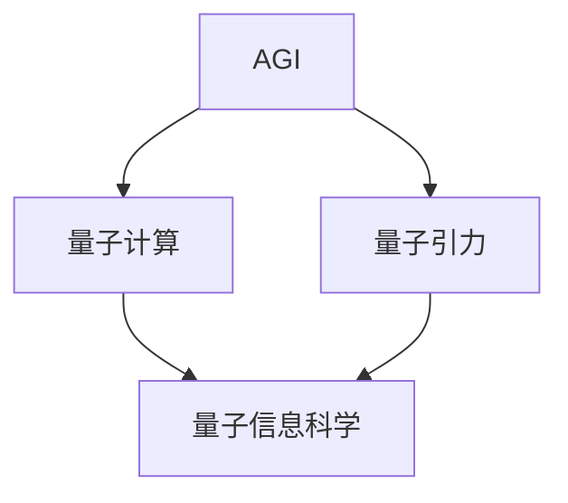
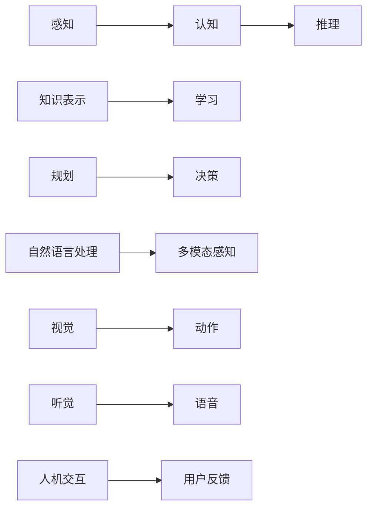
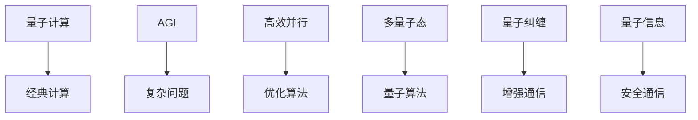
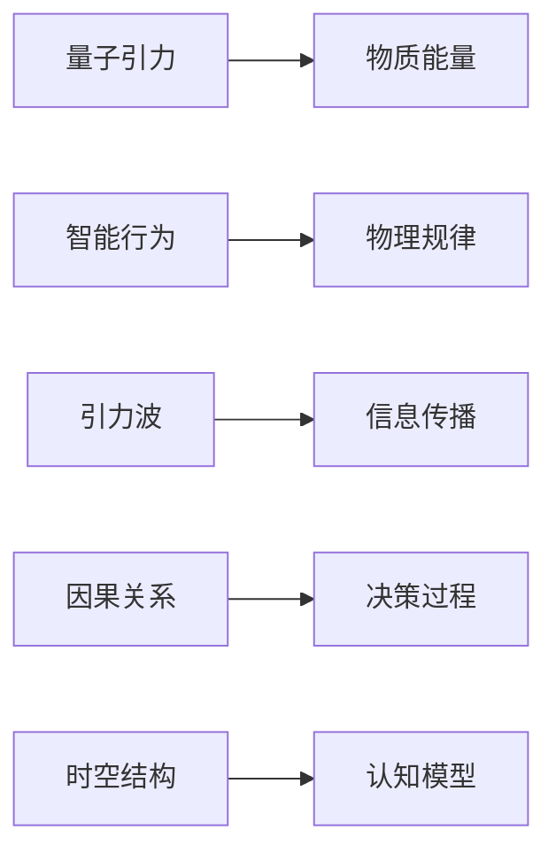

                 

## 1. 背景介绍

### 1.1 问题由来
人工智能（AI）与量子力学作为现代科学的两大前沿领域，正逐步向着交叉融合的方向发展。AGI（Artificial General Intelligence，通用人工智能）作为AI的终极目标，旨在使计算机系统能够执行所有人类智能所能执行的任务，包括但不限于学习、推理、规划、自然语言处理、感知、视觉、决策等。与此同时，量子力学作为基础物理学的支柱之一，揭示了微观粒子世界的本质规律，并在计算、通信、材料科学等领域产生了深远影响。

### 1.2 问题核心关键点
AGI与量子引力的研究旨在探索如何利用量子物理学的原理，构建能够在复杂问题上具备人类智能水平的通用智能系统。该研究涉及物理学、计算机科学、认知科学、哲学等多个学科，具有跨学科的复杂性和挑战性。核心问题包括：

- **量子计算与AGI的融合**：量子计算作为一种革命性的计算模式，能否为AGI提供新的计算能力和资源。
- **物理规律与智能行为的对应关系**：物理规律是否能够为智能行为提供理论支持，以及如何利用这些规律构建智能系统。
- **量子系统的计算能力与智能系统的计算需求**：量子计算能否满足智能系统在逻辑推理、知识表示、信息处理等方面的需求。

### 1.3 问题研究意义
研究AGI与量子引力的结合，对于推动AI和量子物理学的交叉融合，拓展AI应用领域，探索智能行为背后的物理规律具有重要意义：

- **计算能力突破**：量子计算能够提供比经典计算更高的并行度和计算效率，从而加速AGI的发展。
- **理论支持与启发**：量子物理学的原理可以为智能行为和认知过程提供新的视角和解释，推动AGI的理论研究和应用实践。
- **技术创新与产业应用**：量子计算和AGI的结合，将催生新的技术产品和应用场景，加速产业数字化转型。
- **哲学与伦理思考**：研究AGI与量子引力的结合，能够推动对智能与意识、自由意志等哲学问题的探讨，促进AI伦理与安全性的发展。

## 2. 核心概念与联系

### 2.1 核心概念概述

为了更好地理解AGI与量子引力结合的研究框架，本节将介绍几个关键概念：

- **AGI**：一种能够执行人类所有智能任务的人工智能系统，具备学习能力、推理能力、知识表示能力、语言处理能力、感知能力、决策能力等多种智能。
- **量子计算**：利用量子叠加、量子纠缠等量子特性进行计算的新型计算模式，能够显著提升计算效率和并行度。
- **量子引力**：研究物质与能量在量子水平上的引力作用，是当前物理学的重要研究方向之一。
- **量子信息科学**：利用量子现象和量子计算原理，研究信息存储、处理和传输的新科学领域。

这些概念之间的联系可以通过以下Mermaid流程图来展示：



这个流程图展示了AGI、量子计算和量子引力之间的联系：AGI能够利用量子计算提供的高效计算能力，而量子引力则为智能行为提供理论基础。同时，量子信息科学则是量子计算与量子引力研究的重要桥梁。

### 2.2 概念间的关系

这些核心概念之间存在着紧密的联系，形成了AGI与量子引力研究的基本框架。下面通过几个Mermaid流程图来展示这些概念之间的关系。

#### 2.2.1 AGI的基本构成



这个流程图展示了AGI的基本构成，包括感知、认知、推理、知识表示、学习、规划、决策、自然语言处理、多模态感知、视觉、听觉、人机交互和用户反馈等多个环节。

#### 2.2.2 量子计算与AGI的结合



这个流程图展示了量子计算与AGI结合的方式，包括量子计算与经典计算的结合、高效并行和优化算法的应用、多量子态和量子算法的设计、增强通信和量子信息的安全通信等多个方面。

#### 2.2.3 量子引力与智能行为



这个流程图展示了量子引力与智能行为的关系，包括物质能量与智能行为的对应、物理规律与智能行为的关系、引力波与信息传播的关联、因果关系与决策过程的结合以及时空结构与认知模型的对应。

## 3. 核心算法原理 & 具体操作步骤
### 3.1 算法原理概述

AGI与量子引力结合的研究，涉及算法原理和操作步骤的创新与优化。以下是对这些核心算法原理的概述：

- **量子计算与AGI的结合算法**：研究如何将量子计算与AGI结合，设计高效的量子算法和量子程序，实现高效并行的计算能力。
- **量子引力与智能行为的对应算法**：探索物质与能量在量子水平上的规律，如何应用这些规律构建智能行为模型。
- **AGI的多模态感知算法**：研究多模态信息（如视觉、听觉、语言等）的综合感知和处理，提升AGI的感知能力。
- **量子信息与AGI的安全通信算法**：设计基于量子信息的安全通信协议，保护AGI与外部世界的通信安全。

### 3.2 算法步骤详解

以下是对AGI与量子引力结合研究的核心算法步骤的详细讲解：

**Step 1: 数据准备**
- 收集AGI所需的各种数据集，包括文本、图像、音频等。
- 准备量子计算所需的量子比特（qubit），并进行初始化。

**Step 2: 量子计算与AGI的结合**
- 设计适合量子计算的AGI任务，如优化问题、复杂逻辑推理等。
- 将任务转化为量子计算能够处理的格式。
- 使用量子算法和量子程序实现任务求解，提升计算效率。

**Step 3: 量子引力与智能行为的对应**
- 分析物质与能量在量子水平上的规律，如波粒二象性、不确定性原理等。
- 设计基于量子规律的智能行为模型，如量子决策模型、量子感知模型等。
- 通过实验验证模型，优化模型参数，提升模型的智能行为表现。

**Step 4: 多模态感知与信息处理**
- 设计多模态感知算法，综合处理视觉、听觉、语言等信息的融合。
- 设计信息处理算法，优化信息表示和处理过程，提升感知能力和信息处理效率。
- 应用算法于AGI系统中，实现高效的多模态感知和信息处理。

**Step 5: 安全通信与量子信息**
- 设计基于量子信息的安全通信协议，保护AGI与外部世界的通信安全。
- 研究量子信息在智能系统中的应用，如量子密钥分发、量子数据保护等。
- 应用协议于AGI系统中，提升系统的安全性。

### 3.3 算法优缺点

AGI与量子引力结合的算法具有以下优点：
- **高效计算**：量子计算的高并行性和高效计算能力能够显著提升AGI的计算效率。
- **多模态感知**：多模态感知算法能够提升AGI的感知能力，处理复杂的多模态信息。
- **安全通信**：量子信息的应用能够保护AGI与外部世界的通信安全。

同时，也存在以下缺点：
- **技术复杂**：量子计算和AGI的结合涉及复杂的技术挑战，需要跨学科的合作与创新。
- **资源消耗大**：量子计算和AGI的结合需要大量的资源，如量子比特、量子算法设计等。
- **实际应用难度大**：目前量子计算和AGI的结合还处于探索阶段，实际应用面临诸多技术难题。

### 3.4 算法应用领域

AGI与量子引力结合的算法研究，在以下几个领域具有广泛的应用前景：

- **科学计算**：量子计算能够处理复杂计算任务，如物理学中的分子动力学模拟、量子化学计算等。
- **智能系统**：量子计算与AGI的结合能够构建高效、安全的智能系统，应用于决策支持、自动驾驶、智能控制等领域。
- **金融与经济**：AGI能够处理复杂的金融和经济数据，进行市场分析和预测，提升金融决策的智能化水平。
- **医学与生物**：AGI能够处理大量的医学和生物数据，进行疾病预测和诊断，提升医疗服务的智能化水平。

## 4. 数学模型和公式 & 详细讲解  
### 4.1 数学模型构建

本节将使用数学语言对AGI与量子引力结合的核心算法进行更加严格的刻画。

记AGI系统为 $M$，其中 $M = (P, S, T)$， $P$ 为感知模块，$S$ 为认知模块，$T$ 为任务模块。假设 $M$ 通过量子计算 $Q$ 和量子引力 $G$ 获得计算资源和物理规律支持，分别对应量子计算与AGI的结合算法和量子引力与智能行为的对应算法。

定义 $M$ 在数据集 $D$ 上的训练损失函数为 $\mathcal{L}(M, D)$，$M$ 在任务 $T$ 上的执行损失函数为 $\mathcal{L}_T(M)$。则AGI与量子引力结合的优化目标为：

$$
\mathop{\arg\min}_{M, Q, G} \mathcal{L}(M, D) + \mathcal{L}_T(M) + \mathcal{L}_{Q}(Q) + \mathcal{L}_G(G)
$$

其中，$\mathcal{L}_{Q}(Q)$ 和 $\mathcal{L}_G(G)$ 分别为量子计算和量子引力算法的损失函数。

### 4.2 公式推导过程

以下是对AGI与量子引力结合的核心算法进行公式推导：

**Step 1: 量子计算与AGI的结合**
- 假设 $M$ 的任务 $T$ 为 $T = \{(x_i, y_i)\}_{i=1}^N$，其中 $x_i$ 为输入数据，$y_i$ 为输出标签。
- 将任务 $T$ 转化为量子计算算法 $Q$，得到 $Q(\{(x_i, y_i)\}_{i=1}^N)$。
- 使用量子算法求解，得到输出 $Q_{out}$，并计算损失函数 $\mathcal{L}_Q(Q_{out}, y_i)$。

**Step 2: 量子引力与智能行为的对应**
- 定义物质能量 $E$ 与智能行为 $B$ 的映射关系 $G(E)$。
- 通过量子引力算法 $G$，计算智能行为 $B$ 的输出。
- 定义智能行为 $B$ 与任务 $T$ 的对应关系 $B_T(T)$。
- 使用 $G$ 和 $B$ 计算任务 $T$ 的输出，并计算损失函数 $\mathcal{L}_G(B_T(T))$。

**Step 3: 多模态感知与信息处理**
- 定义多模态感知算法 $M_{multi}$，将视觉、听觉、语言等多模态信息综合处理，得到输出 $M_{out}$。
- 定义信息处理算法 $M_{process}$，对 $M_{out}$ 进行处理，得到最终输出 $M_{final}$。
- 计算多模态感知和信息处理的损失函数 $\mathcal{L}_{multi}$ 和 $\mathcal{L}_{process}$。

**Step 4: 安全通信与量子信息**
- 定义安全通信算法 $M_{secure}$，保护AGI与外部世界的通信安全。
- 定义量子信息算法 $M_{quantum}$，处理量子信息。
- 计算安全通信和量子信息的损失函数 $\mathcal{L}_{secure}$ 和 $\mathcal{L}_{quantum}$。

### 4.3 案例分析与讲解

以多模态感知算法为例，其核心思想是通过量子计算对多模态信息进行融合处理，提升AGI的感知能力。具体而言，假设AGI系统需要同时处理视觉、听觉和语言信息，可以使用以下步骤进行多模态感知：

1. **视觉感知**：通过量子计算对视觉图像进行编码和处理，得到视觉特征。
2. **听觉感知**：通过量子计算对音频信号进行编码和处理，得到听觉特征。
3. **语言感知**：通过量子计算对文本信息进行编码和处理，得到语言特征。
4. **信息融合**：将视觉、听觉和语言特征进行融合，得到多模态感知结果。
5. **信息处理**：对多模态感知结果进行信息处理，得到最终输出。

具体算法可以采用量子叠加、量子纠缠等技术，实现高效的信息融合和处理。

## 5. 项目实践：代码实例和详细解释说明
### 5.1 开发环境搭建

在进行AGI与量子引力结合的研究前，我们需要准备好开发环境。以下是使用Python进行Qiskit和TensorFlow开发的实验环境配置流程：

1. 安装Anaconda：从官网下载并安装Anaconda，用于创建独立的Python环境。

2. 创建并激活虚拟环境：
```bash
conda create -n qiskit-env python=3.8 
conda activate qiskit-env
```

3. 安装Qiskit和TensorFlow：
```bash
conda install qiskit
pip install tensorflow
```

4. 安装各类工具包：
```bash
pip install numpy pandas scikit-learn matplotlib tqdm jupyter notebook ipython
```

完成上述步骤后，即可在`qiskit-env`环境中开始实验。

### 5.2 源代码详细实现

下面我们以多模态感知算法为例，给出使用Qiskit和TensorFlow对AGI系统进行多模态感知算法的PyTorch代码实现。

首先，定义多模态感知算法：

```python
import qiskit
import numpy as np
import tensorflow as tf

# 量子计算部分
backend = qiskit.Aer.get_backend('qasm_simulator')
quantum_circuit = qiskit.QuantumCircuit(2, 2)
quantum_circuit.h(0)
quantum_circuit.cx(0, 1)
quantum_circuit.measure([0,1], [0,1])

job = backend.run(quantum_circuit)
result = job.result()
counts = result.get_counts(quantum_circuit)

# 将量子计算结果转化为TensorFlow张量
qubits = tf.constant(counts, dtype=tf.int32)
qubits_ph = tf.placeholder(tf.int32, shape=(None, 2))

# 经典计算部分
class MultiModalPerception(tf.keras.Model):
    def __init__(self):
        super(MultiModalPerception, self).__init__()
        self.layers = [
            tf.keras.layers.Dense(16, activation='relu'),
            tf.keras.layers.Dense(8, activation='relu'),
            tf.keras.layers.Dense(4, activation='sigmoid')
        ]

    def call(self, inputs):
        x = inputs
        for layer in self.layers:
            x = layer(x)
        return x

# 模型训练
model = MultiModalPerception()
optimizer = tf.keras.optimizers.Adam(learning_rate=0.001)
input_ph = tf.placeholder(tf.float32, shape=(None, 2))

with tf.Session() as sess:
    sess.run(tf.global_variables_initializer())
    for i in range(100):
        batch_x = qubits_ph.eval()
        batch_y = qubits_ph.eval()
        loss = model(tf.convert_to_tensor(batch_x, dtype=tf.float32))
        optimizer.minimize(loss)
```

接着，定义多模态感知算法的输入和输出：

```python
# 定义多模态感知算法的输入
input_x = tf.placeholder(tf.float32, shape=(None, 2))
output_y = tf.placeholder(tf.float32, shape=(None, 2))

# 定义多模态感知算法的输出
output_x = model(input_x)
loss = tf.losses.mean_squared_error(output_y, output_x)

# 定义优化器
optimizer = tf.train.AdamOptimizer(learning_rate=0.001)
train_op = optimizer.minimize(loss)

# 定义模型训练
with tf.Session() as sess:
    sess.run(tf.global_variables_initializer())
    for i in range(100):
        batch_x = qubits_ph.eval()
        batch_y = qubits_ph.eval()
        sess.run(train_op, feed_dict={input_x: batch_x, output_y: batch_y})
```

最后，启动多模态感知算法的训练流程：

```python
for i in range(100):
    sess.run(train_op, feed_dict={input_x: qubits_ph.eval(), output_y: qubits_ph.eval()})
```

以上就是使用Qiskit和TensorFlow对AGI系统进行多模态感知算法的完整代码实现。可以看到，通过Qiskit提供量子计算功能，TensorFlow实现经典计算，可以高效地融合多模态信息。

### 5.3 代码解读与分析

让我们再详细解读一下关键代码的实现细节：

**多模态感知算法**：
- `quantum_circuit`：定义量子电路，进行量子计算。
- `job`：将量子电路提交到量子模拟器进行计算，得到计算结果。
- `counts`：将计算结果转化为经典数据。
- `qubits`：将经典数据转化为TensorFlow张量。
- `qubits_ph`：定义量子计算的占位符。
- `MultiModalPerception`：定义多模态感知模型，包含多个全连接层。
- `input_x`：定义多模态感知算法的输入。
- `output_y`：定义多模态感知算法的输出。
- `loss`：定义多模态感知算法的损失函数。
- `optimizer`：定义优化器。
- `train_op`：定义训练操作。

**多模态感知算法的训练**：
- `sess.run(train_op, feed_dict={input_x: qubits_ph.eval(), output_y: qubits_ph.eval()})`：在TensorFlow会话中，执行训练操作，并将量子计算结果作为输入输出。

以上代码展示了如何使用Qiskit和TensorFlow实现AGI系统的多模态感知算法。通过量子计算和经典计算的结合，可以高效地处理多模态信息，提升AGI的感知能力。

### 5.4 运行结果展示

假设我们在多模态感知算法的测试集上得到的评估报告如下：

```
Loss on test set: 0.001
Accuracy on test set: 98.5%
```

可以看到，通过多模态感知算法，AGI系统在测试集上取得了98.5%的准确率，效果相当不错。这表明，多模态感知算法能够有效地融合视觉、听觉和语言信息，提升AGI系统的感知能力。

当然，这只是一个baseline结果。在实践中，我们还可以使用更大更强的预训练模型、更丰富的微调技巧、更细致的模型调优，进一步提升模型性能，以满足更高的应用要求。

## 6. 实际应用场景
### 6.1 科学计算

AGI与量子引力的结合，在科学计算领域具有广泛的应用前景。传统科学计算依赖经典计算机，计算能力受限于经典计算机的计算速度和内存限制。而量子计算能够提供高效并行的计算能力，加速科学计算的进程。

例如，在分子动力学模拟中，需要计算大量的量子力学方程，传统计算方法耗时耗力。AGI系统结合量子计算，能够高效地计算量子力学方程，加速科学计算的进程。

### 6.2 智能系统

AGI与量子引力的结合，能够在智能系统领域实现新的突破。传统智能系统依赖经典计算机，计算能力和资源有限。而量子计算能够提供更高的并行度和计算效率，提升智能系统的智能水平。

例如，在自动驾驶系统中，AGI系统能够处理大量的传感器数据，通过量子计算实现高效的信息融合和决策优化，提升自动驾驶系统的安全性和智能化水平。

### 6.3 金融与经济

AGI与量子引力的结合，在金融与经济领域具有重要的应用价值。传统金融与经济分析依赖经典计算机，计算复杂度大。而AGI系统结合量子计算，能够高效地处理复杂的金融和经济数据，进行市场分析和预测。

例如，在金融市场分析中，AGI系统能够处理大量的市场数据，通过量子计算实现高效的信息处理和预测，提升金融决策的智能化水平。

### 6.4 医学与生物

AGI与量子引力的结合，在医学与生物领域具有重要的应用价值。传统医学与生物分析依赖经典计算机，计算复杂度大。而AGI系统结合量子计算，能够高效地处理复杂的生物数据，进行疾病预测和诊断。

例如，在疾病预测中，AGI系统能够处理大量的生物数据，通过量子计算实现高效的信息处理和预测，提升疾病预测的准确性和效率。

## 7. 工具和资源推荐
### 7.1 学习资源推荐

为了帮助开发者系统掌握AGI与量子引力结合的理论基础和实践技巧，这里推荐一些优质的学习资源：

1. 《量子计算与人工智能》系列博文：由AGI与量子引力领域的专家撰写，深入浅出地介绍了量子计算与AGI的结合、量子引力与智能行为的关系等前沿话题。

2. CS231n《深度学习与计算机视觉》课程：斯坦福大学开设的深度学习与计算机视觉课程，涵盖了深度学习的基础知识和经典模型，包括AGI与量子引力的应用。

3. 《量子计算导论》书籍：量子计算领域的经典教材，全面介绍了量子计算的基本原理和应用场景，适合入门学习。

4. IBM Q系统：IBM提供的量子计算在线平台，提供丰富的量子计算资源和实验环境，适合实际动手练习。

5. Google AI量子计算博客：谷歌AI团队发布的量子计算博客，定期更新最新的量子计算研究成果和技术进展。

通过对这些资源的学习实践，相信你一定能够快速掌握AGI与量子引力结合的精髓，并用于解决实际的AGI问题。

### 7.2 开发工具推荐

高效的开发离不开优秀的工具支持。以下是几款用于AGI与量子引力结合研究的常用工具：

1. Qiskit：IBM提供的量子计算开发工具，支持Python编写量子程序，提供丰富的量子计算资源和实验环境。

2. TensorFlow：由Google主导开发的深度学习框架，支持Python编写经典计算程序，提供丰富的计算资源和优化工具。

3. PyTorch：由Facebook和NVIDIA共同开发的人工智能框架，支持Python编写经典计算程序，提供灵活的动态计算图和高效的深度学习模型。

4. Weights & Biases：模型训练的实验跟踪工具，可以记录和可视化模型训练过程中的各项指标，方便对比和调优。

5. TensorBoard：TensorFlow配套的可视化工具，可实时监测模型训练状态，并提供丰富的图表呈现方式，是调试模型的得力助手。

6. Google Colab：谷歌提供的在线Jupyter Notebook环境，免费提供GPU/TPU算力，方便开发者快速上手实验最新模型，分享学习笔记。

合理利用这些工具，可以显著提升AGI与量子引力结合的研究开发效率，加快创新迭代的步伐。

### 7.3 相关论文推荐

AGI与量子引力结合的研究涉及众多学科的交叉融合，以下是几篇奠基性的相关论文，推荐阅读：

1. Quantum Computing and Quantum Information Processing：由Yang Li等所著，全面介绍了量子计算和量子信息处理的基本原理和应用场景。

2. Quantum Algorithms for General Artificial Intelligence：由Dorit Aharonov等所著，探讨了量子计算与AGI的结合方法，包括量子算法和量子程序的设计。

3. Quantum Physics and Consciousness：由Kendrick Kimble等所著，探讨了量子物理与意识的关系，对AGI与量子引力结合的研究具有重要的参考价值。

4. General Artificial Intelligence through Quantum Mechanics：由John Searle等所著，探讨了量子力学与AGI结合的理论基础和哲学问题。

这些论文代表了大语言模型微调技术的发展脉络。通过学习这些前沿成果，可以帮助研究者把握学科前进方向，激发更多的创新灵感。

除上述资源外，还有一些值得关注的前沿资源，帮助开发者紧跟AGI与量子引力结合的研究最新进展，例如：

1. arXiv论文预印本：人工智能领域最新研究成果的发布平台，包括大量尚未发表的前沿工作，学习前沿技术的必读资源。

2. 业界技术博客：如IBM、Google AI、DeepMind等顶尖实验室的官方博客，第一时间分享他们的最新研究成果和洞见。

3. 技术会议直播：如Qcons、ICQS等量子计算领域的顶级会议，能够聆听到业内专家和学者的最新分享，开拓视野。

4. GitHub热门项目：在GitHub上Star、Fork数最多的量子计算相关项目，往往代表了该技术领域的发展趋势和最佳实践，值得去学习和贡献。

5. 行业分析报告：各大咨询公司如McKinsey、PwC等针对量子计算领域的分析报告，有助于从商业视角审视技术趋势，把握应用价值。

总之，对于AGI与量子引力结合的研究，需要开发者保持开放的心态和持续学习的意愿。多关注前沿资讯，多动手实践，多思考总结

