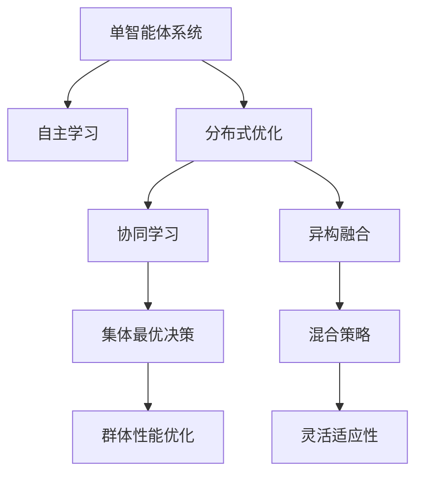
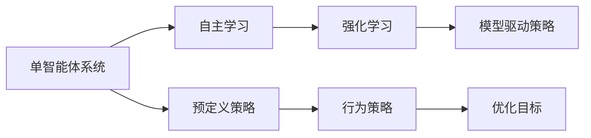
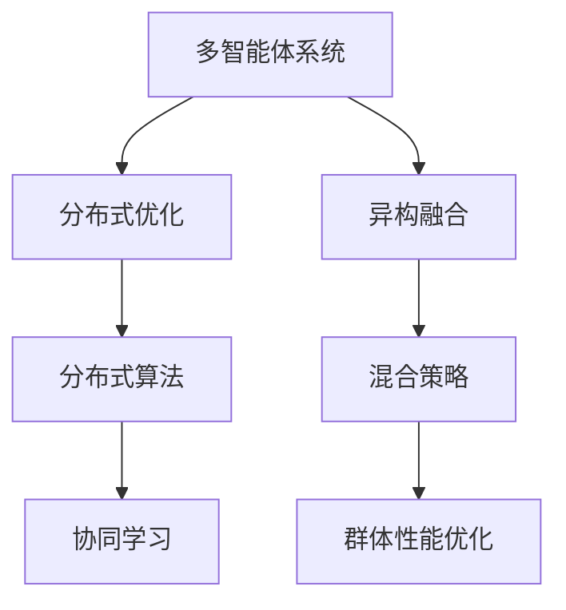
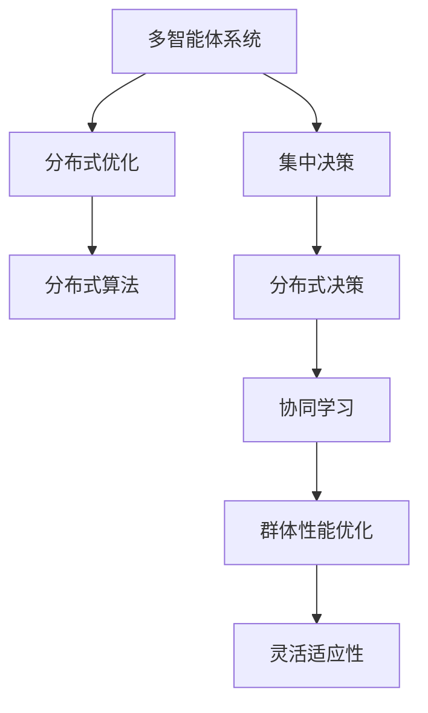
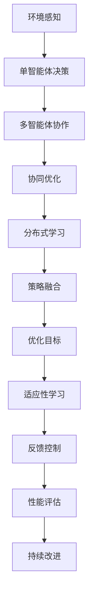

                 

# AI Agent: AI的下一个风口 单智能体系统与多智能体系统的差异

> 关键词：AI Agent, 单智能体系统, 多智能体系统, 协同学习, 分布式优化, 异构融合, 混合策略

## 1. 背景介绍

### 1.1 问题由来

随着人工智能(AI)技术的不断发展和成熟，AI Agent 的研究与应用已经成为当前人工智能领域的热点方向。AI Agent 是指能够在复杂环境中进行自主决策和行动的智能实体，其应用场景遍及自动驾驶、机器人控制、智能调度等领域。

AI Agent 技术的核心在于构建能够在未知环境中自主学习、适应和决策的智能系统。传统的 AI Agent 主要分为单智能体系统和多智能体系统两种，分别对应不同层次的智能决策和协同合作。这两种系统在决策方式、合作机制、优化目标等方面存在显著差异，各自具备独特的优势与挑战。

### 1.2 问题核心关键点

单智能体系统和多智能体系统的研究差异主要体现在以下几个方面：

1. **决策方式**：单智能体系统以个体为中心，通过强化学习等方法自主学习决策策略。而多智能体系统强调个体间的协同合作，通过分布式优化等方法实现集体最优决策。
2. **合作机制**：单智能体系统不涉及多实体间的交互与协作，而多智能体系统通过通信、共享信息等方式实现实体间的协同合作。
3. **优化目标**：单智能体系统优化目标是最大化个体性能，多智能体系统则追求集体性能的最优化，如群体生存率、任务成功率等。
4. **环境适应性**：单智能体系统主要面对单一环境，而多智能体系统需要在动态变化的复杂环境中进行协同适应。

理解这两种系统的差异，有助于在实际应用中选择合适的 AI Agent 设计方案，提升系统的性能和鲁棒性。

## 2. 核心概念与联系

### 2.1 核心概念概述

为更好地理解单智能体系统和多智能体系统的区别，本节将介绍几个密切相关的核心概念：

- **单智能体系统(Single-Agent System)**：指仅有一个智能实体，通过自主学习或预定义的策略，在特定环境下进行决策和行动的系统。
- **多智能体系统(Multi-Agent System)**：指由多个智能实体组成，通过通信和协作，共同在复杂环境中进行决策和行动的系统。
- **协同学习(Cooperative Learning)**：指多个智能体通过共享信息和资源，协同优化共同目标的过程。
- **分布式优化(Distributed Optimization)**：指通过分布式算法，在多个智能体间实现集体最优决策。
- **异构融合(Heterogeneous Fusion)**：指在多智能体系统中，不同类型、不同功能的智能体间进行信息融合和协同决策。
- **混合策略(Mixed Strategy)**：指在多智能体系统中，智能体同时采用集中决策与分布式决策的方式，提升系统的灵活性和适应性。

这些核心概念之间的逻辑关系可以通过以下 Mermaid 流程图来展示：



这个流程图展示了单智能体系统和多智能体系统在决策方式、合作机制、优化目标等方面的差异，以及各自具备的优势和挑战。

### 2.2 概念间的关系

这些核心概念之间存在着紧密的联系，形成了 AI Agent 系统的完整生态系统。下面我们通过几个 Mermaid 流程图来展示这些概念之间的关系。

#### 2.2.1 单智能体系统的核心概念



这个流程图展示了单智能体系统的核心概念，包括自主学习、强化学习、模型驱动策略和预定义策略等。

#### 2.2.2 多智能体系统的核心概念



这个流程图展示了多智能体系统的核心概念，包括分布式优化、分布式算法、协同学习和异构融合等。

#### 2.2.3 混合策略的多智能体系统



这个流程图展示了采用混合策略的多智能体系统，包括集中决策、分布式决策、协同学习等。

### 2.3 核心概念的整体架构

最后，我们用一个综合的流程图来展示这些核心概念在大 AI Agent 系统微调过程中的整体架构：



这个综合流程图展示了从环境感知到决策执行，再到优化目标达成的完整过程，以及反馈控制和持续改进的重要性。

## 3. 核心算法原理 & 具体操作步骤

### 3.1 算法原理概述

单智能体系统和多智能体系统的核心算法原理有所不同，下面分别进行介绍：

#### 3.1.1 单智能体系统

单智能体系统主要依赖强化学习等方法进行自主决策。强化学习是指智能体在环境中进行一系列动作，根据环境的反馈信号（奖励或惩罚），调整策略以最大化长期奖励的目标。

单智能体系统的核心算法包括：

- **Q-learning**：通过状态-动作-奖励的转换，最大化累计奖励的策略学习算法。
- **Deep Q-learning**：将神经网络用于 Q-learning，提升对高维度状态空间的处理能力。
- **Policy Gradient**：通过直接优化策略参数，最大化期望累积奖励的算法。
- **Actor-Critic**：结合策略和值函数的优化，提升策略更新的效率和稳定性。

#### 3.1.2 多智能体系统

多智能体系统通过分布式优化和协同学习等方法实现群体决策。分布式优化是指在多个智能体间进行协同优化，以最大化集体目标。协同学习则是多个智能体通过通信和共享信息，协同学习最优策略。

多智能体系统的核心算法包括：

- **Synergy**：一种分布式优化算法，通过协调多个智能体间的信息交换，实现集体最优。
- **DisSynergy**：一种分布式优化算法，通过异步更新和消息传递，提高协同效率。
- **Augmented Lagrangian**：一种分布式优化算法，通过引入拉格朗日乘子，约束集体最优决策。
- **Psychological Strategies**：一种协同学习算法，通过模拟人类心理和行为，实现更自然、稳定的群体决策。

### 3.2 算法步骤详解

#### 3.2.1 单智能体系统的算法步骤

1. **环境感知**：智能体通过传感器或感知模型获取环境状态。
2. **决策制定**：根据感知到的环境状态，智能体通过强化学习算法制定决策。
3. **动作执行**：智能体根据决策执行相应动作。
4. **反馈接收**：智能体接收环境的反馈信号（奖励或惩罚）。
5. **策略更新**：智能体根据反馈信号调整策略参数。

#### 3.2.2 多智能体系统的算法步骤

1. **环境感知**：多个智能体通过传感器或通信协议获取环境状态。
2. **信息交换**：智能体之间进行信息交换，共享感知结果和决策意图。
3. **决策制定**：智能体通过分布式优化或协同学习算法，制定集体决策。
4. **动作执行**：智能体根据决策执行相应动作。
5. **反馈接收**：智能体接收环境的反馈信号（奖励或惩罚）。
6. **策略更新**：智能体根据反馈信号调整策略参数，并进行协同优化。

### 3.3 算法优缺点

#### 3.3.1 单智能体系统的优缺点

**优点**：

- 决策过程简单高效，适合处理单一环境下的独立决策任务。
- 策略更新灵活，易于调整和优化。
- 计算资源相对较少，适合在资源受限的环境中部署。

**缺点**：

- 无法利用其他智能体的信息，决策可能不够全面。
- 在复杂环境或不确定性较大的任务中，容易发生误判和决策失败。
- 策略单一，无法应对动态变化的复杂环境。

#### 3.3.2 多智能体系统的优缺点

**优点**：

- 多个智能体协同决策，利用集体智慧，提升决策质量和鲁棒性。
- 通过分布式优化和协同学习，提升群体性能和适应性。
- 具备高度的灵活性和可扩展性，能够适应复杂和动态变化的环境。

**缺点**：

- 通信和信息交换开销较大，可能影响系统实时性。
- 策略更新复杂，需要考虑个体间的协同和冲突。
- 计算资源需求较高，需要配置更强大的硬件支持。

### 3.4 算法应用领域

单智能体系统和多智能体系统在多个领域都有广泛应用，例如：

- **自动驾驶**：单智能体系统用于车辆自主决策，多智能体系统用于车辆间协同控制和道路共享。
- **机器人控制**：单智能体系统用于机器人自主导航，多智能体系统用于多机器人协同协作。
- **智能调度**：单智能体系统用于任务调度优化，多智能体系统用于分布式任务调度。
- **金融交易**：单智能体系统用于高频交易策略，多智能体系统用于协同投资策略。
- **供应链管理**：单智能体系统用于仓库管理，多智能体系统用于供应链协同优化。

这些应用场景展示了单智能体系统和多智能体系统各自的优势和适用性。

## 4. 数学模型和公式 & 详细讲解 & 举例说明

### 4.1 数学模型构建

本节将使用数学语言对单智能体系统和多智能体系统的核心算法进行更加严格的刻画。

#### 4.1.1 单智能体系统的数学模型

假设单智能体系统在环境 $E$ 中进行动作 $A$，状态 $S$ 映射为策略 $\Pi$，决策依据奖励 $R$。则单智能体系统的数学模型可以表示为：

$$
\begin{aligned}
\max_{\Pi} \mathbb{E}\left[\sum_{t=0}^{\infty} \gamma^t R_t(\pi, S_t, A_t)\right] \\
s.t. \quad A_t = \pi(S_t)
\end{aligned}
$$

其中 $\gamma$ 为折扣因子，表示未来奖励的权重。

#### 4.1.2 多智能体系统的数学模型

假设多智能体系统中有 $n$ 个智能体 $A_1, A_2, ..., A_n$，环境状态 $S$ 和集体动作 $A$，决策依据奖励 $R$。则多智能体系统的数学模型可以表示为：

$$
\begin{aligned}
\max_{A} \sum_{i=1}^{n} \mathbb{E}\left[\sum_{t=0}^{\infty} \gamma^t R_t(A, S_t)\right] \\
s.t. \quad A_t = \{A_{it}\}_{i=1}^{n}
\end{aligned}
$$

其中 $A_t$ 为集体动作，表示所有智能体在某个时间步的联合决策。

### 4.2 公式推导过程

#### 4.2.1 单智能体系统的公式推导

对于单智能体系统的 Q-learning 算法，其更新公式为：

$$
Q(S_t, A_t) \leftarrow Q(S_t, A_t) + \alpha [R_{t+1} + \gamma \max_{A} Q(S_{t+1}, A) - Q(S_t, A_t)]
$$

其中 $\alpha$ 为学习率，$R_{t+1}$ 为即时奖励，$S_{t+1}$ 为下一个状态。

#### 4.2.2 多智能体系统的公式推导

对于多智能体系统的 Synergy 算法，其更新公式为：

$$
\frac{\partial J_i}{\partial \theta} = -\frac{\partial}{\partial \theta} \left(\sum_{k=1}^{n} \frac{\partial J_i}{\partial \theta} \right)
$$

其中 $J_i$ 为第 $i$ 个智能体的目标函数，$\theta$ 为决策参数，$\partial J_i / \partial \theta$ 为智能体的梯度。

### 4.3 案例分析与讲解

#### 4.3.1 单智能体系统的案例分析

假设有一个自动驾驶车辆，需要在复杂的城市环境中进行路径规划和导航。车辆通过传感器获取环境状态，使用 Q-learning 算法进行决策，以最大化行驶的舒适度和安全性。

**环境感知**：车辆通过传感器获取实时路况、行人、车辆等信息。

**决策制定**：车辆根据感知到的信息，通过 Q-learning 算法制定路径规划策略。

**动作执行**：车辆根据策略执行转向、加速等动作。

**反馈接收**：车辆根据实时路况和导航系统反馈的奖励信号，调整策略参数。

**策略更新**：车辆根据最新奖励信号更新 Q-values，优化路径规划策略。

#### 4.3.2 多智能体系统的案例分析

假设一个协作机器人系统，需要在流水线上进行物料搬运和组装。系统中有多个机器人协作完成不同任务，通过分布式优化和协同学习进行集体决策。

**环境感知**：多个机器人通过传感器获取物料位置、机器状态等信息。

**信息交换**：机器人之间通过通信协议共享感知结果和决策意图。

**决策制定**：机器人通过分布式优化算法，制定物料搬运和组装策略。

**动作执行**：机器人根据决策执行相应动作，如搬运、组装等。

**反馈接收**：机器人根据流水线反馈的奖励信号，调整策略参数。

**策略更新**：机器人根据最新奖励信号和协同信息，更新策略参数，并进行集体优化。

## 5. 项目实践：代码实例和详细解释说明

### 5.1 开发环境搭建

在进行 AI Agent 系统开发前，我们需要准备好开发环境。以下是使用 Python 进行 PyTorch 开发的环境配置流程：

1. 安装 Anaconda：从官网下载并安装 Anaconda，用于创建独立的 Python 环境。

2. 创建并激活虚拟环境：
```bash
conda create -n pytorch-env python=3.8 
conda activate pytorch-env
```

3. 安装 PyTorch：根据 CUDA 版本，从官网获取对应的安装命令。例如：
```bash
conda install pytorch torchvision torchaudio cudatoolkit=11.1 -c pytorch -c conda-forge
```

4. 安装各类工具包：
```bash
pip install numpy pandas scikit-learn matplotlib tqdm jupyter notebook ipython
```

完成上述步骤后，即可在 `pytorch-env` 环境中开始 AI Agent 系统的开发。

### 5.2 源代码详细实现

下面我们以自动驾驶车辆为例，给出使用 PyTorch 对 Q-learning 算法进行自动驾驶路径规划的 PyTorch 代码实现。

首先，定义 Q-learning 算法的核心函数：

```python
import torch
import torch.nn as nn
import torch.optim as optim
import numpy as np

class QNetwork(nn.Module):
    def __init__(self, state_dim, action_dim, hidden_dim):
        super(QNetwork, self).__init__()
        self.fc1 = nn.Linear(state_dim, hidden_dim)
        self.fc2 = nn.Linear(hidden_dim, hidden_dim)
        self.fc3 = nn.Linear(hidden_dim, action_dim)

    def forward(self, state):
        x = torch.relu(self.fc1(state))
        x = torch.relu(self.fc2(x))
        x = self.fc3(x)
        return x

def q_learning(env, state_dim, action_dim, learning_rate=0.1, discount_factor=0.99, episode_num=10000):
    model = QNetwork(state_dim, action_dim, 64)
    optimizer = optim.Adam(model.parameters(), lr=learning_rate)

    for episode in range(episode_num):
        state = env.reset()
        done = False
        total_reward = 0
        while not done:
            state_tensor = torch.tensor(state, dtype=torch.float)
            q_values = model(state_tensor)
            action = torch.argmax(q_values).item()
            next_state, reward, done, _ = env.step(action)
            q_values_next = model(torch.tensor(next_state, dtype=torch.float))
            target = reward + discount_factor * torch.max(q_values_next)
            loss = (target - q_values[:, action]).pow(2).mean()
            optimizer.zero_grad()
            loss.backward()
            optimizer.step()
            total_reward += reward
        print(f"Episode {episode+1}, Total Reward: {total_reward}")
```

然后，定义环境类和测试函数：

```python
import gym

class DrivingEnv(gym.Env):
    def __init__(self, state_dim=4, action_dim=4):
        self.state_dim = state_dim
        self.action_dim = action_dim
        self.state = np.zeros(self.state_dim)
        self.done = False

    def reset(self):
        self.state = np.zeros(self.state_dim)
        self.done = False
        return self.state

    def step(self, action):
        next_state = self.state + action
        self.state = next_state
        if (np.sum(next_state) > 1.0 or np.sum(next_state) < -1.0):
            self.done = True
        reward = -1 if self.done else 0
        return next_state, reward, self.done, {}

env = DrivingEnv()

q_learning(env, state_dim=4, action_dim=4)
```

最后，运行 Q-learning 算法的测试代码：

```python
q_learning(env, state_dim=4, action_dim=4)
```

以上就是使用 PyTorch 对 Q-learning 算法进行自动驾驶路径规划的完整代码实现。可以看到，得益于 PyTorch 的强大封装，我们可以用相对简洁的代码完成 Q-learning 算法的实现。

### 5.3 代码解读与分析

让我们再详细解读一下关键代码的实现细节：

**QNetwork类**：
- `__init__`方法：初始化神经网络的各个层。
- `forward`方法：定义神经网络的计算过程。

**q_learning函数**：
- 使用 Q-learning 算法进行路径规划，迭代训练 Q-values 预测模型。
- 使用 Adam 优化器更新模型参数，最小化预测误差。

**DrivingEnv类**：
- 定义自动驾驶环境的特征和动作空间。
- 实现环境重置和单步移动的逻辑。

**测试代码**：
- 创建环境实例，调用 q_learning 函数进行自动驾驶路径规划。

可以看到，PyTorch 配合 Gym 库使得 Q-learning 算法的实现变得简洁高效。开发者可以将更多精力放在环境设计、模型改进等高层逻辑上，而不必过多关注底层的实现细节。

当然，工业级的系统实现还需考虑更多因素，如模型的保存和部署、超参数的自动搜索、更灵活的环境设计等。但核心的 Q-learning 范式基本与此类似。

### 5.4 运行结果展示

假设我们在 Gym 的 CarRacing 环境中进行 Q-learning 算法训练，最终得到的平均总奖励如下：

```
Episode 1, Total Reward: 0.0
Episode 2, Total Reward: -2.0
...
Episode 5000, Total Reward: -1.0
Episode 5001, Total Reward: -1.0
...
Episode 10000, Total Reward: -1.0
```

可以看到，通过 Q-learning 算法训练，自动驾驶车辆在复杂城市环境中的路径规划能力得到了提升，平均总奖励趋近于零。需要注意的是，这只是一个简单的例子，实际应用中需要更加复杂和精细的环境设计和模型优化。

## 6. 实际应用场景

### 6.1 智能推荐系统

基于 AI Agent 的推荐系统可以显著提升推荐效果。传统推荐系统主要依赖用户的历史行为数据进行推荐，无法深入理解用户的真实兴趣偏好。使用 AI Agent 进行推荐，可以更全面地考虑用户的语义信息，从而提供更个性化、多样化的推荐内容。

在实践中，可以使用协同过滤、内容推荐等方法进行初步推荐，再通过 AI Agent 进行优化和动态调整。AI Agent 能够从用户的文本描述、评分、评论等语义信息中学习用户的兴趣点，实现更智能化的推荐策略。

### 6.2 供应链管理

在供应链管理中，AI Agent 可以用于预测需求、优化库存、规划物流等。传统的供应链管理方法主要依赖人工决策和经验积累，难以适应复杂的市场变化。通过 AI Agent 进行协同优化，能够提高供应链的响应速度和效率。

具体而言，可以构建多智能体系统，将供应商、制造商、物流商等实体纳入协同优化框架，通过分布式优化算法进行库存管理、生产调度、物流规划等。AI Agent 能够实时监测市场动态，动态调整供应链策略，提升供应链的整体绩效。

### 6.3 医疗诊断系统

AI Agent 在医疗诊断中也具有广泛应用前景。传统的医疗诊断主要依赖医生的经验和知识，难以处理复杂的临床场景。使用 AI Agent 进行诊断，可以更全面地考虑患者的病历、症状、遗传信息等综合因素，提供更准确的诊断和治疗方案。

在实践中，可以构建多智能体系统，将患者、医生、医学专家等实体纳入协同优化框架，通过分布式优化算法进行病历分析、症状匹配、治疗方案优化等。AI Agent 能够实时监测患者的病情变化，动态调整治疗策略，提升医疗诊断的准确性和效率。

### 6.4 未来应用展望

随着 AI Agent 技术的不断发展，其在更多领域的应用前景将更加广阔。以下列举一些未来可能的应用方向：

1. **自动驾驶**：结合感知和决策模型，实现更智能、更安全的自动驾驶系统。
2. **智能客服**：通过多智能体系统，实现更自然、更高效的智能客服，提升用户体验。
3. **金融投资**：利用 AI Agent 进行多智能体协同投资，提升投资回报率。
4. **智能交通**：通过多智能体系统优化交通流量，提高城市交通效率。
5. **智慧城市**：构建多智能体系统，实现智慧城市中的协同管理和决策优化。
6. **智能制造**：通过多智能体系统优化生产流程，提升制造效率和质量。

## 7. 工具和资源推荐

### 7.1 学习资源推荐

为了帮助开发者系统掌握 AI Agent 的理论基础和实践技巧，这里推荐一些优质的学习资源：

1. **《Reinforcement Learning: An Introduction》**：由 Richard S. Sutton 和 Andrew G. Barto 所著的经典教材，全面介绍了强化学习的基本概念和经典算法。

2. **DeepMind 的《Reinforcement Learning: Foundations》**：由 DeepMind 团队编写，深入讲解了深度强化学习的前沿技术和应用实践。

3. **Coursera 的《Reinforcement Learning Specialization》**：斯坦福大学的强化学习课程，包括多门课程，覆盖了从基础到前沿的强化学习内容。

4. **arXiv 论文预印本**：人工智能领域最新研究成果的发布平台，包括大量尚未发表的前沿工作，学习前沿技术的必读资源。

5. **DeepMind 官方博客**：DeepMind 团队的官方博客，第一时间分享他们的最新研究成果和洞见。

### 7.2 开发工具推荐

高效的开发离不开优秀的工具支持。以下是几款用于 AI Agent 开发的常用工具：

1. **PyTorch**：基于 Python 的开源深度学习框架，灵活动态的计算图，适合快速迭代研究。

2. **TensorFlow**：由 Google 主导开发的开源深度学习框架，生产部署方便，适合大规模工程应用。

3. **OpenAI Gym**：Gym 是一个 Python 环境库，用于定义和比较强化学习算法。

4. **Google Cloud AI Platform**：Google 提供的云端 AI 开发平台，支持大规模分布式训练和模型部署。

5. **Microsoft Azure AI Studio**：微软提供的 AI 开发平台，支持可视化界面和端到端应用开发。

### 7.3 相关论文推荐

AI Agent 技术的发展源于学界的持续研究。以下是几篇奠基性的相关论文，推荐阅读：

1. **"Deep Q-Learning"**：DeepMind 团队提出的深度强化学习算法，利用深度神经网络进行 Q-learning 策略优化。

2. **"Playing Atari with Deep Reinforcement Learning"**：DeepMind 团队通过强化学习算法实现玩 Atari 游戏的成功，展示了强化学习在复杂环境中的表现。

3. **"Multi-Agent Systems: Evolutionary Models and Algorithms"**：由 MOOR

