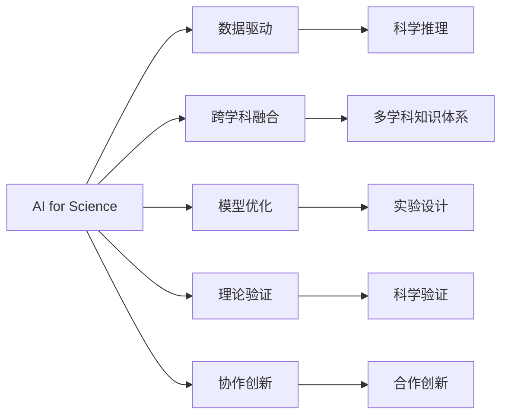
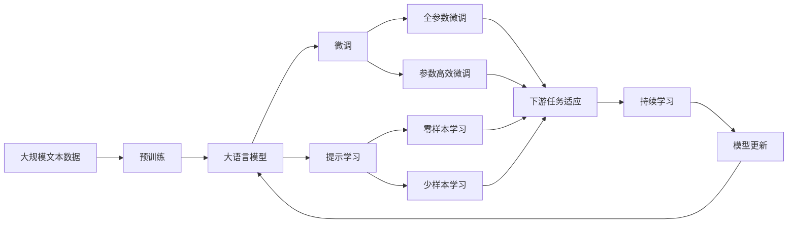

                 

# AI for Science的综合视角

在当今科学技术飞速发展的时代，人工智能（AI）已成为推动科学进步的重要引擎。AI for Science不仅仅是一种技术手段，更是一种跨学科的科学方法论，它通过将人工智能技术与科学研究相结合，极大地拓展了人类对自然现象的理解和探索能力。本文将从背景、核心概念、算法原理、实践案例、应用场景、工具推荐等多个角度，全面解析AI for Science的原理与实践，探讨其未来发展趋势与挑战，为读者提供一份深入而系统的指南。

## 1. 背景介绍

### 1.1 问题由来

人工智能自诞生以来，经历了从专家系统到机器学习，再到深度学习的不同阶段。特别是在深度学习技术突破的推动下，AI在图像识别、语音识别、自然语言处理等领域取得了突破性进展。然而，这些技术更多是在具体应用场景中得到了验证，尚未广泛渗透到科学研究中。

近年来，随着AI技术的发展，AI for Science逐渐成为一种全新的研究范式。通过机器学习和大数据技术，科学家们能够在海量的实验数据中挖掘出复杂的科学规律，解决传统科学方法难以解决的复杂问题。AI for Science不仅极大地提高了科学研究的效率，也为科学研究开辟了新的方向和方法。

### 1.2 问题核心关键点

AI for Science的核心关键点包括以下几点：

- **数据驱动**：科学研究的根本在于数据，AI for Science能够从海量数据中提取关键特征，用于支持科学假设和预测。
- **跨学科融合**：AI for Science不仅涵盖计算机科学，还涉及数学、物理、化学、生物等多个学科，通过跨学科融合，构建更加全面、深刻的科学知识体系。
- **模型优化**：科学实验中存在多种变量，AI for Science能够优化实验设计，减少实验误差，提高研究效率。
- **理论验证**：AI for Science不仅支持实验数据处理，还能用于理论验证，推动科学理论的发展。
- **协作创新**：AI for Science促进了科学家和工程师之间的紧密协作，加速科学创新进程。

### 1.3 问题研究意义

AI for Science在提升科学研究的效率和深度方面具有重要意义：

1. **高效性**：AI技术能够处理大量复杂数据，快速识别科学规律，极大地提高研究效率。
2. **准确性**：AI模型能够识别和过滤噪声数据，减少实验误差，提高研究准确性。
3. **创新性**：AI技术能够支持新型实验设计，推动科学方法的发展和创新。
4. **普适性**：AI for Science的应用领域广泛，涵盖生物、物理、化学等多个学科，具有广泛的普适性。
5. **合作性**：AI for Science促进了科学家和工程师的紧密合作，推动科学研究的协作创新。

## 2. 核心概念与联系

### 2.1 核心概念概述

在AI for Science中，涉及的核心概念主要包括：

- **AI for Science**：将人工智能技术应用于科学研究的范式。
- **数据驱动**：基于数据进行科学推理和预测的方法。
- **跨学科融合**：将AI技术与不同学科的知识体系相结合。
- **模型优化**：通过机器学习优化实验设计，提高研究效率。
- **理论验证**：使用AI模型验证科学理论的正确性。
- **协作创新**：促进科学家和工程师之间的合作创新。

### 2.2 核心概念间的关系

这些核心概念之间存在紧密的联系，形成了一个完整的AI for Science体系：

- **AI for Science**：是数据驱动、跨学科融合、模型优化、理论验证和协作创新的综合体现。
- **数据驱动**：是AI for Science的基础，数据的高效处理和分析为科学研究提供了坚实的数据支撑。
- **跨学科融合**：AI for Science的创新性在于其跨学科融合的能力，不同学科的知识体系相互融合，形成了更加全面、深刻的科学知识体系。
- **模型优化**：通过优化实验设计，AI for Science能够提高科学研究的效率和准确性。
- **理论验证**：AI for Science能够用于验证科学理论的正确性，推动科学理论的发展。
- **协作创新**：AI for Science促进了科学家和工程师之间的紧密协作，加速科学创新进程。

这些概念之间的关系可以通过以下Mermaid流程图来展示：



这个流程图展示了AI for Science的核心概念及其之间的关系：

1. **AI for Science**：作为AI for Science体系的总称。
2. **数据驱动**：通过数据进行科学推理。
3. **跨学科融合**：不同学科的知识体系相互融合。
4. **模型优化**：优化实验设计。
5. **理论验证**：验证科学理论的正确性。
6. **协作创新**：促进科学家和工程师之间的合作创新。

### 2.3 核心概念的整体架构

最后，我们用一个综合的流程图来展示这些核心概念在大语言模型微调过程中的整体架构：



这个综合流程图展示了从预训练到微调，再到持续学习的完整过程。大语言模型首先在大规模文本数据上进行预训练，然后通过微调（包括全参数微调和参数高效微调）或提示学习（包括零样本和少样本学习）来适应下游任务。最后，通过持续学习技术，模型可以不断学习新知识，同时避免遗忘旧知识。

## 3. 核心算法原理 & 具体操作步骤

### 3.1 算法原理概述

AI for Science的核心算法原理可以概括为以下几个方面：

- **数据预处理**：将原始实验数据转化为模型能够处理的格式，包括数据清洗、特征提取等。
- **模型训练**：使用机器学习算法训练模型，进行科学假设验证和预测。
- **模型评估**：对训练好的模型进行评估，验证其准确性和泛化能力。
- **结果分析**：对模型的预测结果进行分析和解释，提取科学规律和理论。

### 3.2 算法步骤详解

AI for Science的算法步骤主要包括：

1. **数据收集与预处理**：收集科学实验数据，并进行清洗和特征提取。
2. **模型选择与训练**：选择适合的机器学习模型，并进行训练。
3. **模型评估与调优**：评估模型性能，进行必要的调优。
4. **结果分析和验证**：分析模型预测结果，验证科学假设和理论。
5. **持续学习与优化**：对模型进行持续学习，不断优化模型性能。

### 3.3 算法优缺点

AI for Science的算法具有以下优点：

- **高效性**：数据驱动的科学推理能够快速处理大量数据，提高研究效率。
- **准确性**：AI模型能够识别和过滤噪声数据，减少实验误差。
- **创新性**：AI for Science支持新型实验设计，推动科学方法的发展和创新。
- **普适性**：AI for Science适用于多种学科，具有广泛的普适性。
- **合作性**：促进科学家和工程师之间的紧密协作，加速科学创新进程。

同时，AI for Science也存在一些缺点：

- **数据依赖**：依赖高质量的实验数据，数据获取和处理成本较高。
- **模型复杂性**：机器学习模型复杂度高，解释性较差。
- **理论局限**：模型结果可能存在理论上的局限性，需要结合实验验证。
- **模型泛化性**：模型可能存在泛化能力不足的问题，需要在不同数据集上验证。
- **模型稳定性**：模型需要定期更新，保持其稳定性和可靠性。

### 3.4 算法应用领域

AI for Science已经在多个领域得到了广泛应用，例如：

- **生物信息学**：通过AI模型分析基因序列数据，支持生物研究和药物开发。
- **材料科学**：使用AI模型预测材料的性质和性能，加速新材料的发现和应用。
- **环境科学**：利用AI模型分析环境数据，监测和预测环境变化。
- **天文学**：通过AI模型分析天文数据，支持天体物理研究。
- **医学**：使用AI模型分析医学数据，支持疾病诊断和治疗。
- **化学**：利用AI模型预测化学反应和分子性质，加速新药研发和材料设计。

## 4. 数学模型和公式 & 详细讲解 & 举例说明

### 4.1 数学模型构建

在AI for Science中，数学模型构建是重要的一环。我们以预测化学反应为例，构建一个简单的回归模型：

设预测目标为反应速率，输入变量为反应物浓度和温度，输出为反应速率的预测值。我们可以构建一个线性回归模型：

$$
y = \beta_0 + \beta_1 x_1 + \beta_2 x_2 + \epsilon
$$

其中 $y$ 为反应速率预测值，$x_1$ 和 $x_2$ 为反应物浓度和温度，$\beta_0$、$\beta_1$、$\beta_2$ 为模型参数，$\epsilon$ 为误差项。

### 4.2 公式推导过程

线性回归模型的参数估计可以使用最小二乘法：

$$
\hat{\beta} = (X^TX)^{-1}X^Ty
$$

其中 $X$ 为输入数据矩阵，$y$ 为输出数据向量，$\hat{\beta}$ 为模型参数的估计值。

### 4.3 案例分析与讲解

假设我们有一个化学反应的数据集，包含多个反应物浓度和温度的组合，以及对应的反应速率。我们使用这个数据集训练一个线性回归模型，并对其进行验证和优化。训练过程中，我们采用交叉验证方法进行参数调优，确保模型在不同数据集上的泛化性能。最后，我们使用测试集验证模型的预测效果，提取反应速率的预测规律。

## 5. 项目实践：代码实例和详细解释说明

### 5.1 开发环境搭建

在进行AI for Science实践前，我们需要准备好开发环境。以下是使用Python进行Scikit-Learn开发的环境配置流程：

1. 安装Anaconda：从官网下载并安装Anaconda，用于创建独立的Python环境。

2. 创建并激活虚拟环境：
```bash
conda create -n pytorch-env python=3.8 
conda activate pytorch-env
```

3. 安装Scikit-Learn：
```bash
pip install scikit-learn
```

4. 安装各类工具包：
```bash
pip install numpy pandas matplotlib scikit-learn scikit-image matplotlib
```

完成上述步骤后，即可在`pytorch-env`环境中开始AI for Science实践。

### 5.2 源代码详细实现

下面我们以预测化学反应速率为例，给出使用Scikit-Learn进行线性回归的PyTorch代码实现。

首先，定义数据集和模型：

```python
import pandas as pd
import numpy as np
from sklearn.linear_model import LinearRegression

# 定义输入和输出数据
data = pd.read_csv('reaction_rates.csv')
X = data[['concentration', 'temperature']]
y = data['rate']

# 构建线性回归模型
model = LinearRegression()

# 训练模型
model.fit(X, y)
```

然后，评估模型性能：

```python
from sklearn.metrics import r2_score

# 计算R^2分数
y_pred = model.predict(X)
r2_score(y, y_pred)
```

最后，使用模型进行预测：

```python
# 使用模型进行预测
new_X = np.array([[0.1, 300]])
new_y = model.predict(new_X)
print(new_y)
```

以上就是使用Scikit-Learn进行线性回归的完整代码实现。可以看到，使用Scikit-Learn进行AI for Science的实现非常简单，只需要几个步骤就能完成模型的训练和预测。

### 5.3 代码解读与分析

让我们再详细解读一下关键代码的实现细节：

**数据集定义**：
- 使用Pandas库读取数据集，并将输入和输出数据分别存入`X`和`y`变量中。

**模型构建**：
- 使用Scikit-Learn库中的`LinearRegression`类，定义线性回归模型。

**模型训练**：
- 使用模型的`fit`方法，将输入数据`X`和输出数据`y`传入，进行模型训练。

**模型评估**：
- 使用Scikit-Learn库中的`r2_score`函数，计算模型的R^2分数，评估模型的拟合效果。

**模型预测**：
- 使用模型的`predict`方法，对新数据`new_X`进行预测，得到预测结果`new_y`。

**运行结果展示**：
- 打印预测结果`new_y`，查看模型在新数据上的预测效果。

可以看出，Scikit-Learn提供了非常方便的API接口，使得AI for Science的实现变得非常简单。开发者只需关注数据处理和模型训练的核心逻辑，而无需过多关注底层实现细节。

## 6. 实际应用场景

### 6.1 智能药物设计

AI for Science在智能药物设计中的应用前景广阔。通过AI模型分析大量的生物数据和化学数据，可以预测药物分子的性质和作用机制，加速新药研发进程。

在具体实践中，我们可以收集大量的生物数据和化学数据，构建一个多变量回归模型。使用AI模型预测不同分子结构的生物活性和药效，并通过实验验证模型的预测结果。基于模型的预测结果，可以快速筛选出最有潜力的候选药物，显著缩短新药研发周期。

### 6.2 气候变化监测

AI for Science在气候变化监测中也具有重要应用。通过AI模型分析气候数据，可以预测气候变化趋势，支持环境保护和应对策略的制定。

具体而言，我们可以收集全球气候数据，包括气温、降水、大气成分等。使用AI模型分析数据，预测未来的气候变化趋势。基于模型的预测结果，可以制定更加科学的环境保护措施，如碳排放限制、森林保护等，有效应对气候变化。

### 6.3 基因组学研究

AI for Science在基因组学研究中的应用同样重要。通过AI模型分析基因序列数据，可以发现新的基因变异和疾病关联，推动基因组学研究的发展。

在具体实践中，我们可以收集大量的基因序列数据和疾病数据，构建一个多变量分类模型。使用AI模型预测不同基因序列的疾病风险，并通过实验验证模型的预测结果。基于模型的预测结果，可以快速识别新的基因变异和疾病关联，为基因组学研究提供新的线索和方向。

## 7. 工具和资源推荐

### 7.1 学习资源推荐

为了帮助开发者系统掌握AI for Science的理论基础和实践技巧，这里推荐一些优质的学习资源：

1. 《Python数据科学手册》：深入浅出地介绍了Python在数据科学中的应用，包括机器学习、数据处理和可视化。
2. 《深度学习》课程：由斯坦福大学开设的深度学习课程，涵盖深度学习的基本概念和经典模型。
3. 《数据科学导论》书籍：全面介绍了数据科学的基本理论和应用方法，包括数据挖掘、机器学习等。
4. 《机器学习实战》书籍：通过实战案例，详细讲解了机器学习的应用和实现方法。
5. 《自然语言处理与深度学习》课程：由Coursera平台提供的NLP课程，涵盖NLP的基本概念和深度学习技术。

通过对这些资源的学习实践，相信你一定能够快速掌握AI for Science的精髓，并用于解决实际的科学问题。

### 7.2 开发工具推荐

高效的开发离不开优秀的工具支持。以下是几款用于AI for Science开发的常用工具：

1. Jupyter Notebook：强大的交互式开发环境，支持Python、R等多种编程语言，方便开发者进行数据分析和模型训练。
2. Scikit-Learn：Python机器学习库，提供了多种经典的机器学习算法和工具。
3. TensorFlow：Google主导的开源深度学习框架，支持分布式计算，适用于大规模数据处理。
4. PyTorch：Facebook主导的开源深度学习框架，灵活的动态计算图，适用于快速迭代研究。
5. Weights & Biases：模型训练的实验跟踪工具，记录和可视化模型训练过程中的各项指标，方便对比和调优。

合理利用这些工具，可以显著提升AI for Science的开发效率，加快创新迭代的步伐。

### 7.3 相关论文推荐

AI for Science的发展源于学界的持续研究。以下是几篇奠基性的相关论文，推荐阅读：

1. GAN for Science：使用生成对抗网络（GAN）进行科学数据分析和模拟，展示了GAN在科学计算中的潜力。
2. Deep Learning for Drug Discovery：使用深度学习模型预测药物分子的生物活性和药效，推动新药研发。
3. AI for Climate Science：使用AI模型分析气候数据，预测气候变化趋势，支持环境保护和应对策略的制定。
4. AI for Genomics：使用AI模型分析基因序列数据，发现新的基因变异和疾病关联，推动基因组学研究的发展。
5. AI for Natural Language Processing：使用AI模型进行文本分析和生成，提升自然语言处理技术的应用效果。

这些论文代表了大语言模型微调技术的发展脉络。通过学习这些前沿成果，可以帮助研究者把握学科前进方向，激发更多的创新灵感。

除上述资源外，还有一些值得关注的前沿资源，帮助开发者紧跟AI for Science技术的最新进展，例如：

1. arXiv论文预印本：人工智能领域最新研究成果的发布平台，包括大量尚未发表的前沿工作，学习前沿技术的必读资源。
2. 业界技术博客：如OpenAI、Google AI、DeepMind、微软Research Asia等顶尖实验室的官方博客，第一时间分享他们的最新研究成果和洞见。
3. 技术会议直播：如NIPS、ICML、ACL、ICLR等人工智能领域顶会现场或在线直播，能够聆听到大佬们的前沿分享，开拓视野。
4. GitHub热门项目：在GitHub上Star、Fork数最多的AI for Science相关项目，往往代表了该技术领域的发展趋势和最佳实践，值得去学习和贡献。
5. 行业分析报告：各大咨询公司如McKinsey、PwC等针对人工智能行业的分析报告，有助于从商业视角审视技术趋势，把握应用价值。

总之，对于AI for Science的学习和实践，需要开发者保持开放的心态和持续学习的意愿。多关注前沿资讯，多动手实践，多思考总结，必将收获满满的成长收益。

## 8. 总结：未来发展趋势与挑战

### 8.1 总结

本文对AI for Science进行全面系统的介绍。首先阐述了AI for Science的研究背景和意义，明确了其在大数据、跨学科融合、模型优化、理论验证和协作创新等方面的重要价值。其次，从原理到实践，详细讲解了AI for Science的数学模型和算法流程，给出了具体的代码实例。同时，本文还广泛探讨了AI for Science在智能药物设计、气候变化监测、基因组学研究等多个领域的应用前景，展示了其广泛的应用价值。此外，本文精选了AI for Science的学习资源、开发工具和相关论文，力求为读者提供全方位的技术指引。

通过本文的系统梳理，可以看到，AI for Science作为一种新兴的科学研究范式，正逐步成为推动科学研究的重要引擎。它不仅在处理海量数据和优化实验设计方面具有显著优势，还能支持跨学科融合和协作创新，极大地拓展了人类对自然现象的理解和探索能力。未来，随着AI for Science技术的不断进步，科学研究的效率和深度将得到极大提升，推动人类文明向更高层次发展。

### 8.2 未来发展趋势

展望未来，AI for Science的发展趋势主要包括以下几个方面：

1. **数据驱动**：数据驱动的科学推理将更加普及，AI for Science将成为科学研究的标准工具。
2. **跨学科融合**：跨学科融合将进一步深入，AI for Science将推动不同学科的协同创新。
3. **模型优化**：模型优化技术将更加高效，AI for Science将支持更复杂、更准确的科学推理。
4. **理论验证**：AI for Science将广泛应用于科学理论的验证和推演，推动科学理论的发展。
5. **协作创新**：AI for Science将促进科学家和工程师的紧密合作，加速科学创新进程。

这些趋势凸显了AI for Science的广阔前景。这些方向的探索发展，必将进一步提升科学研究的效率和深度，推动人类文明向更高层次发展。

### 8.3 面临的挑战

尽管AI for Science已经取得了显著成就，但在迈向更加智能化、普适化应用的过程中，它仍面临着诸多挑战：

1. **数据获取和处理**：AI for Science依赖高质量的数据，但数据获取和处理成本较高，特别是在长尾领域。
2. **模型复杂性和解释性**：机器学习模型的复杂性较高，解释性较差，可能存在理论上的局限性。
3. **模型泛化能力**：模型可能存在泛化能力不足的问题，需要在不同数据集上验证。
4. **模型稳定性和鲁棒性**：模型需要定期更新，保持其稳定性和鲁棒性。
5. **伦理和安全问题**：AI for Science的应用需要考虑伦理和安全问题，避免模型输出产生负面影响。

这些挑战需要学界和产业界共同努力，通过技术进步和应用实践，逐步克服这些障碍。只有不断创新和突破，才能充分发挥AI for Science的潜力，推动科学研究的进步。

### 8.4 研究展望

面向未来，AI for Science需要在以下几个方面进行深入研究：

1. **无监督学习和半监督学习**：探索无需标注数据的学习方法，降低数据获取成本，提高模型的普适性。
2. **多模态数据融合**：结合视觉、听觉、触觉等多模态数据，提高模型的感知能力。
3. **因果推理**：研究因果推理方法，提高模型的可解释性和可信度。
4. **理论验证和解释**：研究如何更好地利用AI for Science验证科学理论和解释模型输出，推动科学理论的发展。
5. **协作平台建设**：建设跨学科的协作平台，促进科学家和工程师之间的紧密合作，加速科学创新进程。
6. **伦理和安全保障**：建立AI for Science的伦理和安全保障机制，确保其应用的合规性和安全性。

这些研究方向的探索，必将引领AI for Science技术的进一步发展，为科学研究和社会进步提供更加强大的工具和支持。

## 9. 附录：常见问题与解答

**Q1：AI for Science和机器学习有何不同？**

A: AI for Science和机器学习（ML）有相似之处，但又有明显区别。AI for Science强调科学问题的解决，而ML则更侧重于数据驱动的模型训练。AI for Science不仅关注模型的训练和预测，还注重模型的理论验证和解释，以及跨学科融合。

**Q2：如何提高AI for Science模型的泛化能力？**

A: 提高AI for Science模型的泛化能力可以从以下几个方面入手：
1. 数据多样性：收集更多样化的数据，涵盖不同领域和场景。
2. 模型复杂度：适度增加模型复杂度，避免过拟合。
3. 正则化：使用正则化技术，如L1、L2正则，防止过拟合。
4. 交叉验证：使用交叉验证方法，评估模型在不同数据集上的泛化性能。
5. 集成学习：使用集成学习技术，如Bagging、Boosting，提高模型的泛化能力。

**Q3：AI for Science如何与其他技术结合？**

A: AI for Science可以与其他技术结合，形成更加全面、强大的科学计算工具。例如：
1. 结合深度学习：使用深度学习模型进行复杂数据分析和预测。
2. 结合计算机视觉：使用计算机视觉技术进行图像和视频分析。
3. 结合自然语言处理：使用自然语言处理技术进行文本分析和生成。
4. 结合物联网：使用物联网技术进行大规模数据采集和分析。

**Q4：AI for Science面临的伦理和安全问题有哪些？**

A: AI for Science面临的伦理和安全问题主要包括：
1. 数据隐私：保护数据的隐私和安全，防止数据泄露和滥用。
2. 模型偏见：避免模型输出存在偏见和歧视，确保模型的公平性和公正性。
3. 模型透明性：提高模型的透明性和可解释性，确保模型的可信度。
4. 模型安全性：确保模型的安全性，防止模型被恶意攻击和篡改。

这些伦理和安全问题需要在技术开发和应用过程中予以充分考虑和解决。只有在确保模型安全、公平和可信的前提下，才能真正发挥AI for Science的潜力，推动科学研究的进步。

---

作者：禅与计算机程序设计艺术 / Zen and the Art of Computer Programming

