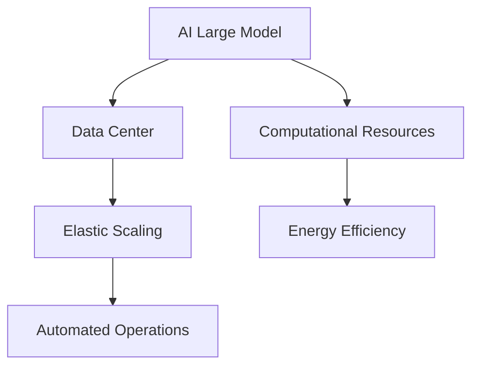
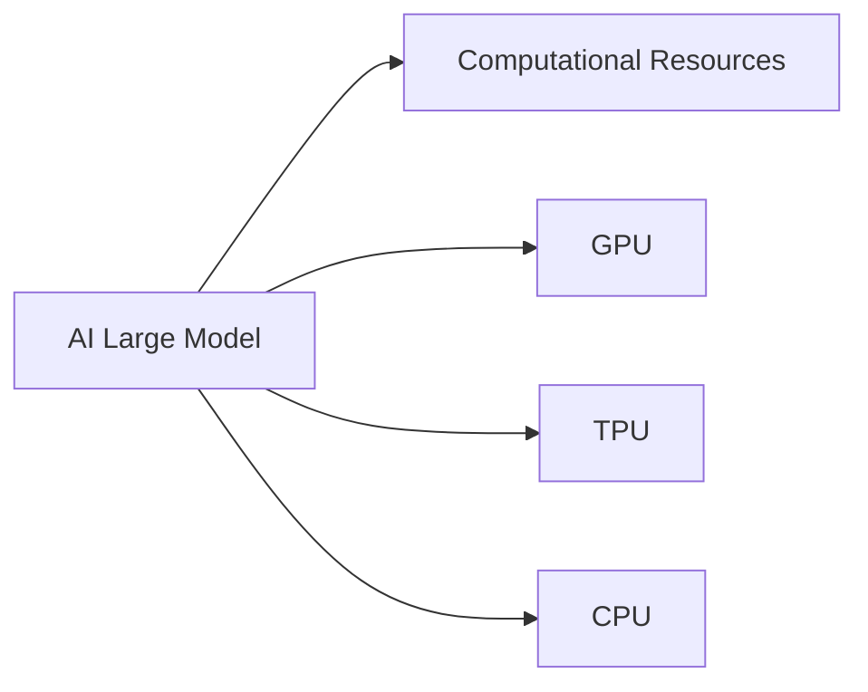
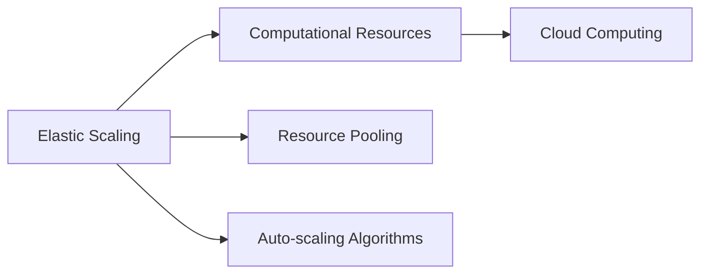

                 

# AI 大模型应用数据中心建设：数据中心运维与管理

> 关键词：人工智能大模型, 数据中心, 运维, 管理, 计算资源, 能效, 弹性伸缩, 自动化

## 1. 背景介绍

随着人工智能（AI）大模型的发展，其计算资源需求急剧增长，这对于数据中心的建设和管理带来了巨大的挑战。为了支持AI大模型的训练和推理，数据中心需要提供高性能、高可用、高可扩展的计算环境。同时，随着AI应用的广泛推广，数据中心运维管理的要求也变得日益严格，如何高效地运维和管理数据中心，确保AI大模型应用的稳定和可靠，成为一个重要问题。

### 1.1 问题由来
AI大模型的训练和推理需要大量的计算资源，数据中心需要提供强大的计算能力来支持这些需求。同时，AI大模型应用的业务场景复杂多样，数据中心需要能够快速响应不同的业务需求，进行弹性伸缩。然而，现有的数据中心往往存在以下问题：
- 计算资源不足：大模型需要高性能计算资源，现有的数据中心可能无法满足这些需求。
- 资源利用率低：数据中心中大量计算资源处于空闲状态，无法充分利用。
- 运维管理困难：AI大模型的运行需要复杂的监控和调优，现有的运维手段可能难以满足要求。
- 成本高昂：大规模的数据中心建设和管理需要巨大的资金投入，且对企业的财务状况带来压力。

### 1.2 问题核心关键点
为了解决这些问题，数据中心建设和管理需要关注以下几个关键点：
- 高性能计算资源：如何获取并合理利用高性能计算资源，支持AI大模型的训练和推理。
- 弹性伸缩能力：如何根据不同的业务需求进行计算资源的动态调整，实现弹性伸缩。
- 能效优化：如何通过技术手段降低数据中心的能耗，实现绿色数据中心。
- 自动化运维：如何通过自动化技术简化运维管理，提高数据中心的运营效率。

## 2. 核心概念与联系

### 2.1 核心概念概述

为了更好地理解数据中心在AI大模型应用中的建设和管理，本节将介绍几个密切相关的核心概念：

- **人工智能大模型（AI Large Model）**：指通过大规模数据训练，具有通用语言理解能力、自然语言生成能力等高性能的AI模型，如GPT-3、BERT等。
- **数据中心（Data Center）**：指通过网络接入，提供高性能计算、存储、网络等资源的物理设施。
- **计算资源（Computational Resources）**：指数据中心中可用于计算的各种硬件资源，如CPU、GPU、TPU等。
- **能效（Energy Efficiency）**：指数据中心中计算资源的能源利用效率，是数据中心建设和管理的重要指标。
- **弹性伸缩（Elastic Scaling）**：指根据业务需求的变化，动态调整计算资源的供应和分配，确保资源的高效利用。
- **自动化运维（Automated Operations）**：指利用自动化技术简化运维管理，提高数据中心运营效率。

这些核心概念之间的逻辑关系可以通过以下Mermaid流程图来展示：



这个流程图展示了大模型在数据中心中的应用，以及与计算资源、能效、弹性伸缩和自动化运维之间的关系。

### 2.2 概念间的关系

这些核心概念之间存在着紧密的联系，形成了AI大模型应用数据中心建设和管理的基本框架。下面我们通过几个Mermaid流程图来展示这些概念之间的关系。

#### 2.2.1 AI大模型与计算资源的关系



这个流程图展示了AI大模型与不同计算资源之间的关系。AI大模型训练和推理需要高性能计算资源，如GPU、TPU、CPU等。

#### 2.2.2 数据中心与能效的关系

```mermaid
graph TB
    A[Data Center] --> B[Energy Efficiency]
    A --> C[Power Usage Effectiveness (PUE)]
    A --> D[Cooling System]
    A --> E[Power Supply Units]
```

这个流程图展示了数据中心与能效之间的关系。数据中心通过优化PUE（Power Usage Effectiveness）、冷却系统和电源单元等技术手段，实现能效优化。

#### 2.2.3 弹性伸缩与计算资源的关系



这个流程图展示了弹性伸缩与计算资源之间的关系。弹性伸缩通过资源池化和自动化算法，实现计算资源的动态调整。

#### 2.2.4 自动化运维与数据中心的关系

```mermaid
graph LR
    A[Automated Operations] --> B[Data Center]
    A --> C[Monitoring Tools]
    A --> D[Automatic Adjustments]
    B --> E[Virtual Machine (VM) Management]
    B --> F[Network Management]
```

这个流程图展示了自动化运维与数据中心之间的关系。自动化运维通过监控工具和自动化调整，简化运维管理，提高数据中心运营效率。

### 2.3 核心概念的整体架构

最后，我们用一个综合的流程图来展示这些核心概念在大模型应用数据中心建设中的整体架构：


这个综合流程图展示了从AI大模型到计算资源，再到能效和自动化运维的全过程。大模型在数据中心中应用，需要高性能计算资源、能效优化、弹性伸缩和自动化运维等多方面技术的支撑，才能实现高效、稳定的应用。

## 3. 核心算法原理 & 具体操作步骤
### 3.1 算法原理概述

AI大模型的训练和推理需要大量的计算资源，数据中心需要提供高性能、高可用、高可扩展的计算环境。具体来说，数据中心的建设和管理需要关注以下几个方面：

1. **计算资源的获取和利用**：如何获取高性能计算资源，并合理利用这些资源，支持AI大模型的训练和推理。
2. **能效优化**：如何通过技术手段降低数据中心的能耗，实现绿色数据中心。
3. **弹性伸缩能力**：如何根据不同的业务需求进行计算资源的动态调整，实现弹性伸缩。
4. **自动化运维**：如何通过自动化技术简化运维管理，提高数据中心的运营效率。

### 3.2 算法步骤详解

#### 3.2.1 计算资源的获取和利用

1. **高性能计算资源的获取**：数据中心需要采购高性能计算资源，如GPU、TPU、CPU等。这些资源可以通过公有云、私有云或混合云等方式获取。公有云如AWS、Azure等提供强大的计算资源，而私有云或混合云则可以根据企业需求进行定制化部署。
2. **计算资源的利用**：通过虚拟化技术，如VM（Virtual Machine）和容器技术，可以将计算资源进行池化，提高资源利用率。同时，采用资源隔离技术，如Kubernetes、Docker Swarm等，可以确保每个应用拥有独立且隔离的计算环境。

#### 3.2.2 能效优化

1. **PUE优化**：数据中心通过优化电源使用效率（Power Usage Effectiveness，PUE），降低能耗。PUE是数据中心总能耗（包括电力、冷却等）与IT设备能耗之比，PUE越低，能效越高。
2. **冷却系统优化**：采用高效冷却系统，如液冷技术、自然冷却技术等，降低数据中心的冷却能耗。
3. **能源管理**：通过能源管理系统，如能源优化算法、智能电网等，实现能源的优化管理。

#### 3.2.3 弹性伸缩能力

1. **资源池化**：将计算资源进行池化，根据业务需求动态调整资源分配。资源池化可以采用公有云中的弹性计算服务，也可以自行搭建私有云或混合云中的资源池。
2. **自动化算法**：采用自动化算法，如自适应负载均衡算法、动态扩展算法等，实现资源的动态调整。

#### 3.2.4 自动化运维

1. **监控工具**：采用监控工具，如Prometheus、Zabbix等，实时监控数据中心的运行状态，及时发现和处理异常。
2. **自动化调整**：通过自动化调整，如自动扩容、自动缩容等，简化运维管理，提高数据中心的运营效率。

### 3.3 算法优缺点

**优点**：
- 支持高性能计算资源，满足AI大模型训练和推理的需求。
- 优化能效，降低数据中心的运营成本。
- 支持弹性伸缩，动态调整计算资源，提高资源利用率。
- 简化运维管理，提高数据中心的运营效率。

**缺点**：
- 建设和管理成本较高，需要投入大量资金。
- 复杂度高，需要专业技术人员进行管理和维护。
- 对技术要求高，需要具备一定的技术储备。

### 3.4 算法应用领域

基于AI大模型应用数据中心建设和管理的技术，可以应用于以下领域：

1. **云服务提供商**：如AWS、Azure、Google Cloud等，提供高性能计算资源和弹性伸缩能力，支持AI大模型的训练和推理。
2. **企业内部数据中心**：大企业可以自建或合作共建高性能数据中心，支持AI大模型的应用。
3. **科研机构**：科研机构可以依托数据中心，进行大规模数据计算和分析，支持前沿AI研究。
4. **政府机构**：政府机构可以依托数据中心，进行公共服务数据分析，支持智慧城市、智慧政府等应用。

## 4. 数学模型和公式 & 详细讲解 & 举例说明

### 4.1 数学模型构建

为了更好地理解和优化数据中心的能效，我们可以建立如下数学模型：

设数据中心的总能耗为E，计算资源的总能耗为I，冷却系统的能耗为C，能源管理系统的能耗为M，则数据中心的能效PUE定义为：

$$
PUE = \frac{E}{I} = 1 + \frac{C}{I} + \frac{M}{I}
$$

其中，I为计算资源的总能耗，C为冷却系统的能耗，M为能源管理系统的能耗。

### 4.2 公式推导过程

根据PUE的定义，可以将其转化为以下公式：

$$
E = I + C + M
$$

其中，E为数据中心的总能耗，I为计算资源的总能耗，C为冷却系统的能耗，M为能源管理系统的能耗。

假设冷却系统与计算资源的能耗成正比，即C = k * I，其中k为比例系数，则：

$$
PUE = 1 + k + \frac{M}{I}
$$

当M = 0时，PUE达到最小值，此时数据中心的能效最优。

### 4.3 案例分析与讲解

假设某数据中心总能耗为100千瓦时，计算资源总能耗为80千瓦时，冷却系统能耗为20千瓦时，能源管理系统的能耗为0千瓦时，则PUE为：

$$
PUE = \frac{100}{80} = 1.25
$$

为了提高能效，可以优化冷却系统，将其能耗减少到10千瓦时，则PUE变为：

$$
PUE = 1 + 0.125 + 0 = 1.125
$$

能效提高了7.6%。

## 5. 项目实践：代码实例和详细解释说明

### 5.1 开发环境搭建

在进行数据中心建设和管理的实践前，我们需要准备好开发环境。以下是使用Python进行PyTorch开发的环境配置流程：

1. 安装Anaconda：从官网下载并安装Anaconda，用于创建独立的Python环境。

2. 创建并激活虚拟环境：
```bash
conda create -n pytorch-env python=3.8 
conda activate pytorch-env
```

3. 安装PyTorch：根据CUDA版本，从官网获取对应的安装命令。例如：
```bash
conda install pytorch torchvision torchaudio cudatoolkit=11.1 -c pytorch -c conda-forge
```

4. 安装TensorFlow：
```bash
pip install tensorflow
```

5. 安装Kubernetes：
```bash
pip install kubernetes
```

6. 安装Prometheus和Grafana：
```bash
pip install prometheus_client[py] grafana[py]
```

完成上述步骤后，即可在`pytorch-env`环境中开始数据中心建设和管理的实践。

### 5.2 源代码详细实现

这里我们以公有云环境下的AI大模型应用为例，给出使用Kubernetes进行资源管理和自动化调整的PyTorch代码实现。

```python
import kubernetes
from prometheus_client import Gauge

# 创建Kubernetes客户端
k8s_client = kubernetes.client.CoreV1Api()

# 创建监控指标
job_status = Gauge('job_status', '当前作业状态', ['job_name', 'job_state'])
resource_usage = Gauge('resource_usage', '计算资源使用情况', ['resource_type', 'container_name'])

# 监控作业状态
def monitor_job(job_name, job_state):
    status = k8s_client.read_namespaced_job_status(job_name, 'default')
    job_status.labels(job_name=job_name, job_state=job_state).set(status.status.phase)

# 监控计算资源使用情况
def monitor_resource(resource_type, container_name):
    resource_usage.labels(resource_type=resource_type, container_name=container_name).set(
        sum([container.status.resource_requests[resource_type] for container in job.status.containers])
    )

# 配置资源管理和自动化调整
def configure_resource_management():
    # 创建作业
    job = k8s_client.create_namespaced_job(
        api_version='v1',
        metadata=kubernetes.client.V1ObjectMeta(
            name='job_name',
            labels={'name': 'job_name'},
            spec=kubernetes.client.V1JobSpec(
                template=kubernetes.client.V1PodTemplateSpec(
                    metadata=kubernetes.client.V1ObjectMeta(
                        name='container_name',
                        labels={'name': 'container_name'},
                    ),
                    spec=kubernetes.client.V1PodSpec(
                        containers=[kubernetes.client.V1Container(
                            name='container_name',
                            image='job_image',
                            resources=kubernetes.client.V1ResourceRequirements(
                                limits={'cpu': '1', 'memory': '1Gi'},
                                requests={'cpu': '0.5', 'memory': '0.5Gi'},
                            ),
                        )],
                    restart_policy='Always',
                ),
            ),
        ),
    )

    # 监控作业状态和计算资源使用情况
    monitor_job('job_name', 'Running')
    monitor_resource('cpu', 'container_name')
```

### 5.3 代码解读与分析

让我们再详细解读一下关键代码的实现细节：

**Kubernetes客户端**：
- `kubernetes.client.CoreV1Api()`：创建Kubernetes客户端，用于调用Kubernetes API。

**监控指标**：
- `Gauge`类：用于创建监控指标。
- `job_status`：记录当前作业状态。
- `resource_usage`：记录计算资源使用情况。

**作业监控**：
- `monitor_job`函数：根据作业状态，更新监控指标。
- `monitor_resource`函数：根据容器资源请求，更新计算资源使用情况。

**资源管理和自动化调整**：
- `configure_resource_management`函数：创建作业，并配置资源管理和监控。

## 6. 实际应用场景

### 6.1 智能客服系统

基于AI大模型应用的数据中心，可以应用于智能客服系统的建设。智能客服系统通过实时监控和自动化调整，确保AI大模型的稳定运行，支持自然语言处理和对话生成，为用户提供高效、智能的客服服务。

**实际应用**：某公司利用AI大模型开发智能客服系统，通过Kubernetes部署多个微服务，实时监控和调整资源使用情况，确保系统的高可用性和高稳定性。系统可以自动处理常见问题，为用户提供快速响应和个性化服务。

### 6.2 金融舆情监测

金融舆情监测系统需要实时处理大量数据，需要高性能计算资源和弹性伸缩能力。基于AI大模型应用的数据中心，可以支持金融舆情监测系统的高性能计算需求，实现实时数据分析和处理。

**实际应用**：某银行利用AI大模型开发舆情监测系统，通过Kubernetes和Prometheus，实时监控和调整计算资源使用情况，确保系统的高可用性和高稳定性。系统能够实时分析社交媒体和新闻文章，监测市场舆情变化，及时预警金融风险。

### 6.3 个性化推荐系统

个性化推荐系统需要实时处理用户行为数据，需要高性能计算资源和弹性伸缩能力。基于AI大模型应用的数据中心，可以支持个性化推荐系统的计算需求，实现实时数据分析和处理。

**实际应用**：某电商公司利用AI大模型开发个性化推荐系统，通过Kubernetes和Prometheus，实时监控和调整计算资源使用情况，确保系统的高可用性和高稳定性。系统能够实时分析用户行为数据，推荐个性化商品，提升用户购买体验。

### 6.4 未来应用展望

随着AI大模型应用的发展，基于数据中心建设和管理的AI大模型应用将得到更广泛的应用，为各行各业带来更多的智能化解决方案。

1. **智慧城市**：基于数据中心建设和管理的AI大模型应用，可以支持智慧城市的建设，实现城市管理的智能化。
2. **智慧医疗**：基于数据中心建设和管理的AI大模型应用，可以支持智慧医疗的建设，实现医疗诊断和治疗的智能化。
3. **智能制造**：基于数据中心建设和管理的AI大模型应用，可以支持智能制造的建设，实现生产管理的智能化。

总之，基于数据中心建设和管理的AI大模型应用，将在各个行业得到广泛应用，推动人工智能技术的发展和落地。

## 7. 工具和资源推荐

### 7.1 学习资源推荐

为了帮助开发者系统掌握AI大模型应用数据中心建设和技术，这里推荐一些优质的学习资源：

1. **《深度学习》（Deep Learning）**：Ian Goodfellow等人所著的经典教材，全面介绍了深度学习的基本概念和算法，包括数据中心建设和管理的理论基础。
2. **《数据中心建设与管理》（Data Center Design and Management）**：由Data Center Institute出版的专业书籍，详细介绍了数据中心建设和管理的技术细节。
3. **Kubernetes官方文档**：Kubernetes的官方文档，提供了详细的API和代码示例，帮助开发者快速上手Kubernetes。
4. **Prometheus官方文档**：Prometheus的官方文档，提供了详细的监控和告警配置指南，帮助开发者实现系统监控。
5. **Grafana官方文档**：Grafana的官方文档，提供了详细的可视化配置指南，帮助开发者实现系统监控数据的可视化。

通过对这些资源的学习实践，相信你一定能够快速掌握AI大模型应用数据中心建设和管理的精髓，并用于解决实际的NLP问题。

### 7.2 开发工具推荐

高效的开发离不开优秀的工具支持。以下是几款用于AI大模型应用数据中心建设和管理的常用工具：

1. **Kubernetes**：开源容器编排平台，支持大规模计算资源的部署和管理。
2. **Prometheus**：开源监控系统，支持高可用性和高扩展性的数据收集和监控。
3. **Grafana**：开源可视化工具，支持丰富的图表和仪表盘，帮助开发者实现系统监控数据的可视化。
4. **Ansible**：开源自动化工具，支持基础设施自动化配置和运维管理。
5. **Jenkins**：开源持续集成工具，支持自动化构建和部署。

合理利用这些工具，可以显著提升AI大模型应用数据中心建设和管理的开发效率，加快创新迭代的步伐。

### 7.3 相关论文推荐

AI大模型应用数据中心建设和管理的探索研究，得益于学界的持续研究。以下是几篇奠基性的相关论文，推荐阅读：

1. **《数据中心性能建模与优化》（Performance Modeling and Optimization of Data Centers）**：介绍了数据中心性能建模和优化的基本方法，包括能效优化、弹性伸缩等。
2. **《云计算资源管理与调度》（Resource Management and Scheduling in Cloud Computing）**：介绍了云计算资源管理与调度的技术细节，包括虚拟机管理、自动化调整等。
3. **《基于深度学习的智能推荐系统》（Intelligent Recommendation System Based on Deep Learning）**：介绍了基于深度学习的推荐系统的设计和实现，包括计算资源管理和自动化调整等。
4. **《智慧城市与大数据技术》（Smart City and Big Data Technology）**：介绍了智慧城市和大数据技术的应用，包括数据中心建设和管理的理论基础。

这些论文代表了大模型应用数据中心建设和管理的探索研究，帮助研究者把握学科前进方向，激发更多的创新灵感。

除上述资源外，还有一些值得关注的前沿资源，帮助开发者紧跟AI大模型应用数据中心建设和管理的最新进展，例如：

1. **arXiv论文预印本**：人工智能领域最新研究成果的发布平台，包括大量尚未发表的前沿工作，学习前沿技术的必读资源。
2. **业界技术博客**：如AWS、Azure、Google Cloud等顶尖实验室的官方博客，第一时间分享他们的最新研究成果和洞见。
3. **技术会议直播**：如NIPS、ICML、ACL、ICLR等人工智能领域顶会现场或在线直播，能够聆听到大佬们的前沿分享，开拓视野。
4. **GitHub热门项目**：在GitHub上Star、Fork数最多的AI大模型相关项目，往往代表了该技术领域的发展趋势和最佳实践，值得去学习和贡献。
5. **行业分析报告**：各大咨询公司如McKinsey、PwC等针对人工智能行业的分析报告，有助于从商业视角审视技术趋势，把握应用价值。

总之，对于AI大模型应用数据中心建设和管理的深入学习和实践，需要开发者保持开放的心态和持续学习的意愿。多关注前沿资讯，多动手实践，多思考总结，必将收获满满的成长收益。

## 8. 总结：未来发展趋势与挑战

### 8.1 总结

本文对基于AI大模型应用的数据中心建设和管理的理论基础和技术细节进行了全面系统的介绍。首先，阐述了AI大模型和数据中心在AI大模型应用中的建设和管理的重要性，明确了数据中心在支持AI大模型应用中的关键作用。其次，从原理到实践，详细讲解了数据中心建设和管理的数学模型和关键步骤，给出了数据中心建设和管理的完整代码实例。同时，本文还广泛探讨了数据中心建设和管理的实际应用场景，展示了数据中心建设和管理的巨大潜力。此外，本文精选了数据中心建设和管理的各类学习资源，力求为读者提供全方位的技术指引。

通过本文的系统梳理，可以看到，基于AI大模型应用的数据中心建设和管理的理论基础和技术细节，为AI大模型应用提供了坚实的支撑。AI大模型应用数据中心建设和管理的理论和实践，为AI大模型在各行业的应用提供了重要保障。

### 8.2 未来发展趋势

展望未来，AI大模型应用数据中心建设和管理的趋势将呈现以下几个发展方向：

1. **云基础设施的优化**：云基础设施的优化将继续推动AI大模型的应用。公有云、私有云和混合云的混合使用将更加普遍，数据中心的建设和管理也将更加灵活和高效。
2. **能效的进一步提升**：数据中心的能效优化将进一步提升，包括PUE的降低、冷却系统的改进、能源管理的优化等。
3. **自动化运维的普及**：自动化运维技术将进一步普及，包括监控工具、自动化调整、自适应负载均衡等，简化运维管理，提高数据中心的运营效率。
4. **边缘计算的兴起**：边缘计算技术的发展将进一步推动AI大模型在边缘设备上的应用，实现低延迟、高可靠性的计算。
5. **异构计算的融合**：异构计算技术的融合将进一步提升AI大模型的计算能力和资源利用率，包括GPU、TPU、FPGA等异构硬件的协同计算。

以上趋势将进一步推动AI大模型应用的发展，为AI大模型在各行业的应用提供更强大的支持。

### 8.3 面临的挑战

尽管AI大模型应用数据中心建设和管理的理论和技术已经取得了一定的进展，但在实践中也面临一些挑战：

1. **建设和管理成本高**：数据中心的建设和管理需要大量的资金投入，企业需要考虑成本效益的问题。
2. **复杂度高**：数据中心建设和管理的复杂度高，需要专业的技术人员进行管理和维护。
3. **技术要求高**：数据中心建设和管理的理论和技术要求高，需要具备一定的技术储备。
4. **安全性问题**：数据中心建设和管理的复杂性带来了安全问题，需要加强安全防护和监管。

针对这些挑战，未来的研究需要在以下几个方面进行突破：

1. **成本效益的优化**：研究如何优化数据中心的建设和管理成本，提高企业的投资回报率。
2. **技术的自动化**：研究如何通过自动化技术简化数据中心的建设和管理，提高运营效率。
3. **安全性的保障**：研究如何加强数据中心的安全防护和监管，确保系统的安全性。

### 8.4 研究展望

未来，AI大模型应用数据中心建设和管理的理论和技术将继续发展和创新，推动AI大模型在各行业的应用。以下是几个可能的研究方向：

1. **智能化运维管理**：研究如何利用人工智能技术进行智能化运维管理，进一步简化数据中心的运维工作。
2. **动态资源分配**：研究如何通过智能算法实现动态资源分配，提高资源利用率。
3. **多云融合**：研究如何实现公有云、私有云和混合云的融合，实现更灵活的数据中心建设和管理。
4. **数据中心的虚拟化**：研究如何利用虚拟化技术实现数据中心的虚拟化，

