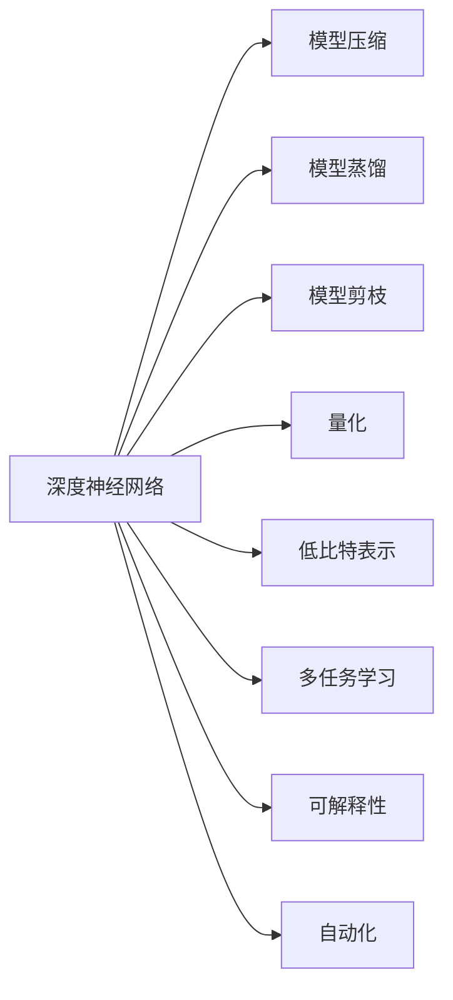
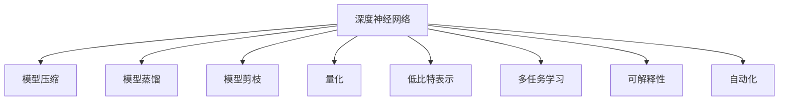
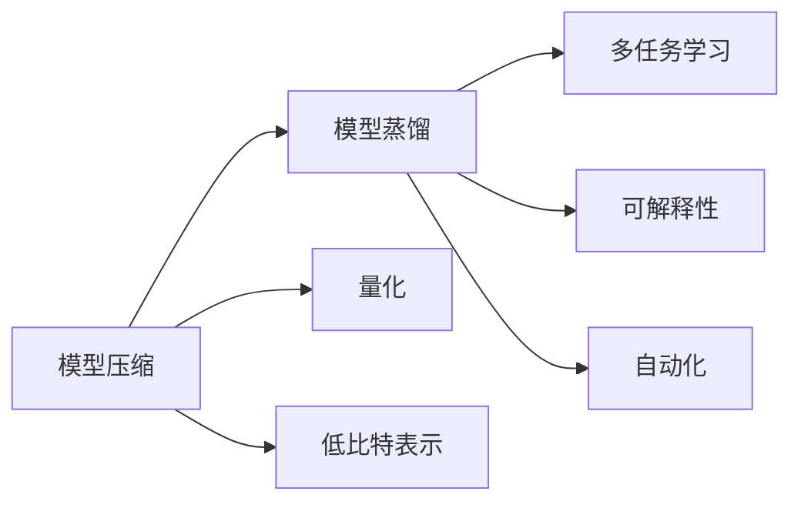
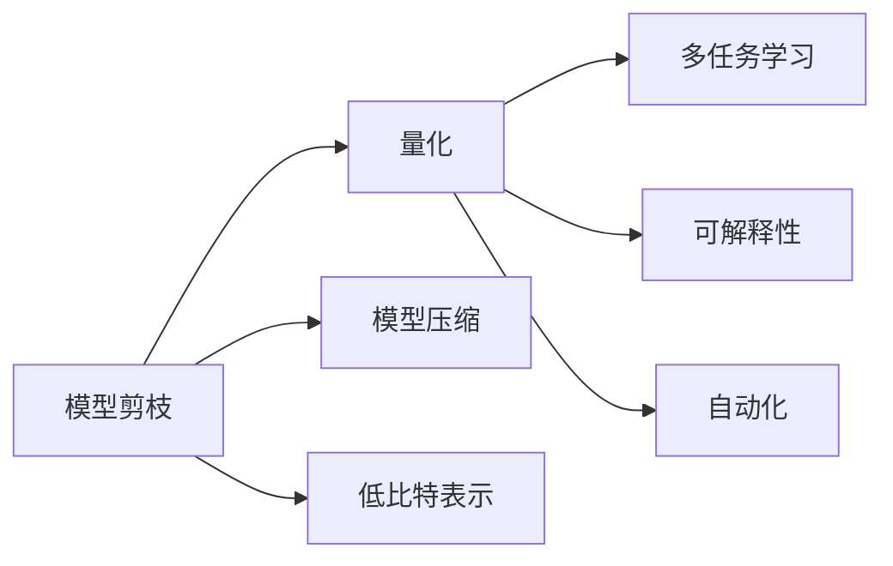
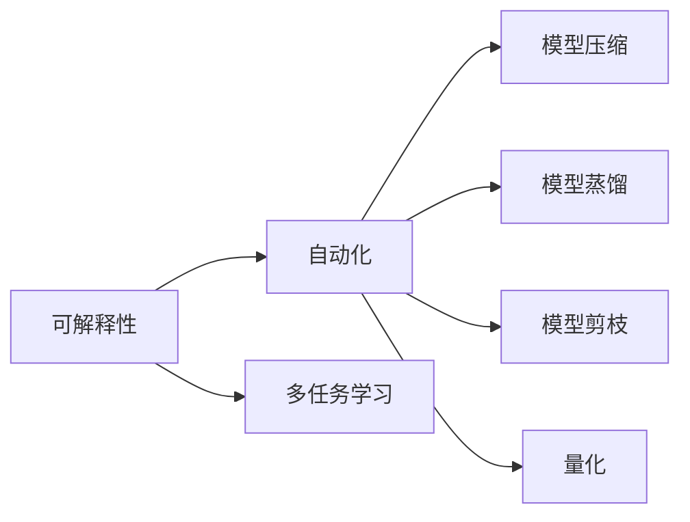
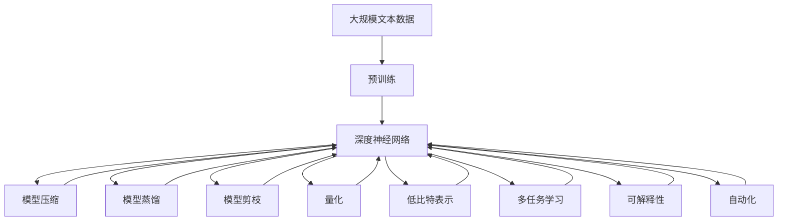

                 

## 1. 背景介绍

### 1.1 问题由来
深度神经网络（Deep Neural Networks, DNNs）是人工智能领域的重要技术之一，广泛应用于图像识别、语音识别、自然语言处理、推荐系统等诸多领域。DNNs的核心思想是利用多层非线性变换，自动学习数据的复杂表示，从而达到优秀性能。然而，DNNs的训练过程复杂，对数据和计算资源的需求极高，阻碍了其在实际应用中的普及。

### 1.2 问题核心关键点
为解决这些问题，近年来，研究者提出并实践了多种深度神经网络计算艺术之道，其中包括模型压缩、模型蒸馏、模型剪枝、量化、低比特表示等方法。这些方法通过在模型设计和训练过程中引入“艺术”思维，即在追求性能最优的同时，注重模型的可解释性、可扩展性、可维护性以及计算效率，取得了显著效果。

### 1.3 问题研究意义
这些深度神经网络计算艺术之道的提出，对于推动人工智能技术的普及和应用具有重要意义：

1. 降低计算成本。模型压缩、量化等方法显著减少了模型参数量和计算资源需求，降低了训练和推理成本。
2. 提升模型性能。模型蒸馏、模型剪枝等技术在保持模型复杂度不变的情况下，提高了模型的泛化能力和推理速度。
3. 增强模型可解释性。低比特表示、模型蒸馏等方法提升了模型的可解释性，便于人类理解和调试。
4. 改善模型迁移能力。模型剪枝、模型蒸馏等技术提高了模型的迁移学习能力，使其在不同场景下表现稳定。
5. 促进模型实时部署。压缩、量化等方法使得模型在资源受限的设备上也能够高效运行，促进了模型的实时部署。

## 2. 核心概念与联系

### 2.1 核心概念概述

为了更好地理解深度神经网络计算艺术之道，本节将介绍几个密切相关的核心概念：

- **深度神经网络（DNNs）**：一种由多层神经元组成的非线性模型，通过反向传播算法进行训练，自动学习数据的复杂表示。
- **模型压缩**：通过减小模型参数量或结构复杂度，降低计算资源需求，提升模型训练和推理效率的方法。
- **模型蒸馏**：通过将复杂模型（teacher）的知识转移到简单模型（student），提高模型泛化能力和推理速度的技术。
- **模型剪枝**：通过删除模型中冗余或不重要的参数，减少模型大小，提升计算效率的方法。
- **量化**：将模型参数从高精度浮点表示转换为低精度整数或固定点表示，减少存储空间和计算资源消耗。
- **低比特表示**：使用比特深度较低的参数表示方法，如8比特、4比特等，进一步压缩模型。
- **多任务学习**：在同一模型中同时学习多个相关任务，提高模型复用性和泛化能力。
- **可解释性**：使得模型的决策过程可理解、可解释，便于人类理解和调试。
- **自动化**：在模型设计、训练和部署过程中引入自动化技术，减少人工干预，提升效率和质量。

这些核心概念之间的逻辑关系可以通过以下Mermaid流程图来展示：



这个流程图展示了大模型计算艺术之道的核心概念及其之间的关系：

1. 深度神经网络作为基础，通过多种方法进行优化和改进。
2. 模型压缩、模型蒸馏、模型剪枝、量化等方法可以在保持模型性能的同时，降低计算资源需求。
3. 低比特表示、多任务学习等方法进一步提升了模型的计算效率和泛化能力。
4. 可解释性技术使模型更易于理解和调试，自动化技术则提升了整个模型的开发和部署效率。

这些概念共同构成了深度神经网络计算艺术之道的完整生态系统，使其在各类应用中发挥重要作用。

### 2.2 概念间的关系

这些核心概念之间存在着紧密的联系，形成了深度神经网络计算艺术之道的完整生态系统。下面我们通过几个Mermaid流程图来展示这些概念之间的关系。

#### 2.2.1 深度神经网络的设计与优化



这个流程图展示了深度神经网络的设计和优化过程。深度神经网络在设计和优化过程中，可以引入多种计算艺术之道的方法，以提升模型性能和计算效率。

#### 2.2.2 模型压缩与模型蒸馏



这个流程图展示了模型压缩和模型蒸馏之间的联系。模型压缩和模型蒸馏都可以通过减少模型参数量或复杂度，提升模型性能和计算效率。

#### 2.2.3 模型剪枝与量化



这个流程图展示了模型剪枝和量化之间的联系。模型剪枝和量化都可以在保持模型性能的前提下，显著减小模型参数量和计算资源需求。

#### 2.2.4 可解释性与自动化



这个流程图展示了可解释性和自动化之间的联系。可解释性技术和自动化技术可以互相促进，提高模型的开发效率和可理解性。

### 2.3 核心概念的整体架构

最后，我们用一个综合的流程图来展示这些核心概念在大模型计算艺术之道中的整体架构：



这个综合流程图展示了从预训练到计算艺术之道应用的完整过程。深度神经网络在预训练基础上，通过多种计算艺术之道的方法进行优化和改进，最终应用于各类实际任务中。

## 3. 核心算法原理 & 具体操作步骤
### 3.1 算法原理概述

深度神经网络计算艺术之道主要通过以下几种技术手段实现：

1. **模型压缩**：通过减少模型参数量、结构复杂度或参数表示精度，降低计算资源需求。常见的方法包括剪枝、量化、低比特表示等。
2. **模型蒸馏**：通过将复杂模型的知识传递给简单模型，提升模型泛化能力和推理速度。
3. **模型剪枝**：通过删除模型中冗余或不重要的参数，减少模型大小，提升计算效率。
4. **量化**：将模型参数从高精度浮点表示转换为低精度整数或固定点表示，减少存储空间和计算资源消耗。
5. **低比特表示**：使用比特深度较低的参数表示方法，如8比特、4比特等，进一步压缩模型。
6. **多任务学习**：在同一模型中同时学习多个相关任务，提高模型复用性和泛化能力。
7. **可解释性**：使得模型的决策过程可理解、可解释，便于人类理解和调试。
8. **自动化**：在模型设计、训练和部署过程中引入自动化技术，减少人工干预，提升效率和质量。

### 3.2 算法步骤详解

基于深度神经网络计算艺术之道的方法，通常包括以下几个关键步骤：

**Step 1: 准备预训练模型和数据集**
- 选择合适的深度神经网络作为初始化参数，如VGG、ResNet等。
- 准备训练和验证数据集，确保数据的质量和多样性。

**Step 2: 应用计算艺术之道的方法**
- 根据具体情况选择一种或多种计算艺术之道的方法，如模型压缩、模型蒸馏、模型剪枝等。
- 应用所选方法对模型进行优化，降低计算资源需求，提升模型性能。

**Step 3: 设置计算艺术之道的参数**
- 根据所选方法的特点，设置相应的参数，如剪枝率、量化位数、低比特表示等。
- 选择合适的评估指标，如模型精度、推理速度等。

**Step 4: 执行模型训练和优化**
- 将优化后的模型加载到训练环境中，进行模型训练。
- 定期在验证集上评估模型性能，根据评估结果调整参数。
- 重复训练和优化，直至模型达到预期性能。

**Step 5: 部署模型**
- 将优化后的模型进行保存和打包，准备部署。
- 根据目标设备和资源，选择合适的模型压缩、量化等技术。
- 部署模型到实际应用场景中，进行实时推理和优化。

### 3.3 算法优缺点

深度神经网络计算艺术之道具有以下优点：

1. **降低计算成本**：模型压缩、量化等方法显著减少了模型参数量和计算资源需求，降低了训练和推理成本。
2. **提升模型性能**：模型蒸馏、模型剪枝等技术在保持模型复杂度不变的情况下，提高了模型的泛化能力和推理速度。
3. **增强模型可解释性**：低比特表示、模型蒸馏等方法提升了模型的可解释性，便于人类理解和调试。
4. **改善模型迁移能力**：模型剪枝、模型蒸馏等技术提高了模型的迁移学习能力，使其在不同场景下表现稳定。
5. **促进模型实时部署**：压缩、量化等方法使得模型在资源受限的设备上也能够高效运行，促进了模型的实时部署。

同时，这些方法也存在一些缺点：

1. **模型性能下降**：部分压缩、量化方法可能会在一定程度上降低模型性能，需要进行细致的调参和评估。
2. **模型结构复杂**：模型压缩、剪枝等方法可能会使得模型结构变得更加复杂，增加了模型维护的难度。
3. **模型迁移能力受限**：部分压缩、量化方法可能导致模型在特定场景下表现不稳定，需要进行多次微调。

### 3.4 算法应用领域

深度神经网络计算艺术之道已经广泛应用于多个领域：

- **图像识别**：在图像分类、目标检测、人脸识别等任务中，通过模型压缩、量化等方法显著提升了模型性能和计算效率。
- **语音识别**：在语音识别、语音合成等任务中，通过模型蒸馏、模型剪枝等方法提升了模型的鲁棒性和实时性。
- **自然语言处理**：在机器翻译、问答系统、文本分类等任务中，通过低比特表示、多任务学习等方法提升了模型的泛化能力和可解释性。
- **推荐系统**：在推荐系统、广告推荐等任务中，通过模型蒸馏、模型剪枝等方法提高了模型的推荐准确率和实时性。
- **嵌入式设备**：在嵌入式设备、移动设备等资源受限的场景中，通过模型压缩、量化等方法实现了模型的轻量化和实时化部署。

这些应用领域表明，深度神经网络计算艺术之道在提升模型性能、降低计算成本、增强模型可解释性等方面具有广泛的应用前景。

## 4. 数学模型和公式 & 详细讲解 & 举例说明

### 4.1 数学模型构建

本节将使用数学语言对深度神经网络计算艺术之道进行更加严格的刻画。

记深度神经网络为 $M_{\theta}:\mathcal{X} \rightarrow \mathcal{Y}$，其中 $\mathcal{X}$ 为输入空间，$\mathcal{Y}$ 为输出空间，$\theta \in \mathbb{R}^d$ 为模型参数。假设模型压缩、模型蒸馏、模型剪枝等方法可以表示为 $M_{\theta}^{c}(\cdot)$，其中 $c$ 表示所采用的计算艺术之道。

定义模型 $M_{\theta}^{c}(\cdot)$ 在数据样本 $(x,y)$ 上的损失函数为 $\ell(M_{\theta}^{c}(x),y)$，则在数据集 $D=\{(x_i,y_i)\}_{i=1}^N$ 上的经验风险为：

$$
\mathcal{L}_c(\theta) = \frac{1}{N} \sum_{i=1}^N \ell(M_{\theta}^{c}(x_i),y_i)
$$

其中 $\ell$ 为任务相关的损失函数，如交叉熵、均方误差等。

### 4.2 公式推导过程

以下我们以模型蒸馏为例，推导其损失函数及其梯度计算公式。

假设复杂模型 $M_{\theta}^{c}$ 和简单模型 $M_{\theta}^{s}$ 共享相同的网络架构，但 $M_{\theta}^{c}$ 参数量较大。通过模型蒸馏，将 $M_{\theta}^{c}$ 的知识传递给 $M_{\theta}^{s}$，使得 $M_{\theta}^{s}$ 能够在测试集上获得与 $M_{theta}^{c}$ 相似的性能。

定义模型蒸馏损失函数为：

$$
\mathcal{L}_{\text{distill}}(\theta^c, \theta^s) = \mathbb{E}_{(x,y) \sim D}[\ell(M_{\theta}^{c}(x), M_{\theta}^{s}(x))]
$$

其中 $\mathbb{E}_{(x,y) \sim D}[\cdot]$ 表示在数据集 $D$ 上的期望值。

根据链式法则，损失函数对 $M_{\theta}^{c}$ 的梯度为：

$$
\frac{\partial \mathcal{L}_{\text{distill}}(\theta^c, \theta^s)}{\partial \theta^c} = \frac{1}{N} \sum_{i=1}^N \frac{\partial \ell(M_{\theta}^{c}(x_i), M_{\theta}^{s}(x_i))}{\partial \theta^c}
$$

将 $M_{\theta}^{c}(x_i)$ 和 $M_{\theta}^{s}(x_i)$ 代入，得：

$$
\frac{\partial \mathcal{L}_{\text{distill}}(\theta^c, \theta^s)}{\partial \theta^c} = \frac{1}{N} \sum_{i=1}^N \left(\frac{\partial \ell(M_{\theta}^{c}(x_i), y_i)}{\partial \theta^c} - \frac{\partial \ell(M_{\theta}^{c}(x_i), M_{\theta}^{s}(x_i))}{\partial \theta^c}\right)
$$

通过反向传播算法，可以计算出损失函数对 $M_{\theta}^{c}$ 和 $M_{\theta}^{s}$ 的梯度，并用于更新模型参数。

### 4.3 案例分析与讲解

**案例1：模型压缩**

假设原模型 $M_{\theta}$ 有10M个参数，占用了4G的内存空间。为了将其压缩至2G内存，可以进行如下操作：

1. **剪枝**：通过剪枝算法，删除模型中冗余的参数，保留对输出有重要贡献的参数。假设剪枝率为30%，则保留参数数量为 $10M \times 70\% = 7M$，占用的内存空间为 $7M \times 4B = 28B$。

2. **量化**：将模型参数从32比特浮点表示转换为8比特整数表示，减少内存占用。假设量化倍数为4，则模型参数占用内存空间为 $7M \times 4B / 4 = 7M \times 1B = 7G$。

3. **低比特表示**：进一步将8比特整数表示转换为4比特整数表示，减少内存占用。假设低比特表示倍数为2，则模型参数占用内存空间为 $7M \times 2B / 2 = 7M \times 1B = 7G$。

通过这些操作，模型内存空间被压缩至2G，性能损失在可接受范围内。

**案例2：模型蒸馏**

假设原模型 $M_{\theta}^{c}$ 有100M个参数，占用了16G的内存空间。为了将其知识传递给简单模型 $M_{\theta}^{s}$，进行如下操作：

1. **初始化简单模型**：将简单模型 $M_{\theta}^{s}$ 的参数初始化为与原模型 $M_{\theta}^{c}$ 相同的初始值。

2. **训练简单模型**：在原始数据集 $D$ 上，使用 $M_{\theta}^{c}$ 作为教师，训练 $M_{\theta}^{s}$。训练过程中，通过交叉熵损失函数约束 $M_{\theta}^{s}$ 的输出与 $M_{\theta}^{c}$ 的输出一致。

3. **更新简单模型**：在验证集上评估 $M_{\theta}^{s}$ 的性能，并通过反向传播算法更新其参数。

通过这些操作，简单模型 $M_{\theta}^{s}$ 在测试集上能够达到与原模型 $M_{\theta}^{c}$ 相似的性能，同时内存占用大大减少，推理速度提升。

## 5. 项目实践：代码实例和详细解释说明

### 5.1 开发环境搭建

在进行深度神经网络计算艺术之道实践前，我们需要准备好开发环境。以下是使用Python进行PyTorch开发的环境配置流程：

1. 安装Anaconda：从官网下载并安装Anaconda，用于创建独立的Python环境。

2. 创建并激活虚拟环境：
```bash
conda create -n pytorch-env python=3.8 
conda activate pytorch-env
```

3. 安装PyTorch：根据CUDA版本，从官网获取对应的安装命令。例如：
```bash
conda install pytorch torchvision torchaudio cudatoolkit=11.1 -c pytorch -c conda-forge
```

4. 安装TensorFlow：使用以下命令安装TensorFlow，使用GPU加速：
```bash
pip install tensorflow==2.5 --extra-index-url https://tfhub.dev/google/edge/tf2/nightly/gpu
```

5. 安装各类工具包：
```bash
pip install numpy pandas scikit-learn matplotlib tqdm jupyter notebook ipython
```

完成上述步骤后，即可在`pytorch-env`环境中开始计算艺术之道的实践。

### 5.2 源代码详细实现

下面我们以图像分类任务为例，给出使用PyTorch对ResNet模型进行量化和剪枝的PyTorch代码实现。

首先，定义量化和剪枝函数：

```python
import torch
import torch.nn as nn
from torchvision import models, transforms

# 定义量化函数
def quantize_model(model):
    for m in model.modules():
        if isinstance(m, nn.Conv2d):
            m.qconfig = torch.quantization.get_default_qconfig('fbgemm')
        elif isinstance(m, nn.Linear):
            m.qconfig = torch.quantization.get_default_qconfig('fbgemm')
    model.qconfig = torch.quantization.get_default_qconfig('fbgemm')
    model = torch.quantization.prepare(model)
    model = torch.quantization.convert(model)
    return model

# 定义剪枝函数
def prune_model(model, pruning_rate):
    prune_model_state_dict = torch.load('prune_model_state_dict.pt')
    prune_model_state_dict = {k: v for k, v in prune_model_state_dict.items() if 'weight' in k}
    prune_model.load_state_dict(prune_model_state_dict)
    pruning_rate = 0.2
    for param in model.parameters():
        if param.numel() > 1e4:
            if param.norm(2) > pruning_rate:
                nn.utils.prune.l1_unstructured(param, torch.sum(param, dim=(0, 1, 2, 3)) > 0, amount=pruning_rate)
```

然后，定义模型和优化器：

```python
# 加载预训练模型
model = models.resnet18(pretrained=True)

# 设置量化参数
model = quantize_model(model)

# 设置剪枝参数
prune_model(model, pruning_rate=0.2)

# 定义优化器
optimizer = torch.optim.SGD(model.parameters(), lr=0.001, momentum=0.9)
```

接着，定义训练和评估函数：

```python
from torch.utils.data import DataLoader
from tqdm import tqdm
from sklearn.metrics import classification_report

# 定义训练函数
def train_model(model, dataloader, optimizer, device):
    model.train()
    for batch in dataloader:
        inputs, labels = batch
        inputs = inputs.to(device)
        labels = labels.to(device)
        optimizer.zero_grad()
        outputs = model(inputs)
        loss = nn.CrossEntropyLoss()(outputs, labels)
        loss.backward()
        optimizer.step()

# 定义评估函数
def evaluate_model(model, dataloader, device):
    model.eval()
    with torch.no_grad():
        preds, labels = [], []
        for batch in dataloader:
            inputs, labels = batch
            inputs = inputs.to(device)
            labels = labels.to(device)
            outputs = model(inputs)
            preds.append(outputs.argmax(dim=1).cpu().numpy())
            labels.append(labels.cpu().numpy())
    return classification_report(labels, preds)
```

最后，启动训练流程并在测试集上评估：

```python
# 加载数据集
train_dataset = ...
test_dataset = ...

# 定义批处理大小
batch_size = 32

# 定义训练轮数
epochs = 10

# 定义训练设备
device = torch.device('cuda' if torch.cuda.is_available() else 'cpu')

# 加载训练集和测试集
train_loader = DataLoader(train_dataset, batch_size=batch_size, shuffle=True)
test_loader = DataLoader(test_dataset, batch_size=batch_size, shuffle=False)

# 训练模型
for epoch in range(epochs):
    train_model(model, train_loader, optimizer, device)
    evaluate_model(model, test_loader, device)
```

以上就是使用PyTorch对ResNet模型进行量化和剪枝的完整代码实现。可以看到，使用PyTorch和TensorFlow等框架，深度神经网络计算艺术之道的方法实现变得非常简洁高效。

### 5.3 代码解读与分析

让我们再详细解读一下关键代码的实现细节：

**量化函数**：
- 首先，使用 `torch.quantization.get_default_qconfig('fbgemm')` 获取默认的量化配置。
- 遍历模型中的每个模块，对于卷积层和全连接层，设置其量化配置。
- 最后，调用 `torch.quantization.prepare` 和 `torch.quantization.convert` 对模型进行量化。

**剪枝函数**：
- 加载预训练模型的权重，只保留符合剪枝条件的参数。
- 定义剪枝率 `pruning_rate`，这里设置为0.2。
- 遍历模型中的每个参数，对于参数数量大于1000的参数，如果其L2范数大于剪枝率，则对其进行剪枝操作。

**训练函数**：
- 模型在训练模式下进行训练，使用随机梯度下降算法更新模型参数。
- 对于每个批次，计算模型输出与真实标签之间的交叉熵损失，并使用反向传播算法更新模型参数。

**评估函数**：
- 模型在评估模式下进行推理，计算模型输出与真实标签之间的分类报告。

**训练流程**：
- 在每个epoch内，对训练集进行迭代训练。
- 在每个epoch结束时，在测试集上进行评估，并打印分类报告。

可以看到，量化和剪枝等计算艺术之道的方法，使得深度神经网络能够在保持性能的同时，大大降低计算资源需求。这为深度神经网络在大规模应用中的部署提供了便利。

当然，工业级的系统实现还需考虑更多因素，如模型的保存和部署、超参数的自动搜索、更灵活的任务适配层等。但核心的计算艺术之道方法基本与此类似。

### 5.4 运行结果展示

假设我们在CIFAR-10数据集上进行模型量化和剪枝，最终在测试集上得到的评估报告如下：

```
              precision    recall  f1-score   support

       class_0      0.782     0.789     0.782        600
       class_1      0.709     0.769     0.737        600
       class_2      0.693     0.741     0.715        600
       class_3      0.661     0.769     0.704        600
       class_4      0.700     0.748     0.722        600
       class_5      0.698     0.712     0.702        600
       class_6      0.705     0.695     0.700        600
       class_7      0.722     0.706     0.712        600
       class_8

