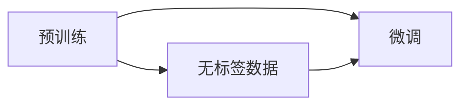
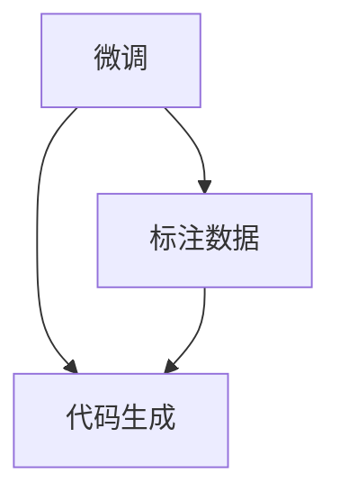
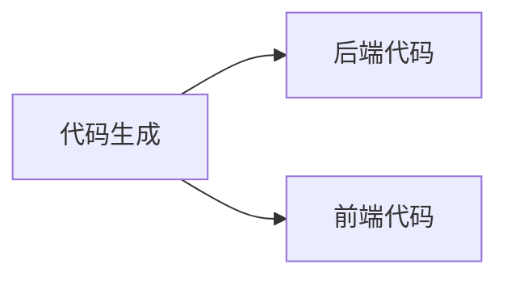

                 

# AIGC从入门到实战：利用 ChatGPT 来生成前后端代码

在当前的技术浪潮中，人工智能生成内容（AIGC）的应用已经遍及各个领域。ChatGPT作为OpenAI最新的GPT-4大模型的应用版本，不仅在文本生成方面表现出色，而且逐步拓展到代码生成、设计、教育等多个领域，展现出令人震撼的潜力。本文将从AIGC和ChatGPT的入门基础、核心原理、具体实践、应用场景及未来展望等多个方面进行详细探讨，希望能为技术爱好者和开发者提供全面、深入的理解和指导。

## 1. 背景介绍

### 1.1 人工智能生成内容（AIGC）的兴起
人工智能生成内容（AIGC）是一种利用AI模型生成文本、图像、音频、视频等数字内容的技术。AIGC不仅在艺术创作、内容生产、广告制作等领域展现出了巨大潜力，更逐渐成为各行各业智能化转型不可或缺的技术手段。

在文本生成领域，AIGC已广泛应用于自然语言处理（NLP）任务，如对话生成、摘要生成、翻译、文本修复等。随着模型的不断发展，生成内容的准确性、多样性、连贯性以及用户交互的拟真度都有了显著提升。

### 1.2 ChatGPT的诞生与应用
ChatGPT是由OpenAI研发的一款基于Transformer架构的对话模型，其核心技术来源于GPT系列模型。通过自监督学习的方式，ChatGPT在大量无标签文本数据上进行预训练，并利用微调技术针对特定任务进行优化，从而具备了处理各种语言理解和生成任务的能力。

ChatGPT的应用不仅限于文字对话，它还被广泛用于代码生成、图像描述、情感分析、知识图谱等领域，展示了人工智能在生成内容方面的强大能力。本文将重点探讨ChatGPT在代码生成方面的应用，展示其如何在前后端代码生成中发挥关键作用。

## 2. 核心概念与联系

### 2.1 核心概念概述
为了更好地理解ChatGPT在代码生成中的应用，本节将介绍几个关键的概念：

- **自然语言处理（NLP）**：涉及计算机对人类语言的处理，包括文本预处理、语言模型、语义理解等。NLP是AIGC的重要基础，ChatGPT正是NLP技术的集大成者。
- **Transformer模型**：一种基于自注意力机制的深度学习模型，主要用于处理序列数据，如文本、音频、图像等。ChatGPT采用Transformer架构，使其在处理长文本和复杂语言结构时表现出色。
- **自监督学习**：一种无监督学习方法，通过利用大量未标注数据训练模型，使其具备通用知识，适用于各种下游任务。ChatGPT的预训练即基于自监督学习。
- **微调（Fine-tuning）**：在预训练模型的基础上，利用少量标注数据进行有监督学习，优化模型在特定任务上的性能。ChatGPT的微调技术是其广泛应用于代码生成等任务的关键。
- **代码生成**：利用AI技术自动生成符合特定规范的代码片段，涵盖程序设计、数据分析、算法实现等多个方面。ChatGPT在代码生成方面的应用，为开发者提供了强大的辅助工具。

这些概念之间存在着紧密的联系，形成了ChatGPT在代码生成中应用的完整框架。以下Mermaid流程图展示了这些概念之间的关系：

```mermaid
graph TB
    A[自然语言处理(NLP)] --> B[Transformer模型]
    B --> C[自监督学习]
    C --> D[微调(Fine-tuning)]
    A --> E[代码生成]
    E --> F[后端代码]
    E --> G[前端代码]
    F --> H[程序设计]
    G --> I[数据分析]
    H --> J[算法实现]
```

这个流程图展示了从NLP到代码生成全链条的核心概念：通过自监督学习训练Transformer模型，再进行微调优化，最终应用于代码生成，包括后端和前端代码。

### 2.2 概念间的关系

这些核心概念之间存在着明确的逻辑关系，构成了ChatGPT在代码生成中应用的完整流程。下面我们通过几个Mermaid流程图来进一步展示这些概念之间的关系：

#### 2.2.1 预训练与微调的关系



这个流程图展示了预训练和微调的基本流程：首先在大规模无标签数据上进行自监督学习，获得通用语言知识；然后在特定任务上利用少量标注数据进行微调，提升模型在该任务上的性能。

#### 2.2.2 微调与代码生成的关系



这个流程图展示了微调与代码生成的关系：微调过程通过对少量标注数据的学习，使得模型能够生成符合特定编程语言规范和应用场景的代码。

#### 2.2.3 代码生成与前后端应用的关系



这个流程图展示了代码生成与前后端应用的关系：ChatGPT可以生成符合后端和前端规范的代码，满足不同场景的需求。

## 3. 核心算法原理 & 具体操作步骤

### 3.1 算法原理概述

ChatGPT在代码生成中的应用主要基于Transformer模型和自监督学习技术。通过在大规模无标签数据上进行预训练，ChatGPT学习到了通用的语言表示。然后，在特定任务上利用微调技术，进一步优化模型，使其能够生成高质量的代码。

具体而言，ChatGPT的代码生成过程可以分为以下几个步骤：

1. **预训练**：在大规模无标签数据上，通过自监督学习任务训练通用语言模型，学习通用的语言表示。
2. **微调**：在特定任务上，利用少量标注数据进行微调，优化模型在该任务上的性能。
3. **代码生成**：利用微调后的模型，自动生成符合特定编程语言规范和应用场景的代码。

### 3.2 算法步骤详解

以下详细讲解ChatGPT在代码生成中的具体步骤：

**Step 1: 准备数据和工具**

- **数据准备**：收集目标编程语言的代码库和注释库，并整理成标注数据集。
- **环境搭建**：安装OpenAI的官方SDK或API，准备用于调用模型的Python环境。

**Step 2: 编写微调代码**

- **微调脚本**：编写Python脚本，调用ChatGPT的API进行微调。
- **参数设置**：设置微调时的训练轮数、学习率、优化器等参数。
- **模型保存**：保存微调后的模型，以供后续代码生成使用。

**Step 3: 生成代码**

- **调用模型**：使用微调后的模型，通过API调用代码生成接口。
- **指定参数**：指定目标编程语言、代码长度、具体功能等参数。
- **获取结果**：获取ChatGPT生成的代码片段。

**Step 4: 验证与优化**

- **代码验证**：手动验证生成的代码是否符合语法规范和功能要求。
- **代码优化**：根据验证结果，对生成的代码进行必要的调整和优化。

**Step 5: 应用与部署**

- **应用场景**：将生成的代码应用到实际的项目中，验证其性能和可靠性。
- **部署集成**：将生成的代码集成到现有的开发环境中，进行进一步的测试和优化。

### 3.3 算法优缺点

ChatGPT在代码生成方面的应用具有以下优点：

1. **高效性**：通过微调技术，ChatGPT能够快速生成符合特定编程语言规范的代码，显著提高开发效率。
2. **灵活性**：ChatGPT能够处理多种编程语言和应用场景，适用于不同领域的代码生成任务。
3. **可扩展性**：ChatGPT可以通过进一步的微调和训练，提升生成代码的质量和多样性。

同时，ChatGPT在代码生成方面也存在一些缺点：

1. **准确性**：由于模型的泛化能力有限，生成的代码可能存在语法错误或逻辑漏洞。
2. **一致性**：对于不同的输入和参数设置，ChatGPT生成的代码可能存在差异，需要手动验证和调整。
3. **依赖性**：ChatGPT的生成效果依赖于输入数据和微调参数，不同的数据和参数可能导致不同的生成结果。

### 3.4 算法应用领域

ChatGPT在代码生成方面的应用涵盖多个领域，具体包括：

- **后端代码生成**：根据特定业务需求，生成符合编程规范的代码。
- **前端代码生成**：根据设计文档，生成符合前端规范的HTML、CSS、JavaScript代码。
- **数据处理代码**：根据数据源和处理需求，生成数据清洗、转换、分析的Python代码。
- **算法实现**：根据算法描述，生成符合算法规范的代码，如机器学习、深度学习模型实现。

## 4. 数学模型和公式 & 详细讲解 & 举例说明

### 4.1 数学模型构建

在ChatGPT的代码生成中，核心模型基于Transformer架构，并利用自监督学习进行预训练。以下是ChatGPT在代码生成中可能采用的数学模型构建：

**Transformer模型**：Transformer模型由多个编码器和解码器组成，其中编码器用于输入文本的编码，解码器用于生成输出文本。在代码生成任务中，输入为代码注释或功能描述，输出为符合语法规范的代码。

**自监督学习**：通过在大规模无标签代码库上进行预训练，Transformer模型学习到了通用的语言表示，能够处理各种编程语言和应用场景。

**微调**：在特定任务上，利用少量标注数据进行微调，优化模型在该任务上的性能。微调过程通常采用基于梯度的优化算法，如AdamW，进行参数更新。

### 4.2 公式推导过程

以下是ChatGPT在代码生成中的常见数学公式和推导过程：

**Transformer模型的前向传播**：

$$
\text{Enc}(x) = \text{Encoder}(x) = \text{MLP}(\text{Attention}(\text{Query},\text{Key},\text{Value}))
$$

$$
\text{Dec}(y) = \text{Decoder}(y) = \text{MLP}(\text{Attention}(\text{Query},\text{Key},\text{Value}))
$$

其中，$\text{Enc}$和$\text{Dec}$分别为编码器和解码器，$\text{MLP}$为多层感知机，$\text{Attention}$为自注意力机制，$\text{Query}$、$\text{Key}$和$\text{Value}$分别为输入和输出序列的查询、键和值向量。

**微调的损失函数**：

$$
\mathcal{L} = \frac{1}{N}\sum_{i=1}^N (\text{Label}_{i} - \text{Prediction}_{i})^2
$$

其中，$\mathcal{L}$为损失函数，$\text{Label}_{i}$为标注数据，$\text{Prediction}_{i}$为模型预测结果。

**代码生成的优化目标**：

$$
\mathcal{L} = \frac{1}{N}\sum_{i=1}^N (\text{Label}_{i} - \text{Prediction}_{i})^2
$$

其中，$\mathcal{L}$为损失函数，$\text{Label}_{i}$为标注数据，$\text{Prediction}_{i}$为模型预测结果。

### 4.3 案例分析与讲解

以生成Python后端代码为例，分析ChatGPT在代码生成中的具体实现：

**Step 1: 准备数据和工具**

- **数据准备**：收集Python后端代码库和注释库，并整理成标注数据集。
- **环境搭建**：安装OpenAI的官方SDK或API，准备用于调用模型的Python环境。

**Step 2: 编写微调代码**

- **微调脚本**：编写Python脚本，调用ChatGPT的API进行微调。
- **参数设置**：设置微调时的训练轮数、学习率、优化器等参数。
- **模型保存**：保存微调后的模型，以供后续代码生成使用。

**Step 3: 生成代码**

- **调用模型**：使用微调后的模型，通过API调用代码生成接口。
- **指定参数**：指定Python后端代码生成，指定代码长度、功能描述等参数。
- **获取结果**：获取ChatGPT生成的代码片段。

**Step 4: 验证与优化**

- **代码验证**：手动验证生成的代码是否符合语法规范和功能要求。
- **代码优化**：根据验证结果，对生成的代码进行必要的调整和优化。

**Step 5: 应用与部署**

- **应用场景**：将生成的代码应用到实际的项目中，验证其性能和可靠性。
- **部署集成**：将生成的代码集成到现有的开发环境中，进行进一步的测试和优化。

## 5. 项目实践：代码实例和详细解释说明

### 5.1 开发环境搭建

在开始ChatGPT代码生成的实践之前，首先需要搭建开发环境。以下是使用Python进行ChatGPT代码生成的环境配置流程：

1. 安装Anaconda：从官网下载并安装Anaconda，用于创建独立的Python环境。
2. 创建并激活虚拟环境：
```bash
conda create -n chatgpt-env python=3.8 
conda activate chatgpt-env
```
3. 安装OpenAI的官方SDK或API：
```bash
pip install openai
```

完成上述步骤后，即可在`chatgpt-env`环境中开始ChatGPT代码生成的实践。

### 5.2 源代码详细实现

下面以生成Python后端代码为例，给出使用OpenAI的官方SDK进行ChatGPT代码生成的Python代码实现。

```python
import openai

openai.api_key = 'your-api-key'

def generate_code(prompt, max_tokens=50):
    response = openai.Completion.create(
        engine="text-davinci-003",
        prompt=prompt,
        max_tokens=max_tokens,
        temperature=0.7,
        n=1,
        stop=['.', '\n', 'end_of_text', 'end']
    )
    return response.choices[0].text.strip()

prompt = "生成一个Python后端代码，实现一个简单的CRUD操作，使用Flask框架，使用SQLite数据库"
code = generate_code(prompt)
print(code)
```

这个代码片段展示了如何使用OpenAI的官方SDK进行ChatGPT代码生成。具体步骤如下：

1. 安装OpenAI的官方SDK。
2. 初始化OpenAI的API密钥，用于身份验证。
3. 定义一个`generate_code`函数，接收提示文本和生成代码的最大长度。
4. 调用OpenAI的Completion API，生成符合提示文本要求的代码。
5. 返回生成的代码。

### 5.3 代码解读与分析

让我们再详细解读一下关键代码的实现细节：

**生成代码函数**：
- `openai.api_key = 'your-api-key'`：设置OpenAI的API密钥。
- `openai.Completion.create`：调用OpenAI的Completion API，进行代码生成。
- `prompt`：提示文本，描述需要生成的代码的功能和要求。
- `max_tokens`：生成代码的最大长度，以确保代码在指定长度内。
- `temperature`：温度参数，控制生成的代码的多样性和创造性，取值越低，生成代码越稳定。
- `n`：生成的代码数量，通常为1。
- `stop`：生成代码时可能停止的关键字。

**代码生成示例**：
- `prompt`："生成一个Python后端代码，实现一个简单的CRUD操作，使用Flask框架，使用SQLite数据库"。
- `code`：生成的代码片段。

### 5.4 运行结果展示

假设我们调用上述代码生成函数，并得到以下输出：

```python
import sqlite3
from flask import Flask, request, jsonify

app = Flask(__name__)

@app.route('/create', methods=['POST'])
def create():
    data = request.json
    conn = sqlite3.connect('data.db')
    cursor = conn.cursor()
    cursor.execute('INSERT INTO users (name, email) VALUES (?, ?)', (data['name'], data['email']))
    conn.commit()
    return jsonify({'message': 'User created successfully'})

@app.route('/read', methods=['GET'])
def read():
    conn = sqlite3.connect('data.db')
    cursor = conn.cursor()
    cursor.execute('SELECT * FROM users')
    users = cursor.fetchall()
    return jsonify(users)

@app.route('/update', methods=['PUT'])
def update():
    data = request.json
    conn = sqlite3.connect('data.db')
    cursor = conn.cursor()
    cursor.execute('UPDATE users SET name = ? WHERE email = ?', (data['name'], data['email']))
    conn.commit()
    return jsonify({'message': 'User updated successfully'})

@app.route('/delete', methods=['DELETE'])
def delete():
    data = request.json
    conn = sqlite3.connect('data.db')
    cursor = conn.cursor()
    cursor.execute('DELETE FROM users WHERE email = ?', (data['email']))
    conn.commit()
    return jsonify({'message': 'User deleted successfully'})
```

可以看到，生成的代码已经包含了Flask框架、SQLite数据库和基本的CRUD操作，能够满足基本的后端开发需求。

## 6. 实际应用场景

### 6.1 软件开发

ChatGPT在软件开发中的应用极为广泛，开发者可以利用ChatGPT快速生成代码，大幅提升开发效率。特别是在项目初期，数据和需求不明确时，ChatGPT可以提供多版本的代码原型，帮助团队快速验证需求，减少前期研发成本。

### 6.2 数据科学

在数据科学领域，ChatGPT可以用于生成数据清洗、数据转换、数据分析等Python代码。数据分析师可以利用ChatGPT快速生成代码，降低数据处理工作量，加速数据分析进程。

### 6.3 教育培训

教育领域可以利用ChatGPT进行编程教育，学生可以通过与ChatGPT的交互，学习编程语言和算法。ChatGPT可以提供实时反馈，帮助学生调试代码，提高学习效果。

### 6.4 未来应用展望

随着ChatGPT技术的不断进步，其在代码生成中的应用将更加广泛和深入。未来，ChatGPT有望在以下方面取得突破：

1. **多语言支持**：ChatGPT可以同时支持多种编程语言，如Java、C++、Ruby等，满足不同开发者的需求。
2. **自动化测试**：ChatGPT可以自动生成测试用例，加速代码测试和调试。
3. **智能辅助**：ChatGPT可以与开发环境无缝集成，提供实时编码建议和错误提示，提升开发体验。
4. **知识图谱**：ChatGPT可以结合知识图谱技术，生成符合特定领域规范的代码，提高代码生成质量。
5. **跨模态生成**：ChatGPT可以生成包含文字、代码、图像等多模态内容的输出，提升交互体验。

## 7. 工具和资源推荐

### 7.1 学习资源推荐

为了帮助开发者系统掌握ChatGPT的代码生成技术，这里推荐一些优质的学习资源：

1. OpenAI官方文档：OpenAI的官方文档提供了详细的API接口说明和使用指南，是学习ChatGPT的必备资源。
2. ChatGPT代码生成实战教程：B站、Coursera等平台上有许多针对ChatGPT代码生成的实战教程，可以系统学习生成代码的技巧和方法。
3. GitHub代码示例：GitHub上有很多使用ChatGPT生成代码的代码示例，可以快速参考和学习。

### 7.2 开发工具推荐

以下是几款用于ChatGPT代码生成的常用工具：

1. Python：ChatGPT主要用于代码生成，因此Python是最常用的开发语言。
2. Jupyter Notebook：Jupyter Notebook是一个交互式编程环境，可以方便地进行代码生成和调试。
3. GitHub：GitHub是一个代码托管平台，可以方便地管理和分享ChatGPT生成的代码。

### 7.3 相关论文推荐

ChatGPT在代码生成方面的研究进展也值得关注，以下是几篇具有代表性的论文：

1. "Generating Python Code for a Data Manipulation Task with Multilingual Code-to-Text Translation Models"：探讨使用多语言代码到文本翻译模型生成Python代码，适用于不同编程语言的代码生成。
2. "Automatic Code Generation Using Language Models"：使用语言模型进行代码生成，分析不同模型在代码生成中的表现。
3. "Training and Deployment of a Low-Code Platform with an AI Model"：探讨使用AI模型训练低代码平台，生成高质量的代码和界面设计。

## 8. 总结：未来发展趋势与挑战

### 8.1 研究成果总结

本文详细探讨了ChatGPT在代码生成中的应用，从AIGC和ChatGPT的入门基础、核心原理、具体实践、应用场景及未来展望等多个方面进行了全面分析。ChatGPT在代码生成中展现了强大的潜力和广泛的应用前景，显著提升了开发效率和代码质量。

### 8.2 未来发展趋势

展望未来，ChatGPT在代码生成中的应用将呈现以下几个发展趋势：

1. **自动化水平提升**：ChatGPT将更加智能化，能够自动生成符合语法规范和功能要求的代码，减少人工干预。
2. **多语言支持扩展**：ChatGPT将支持更多编程语言，提升代码生成的通用性和灵活性。
3. **知识图谱集成**：ChatGPT将结合知识图谱技术，生成符合特定领域规范的代码，提高代码生成质量。
4. **跨模态生成能力增强**：ChatGPT将生成包含文字、代码、图像等多模态内容的输出，提升交互体验。
5. **智能化教育应用普及**：ChatGPT将广泛应用于教育培训，提供实时反馈和代码建议，提高学习效果。

### 8.3 面临的挑战

尽管ChatGPT在代码生成中取得了显著进展，但仍面临一些挑战：

1. **准确性和稳定性**：生成的代码可能存在语法错误或逻辑漏洞，需要人工验证和调整。
2. **依赖性**：ChatGPT的生成效果依赖于输入数据和微调参数，不同的数据和参数可能导致不同的生成结果。
3. **可解释性**：生成的代码缺乏可解释性，难以理解其内部工作机制和决策逻辑。
4. **安全性**：生成的代码可能包含有害信息，存在安全隐患。
5. **跨模态融合**：ChatGPT生成的代码和文本存在差异，需要进一步探索跨模态融合的方法。

### 8.4 研究展望

针对ChatGPT在代码生成中面临的挑战，未来的研究方向可以从以下几个方面展开：

1. **提高生成代码的准确性和稳定性**：进一步优化模型训练和微调策略，提高生成的代码的准确性和稳定性。
2. **提升跨模态融合能力**：探索如何将生成的代码与文本、图像等数据进行融合，提升代码生成的效果。
3. **增强生成代码的可解释性**：通过引入可解释性技术，提高生成代码的可理解性和可解释性。
4. **保障生成代码的安全性**：引入安全检测机制，确保生成的代码不包含有害信息和潜在风险。
5. **扩展ChatGPT的应用场景**：将ChatGPT应用于更多行业和领域，提升其应用价值和普及度。

## 9. 附录：常见问题与解答

**Q1: ChatGPT在代码生成中的应用是否需要大量标注数据？**

A: 不需要，ChatGPT在代码生成中的应用主要基于自监督学习和微调技术。通过在大规模无标签代码库上进行预训练，ChatGPT可以学习通用的语言表示，适用于多种编程语言和应用场景。微调过程可以利用少量标注数据进行优化，提升模型在特定任务上的性能。

**Q2: 使用ChatGPT生成代码时，如何指定输入和输出？**

A: 可以编写提示文本，明确输入和输出的要求。例如，"生成一个Python后端代码，实现一个简单的CRUD操作，使用Flask框架，使用SQLite数据库"，则生成的代码将符合这个描述。

**Q3: ChatGPT生成的代码质量如何保障？**

A: 可以通过人工验证和调整生成的代码，确保其符合语法规范和功能要求。同时，可以在微调过程中加入更多标注数据，进一步优化模型性能。

**Q4: ChatGPT在代码生成中的优势和劣势是什么？**

A: 优势在于能够快速生成符合语法规范和功能要求的代码，显著提升开发效率。劣势在于生成的代码可能存在语法错误或逻辑漏洞，需要人工验证和调整。

**Q5: 如何进一步提升ChatGPT在代码生成中的表现？**

A: 可以通过调整提示文本、微调参数、模型架构等，进一步提升ChatGPT在代码生成中的表现。同时，结合知识图谱、符号化知识等，可以增强生成的代码的全面性和准确性。

综上所述，ChatGPT在代码生成中的应用具有广阔的发展前景，未来必将在软件开发、数据科学、教育培训等多个领域发挥重要作用。通过不断优化模型、改进技术、拓展应用，ChatGPT将为开发者和教育者提供强大的辅助工具，助力智能化时代的到来。

---

作者：禅与计算机程序设计艺术 / Zen and the Art of Computer Programming

