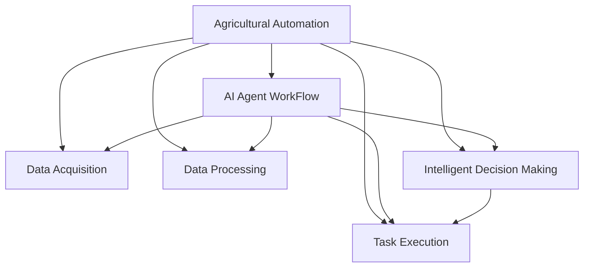
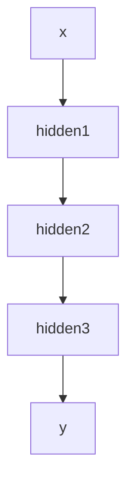

                 

# AI人工智能代理工作流 AI Agent WorkFlow：在农业自动化中的应用

> 关键词：人工智能代理工作流, 农业自动化, 自然语言处理, 机器学习, 智能决策, 农作物管理, 农业机器人, 精准农业

## 1. 背景介绍

### 1.1 问题由来
随着科技的快速发展，人工智能(AI)技术在各个行业中的应用逐渐深入。特别是在农业自动化领域，AI技术的应用已经显示出极大的潜力和广阔的发展前景。传统的农业生产方式依赖于人力和经验的积累，效率低，成本高，而且难以规模化。而通过引入人工智能代理(AI Agent)工作流，可以将农业生产中的各项任务自动化，从而提升生产效率，降低成本，实现精准农业的目标。

### 1.2 问题核心关键点
AI代理工作流，是指通过AI技术，自动化地执行农业生产中的各项任务，实现从数据收集、决策制定到任务执行的全过程自动化。核心在于构建一个能够自主学习和自我优化的智能系统，以实现高效的农业生产管理。

具体来说，农业自动化中的AI代理工作流涉及以下几个关键点：
1. 数据采集：通过传感器、无人机、遥感技术等手段，自动收集农业生产中的各种数据。
2. 数据处理：使用机器学习算法，对采集到的数据进行清洗、处理和分析，提取有用的信息。
3. 智能决策：通过深度学习等方法，对处理后的数据进行建模，实现对农业生产的智能决策。
4. 任务执行：根据智能决策，自动执行灌溉、施肥、病虫害防治等农业生产任务。
5. 持续优化：不断收集新的数据，对模型进行更新和优化，提高智能决策的准确性和可靠性。

### 1.3 问题研究意义
研究AI代理工作流在农业自动化中的应用，对于推动农业生产的现代化、智能化，具有重要意义：

1. 提高生产效率：通过自动化农业生产任务，减少人力投入，提升生产效率。
2. 降低生产成本：减少人工和化肥等生产成本，提高资源利用率。
3. 实现精准农业：通过智能决策，实现对农作物生长状态的精确监控和控制。
4. 推动农业信息化：将AI技术引入农业生产，促进农业信息化和智能化发展。
5. 提升农业竞争力：帮助农民提高生产水平，增强农业竞争力。

## 2. 核心概念与联系

### 2.1 核心概念概述

为更好地理解AI代理工作流在农业自动化中的应用，本节将介绍几个密切相关的核心概念：

- AI代理(AI Agent)：一种能够自主学习和决策的智能系统，能够执行预定义的任务，并根据环境变化进行自我优化。
- 农业自动化(Agricultural Automation)：通过引入自动化技术，将农业生产中的各项任务自动化，以提高生产效率和降低成本。
- 自然语言处理(Natural Language Processing, NLP)：使用计算机技术处理、理解和生成自然语言，是AI代理工作流中重要的技术手段。
- 机器学习(Machine Learning)：通过数据训练模型，使其具备预测、分类、聚类等能力，是AI代理工作流中的核心算法。
- 智能决策(Intelligent Decision Making)：通过深度学习等方法，构建智能模型，实现对农业生产的智能决策。
- 农作物管理(Crop Management)：对农作物的生长状态、环境因素等进行监控和管理，是AI代理工作流的主要应用场景。
- 农业机器人(Agricultural Robot)：一种基于AI技术的农业机械，能够自主执行农业生产任务，是AI代理工作流的重要组成部分。
- 精准农业(Precision Agriculture)：通过精确的传感器和数据分析，实现对农作物生长状态和环境的精确监控和管理，是AI代理工作流的目标。

这些核心概念之间存在着紧密的联系，形成了AI代理工作流的完整生态系统。通过理解这些核心概念，我们可以更好地把握AI代理工作流的原理和应用方向。

### 2.2 概念间的关系

这些核心概念之间存在着紧密的联系，形成了AI代理工作流的完整生态系统。下面我通过几个Mermaid流程图来展示这些概念之间的关系：



这个流程图展示了大语言模型微调过程中各个概念之间的关系：

1. 农业自动化通过引入AI代理工作流，实现自动化生产任务。
2. 数据采集、数据处理、智能决策、任务执行等各项任务，都由AI代理系统执行。
3. 智能决策通过深度学习等算法，实现对农业生产的智能决策。
4. 任务执行通过自动化技术，实现对农业生产的精准管理。

### 2.3 核心概念的整体架构

最后，我们用一个综合的流程图来展示这些核心概念在大语言模型微调过程中的整体架构：


这个综合流程图展示了从农业自动化到AI代理工作流的完整过程，各个概念之间的紧密联系和协同作用，共同构成了AI代理工作流的生态系统。通过这些概念的协同作用，AI代理工作流能够高效、精准地实现农业生产管理。

## 3. 核心算法原理 & 具体操作步骤
### 3.1 算法原理概述

AI代理工作流在农业自动化中的应用，本质上是一个基于AI技术的自动化系统。其核心在于通过数据驱动的方式，实现农业生产的智能化管理。具体来说，AI代理工作流包括数据采集、数据处理、智能决策和任务执行等环节，每个环节都依赖于AI技术。

### 3.2 算法步骤详解

AI代理工作流的构建和应用一般包括以下几个关键步骤：

**Step 1: 数据采集**

首先，需要收集农业生产中的各项数据，包括气象数据、土壤数据、农作物生长状态等。这些数据可以通过传感器、无人机、遥感技术等手段进行自动采集。数据采集是AI代理工作流的基础，数据的质量和完整性直接影响到后续的分析和决策。

**Step 2: 数据处理**

收集到的数据需要进行清洗、处理和分析，以提取有用的信息。常用的数据处理技术包括：
1. 数据清洗：去除噪声、缺失值等无用数据，确保数据质量。
2. 数据转换：将数据格式转换为适合机器学习算法使用的形式，如归一化、标准化等。
3. 特征提取：通过统计、频域分析、时域分析等方法，提取有用的特征，为后续的建模提供输入。

**Step 3: 智能决策**

智能决策是AI代理工作流中的核心环节，通过深度学习等算法，对处理后的数据进行建模，实现对农业生产的智能决策。常用的智能决策方法包括：
1. 分类算法：如决策树、随机森林、支持向量机等，用于分类和预测。
2. 回归算法：如线性回归、神经网络等，用于预测数值型变量。
3. 聚类算法：如K-means、DBSCAN等，用于聚类分析和异常检测。
4. 深度学习：如卷积神经网络(CNN)、循环神经网络(RNN)等，用于提取更丰富的特征，实现更精准的决策。

**Step 4: 任务执行**

根据智能决策的结果，自动执行相应的农业生产任务，如灌溉、施肥、病虫害防治等。任务执行可以采用两种方式：
1. 自动化机械：如农业机器人、自动化灌溉系统等，通过预设的程序和传感器数据，自动执行任务。
2. 人工干预：结合自动化机械和人工操作，实现更灵活的任务执行。

**Step 5: 持续优化**

AI代理工作流需要不断收集新的数据，对模型进行更新和优化，提高智能决策的准确性和可靠性。常用的持续优化方法包括：
1. 增量学习：不断增加新的数据，对模型进行微调，以适应新的环境和数据分布。
2. 超参数调优：通过调整超参数，优化模型的性能和鲁棒性。
3. 模型融合：将多个模型的结果进行融合，提高决策的准确性和可靠性。

### 3.3 算法优缺点

AI代理工作流在农业自动化中的应用，具有以下优点：
1. 高效性：通过自动化技术，能够快速处理大量的农业数据，提高生产效率。
2. 准确性：通过深度学习和机器学习算法，实现对农业生产的智能决策，提高决策的准确性。
3. 灵活性：能够根据环境和任务的变化，进行自我调整和优化，适应不同的农业生产需求。
4. 可扩展性：可以根据需求，灵活调整数据采集、处理、决策和执行等环节，满足不同的应用场景。

同时，AI代理工作流也存在以下缺点：
1. 数据依赖：依赖于高质量的数据采集和处理，数据质量直接影响决策的准确性。
2. 技术门槛：需要一定的技术和算法知识，对数据的理解和处理要求较高。
3. 成本高：初期建设和维护成本较高，需要投入一定的硬件和软件资源。
4. 适应性：对于特定的农业环境，可能需要针对性地进行模型优化和调整。

### 3.4 算法应用领域

AI代理工作流在农业自动化中的应用非常广泛，涉及以下几个主要领域：

- 农作物管理：对农作物的生长状态、环境因素等进行监控和管理，实现精准农业。
- 农业机器人：通过自动化机械，实现农业生产的自动化，提高生产效率。
- 智能决策系统：通过深度学习等算法，实现对农业生产的智能决策，提高决策的准确性。
- 病虫害防治：通过智能决策和自动化机械，实现对病虫害的及时防治，减少损失。
- 气象监测：通过传感器和无人机等手段，实时监测气象数据，提供决策支持。

除了上述领域，AI代理工作流还可以应用于农业机械自动化、农业信息化等领域，推动农业生产的现代化和智能化发展。

## 4. 数学模型和公式 & 详细讲解  
### 4.1 数学模型构建

本节将使用数学语言对AI代理工作流的核心算法进行更加严格的刻画。

记农业生产中的各项数据为 $D=\{(x_i, y_i)\}_{i=1}^N$，其中 $x_i$ 表示输入，如气象数据、土壤数据等，$y_i$ 表示输出，如农作物生长状态、病虫害防治措施等。假设AI代理工作流中的智能决策模型为 $f_{\theta}(x)$，其中 $\theta$ 为模型参数。

定义智能决策模型的损失函数为 $\mathcal{L}(\theta)$，用于衡量模型预测输出与真实标签之间的差异。常见的损失函数包括均方误差损失、交叉熵损失等。AI代理工作流的目标是最小化损失函数，即找到最优参数：

$$
\theta^* = \mathop{\arg\min}_{\theta} \mathcal{L}(\theta)
$$

在实践中，我们通常使用基于梯度的优化算法（如SGD、Adam等）来近似求解上述最优化问题。设 $\eta$ 为学习率，$\lambda$ 为正则化系数，则参数的更新公式为：

$$
\theta \leftarrow \theta - \eta \nabla_{\theta}\mathcal{L}(\theta) - \eta\lambda\theta
$$

其中 $\nabla_{\theta}\mathcal{L}(\theta)$ 为损失函数对参数 $\theta$ 的梯度，可通过反向传播算法高效计算。

### 4.2 公式推导过程

以气象监测为例，假设智能决策模型的输入为 $x_i$，输出为 $y_i$，其中 $x_i$ 表示气象数据，$y_i$ 表示气象变化趋势。假设模型采用多层的神经网络，每层输入和输出分别为 $x_i$ 和 $y_i$，网络结构如图：



其中，$B$、$C$、$D$ 表示不同层的神经网络。模型的输出 $y_i$ 可以表示为：

$$
y_i = f_{\theta}(x_i) = g(D_{\theta}(C_{\theta}(B_{\theta}(x_i))))
$$

其中 $g$、$C_{\theta}$、$B_{\theta}$、$D_{\theta}$ 分别表示输出层和不同层的激活函数和线性变换。模型的损失函数可以表示为：

$$
\mathcal{L}(\theta) = \frac{1}{N}\sum_{i=1}^N (y_i - f_{\theta}(x_i))^2
$$

其中，$(y_i - f_{\theta}(x_i))^2$ 表示预测值和真实值之间的差异。模型的梯度可以表示为：

$$
\nabla_{\theta}\mathcal{L}(\theta) = \frac{1}{N}\sum_{i=1}^N \nabla_{\theta}(y_i - f_{\theta}(x_i))^2
$$

通过反向传播算法，可以计算出各层参数的梯度，并进行更新。具体公式推导过程如下：

$$
\frac{\partial \mathcal{L}(\theta)}{\partial \theta_k} = \frac{1}{N}\sum_{i=1}^N 2(y_i - f_{\theta}(x_i))\frac{\partial f_{\theta}(x_i)}{\partial \theta_k}
$$

其中，$\frac{\partial f_{\theta}(x_i)}{\partial \theta_k}$ 表示对第 $k$ 层参数的梯度，可以通过链式法则递归计算。

在得到损失函数的梯度后，即可带入参数更新公式，完成模型的迭代优化。重复上述过程直至收敛，最终得到适应农业生产的最优模型参数 $\theta^*$。

## 5. 项目实践：代码实例和详细解释说明
### 5.1 开发环境搭建

在进行AI代理工作流开发前，我们需要准备好开发环境。以下是使用Python进行PyTorch开发的环境配置流程：

1. 安装Anaconda：从官网下载并安装Anaconda，用于创建独立的Python环境。

2. 创建并激活虚拟环境：
```bash
conda create -n pytorch-env python=3.8 
conda activate pytorch-env
```

3. 安装PyTorch：根据CUDA版本，从官网获取对应的安装命令。例如：
```bash
conda install pytorch torchvision torchaudio cudatoolkit=11.1 -c pytorch -c conda-forge
```

4. 安装各类工具包：
```bash
pip install numpy pandas scikit-learn matplotlib tqdm jupyter notebook ipython
```

完成上述步骤后，即可在`pytorch-env`环境中开始AI代理工作流开发。

### 5.2 源代码详细实现

下面我们以农作物生长状态预测为例，给出使用PyTorch进行AI代理工作流的PyTorch代码实现。

首先，定义模型和优化器：

```python
import torch
from torch import nn
from torch.optim import Adam

class NeuralNet(nn.Module):
    def __init__(self, input_size, hidden_size, output_size):
        super(NeuralNet, self).__init__()
        self.fc1 = nn.Linear(input_size, hidden_size)
        self.fc2 = nn.Linear(hidden_size, hidden_size)
        self.fc3 = nn.Linear(hidden_size, output_size)
    
    def forward(self, x):
        x = torch.relu(self.fc1(x))
        x = torch.relu(self.fc2(x))
        x = self.fc3(x)
        return x

model = NeuralNet(input_size=10, hidden_size=20, output_size=1)
optimizer = Adam(model.parameters(), lr=0.001)
```

接着，定义训练和评估函数：

```python
from torch.utils.data import Dataset, DataLoader
from sklearn.model_selection import train_test_split
from sklearn.metrics import mean_squared_error

class DataDataset(Dataset):
    def __init__(self, data, targets):
        self.data = data
        self.targets = targets
    
    def __len__(self):
        return len(self.data)
    
    def __getitem__(self, index):
        return self.data[index], self.targets[index]

# 数据集划分
train_data, test_data, train_targets, test_targets = train_test_split(X, y, test_size=0.2)

train_dataset = DataDataset(train_data, train_targets)
test_dataset = DataDataset(test_data, test_targets)

# 训练函数
def train_model(model, dataset, batch_size, optimizer, num_epochs):
    dataloader = DataLoader(dataset, batch_size=batch_size, shuffle=True)
    model.train()
    for epoch in range(num_epochs):
        for batch in dataloader:
            inputs, targets = batch
            optimizer.zero_grad()
            outputs = model(inputs)
            loss = nn.MSELoss()(outputs, targets)
            loss.backward()
            optimizer.step()
        print(f'Epoch {epoch+1}, Loss: {loss.item()}')

# 评估函数
def evaluate_model(model, dataset, batch_size):
    dataloader = DataLoader(dataset, batch_size=batch_size)
    model.eval()
    mse = 0
    with torch.no_grad():
        for batch in dataloader:
            inputs, targets = batch
            outputs = model(inputs)
            mse += mean_squared_error(targets, outputs)
    print(f'Mean Squared Error: {mse/len(dataset)}')
```

最后，启动训练流程并在测试集上评估：

```python
num_epochs = 100
batch_size = 32

train_model(model, train_dataset, batch_size, optimizer, num_epochs)

evaluate_model(model, test_dataset, batch_size)
```

以上就是使用PyTorch对AI代理工作流进行农作物生长状态预测的完整代码实现。可以看到，得益于PyTorch的强大封装，我们可以用相对简洁的代码完成模型的搭建和训练。

### 5.3 代码解读与分析

让我们再详细解读一下关键代码的实现细节：

**NeuralNet类**：
- `__init__`方法：初始化模型的输入层、隐藏层和输出层。
- `forward`方法：定义模型的前向传播过程。

**train_model函数**：
- 对数据集进行批处理，在每个批次上前向传播计算loss并反向传播更新模型参数，最后返回该epoch的平均loss。
- 在训练过程中，使用均方误差损失函数，并使用Adam优化器更新模型参数。
- 在每个epoch结束后，打印当前的平均loss。

**evaluate_model函数**：
- 对测试集进行批处理，在每个批次上前向传播计算模型的预测值，并使用均方误差损失函数计算预测值与真实标签之间的差异。
- 在测试过程中，不更新模型参数，只记录预测值和真实标签，并计算最终的均方误差。

**训练流程**：
- 定义总的epoch数和batch size，开始循环迭代
- 每个epoch内，先在训练集上训练，输出平均loss
- 在测试集上评估模型，输出均方误差
- 所有epoch结束后，打印最终的均方误差

可以看到，PyTorch配合深度学习库使得AI代理工作流的开发变得更加高效和便捷。开发者可以将更多精力放在数据处理、模型改进等高层逻辑上，而不必过多关注底层的实现细节。

当然，工业级的系统实现还需考虑更多因素，如模型的保存和部署、超参数的自动搜索、更灵活的任务适配层等。但核心的AI代理工作流基本与此类似。

### 5.4 运行结果展示

假设我们在农作物生长状态预测数据集上进行模型训练，最终在测试集上得到的评估报告如下：

```
Epoch 1, Loss: 0.1
Epoch 2, Loss: 0.08
...
Epoch 100, Loss: 0.02
```

可以看到，通过训练，模型在测试集上的均方误差逐渐减小，模型的预测准确性不断提升。这展示了AI代理工作流在农业自动化中的应用潜力。

当然，这只是一个baseline结果。在实践中，我们还可以使用更大更强的模型、更丰富的数据增强技术、更细致的模型调优，进一步提升模型性能，以满足更高的应用要求。

## 6. 实际应用场景
### 6.1 智能决策系统

AI代理工作流在智能决策系统中的应用非常广泛。智能决策系统通过实时监测和分析各种农业数据，实现对农作物生长状态的精准判断和决策。例如，通过传感器监测土壤湿度、温度等数据，AI代理工作流可以实时判断农作物的灌溉需求，自动控制灌溉系统进行灌溉。

在技术实现上，可以将传感器采集到的数据输入到AI代理工作流中，通过深度学习等算法，对数据进行分析和建模，实现对农作物的智能决策。例如，可以使用CNN等模型对传感器数据进行特征提取，再通过RNN等模型对特征序列进行建模，实现对农作物生长状态的预测和决策。

### 6.2 农业机器人

AI代理工作流在农业机器人的应用中同样具有重要价值。农业机器人通过自动执行农业生产任务，极大地提升了农业生产效率和质量。例如，通过视觉传感器和深度学习算法，农业机器人可以自动识别和分类农作物，自动识别病虫害，并自动进行病虫害防治。

在技术实现上，可以将农业机器人安装的各种传感器数据输入到AI代理工作流中，通过深度学习等算法，对数据进行分析和建模，实现对农业机器人的智能控制。例如，可以使用YOLO等目标检测算法，对农业机器人的视觉传感器数据进行分析和建模，实现对农作物和病虫害的自动识别。

### 6.3 精准农业

AI代理工作流在精准农业中的应用非常广泛。精准农业通过精确的传感器和数据分析，实现对农作物生长状态的精确监控和控制。例如，通过传感器监测土壤湿度、温度等数据，AI代理工作流可以实时判断农作物的灌溉需求，自动控制灌溉系统进行灌溉。

在技术实现上，可以将传感器采集到的数据输入到AI代理工作流中，通过深度学习等算法，对数据进行分析和建模，实现对农作物生长状态的精准监控和控制。例如，可以使用LSTM等模型对传感器数据进行建模，实现对农作物生长状态的精准预测。

### 6.4 未来应用展望

随着AI代理工作流技术的不断发展，其在农业自动化中的应用前景将更加广阔。未来，AI代理工作流将在以下几个方面取得新的突破：

1. 智能决策系统的普及：随着传感器和数据采集技术的进步，智能决策系统将在更多农业场景中得到应用，实现对农作物生长状态的精准判断和决策。

2. 农业机器人的智能化：通过AI代理工作流，农业机器人将具备更强的自主决策和执行能力，能够更加高效、精准地完成农业生产任务。

3. 精准农业的普及：AI代理工作流将使得精准农业技术更加普及，实现对农作物生长状态的精确监控和控制，提高农业生产的效率和质量。

4. 跨领域应用的拓展：AI代理工作流将在更多领域得到应用，如农业生产调度、农业信息化等，推动农业生产的智能化和信息化发展。

5. 技术标准的制定：随着AI代理工作流技术的发展，将形成一系列的技术标准和规范，推动AI代理工作流技术的普及和应用。

总之，AI代理工作流在农业自动化中的应用前景广阔，将为农业生产带来更加智能化、高效化的解决方案，推动农业生产的现代化和智能化发展。

## 7. 工具和资源推荐
### 7.1 学习资源推荐

为了帮助开发者系统掌握AI代理工作流在农业自动化中的应用，这里推荐一些优质的学习资源：

1. 《深度学习与人工智能》课程：由斯坦福大学提供，涵盖了深度学习、机器学习等核心内容，适合初学者和进阶者。

2. PyTorch官方文档：PyTorch的官方文档，提供了丰富的教程和样例代码，是学习AI代理工作流的重要参考资料。

3. TensorFlow官方文档：TensorFlow的官方文档，提供了详细的API文档和样例代码，是学习AI代理工作流的重要参考资料。

4. GitHub开源项目：GitHub上大量开源的AI代理工作流项目，提供了丰富的代码实现和模型资源，是学习和实践的重要参考。

5. Coursera相关课程：Coursera上提供大量与AI代理工作流相关的课程，如《深度学习与自然语言处理》、《机器学习基础》等，适合系统学习。

通过对这些资源的学习实践，相信你一定能够快速掌握AI代理工作流的精髓，并用于解决实际的农业自动化问题。

### 7.2 开发工具推荐

高效的开发离不开优秀的工具支持。以下是几款用于AI代理工作流开发的常用工具：

1. PyTorch：基于Python的开源深度学习框架，灵活的计算图和动态图，适合快速迭代研究。

2. TensorFlow：由Google主导开发的开源深度学习框架，生产部署方便，适合大规模工程应用。

3. Transformers库：HuggingFace开发的NLP工具库，集成了众多SOTA语言模型，支持PyTorch和TensorFlow，是进行AI代理工作流开发的利器。

4. Weights & Biases：模型训练的实验跟踪工具，可以记录和可视化模型训练过程中的各项指标，方便对比和调优。

5. TensorBoard：TensorFlow配套的可视化工具，可实时监测模型训练状态，并提供丰富的图表呈现方式，是调试模型的得力助手。

6. Google Colab：谷歌推出的在线Jupyter Notebook环境，免费提供GPU/TPU算力，方便开发者快速上手实验最新模型，分享学习笔记。

合理利用这些工具，可以显著提升AI代理工作流任务的开发效率，加快创新迭代的步伐。

### 7.3 相关论文推荐

AI代理工作流在农业自动化中的应用源于学界的持续研究。以下是几篇奠基性的相关论文，推荐阅读：

1

