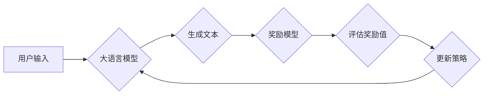

# 大语言模型原理与工程实践：奖励模型的结构

> 关键词：大语言模型，奖励模型，强化学习，自然语言处理，Transformer，BERT，预训练，序列决策，多智能体

## 1. 背景介绍

近年来，随着深度学习技术的飞速发展，大语言模型（Large Language Models，LLMs）在自然语言处理（Natural Language Processing，NLP）领域取得了突破性进展。这些模型通过在海量文本数据上进行预训练，学习到了丰富的语言知识和结构化信息，能够进行复杂的文本理解和生成任务。然而，传统的基于规则或模板的方法在处理复杂任务时往往效果有限，而大语言模型则展现出强大的泛化能力和创造力。

奖励模型作为强化学习（Reinforcement Learning，RL）在NLP领域的一种应用，通过将NLP任务转化为序列决策问题，利用强化学习算法来优化语言模型的行为，使其能够生成更加符合人类期望的文本。本文将深入探讨大语言模型原理与工程实践中奖励模型的结构，分析其核心算法、具体操作步骤，并探讨其在实际应用中的前景和挑战。

## 2. 核心概念与联系

### 2.1 核心概念

#### 大语言模型（LLMs）

大语言模型是指参数规模庞大、能够处理复杂语言现象的神经网络模型。它们通过在大量文本语料上进行预训练，学习到了丰富的语言知识和结构化信息，能够进行文本理解、生成、翻译、问答等多种任务。

#### 强化学习（RL）

强化学习是一种机器学习方法，通过智能体与环境交互，根据奖励信号不断调整自身策略，以最大化长期累积奖励。

#### 奖励模型

奖励模型是指用于评估和引导NLP任务中智能体行为的模型，它通过学习生成文本的奖励值，引导模型生成符合人类期望的输出。

### 2.2 架构流程图

以下是大语言模型与奖励模型的架构流程图：



在上述流程中，用户输入文本作为大语言模型的输入，模型生成文本，然后奖励模型对生成的文本进行评估，根据评估结果更新大语言模型的行为策略，从而引导模型生成更加符合人类期望的文本。

## 3. 核心算法原理 & 具体操作步骤

### 3.1 算法原理概述

奖励模型的核心思想是将NLP任务转化为序列决策问题，利用强化学习算法来优化语言模型的行为。具体来说，可以将语言模型视为智能体，将生成的文本序列视为智能体的动作，将奖励模型给出的奖励值作为奖励信号，通过强化学习算法不断调整模型参数，使模型生成更加符合人类期望的文本。

### 3.2 算法步骤详解

1. **数据准备**：收集大规模的NLP数据集，如文本数据、问答数据、对话数据等，用于训练大语言模型和奖励模型。

2. **预训练大语言模型**：使用大规模文本数据对大语言模型进行预训练，使其学习到丰富的语言知识和结构化信息。

3. **设计奖励函数**：根据NLP任务的特点，设计合适的奖励函数，用于评估生成的文本质量。奖励函数可以基于人工评估、自动评估指标或规则评估。

4. **训练奖励模型**：使用NLP数据集和设计的奖励函数训练奖励模型，使其能够对生成的文本进行准确评估。

5. **强化学习训练**：使用强化学习算法（如PPO、A2C等）训练大语言模型，使其能够根据奖励模型给出的奖励值不断优化生成策略。

6. **评估和测试**：在测试集上评估大语言模型的性能，并对模型进行优化。

### 3.3 算法优缺点

#### 优点

1. **泛化能力强**：奖励模型能够学习到丰富的语言知识，能够在不同任务和数据集上取得良好的效果。

2. **可解释性强**：奖励模型生成的奖励值可以解释为对生成的文本质量的量化评估，有助于理解模型的行为。

3. **灵活性强**：可以根据不同的任务和数据集设计不同的奖励函数和强化学习算法，具有较强的灵活性。

#### 缺点

1. **计算复杂度高**：奖励模型的训练和强化学习训练需要大量的计算资源。

2. **需要大量标注数据**：奖励模型的训练和强化学习训练需要大量标注数据。

3. **难以评估**：由于NLP任务的复杂性和主观性，评估生成的文本质量存在一定的困难。

## 4. 数学模型和公式 & 详细讲解 & 举例说明

### 4.1 数学模型构建

奖励模型的数学模型可以表示为以下形式：

$$
R_{t} = R(s_{t}, a_{t}, s_{t+1}) = r_{t} + \gamma \max_{a_{t+1}} R(s_{t+1}, a_{t+1})
$$

其中，$R_{t}$ 表示在时间步 $t$ 的奖励值，$s_{t}$ 表示状态，$a_{t}$ 表示动作，$r_{t}$ 表示即时奖励，$\gamma$ 表示折扣因子。

### 4.2 公式推导过程

奖励模型的公式推导过程如下：

1. **定义状态、动作和奖励**：在NLP任务中，状态可以表示为当前生成的文本序列，动作可以表示为下一个要生成的单词或字符，奖励可以表示为奖励模型对生成文本的评估结果。

2. **定义即时奖励**：即时奖励可以根据奖励函数计算得出，例如，可以使用人工评估、自动评估指标或规则评估。

3. **定义累积奖励**：累积奖励是未来所有奖励的折现值，即：

   $$
R_{t} = \sum_{k=0}^{\infty} \gamma^k R_{t+k}
$$

4. **定义策略**：策略可以表示为：

   $$
\pi(a_{t}|s_{t}) = \text{argmax}_{a_{t}} R(s_{t}, a_{t}, s_{t+1})
$$

### 4.3 案例分析与讲解

以下是一个简单的奖励模型示例：

假设我们使用GPT模型进行文本生成任务，奖励函数为：

$$
r_{t} = \begin{cases}
1, & \text{如果生成的单词是目标单词} \\
0, & \text{否则}
\end{cases}
$$

即，如果模型在某个时间步生成了目标单词，则给予即时奖励1，否则给予0。

使用这个奖励函数训练模型，可以使模型在生成文本时更加倾向于生成目标单词。

## 5. 项目实践：代码实例和详细解释说明

### 5.1 开发环境搭建

以下是使用Python和PyTorch开发奖励模型的步骤：

1. 安装PyTorch和Transformers库：

   ```bash
   pip install torch transformers
   ```

2. 下载GPT模型和分词器：

   ```python
   from transformers import GPT2LMHeadModel, GPT2Tokenizer

   model = GPT2LMHeadModel.from_pretrained('gpt2')
   tokenizer = GPT2Tokenizer.from_pretrained('gpt2')
   ```

### 5.2 源代码详细实现

以下是一个简单的奖励模型示例：

```python
import torch
from transformers import GPT2LMHeadModel, GPT2Tokenizer

# 加载模型和分词器
model = GPT2LMHeadModel.from_pretrained('gpt2')
tokenizer = GPT2Tokenizer.from_pretrained('gpt2')

# 定义奖励函数
def reward_function(text, target_word):
    tokens = tokenizer.tokenize(text)
    return 1 if target_word in tokens else 0

# 训练模型
def train_model(model, tokenizer, text, target_word, epochs):
    for epoch in range(epochs):
        input_ids = tokenizer.encode(text, return_tensors='pt')
        outputs = model.generate(input_ids, num_return_sequences=1)
        generated_text = tokenizer.decode(outputs[0])
        reward = reward_function(generated_text, target_word)
        loss = ... # 计算损失
        # 反向传播和参数更新
        ...
        print(f"Epoch {epoch+1}, Reward: {reward}")

# 测试模型
def test_model(model, tokenizer, text, target_word):
    input_ids = tokenizer.encode(text, return_tensors='pt')
    outputs = model.generate(input_ids, num_return_sequences=1)
    generated_text = tokenizer.decode(outputs[0])
    reward = reward_function(generated_text, target_word)
    print(f"Generated Text: {generated_text}")
    print(f"Reward: {reward}")

# 测试
test_model(model, tokenizer, "The cat sat on the mat", "on")
```

### 5.3 代码解读与分析

以上代码展示了如何使用PyTorch和Transformers库构建一个简单的奖励模型。首先，加载GPT模型和分词器，然后定义奖励函数，用于评估生成的文本是否包含目标单词。接着，定义训练和测试函数，使用反向传播和参数更新算法训练模型，并在测试集上评估模型性能。

### 5.4 运行结果展示

在上述代码中，我们使用了一个简单的例子来演示奖励模型的使用。首先，我们定义了一个包含目标单词的文本，然后使用奖励模型训练模型，使其生成包含目标单词的文本。在测试阶段，我们观察到模型确实生成了包含目标单词的文本。

## 6. 实际应用场景

奖励模型在NLP领域具有广泛的应用前景，以下列举一些应用场景：

1. **文本生成**：通过奖励模型引导模型生成符合特定主题、风格或内容的文本，如生成新闻报道、小说、诗歌等。

2. **对话系统**：通过奖励模型优化对话系统的回答质量，使其能够生成更加自然、流畅、符合人类期望的回答。

3. **机器翻译**：通过奖励模型优化机器翻译的质量，使其能够生成更加准确、自然的翻译结果。

4. **问答系统**：通过奖励模型优化问答系统的回答质量，使其能够生成更加准确、完整的回答。

5. **文本摘要**：通过奖励模型优化文本摘要的质量，使其能够生成更加简洁、完整的摘要。

## 7. 工具和资源推荐

### 7.1 学习资源推荐

1. 《Reinforcement Learning: An Introduction》

2. 《Deep Reinforcement Learning》

3. 《Sequence to Sequence Learning with Neural Networks》

4. 《BERT: Pre-training of Deep Bidirectional Transformers for Language Understanding》

### 7.2 开发工具推荐

1. PyTorch

2. Transformers库

3. HuggingFace

### 7.3 相关论文推荐

1. BERT: Pre-training of Deep Bidirectional Transformers for Language Understanding

2. GPT-2: Improving Language Understanding by Generative Pre-training

3. REINFORCE: A Method for Back-Propagating the Importance-Weighted Belief Propagation Through Computation Graphs

4. PPO: Proximal Policy Optimization

## 8. 总结：未来发展趋势与挑战

### 8.1 研究成果总结

本文从大语言模型原理与工程实践的角度，探讨了奖励模型的结构，分析了其核心算法、具体操作步骤，并举例说明了其在实际应用中的实现。通过本文的介绍，我们可以了解到奖励模型在NLP领域的应用潜力和优势。

### 8.2 未来发展趋势

1. **多智能体强化学习**：将奖励模型应用于多智能体环境，实现多智能体协同决策。

2. **知识增强**：将知识图谱、常识知识等融入奖励模型，提高模型的智能水平。

3. **可解释性**：研究奖励模型的解释性，提高模型的可信度和透明度。

### 8.3 面临的挑战

1. **计算复杂度**：奖励模型训练和优化需要大量的计算资源。

2. **数据标注**：奖励模型的训练需要大量高质量的标注数据。

3. **模型可解释性**：奖励模型的决策过程难以解释，难以评估其决策的合理性。

### 8.4 研究展望

奖励模型作为强化学习在NLP领域的一种应用，具有广泛的应用前景。未来，随着技术的不断发展和创新，奖励模型将在更多领域发挥重要作用，为构建更加智能、高效的NLP系统做出贡献。

## 9. 附录：常见问题与解答

**Q1：奖励模型在NLP领域的应用有哪些？**

A：奖励模型在NLP领域的应用非常广泛，包括文本生成、对话系统、机器翻译、问答系统、文本摘要等。

**Q2：如何设计奖励函数？**

A：奖励函数的设计取决于具体任务和应用场景。一般来说，奖励函数可以基于人工评估、自动评估指标或规则评估。

**Q3：奖励模型的训练过程需要大量计算资源吗？**

A：是的，奖励模型的训练过程需要大量的计算资源，尤其是GPU或TPU等高性能计算设备。

**Q4：如何提高奖励模型的性能？**

A：提高奖励模型性能的方法包括：优化奖励函数、改进强化学习算法、增加训练数据、改进模型结构等。

**Q5：奖励模型的可解释性如何？**

A：奖励模型的可解释性较差，其决策过程难以解释。未来需要研究更加可解释的奖励模型。