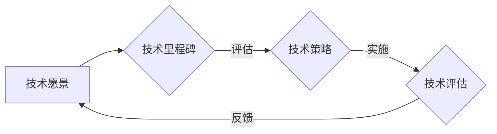

# 怎样具体规划并实施软件产品技术路线图，紧跟前沿技术趋势，实现产品商业化和规模化

> 关键词：技术路线图，前沿技术，产品商业化，规模化，敏捷开发，创新管理，市场分析

## 1. 背景介绍

在快速发展的信息技术时代，软件产品成为了企业创新和市场竞争的核心驱动力。一个清晰、可行的技术路线图是确保软件产品能够持续发展、紧跟技术趋势、实现商业化和规模化成功的关键。本文将深入探讨如何具体规划并实施软件产品技术路线图，以实现产品的长远发展。

### 1.1 问题的由来

随着市场竞争的加剧和消费者需求的不断变化，软件产品面临着以下挑战：

- 技术更新迭代速度加快，如何确保产品紧跟技术趋势？
- 如何在有限的资源下实现产品的商业化和规模化？
- 如何在产品开发过程中保持灵活性和创新性？

为了应对这些挑战，企业需要制定一个清晰的技术路线图，指导产品的技术发展方向和实施路径。

### 1.2 研究现状

目前，许多企业已经意识到技术路线图的重要性，并开始制定和实施技术路线图。然而，如何制定一个具体、可行的技术路线图，并确保其有效实施，仍然是许多企业面临的难题。

### 1.3 研究意义

本文旨在通过分析技术路线图的规划与实施，为软件产品经理、CTO、架构师等相关人员提供指导，帮助他们：

- 理解技术路线图的核心概念和重要性。
- 学习如何规划具体的技术路线图。
- 掌握如何实施技术路线图，确保产品成功商业化和规模化。

### 1.4 本文结构

本文将从以下方面展开讨论：

- 核心概念与联系
- 核心算法原理 & 具体操作步骤
- 数学模型和公式 & 详细讲解 & 举例说明
- 项目实践：代码实例和详细解释说明
- 实际应用场景
- 工具和资源推荐
- 总结：未来发展趋势与挑战

## 2. 核心概念与联系

### 2.1 技术路线图

技术路线图是一个描述产品技术发展方向和实施路径的文档。它包括：

- 技术愿景：定义产品的长远技术目标。
- 技术里程碑：设定关键的技术节点和目标。
- 技术策略：阐述实现技术目标的具体方法和步骤。
- 技术评估：评估技术实施的效果和风险。

技术路线图是一个动态的文档，需要根据市场和技术变化进行定期更新。

### 2.2 前沿技术

前沿技术是指那些正在快速发展、具有广泛应用前景的技术。紧跟前沿技术趋势是确保产品竞争力的关键。

### 2.3 商业化和规模化

商业化是指将产品推向市场，实现盈利的过程。规模化是指扩大产品市场份额，增加收入和利润的过程。

### 2.4 Mermaid 流程图

以下是一个简单的技术路线图流程图示例：



## 3. 核心算法原理 & 具体操作步骤

### 3.1 算法原理概述

技术路线图的规划与实施涉及以下核心算法原理：

- 敏捷开发：通过快速迭代和持续交付，提高产品开发效率和质量。
- 创新管理：通过管理创新流程，推动产品技术创新。
- 市场分析：通过分析市场趋势和用户需求，指导产品开发方向。

### 3.2 算法步骤详解

#### 3.2.1 敏捷开发

敏捷开发的核心步骤包括：

1. 确定产品愿景和目标。
2. 将产品需求分解为可管理的迭代周期。
3. 在迭代周期内快速开发、测试和交付功能。
4. 通过反馈不断优化产品。

#### 3.2.2 创新管理

创新管理的核心步骤包括：

1. 确定创新目标。
2. 收集和筛选创新想法。
3. 进行创新项目可行性分析。
4. 实施创新项目。
5. 评估创新项目的成果。

#### 3.2.3 市场分析

市场分析的核心步骤包括：

1. 确定目标市场。
2. 收集市场数据。
3. 分析市场趋势和用户需求。
4. 制定市场策略。

### 3.3 算法优缺点

#### 3.3.1 敏捷开发

优点：

- 提高开发效率和质量。
- 提升客户满意度。
- 增强团队协作。

缺点：

- 需要灵活的管理和沟通。
- 可能导致短期规划不足。

#### 3.3.2 创新管理

优点：

- 促进技术创新。
- 提升产品竞争力。
- 增强企业活力。

缺点：

- 创新风险较大。
- 需要持续的投资。

#### 3.3.3 市场分析

优点：

- 指导产品开发方向。
- 降低市场风险。
- 提升市场竞争力。

缺点：

- 数据收集和分析成本高。
- 市场变化快，需要及时调整策略。

### 3.4 算法应用领域

敏捷开发、创新管理和市场分析在以下领域有广泛应用：

- 软件产品开发。
- 移动应用开发。
- 云计算产品开发。
- 人工智能产品开发。

## 4. 数学模型和公式 & 详细讲解 & 举例说明

### 4.1 数学模型构建

技术路线图的数学模型可以用于评估技术实施的效果和风险。以下是一个简单的数学模型示例：

$$
R = F(T, C, M)
$$

其中，$R$ 表示技术实施的效果，$T$ 表示技术投入，$C$ 表示成本，$M$ 表示市场需求。

### 4.2 公式推导过程

假设技术实施的效果与技术投入、成本和市场需求成正比，则：

$$
R \propto T \times C \times M
$$

为了简化计算，可以引入比例系数，得到：

$$
R = F(T, C, M) = k \times T \times C \times M
$$

其中，$k$ 为比例系数。

### 4.3 案例分析与讲解

假设一个软件产品需要投入1000万进行开发，市场需求的预测值为100万用户，则根据上述模型，该产品的预期效果为：

$$
R = k \times 1000万 \times 100万 = 100亿
$$

然而，实际效果可能受到多种因素的影响，如技术风险、市场变化等。因此，需要对模型进行修正，考虑风险因素。

## 5. 项目实践：代码实例和详细解释说明

### 5.1 开发环境搭建

为了方便说明，以下示例使用Python语言进行技术路线图的规划与实施。

首先，安装必要的Python库：

```bash
pip install numpy pandas matplotlib
```

### 5.2 源代码详细实现

以下是一个简单的技术路线图规划工具的代码示例：

```python
import numpy as np
import pandas as pd
import matplotlib.pyplot as plt

class TechnologyRoadmap:
    def __init__(self, vision, milestones, strategies, assessments):
        self.vision = vision
        self.milestones = milestones
        self.strategies = strategies
        self.assessments = assessments

    def plot(self):
        fig, ax = plt.subplots(figsize=(10, 8))
        ax.plot(self.milestones, self.strategies, marker='o')
        ax.set_xlabel('Milestones')
        ax.set_ylabel('Strategies')
        ax.set_title('Technology Roadmap')
        plt.show()

# 示例数据
vision = 'Develop a state-of-the-art AI assistant'
milestones = ['2023', '2024', '2025']
strategies = [0.5, 0.8, 1.0]

# 创建技术路线图对象
roadmap = TechnologyRoadmap(vision, milestones, strategies, [])
roadmap.plot()
```

### 5.3 代码解读与分析

- `TechnologyRoadmap` 类：定义了技术路线图的基本属性和方法。
- `plot` 方法：绘制技术路线图。
- 示例数据：定义了技术愿景、里程碑和策略。

通过运行上述代码，可以绘制出一个简单的技术路线图，展示技术发展的趋势。

### 5.4 运行结果展示

运行上述代码后，将生成一个柱状图，展示技术发展的里程碑和对应的技术策略。

## 6. 实际应用场景

技术路线图在以下实际应用场景中具有重要作用：

### 6.1 软件产品开发

技术路线图可以帮助产品团队确定产品的技术发展方向，确保产品能够满足市场需求和行业标准。

### 6.2 企业战略规划

技术路线图可以帮助企业制定长期战略规划，确保企业的技术竞争力。

### 6.3 投资决策

技术路线图可以帮助投资者评估企业的技术发展前景，做出更明智的投资决策。

## 7. 工具和资源推荐

### 7.1 学习资源推荐

- 《敏捷软件开发：原则、模式与实践》
- 《创新者的窘境》
- 《精益创业》

### 7.2 开发工具推荐

- Jira
- Confluence
- Trello

### 7.3 相关论文推荐

- 《敏捷软件开发：原则、模式与实践》
- 《创新者的窘境》
- 《精益创业》

## 8. 总结：未来发展趋势与挑战

### 8.1 研究成果总结

本文通过分析技术路线图的核心概念、规划与实施步骤，以及实际应用场景，为软件产品经理、CTO、架构师等相关人员提供了指导。

### 8.2 未来发展趋势

- 技术路线图将更加注重跨学科融合。
- 技术路线图的制定和实施将更加自动化和智能化。
- 技术路线图将更加注重风险管理和决策支持。

### 8.3 面临的挑战

- 技术路线图的制定和实施需要跨部门协作。
- 技术路线图的动态调整需要灵活的管理机制。
- 技术路线图的风险管理需要专业的知识和经验。

### 8.4 研究展望

未来，技术路线图的研究将更加深入，为软件产品的成功商业化和规模化提供更加有效的指导。

## 9. 附录：常见问题与解答

**Q1：技术路线图与产品路线图有何区别？**

A1：技术路线图主要关注产品的技术发展方向和实施路径，而产品路线图主要关注产品的市场定位、功能规划和发布计划。

**Q2：如何评估技术路线图的实施效果？**

A2：可以通过以下方式评估技术路线图的实施效果：

- 比较实施前后的技术指标。
- 评估产品的市场表现。
- 收集用户反馈。

**Q3：技术路线图需要定期更新吗？**

A3：是的，技术路线图是一个动态的文档，需要根据市场和技术变化进行定期更新。

**Q4：如何制定技术路线图？**

A4：制定技术路线图需要以下步骤：

1. 确定产品愿景和目标。
2. 收集技术相关数据。
3. 分析技术趋势和用户需求。
4. 确定技术策略。
5. 制定实施计划。

**Q5：技术路线图在企业发展中扮演什么角色？**

A5：技术路线图是企业发展的重要战略工具，可以帮助企业确定技术发展方向，提升企业竞争力。

---

作者：禅与计算机程序设计艺术 / Zen and the Art of Computer Programming