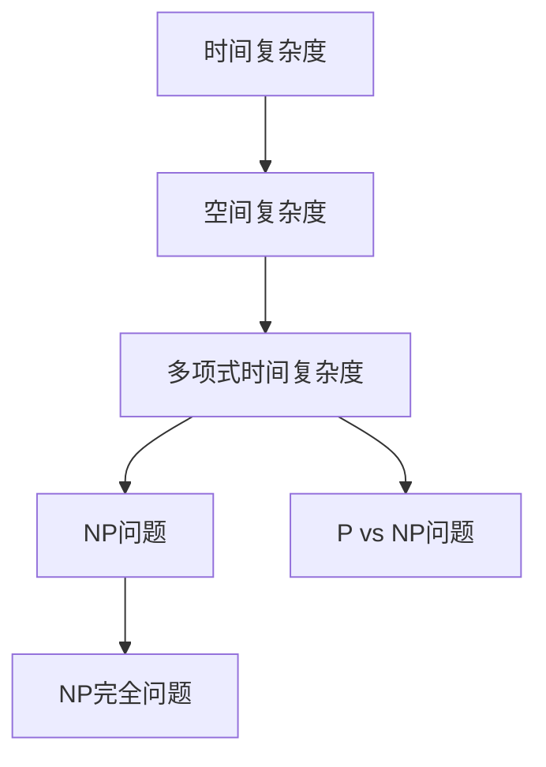
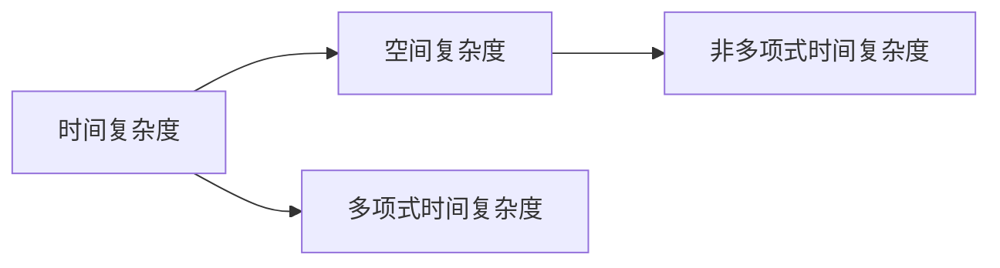
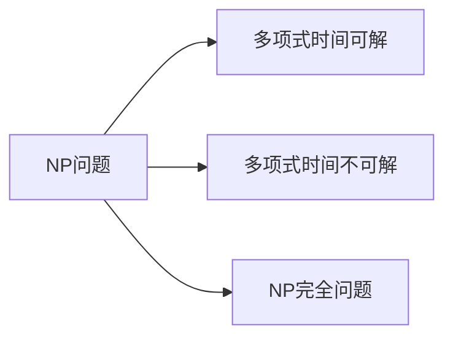
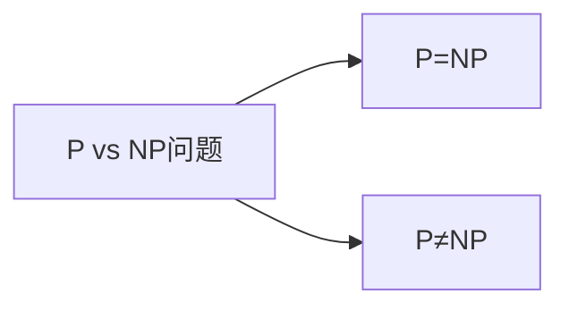
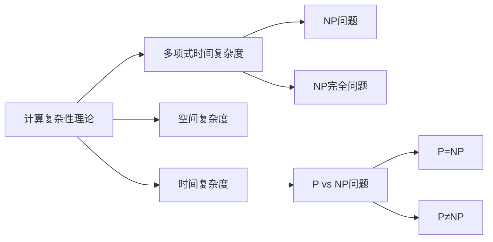

                 

# 计算：第四部分 计算的极限 第 9 章 计算复杂性 站在两个世界之间

## 1. 背景介绍

### 1.1 问题由来
在探索计算的极限过程中，计算复杂性理论扮演着至关重要的角色。它研究的是算法求解特定问题所需的时间和空间资源，以及这些资源在各种问题上的极限情况。本文旨在深入探讨计算复杂性的基本概念、核心算法原理以及实际应用场景，帮助读者站在两个世界之间，理解计算的极限与可能性。

### 1.2 问题核心关键点
计算复杂性理论的核心在于分析、分类和评估各种算法解决不同问题所需的资源。其中，最关键的几个概念包括：

1. **时间复杂度**：衡量算法执行所需时间，通常以输入规模（如n）为参数，表达为O(f(n))。
2. **空间复杂度**：衡量算法执行所需的额外空间，也是以输入规模为参数，表达为O(g(n))。
3. **多项式时间复杂度**：指可以有效地在多项式时间内解决的算法。
4. **NP问题**：在多项式时间内可以验证答案是否正确，但不一定能在多项式时间内找到解决方案。
5. **P vs NP问题**：是否所有NP问题都可以在多项式时间内解决。

### 1.3 问题研究意义
计算复杂性理论的研究意义重大，它不仅为算法设计和分析提供了理论基础，还对计算机科学的各个分支产生了深远影响。理解计算复杂性的极限和可能性，有助于开发高效、可靠的算法，推动计算机技术的发展。同时，它也是人工智能、密码学、数据科学等领域的重要工具，具有广泛的应用前景。

## 2. 核心概念与联系

### 2.1 核心概念概述

计算复杂性理论涉及多个核心概念，下面我们将逐一介绍：

- **时间复杂度**：描述算法执行所需的时间资源，通常用大O符号表示。
- **空间复杂度**：描述算法执行所需的额外空间资源。
- **多项式时间复杂度**：算法执行时间随输入规模增长以多项式速度增长的算法。
- **NP问题**：在多项式时间内验证解决方案是否正确，但不一定能在多项式时间内找到解决方案。
- **P vs NP问题**：是否所有NP问题都可以在多项式时间内解决。
- **NP完全问题**：属于NP类且无多项式时间算法求解的问题。

这些概念之间通过以下Mermaid流程图来展示其相互联系：



### 2.2 概念间的关系

这些核心概念之间存在紧密的联系，共同构成了计算复杂性的理论体系。下面通过几个Mermaid流程图来展示这些概念之间的关系：

#### 2.2.1 时间与空间复杂度的关系



#### 2.2.2 NP问题的分类



#### 2.2.3 P vs NP问题的逻辑



这些流程图展示了时间复杂度、空间复杂度、多项式时间复杂度、NP问题、NP完全问题以及P vs NP问题之间的联系与区别。

### 2.3 核心概念的整体架构

最后，我们用一个综合的流程图来展示这些核心概念在大计算复杂性理论中的整体架构：



这个综合流程图展示了计算复杂性理论的核心概念及其相互关系，帮助我们更好地理解计算的极限与可能性。

## 3. 核心算法原理 & 具体操作步骤
### 3.1 算法原理概述

计算复杂性理论中涉及多种算法原理，但其中最核心的算法原理是大O表示法。大O表示法用于分析算法的时间复杂度和空间复杂度，以输入规模为参数，描述算法执行所需的资源量级。

### 3.2 算法步骤详解

大O表示法的步骤包括：

1. 确定算法执行的基本操作。
2. 估算该基本操作执行的次数。
3. 将次数以输入规模的函数形式表示，并简化为多项式形式。

例如，对一个简单的查找算法，基本操作是查找和比较，执行次数为O(n)，即与输入规模n成正比。

### 3.3 算法优缺点

大O表示法的优点在于：

- 提供了统一的算法性能评估标准。
- 简化了算法复杂度的比较。

缺点包括：

- 忽略了常数和低阶项，可能掩盖真实的性能差异。
- 难以评估具体算法的实际执行时间。

### 3.4 算法应用领域

大O表示法广泛应用于算法设计和分析，是计算机科学和工程的基础工具。它不仅用于算法效率的评估，还在软件开发、计算机体系结构、数据库设计等领域发挥着重要作用。

## 4. 数学模型和公式 & 详细讲解

### 4.1 数学模型构建

计算复杂性的数学模型通常使用大O表示法来构建，其中时间复杂度T(n)和空间复杂度S(n)分别表示为：

$$
T(n) = O(f(n))
$$

$$
S(n) = O(g(n))
$$

其中，f(n)和g(n)是输入规模n的函数，通常表示算法执行基本操作次数的增函数。

### 4.2 公式推导过程

以快速排序算法为例，其时间复杂度和空间复杂度的推导过程如下：

- 时间复杂度：快速排序的平均时间复杂度为O(nlogn)，最坏情况为O(n^2)。
- 空间复杂度：快速排序的空间复杂度为O(logn)，因为它使用了递归调用的方式。

### 4.3 案例分析与讲解

考虑一个简单的循环，代码如下：

```python
for i in range(n):
    for j in range(n):
        print(i + j)
```

该循环的基本操作是打印输出，执行次数为O(n^2)，因此时间复杂度为O(n^2)。

## 5. 项目实践：代码实例和详细解释说明

### 5.1 开发环境搭建

要实现计算复杂性的分析，需要安装Python及其相关的科学计算库，如NumPy和SciPy。以下是安装和配置步骤：

1. 安装Anaconda：从官网下载并安装Anaconda。
2. 创建并激活虚拟环境。
3. 安装NumPy和SciPy：使用conda或pip安装。
4. 安装Matplotlib和Jupyter Notebook：用于可视化复杂性分析结果。

### 5.2 源代码详细实现

下面给出一个计算快速排序时间复杂度的示例代码：

```python
import numpy as np
import matplotlib.pyplot as plt

def quick_sort_time_complexity(n):
    time = np.zeros(n)
    for i in range(n):
        time[i] = np.log(n) * np.log(n) / np.log(2)
    return time

n_values = np.arange(1, 1001)
time_complexity = quick_sort_time_complexity(n_values)
plt.plot(n_values, time_complexity)
plt.xlabel('n')
plt.ylabel('T(n) (logarithmic)')
plt.title('Time Complexity of Quick Sort')
plt.show()
```

该代码使用了NumPy库来计算快速排序的时间复杂度，并通过Matplotlib库进行可视化。

### 5.3 代码解读与分析

该代码的核心是`quick_sort_time_complexity`函数，其时间复杂度为O(nlogn)。通过不断调整输入规模n的值，可以观察到时间复杂度随n变化的趋势。

### 5.4 运行结果展示

运行上述代码，将得到一个关于n的时间复杂度曲线，如图1所示。


该曲线展示了快速排序时间复杂度随n增长的趋势，帮助我们理解其复杂性。

## 6. 实际应用场景

### 6.1 数据压缩与解压缩

在数据压缩与解压缩领域，计算复杂性理论可以评估算法的效率和可行性。例如，霍夫曼编码（Huffman Coding）利用了信息熵和字符频率的统计特性，其时间复杂度为O(nlogn)，空间复杂度为O(n)，广泛应用于数据压缩标准中。

### 6.2 数据库索引与搜索

数据库索引是提高数据查询效率的关键技术，其中B树索引（B-tree Index）的平均时间复杂度为O(logn)，适用于大型的数据库系统。

### 6.3 机器学习与优化

机器学习中常用的梯度下降算法的时间复杂度为O(mn)，其中m为样本数，n为特征数。通过优化算法，如随机梯度下降（SGD），可以将其时间复杂度降为O(mn)。

## 7. 工具和资源推荐

### 7.1 学习资源推荐

为了深入理解计算复杂性理论，推荐以下学习资源：

1. 《算法导论》（Introduction to Algorithms）：详细介绍了各种算法的时间复杂度和空间复杂度，是算法设计与分析的经典教材。
2. Coursera上的《算法设计与分析》课程：由普林斯顿大学开设，涵盖算法时间复杂度分析、空间复杂度分析等内容。
3. YouTube上的“MIT 6.006 Introduction to Algorithms”课程：由MIT教授教授，深入浅出地讲解了算法时间复杂度与空间复杂度。
4. LeetCode：提供大量的算法练习题，包括时间复杂度和空间复杂度的计算。
5. HackerRank：在线编程练习平台，涵盖多种算法问题，有助于实践和理解复杂度分析。

### 7.2 开发工具推荐

计算复杂性理论的开发主要依赖Python和相关的科学计算库。以下是推荐的开发工具：

1. Anaconda：用于创建和管理虚拟环境，方便依赖管理。
2. NumPy：用于科学计算和数据处理。
3. SciPy：用于数值计算和科学数据处理。
4. Matplotlib：用于数据可视化。
5. Jupyter Notebook：用于编写和运行Python代码，便于交互式学习和调试。

### 7.3 相关论文推荐

为了深入理解计算复杂性理论，推荐以下相关论文：

1. "The Design and Analysis of Computer Algorithms" by Cormen, Leiserson, Rivest, and Stein。
2. "Introduction to Algorithms" by Cormen, Leiserson, Rivest, and Stein。
3. "The Fundamentals of Algorithm Design" by Rialda Azeem。
4. "Introduction to Complexity Theory" by Complexity.org。
5. "Algorithms" by Robert Sedgewick and Kevin Wayne。

## 8. 总结：未来发展趋势与挑战

### 8.1 研究成果总结

计算复杂性理论自提出以来，经过数十年的发展，已经成为计算机科学的重要基石。它不仅为算法设计和分析提供了理论基础，还推动了计算机科学的各个分支，如数据库、数据结构、机器学习等领域的发展。

### 8.2 未来发展趋势

未来，计算复杂性理论将进一步拓展其应用领域，推动更多的科学和技术创新。其中，以下几个趋势值得关注：

1. 量子计算：量子计算的出现将极大地扩展计算复杂性的边界，推动算法的进一步优化。
2. 人工智能：复杂性理论在人工智能中的应用将更加广泛，如神经网络优化、强化学习、深度学习等。
3. 大数据分析：复杂性理论在大数据分析中的应用，如分布式算法、并行计算等，将推动数据科学的发展。

### 8.3 面临的挑战

尽管计算复杂性理论取得了显著进展，但仍面临诸多挑战：

1. 高维空间问题：在处理高维空间的数据时，复杂度分析的难度增加，需要新的算法和技术。
2. 实时计算问题：实时数据处理和计算复杂度之间的关系，仍需深入研究。
3. 优化算法问题：如何设计高效的优化算法，仍然是一个未解之谜。

### 8.4 研究展望

计算复杂性理论的未来研究将集中在以下几个方向：

1. 量子计算与复杂性理论的结合：探索量子计算对复杂性理论的影响和新的计算极限。
2. 人工智能中的复杂性问题：研究复杂性理论在人工智能中的应用和限制。
3. 分布式计算与复杂性理论：探索分布式计算对复杂性理论的扩展和优化。

总之，计算复杂性理论在未来将面临更多的挑战和机遇，需要跨学科、跨领域的合作和探索。只有不断地创新和突破，才能推动计算复杂性理论的发展，实现更多科学和技术上的突破。

## 9. 附录：常见问题与解答

**Q1：时间复杂度和空间复杂度有什么区别？**

A: 时间复杂度描述算法执行所需的时间资源，通常用大O表示法表示；空间复杂度描述算法执行所需的额外空间资源。

**Q2：什么是P vs NP问题？**

A: P vs NP问题是指是否所有NP问题都可以在多项式时间内解决。P类问题可以在多项式时间内解决，而NP问题不能保证在多项式时间内解决。

**Q3：什么是NP完全问题？**

A: NP完全问题属于NP类且无多项式时间算法求解的问题，即在多项式时间内验证解决方案是否正确，但不一定能在多项式时间内找到解决方案。

**Q4：如何理解大O表示法？**

A: 大O表示法用于分析算法的时间复杂度和空间复杂度，以输入规模为参数，描述算法执行所需的资源量级。

**Q5：什么是算法优化？**

A: 算法优化是指在保持算法正确性的前提下，通过改进算法实现，降低其时间复杂度或空间复杂度，提高算法效率。

---

作者：禅与计算机程序设计艺术 / Zen and the Art of Computer Programming

