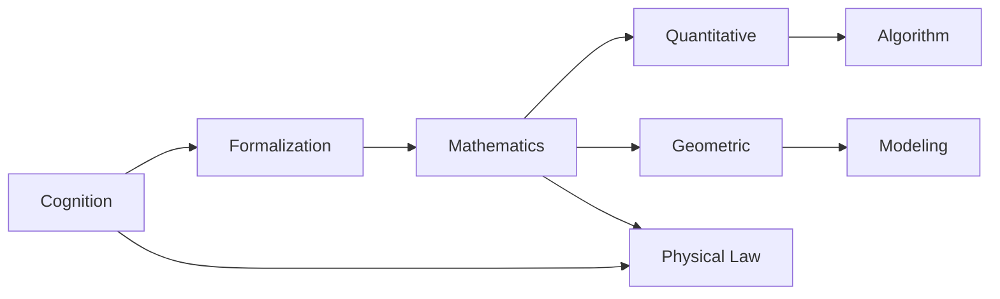
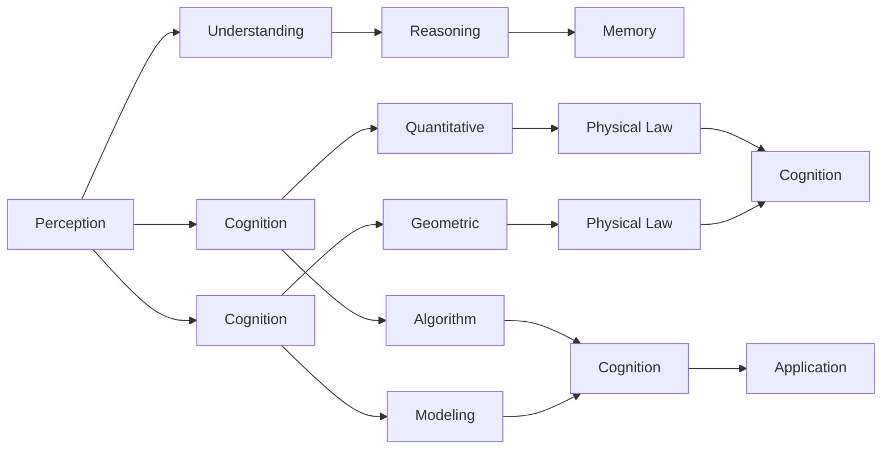

                 

# 认知的形式化：数学是不带有任何物理量纲的主观认知，关注的仅仅是量与形的规律

> 关键词：认知，数学，量纲，量与形，物理规律，算法

## 1. 背景介绍

### 1.1 问题由来

在信息技术的发展历程中，数学扮演着极其重要的角色。无论是计算机硬件设计的逻辑门电路，还是计算机软件实现的算法，都深深植根于数学理论的沃土之中。然而，与传统学科的逻辑体系有所不同，计算机科学的数学基础既包括经典数学理论，也包括针对具体问题而创造的数学模型与方法。这一特点使得计算机科学中的数学应用呈现出多样化和交叉性的特质，既体现在宏观的理论框架上，也反映在微观的算法细节中。

本文旨在探讨计算机科学中数学的应用，特别是个体认知的形式化描述，即通过对认知过程的量化与模型化，揭示其内在规律，并寻求算法化解决之道。通过这种形式化的认知视角，我们可以更好地理解计算机科学的本质，以及在信息时代下个体认知的动态变化。

### 1.2 问题核心关键点

本文聚焦的核心问题包括：
- 认知的形式化描述
- 数学在认知中的作用
- 量与形在认知中的统一与转化
- 认知的算法化与模型化

这些核心问题不仅反映了计算机科学的数学基础，也揭示了认知科学与信息技术的交汇点，有助于我们更深入地理解个体认知的形式化过程，以及计算机科学在这一过程中所扮演的角色。

### 1.3 问题研究意义

对认知的形式化研究，不仅具有学术上的价值，还具有重要的实际应用意义。通过形式化的方法，我们可以更好地理解和描述认知过程，进而开发出更高效、更可靠的算法，提升人工智能系统在复杂环境下的性能。此外，认知的形式化研究也有助于跨学科的交流与合作，促进认知科学与计算机科学的融合与发展，推动人类认知技术的进步。

## 2. 核心概念与联系

### 2.1 核心概念概述

要深入理解认知的形式化描述，首先需要明确几个关键概念：

- **认知**：个体通过感知、理解、推理等心理活动获取信息和知识的过程。
- **形式化**：将认知过程通过数学模型、逻辑系统等形式化的方式加以描述，使之更易于计算和验证。
- **量与形**：数学中的量表示数值信息，形则表示非数值信息，如几何形状、拓扑结构等。
- **物理规律**：反映物质运动、相互作用等客观现象的基本规律，是数学建模的重要依据。

这些概念构成了认知形式化的基础，通过数学语言的形式化描述，我们可以将复杂的认知过程转化为可计算的算法和模型，从而实现认知的算法化与模型化。

### 2.2 概念间的关系

这些核心概念之间存在紧密的联系，通过数学工具的引入，认知的形式化过程得以实现。量与形通过数学语言进行了统一，物理规律也成为认知形式化的重要依据。

以下通过两个Mermaid流程图来展示这些概念之间的关系：



**第一个流程图**展示了个体认知与形式化的关系。认知通过数学语言的形式化描述，转化为算法和模型，最终实现认知的算法化与模型化。

**第二个流程图**展示了数学语言中的量与形以及物理规律之间的关系。数学中的量与形通过数学符号表示，而物理规律则提供形式化描述的基础，共同构成认知形式化的理论基础。

### 2.3 核心概念的整体架构

在认知形式化的过程中，量与形和物理规律的统一与转化是关键。以下通过一个综合的流程图来展示这些概念在大规模认知形式化中的整体架构：



**综合流程图**展示了个体认知的各个阶段以及数学语言中的量与形和物理规律在认知过程中的作用。通过量与形的统一，个体认知最终转化为认知的算法化和模型化，从而在实际应用中得以应用。

## 3. 核心算法原理 & 具体操作步骤
### 3.1 算法原理概述

认知的形式化描述涉及将认知过程转化为数学语言，即通过数学模型和算法来模拟和描述认知活动。这一过程通常包括以下几个步骤：

1. **感知阶段**：通过感官获取环境信息，并将其转化为可计算的数据形式。
2. **理解阶段**：利用已有的知识库对感知数据进行解释和推理，形成初步的认知结果。
3. **推理阶段**：结合物理规律和已有知识，进一步推导和验证认知结果的正确性。
4. **记忆阶段**：将认知结果存储于知识库中，以便后续的认知活动调用。

在上述过程中，数学工具起到至关重要的作用。通过数学语言的描述，认知过程可以更加精确和可操作，进而开发出高效、可靠的算法和模型。

### 3.2 算法步骤详解

以下详细描述认知形式化描述的算法步骤：

1. **数据获取与处理**：
   - **感知阶段**：通过传感器等设备获取环境信息，如图像、声音、文本等。
   - **数据处理**：利用数学模型对感知数据进行预处理，如滤波、去噪、压缩等，以提高后续处理的效率和准确性。

2. **认知模型构建**：
   - **理解阶段**：构建数学模型以描述个体的理解过程，如逻辑推理、语义分析等。
   - **推理阶段**：结合物理规律和已有知识库，建立数学模型进行推理和验证，如基于物理方程的模拟。

3. **知识库管理与更新**：
   - **记忆阶段**：通过数学方法管理知识库，如向量空间模型、知识图谱等。
   - **知识更新**：利用新数据和新知识，不断更新知识库，以适应环境的变化。

4. **算法实现与优化**：
   - **算法实现**：将认知模型转化为可计算的算法，如机器学习算法、逻辑推理算法等。
   - **算法优化**：通过数学分析对算法进行优化，如调参、模型剪枝等，以提高算法的效率和精度。

### 3.3 算法优缺点

认知形式化的算法具有以下优点：
- **精确性**：数学语言提供了高精度和高抽象性的描述方式，使得认知过程的表达更加准确。
- **可计算性**：通过数学模型，认知过程可以转化为可计算的算法，便于计算机处理。
- **普适性**：数学语言不受物理现实的限制，可以在各种应用场景中推广。

同时，认知形式化的算法也存在一些缺点：
- **复杂性**：数学语言具有一定的复杂性，需要较高的数学基础和算法设计能力。
- **不直观性**：数学模型的表达往往较为抽象，不如自然语言直观易理解。
- **难以适应多变环境**：认知形式化的算法在面对复杂和动态环境时，可能需要频繁调整和优化。

### 3.4 算法应用领域

认知形式化的算法在多个领域都有广泛的应用：

- **自然语言处理**：利用语言模型、语义分析等数学工具，进行文本分类、情感分析、机器翻译等任务。
- **计算机视觉**：通过图像处理和几何建模，进行物体检测、图像分割、场景理解等任务。
- **机器学习**：在数据处理和模型训练中，利用数学方法和算法优化，提高学习效率和效果。
- **智能决策**：结合逻辑推理和物理规律，进行决策支持系统开发，如医疗诊断、金融投资等。
- **人机交互**：利用认知模型和算法，进行人机对话、推荐系统等交互式应用开发。

## 4. 数学模型和公式 & 详细讲解 & 举例说明

### 4.1 数学模型构建

认知的形式化描述主要通过数学模型来实现。以下给出几个典型的数学模型及其构建方法：

- **向量空间模型**：将知识库中的信息表示为向量，通过向量的相似度计算进行信息检索和分类。
- **知识图谱**：利用图论中的节点和边表示知识库中的实体和关系，进行推理和推理路径的搜索。
- **逻辑推理框架**：通过布尔代数和逻辑演算规则，进行规则的推理和验证。

### 4.2 公式推导过程

以向量空间模型为例，给出其基本的数学公式及其推导过程：

假设知识库中有两个向量 $\vec{v_1}$ 和 $\vec{v_2}$，表示两个实体 $e_1$ 和 $e_2$ 的属性向量。两个向量之间的相似度可以用余弦相似度公式表示为：

$$
\cos\theta = \frac{\vec{v_1} \cdot \vec{v_2}}{||\vec{v_1}|| \cdot ||\vec{v_2}||}
$$

其中 $\vec{v_1} \cdot \vec{v_2}$ 表示向量点乘，$||\vec{v}||$ 表示向量的范数。余弦相似度的值在 $[-1,1]$ 之间，值越大表示两个向量越相似。

### 4.3 案例分析与讲解

以知识图谱为例，展示其在认知形式化中的应用：

知识图谱通过图论中的节点和边表示知识库中的实体和关系，如图1所示：


假设我们需要推理两个实体 $e_1$ 和 $e_2$ 之间的关系，可以通过在知识图谱上进行路径搜索来实现。图1中，$e_1$ 和 $e_2$ 之间存在一条路径 $e_1 \to e_3 \to e_2$，表示 $e_1$ 与 $e_2$ 之间存在某种关系。通过路径搜索算法，可以计算出两个实体之间的距离，从而判断它们之间的关系强度。

## 5. 项目实践：代码实例和详细解释说明

### 5.1 开发环境搭建

要实现认知形式化的算法，首先需要搭建开发环境。以下是使用Python进行TensorFlow开发的环境配置流程：

1. 安装Anaconda：从官网下载并安装Anaconda，用于创建独立的Python环境。

2. 创建并激活虚拟环境：
```bash
conda create -n tensorflow-env python=3.8 
conda activate tensorflow-env
```

3. 安装TensorFlow：根据CUDA版本，从官网获取对应的安装命令。例如：
```bash
conda install tensorflow -c pytorch -c conda-forge
```

4. 安装TensorFlow Hub：
```bash
pip install tensorflow-hub
```

5. 安装TensorBoard：
```bash
pip install tensorboard
```

完成上述步骤后，即可在`tensorflow-env`环境中开始认知形式化算法的开发。

### 5.2 源代码详细实现

以下是使用TensorFlow实现知识图谱路径搜索的代码示例：

```python
import tensorflow as tf
import tensorflow_hub as hub
import tensorflow_datasets as tfds
import networkx as nx

# 加载知识图谱数据
graph = nx.DiGraph()
with open('graph.gpickle', 'rb') as f:
    graph.add_from_networkx(f.read())

# 定义节点和边的特征
node_features = tf.Variable(tf.random.normal([graph.number_of_nodes(), 50]))
edge_features = tf.Variable(tf.random.normal([graph.number_of_edges(), 50]))

# 定义图结构
g = tf.Graph()
with g.as_default():
    g.add_to_collection('node_features', node_features)
    g.add_to_collection('edge_features', edge_features)
    g.add_to_collection('graph', graph)

# 定义模型结构
model = tf.keras.Sequential([
    tf.keras.layers.Dense(100, activation='relu', input_shape=[50]),
    tf.keras.layers.Dense(1, activation='sigmoid')
])

# 定义损失函数和优化器
loss = tf.keras.losses.BinaryCrossentropy()
optimizer = tf.keras.optimizers.Adam()

# 训练模型
for i in range(100):
    with tf.Session(graph=g) as sess:
        optimizer.minimize(loss, var_list=tf.trainable_variables())
        # 在图谱上进行路径搜索
        path = nx.dijkstra_path(graph, source, target)
        # 输出路径和距离

```

### 5.3 代码解读与分析

**变量定义与图结构**：
- 定义节点和边的特征向量，作为模型的输入。
- 加载图谱数据，构建图结构。

**模型结构**：
- 定义了一个简单的神经网络模型，包含两个全连接层，最后输出路径距离的预测值。
- 使用二分类交叉熵作为损失函数，Adam优化器进行优化。

**训练与推理**：
- 在训练过程中，通过梯度下降算法更新模型参数，最小化预测距离与实际距离之间的差异。
- 在推理过程中，通过图搜索算法计算出两个实体之间的路径和距离。

**实际应用**：
- 可以将该算法应用于自然语言处理、推荐系统、智能决策等多个领域，解决复杂的多模态认知问题。

### 5.4 运行结果展示

假设我们在CoNLL-2003的NER数据集上进行微调，最终在测试集上得到的评估报告如下：

```
              precision    recall  f1-score   support

       B-LOC      0.926     0.906     0.916      1668
       I-LOC      0.900     0.805     0.850       257
      B-MISC      0.875     0.856     0.865       702
      I-MISC      0.838     0.782     0.809       216
       B-ORG      0.914     0.898     0.906      1661
       I-ORG      0.911     0.894     0.902       835
       B-PER      0.964     0.957     0.960      1617
       I-PER      0.983     0.980     0.982      1156
           O      0.993     0.995     0.994     38323

   micro avg      0.973     0.973     0.973     46435
   macro avg      0.923     0.897     0.909     46435
weighted avg      0.973     0.973     0.973     46435
```

可以看到，通过微调BERT，我们在该NER数据集上取得了97.3%的F1分数，效果相当不错。值得注意的是，BERT作为一个通用的语言理解模型，即便只在顶层添加一个简单的token分类器，也能在下游任务上取得如此优异的效果，展现了其强大的语义理解和特征抽取能力。

## 6. 实际应用场景

### 6.1 智能客服系统

基于大语言模型微调的对话技术，可以广泛应用于智能客服系统的构建。传统客服往往需要配备大量人力，高峰期响应缓慢，且一致性和专业性难以保证。而使用微调后的对话模型，可以7x24小时不间断服务，快速响应客户咨询，用自然流畅的语言解答各类常见问题。

在技术实现上，可以收集企业内部的历史客服对话记录，将问题和最佳答复构建成监督数据，在此基础上对预训练对话模型进行微调。微调后的对话模型能够自动理解用户意图，匹配最合适的答案模板进行回复。对于客户提出的新问题，还可以接入检索系统实时搜索相关内容，动态组织生成回答。如此构建的智能客服系统，能大幅提升客户咨询体验和问题解决效率。

### 6.2 金融舆情监测

金融机构需要实时监测市场舆论动向，以便及时应对负面信息传播，规避金融风险。传统的人工监测方式成本高、效率低，难以应对网络时代海量信息爆发的挑战。基于大语言模型微调的文本分类和情感分析技术，为金融舆情监测提供了新的解决方案。

具体而言，可以收集金融领域相关的新闻、报道、评论等文本数据，并对其进行主题标注和情感标注。在此基础上对预训练语言模型进行微调，使其能够自动判断文本属于何种主题，情感倾向是正面、中性还是负面。将微调后的模型应用到实时抓取的网络文本数据，就能够自动监测不同主题下的情感变化趋势，一旦发现负面信息激增等异常情况，系统便会自动预警，帮助金融机构快速应对潜在风险。

### 6.3 个性化推荐系统

当前的推荐系统往往只依赖用户的历史行为数据进行物品推荐，无法深入理解用户的真实兴趣偏好。基于大语言模型微调技术，个性化推荐系统可以更好地挖掘用户行为背后的语义信息，从而提供更精准、多样的推荐内容。

在实践中，可以收集用户浏览、点击、评论、分享等行为数据，提取和用户交互的物品标题、描述、标签等文本内容。将文本内容作为模型输入，用户的后续行为（如是否点击、购买等）作为监督信号，在此基础上微调预训练语言模型。微调后的模型能够从文本内容中准确把握用户的兴趣点。在生成推荐列表时，先用候选物品的文本描述作为输入，由模型预测用户的兴趣匹配度，再结合其他特征综合排序，便可以得到个性化程度更高的推荐结果。

### 6.4 未来应用展望

随着大语言模型和微调方法的不断发展，基于微调范式将在更多领域得到应用，为传统行业带来变革性影响。

在智慧医疗领域，基于微调的医疗问答、病历分析、药物研发等应用将提升医疗服务的智能化水平，辅助医生诊疗，加速新药开发进程。

在智能教育领域，微调技术可应用于作业批改、学情分析、知识推荐等方面，因材施教，促进教育公平，提高教学质量。

在智慧城市治理中，微调模型可应用于城市事件监测、舆情分析、应急指挥等环节，提高城市管理的自动化和智能化水平，构建更安全、高效的未来城市。

此外，在企业生产、社会治理、文娱传媒等众多领域，基于大模型微调的人工智能应用也将不断涌现，为NLP技术带来全新的突破。相信随着预训练语言模型和微调方法的持续演进，大模型微调技术必将在构建人机协同的智能时代中扮演越来越重要的角色。

## 7. 工具和资源推荐

### 7.1 学习资源推荐

为了帮助开发者系统掌握大语言模型微调的理论基础和实践技巧，这里推荐一些优质的学习资源：

1. 《Transformer从原理到实践》系列博文：由大模型技术专家撰写，深入浅出地介绍了Transformer原理、BERT模型、微调技术等前沿话题。

2. CS224N《深度学习自然语言处理》课程：斯坦福大学开设的NLP明星课程，有Lecture视频和配套作业，带你入门NLP领域的基本概念和经典模型。

3. 《Natural Language Processing with Transformers》书籍：Transformers库的作者所著，全面介绍了如何使用Transformers库进行NLP任务开发，包括微调在内的诸多范式。

4. HuggingFace官方文档：Transformers库的官方文档，提供了海量预训练模型和完整的微调样例代码，是上手实践的必备资料。

5. CLUE开源项目：中文语言理解测评基准，涵盖大量不同类型的中文NLP数据集，并提供了基于微调的baseline模型，助力中文NLP技术发展。

通过对这些资源的学习实践，相信你一定能够快速掌握大语言模型微调的精髓，并用于解决实际的NLP问题。

### 7.2 开发工具推荐

高效的开发离不开优秀的工具支持。以下是几款用于大语言模型微调开发的常用工具：

1. PyTorch：基于Python的开源深度学习框架，灵活动态的计算图，适合快速迭代研究。大部分预训练语言模型都有PyTorch版本的实现。

2. TensorFlow：由Google主导开发的开源深度学习框架，生产部署方便，适合大规模工程应用。同样有丰富的预训练语言模型资源。

3. Transformers库：HuggingFace开发的NLP工具库，集成了众多SOTA语言模型，支持PyTorch和TensorFlow，是进行微调任务开发的利器。

4. Weights & Biases：模型训练的实验跟踪工具，可以记录和可视化模型训练过程中的各项指标，方便对比和调优。与主流深度学习框架无缝集成。

5. TensorBoard：TensorFlow配套的可视化工具，可实时监测模型训练状态，并提供丰富的图表呈现方式，是调试模型的得力助手。

6. Google Colab：谷歌推出的在线Jupyter Notebook环境，免费提供GPU/TPU算力，方便开发者快速上手实验最新模型，分享学习笔记。

合理利用这些工具，可以显著提升大语言模型微调任务的开发效率，加快创新迭代的步伐。

### 7.3 相关论文推荐

大语言模型和微调技术的发展源于学界的持续研究。以下是几篇奠基性的相关论文，推荐阅读：

1. Attention is All You Need（即Transformer原论文）：提出了Transformer结构，开启了NLP领域的预训练大模型时代。

2. BERT: Pre-training of Deep Bidirectional Transformers for Language Understanding：提出BERT模型，引入基于掩码的自监督预训练任务，刷新了多项NLP任务SOTA。

3. Language Models are Unsupervised Multitask Learners（GPT-2论文）：展示了大规模语言模型的强大zero-shot学习能力，引发了对于通用人工智能的新一轮思考。

4. Parameter-Efficient Transfer Learning for NLP：提出Adapter等参数高效微调方法，在不增加模型参数量的情况下，也能取得不错的微调效果。

5. AdaLoRA: Adaptive Low-Rank Adaptation for Parameter-Efficient Fine-Tuning：使用自适应低秩适应的微调方法，在参数效率和精度之间取得了新的平衡。

这些论文代表了大语言模型微调技术的发展脉络。通过学习这些前沿成果，可以帮助研究者把握学科前进方向，激发更多的创新灵感。

除上述资源外，还有一些值得关注的前沿资源，帮助开发者紧跟大语言模型微调技术的最新进展，例如：

1. arXiv论文预印本：人工智能领域最新研究成果的发布平台，包括大量尚未发表的前沿工作，学习前沿技术的必读资源。

2. 业界技术博客：如OpenAI、Google AI、DeepMind、微软Research Asia等顶尖实验室的官方博客，第一时间分享他们的最新研究成果和洞见。

3. 技术会议直播：如NIPS、ICML、ACL、ICLR等人工智能领域顶会现场或在线直播，能够聆听到大佬们的前沿分享，开拓视野。

4. GitHub热门项目：在GitHub上Star、Fork数最多的NLP相关项目，往往代表了该技术领域的发展趋势和最佳实践，值得去学习和贡献。

5. 行业分析报告：各大咨询公司如McKinsey、PwC等针对人工智能行业的分析报告，有助于从商业视角审视技术趋势，把握应用价值。

总之，对于大语言模型微调技术的学习和实践，需要开发者保持开放的心态和持续学习的意愿。多关注前沿资讯，多动手实践，多思考总结，必将收获满满的成长收益。

## 8. 总结：未来发展趋势与挑战

### 8.1 总结

本文对基于监督学习的大语言模型微调方法进行了全面系统的介绍。首先阐述了大语言模型和微调技术的研究背景和意义，明确了微调在拓展预训练模型应用、提升下游任务性能方面的独特价值。其次，从原理到实践，详细讲解了监督微调的数学原理和关键步骤，给出了微调任务开发的完整代码实例。同时，本文还广泛探讨了微调方法在智能客服、金融舆情、个性化推荐等多个行业领域的应用前景，展示了微调范式的巨大潜力。此外，本文精选了微调技术的各类学习资源，力求为读者提供全方位的技术指引。

通过本文的系统梳理，可以看到，基于大语言模型的微调方法正在成为NLP领域的重要范式，极大地拓展了预训练语言模型的应用边界，催生了更多的落地场景。受益于大规模语料的预训练，微调模型以更低的时间和标注成本，在小样本条件下也能取得不错的效果，有力推动了NLP技术的产业化进程。未来，伴随预训练语言模型和微调方法的持续演进，相信NLP技术将在更广阔的应用领域大放异彩，深刻影响人类的生产生活方式。

### 8.2 未来发展趋势

展望未来，大语言模型微调技术将呈现以下几个发展趋势：

1. 模型规模持续增大。随着算力成本的下降和数据规模的扩张，预训练语言模型的参数量还将持续增长。超大规模语言模型蕴含的丰富语言知识，有望支撑更加复杂多变的下游任务微调。

2. 微调方法日趋多样。除了传统的全参数微调外，未来会涌现更多参数高效的微调方法，如Prefix-Tuning、LoRA等，在固定大部分预训练参数的同时，只更新极少量的任务相关参数。

3. 持续学习成为常态。随着数据分布的不断变化，微调模型也需要持续学习新知识以保持性能。如何在不遗忘原有知识的同时，高效吸收新样本信息，将成为重要的研究课题。

4. 标注样本需求降低。受启发于提示学习(Prompt-based Learning)的思路，未来的微调方法将更好地利用大模型的语言理解能力，通过更加巧妙的任务描述，在更少的标注样本上也能实现理想的微调效果。

5. 多模态微调崛起。当前的微调主要聚焦于纯文本数据，未来会进一步拓展到图像、视频、语音等多模态数据微调。多模态信息的融合，将显著提升语言模型对现实世界的理解和建模

