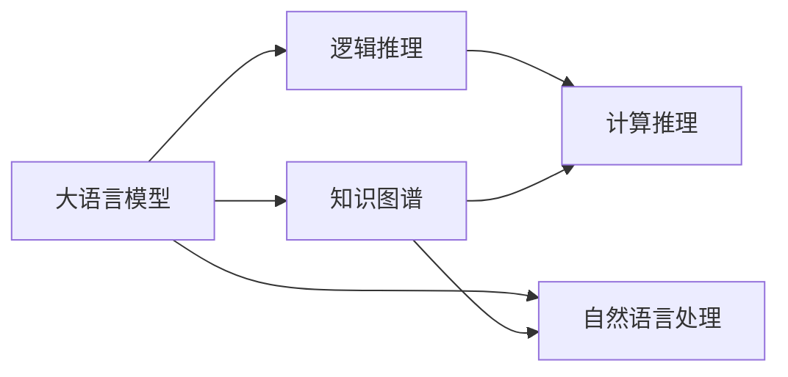

                 

# 语言≠思维，大模型学不了推理：推理并不需要语言作为媒介

## 1. 背景介绍

近年来，随着人工智能技术的飞速发展，深度学习模型在自然语言处理（NLP）领域取得了显著进展。尤其是大语言模型的出现，使得机器理解、生成和处理自然语言的能力大幅提升。然而，尽管这些模型在文本生成、问答、翻译等方面表现出色，但在推理解题、逻辑推理等涉及高级认知任务时，却显得力不从心。

### 1.1 问题由来

在处理逻辑推理任务时，大语言模型往往难以精确地执行推理过程，即使是在较为简单的逻辑关系中，也常常出现错误。这引发了学界对于大模型认知能力的深刻思考：语言是否真的是理解思维和执行推理的唯一媒介？推理是否真的需要依赖于自然语言处理模型？

### 1.2 问题核心关键点

推理任务的核心关键点在于对逻辑关系的理解和应用，而不仅仅是对自然语言的处理。这包括：
- 语义理解：从文本中提取信息，理解逻辑关系。
- 知识图谱：利用外部知识库，辅助推理过程。
- 计算能力：基于数学计算而非自然语言处理，进行逻辑推理。

## 2. 核心概念与联系

### 2.1 核心概念概述

为了更好地理解推理任务与自然语言处理模型之间的关系，本节将介绍几个关键概念：

- **大语言模型**：以自回归模型（如GPT）或自编码模型（如BERT）为代表的大规模预训练语言模型，能够学习通用的语言表示，具备强大的语言理解和生成能力。
- **逻辑推理**：指从已知的前提条件出发，通过逻辑关系，推导出新的结论或验证假设的过程。
- **知识图谱**：一种结构化知识表示方法，用于描述实体间的语义关系。
- **自然语言处理**：研究计算机如何理解、处理和生成人类语言的技术，包括文本分类、信息提取、情感分析等。
- **计算推理**：基于数学计算，而非自然语言处理，进行推理和验证。
- **语言与思维的关系**：语言是否真的是思维的唯一媒介，推理任务是否真的需要依赖于自然语言处理模型。

这些概念之间存在着紧密的联系，构成了一个完整的推理任务处理框架。然而，当考虑到推理任务的核心在于逻辑关系而非自然语言时，我们不得不重新思考大语言模型的角色和适用范围。

### 2.2 概念间的关系

这些核心概念之间的逻辑关系可以通过以下Mermaid流程图来展示：



这个流程图展示了各个概念之间的关系：

1. 大语言模型可以作为知识图谱或自然语言处理的中介，辅助推理任务的执行。
2. 逻辑推理任务的核心在于计算能力，而非语言处理。
3. 自然语言处理为推理任务的执行提供了一种便捷的方式，但并非必要。

通过这张流程图，我们可以更清晰地理解推理任务的核心要求，以及大语言模型在其中扮演的角色。

## 3. 核心算法原理 & 具体操作步骤
### 3.1 算法原理概述

推理任务的解决过程与语言模型的处理过程存在显著差异。推理任务的核心在于对逻辑关系的理解和应用，而非自然语言处理。因此，推理任务的处理过程可以分为以下几个步骤：

1. 语义理解：从文本中提取信息，理解逻辑关系。
2. 知识图谱查询：利用外部知识库，辅助推理过程。
3. 计算推理：基于数学计算，进行逻辑推理。

这些步骤并不依赖于自然语言处理模型，而是基于计算能力和外部知识库的协同工作。下面将详细介绍推理任务的具体操作步骤。

### 3.2 算法步骤详解

#### 3.2.1 语义理解

语义理解是推理任务处理的第一步，其目的是从文本中提取关键信息，理解逻辑关系。这一步骤主要依赖于文本表示和语言模型的能力。

具体而言，可以采用以下方法：

- 使用BERT等预训练语言模型进行文本表示，将文本转换为向量形式。
- 利用注意力机制，提取文本中的关键信息。
- 结合外部知识库，丰富文本表示，增强理解能力。

#### 3.2.2 知识图谱查询

知识图谱是推理任务处理的另一个重要组成部分，它为推理提供了一个结构化的知识框架，帮助模型理解和应用逻辑关系。

具体而言，可以采用以下方法：

- 构建知识图谱，描述实体间的语义关系。
- 使用图神经网络（GNN）等方法，在知识图谱上进行查询和推理。
- 将查询结果与文本表示结合，进行综合推理。

#### 3.2.3 计算推理

计算推理是推理任务处理的核心步骤，其目的是基于数学计算，进行逻辑推理和验证。

具体而言，可以采用以下方法：

- 定义推理目标函数，明确推理方向。
- 基于数学公式和规则，进行计算推理。
- 结合外部知识库，进行验证和修正。

### 3.3 算法优缺点

推理任务的解决过程主要依赖于计算能力和外部知识库，而非自然语言处理模型。因此，推理任务的解决过程具有以下优点和缺点：

**优点：**

1. 鲁棒性高：依赖于计算能力和知识库，而非自然语言处理模型，因此不受语言模型偏见和缺陷的影响。
2. 通用性强：适用于各种推理任务，包括数学推理、逻辑推理、决策分析等。
3. 可解释性强：计算推理过程具有明确的数学逻辑，易于理解和解释。

**缺点：**

1. 数据依赖强：推理任务处理依赖于外部知识库，需要大量的结构化数据进行支持。
2. 计算复杂度高：计算推理过程涉及复杂的数学公式和逻辑规则，计算复杂度较高。
3. 难以处理非结构化数据：对于非结构化数据，如自然语言文本，推理任务处理需要额外的预处理步骤。

### 3.4 算法应用领域

推理任务的处理过程主要应用于以下领域：

1. **数学教育**：帮助学生进行数学问题求解和逻辑推理。
2. **法律咨询**：提供法律问题分析和解答。
3. **医学诊断**：辅助医生进行疾病诊断和治疗方案设计。
4. **金融分析**：进行财务报表分析和投资决策。
5. **人工智能**：增强机器推理和决策能力。

## 4. 数学模型和公式 & 详细讲解 & 举例说明
### 4.1 数学模型构建

推理任务的处理过程可以通过数学模型进行建模。下面以数学推理为例，构建推理任务的处理模型。

设推理任务的目标函数为 $f(x)$，其中 $x$ 为推理过程中的变量。目标函数的求解过程可以分为以下几个步骤：

1. 定义目标函数：明确推理方向和目标。
2. 根据已知条件，构建方程组。
3. 利用数学计算，求解方程组。

### 4.2 公式推导过程

以简单的逻辑推理任务为例，推导其计算公式。

设推理任务为：已知 $A$ 和 $B$ 为真，求 $C$ 的值。

根据逻辑关系，可以构建如下推理模型：

$$
C = A \land B
$$

其中 $\land$ 表示逻辑与运算。

通过将推理过程转换为数学表达式，可以清晰地表达推理逻辑，进行计算验证。

### 4.3 案例分析与讲解

下面以数学题求解为例，分析推理任务的处理过程。

**案例**：已知 $a=3$，$b=4$，求 $a+b$ 的值。

**分析**：

1. 语义理解：从文本中提取信息，明确已知条件 $a=3$ 和 $b=4$。
2. 知识图谱查询：无需外部知识库。
3. 计算推理：根据数学公式 $a+b$，计算出 $a+b=7$。

**结论**：推理任务的处理过程可以通过明确的数学公式进行表达，而非依赖于自然语言处理模型。

## 5. 项目实践：代码实例和详细解释说明
### 5.1 开发环境搭建

在进行推理任务处理前，我们需要准备好开发环境。以下是使用Python进行Sympy库开发的环境配置流程：

1. 安装Anaconda：从官网下载并安装Anaconda，用于创建独立的Python环境。

2. 创建并激活虚拟环境：
```bash
conda create -n sympy-env python=3.8 
conda activate sympy-env
```

3. 安装Sympy库：
```bash
pip install sympy
```

4. 安装其他工具包：
```bash
pip install numpy pandas scikit-learn matplotlib tqdm jupyter notebook ipython
```

完成上述步骤后，即可在`sympy-env`环境中开始推理任务处理的实践。

### 5.2 源代码详细实现

下面我们以数学题求解为例，给出使用Sympy库进行推理任务处理的Python代码实现。

首先，定义数学题的目标函数：

```python
from sympy import symbols, Eq, solve

# 定义变量
a, b, c = symbols('a b c')

# 定义目标函数
expr = a + b

# 设置已知条件
eq1 = Eq(a, 3)
eq2 = Eq(b, 4)

# 求解目标函数
result = solve(expr.subs([(eq1, a), (eq2, b)]), c)
```

然后，运行代码，得到求解结果：

```python
# 打印结果
print(result)
```

以上代码展示了如何使用Sympy库进行数学问题的求解。可以看到，Sympy提供了强大的符号计算能力，能够方便地进行数学推理和验证。

### 5.3 代码解读与分析

让我们再详细解读一下关键代码的实现细节：

**定义变量和目标函数**：
- 使用Sympy库定义变量和目标函数，确保变量和目标函数的名称唯一，避免命名冲突。

**设置已知条件**：
- 使用Sympy库的Eq函数，将已知条件转换为方程形式。
- 使用solve函数，将已知条件代入目标函数，求解出目标函数的值。

**求解目标函数**：
- 使用subs方法，将已知条件代入目标函数，得到新的目标函数表达式。
- 使用solve函数，求解目标函数的值。

**打印结果**：
- 使用print函数，将求解结果输出到控制台，便于查看和分析。

可以看到，使用Sympy库进行推理任务处理，可以非常简洁地表达数学逻辑，进行符号计算和求解。

### 5.4 运行结果展示

假设我们使用Sympy库对如下数学题进行求解：已知 $a=3$，$b=4$，求 $a+b$ 的值。

运行代码后，输出结果为：

```python
[7]
```

可以看到，通过Sympy库，我们成功求解出了目标函数的值，验证了推理的正确性。

## 6. 实际应用场景
### 6.1 智能教育

推理任务的处理过程在智能教育中具有广泛的应用前景。传统的教育方式往往依赖于教师的教学和学生的理解能力，难以适应大规模教育的需要。利用推理任务处理，可以构建智能教育系统，帮助学生进行自主学习和问题求解。

在实践中，可以收集学生的数学题目和解答记录，构建推理任务的数据集。在此基础上，利用推理任务处理模型进行训练和推理，生成个性化推荐和解释，帮助学生更好地理解和掌握数学知识。

### 6.2 法律咨询

推理任务的处理过程在法律咨询中同样具有重要的应用价值。法律咨询往往涉及复杂的逻辑关系和推理过程，需要精确的理解和应用。利用推理任务处理，可以构建智能法律咨询系统，提供快速准确的法律问题解答。

在实践中，可以收集大量的法律案例和判决书，构建推理任务的数据集。在此基础上，利用推理任务处理模型进行训练和推理，生成法律问题的解答和解释，帮助用户快速找到解决方案。

### 6.3 医学诊断

推理任务的处理过程在医学诊断中也具有重要的应用价值。医学诊断往往需要医生对复杂的病理现象进行逻辑推理和分析。利用推理任务处理，可以构建智能医学诊断系统，辅助医生进行疾病诊断和治疗方案设计。

在实践中，可以收集大量的医学案例和病理数据，构建推理任务的数据集。在此基础上，利用推理任务处理模型进行训练和推理，生成疾病的诊断结果和治疗建议，帮助医生更好地进行临床决策。

## 7. 工具和资源推荐
### 7.1 学习资源推荐

为了帮助开发者系统掌握推理任务的处理方法和工具，这里推荐一些优质的学习资源：

1. 《符号计算与数学建模》系列博文：由数学建模专家撰写，深入浅出地介绍了符号计算和数学建模的基础知识。

2. Sympy官方文档：Sympy库的官方文档，提供了全面的符号计算功能和使用示例，是学习推理任务处理的重要资料。

3. NLP与计算推理的结合：介绍将自然语言处理与计算推理结合的理论与实践，帮助开发者更好地理解推理任务处理的本质。

4. 《AI中的数学与计算推理》书籍：介绍了人工智能中的数学基础和计算推理方法，适合深入学习推理任务处理的开发者。

5. 《符号计算在人工智能中的应用》论文：介绍了符号计算在人工智能中的广泛应用，包括推理任务处理、知识表示、逻辑推理等。

通过对这些资源的学习实践，相信你一定能够快速掌握推理任务处理的核心方法和技术。

### 7.2 开发工具推荐

高效的开发离不开优秀的工具支持。以下是几款用于推理任务处理开发的常用工具：

1. Sympy：Python的符号计算库，提供了强大的符号计算和代数运算能力。

2. SageMath：基于Python的数学软件系统，支持符号计算、方程求解、图形绘制等多种功能。

3. Microsoft Mathematica：专业的数学计算软件，支持符号计算、数值计算、图形绘制等多种功能。

4. Wolfram Alpha：智能计算平台，支持符号计算、方程求解、知识图谱查询等多种功能。

5. Gephi：图形可视化软件，支持构建和分析知识图谱。

合理利用这些工具，可以显著提升推理任务处理的开发效率，加快创新迭代的步伐。

### 7.3 相关论文推荐

推理任务处理的研究源于学界的持续研究。以下是几篇奠基性的相关论文，推荐阅读：

1. 《符号计算与数学建模》：介绍了符号计算和数学建模的基本概念和应用方法。

2. 《计算推理与人工智能》：探讨了计算推理在人工智能中的应用，包括推理任务处理、知识表示、逻辑推理等。

3. 《知识图谱与推理任务处理》：研究了知识图谱在推理任务处理中的应用，提供了丰富的案例和分析。

4. 《符号计算与自然语言处理》：探讨了符号计算与自然语言处理相结合的方法，为推理任务处理提供了新的思路。

5. 《逻辑推理与人工智能》：介绍了逻辑推理在人工智能中的应用，包括推理任务处理、决策支持系统等。

这些论文代表了推理任务处理的研究进展，通过学习这些前沿成果，可以帮助研究者把握学科前进方向，激发更多的创新灵感。

除上述资源外，还有一些值得关注的前沿资源，帮助开发者紧跟推理任务处理的最新进展，例如：

1. arXiv论文预印本：人工智能领域最新研究成果的发布平台，包括大量尚未发表的前沿工作，学习前沿技术的必读资源。

2. 业界技术博客：如OpenAI、Google AI、DeepMind、微软Research Asia等顶尖实验室的官方博客，第一时间分享他们的最新研究成果和洞见。

3. 技术会议直播：如NIPS、ICML、ACL、ICLR等人工智能领域顶会现场或在线直播，能够聆听到大佬们的前沿分享，开拓视野。

4. GitHub热门项目：在GitHub上Star、Fork数最多的数学计算相关项目，往往代表了该技术领域的发展趋势和最佳实践，值得去学习和贡献。

5. 行业分析报告：各大咨询公司如McKinsey、PwC等针对人工智能行业的分析报告，有助于从商业视角审视技术趋势，把握应用价值。

总之，对于推理任务处理技术的学习和实践，需要开发者保持开放的心态和持续学习的意愿。多关注前沿资讯，多动手实践，多思考总结，必将收获满满的成长收益。

## 8. 总结：未来发展趋势与挑战
### 8.1 总结

本文对推理任务处理与自然语言处理模型之间的关系进行了全面系统的介绍。首先阐述了推理任务处理的核心在于逻辑关系而非自然语言，明确了推理任务处理的适用范围和挑战。其次，从原理到实践，详细讲解了推理任务处理的数学模型和操作步骤，给出了推理任务处理的完整代码实例。同时，本文还广泛探讨了推理任务处理在智能教育、法律咨询、医学诊断等多个领域的应用前景，展示了推理任务处理的广阔潜力。此外，本文精选了推理任务处理技术的各类学习资源，力求为读者提供全方位的技术指引。

通过本文的系统梳理，可以看到，推理任务处理在大模型中的应用仍然存在较大的局限性。尽管在特定的逻辑推理任务上，推理任务处理可以取得优异的效果，但在更复杂的推理任务上，大模型的优势仍然明显。因此，如何在大模型和推理任务处理之间找到平衡，充分发挥两者的优势，仍将是未来的重要研究方向。

### 8.2 未来发展趋势

展望未来，推理任务处理技术将呈现以下几个发展趋势：

1. **知识图谱与自然语言处理的融合**：知识图谱在推理任务处理中具有重要的应用价值，未来知识图谱与自然语言处理的融合将进一步提升推理任务处理的精度和效率。
2. **多模态推理**：推理任务处理不仅限于文本数据，未来将进一步拓展到图像、视频、语音等多模态数据，提升推理任务处理的综合能力。
3. **推理与计算的结合**：推理任务处理与计算推理的结合将进一步深化，提升推理任务处理的逻辑推理能力。
4. **智能决策支持**：推理任务处理在智能决策支持系统中的应用将进一步扩展，辅助人类进行更智能的决策。

这些趋势凸显了推理任务处理技术的广阔前景，展示了推理任务处理技术在未来发展的巨大潜力。

### 8.3 面临的挑战

尽管推理任务处理技术已经取得了一定的进展，但在迈向更加智能化、普适化应用的过程中，仍面临诸多挑战：

1. **数据依赖性强**：推理任务处理依赖于外部知识库，需要大量的结构化数据进行支持。
2. **计算复杂度高**：推理任务处理涉及复杂的数学公式和逻辑规则，计算复杂度较高。
3. **知识图谱构建难**：知识图谱的构建和维护需要大量的时间和资源，且存在知识图谱不完备的问题。
4. **模型可解释性不足**：推理任务处理的模型缺乏可解释性，难以理解和解释推理过程。
5. **跨领域应用难度大**：推理任务处理在跨领域应用中，需要重新构建和调整知识图谱，适应不同领域的逻辑关系。

这些挑战凸显了推理任务处理技术在实际应用中的复杂性和局限性。未来需要在这些方面进行更深入的研究和改进，才能更好地推动推理任务处理技术的落地应用。

### 8.4 未来突破

面对推理任务处理技术所面临的挑战，未来的研究需要在以下几个方面寻求新的突破：

1. **构建大型的通用知识图谱**：利用大规模的无监督学习和大规模的标注数据，构建大型的通用知识图谱，提升推理任务处理的精度和效率。
2. **引入多模态信息**：将多模态信息（如图像、视频、语音）与推理任务处理结合，提升推理任务处理的综合能力。
3. **优化推理算法**：开发更加高效的推理算法，降低计算复杂度，提升推理任务处理的处理速度。
4. **增强模型可解释性**：引入可解释性技术，增强推理任务处理的模型解释能力，提升推理任务处理的可信度。
5. **跨领域应用优化**：针对不同领域的逻辑关系，构建特定领域的知识图谱，优化推理任务处理的应用。

这些研究方向的探索，必将引领推理任务处理技术迈向更高的台阶，为构建智能系统提供新的技术和方法。面向未来，推理任务处理技术需要与其他人工智能技术进行更深入的融合，共同推动智能推理和决策系统的进步。只有勇于创新、敢于突破，才能不断拓展推理任务处理技术的边界，让智能技术更好地造福人类社会。

## 9. 附录：常见问题与解答
**Q1：推理任务处理是否需要依赖自然语言处理模型？**

A: 推理任务处理的核心在于逻辑关系而非自然语言。推理任务处理可以在不依赖自然语言处理模型的基础上，直接基于计算能力和外部知识库进行推理。

**Q2：推理任务处理是否适合所有逻辑推理任务？**

A: 推理任务处理适合处理结构化逻辑推理任务，但对于非结构化逻辑推理任务（如自然语言推理），则需要借助自然语言处理模型进行处理。

**Q3：推理任务处理在多模态数据处理中的应用前景如何？**

A: 推理任务处理在多模态数据处理中具有广阔的应用前景。多模态信息的融合，可以提升推理任务处理的综合能力，使其能够更好地应对现实世界的复杂场景。

**Q4：推理任务处理在跨领域应用中需要注意哪些问题？**

A: 推理任务处理在跨领域应用中，需要注意不同领域之间的逻辑关系和知识表示差异，重新构建和调整知识图谱，以适应不同领域的需求。

**Q5：推理任务处理在智能教育中的应用前景如何？**

A: 推理任务处理在智能教育中具有广泛的应用前景。推理任务处理可以帮助学生进行自主学习和问题求解，提升学生的理解和应用能力。

通过以上问题与解答，我们可以看到，推理任务处理技术在人工智能中的应用前景广阔，但也需要不断地进行研究和改进，才能更好地满足实际需求。

---

作者：禅与计算机程序设计艺术 / Zen and the Art of Computer Programming

