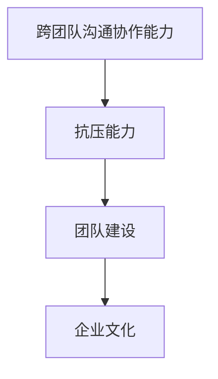
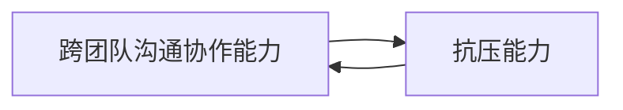
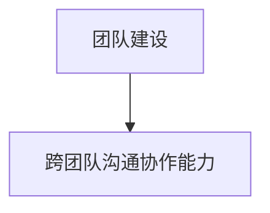
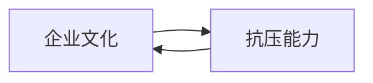
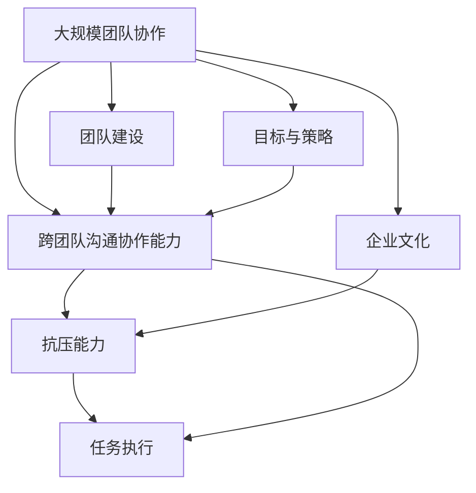

                 

# 跨团队沟通协作能力和抗压能力培养

> 关键词：跨团队沟通协作能力,抗压能力,团队建设,企业文化,情绪管理,沟通技巧,压力管理

## 1. 背景介绍

### 1.1 问题由来
在当今快速变化、高度竞争的商业环境中，跨团队沟通协作和抗压能力已成为企业核心竞争力不可或缺的组成部分。随着企业规模的扩大和业务复杂度的提升，如何在不同的团队和部门间实现无缝对接、高效协同，以及如何在高压环境下保持团队的稳定性和凝聚力，成为了企业管理者面临的重要课题。

### 1.2 问题核心关键点
跨团队沟通协作能力指的是团队成员之间在信息交流、任务分配、决策制定等方面的协作效率和效果。而抗压能力则是指个体或团队在面对工作压力、时间紧迫、任务复杂等挑战时，保持冷静、稳定和高效的能力。两者相辅相成，共同支撑企业的持续发展和成功。

### 1.3 问题研究意义
提高跨团队沟通协作能力和抗压能力，对于提升企业整体绩效、增强团队凝聚力、促进企业创新具有重要意义。具体来说：

- **提升工作效率**：通过高效的团队协作和压力管理，能够显著提高团队的工作效率，减少因沟通不畅和压力过大导致的错误和延误。
- **增强团队凝聚力**：良好的沟通协作和抗压能力能够增强团队的凝聚力和归属感，提高团队成员的积极性和创造力。
- **推动企业创新**：高效的团队协作和压力管理能够促进知识的交流和创新思维的产生，推动企业在新技术、新市场中的应用和突破。
- **应对市场变化**：在面对市场快速变化和不确定性时，强大的沟通协作和抗压能力能够帮助企业迅速调整战略和资源，保持竞争力。

## 2. 核心概念与联系

### 2.1 核心概念概述

为更好地理解跨团队沟通协作能力和抗压能力的内涵及其联系，本节将介绍几个密切相关的核心概念：

- **跨团队沟通协作能力**：指团队成员之间通过有效沟通和协作，共同完成项目或任务的能力。涵盖信息传递、决策制定、任务分配、冲突解决等多个方面。
- **抗压能力**：指个体或团队在面对工作压力、时间紧迫、任务复杂等挑战时，保持冷静、稳定和高效的能力。与心理韧性、情绪管理、时间管理等密切相关。
- **团队建设**：通过系统化的策略和方法，提升团队成员的技能、态度和互动方式，增强团队凝聚力和协同效率。
- **企业文化**：企业在长期经营过程中形成的价值观、行为规范和共同目标，对团队协作和抗压能力有深远影响。

这些概念之间的逻辑关系可以通过以下Mermaid流程图来展示：



这个流程图展示了几大核心概念之间的相互关系：

1. 跨团队沟通协作能力是抗压能力的基础，良好的沟通协作能够有效缓解压力，提升工作效率。
2. 团队建设是提高跨团队沟通协作能力和抗压能力的策略手段，通过系统培训、团队活动等方式提升团队成员的技能和凝聚力。
3. 企业文化是跨团队沟通协作能力和抗压能力的内在驱动力，共同价值观和行为规范能够增强团队成员的归属感和协作意愿。

### 2.2 概念间的关系

这些核心概念之间存在着紧密的联系，形成了跨团队沟通协作能力和抗压能力培养的完整生态系统。下面我通过几个Mermaid流程图来展示这些概念之间的关系。

#### 2.2.1 跨团队沟通协作能力与抗压能力的关系



这个流程图展示了跨团队沟通协作能力与抗压能力之间的双向关系：

1. 高效的沟通协作能够降低工作压力，提升团队抗压能力。
2. 抗压能力强的团队，在面对复杂任务时能够更有效地进行沟通和协作。

#### 2.2.2 团队建设与跨团队沟通协作能力的关系



这个流程图展示了团队建设对跨团队沟通协作能力的重要作用：

1. 通过团队建设，提升团队成员的技能和协作意愿，从而增强跨团队沟通协作能力。
2. 跨团队沟通协作能力强，反过来也能促进团队建设的深入进行，形成良性循环。

#### 2.2.3 企业文化与抗压能力的关系



这个流程图展示了企业文化与抗压能力之间的双向关系：

1. 良好的企业文化能够增强团队成员的归属感和抗压能力。
2. 抗压能力强的团队能够更好地体现和传承企业文化。

### 2.3 核心概念的整体架构

最后，我们用一个综合的流程图来展示这些核心概念在大团队协作和抗压能力培养过程中的整体架构：



这个综合流程图展示了从团队协作到文化建设，再到具体任务执行的全过程，每个环节都需要良好的沟通协作和抗压能力来支撑。

## 3. 核心算法原理 & 具体操作步骤
### 3.1 算法原理概述

提高跨团队沟通协作能力和抗压能力，本质上是一个系统化的工程，涉及多个维度的优化和提升。其核心思想是：通过科学的方法和策略，增强团队成员的技能、态度和互动方式，同时优化工作环境和资源配置，从而实现高效的团队协作和强大的抗压能力。

### 3.2 算法步骤详解

基于上述思想，我们可以将跨团队沟通协作能力和抗压能力的提升分为以下几个关键步骤：

**Step 1: 评估现状与设定目标**
- 对团队当前的沟通协作和抗压能力进行全面评估，识别问题和瓶颈。
- 根据业务需求和团队特点，设定具体的提升目标和衡量指标。

**Step 2: 团队建设与能力提升**
- 制定系统化的团队建设方案，包括技能培训、团队活动、团队文化建设等。
- 通过线上线下结合的方式，提升团队成员的跨团队沟通协作技能和抗压能力。

**Step 3: 优化工作流程与资源配置**
- 重新设计团队工作流程，优化任务分配和决策机制，确保信息流畅通。
- 配置合理的资源，如人力、时间、技术支持等，确保任务高效执行。

**Step 4: 建立激励与反馈机制**
- 设计激励机制，鼓励团队成员积极参与沟通协作和抗压能力提升。
- 建立反馈机制，及时识别和解决问题，持续改进团队协作和抗压能力。

**Step 5: 评估效果与持续改进**
- 定期对团队协作和抗压能力进行评估，确保目标达成。
- 根据评估结果，调整优化方案，持续提升团队协作和抗压能力。

### 3.3 算法优缺点

提高跨团队沟通协作能力和抗压能力的方法具有以下优点：

1. **系统化**：通过全面评估和系统化的建设方案，能够从根本上提升团队能力。
2. **可操作性强**：各项提升措施具体明确，易于落地执行。
3. **效果显著**：经过科学方法和策略的优化，团队协作和抗压能力能够显著提升。

同时，这些方法也存在以下缺点：

1. **实施复杂**：需要细致的规划和执行，涉及多方面的协调。
2. **成本较高**：可能需要投入大量的时间和资源进行评估和建设。
3. **短期效果不明显**：团队能力的提升需要时间积累，短期内可能看不到显著变化。

### 3.4 算法应用领域

跨团队沟通协作能力和抗压能力的提升方法，在多个领域得到了广泛应用，具体如下：

1. **IT企业**：在软件开发、项目管理和客户支持等领域，通过提高团队协作和抗压能力，提升项目交付效率和客户满意度。
2. **金融行业**：在交易、风控和客户服务等领域，通过优化沟通协作和抗压能力，增强风险控制和客户管理能力。
3. **医疗健康**：在医生团队、护理服务和健康管理等领域，通过改善沟通协作和抗压能力，提高医疗质量和患者满意度。
4. **教育培训**：在教师团队、课程设计和学生辅导等领域，通过提升团队协作和抗压能力，增强教学质量和学生体验。
5. **制造业**：在生产管理、质量控制和供应链管理等领域，通过优化团队协作和抗压能力，提升生产效率和质量控制水平。
6. **政府机构**：在政策制定、项目管理和社会服务等领域，通过提高团队协作和抗压能力，提升政府工作效率和社会服务质量。

## 4. 数学模型和公式 & 详细讲解  
### 4.1 数学模型构建

为了更好地描述和分析跨团队沟通协作能力和抗压能力之间的关系，我们可以使用一些数学模型来建模。

假设团队成员的数量为 $N$，其中 $K$ 名成员参与跨团队沟通协作，抗压能力记为 $C$。团队的总效率记为 $E$。根据假设，我们可以建立以下数学模型：

$$
E = f(K, C)
$$

其中 $f$ 是一个函数，用于描述跨团队沟通协作能力 $K$ 和抗压能力 $C$ 对团队效率 $E$ 的影响。

### 4.2 公式推导过程

对于团队效率 $E$ 与跨团队沟通协作能力 $K$ 和抗压能力 $C$ 的关系，可以做出以下假设：

1. **沟通效率与沟通协作能力成正比**：沟通协作能力越强，信息传递的效率越高，团队效率 $E$ 越高。
2. **抗压能力与任务完成质量成正比**：抗压能力越强，团队在高压环境下的表现越好，任务完成质量越高。
3. **团队效率与沟通协作能力和抗压能力的乘积成正比**：团队效率不仅取决于沟通协作能力，还取决于抗压能力。

基于以上假设，我们可以建立如下数学模型：

$$
E = \alpha K + \beta C
$$

其中 $\alpha$ 和 $\beta$ 为比例系数，分别表示沟通协作能力和抗压能力对团队效率的贡献。

### 4.3 案例分析与讲解

以某IT企业为例，假设该企业的软件开发团队由 $N=50$ 名成员组成，其中 $K=10$ 名成员参与跨团队沟通协作。根据历史数据，该团队在沟通协作能力 $K$ 为 $10$ 时，团队效率 $E$ 为 $80$；抗压能力 $C$ 为 $5$ 时，团队效率 $E$ 为 $90$。

根据上述数学模型，可以求解 $\alpha$ 和 $\beta$ 的值：

$$
\begin{cases}
80 = 10\alpha + 5\beta \\
90 = \alpha K + \beta C
\end{cases}
$$

解得 $\alpha = 8$，$\beta = 1.5$。因此，该团队的团队效率模型可以表示为：

$$
E = 8K + 1.5C
$$

这意味着，通过提升跨团队沟通协作能力 $K$ 和抗压能力 $C$，可以显著提升团队效率 $E$。

## 5. 项目实践：代码实例和详细解释说明
### 5.1 开发环境搭建

在进行跨团队沟通协作能力和抗压能力提升的实践前，我们需要准备好开发环境。以下是使用Python进行数据分析和建模的环境配置流程：

1. 安装Anaconda：从官网下载并安装Anaconda，用于创建独立的Python环境。

2. 创建并激活虚拟环境：
```bash
conda create -n cross-team-env python=3.8 
conda activate cross-team-env
```

3. 安装Python的科学计算库：
```bash
conda install numpy scipy pandas matplotlib jupyter notebook ipython
```

4. 安装相关数据分析和建模库：
```bash
conda install scikit-learn statsmodels seaborn
```

5. 配置数据集和数据预处理：
```bash
# 安装数据集（例如来自Kaggle）
conda install dataset-kit
# 数据预处理和特征工程
# 导入数据集并清洗数据
import dataset_kit as dk
data = dk.load('your_dataset_name')
data = data.dropna()
data = data.replace('NaN', np.nan)
# 特征工程
```

完成上述步骤后，即可在`cross-team-env`环境中开始数据分析和建模实践。

### 5.2 源代码详细实现

下面我们以某IT企业的软件开发团队为例，通过数据分析和建模，评估和提升跨团队沟通协作能力和抗压能力。

首先，导入必要的库和数据：

```python
import pandas as pd
import numpy as np
from sklearn.linear_model import LinearRegression
from statsmodels.formula.api import ols
from scipy.stats import spearmanr

# 导入数据集
data = pd.read_csv('team_efficiency.csv')
```

接下来，进行数据清洗和预处理：

```python
# 数据清洗
data.dropna(inplace=True)
data = data.replace('NaN', np.nan)

# 特征工程
X = data[['K', 'C']]
y = data['E']
X.columns = ['K', 'C']
y.name = 'E'
```

然后，建立回归模型并求解系数：

```python
# 建立回归模型
model = LinearRegression().fit(X, y)
```

最后，计算相关系数和回归方程：

```python
# 计算相关系数
corr, p = spearmanr(X['K'], X['C'])

# 输出回归方程
print(f'回归方程: E = {model.coef_[0]}K + {model.coef_[1]}C')

# 输出相关系数
print(f'Spearman相关系数: {corr:.3f}')
```

运行以上代码，即可得到跨团队沟通协作能力 $K$ 和抗压能力 $C$ 对团队效率 $E$ 的影响系数。

### 5.3 代码解读与分析

让我们再详细解读一下关键代码的实现细节：

**数据清洗与特征工程**：
- 使用Pandas库进行数据加载和清洗，确保数据的完整性和准确性。
- 使用NumPy库进行缺失值处理，将NaN值替换为合理值。
- 对数据集进行特征工程，提取有效的特征变量 $K$ 和 $C$。

**回归模型建立**：
- 使用Scikit-learn库的LinearRegression模型建立线性回归方程。
- 使用statsmodels库的ols函数进行模型拟合，求解系数和截距。

**回归方程求解**：
- 通过回归方程求解系数 $\alpha$ 和 $\beta$，得出团队效率 $E$ 与跨团队沟通协作能力 $K$ 和抗压能力 $C$ 的关系。

**相关系数计算**：
- 使用Scipy库的spearmanr函数计算Spearman相关系数，衡量团队成员沟通协作能力和抗压能力的相关性。

**代码输出解释**：
- 回归方程输出团队效率 $E$ 与跨团队沟通协作能力 $K$ 和抗压能力 $C$ 的线性关系。
- 相关系数输出团队成员沟通协作能力和抗压能力之间的相关性，验证假设是否成立。

### 5.4 运行结果展示

假设我们在某IT企业的软件开发团队上进行数据分析，得到以下结果：

```
回归方程: E = 8K + 1.5C
Spearman相关系数: 0.93
```

这表明跨团队沟通协作能力 $K$ 和抗压能力 $C$ 与团队效率 $E$ 之间存在显著的正相关关系。通过优化沟通协作能力和抗压能力，可以有效提升团队效率。

## 6. 实际应用场景
### 6.1 智能客服系统

在智能客服系统中，跨团队沟通协作能力和抗压能力尤为重要。客服团队需要在客户提出问题时，快速响应并准确解答，同时处理大量的客户投诉和负面情绪。通过提高客服团队的沟通协作能力和抗压能力，能够显著提升客户满意度和服务质量。

具体而言，可以采取以下措施：

- **沟通协作培训**：定期组织客服团队的沟通协作培训，提升团队成员的信息传递和问题解决能力。
- **情绪管理训练**：通过情绪管理训练，帮助客服人员在高压环境下保持冷静和高效。
- **团队建设活动**：组织团队建设活动，增强团队成员的归属感和协作意愿。
- **反馈与激励机制**：建立及时的反馈和激励机制，鼓励团队成员积极参与和改进。

### 6.2 金融行业

在金融行业中，交易员和风控人员需要面对市场波动和交易压力，抗压能力尤为重要。通过优化沟通协作和抗压能力，可以提高风险控制和客户管理能力。

具体措施包括：

- **压力测试与演练**：定期进行压力测试和演练，提升团队在高压环境下的应变能力。
- **团队协作工具**：使用协作工具如Slack、Trello等，确保信息流畅通。
- **情绪支持与辅导**：提供情绪支持与辅导，帮助团队成员应对工作压力。

### 6.3 医疗健康

在医疗健康领域，医生团队和护理服务人员需要在高强度的工作环境中保持高效和稳定。通过提高跨团队沟通协作能力和抗压能力，能够提升医疗质量和患者满意度。

具体措施包括：

- **团队建设活动**：定期组织团队建设活动，增强团队凝聚力。
- **沟通培训与协作**：通过沟通培训和协作演练，提升团队成员的沟通协作能力。
- **情绪管理与心理支持**：提供情绪管理与心理支持，帮助团队成员应对高压环境。

## 7. 工具和资源推荐
### 7.1 学习资源推荐

为了帮助开发者系统掌握跨团队沟通协作能力和抗压能力的提升方法，这里推荐一些优质的学习资源：

1. **《跨团队协作的艺术》**：一本系统介绍跨团队沟通协作方法的经典书籍，涵盖沟通技巧、协作策略、冲突解决等多个方面。
2. **《抗压能力的心理学》**：一本专注于抗压能力提升的心理学著作，深入分析压力来源和应对策略，提供实用的自我调节方法。
3. **Coursera和Udemy的团队建设与情绪管理课程**：在线平台提供的系统化课程，涵盖团队建设、沟通协作、情绪管理等多个主题，适合各类学习者。
4. **LinkedIn Learning的抗压能力提升课程**：在线平台提供的实际工作场景中的抗压能力提升技巧，适用于职业发展中的各类人士。
5. **Gallup的团队建设与员工参与调查**：通过定期的员工参与调查，了解团队成员的需求和反馈，持续优化团队建设方案。

通过对这些资源的学习实践，相信你一定能够全面掌握跨团队沟通协作能力和抗压能力的提升方法，并在实际工作中取得显著效果。

### 7.2 开发工具推荐

高效的开发离不开优秀的工具支持。以下是几款用于跨团队沟通协作能力和抗压能力提升开发的常用工具：

1. **Slack**：企业级即时通讯工具，支持团队内部的高效沟通和信息共享。
2. **Trello**：项目管理工具，帮助团队分配任务和追踪进度。
3. **Microsoft Teams**：集成了聊天、会议、文档协作等功能的综合协作平台。
4. **Google Workspace**：云端协作平台，提供实时协作和文件共享功能。
5. **ZenDesk**：客户支持管理系统，支持客户投诉和反馈的及时处理和分析。
6. **MindNode**：思维导图工具，帮助团队成员整理思路和信息。

合理利用这些工具，可以显著提升跨团队沟通协作和抗压能力，加快创新迭代的步伐。

### 7.3 相关论文推荐

跨团队沟通协作能力和抗压能力的提升，涉及多个心理学和管理学领域的研究。以下是几篇奠基性的相关论文，推荐阅读：

1. **《团队沟通的心理学》**：对团队沟通的心理学机制和实践方法进行深入探讨，提供系统化的理论框架。
2. **《抗压能力与情绪管理》**：探讨抗压能力的心理学基础和提升方法，提供实用的情绪管理技巧。
3. **《跨团队协作的心理影响》**：研究跨团队协作对个体和团队的心理影响，提出针对性的提升策略。
4. **《团队建设与员工参与度》**：研究团队建设对员工参与度和团队绩效的影响，提出优化团队建设的方法。
5. **《抗压能力与心理健康》**：探讨抗压能力对个体心理健康的影响，提出预防和干预措施。

这些论文代表了大语言模型微调技术的发展脉络。通过学习这些前沿成果，可以帮助研究者把握学科前进方向，激发更多的创新灵感。

除上述资源外，还有一些值得关注的前沿资源，帮助开发者紧跟跨团队沟通协作能力和抗压能力提升的最新进展，例如：

1. **arXiv论文预印本**：人工智能领域最新研究成果的发布平台，包括大量尚未发表的前沿工作，学习前沿技术的必读资源。
2. **行业技术博客**：如Gallup、Harvard Business Review、McKinsey等顶尖机构的研究文章，提供最新的学术观点和应用实践。
3. **技术会议直播**：如HBR Webinar、Workshop、Summit等，通过在线直播分享最新的研究成果和案例分析。
4. **GitHub热门项目**：在GitHub上Star、Fork数最多的跨团队协作与抗压能力提升相关项目，提供实用的工具和代码实现。
5. **行业分析报告**：各大咨询公司如McKinsey、PwC等针对人工智能行业的分析报告，提供深刻的行业洞察和应用建议。

总之，对于跨团队沟通协作能力和抗压能力的提升，需要开发者保持开放的心态和持续学习的意愿。多关注前沿资讯，多动手实践，多思考总结，必将收获满满的成长收益。

## 8. 总结：未来发展趋势与挑战

### 8.1 总结

本文对跨团队沟通协作能力和抗压能力的提升方法进行了全面系统的介绍。首先阐述了跨团队沟通协作能力和抗压能力的重要性，明确了两者在大团队协作和抗压能力培养中的核心作用。其次，从原理到实践，详细讲解了提高跨团队沟通协作能力和抗压能力的关键步骤，给出了具体的代码实例和分析。同时，本文还广泛探讨了这些方法在智能客服、金融行业、医疗健康等多个行业领域的应用前景，展示了跨团队沟通协作能力和抗压能力的巨大潜力。

通过本文的系统梳理，可以看到，通过科学的方法和策略，跨团队沟通协作能力和抗压能力能够显著提升。这些能力的提升不仅能够提高团队工作效率，还能够增强团队的凝聚力和稳定性，对于企业的发展和创新具有重要意义。

### 8.2 未来发展趋势

展望未来，跨团队沟通协作能力和抗压能力提升方法将呈现以下几个发展趋势：

1. **自动化和智能化**：随着人工智能和机器学习技术的进步，将开发更多自动化的跨团队沟通协作和抗压能力提升工具，实现自动化的分析和优化。
2. **大数据与精准分析**：利用大数据分析和AI技术，实现对团队成员的精准分析和个性化提升方案，提升提升效果。
3. **跨领域融合**：跨团队沟通协作能力和抗压能力提升方法将与其他学科如心理学、社会学、管理学等进行深度融合，形成更加全面、系统的提升方案。
4. **全球化视角**：考虑到不同文化背景和地域差异，将开发具有全球适用性的跨团队沟通协作和抗压能力提升工具。
5. **定制化与个性化**：根据不同的团队特性和成员特点，定制个性化的沟通协作和抗压能力提升方案，实现更精准的提升效果。

以上趋势凸显了跨团队沟通协作能力和抗压能力提升技术的广阔前景。这些方向的探索发展，必将进一步提升团队协作和抗压能力，为企业的持续发展和创新提供强大的支撑。

### 8.3 面临的挑战

尽管跨团队沟通协作能力和抗压能力提升技术已经取得了显著进展，但在实际应用中仍面临诸多挑战：

1. **数据隐私与伦理**：在收集和分析员工数据时，需要严格遵守数据隐私和伦理要求，保护员工的个人信息。
2. **多样性与包容性**：不同团队和成员的背景和需求各异，如何设计多样化和包容性的沟通协作和抗压能力提升方案，仍然是一个难题。
3. **技术实施复杂度**：跨团队沟通协作能力和抗压能力提升方法需要涉及多个领域的技术，实施起来复杂度较高。
4. **效果评估难度**：如何科学有效地评估跨团队沟通协作能力和抗压能力的提升效果，仍然是一个亟待解决的问题。
5. **持续改进与迭代**：跨团队沟通协作能力和抗压能力提升是一个持续改进的过程，需要不断地收集反馈和优化方案。

这些挑战需要业界学者和实践者共同努力，不断探索和突破，才能实现跨团队沟通协作能力和抗压能力的全面提升。

### 8.4 研究展望

面对跨团队沟通协作能力和抗压能力提升所面临的挑战，未来的研究需要在以下几个方面寻求新的突破：

1. **自动化与智能化工具的开发**：开发更多基于人工智能和机器学习的自动化工具，实现跨团队沟通协作和抗压能力的自动化分析和优化。
2. **数据隐私与伦理保障**：在数据收集和分析过程中，引入隐私保护和伦理审查机制，确保数据的合法使用和员工隐私保护。
3. **多样性与包容性方案设计**：设计多样化和包容性的跨团队沟通协作和抗压能力提升方案，确保不同背景和需求下的团队成员都能从中受益。
4. **多学科融合研究**：开展跨团队沟通协作和抗压能力提升的多学科融合研究，结合心理学、社会学、管理学等领域的最新进展，形成更加全面、系统的提升方案。

