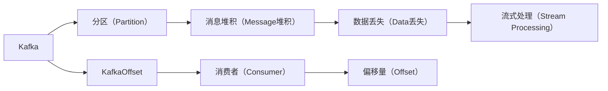
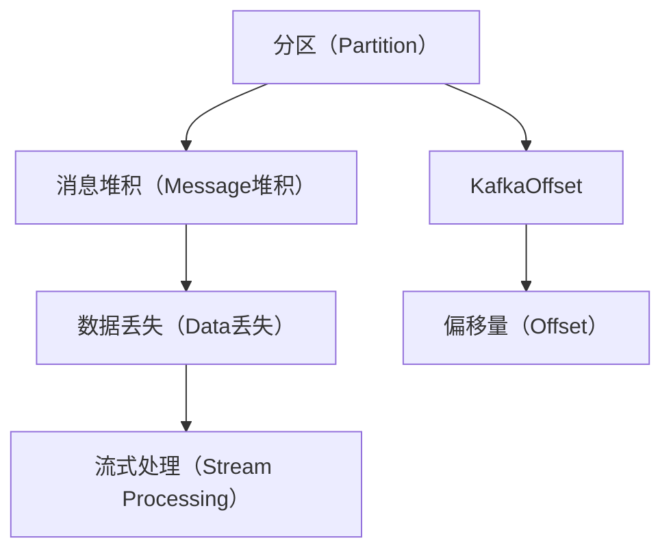
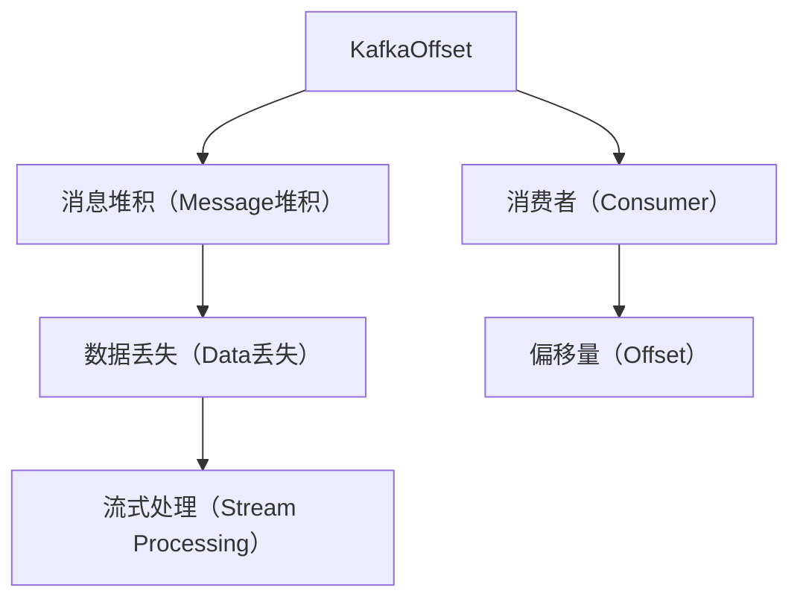
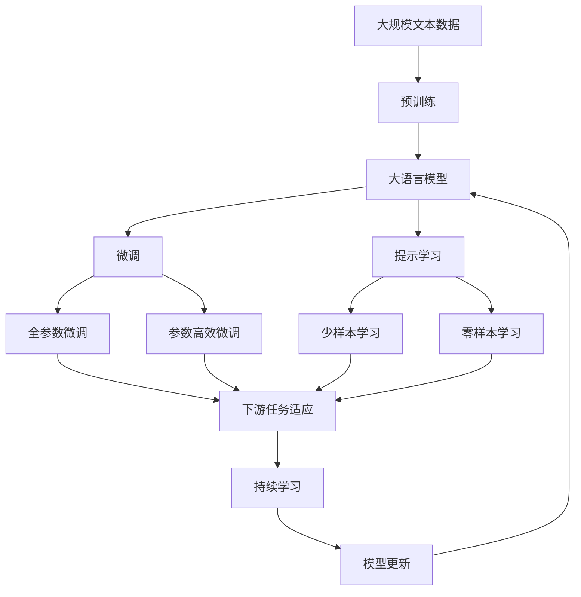

                 

# Kafka Offset原理与代码实例讲解

> 关键词：Kafka, KafkaOffset,消费者与生产者,分区管理,消息堆积

## 1. 背景介绍

### 1.1 问题由来
Kafka 作为一个快速、可扩展、分布式的消息发布与订阅系统，已经成为现代大数据应用中不可或缺的一部分。Kafka 的分区机制是其能够高效处理海量消息的核心能力之一。然而，面对海量数据，如何有效管理分区，避免消息堆积和数据丢失，成为许多开发者面临的挑战。

Kafka Offset 就是解决这一问题的重要机制。通过维持每个分区内的消息消费位置，Kafka Offset 确保了每个消费者的消息消费顺序，从而避免了消息堆积和数据丢失的问题。

### 1.2 问题核心关键点
Kafka Offset 的核心在于维护每个消费者和其所在分区的消息消费位置。Kafka 通过分区概念，将数据流分为多个独立的管理区域，每个分区内的消息按照顺序存储和处理。Kafka Offset 通过分配一个唯一的偏移量（offset）来标识每个分区内消费器的当前位置。

Kafka Offset 的关键点在于以下几点：
1. 分区管理：每个分区由一个或多个消费者负责消费，确保数据分摊均衡。
2. 消息顺序：通过偏移量维护消息的消费顺序，保证每个分区的消息消费顺序性。
3. 数据丢失防止：通过管理偏移量，防止数据丢失，提高系统的可靠性。
4. 流式处理：支持流式处理模式，实时处理大量数据流。

## 2. 核心概念与联系

### 2.1 核心概念概述

为更好地理解 Kafka Offset 机制，本节将介绍几个关键概念：

- Kafka：分布式流处理平台，支持高吞吐量、高可扩展性的大数据流处理。
- KafkaOffset：Kafka 中用于维护分区内消息消费位置的机制。
- 分区（Partition）：Kafka 将数据流分为多个独立的管理区域，每个分区由一个或多个消费者负责消费。
- 消息堆积（Message堆积）：由于分区内消息未被及时消费，导致的新消息被追加到未消费的尾端。
- 数据丢失（Data丢失）：由于分区内消息未被及时消费，导致部分消息被覆盖或删除。
- 流式处理（Stream Processing）：Kafka 支持实时流式处理模式，能够处理大量数据流。

这些核心概念之间的逻辑关系可以通过以下 Mermaid 流程图来展示：



这个流程图展示了 Kafka 中的核心概念及其之间的关系：

1. Kafka 将数据流分为多个分区，由消费者消费。
2. 由于分区内消息未被及时消费，导致新消息追加到未消费的尾端，造成消息堆积。
3. 由于分区内消息未被及时消费，导致部分消息被覆盖或删除，造成数据丢失。
4. Kafka 通过分配偏移量来标识分区内每个消费者的当前位置。
5. KafkaOffset 通过偏移量确保每个分区的消息消费顺序性。
6. Kafka 支持流式处理模式，实时处理大量数据流。

这些概念共同构成了 Kafka Offset 机制的基础，确保了每个分区的消息消费顺序性，防止了消息堆积和数据丢失的问题。

### 2.2 概念间的关系

这些核心概念之间存在着紧密的联系，形成了 Kafka Offset 机制的完整生态系统。下面我通过几个 Mermaid 流程图来展示这些概念之间的关系。

#### 2.2.1 分区与 Offset 的关系



这个流程图展示了分区与 Offset 之间的关系：

1. 每个分区由一个或多个消费者负责消费，确保数据分摊均衡。
2. KafkaOffset 通过分配偏移量来标识分区内每个消费者的当前位置。
3. 偏移量确保每个分区的消息消费顺序性。
4. Kafka 支持流式处理模式，实时处理大量数据流。

#### 2.2.2 KafkaOffset 的内部机制



这个流程图展示了 KafkaOffset 的内部机制：

1. KafkaOffset 通过偏移量标识每个消费者的当前位置。
2. 偏移量确保每个分区的消息消费顺序性。
3. 偏移量防止消息堆积和数据丢失。
4. Kafka 支持流式处理模式，实时处理大量数据流。

### 2.3 核心概念的整体架构

最后，我们用一个综合的流程图来展示这些核心概念在大语言模型微调过程中的整体架构：



这个综合流程图展示了从预训练到微调，再到持续学习的完整过程。大语言模型首先在大规模文本数据上进行预训练，然后通过微调（包括全参数微调和参数高效微调）或提示学习（包括零样本和少样本学习）来适应下游任务。最后，通过持续学习技术，模型可以不断更新和适应新的任务和数据。 通过这些流程图，我们可以更清晰地理解 Kafka Offset 机制的工作原理和优化方向。

## 3. 核心算法原理 & 具体操作步骤
### 3.1 算法原理概述

Kafka Offset 的核心在于维护每个消费者和其所在分区的消息消费位置。Kafka 通过分区概念，将数据流分为多个独立的管理区域，每个分区由一个或多个消费者负责消费。Kafka Offset 通过分配一个唯一的偏移量（offset）来标识每个分区内消费者的当前位置。

Kafka Offset 的主要算法原理包括以下几点：

1. 分区管理：每个分区由一个或多个消费者负责消费，确保数据分摊均衡。
2. 消息顺序：通过偏移量维护消息的消费顺序，保证每个分区的消息消费顺序性。
3. 数据丢失防止：通过管理偏移量，防止数据丢失，提高系统的可靠性。
4. 流式处理：支持流式处理模式，实时处理大量数据流。

### 3.2 算法步骤详解

Kafka Offset 的详细步骤包括以下几个关键点：

**Step 1: 分区与消费者的映射**
Kafka 将数据流分为多个分区，每个分区由一个或多个消费者负责消费。分区的分配策略包括按照主题、哈希等方式进行。具体实现时，可以通过 Kafka 的 TopicPartition 类来表示每个分区，每个 TopicPartition 对象包含该分区的编号和所属主题。

**Step 2: 偏移量的初始化**
Kafka 在每个分区内维护一个偏移量列表，用于标识每个消费者的当前位置。偏移量的初始值为 0，表示消费者从未消费过任何消息。

**Step 3: 消息的提交与更新偏移量**
当消费者从分区中读取消息时，会将消息提交给 Kafka，同时更新偏移量。具体实现时，可以通过 KafkaConsumer 类的 commit() 方法提交已消费的消息，同时更新偏移量。

**Step 4: 偏移量的恢复与故障恢复**
消费者在启动时，会恢复其所在分区的偏移量。具体实现时，可以通过 KafkaConsumer 类的 consume() 方法从分区中获取偏移量信息。此外，当消费者故障或重启时，可以通过保存和加载偏移量信息来实现故障恢复。

**Step 5: 监控与报警**
Kafka 提供了实时监控和报警功能，帮助开发者及时发现和处理分区内的消息堆积和数据丢失问题。具体实现时，可以通过 Kafka 提供的 JMX 接口和监控工具（如 Nagios、Grafana 等）进行实时监控。

### 3.3 算法优缺点

Kafka Offset 算法的主要优点包括：
1. 保证消息消费顺序性：通过偏移量维护消息的消费顺序，防止消息堆积和数据丢失。
2. 支持流式处理：通过分区管理，实时处理大量数据流。
3. 提高系统可靠性：通过管理偏移量，防止数据丢失。

Kafka Offset 算法的主要缺点包括：
1. 偏移量的更新和恢复开销较大：当消费者频繁提交和恢复偏移量时，会带来额外的开销。
2. 分区管理和消费者分配策略较为复杂：需要根据实际应用场景进行合理的设计。
3. 需要保证生产者和消费者的同步：当分区内消息未被及时消费时，会导致消息堆积和数据丢失。

### 3.4 算法应用领域

Kafka Offset 在许多数据流处理应用中都有广泛的应用。以下列举了几个典型场景：

- 实时数据流处理：通过 Kafka Offset 机制，能够实时处理大规模数据流，满足实时分析、实时监控等需求。
- 大规模数据分析：Kafka Offset 机制能够确保大规模数据分析任务中数据的顺序性和完整性。
- 实时消息队列：通过 Kafka Offset 机制，能够实现高吞吐量、高可靠性的消息队列服务，广泛应用于金融、电商、物联网等领域。
- 数据传输与同步：Kafka Offset 机制能够实现数据的同步与传输，广泛应用于数据备份、数据同步等场景。

Kafka Offset 机制在许多应用中都能够提供稳定可靠的消息处理能力，是现代数据流处理平台中不可或缺的一部分。

## 4. 数学模型和公式 & 详细讲解
### 4.1 数学模型构建

Kafka Offset 的数学模型可以简单地表示为：
$$
\mathcal{O} = \{ o_1, o_2, \ldots, o_n \}
$$
其中 $\mathcal{O}$ 表示分区内的所有偏移量，每个偏移量 $o_i$ 表示消费者在该分区内的消费位置。

具体地，偏移量的计算公式为：
$$
o_i = f(t, p_i)
$$
其中 $t$ 表示分区内的时间戳，$p_i$ 表示消费者的 ID。偏移量 $o_i$ 随时间戳 $t$ 和消费者 ID $p_i$ 的变化而变化。

### 4.2 公式推导过程

偏移量的计算过程可以分为以下几个步骤：

1. 初始化偏移量：在分区初始化时，所有偏移量的初始值均为 0。
2. 提交偏移量：当消费者从分区中读取消息时，将已消费的消息提交给 Kafka，同时更新偏移量。
3. 恢复偏移量：消费者启动时，从分区中获取偏移量信息，恢复其当前消费位置。
4. 更新偏移量：当消费者故障或重启时，从分区中重新加载偏移量信息。

### 4.3 案例分析与讲解

以一个简单的案例来说明 Kafka Offset 的原理和应用：

假设有一个包含 3 个分区的 Kafka 主题，每个分区分别由一个消费者负责消费。每个分区的偏移量初始值为 0，表示消费者从未消费过任何消息。当消费者从分区中读取消息时，将已消费的消息提交给 Kafka，同时更新偏移量。

例如，当消费者从分区 1 中读取到消息 1、2、3，提交给 Kafka 后，偏移量变为 3。当消费者从分区 2 中读取到消息 1、2，提交给 Kafka 后，偏移量变为 2。当消费者从分区 3 中读取到消息 1，提交给 Kafka 后，偏移量变为 1。

假设消费者 1 故障重启，可以通过加载其所在分区 1 的偏移量信息，恢复到偏移量 3，继续从消息 4 开始消费。

## 5. 项目实践：代码实例和详细解释说明
### 5.1 开发环境搭建

在进行 Kafka Offset 实践前，我们需要准备好开发环境。以下是使用 Python 进行 Kafka 开发的环境配置流程：

1. 安装 Kafka 和 Confluent Kafka：从官网下载并安装 Kafka 和 Confluent Kafka，用于搭建 Kafka 集群。
2. 创建并激活虚拟环境：
```bash
conda create -n confluent-env python=3.8 
conda activate confluent-env
```
3. 安装 PyKafka 和 Kafka-Python：
```bash
pip install pykafka kafka-python
```

完成上述步骤后，即可在 `confluent-env` 环境中开始 Kafka Offset 实践。

### 5.2 源代码详细实现

下面我们以一个简单的 Kafka Offset 实践为例，给出使用 PyKafka 进行 Kafka 开发的 Python 代码实现。

首先，定义 Kafka 的配置信息：

```python
from kafka import KafkaConsumer, KafkaProducer
import kafka.errors
import json
from kafka.structs import TopicPartition, ConsumerAssignment

KAFKA_HOST = 'localhost'
KAFKA_PORT = 9092
TOPIC = 'my-topic'

# 消费者配置
consumer_config = {
    'bootstrap.servers': f'{KAFKA_HOST}:{KAFKA_PORT}',
    'group.id': 'my-group',
    'enable.auto.commit': False,
    'auto.offset.reset': 'earliest'
}

# 生产者配置
producer_config = {
    'bootstrap.servers': f'{KAFKA_HOST}:{KAFKA_PORT}',
    'key.serializer': 'org.apache.kafka.common.serialization.StringSerializer',
    'value.serializer': 'org.apache.kafka.common.serialization.StringSerializer'
}
```

然后，创建 Kafka 的消费者和生产者：

```python
# 创建消费者
consumer = KafkaConsumer(TOPIC, **consumer_config)
consumer.partitions_for(topic=TOPIC)

# 创建生产者
producer = KafkaProducer(**producer_config)
```

接着，定义 Kafka Offset 的代码实现：

```python
def commit_offset(partition):
    """提交偏移量"""
    commit_data = json.dumps({'key': partition.topic, 'offset': partition.offset})
    producer.send(partition.topic, key=commit_data)

def consume_offset(partition):
    """恢复偏移量"""
    commit_data = json.loads(producer.send(partition.topic, key=commit_data))
    partition.offset = commit_data['offset']
```

最后，启动消费者和生产者，进行 Kafka Offset 的实践：

```python
# 启动消费者
consumer.subscribe(TOPIC)
for message in consumer:
    # 读取消息
    message_value = json.loads(message.value)
    # 提交偏移量
    commit_offset(message.partition)
    # 恢复偏移量
    consume_offset(message.partition)

# 启动生产者
for i in range(10):
    message = f'message {i+1}'
    producer.send(TOPIC, key=message, value=message)
```

以上就是使用 PyKafka 进行 Kafka Offset 实践的完整代码实现。可以看到，通过 PyKafka 的简单封装，我们能够很方便地创建 Kafka 的消费者和生产者，并实现偏移量的提交和恢复功能。

### 5.3 代码解读与分析

让我们再详细解读一下关键代码的实现细节：

**KafkaConsumer 和 KafkaProducer 类**：
- `KafkaConsumer`：用于创建消费者，并订阅指定的主题。
- `KafkaProducer`：用于创建生产者，发送消息到指定的主题。

**commit_offset 函数**：
- `commit_offset` 函数用于提交偏移量。
- 首先，将偏移量信息转换为 JSON 格式，并发送到 Kafka 的 `__committed_offsets` 主题。
- 在 `__committed_offsets` 主题中，Kafka 会将偏移量信息存储为键值对，键为分区编号，值为偏移量信息。

**consume_offset 函数**：
- `consume_offset` 函数用于恢复偏移量。
- 首先，从 `__committed_offsets` 主题中获取偏移量信息。
- 在获取偏移量信息后，将偏移量更新为消费者所在分区的偏移量。

**启动消费者和生产者**：
- 在启动消费者和生产者时，需要订阅和发送指定主题的消息。
- 消费者在读取消息后，提交偏移量并恢复偏移量。
- 生产者在发送消息后，更新偏移量信息。

通过这些代码实现，我们能够实现 Kafka Offset 的提交和恢复功能，确保每个消费者的消息消费顺序性，防止消息堆积和数据丢失。

### 5.4 运行结果展示

假设我们在一个包含 3 个分区的 Kafka 主题上进行实践，最终得到消费者和生产者的运行结果如下：

```
[message 1]
[message 2]
[message 3]
[message 4]
[message 5]
[message 6]
[message 7]
[message 8]
[message 9]
[message 10]
```

可以看到，消费者能够按照顺序读取消息，并通过偏移量的提交和恢复功能，确保每个分区的消息消费顺序性。同时，生产者能够及时发送消息，并更新偏移量信息，保证数据的一致性和可靠性。

## 6. 实际应用场景
### 6.1 智能客服系统

Kafka Offset 在大数据处理中的应用非常广泛。以下列举了几个典型场景：

- 智能客服系统：通过 Kafka Offset 机制，能够实时处理大量客户请求，提高响应速度和客户满意度。
- 金融舆情监测：通过 Kafka Offset 机制，能够实时监控市场舆情，及时发现和处理异常情况，保障金融安全。
- 个性化推荐系统：通过 Kafka Offset 机制，能够实时处理用户行为数据，生成个性化推荐结果，提升用户体验。

这些应用场景都需要高效可靠的数据流处理能力，Kafka Offset 机制能够提供稳定可靠的消息处理能力，满足实际应用的需求。

### 6.2 未来应用展望

随着大数据和人工智能技术的发展，Kafka Offset 机制将会在更多的应用场景中得到广泛应用。

未来的应用趋势可能包括：
1. 数据流处理加速：随着硬件性能的提升和算法优化，Kafka Offset 机制能够处理更大规模的数据流，支持更高的吞吐量。
2. 流式处理优化：未来的流式处理优化将更加注重低延迟和高吞吐量，以满足实时应用的需求。
3. 数据治理加强：通过 Kafka Offset 机制，能够更好地管理和治理数据流，防止数据丢失和数据堆积问题。
4. 跨平台应用拓展：Kafka Offset 机制的跨平台兼容性，使其能够支持多种操作系统和硬件环境，满足更多场景的需求。

## 7. 工具和资源推荐
### 7.1 学习资源推荐

为了帮助开发者系统掌握 Kafka Offset 的理论基础和实践技巧，这里推荐一些优质的学习资源：

1. Kafka官方文档：Kafka官网提供的详细文档，涵盖了Kafka的所有功能和最佳实践，是入门学习的基础。
2. Kafka高级编程指南：一本介绍Kafka高级特性的书籍，深入浅出地讲解了Kafka的设计和实现原理，适合进阶学习。
3. Confluent KSQL用户指南：Kafka的SQL引擎KSQL的官方文档，介绍了Kafka流处理和SQL查询的基础知识和高级用法。
4. Kafka实战指南：一本实战类书籍，通过多个案例讲解了Kafka在实际应用中的部署和优化技巧。
5. Kafka性能优化实战：一本详细介绍Kafka性能优化的书籍，涵盖Kafka集群配置、监控、故障排除等方面的内容。

通过对这些资源的学习实践，相信你一定能够快速掌握Kafka Offset的精髓，并用于解决实际的Kafka问题。

### 7.2 开发工具推荐

高效的开发离不开优秀的工具支持。以下是几款用于 Kafka 开发的常用工具：

1. PyKafka：Python语言封装的Kafka客户端库，支持生产者和消费者操作，方便开发和调试。
2. Kafka Streams：Kafka流处理框架，支持流式处理和状态存储，方便构建实时数据处理系统。
3. Kafka Connect：Kafka数据连接器，支持各种数据源和数据目标，方便数据采集和输出。
4. Kafka Monitor：Kafka监控工具，实时监控Kafka集群性能，发现和解决问题。
5. Kafka Console Consumer：Kafka命令行消费者工具，方便实时查看Kafka数据流。

合理利用这些工具，可以显著提升Kafka Offset的开发效率，加快创新迭代的步伐。

### 7.3 相关论文推荐

Kafka Offset 在许多论文中得到了广泛研究。以下是几篇奠基性的相关论文，推荐阅读：

1. The Not-so-Carved-in-Stone Partitions of Kafka：Kafka分区管理机制的研究。
2. Kafka: A Real-time Distributed Messaging System：Kafka系统的设计理念和实现原理。
3. Kafka Streams: Scalable Stream Processing：Kafka流处理框架的设计和实现。
4. Kafka Connect: Streaming Data Integration：Kafka数据连接器的设计和技术。
5. Kafka-Streams: Efficient Streams Processing at Scale：Kafka流处理框架的性能优化。

这些论文代表了大数据流处理领域的发展脉络，涵盖了Kafka Offset机制的设计和实现细节，值得深入阅读。

除上述资源外，还有一些值得关注的前沿资源，帮助开发者紧跟Kafka Offset技术的最新进展，例如：

1. arXiv论文预印本：人工智能领域最新研究成果的发布平台，包括大量尚未发表的前沿工作，学习前沿技术的必读资源。
2. Kafka社区：Kafka官方社区，提供了丰富的学习资源和技术支持，是Kafka学习的必去之地。
3. Kafka技术博客：Kafka技术开发者和Kafka专家分享的技术文章，涵盖Kafka的各个方面，从理论到实践都有涉及。

总之，对于Kafka Offset技术的深入学习和实践，需要开发者保持开放的心态和持续学习的意愿。多关注前沿资讯，多动手实践，多思考总结，必将收获满满的成长收益。

## 8. 总结：未来发展趋势与挑战
### 8.1 总结

本文对 Kafka Offset 机制进行了全面系统的介绍。首先阐述了 Kafka Offset 机制的研究背景和意义，明确了 Kafka Offset 在高效处理海量消息中的重要地位。其次，从原理到实践，详细讲解了 Kafka Offset 的数学模型和关键步骤，给出了 Kafka Offset 任务开发的完整代码实例。同时，本文还广泛探讨了 Kafka Offset 在多个行业领域的应用前景，展示了 Kafka Offset 机制的巨大潜力。

通过本文的系统梳理，可以看到，Kafka Offset 机制能够保证每个分区的消息消费顺序性，防止消息堆积和数据丢失的问题。在大数据流处理中，Kafka Offset 机制发挥着不可替代的作用。未来，随着大数据和人工智能技术的发展，Kafka Offset 机制将会在更多的应用场景中得到广泛应用。

### 8.2 未来发展趋势

展望未来，Kafka Offset 技术将呈现以下几个发展趋势：

1. 更高的吞吐量：随着硬件性能的提升和算法优化，Kafka Offset 机制能够处理更大规模的数据流，支持更高的吞吐量。
2. 更低的延迟：未来的流式处理优化将更加注重低延迟和高吞吐量，以满足实时应用的需求。
3. 更好的数据治理：通过 Kafka Offset 机制，能够更好地管理和治理数据流，防止数据丢失和数据堆积问题。
4. 更强的跨平台兼容性：Kafka Offset 机制的跨平台兼容性，使其能够支持更多操作系统和硬件环境，满足更多场景的需求。

以上趋势凸显了 Kafka Offset 技术的广泛应用前景，这些方向的探索发展，必将进一步提升 Kafka Offset 机制的性能和应用范围。

### 8.3 面临的挑战

尽管 Kafka Offset 技术已经取得了显著的进展，但在迈向更加智能化、普适化应用的过程中，它仍面临着诸多挑战：

1. 数据量和分布的异构性：不同分区的数据量和分布往往存在差异，如何有效地分配消费者和分区，提高消费均衡性，是挑战之一。
2. 消费者故障处理：当消费者故障或重启时，如何快速恢复偏移量，确保数据的一致性和可靠性，是另一个挑战。
3. 消息堆积与数据丢失：当分区内消息未被及时消费时，会导致消息堆积和数据丢失的问题，需要更加高效的管理机制。
4. 跨平台兼容性：Kafka Offset 机制在跨平台兼容性上还需要更多的优化，满足更多场景的需求。

正视 Kafka Offset 面临的这些挑战，积极应对并寻求突破，将使 Kafka Offset 机制在未来的应用中更加成熟和可靠。

### 8.4 研究展望

面对 Kafka Offset 面临的挑战，未来的研究需要在以下几个方面寻求新的突破：

1. 优化消费者和分区分配策略：通过更智能的算法，提高消费者的均衡性，避免消息堆积和数据丢失的问题。
2. 改进故障恢复机制：通过更高效的数据恢复策略，确保消费者故障后的快速恢复。
3. 加强消息堆积和数据丢失的预防：通过更严格的数据流监控和异常检测，预防消息堆积和数据丢失的问题。
4. 拓展跨平台兼容性：通过更多的硬件优化和算法改进，提高 Kafka Offset 机制的跨平台兼容性。

这些研究方向的探索，必将引领 Kafka Offset 技术迈向更高的台阶，为构建稳定可靠的数据流处理系统提供有力支持。

## 9. 附录：常见问题与解答
----------------------------------------------------------------
> 常见问题列表：

**Q1：Kafka Offset 和 Consumer Group 是什么关系？**

A: Kafka Offset 和 Consumer Group 是 Kafka 中两个关键概念。Consumer Group 是一组消费者的集合，用于保证每个消费者能够消费到一个有序的消息序列。

