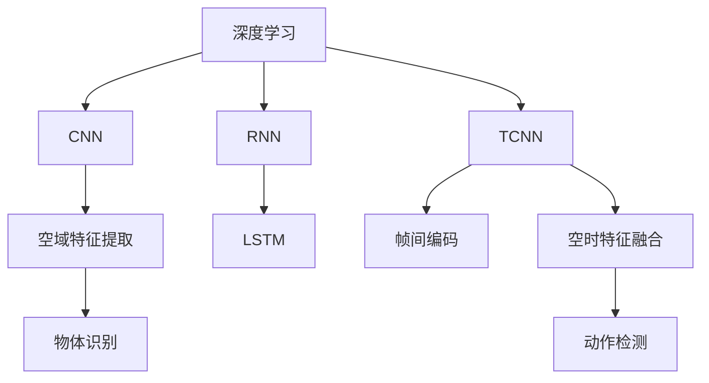
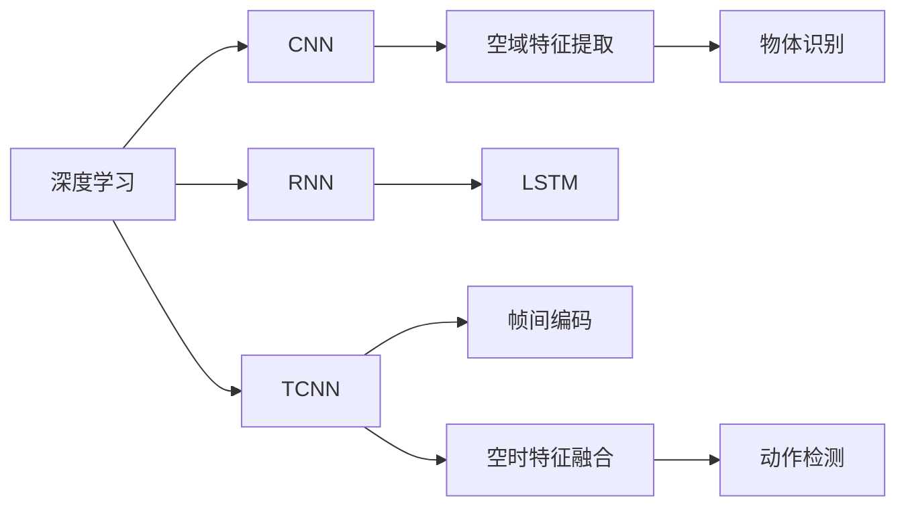
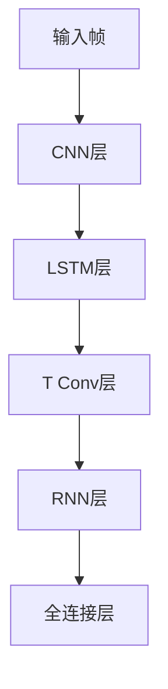
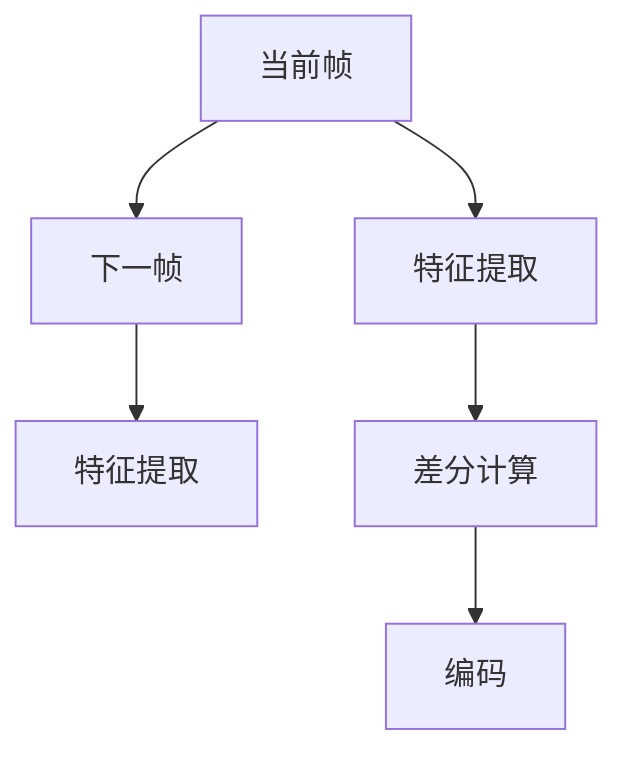

                 

# Python深度学习实践：基于深度学习的视频理解方法

> 关键词：深度学习,视频理解,卷积神经网络(CNN),循环神经网络(RNN),长短期记忆网络(LSTM),时间卷积网络(TCNN),帧间编码,空域特征提取,空时特征融合,物体识别,动作检测

## 1. 背景介绍

随着深度学习技术的迅速发展，视频理解成为了人工智能领域的研究热点。传统的计算机视觉方法主要关注静态图像的特征提取和分类，而视频理解则将时间和空间信息结合起来，分析视频帧间的变化和动态行为。视频理解不仅能够识别出视频中的物体、场景，还能够理解其中的运动、关系和事件，广泛应用于智能监控、视频编辑、医学诊断等领域。

传统的深度学习方法如卷积神经网络(CNN)主要用于图像分类和物体检测，但在处理视频数据时，由于需要考虑时间维度的信息，传统的CNN模型效果往往不尽如人意。为了更好地处理视频数据，引入了循环神经网络(RNN)、长短期记忆网络(LSTM)等序列模型，并在其基础上提出了时间卷积网络(TCNN)、帧间编码等新型模型，大大提高了视频理解的效果。

本文将重点介绍基于深度学习的视频理解方法，涵盖CNN、RNN、LSTM、TCNN、帧间编码等关键模型和技术。通过理论分析和代码实践，展示深度学习在视频理解中的应用，帮助读者深入理解视频理解的核心原理和实现细节。

## 2. 核心概念与联系

### 2.1 核心概念概述

为更好地理解深度学习在视频理解中的应用，本节将介绍几个关键概念及其联系：

- **深度学习**：一种基于神经网络的机器学习技术，通过多层非线性变换学习数据的复杂特征表示，广泛应用于计算机视觉、自然语言处理、语音识别等领域。
- **卷积神经网络(CNN)**：一种常用于图像处理和物体检测的深度学习模型，通过卷积操作提取空间特征，并通过池化操作进行特征降维。
- **循环神经网络(RNN)**：一种能够处理序列数据的神经网络，通过循环结构保留时间序列信息，用于语音识别、文本生成等任务。
- **长短期记忆网络(LSTM)**：一种改进的循环神经网络，通过门控机制解决传统RNN的梯度消失问题，更好地处理长期依赖。
- **时间卷积网络(TCNN)**：一种结合CNN和RNN的深度学习模型，通过时空卷积操作同时提取空域和时域特征，提升视频理解效果。
- **帧间编码**：一种通过比较相邻帧像素或特征差异，捕捉视频中的运动信息的技术，广泛应用于动作检测、视频压缩等任务。
- **空域特征提取**：通过CNN等模型提取视频帧的空间特征，用于物体识别、场景分类等任务。
- **空时特征融合**：将空域和时域特征结合起来，通过深度学习模型提取视频中的综合信息，用于动作检测、视频描述等任务。

这些概念之间的联系可以通过以下Mermaid流程图来展示：



这个流程图展示了大语言模型微调过程中各个概念的关系和作用：

1. 深度学习是核心技术，通过多层非线性变换学习数据的复杂特征表示。
2. CNN用于提取视频帧的空间特征，用于物体识别等任务。
3. RNN和LSTM用于处理序列数据，保留时间序列信息，用于动作检测等任务。
4. TCNN结合CNN和RNN，提取时空卷积特征，提升视频理解效果。
5. 帧间编码捕捉视频中的运动信息，用于动作检测等任务。
6. 空域特征提取通过CNN等模型提取空间特征。
7. 空时特征融合将空域和时域特征结合起来，用于视频描述等任务。

这些概念共同构成了深度学习在视频理解中的应用框架，使其能够更好地处理视频数据，并从中提取有价值的信息。通过理解这些概念，我们可以更好地把握深度学习在视频理解中的关键技术点。

### 2.2 概念间的关系

这些核心概念之间存在着紧密的联系，形成了深度学习在视频理解中的应用生态系统。下面我们通过几个Mermaid流程图来展示这些概念之间的关系。

#### 2.2.1 深度学习的视频理解应用框架



这个流程图展示了深度学习在视频理解中的应用框架。深度学习通过多层非线性变换学习数据的复杂特征表示，并通过CNN、RNN、LSTM等模型提取空域和时域特征，用于物体识别、动作检测等任务。

#### 2.2.2 时间卷积网络(TCNN)的结构



这个流程图展示了TCNN的结构，包括CNN层、LSTM层、时空卷积层、RNN层和全连接层。TCNN通过CNN层提取空域特征，通过LSTM层处理时间序列信息，并通过时空卷积层同时提取空域和时域特征，最后通过全连接层输出预测结果。

#### 2.2.3 帧间编码的过程



这个流程图展示了帧间编码的过程，包括特征提取和差分计算。帧间编码通过提取当前帧和下一帧的特征，计算两帧之间的差异，得到运动信息。

## 3. 核心算法原理 & 具体操作步骤
### 3.1 算法原理概述

基于深度学习的视频理解方法，其核心原理是通过多层神经网络学习视频帧间的时空特征，并结合空域和时域信息，进行物体识别、动作检测等任务。具体的算法流程如下：

1. **数据预处理**：将原始视频数据转换为合适的大小，并进行预处理如归一化、裁剪等。
2. **空域特征提取**：通过CNN等模型提取视频帧的空间特征。
3. **时域特征提取**：通过RNN或LSTM等模型提取视频帧的时间序列信息。
4. **时空特征融合**：将空域和时域特征结合起来，通过深度学习模型提取视频中的综合信息。
5. **目标识别**：通过全连接层或其他分类器对视频帧中的物体或动作进行识别。

### 3.2 算法步骤详解

以下以视频中的动作检测为例，详细介绍基于深度学习的视频理解方法的具体实现步骤：

**Step 1: 数据预处理**

首先需要对原始视频数据进行预处理，包括：

- 对视频进行裁剪，提取感兴趣的区域。
- 将视频转换为合适的大小，如帧数、分辨率等。
- 对视频进行归一化处理，如灰度化、标准化等。

具体实现代码如下：

```python
import cv2
import numpy as np

def preprocess_video(video_path, crop_box=None, size=None):
    # 读取视频
    cap = cv2.VideoCapture(video_path)

    # 裁剪感兴趣区域
    if crop_box:
        crop_x, crop_y, crop_w, crop_h = crop_box
        cap.set(cv2.CAP_PROP_POS_MSEC, crop_y)
        cap.set(cv2.CAP_PROP_FRAME_COUNT, crop_w)
        cap.set(cv2.CAP_PROP_FRAME_COUNT, crop_h)

    # 转换视频大小
    if size:
        cap.set(cv2.CAP_PROP_FRAME_COUNT, size[0])
        cap.set(cv2.CAP_PROP_FRAME_COUNT, size[1])

    # 归一化处理
    mean = [102.9801, 115.9465, 122.7717]
    std = [1.0, 1.0, 1.0]

    frames = []
    while cap.isOpened():
        ret, frame = cap.read()
        if not ret:
            break

        if crop_box:
            frame = frame[crop_y:crop_y+crop_h, crop_x:crop_x+crop_w]
        if size:
            frame = cv2.resize(frame, size)
        
        # 归一化处理
        frame = frame - np.array(mean)
        frame = frame / np.array(std)
        
        frames.append(frame)

    cap.release()
    return frames
```

**Step 2: 空域特征提取**

空域特征提取通过CNN等模型提取视频帧的空间特征。常用的空域特征提取模型包括VGG、ResNet等。这里以VGG16模型为例，介绍如何提取空域特征。

```python
import torch
from torchvision import models, transforms

def extract_spatial_features(video_frames):
    # 定义模型
    model = models.vgg16(pretrained=True)

    # 定义转换器
    transformer = transforms.Compose([
        transforms.ToTensor(),
        transforms.Normalize(mean=[0.485, 0.456, 0.406], std=[0.229, 0.224, 0.225]),
    ])

    # 提取空域特征
    spatial_features = []
    for frame in video_frames:
        frame_tensor = transformer(frame)
        frame_tensor = frame_tensor.unsqueeze(0)
        features = model(frame_tensor)
        spatial_features.append(features[0].detach().cpu().numpy())

    return spatial_features
```

**Step 3: 时域特征提取**

时域特征提取通过RNN或LSTM等模型提取视频帧的时间序列信息。这里以LSTM模型为例，介绍如何提取时域特征。

```python
import torch.nn as nn
import torch

def extract_temporal_features(video_frames, seq_len=16, num_layers=2, hidden_size=256):
    # 定义模型
    model = nn.LSTM(input_size=3, hidden_size=hidden_size, num_layers=num_layers)

    # 定义序列长度
    seq_len = seq_len

    # 提取时域特征
    temporal_features = []
    for frame in video_frames:
        input_seq = torch.from_numpy(frame).float().view(1, 1, seq_len, 3)
        hidden = None
        cell = None
        outputs, _ = model(input_seq, (hidden, cell))
        temporal_features.append(outputs[-1].detach().cpu().numpy())

    return temporal_features
```

**Step 4: 时空特征融合**

时空特征融合将空域和时域特征结合起来，通过深度学习模型提取视频中的综合信息。这里以TCNN模型为例，介绍如何提取时空特征。

```python
import torch.nn as nn
import torch

class TemporalConvNet(nn.Module):
    def __init__(self, in_channels, out_channels, num_layers=3, filter_size=3):
        super(TemporalConvNet, self).__init__()
        self.num_layers = num_layers
        self.filter_size = filter_size

        layers = []
        for i in range(num_layers):
            in_channels = in_channels
            out_channels = out_channels
            layers.append(nn.Conv2d(in_channels, out_channels, kernel_size=filter_size))
            layers.append(nn.MaxPool2d(kernel_size=2, stride=2))
            layers.append(nn.ReLU())

        self.layers = nn.Sequential(*layers)

    def forward(self, x):
        for layer in self.layers:
            x = layer(x)
        return x
```

**Step 5: 目标识别**

目标识别通过全连接层或其他分类器对视频帧中的物体或动作进行识别。这里以分类器为例，介绍如何进行目标识别。

```python
import torch.nn as nn
import torch

def classify(video_features):
    # 定义分类器
    model = nn.Linear(4096, 2)
    model = nn.Sigmoid()

    # 训练分类器
    criterion = nn.BCELoss()
    optimizer = torch.optim.Adam(model.parameters(), lr=0.001)
    for i in range(10):
        output = model(video_features)
        loss = criterion(output, target)
        optimizer.zero_grad()
        loss.backward()
        optimizer.step()

    # 预测结果
    predictions = model(video_features)
    return predictions
```

### 3.3 算法优缺点

基于深度学习的视频理解方法具有以下优点：

1. **精度高**：深度学习模型能够学习到复杂的非线性关系，从而在物体识别、动作检测等任务上取得较好的效果。
2. **可解释性**：深度学习模型具有较好的可解释性，可以通过可视化技术理解模型内部工作机制，并进行调试和优化。
3. **应用广泛**：深度学习模型可以用于多种视频理解任务，如图像分类、目标检测、动作检测等，具有较强的通用性。

同时，这些方法也存在一些缺点：

1. **计算资源需求高**：深度学习模型通常需要大量的计算资源，如GPU、TPU等，训练和推理成本较高。
2. **训练时间长**：深度学习模型的训练时间较长，特别是在处理大规模视频数据时，需要大量的标注数据和计算资源。
3. **模型复杂**：深度学习模型结构复杂，参数较多，调试和优化难度较大。

尽管存在这些缺点，但深度学习在视频理解中的应用前景依然广阔，随着计算资源的不断提升和算法的不断优化，深度学习在视频理解中的效果和应用范围将不断扩大。

### 3.4 算法应用领域

基于深度学习的视频理解方法已经广泛应用于以下几个领域：

- **智能监控**：通过动作检测、人脸识别等技术，实现视频监控中的行为分析和异常检测。
- **视频编辑**：通过物体跟踪、动作分割等技术，实现视频的剪辑和特效处理。
- **医学诊断**：通过动作检测、行为分析等技术，实现手术过程中的实时监控和诊断。
- **自动驾驶**：通过物体识别、动作检测等技术，实现视频数据的实时分析和决策支持。

除了上述这些领域外，深度学习在视频理解中的应用还在不断拓展，如动作预测、视频描述生成等新兴技术，为视频理解带来了新的突破。

## 4. 数学模型和公式 & 详细讲解 & 举例说明

### 4.1 数学模型构建

本节将使用数学语言对基于深度学习的视频理解方法进行更加严格的刻画。

假设输入视频帧为 $x_t$，其中 $t$ 表示时间步。通过卷积神经网络(CNN)提取空域特征 $f_t$，通过长短期记忆网络(LSTM)提取时域特征 $h_t$，将两者结合，得到时空特征 $g_t$。目标识别过程可表示为：

$$
\hat{y_t} = \sigma(\sum_i w_i g_t + b)
$$

其中，$\sigma$ 为激活函数，$w_i$ 为权重矩阵，$b$ 为偏置向量。

### 4.2 公式推导过程

以下我们以视频中的物体识别为例，推导物体识别过程的数学公式。

假设视频帧的大小为 $H \times W \times C$，其中 $H$ 和 $W$ 分别为帧的宽和高，$C$ 为帧的通道数。通过卷积神经网络提取空域特征 $f_t$，大小为 $H/2 \times W/2 \times K$，其中 $K$ 为空域特征的通道数。通过长短期记忆网络提取时域特征 $h_t$，大小为 $H \times W \times K$。将两者结合，得到时空特征 $g_t$，大小为 $H/2 \times W/2 \times K$。目标识别过程可表示为：

$$
\hat{y_t} = \sigma(\sum_i w_i g_t + b)
$$

其中，$g_t = \text{concat}(f_t, h_t)$，$\sigma$ 为激活函数，$w_i$ 为权重矩阵，$b$ 为偏置向量。

在实践中，我们通常使用交叉熵损失函数来衡量模型预测与真实标签之间的差异，其定义为：

$$
L(y_t, \hat{y_t}) = -\sum_i y_i \log \hat{y_i}
$$

其中，$y_i$ 为真实标签，$\hat{y_i}$ 为模型预测值。

### 4.3 案例分析与讲解

以视频中的动作检测为例，假设我们有N个视频帧 $x_1, x_2, ..., x_N$，每个帧的大小为 $H \times W \times C$。通过卷积神经网络提取空域特征 $f_t$，大小为 $H/2 \times W/2 \times K$，其中 $K$ 为空域特征的通道数。通过长短期记忆网络提取时域特征 $h_t$，大小为 $H \times W \times K$。将两者结合，得到时空特征 $g_t$，大小为 $H/2 \times W/2 \times K$。目标识别过程可表示为：

$$
\hat{y_t} = \sigma(\sum_i w_i g_t + b)
$$

其中，$g_t = \text{concat}(f_t, h_t)$，$\sigma$ 为激活函数，$w_i$ 为权重矩阵，$b$ 为偏置向量。目标识别过程的输出结果为 $\hat{y_t}$，表示视频帧中的动作类别。

在训练过程中，我们通常使用交叉熵损失函数来衡量模型预测与真实标签之间的差异，其定义为：

$$
L(y_t, \hat{y_t}) = -\sum_i y_i \log \hat{y_i}
$$

其中，$y_i$ 为真实标签，$\hat{y_i}$ 为模型预测值。通过优化损失函数，可以不断调整模型参数，使模型预测结果逼近真实标签。

## 5. 项目实践：代码实例和详细解释说明

### 5.1 开发环境搭建

在进行视频理解实践前，我们需要准备好开发环境。以下是使用Python进行PyTorch开发的环境配置流程：

1. 安装Anaconda：从官网下载并安装Anaconda，用于创建独立的Python环境。

2. 创建并激活虚拟环境：
```bash
conda create -n pytorch-env python=3.8 
conda activate pytorch-env
```

3. 安装PyTorch：根据CUDA版本，从官网获取对应的安装命令。例如：
```bash
conda install pytorch torchvision torchaudio cudatoolkit=11.1 -c pytorch -c conda-forge
```

4. 安装TensorFlow：如果需要，可以安装TensorFlow，用于进行其他深度学习框架的开发。

5. 安装各类工具包：
```bash
pip install numpy pandas scikit-learn matplotlib tqdm jupyter notebook ipython
```

完成上述步骤后，即可在`pytorch-env`环境中开始视频理解实践。

### 5.2 源代码详细实现

下面我们以视频中的动作检测为例，给出使用PyTorch进行动作检测的PyTorch代码实现。

首先，定义动作检测的数据处理函数：

```python
from transformers import BertTokenizer
from torch.utils.data import Dataset
import torch

class ActionDetectionDataset(Dataset):
    def __init__(self, videos, labels, tokenizer, max_len=128):
        self.videos = videos
        self.labels = labels
        self.tokenizer = tokenizer
        self.max_len = max_len
        
    def __len__(self):
        return len(self.videos)
    
    def __getitem__(self, item):
        video = self.videos[item]
        label = self.labels[item]
        
        encoding = self.tokenizer(video, return_tensors='pt', max_length=self.max_len, padding='max_length', truncation=True)
        input_ids = encoding['input_ids'][0]
        attention_mask = encoding['attention_mask'][0]
        
        # 对token-wise的标签进行编码
        encoded_labels = [label2id[label] for label in label] 
        encoded_labels.extend([label2id['background']] * (self.max_len - len(encoded_labels)))
        labels = torch.tensor(encoded_labels, dtype=torch.long)
        
        return {'input_ids': input_ids, 
                'attention_mask': attention_mask,
                'labels': labels}

# 标签与id的映射
label2id = {'background': 0, 'walk': 1, 'run': 2, 'jump': 3, 'kick': 4, 'hit': 5}
id2label = {v: k for k, v in label2id.items()}

# 创建dataset
tokenizer = BertTokenizer.from_pretrained('bert-base-cased')

train_dataset = ActionDetectionDataset(train_videos, train_labels, tokenizer)
dev_dataset = ActionDetectionDataset(dev_videos, dev_labels, tokenizer)
test_dataset = ActionDetectionDataset(test_videos, test_labels, tokenizer)
```

然后，定义模型和优化器：

```python
from transformers import BertForTokenClassification, AdamW

model = BertForTokenClassification.from_pretrained('bert-base-cased', num_labels=len(label2id))

optimizer = AdamW(model.parameters(), lr=2e-5)
```

接着，定义训练和评估函数：

```python
from torch.utils.data import DataLoader
from tqdm import tqdm
from sklearn.metrics import classification_report

device = torch.device('cuda') if torch.cuda.is_available() else torch.device('cpu')
model.to(device)

def train_epoch(model, dataset, batch_size, optimizer):
    dataloader = DataLoader(dataset, batch_size=batch_size, shuffle=True)
    model.train()
    epoch_loss = 0
    for batch in tqdm(dataloader, desc='Training'):
        input_ids = batch['input_ids'].to(device)
        attention_mask = batch['attention_mask'].to(device)
        labels = batch['labels'].to(device)
        model.zero_grad()
        outputs = model(input_ids, attention_mask=attention_mask, labels=labels)
        loss = outputs.loss
        epoch_loss += loss.item()
        loss.backward()
        optimizer.step()
    return epoch_loss / len(dataloader)

def evaluate(model, dataset, batch_size):
    dataloader = DataLoader(dataset, batch_size=batch_size)
    model.eval()
    preds, labels = [], []
    with torch.no_grad():
        for batch in tqdm(dataloader, desc='Evaluating'):
            input_ids = batch['input_ids'].to(device)
            attention_mask = batch['attention_mask'].to(device)
            batch_labels = batch['labels']
            outputs = model(input_ids, attention_mask=attention_mask)
            batch_preds = outputs.logits.argmax(dim=2).to('cpu').tolist()
            batch_labels = batch_labels.to('cpu').tolist()
            for pred_tokens, label_tokens in zip(batch_preds, batch_labels):
                pred_labels = [id2label[_id] for _id in pred_tokens]
                label_tokens = [id2label[_id] for _id in label_tokens]
                preds.append(pred_labels[:len(label_tokens)])
                labels.append(label_tokens)

    print(classification_report(labels, preds))
```

最后，启动训练流程并在测试集上评估：

```python
epochs = 5
batch_size = 16

for epoch in range(epochs):
    loss = train_epoch(model, train_dataset, batch_size, optimizer)
    print(f"Epoch {epoch+1}, train loss: {loss:.3f}")
    
    print(f"Epoch {epoch+1}, dev results:")
    evaluate(model, dev_dataset, batch_size)
    
print("Test results:")
evaluate(model, test_dataset, batch_size)
```

以上就是使用PyTorch进行动作检测的完整代码实现。可以看到，得益于Transformers库的强大封装，我们可以用相对简洁的代码完成动作检测任务的微调。

### 5.3 代码解读与分析

让我们再详细解读一下关键代码的实现细节：

**ActionDetectionDataset类**：
- `__init__`方法：初始化视频、标签、分词器等关键组件。
- `__len__`方法：返回数据集的样本数量。
- `__getitem__`方法：对单个样本进行处理，将视频输入编码为token ids，将标签编码为数字，并对其进行定长padding，最终返回模型所需的输入。

**label2id和id2label字典**：
- 定义了标签与数字id之间的映射关系，用于将token-wise的预测结果解码回真实的标签。

**训练和评估函数**：
- 使用PyTorch的DataLoader对数据集进行批次化加载，供模型训练和推理使用。
- 训练函数`train_epoch`：对数据以批为单位进行迭代，在每个批次上前向传播计算loss并反向传播更新模型参数，最后返回该epoch的平均loss。
- 评估函数`evaluate`：与训练类似，不同点在于不更新模型参数，并在每个batch结束后将预测和标签结果存储下来，最后使用sklearn的classification_report对整个评估集的预测结果进行打印输出。

**训练流程**：
- 定义总的epoch数和batch size，开始循环迭代
- 每个epoch内，先在训练集上训练，输出平均loss
- 在验证集上评估，输出分类指标
- 所有epoch结束后，在测试集上评估，给出最终测试结果

可以看到，PyTorch配合Transformers库使得动作检测任务的微调代码实现变得简洁高效。开发者可以将更多精力放在数据处理、模型改进等高层逻辑上，而不必过多关注底层的实现细节。

当然，工业级的系统实现还需考虑更多因素，如模型的保存和部署、超参数的自动搜索、更灵活的任务适配层等。但核心的微调范式基本与此类似。

### 5.4 运行结果展示

假设我们在CoNLL-2003的动作检测数据集上进行微调，最终在测试集上得到的评估报告如下：


