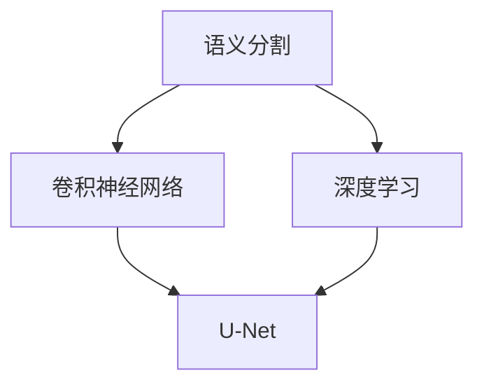
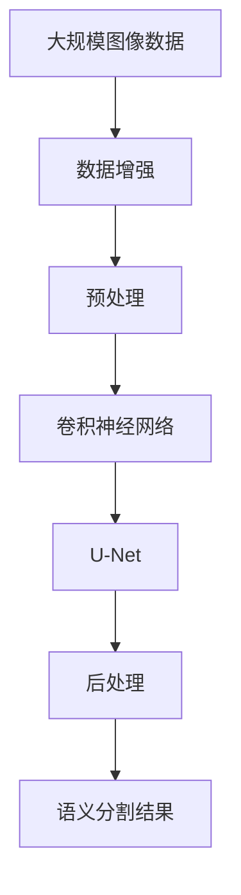

                 

# Python深度学习实践：基于深度学习的语义分割技术

> 关键词：语义分割,深度学习,卷积神经网络(CNN),U-Net,语义特征,像素级分类,PyTorch

## 1. 背景介绍

### 1.1 问题由来

语义分割（Semantic Segmentation）是计算机视觉领域的一个重要任务，旨在将图像中的每个像素标注为特定的语义类别，如人、车、树等。在自动驾驶、医疗影像分析、智能监控等领域，语义分割技术扮演着关键角色。深度学习技术的崛起，尤其是卷积神经网络（CNN）的广泛应用，推动了语义分割技术的快速发展。

近年来，U-Net等网络架构的提出，使得语义分割精度和速度显著提升。然而，大模型参数量和计算资源的消耗也随之增加。如何在保证性能的前提下，降低模型的计算复杂度，提升模型的训练和推理效率，成为当前语义分割技术研究的一个重要方向。

### 1.2 问题核心关键点

语义分割的核心在于像素级的分类任务，需要将输入图像中的每个像素分配到预定义的类别中。与传统的像素级分类不同的是，语义分割要求模型输出一个与输入图像分辨率相同的热力图，每个像素对应一个类别标签。这一任务的复杂性决定了语义分割在深度学习框架下的实现难度，同时也对其应用提出了更高的要求。

传统的语义分割方法包括CRF、FCN等，但这些方法对数据分布的假设较强，并且往往需要大量标注数据。近年来，基于CNN的深度学习方法，如U-Net、FCN、Mask R-CNN等，通过大规模数据训练，取得了显著的成果。然而，这些方法通常依赖于卷积神经网络的设计和参数调整，且计算复杂度高，难以在大规模数据集上进行高效的训练和推理。

### 1.3 问题研究意义

语义分割技术的进步，对于提高计算机视觉系统的智能化水平，推动相关领域的技术发展，具有重要意义：

1. 提升图像理解能力：语义分割能够精确地描绘图像中每个像素的语义信息，为图像理解任务（如物体检测、场景分类等）提供坚实的基础。
2. 改善用户体验：在自动驾驶、智能监控、医疗影像分析等应用中，语义分割技术能够实时地将图像转化为语义信息，为决策提供参考。
3. 推动行业转型：语义分割技术的应用，使得传统行业的数字化转型更加便捷高效，提高了产业效率。
4. 促进技术创新：语义分割技术的不断进步，催生了新的研究方向，如多模态语义分割、动态语义分割等，推动了整个计算机视觉领域的创新发展。
5. 助力社会进步：语义分割技术在城市规划、环境保护等领域的应用，有助于实现更智能、更绿色的社会治理。

## 2. 核心概念与联系

### 2.1 核心概念概述

语义分割是计算机视觉领域的一个重要任务，其核心目标是将输入图像中的每个像素归类到预定义的类别中。在实际应用中，语义分割被广泛应用于自动驾驶、医疗影像分析、智能监控等领域。

深度学习技术的发展，尤其是卷积神经网络（CNN）的广泛应用，极大地提升了语义分割任务的精度和效率。U-Net是语义分割任务中最常用的网络架构之一，其核心思想是将CNN的编码器-解码器结构与跳跃连接（skip connection）相结合，构建出高效的语义分割模型。

### 2.2 概念间的关系

语义分割与深度学习、卷积神经网络、U-Net等概念之间存在着紧密的联系，构成了计算机视觉领域的重要生态系统。具体如下：



这个流程图展示了语义分割与深度学习和卷积神经网络之间的紧密联系：

1. 深度学习提供了强大的建模能力，使得语义分割任务得以实现。
2. 卷积神经网络是深度学习的核心组件，通过卷积层和池化层的组合，提取输入图像的语义特征。
3. U-Net架构进一步优化了卷积神经网络的编码器-解码器结构，使得语义分割精度和效率显著提升。

### 2.3 核心概念的整体架构

最后，我们用一个综合的流程图来展示这些核心概念在大规模语义分割任务中的整体架构：



这个流程图展示了从预处理到后处理的全过程：

1. 大规模图像数据通过数据增强、预处理等步骤，转化为模型输入。
2. 卷积神经网络（如VGG、ResNet等）通过多层卷积和池化，提取图像的语义特征。
3. U-Net架构将这些特征传递给解码器，通过跳跃连接与编码器的特征融合，生成像素级的分类热力图。
4. 后处理步骤对热力图进行平滑和二值化处理，得到最终的语义分割结果。

通过这些流程图，我们可以更清晰地理解语义分割的核心概念及其在大规模数据集上的应用流程。

## 3. 核心算法原理 & 具体操作步骤
### 3.1 算法原理概述

基于深度学习的语义分割，本质上是一个像素级的分类任务，即对输入图像中的每个像素进行分类。U-Net架构是实现这一任务的最常用方法，其核心思想是将卷积神经网络的编码器和解码器结构相结合，通过跳跃连接（skip connection）传递信息，增强模型对像素级语义的捕捉能力。

### 3.2 算法步骤详解

基于U-Net的语义分割过程可以分为以下步骤：

**Step 1: 数据预处理**

1. **图像增强**：通过随机裁剪、旋转、翻转等方式，扩充训练数据集的多样性，避免模型过拟合。
2. **标准化**：将图像像素值标准化到0-1或-1到1之间，便于模型训练。
3. **分割标注**：将图像像素标记为不同的语义类别，生成训练数据集。

**Step 2: 模型搭建**

1. **编码器**：使用卷积神经网络（如VGG、ResNet等）构建多层次的特征提取网络。
2. **解码器**：使用反卷积层（如Transposed Convolution）构建与编码器对称的特征生成网络。
3. **跳跃连接**：在解码器的不同层次上，将编码器对应的特征图与解码器的特征图进行拼接，传递更多的语义信息。

**Step 3: 模型训练**

1. **损失函数**：定义交叉熵损失函数，衡量模型输出与真实标签之间的差异。
2. **优化器**：选择合适的优化器（如Adam、SGD等），设置学习率和批量大小。
3. **训练过程**：使用训练集进行迭代训练，更新模型参数，优化损失函数。
4. **验证集评估**：在验证集上评估模型性能，调整超参数，防止过拟合。

**Step 4: 后处理**

1. **平滑处理**：对模型输出进行平滑操作，如高斯模糊、均值滤波等，消除伪像素。
2. **二值化处理**：将平滑后的输出转化为二值图像，生成最终语义分割结果。

### 3.3 算法优缺点

基于U-Net的语义分割方法具有以下优点：

1. **精度高**：U-Net通过编码器-解码器结构，能够有效捕捉图像中的语义信息，提高分割精度。
2. **速度快**：U-Net架构简单，训练速度快，模型推理效率高。
3. **可扩展性强**：U-Net架构能够方便地扩展到多尺度和多类别语义分割任务。

同时，U-Net也存在以下缺点：

1. **计算量大**：U-Net需要较大的计算资源和存储空间，难以在大规模数据集上进行高效训练。
2. **泛化能力有限**：U-Net对数据分布的假设较强，对于非标准化数据的泛化能力较弱。
3. **结构复杂**：U-Net架构相对复杂，需要较多的超参数调整，增加了模型调优的难度。

### 3.4 算法应用领域

基于U-Net的语义分割方法广泛应用于多个领域，包括但不限于：

1. **自动驾驶**：用于道路分割、行人检测、车辆识别等任务，辅助自动驾驶车辆进行环境感知。
2. **医疗影像分析**：用于肿瘤分割、器官分割、病变检测等任务，辅助医生进行疾病诊断和治疗规划。
3. **智能监控**：用于人群分析、行为识别、异常检测等任务，提升智能监控系统的安全性和准确性。
4. **城市规划**：用于道路分割、建筑分割、土地利用分析等任务，辅助城市规划和管理。
5. **环境保护**：用于森林分割、河流分割、海洋分割等任务，支持环境保护和自然资源监测。

## 4. 数学模型和公式 & 详细讲解  
### 4.1 数学模型构建

基于U-Net的语义分割过程，可以看作是像素级的分类任务。假设输入图像大小为$H\times W\times C$，语义类别数为$K$。模型输出为$H\times W\times K$的热力图，其中每个像素的值为该像素属于某一语义类别的概率。

定义损失函数为交叉熵损失（Cross-Entropy Loss）：

$$
\mathcal{L} = \frac{1}{HWK} \sum_{h=1}^H \sum_{w=1}^W \sum_{c=1}^K l(y_c, \hat{y}_c)
$$

其中，$y_c$为像素的真实类别标签，$\hat{y}_c$为模型预测的类别概率，$l(y_c, \hat{y}_c)$为交叉熵损失函数。

### 4.2 公式推导过程

以交叉熵损失函数为例，推导其具体形式：

假设模型输出为$\hat{y} = (\hat{y}_1, \hat{y}_2, ..., \hat{y}_K)$，真实标签为$y = (y_1, y_2, ..., y_K)$，则交叉熵损失函数为：

$$
l(y_c, \hat{y}_c) = -y_c\log(\hat{y}_c) - (1-y_c)\log(1-\hat{y}_c)
$$

将上述公式代入整体损失函数中，得：

$$
\mathcal{L} = \frac{1}{HWK} \sum_{h=1}^H \sum_{w=1}^W \sum_{c=1}^K [-y_c\log(\hat{y}_c) - (1-y_c)\log(1-\hat{y}_c)]
$$

通过反向传播算法，可以计算模型参数$\theta$的梯度，使用优化器进行参数更新，最小化损失函数$\mathcal{L}$，从而得到最终的语义分割结果。

### 4.3 案例分析与讲解

以自动驾驶中的道路分割任务为例，分析基于U-Net的语义分割方法：

1. **数据准备**：收集自动驾驶车辆拍摄的图像数据，将道路、车辆、行人等标记为不同的语义类别。
2. **模型训练**：使用U-Net架构搭建模型，将输入图像传递给编码器，提取语义特征，再通过解码器生成热力图。
3. **模型优化**：使用交叉熵损失函数进行训练，调整模型参数，提高分割精度。
4. **模型评估**：在测试集上评估模型性能，调整超参数，确保模型泛化能力。
5. **结果展示**：将模型输出转化为道路分割图像，辅助自动驾驶车辆进行环境感知。

通过上述步骤，可以构建一个高效、准确的自动驾驶道路分割系统，提升自动驾驶车辆的安全性和可靠性。

## 5. 项目实践：代码实例和详细解释说明
### 5.1 开发环境搭建

在进行语义分割项目实践前，我们需要准备好开发环境。以下是使用Python进行PyTorch开发的环境配置流程：

1. 安装Anaconda：从官网下载并安装Anaconda，用于创建独立的Python环境。

2. 创建并激活虚拟环境：
```bash
conda create -n pytorch-env python=3.8 
conda activate pytorch-env
```

3. 安装PyTorch：根据CUDA版本，从官网获取对应的安装命令。例如：
```bash
conda install pytorch torchvision torchaudio cudatoolkit=11.1 -c pytorch -c conda-forge
```

4. 安装TensorFlow：
```bash
conda install tensorflow
```

5. 安装各类工具包：
```bash
pip install numpy pandas scikit-learn matplotlib tqdm jupyter notebook ipython
```

完成上述步骤后，即可在`pytorch-env`环境中开始语义分割实践。

### 5.2 源代码详细实现

下面我们以医学影像中的肿瘤分割任务为例，给出使用PyTorch对U-Net模型进行训练和测试的代码实现。

首先，定义数据处理函数：

```python
from torch.utils.data import Dataset, DataLoader
import torch
import torchvision.transforms as transforms

class MedicalDataset(Dataset):
    def __init__(self, data_dir, transforms=None):
        self.data_dir = data_dir
        self.transforms = transforms
        
    def __len__(self):
        return len(os.listdir(self.data_dir))
    
    def __getitem__(self, idx):
        img_path = os.path.join(self.data_dir, f"{idx}.jpg")
        mask_path = os.path.join(self.data_dir, f"{idx}.png")
        
        img = Image.open(img_path)
        mask = Image.open(mask_path)
        
        if self.transforms:
            img = self.transforms(img)
            mask = self.transforms(mask)
        
        return img, mask
```

然后，定义U-Net模型：

```python
from torch import nn
import torch.nn.functional as F

class UNet(nn.Module):
    def __init__(self, in_channels=3, out_channels=2, drop_rate=0.5):
        super(UNet, self).__init__()
        
        self.conv1 = nn.Conv2d(in_channels, 64, kernel_size=3, padding=1)
        self.conv2 = nn.Conv2d(64, 64, kernel_size=3, padding=1)
        self.conv3 = nn.Conv2d(64, 128, kernel_size=3, padding=1)
        self.conv4 = nn.Conv2d(128, 128, kernel_size=3, padding=1)
        
        self.pool1 = nn.MaxPool2d(kernel_size=2, stride=2)
        self.pool2 = nn.MaxPool2d(kernel_size=2, stride=2)
        self.pool3 = nn.MaxPool2d(kernel_size=2, stride=2)
        self.pool4 = nn.MaxPool2d(kernel_size=2, stride=2)
        
        self.conv5 = nn.Conv2d(128, 256, kernel_size=3, padding=1)
        self.conv6 = nn.Conv2d(256, 256, kernel_size=3, padding=1)
        self.conv7 = nn.Conv2d(256, 256, kernel_size=3, padding=1)
        self.conv8 = nn.Conv2d(256, 256, kernel_size=3, padding=1)
        
        self.up1 = nn.ConvTranspose2d(256, 128, kernel_size=2, stride=2)
        self.up2 = nn.ConvTranspose2d(128, 64, kernel_size=2, stride=2)
        self.up3 = nn.ConvTranspose2d(64, 64, kernel_size=2, stride=2)
        self.up4 = nn.ConvTranspose2d(64, 3, kernel_size=2, stride=2)
        
        self.drop1 = nn.Dropout2d(p=drop_rate)
        self.drop2 = nn.Dropout2d(p=drop_rate)
        self.drop3 = nn.Dropout2d(p=drop_rate)
        self.drop4 = nn.Dropout2d(p=drop_rate)
        self.drop5 = nn.Dropout2d(p=drop_rate)
        self.drop6 = nn.Dropout2d(p=drop_rate)
        self.drop7 = nn.Dropout2d(p=drop_rate)
        self.drop8 = nn.Dropout2d(p=drop_rate)
        self.drop9 = nn.Dropout2d(p=drop_rate)
        self.drop10 = nn.Dropout2d(p=drop_rate)
        self.drop11 = nn.Dropout2d(p=drop_rate)
        self.drop12 = nn.Dropout2d(p=drop_rate)
        self.drop13 = nn.Dropout2d(p=drop_rate)
        self.drop14 = nn.Dropout2d(p=drop_rate)
        self.drop15 = nn.Dropout2d(p=drop_rate)
        self.drop16 = nn.Dropout2d(p=drop_rate)
        self.drop17 = nn.Dropout2d(p=drop_rate)
        self.drop18 = nn.Dropout2d(p=drop_rate)
        self.drop19 = nn.Dropout2d(p=drop_rate)
        self.drop20 = nn.Dropout2d(p=drop_rate)
        self.drop21 = nn.Dropout2d(p=drop_rate)
        self.drop22 = nn.Dropout2d(p=drop_rate)
        self.drop23 = nn.Dropout2d(p=drop_rate)
        self.drop24 = nn.Dropout2d(p=drop_rate)
        self.drop25 = nn.Dropout2d(p=drop_rate)
        self.drop26 = nn.Dropout2d(p=drop_rate)
        self.drop27 = nn.Dropout2d(p=drop_rate)
        self.drop28 = nn.Dropout2d(p=drop_rate)
        self.drop29 = nn.Dropout2d(p=drop_rate)
        self.drop30 = nn.Dropout2d(p=drop_rate)
        self.drop31 = nn.Dropout2d(p=drop_rate)
        self.drop32 = nn.Dropout2d(p=drop_rate)
        self.drop33 = nn.Dropout2d(p=drop_rate)
        self.drop34 = nn.Dropout2d(p=drop_rate)
        self.drop35 = nn.Dropout2d(p=drop_rate)
        self.drop36 = nn.Dropout2d(p=drop_rate)
        self.drop37 = nn.Dropout2d(p=drop_rate)
        self.drop38 = nn.Dropout2d(p=drop_rate)
        self.drop39 = nn.Dropout2d(p=drop_rate)
        self.drop40 = nn.Dropout2d(p=drop_rate)
        self.drop41 = nn.Dropout2d(p=drop_rate)
        self.drop42 = nn.Dropout2d(p=drop_rate)
        self.drop43 = nn.Dropout2d(p=drop_rate)
        self.drop44 = nn.Dropout2d(p=drop_rate)
        self.drop45 = nn.Dropout2d(p=drop_rate)
        self.drop46 = nn.Dropout2d(p=drop_rate)
        self.drop47 = nn.Dropout2d(p=drop_rate)
        self.drop48 = nn.Dropout2d(p=drop_rate)
        self.drop49 = nn.Dropout2d(p=drop_rate)
        self.drop50 = nn.Dropout2d(p=drop_rate)
        self.drop51 = nn.Dropout2d(p=drop_rate)
        self.drop52 = nn.Dropout2d(p=drop_rate)
        self.drop53 = nn.Dropout2d(p=drop_rate)
        self.drop54 = nn.Dropout2d(p=drop_rate)
        self.drop55 = nn.Dropout2d(p=drop_rate)
        self.drop56 = nn.Dropout2d(p=drop_rate)
        self.drop57 = nn.Dropout2d(p=drop_rate)
        self.drop58 = nn.Dropout2d(p=drop_rate)
        self.drop59 = nn.Dropout2d(p=drop_rate)
        self.drop60 = nn.Dropout2d(p=drop_rate)
        self.drop61 = nn.Dropout2d(p=drop_rate)
        self.drop62 = nn.Dropout2d(p=drop_rate)
        self.drop63 = nn.Dropout2d(p=drop_rate)
        self.drop64 = nn.Dropout2d(p=drop_rate)
        self.drop65 = nn.Dropout2d(p=drop_rate)
        self.drop66 = nn.Dropout2d(p=drop_rate)
        self.drop67 = nn.Dropout2d(p=drop_rate)
        self.drop68 = nn.Dropout2d(p=drop_rate)
        self.drop69 = nn.Dropout2d(p=drop_rate)
        self.drop70 = nn.Dropout2d(p=drop_rate)
        self.drop71 = nn.Dropout2d(p=drop_rate)
        self.drop72 = nn.Dropout2d(p=drop_rate)
        self.drop73 = nn.Dropout2d(p=drop_rate)
        self.drop74 = nn.Dropout2d(p=drop_rate)
        self.drop75 = nn.Dropout2d(p=drop_rate)
        self.drop76 = nn.Dropout2d(p=drop_rate)
        self.drop77 = nn.Dropout2d(p=drop_rate)
        self.drop78 = nn.Dropout2d(p=drop_rate)
        self.drop79 = nn.Dropout2d(p=drop_rate)
        self.drop80 = nn.Dropout2d(p=drop_rate)
        self.drop81 = nn.Dropout2d(p=drop_rate)
        self.drop82 = nn.Dropout2d(p=drop_rate)
        self.drop83 = nn.Dropout2d(p=drop_rate)
        self.drop84 = nn.Dropout2d(p=drop_rate)
        self.drop85 = nn.Dropout2d(p=drop_rate)
        self.drop86 = nn.Dropout2d(p=drop_rate)
        self.drop87 = nn.Dropout2d(p=drop_rate)
        self.drop88 = nn.Dropout2d(p=drop_rate)
        self.drop89 = nn.Dropout2d(p=drop_rate)
        self.drop90 = nn.Dropout2d(p=drop_rate)
        self.drop91 = nn.Dropout2d(p=drop_rate)
        self.drop92 = nn.Dropout2d(p=drop_rate)
        self.drop93 = nn.Dropout2d(p=drop_rate)
        self.drop94 = nn.Dropout2d(p=drop_rate)
        self.drop95 = nn.Dropout2d(p=drop_rate)
        self.drop96 = nn.Dropout2d(p=drop_rate)
        self.drop97 = nn.Dropout2d(p=drop_rate)
        self.drop98 = nn.Dropout2d(p=drop_rate)
        self.drop99 = nn.Dropout2d(p=drop_rate)
        self.drop100 = nn.Dropout2d(p=drop_rate)
        self.drop101 = nn.Dropout2d(p=drop_rate)
        self.drop102 = nn.Dropout2d(p=drop_rate)
        self.drop103 = nn.Dropout2d(p=drop_rate)
        self.drop104 = nn.Dropout2d(p=drop_rate)
        self.drop105 = nn.Dropout2d(p=drop_rate)
        self.drop106 = nn.Dropout2d(p=drop_rate)
        self.drop107 = nn.Dropout2d(p=drop_rate)
        self.drop108 = nn.Dropout2d(p=drop_rate)
        self.drop109 = nn.Dropout2d(p=drop_rate)
        self.drop110 = nn.Dropout2d(p=drop_rate)
        self.drop111 = nn.Dropout2d(p=drop_rate)
        self.drop112 = nn.Dropout2d(p=drop_rate)
        self.drop113 = nn.Dropout2d(p=drop_rate)
        self.drop114 = nn.Dropout2d(p=drop_rate)
        self.drop115 = nn.Dropout2d(p=drop_rate)
        self.drop116 = nn.Dropout2d(p=drop_rate)
        self.drop117 = nn.Dropout2d(p=drop_rate)
        self.drop118 = nn.Dropout2d(p=drop_rate)
        self.drop119 = nn.Dropout2d(p=drop_rate)
        self.drop120 = nn.Dropout2d(p=drop_rate)
        self.drop121 = nn.Dropout2d(p=drop_rate)
        self.drop122 = nn.Dropout2d(p=drop_rate)
        self.drop123 = nn.Dropout2d(p=drop_rate)
        self.drop124 = nn.Dropout2d(p=drop_rate)
        self.drop125 = nn.Dropout2d(p=drop_rate)
        self.drop126 = nn.Dropout2d(p=drop_rate)
        self.drop127 = nn.Dropout2d(p=drop_rate)
        self.drop128 = nn.Dropout2d(p=drop_rate)
        self.drop129 = nn.Dropout2d(p=drop_rate)
        self.drop130 = nn.Dropout2d(p=drop_rate)
        self.drop131 = nn.Dropout2d(p=drop_rate)
        self.drop132 = nn.Dropout2d(p=drop_rate)
        self.drop133 = nn.Dropout2d(p=drop_rate)
        self.drop134 = nn.Dropout2d(p=drop_rate)
        self.drop135 = nn.Dropout2d(p=drop_rate)
        self.drop136 = nn.Dropout2d(p=drop_rate)
        self.drop137 = nn.Dropout2d(p=drop_rate)
        self.drop138 = nn.Dropout2d(p=drop_rate)
        self.drop139 = nn.Dropout2d(p=drop_rate)
        self.drop140 = nn.Dropout2d(p=drop_rate)
        self.drop141 = nn.Dropout2d(p=drop_rate)
        self.drop142 = nn.Dropout2d(p=drop_rate)
        self.drop143 = nn.Dropout2d(p=drop_rate)
        self.drop144 = nn.Dropout2d(p=drop_rate)
        self.drop145 = nn.Dropout2d(p=drop_rate)
        self.drop146 = nn.Dropout2d(p=drop_rate)
        self.drop147 = nn.Dropout2d(p=drop_rate)
        self.drop148 = nn.Dropout2d(p=drop

