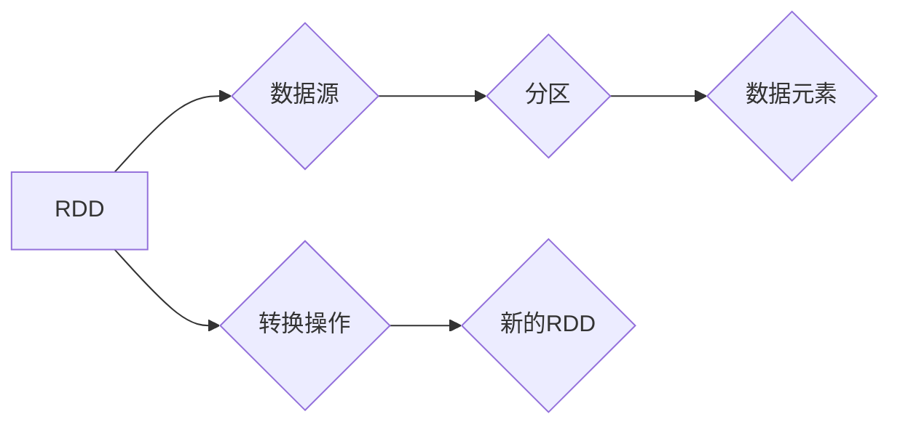

# 【AI大数据计算原理与代码实例讲解】RDD

> 关键词：RDD，分布式计算，Hadoop，大数据，MapReduce，函数式编程，数据流

## 1. 背景介绍

随着互联网和物联网的快速发展，数据量呈爆炸式增长。如何高效地处理和分析这些海量数据，成为了当今IT领域的一大挑战。RDD（Resilient Distributed Dataset）是Apache Spark框架的核心概念之一，它提供了一种简单、强大的分布式数据抽象，使得对大数据的处理变得可行和高效。本文将深入探讨RDD的原理、应用以及代码实例，帮助读者全面了解和使用RDD。

## 2. 核心概念与联系

### 2.1 核心概念

RDD（Resilient Distributed Dataset）是一种只读、不可变、可并行操作的分布式数据集合。它由一组数据元素和一系列转换操作组成。RDD的不可变性意味着在任何操作中都不会改变底层数据，而是生成一个新的RDD。

### 2.2 架构的 Mermaid 流程图



### 2.3 核心概念之间的联系

- 数据源：RDD的数据来源可以是HDFS文件系统、本地文件、数据库等。
- 分区：RDD被分割成多个分区，以便并行处理。
- 数据元素：每个分区包含多个数据元素，通常是行或键值对。
- 转换操作：通过转换操作，如map、filter、reduce等，对RDD进行变换，生成新的RDD。

## 3. 核心算法原理 & 具体操作步骤

### 3.1 算法原理概述

RDD的设计哲学是基于函数式编程思想，通过定义数据转换操作来处理数据。这种编程范式使得RDD易于理解和维护。

### 3.2 算法步骤详解

1. **创建RDD**：通过读取数据源，如HDFS文件，创建一个RDD。
2. **转换RDD**：使用转换操作，如map、filter等，对RDD进行变换，生成新的RDD。
3. **行动操作**：使用行动操作，如collect、count等，触发RDD的计算并获取最终结果。

### 3.3 算法优缺点

**优点**：
- 高效：RDD支持并行处理，可以充分利用集群资源。
- 弹性：RDD可以在遇到故障时自动恢复数据。
- 易于编程：基于函数式编程思想，易于理解和维护。

**缺点**：
- 资源开销：创建和转换RDD需要消耗一定的资源。
- 调度开销：Spark的调度器需要调度RDD的转换操作。

### 3.4 算法应用领域

- 数据分析：统计分析、数据挖掘、机器学习等。
- 大数据日志处理：实时数据流处理、日志分析等。
- 机器学习：特征提取、模型训练、预测等。

## 4. 数学模型和公式 & 详细讲解 & 举例说明

### 4.1 数学模型构建

RDD的数学模型可以表示为：

$$
RDD = \{r_1, r_2, \ldots, r_N\}
$$

其中 $r_i$ 为RDD中的数据元素，$N$ 为RDD中数据元素的总数。

### 4.2 公式推导过程

RDD的转换操作可以表示为：

$$
RDD' = f(RDD)
$$

其中 $f$ 为转换函数，$RDD'$ 为新的RDD。

### 4.3 案例分析与讲解

以下是一个使用map操作的案例：

```scala
val lines = sc.textFile("hdfs://localhost:9000/input.txt")
val words = lines.map(line => line.split(" ").toList)
```

在这个案例中，我们首先从HDFS文件中读取文本数据，然后使用map操作将每行文本分割成单词列表。

## 5. 项目实践：代码实例和详细解释说明

### 5.1 开发环境搭建

1. 安装Java环境（推荐Java 8及以上版本）。
2. 安装Scala环境（推荐Scala 2.11及以上版本）。
3. 安装Apache Spark：`spark-assembly_2.11-2.4.0-bin-hadoop2.7.tgz`。
4. 配置Spark环境变量。

### 5.2 源代码详细实现

```scala
import org.apache.spark.sql.SparkSession

object RDDExample {
  def main(args: Array[String]): Unit = {
    // 创建SparkSession
    val spark = SparkSession.builder.appName("RDDExample").getOrCreate()

    // 创建RDD
    val lines = spark.sparkContext.textFile("hdfs://localhost:9000/input.txt")

    // 转换RDD
    val words = lines.flatMap(_.split(" "))
    val wordCounts = words.map(word => (word, 1)).reduceByKey(_ + _)

    // 行动操作
    wordCounts.saveAsTextFile("hdfs://localhost:9000/output")

    // 关闭SparkSession
    spark.stop()
  }
}
```

### 5.3 代码解读与分析

- `SparkSession`：创建Spark会话，用于构建Spark应用程序。
- `textFile`：读取HDFS文件，创建RDD。
- `flatMap`：将每个元素转换为一系列元素。
- `map`：对RDD中的每个元素应用转换函数。
- `reduceByKey`：对具有相同键的值进行聚合。
- `saveAsTextFile`：将RDD保存到HDFS文件。

### 5.4 运行结果展示

运行上述代码后，可以在HDFS的指定输出路径下查看运行结果。

## 6. 实际应用场景

### 6.1 数据分析

RDD可以用于大数据分析，如统计分析、数据挖掘等。通过RDD的分布式处理能力，可以快速处理海量数据，并得到有价值的信息。

### 6.2 大数据日志处理

RDD可以用于大数据日志处理，如实时数据流处理、日志分析等。通过RDD的实时计算能力，可以实时监测和分析日志数据。

### 6.3 机器学习

RDD可以用于机器学习，如特征提取、模型训练、预测等。通过RDD的分布式计算能力，可以快速训练大规模机器学习模型。

## 7. 工具和资源推荐

### 7.1 学习资源推荐

- 《Spark快速大数据处理》：介绍Spark的原理和应用。
- 《Spark编程指南》：详细介绍Spark的API和编程实践。
- Apache Spark官网：提供Spark的官方文档和资源。

### 7.2 开发工具推荐

- IntelliJ IDEA：支持Scala和Spark开发的IDE。
- IntelliJ IDEA Ultimate Edition：支持更多Scala和Spark开发工具和插件。

### 7.3 相关论文推荐

- "Resilient Distributed Datasets for Large-Scale Data Processing"
- "Spark: Simple, Efficient General-purpose Data Processing"

## 8. 总结：未来发展趋势与挑战

### 8.1 研究成果总结

本文介绍了RDD的原理、应用以及代码实例，帮助读者全面了解和使用RDD。RDD作为一种高效、可扩展的分布式数据集合，在数据分析、大数据日志处理和机器学习等领域得到了广泛应用。

### 8.2 未来发展趋势

- 更多的优化算法：如参数高效微调、提示学习等。
- 更好的跨语言支持：如Python、Java等。
- 更强的容错能力：如自动故障恢复、数据恢复等。

### 8.3 面临的挑战

- 资源消耗：创建和转换RDD需要消耗一定的资源。
- 调度开销：Spark的调度器需要调度RDD的转换操作。

### 8.4 研究展望

- 进一步优化RDD的性能和效率。
- 探索新的RDD应用领域。
- 开发跨语言的RDD库。

## 9. 附录：常见问题与解答

**Q1：RDD和Hadoop MapReduce有什么区别？**

A：RDD和Hadoop MapReduce都是用于分布式计算的框架，但它们在架构和实现上有所不同。RDD基于函数式编程思想，提供了一种更加灵活的数据抽象和操作方式；而MapReduce基于迭代模型，通过Map和Reduce两个阶段进行数据处理。

**Q2：如何优化RDD的性能？**

A：可以通过以下方式优化RDD的性能：
- 使用合适的分区策略。
- 选择合适的转换操作。
- 优化内存使用。
- 使用持久化存储。

**Q3：RDD适用于哪些场景？**

A：RDD适用于大数据处理、数据分析、机器学习等场景。

**Q4：如何处理RDD中的大数据量？**

A：可以通过以下方式处理大数据量：
- 使用分布式存储系统，如HDFS。
- 使用分布式计算框架，如Spark。
- 使用并行算法和优化技术。

作者：禅与计算机程序设计艺术 / Zen and the Art of Computer Programming