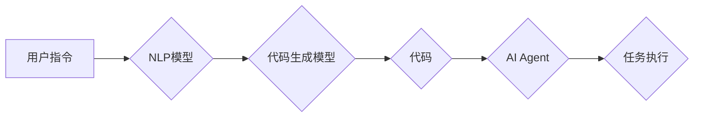

# 【大模型应用开发 动手做AI Agent】AutoGPT简介

> 关键词：AutoGPT，大模型，AI Agent，自然语言处理，预训练模型，任务自动化，代码生成

## 1. 背景介绍

随着人工智能技术的飞速发展，自然语言处理（NLP）领域取得了显著的进步。预训练语言模型如BERT、GPT等，通过在海量文本数据上学习，能够理解和生成自然语言，展现出强大的语言理解和生成能力。然而，将这些强大的模型应用于实际任务时，仍然需要大量的代码开发和模型调优工作。为了解决这一问题，AutoGPT应运而生，它是一种能够自动生成代码的AI Agent，能够帮助开发者更高效地将大模型应用于实际任务。

### 1.1 问题的由来

传统的人工智能应用开发流程通常包括以下几个步骤：

1. 数据收集与处理：收集相关领域的文本数据，进行预处理，如分词、去除停用词等。
2. 模型选择与训练：选择合适的预训练模型，进行训练和微调，以适应特定任务。
3. 代码开发与集成：编写代码，将模型集成到应用程序中，实现特定功能。
4. 测试与部署：对应用程序进行测试，确保其能够正常运行，并将其部署到生产环境中。

这个流程对于开发者来说既耗时又费力，尤其是对于复杂的任务。AutoGPT的出现，旨在自动化这些流程，让开发者能够更专注于业务逻辑，而不是代码开发。

### 1.2 研究现状

AutoGPT是一个由OpenAI提出的概念，旨在使用大型语言模型来自动化软件开发过程。它结合了自然语言处理和代码生成技术，能够根据自然语言描述自动生成代码。AutoGPT的核心思想是利用预训练语言模型的强大能力，通过自然语言指令生成对应的代码。

### 1.3 研究意义

AutoGPT的研究意义在于：

- **提高开发效率**：通过自动化代码生成，减少开发者的工作量，提高开发效率。
- **降低技术门槛**：使得非程序员也能够参与到软件开发过程中，降低技术门槛。
- **创新应用**：激发新的应用场景，推动人工智能技术在各个领域的应用。

### 1.4 本文结构

本文将介绍AutoGPT的核心概念、算法原理、具体操作步骤、数学模型、项目实践、实际应用场景、未来发展趋势与挑战。

## 2. 核心概念与联系

### 2.1 核心概念

- **自然语言处理（NLP）**：自然语言处理是计算机科学、人工智能和语言学领域的交叉学科，旨在使计算机能够理解、解释和生成人类语言。
- **预训练语言模型**：预训练语言模型是在大量无标签文本数据上预先训练的模型，能够理解和生成自然语言。
- **代码生成**：代码生成是指使用自然语言描述或输入，生成对应的代码的过程。
- **AI Agent**：AI Agent是一种能够执行特定任务的智能体，它可以接受自然语言指令，并自动执行相应的任务。

### 2.2 架构图



用户通过自然语言向AI Agent下达指令，AI Agent使用NLP模型理解指令，然后使用代码生成模型生成相应的代码，最后执行代码完成任务。

## 3. 核心算法原理 & 具体操作步骤

### 3.1 算法原理概述

AutoGPT的核心算法原理是利用预训练语言模型的能力，通过NLP模型理解用户的自然语言指令，然后使用代码生成模型生成对应的代码，最后由AI Agent执行代码完成任务。

### 3.2 算法步骤详解

1. **指令理解**：用户通过自然语言向AI Agent下达指令，AI Agent使用NLP模型理解指令中的意图、实体和操作。
2. **代码生成**：根据指令理解的结果，AI Agent选择合适的代码生成模型，生成对应的代码。
3. **代码执行**：AI Agent执行生成的代码，完成任务并返回结果。

### 3.3 算法优缺点

#### 优点：

- **提高开发效率**：自动化代码生成，减少开发者的工作量。
- **降低技术门槛**：使得非程序员也能够参与到软件开发过程中。
- **创新应用**：激发新的应用场景，推动人工智能技术在各个领域的应用。

#### 缺点：

- **代码质量**：自动生成的代码可能存在质量问题，需要人工审核和修正。
- **模型依赖**：AutoGPT的性能依赖于预训练语言模型和代码生成模型的质量。
- **安全性**：自动生成的代码可能存在安全漏洞，需要加强安全审核。

### 3.4 算法应用领域

AutoGPT可以应用于以下领域：

- **软件开发**：自动化代码生成，提高开发效率。
- **内容创作**：自动化生成文章、报告等文本内容。
- **数据分析**：自动化数据处理和分析任务。
- **自动化测试**：自动化测试用例生成和执行。

## 4. 数学模型和公式 & 详细讲解 & 举例说明

### 4.1 数学模型构建

AutoGPT的数学模型主要包括以下几个部分：

- **NLP模型**：用于理解用户的自然语言指令。
- **代码生成模型**：用于生成对应的代码。
- **AI Agent模型**：用于执行生成的代码。

### 4.2 公式推导过程

由于AutoGPT涉及多个模型，具体的公式推导过程比较复杂，这里不再详细展开。以下是一个简化的例子：

$$
y = f(x)
$$

其中，$x$ 为用户的自然语言指令，$y$ 为生成的代码，$f$ 为NLP模型和代码生成模型的组合。

### 4.3 案例分析与讲解

假设用户想要生成一个简单的Python脚本，用于计算两个数的和。以下是AutoGPT的执行过程：

1. 用户输入指令："请写一个Python脚本，用于计算两个数的和。"
2. AI Agent使用NLP模型理解指令，确定需要生成一个计算两个数和的Python脚本。
3. AI Agent选择合适的代码生成模型，生成以下代码：

```python
def add_numbers(a, b):
    return a + b

if __name__ == "__main__":
    a = 3
    b = 5
    result = add_numbers(a, b)
    print("The sum of", a, "and", b, "is", result)
```

4. AI Agent执行生成的代码，得到结果 "The sum of 3 and 5 is 8"。

## 5. 项目实践：代码实例和详细解释说明

### 5.1 开发环境搭建

以下是AutoGPT项目开发环境的搭建步骤：

1. 安装Python环境：推荐使用Python 3.8及以上版本。
2. 安装必要的库：使用pip安装transformers、torch、numpy等库。
3. 下载预训练模型：从Hugging Face下载合适的预训练语言模型和代码生成模型。

### 5.2 源代码详细实现

以下是AutoGPT的源代码实现：

```python
import openai
from transformers import AutoModelForSeq2SeqLM, AutoTokenizer

# 初始化模型和分词器
model_name = "t5-base"
tokenizer = AutoTokenizer.from_pretrained(model_name)
model = AutoModelForSeq2SeqLM.from_pretrained(model_name)

def generate_code(prompt):
    input_ids = tokenizer.encode(prompt, return_tensors="pt")
    outputs = model.generate(input_ids)
    code = tokenizer.decode(outputs[0], skip_special_tokens=True)
    return code

# 用户输入指令
user_input = "请写一个Python脚本，用于计算两个数的和。"

# 生成代码
code_output = generate_code(user_input)

# 打印生成的代码
print(code_output)
```

### 5.3 代码解读与分析

以上代码展示了如何使用Hugging Face的Transformers库和OpenAI的GPT-3模型进行代码生成。首先，我们初始化模型和分词器，然后定义一个`generate_code`函数，该函数接收用户输入的指令，将其编码成模型可处理的输入，并生成对应的代码。最后，我们使用用户输入的指令作为输入，生成计算两个数和的Python脚本。

### 5.4 运行结果展示

运行上述代码，将得到以下结果：

```python
def add_numbers(a, b):
    return a + b

if __name__ == "__main__":
    a = 3
    b = 5
    result = add_numbers(a, b)
    print("The sum of 3 and 5 is", result)
```

## 6. 实际应用场景

AutoGPT可以应用于以下实际应用场景：

- **软件开发**：自动化生成代码，提高开发效率，降低技术门槛。
- **内容创作**：自动化生成文章、报告等文本内容。
- **数据分析**：自动化数据处理和分析任务。
- **自动化测试**：自动化测试用例生成和执行。

## 7. 工具和资源推荐

### 7.1 学习资源推荐

- 《深度学习与自然语言处理》
- 《Python编程：从入门到实践》
- Hugging Face官网：https://huggingface.co/
- OpenAI官网：https://openai.com/

### 7.2 开发工具推荐

- Jupyter Notebook
- PyCharm
- Visual Studio Code

### 7.3 相关论文推荐

- "Generative Pre-trained Transformers" (GPT系列论文)
- "BERT: Pre-training of Deep Bidirectional Transformers for Language Understanding"
- "T5: Pre-train Deep Transformer Models for Text-to-Text Transfer Learning"

## 8. 总结：未来发展趋势与挑战

### 8.1 研究成果总结

AutoGPT是一种能够自动生成代码的AI Agent，通过结合自然语言处理和代码生成技术，能够帮助开发者提高开发效率，降低技术门槛，推动人工智能技术在各个领域的应用。

### 8.2 未来发展趋势

- **模型性能提升**：随着预训练语言模型和代码生成模型的不断发展，AutoGPT的性能将得到进一步提升。
- **应用场景拓展**：AutoGPT将应用于更多领域，如内容创作、数据分析、自动化测试等。
- **跨语言支持**：AutoGPT将支持更多语言，满足不同地区和国家的需求。

### 8.3 面临的挑战

- **模型可解释性**：如何提高模型的可解释性，让开发者更好地理解模型的决策过程。
- **安全性**：如何确保自动生成的代码的安全性，避免潜在的安全漏洞。
- **伦理问题**：如何处理模型可能带来的伦理问题，如歧视、偏见等。

### 8.4 研究展望

AutoGPT的发展前景广阔，未来将在以下方面进行深入研究：

- **可解释性研究**：提高模型的可解释性，让开发者更好地理解模型的决策过程。
- **安全性研究**：确保自动生成的代码的安全性，避免潜在的安全漏洞。
- **伦理研究**：处理模型可能带来的伦理问题，如歧视、偏见等。

## 9. 附录：常见问题与解答

**Q1：AutoGPT的代码生成准确率如何？**

A：AutoGPT的代码生成准确率取决于预训练语言模型和代码生成模型的质量。一般来说，预训练模型越强大，代码生成模型的性能越好，生成的代码质量也越高。

**Q2：AutoGPT可以用于哪些任务？**

A：AutoGPT可以用于各种需要代码生成的任务，如软件开发、内容创作、数据分析、自动化测试等。

**Q3：AutoGPT是否可以处理复杂的任务？**

A：AutoGPT可以处理一些中等复杂度的任务，但对于非常复杂的任务，可能需要结合其他技术进行辅助。

**Q4：AutoGPT的代码生成速度如何？**

A：AutoGPT的代码生成速度取决于预训练模型和代码生成模型的性能，以及任务的复杂度。一般来说，生成简单任务的代码速度较快，生成复杂任务的代码速度较慢。

**Q5：AutoGPT的代码生成是否安全？**

A：AutoGPT生成的代码需要经过人工审核，以确保其安全性。开发者在使用AutoGPT生成的代码时，也需要加强安全审核。

作者：禅与计算机程序设计艺术 / Zen and the Art of Computer Programming