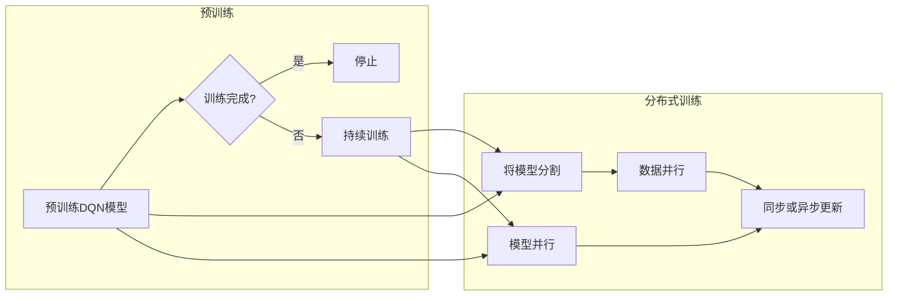

# 一切皆是映射：DQN的云计算与分布式训练方案

> 关键词：深度强化学习，DQN，云计算，分布式训练，映射学习，Q学习，神经网络，epsilon-greedy策略

## 1. 背景介绍

随着深度学习技术的迅猛发展，深度强化学习（Deep Reinforcement Learning, DRL）逐渐成为人工智能领域的研究热点。DRL结合了深度学习的强大特征提取能力和强化学习的决策制定能力，在游戏、机器人、自动驾驶等领域展现出巨大的潜力。其中，深度Q网络（Deep Q-Network，DQN）作为DRL领域的重要算法之一，因其简单、高效的特点而备受关注。

然而，DQN的训练过程涉及到大量的样本和计算资源，如何高效地进行DQN的训练，成为了研究和应用中的关键问题。云计算和分布式训练技术为DQN的训练提供了新的解决方案。本文将探讨DQN在云计算环境下的分布式训练方案，并介绍其核心原理、实现步骤和应用领域。

## 2. 核心概念与联系

### 2.1 核心概念原理

#### DQN

DQN是一种基于深度学习的强化学习算法，它将Q学习算法与深度神经网络相结合，通过学习状态-动作价值函数来指导智能体的决策过程。DQN的核心思想是使用深度神经网络来近似Q函数，并通过经验回放（Experience Replay）和目标网络（Target Network）等技术来减少样本方差和过拟合。

#### 云计算

云计算是一种基于互联网的计算模式，通过互联网提供动态易扩展且经常是虚拟化的资源。云计算平台可以提供弹性可扩展的计算、存储和网络资源，为DQN的分布式训练提供了基础设施。

#### 分布式训练

分布式训练是一种将计算任务分布在多个计算节点上并行执行的方法。通过分布式训练，可以显著提高计算效率，缩短训练时间。

### 2.2 架构的 Mermaid 流程图



### 2.3 核心概念联系

DQN的预训练过程需要大量的样本和计算资源，云计算平台可以提供所需的弹性计算资源。分布式训练技术可以将DQN的训练任务分割成多个子任务，并行地在多个计算节点上执行，从而加速训练过程。

## 3. 核心算法原理 & 具体操作步骤

### 3.1 算法原理概述

DQN的训练过程主要包括以下几个步骤：

1. 初始化Q网络和目标网络。
2. 通过epsilon-greedy策略选择动作。
3. 执行选定的动作并收集经验。
4. 将收集到的经验存储到经验池中。
5. 从经验池中随机抽取一批经验进行更新。
6. 使用梯度下降算法更新Q网络和目标网络的参数。

### 3.2 算法步骤详解

1. **初始化Q网络和目标网络**：Q网络和目标网络的结构相同，但参数独立。目标网络用于生成Q值的目标值，Q网络用于生成当前的Q值。
2. **epsilon-greedy策略**：epsilon-greedy策略是指在随机选择和贪婪选择之间进行权衡。在探索阶段，以一定的概率随机选择动作；在贪婪阶段，选择Q值最大的动作。
3. **收集经验**：执行选定的动作，并观察环境的反馈和奖励。
4. **存储经验**：将收集到的经验存储到经验池中。
5. **经验回放**：从经验池中随机抽取一批经验进行训练，以避免样本偏差和过拟合。
6. **更新Q网络和目标网络的参数**：使用梯度下降算法更新Q网络和目标网络的参数，以最小化Q值预测误差。

### 3.3 算法优缺点

**优点**：

- 简单易实现。
- 能有效地处理高维输入。
- 可以学习到复杂的决策策略。

**缺点**：

- 训练过程可能需要大量的样本。
- 对于某些任务，可能难以收敛到最优解。

### 3.4 算法应用领域

DQN在多个领域都有广泛的应用，包括：

- 游戏AI：如Atari游戏、棋类游戏等。
- 机器人控制：如无人驾驶、机器人导航等。
- 自动驾驶：如自动驾驶车辆的决策制定。
- 金融市场：如股票交易、风险管理等。

## 4. 数学模型和公式 & 详细讲解 & 举例说明

### 4.1 数学模型构建

DQN的核心是Q函数，它是一个状态-动作价值函数，表示在某个状态下采取某个动作所能获得的预期奖励。假设状态空间为$S$，动作空间为$A$，则Q函数可以表示为：

$$
Q(s,a) = \sum_{s' \in S} \pi(s'|s,a) \cdot R(s',a) + \gamma \sum_{s' \in S} V(s')
$$

其中，$\pi(s'|s,a)$是状态转移概率，$R(s',a)$是采取动作$a$在状态$s$下获得的奖励，$V(s')$是状态$s'$的价值函数，$\gamma$是折扣因子。

### 4.2 公式推导过程

DQN的目标是最小化Q函数的预测误差。假设我们有一个经验样本$(s,a,r,s')$，则Q函数的预测误差可以表示为：

$$
L(Q(s,a), r + \gamma \max_{a'} Q(s',a') - Q(s,a))
$$

其中，$\max_{a'} Q(s',a')$是状态$s'$下的最大Q值。

### 4.3 案例分析与讲解

假设我们使用DQN训练一个智能体玩Atari游戏《Pong》。在游戏开始时，智能体处于状态$s$，可以选择的动作有向上移动、向下移动和保持不动。智能体执行动作$a$后，获得奖励$r$，并转移到状态$s'$。然后，智能体会根据Q函数的预测值选择下一个动作。

假设Q函数的预测值为$Q(s,a)$，则智能体的决策过程可以表示为：

1. 计算状态转移概率$\pi(s'|s,a)$。
2. 计算奖励$r$和状态转移概率$\pi(s'|s,a)$，并计算目标值$Q(s',a)$。
3. 使用梯度下降算法更新Q函数的参数，以最小化预测误差。

通过重复上述步骤，智能体会逐渐学习到在《Pong》游戏中获胜的策略。

## 5. 项目实践：代码实例和详细解释说明

### 5.1 开发环境搭建

以下是使用Python和TensorFlow进行DQN训练的基本环境搭建步骤：

1. 安装TensorFlow：
```bash
pip install tensorflow
```

2. 安装其他依赖库：
```bash
pip install gym numpy matplotlib
```

3. 创建项目文件夹并编写代码。

### 5.2 源代码详细实现

以下是一个简单的DQN训练代码示例：

```python
import gym
import numpy as np
import tensorflow as tf

# 创建环境
env = gym.make("Pong-v0")

# 初始化网络
model = tf.keras.Sequential([
    tf.keras.layers.Flatten(input_shape=(210, 160, 3)),
    tf.keras.layers.Dense(256, activation='relu'),
    tf.keras.layers.Dense(64, activation='relu'),
    tf.keras.layers.Dense(2)
])

# 训练DQN
for episode in range(1000):
    state = env.reset()
    done = False
    total_reward = 0
    while not done:
        # epsilon-greedy策略
        if np.random.rand() < 0.1:
            action = env.action_space.sample()
        else:
            action = np.argmax(model.predict(state.reshape(1, 210, 160, 3)))
        
        # 执行动作并获取奖励和下一个状态
        next_state, reward, done, _ = env.step(action)
        total_reward += reward
        
        # 存储经验
        replay_buffer.append((state, action, reward, next_state, done))
        
        # 训练模型
        if len(replay_buffer) > batch_size:
            states, actions, rewards, next_states, dones = zip(*replay_buffer)
            q_values = model.predict(states)
            targets = rewards
            for i in range(len(dones)):
                if dones[i]:
                    targets[i] = rewards[i]
                else:
                    targets[i] = rewards[i] + gamma * np.max(model.predict(next_states))
            model.compile(optimizer=tf.keras.optimizers.Adam(), loss='mse')
            model.fit(states, targets, epochs=1)
        
        state = next_state

    print(f"Episode {episode + 1}, Total Reward: {total_reward}")

# 关闭环境
env.close()
```

### 5.3 代码解读与分析

以上代码展示了使用TensorFlow和gym库进行DQN训练的基本流程。

- 首先，我们创建了一个Pong游戏的仿真环境。
- 然后，初始化了一个简单的神经网络作为Q网络。
- 接着，通过epsilon-greedy策略选择动作，并执行动作，获取奖励和下一个状态。
- 存储经验到经验池中，并在经验池足够大时，从经验池中抽取一批经验进行训练。
- 使用梯度下降算法更新Q网络的参数。

### 5.4 运行结果展示

在运行以上代码时，我们可以看到智能体在Pong游戏中逐渐学习到获胜的策略。经过多次训练后，智能体的平均得分会逐渐提高。

## 6. 实际应用场景

DQN在多个领域都有广泛的应用，以下是一些典型的应用场景：

- **游戏AI**：使用DQN训练游戏AI，如Atari游戏、棋类游戏等。
- **机器人控制**：使用DQN训练机器人进行导航、抓取等任务。
- **自动驾驶**：使用DQN训练自动驾驶车辆的决策制定。
- **股票交易**：使用DQN训练智能交易策略。
- **工业自动化**：使用DQN优化工业生产流程。

## 7. 工具和资源推荐

### 7.1 学习资源推荐

- 《Reinforcement Learning: An Introduction》
- 《Artificial Intelligence: A Modern Approach》
- 《Deep Reinforcement Learning》
- TensorFlow官方文档
- Keras官方文档

### 7.2 开发工具推荐

- TensorFlow
- Keras
- gym
- OpenAI Baselines

### 7.3 相关论文推荐

- Deep Q-Networks (Silver et al., 2013)
- Prioritized Experience Replay (Schulman et al., 2015)
- Deep Deterministic Policy Gradient (Haarnoja et al., 2017)
- Asynchronous Methods for Deep Reinforcement Learning (Schulman et al., 2017)

## 8. 总结：未来发展趋势与挑战

### 8.1 研究成果总结

本文介绍了DQN的原理、实现步骤和应用场景，并探讨了DQN在云计算环境下的分布式训练方案。通过分布式训练，可以显著提高DQN的训练效率，缩短训练时间。

### 8.2 未来发展趋势

未来，DQN将在以下方面得到进一步发展：

- **模型压缩和加速**：通过模型压缩和加速技术，降低DQN的复杂度和计算资源需求。
- **多智能体强化学习**：研究多智能体强化学习，实现多个智能体之间的协同合作。
- **迁移学习和少样本学习**：研究迁移学习和少样本学习，降低对标注数据的依赖。
- **可解释性和可控性**：提高DQN的可解释性和可控性，使其在更多领域得到应用。

### 8.3 面临的挑战

DQN在未来的发展中也面临着以下挑战：

- **样本效率**：提高DQN的样本效率，降低对标注数据的依赖。
- **可解释性和可控性**：提高DQN的可解释性和可控性，使其在更多领域得到应用。
- **计算资源**：降低DQN的计算资源需求，使其在资源受限的环境中也能应用。

### 8.4 研究展望

未来，DQN将在人工智能领域发挥越来越重要的作用。通过不断的研究和探索，DQN将推动人工智能技术的进步，为人类社会带来更多价值。

## 9. 附录：常见问题与解答

**Q1：DQN与Q-Learning有什么区别？**

A：DQN是Q-Learning的扩展，它使用深度神经网络来近似Q函数，从而能够处理高维输入。相比Q-Learning，DQN能够学习到更加复杂的决策策略。

**Q2：如何提高DQN的样本效率？**

A：提高DQN的样本效率可以通过以下方法实现：
- 使用经验回放技术。
- 使用目标网络技术。
- 使用迁移学习技术。

**Q3：DQN在哪些领域有应用？**

A：DQN在多个领域都有应用，包括游戏AI、机器人控制、自动驾驶、股票交易、工业自动化等。

**Q4：如何实现DQN的分布式训练？**

A：实现DQN的分布式训练可以通过以下方法：
- 使用分布式计算框架，如TensorFlow分布式训练。
- 将DQN的训练任务分割成多个子任务，并行地在多个计算节点上执行。

作者：禅与计算机程序设计艺术 / Zen and the Art of Computer Programming