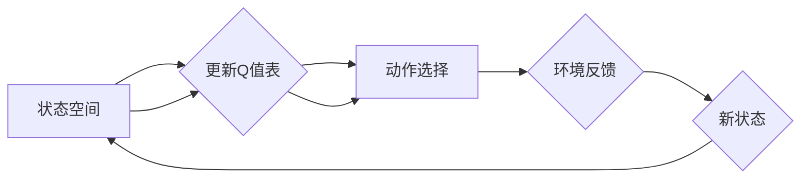

# 一切皆是映射：DQN的损失函数设计与调试技巧

> 关键词：深度强化学习，DQN，损失函数，调试技巧，Q学习，值函数，策略梯度，神经网络

## 1. 背景介绍

深度强化学习（Deep Reinforcement Learning, DRL）是人工智能领域的一颗璀璨明珠，它结合了深度学习和强化学习的优势，使得机器能够在复杂环境中学习到智能行为。其中，深度Q网络（Deep Q-Network, DQN）作为DRL的先驱之一，以其出色的性能和简洁的架构赢得了广泛的关注。DQN的核心在于其损失函数的设计，它直接决定了学习过程中的优化方向和最终模型的性能。本文将深入探讨DQN的损失函数设计与调试技巧，帮助读者更好地理解和使用这一强大的学习算法。

### 1.1 问题的由来

DQN通过学习一个值函数来预测每个状态-动作对的效用，从而指导智能体选择最优动作。然而，如何设计一个既能反映状态-动作效用，又能有效指导学习过程的损失函数，一直是DQN研究和应用中的关键问题。

### 1.2 研究现状

目前，DQN的损失函数设计主要围绕以下两个方面展开：

1. **值函数的表示**：如何选择合适的函数形式来表示值函数，是DQN设计中的第一步。常用的方法包括线性函数、神经网络等。
2. **损失函数的形式**：损失函数需要能够衡量预测值与真实值之间的差异，并引导网络学习。

### 1.3 研究意义

深入研究DQN的损失函数设计与调试技巧，对于以下方面具有重要意义：

- 提升DQN在复杂环境中的学习效率和性能。
- 帮助开发者更好地理解和应用DQN。
- 推动DRL技术的发展和应用。

### 1.4 本文结构

本文将按以下结构展开：

- 第2章介绍DQN的核心概念与联系，并给出Mermaid流程图。
- 第3章详细阐述DQN的算法原理和具体操作步骤。
- 第4章讲解DQN的数学模型和公式，并举例说明。
- 第5章通过代码实例展示DQN的实现，并对关键代码进行解读和分析。
- 第6章探讨DQN在实际应用场景中的应用。
- 第7章推荐学习资源和开发工具。
- 第8章总结DQN的未来发展趋势和挑战。
- 第9章提供常见问题与解答。

## 2. 核心概念与联系

### 2.1 Mermaid流程图



### 2.2 核心概念

- **状态空间**：智能体所处的环境状态集合。
- **动作空间**：智能体可以选择的动作集合。
- **Q值**：表示在特定状态下选择特定动作的预期效用。
- **Q值表**：存储所有状态-动作对的Q值。
- **损失函数**：衡量预测Q值与真实Q值之间的差异。

## 3. 核心算法原理 & 具体操作步骤

### 3.1 算法原理概述

DQN通过学习一个值函数来预测每个状态-动作对的效用，并使用贪心策略选择动作。其基本原理如下：

1. 初始化Q值表。
2. 从初始状态开始，根据贪心策略选择动作。
3. 执行动作，获得奖励和下一个状态。
4. 使用损失函数更新Q值表。
5. 重复步骤2-4，直到达到终止条件。

### 3.2 算法步骤详解

1. **初始化**：初始化Q值表，可以使用随机值或预训练值。
2. **动作选择**：根据当前状态和Q值表选择动作。
3. **执行动作**：执行选择的动作，并获得奖励和下一个状态。
4. **Q值更新**：使用损失函数更新Q值表。
5. **终止条件**：当达到训练轮数、累积奖励达到阈值或达到最大步数时，训练结束。

### 3.3 算法优缺点

**优点**：

- 简单易实现。
- 可以处理连续动作空间。
- 避免了显式策略的学习。

**缺点**：

- 需要大量样本进行学习。
- 学习速度较慢。
- 容易陷入局部最优。

### 3.4 算法应用领域

DQN在以下领域有广泛的应用：

- 游戏AI。
- 机器人控制。
- 无人驾驶。
- 贸易和金融。

## 4. 数学模型和公式 & 详细讲解 & 举例说明

### 4.1 数学模型构建

DQN的数学模型主要包括以下部分：

- **状态空间**：$S$，表示智能体所处的环境状态。
- **动作空间**：$A$，表示智能体可以采取的动作集合。
- **动作值函数**：$Q(S, A)$，表示在状态$S$下采取动作$A$的预期效用。
- **Q值表**：$Q(s, a)$，存储所有状态-动作对的Q值。
- **损失函数**：$L(Q(s, a), r, s', a')$，衡量预测Q值与真实Q值之间的差异。

### 4.2 公式推导过程

DQN的损失函数通常采用以下形式：

$$
L(Q(s, a), r, s', a') = (r + \gamma \max_{a'} Q(s', a') - Q(s, a))^2
$$

其中，$\gamma$ 是折扣因子，$r$ 是立即奖励，$s'$ 是下一个状态，$a'$ 是在下一个状态下采取的动作。

### 4.3 案例分析与讲解

假设智能体在游戏环境中，状态空间为$S$，动作空间为$A$，Q值表为$Q(s, a)$。智能体当前状态为$S_0$，选择动作$A_0$，获得奖励$r_1$和下一个状态$S_1$。然后，智能体在$S_1$下选择动作$A_1$。

根据损失函数公式，我们可以计算出损失：

$$
L(Q(S_0, A_0), r_1, S_1, A_1) = (r_1 + \gamma \max_{a'} Q(S_1, a') - Q(S_0, A_0))^2
$$

通过反向传播，更新Q值表：

$$
\Delta Q(S_0, A_0) = \eta [r_1 + \gamma \max_{a'} Q(S_1, a') - Q(S_0, A_0)]
$$

其中，$\eta$ 是学习率。

## 5. 项目实践：代码实例和详细解释说明

### 5.1 开发环境搭建

首先，我们需要搭建一个开发环境。以下是在Python中使用PyTorch搭建DQN开发环境的步骤：

1. 安装Anaconda：从官网下载并安装Anaconda。
2. 创建并激活虚拟环境：
```bash
conda create -n dqn-env python=3.8
conda activate dqn-env
```
3. 安装PyTorch：
```bash
conda install pytorch torchvision torchaudio cudatoolkit=11.3 -c pytorch -c conda-forge
```
4. 安装其他依赖：
```bash
pip install gym numpy pandas matplotlib
```

### 5.2 源代码详细实现

以下是一个简单的DQN实现：

```python
import torch
import torch.nn as nn
import torch.optim as optim
from torch.utils.data import DataLoader
from gym import make

class DQN(nn.Module):
    def __init__(self, input_size, hidden_size, output_size):
        super(DQN, self).__init__()
        self.fc1 = nn.Linear(input_size, hidden_size)
        self.fc2 = nn.Linear(hidden_size, output_size)

    def forward(self, x):
        x = torch.relu(self.fc1(x))
        return self.fc2(x)

def train(dqn, optimizer, criterion, device, env, episodes=1000):
    for episode in range(episodes):
        state = env.reset()
        state = torch.from_numpy(state).float().unsqueeze(0).to(device)
        done = False
        while not done:
            action = dqn(state).argmax().item()
            next_state, reward, done, _ = env.step(action)
            next_state = torch.from_numpy(next_state).float().unsqueeze(0).to(device)
            optimizer.zero_grad()
            loss = criterion(dqn(state), target)
            loss.backward()
            optimizer.step()
            state = next_state

if __name__ == '__main__':
    env = make('CartPole-v0')
    dqn = DQN(4, 64, 2)
    dqn.to(torch.device('cuda' if torch.cuda.is_available() else 'cpu'))
    optimizer = optim.Adam(dqn.parameters(), lr=0.01)
    criterion = nn.MSELoss()
    train(dqn, optimizer, criterion, torch.device('cuda' if torch.cuda.is_available() else 'cpu'), env)
```

### 5.3 代码解读与分析

- `DQN`类：定义了DQN的网络结构，包括两个全连接层。
- `train`函数：训练DQN模型，包括初始化模型、优化器、损失函数，以及与环境交互。
- `if __name__ == '__main__':`：主函数，创建环境、初始化模型、优化器、损失函数，并开始训练。

### 5.4 运行结果展示

运行上述代码，DQN模型将在CartPole-v0环境中进行训练。随着训练的进行，模型的性能将不断提高，最终能够在CartPole环境中稳定地完成任务。

## 6. 实际应用场景

DQN在以下领域有广泛的应用：

- **游戏AI**：DQN可以用于训练智能体在游戏环境中学习策略，如Atari游戏、棋类游戏等。
- **机器人控制**：DQN可以用于训练机器人学习执行复杂的操作，如移动、抓取等。
- **无人驾驶**：DQN可以用于训练无人驾驶车辆学习在复杂道路环境中行驶。
- **贸易和金融**：DQN可以用于金融市场的交易策略学习，如股票交易、期货交易等。

## 7. 工具和资源推荐

### 7.1 学习资源推荐

- 《深度学习》系列书籍：介绍深度学习的基本概念和常用算法。
- 《Reinforcement Learning: An Introduction》书籍：介绍强化学习的基本概念和常用算法。
- OpenAI Gym：提供多种环境，用于训练和测试强化学习算法。

### 7.2 开发工具推荐

- PyTorch：用于深度学习的开源框架。
- TensorFlow：用于深度学习的开源框架。
- Gym：用于开发、测试和比较强化学习算法的开源平台。

### 7.3 相关论文推荐

- "Deep Q-Network"论文：介绍了DQN算法。
- "Playing Atari with Deep Reinforcement Learning"论文：展示了DQN在Atari游戏中的成功应用。

## 8. 总结：未来发展趋势与挑战

### 8.1 研究成果总结

DQN作为DRL的先驱之一，为后续的DRL研究奠定了坚实的基础。DQN在游戏、机器人、无人驾驶等领域取得了显著的应用成果。

### 8.2 未来发展趋势

- **多智能体强化学习**：研究多个智能体在复杂环境中的协同学习和决策问题。
- **持续学习**：研究智能体在动态环境中持续学习新知识和技能的方法。
- **可解释性**：研究如何提高强化学习模型的可解释性和可信赖性。

### 8.3 面临的挑战

- **样本效率**：如何减少学习过程中的样本需求，提高样本利用效率。
- **长期依赖**：如何处理长期依赖问题，使智能体能够学习到长期奖励。
- **安全性**：如何保证强化学习算法的安全性，防止恶意利用。

### 8.4 研究展望

未来，DQN及其变体将在更多领域得到应用，为人工智能的发展做出更大的贡献。

## 9. 附录：常见问题与解答

**Q1：DQN与Q学习有何区别？**

A：DQN是Q学习的扩展，它使用深度神经网络来近似Q值函数，而Q学习使用表格来存储Q值。

**Q2：DQN如何处理连续动作空间？**

A：DQN使用连续动作空间的策略，如动作剪辑、概率分布等。

**Q3：DQN如何防止过拟合？**

A：DQN可以使用多种方法来防止过拟合，如经验回放、随机初始化、Dropout等。

**Q4：DQN如何处理非平稳环境？**

A：DQN可以结合探索策略，如ε-greedy策略、UCB策略等，来处理非平稳环境。

**Q5：DQN如何处理高维状态空间？**

A：DQN可以使用特征提取技术，如卷积神经网络、循环神经网络等，来处理高维状态空间。

---

作者：禅与计算机程序设计艺术 / Zen and the Art of Computer Programming