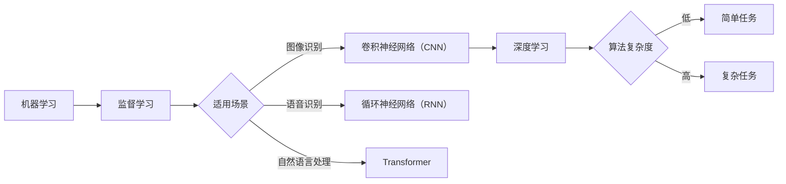

> 关键词：MNIST数据集，卷积神经网络（CNN），深度学习，迁移学习，预训练，大语言模型，自然语言处理（NLP），人工智能

# 从MNIST数据集到大语言模型

在人工智能领域，从最简单的数据集到最复杂的大语言模型，是一个从浅入深、从简单到复杂的过程。本文将带您踏上这段旅程，从经典的MNIST数据集出发，逐步探索卷积神经网络（CNN）、深度学习、迁移学习，最终抵达大语言模型的世界。

## 1. 背景介绍

MNIST数据集是机器学习领域最著名的入门级数据集之一，由美国国家标准与技术研究院（NIST）提供。它包含60,000个手写数字（0-9）的灰度图像，每个数字都有28x28的像素尺寸。数据集中的数字图像已经过标准化处理，每个像素的值在0到255之间。

MNIST数据集的简单性和规模使其成为了学习和研究机器学习算法的绝佳选择。它不仅帮助了许多研究人员和开发者理解了机器学习的基本概念，还推动了诸如卷积神经网络（CNN）等深度学习技术的快速发展。

## 2. 核心概念与联系

### 2.1 核心概念原理

在深入探讨MNIST数据集之前，我们需要了解以下几个核心概念：

- **机器学习**：一种使计算机系统能够从数据中学习并做出决策或预测的技术。
- **监督学习**：一种机器学习范式，其中算法从带有标签的训练数据中学习，以预测新的、未见过的数据。
- **卷积神经网络（CNN）**：一种特殊的神经网络，特别适用于图像识别任务，因为它能够捕获图像的空间层次结构。
- **深度学习**：一种机器学习技术，它使用类似于大脑的神经网络结构来学习数据中的复杂模式。

以下是这些概念的Mermaid流程图：



### 2.2 架构联系

从MNIST数据集到深度学习，再到大语言模型，我们可以看到以下架构上的联系：

1. **MNIST数据集**：作为基础，提供了简单的图像识别任务，是学习和理解CNN的起点。
2. **CNN**：通过在MNIST数据集上的成功应用，证明了深度学习在图像识别领域的潜力。
3. **深度学习**：CNN的成功推动了深度学习技术的发展，使其成为解决复杂任务的关键技术。
4. **大语言模型**：深度学习技术在自然语言处理领域的应用，催生了大语言模型，如BERT和GPT，它们在处理自然语言数据方面取得了突破性的进展。

## 3. 核心算法原理 & 具体操作步骤

### 3.1 算法原理概述

卷积神经网络（CNN）是一种特殊的神经网络，它通过卷积层和池化层来提取图像特征。CNN的主要组成部分包括：

- **卷积层**：通过卷积操作提取图像的局部特征。
- **激活函数**：对卷积层输出的特征进行非线性变换，增加模型的非线性表达能力。
- **池化层**：降低特征图的空间维度，减少计算量和过拟合风险。
- **全连接层**：将低层特征图的特征进行线性组合，得到最终预测结果。

### 3.2 算法步骤详解

以下是使用CNN进行MNIST手写数字识别的基本步骤：

1. **数据预处理**：读取MNIST数据集，将图像像素值归一化到0到1之间。
2. **构建CNN模型**：定义卷积层、激活函数、池化层和全连接层。
3. **训练模型**：使用训练集数据对模型进行训练，优化模型参数。
4. **验证模型**：使用验证集数据评估模型性能，调整模型结构和超参数。
5. **测试模型**：使用测试集数据测试模型在未见过的数据上的表现。

### 3.3 算法优缺点

**优点**：

- **强大的特征提取能力**：CNN能够自动从图像中提取出具有判别性的特征。
- **参数共享**：CNN中的卷积核在整个图像上共享，减少了模型参数数量。
- **鲁棒性强**：CNN对图像的平移、旋转和缩放具有一定的鲁棒性。

**缺点**：

- **计算量大**：CNN模型通常需要大量的计算资源进行训练。
- **可解释性差**：CNN的决策过程难以解释，难以理解模型是如何做出预测的。

### 3.4 算法应用领域

CNN在图像识别领域取得了显著的成果，如：

- **图像分类**：对图像进行分类，如动物识别、人脸识别等。
- **物体检测**：检测图像中的物体并定位其位置。
- **图像分割**：将图像分割成不同的区域。

## 4. 数学模型和公式 & 详细讲解 & 举例说明

### 4.1 数学模型构建

CNN的数学模型可以表示为：

$$
y = f(W_l \cdot a_{l-1} + b_l)
$$

其中：

- $y$ 是模型的输出。
- $W_l$ 是第 $l$ 层的权重。
- $a_{l-1}$ 是第 $l-1$ 层的激活输出。
- $b_l$ 是第 $l$ 层的偏置。
- $f$ 是激活函数。

### 4.2 公式推导过程

CNN中的卷积操作可以使用以下公式表示：

$$
C_{ij} = \sum_{k=1}^{K} W_{ijk} \cdot A_{ik}
$$

其中：

- $C_{ij}$ 是卷积层输出的特征值。
- $W_{ijk}$ 是卷积核权重。
- $A_{ik}$ 是输入特征图上的像素值。

### 4.3 案例分析与讲解

以下是一个简单的CNN模型示例，用于识别MNIST数据集中的手写数字：

```python
import torch
import torch.nn as nn
import torch.nn.functional as F

class SimpleCNN(nn.Module):
    def __init__(self):
        super(SimpleCNN, self).__init__()
        self.conv1 = nn.Conv2d(1, 32, kernel_size=3, padding=1)
        self.conv2 = nn.Conv2d(32, 64, kernel_size=3, padding=1)
        self.fc1 = nn.Linear(64 * 14 * 14, 128)
        self.fc2 = nn.Linear(128, 10)

    def forward(self, x):
        x = F.relu(self.conv1(x))
        x = F.max_pool2d(x, 2)
        x = F.relu(self.conv2(x))
        x = F.max_pool2d(x, 2)
        x = x.view(-1, 64 * 14 * 14)
        x = F.relu(self.fc1(x))
        x = self.fc2(x)
        return F.log_softmax(x, dim=1)
```

在这个例子中，我们定义了一个简单的CNN模型，它包含两个卷积层、两个最大池化层、两个全连接层和一个输出层。模型使用ReLU作为激活函数，并使用Softmax函数进行分类。

## 5. 项目实践：代码实例和详细解释说明

### 5.1 开发环境搭建

要运行以下代码，您需要安装PyTorch库。以下是在Python环境中安装PyTorch的命令：

```bash
pip install torch torchvision
```

### 5.2 源代码详细实现

以下是一个使用PyTorch实现MNIST手写数字识别的完整示例：

```python
import torch
import torch.nn as nn
import torch.nn.functional as F
from torchvision import datasets, transforms
from torch.utils.data import DataLoader

# 定义CNN模型
class SimpleCNN(nn.Module):
    def __init__(self):
        super(SimpleCNN, self).__init__()
        self.conv1 = nn.Conv2d(1, 32, kernel_size=3, padding=1)
        self.conv2 = nn.Conv2d(32, 64, kernel_size=3, padding=1)
        self.fc1 = nn.Linear(64 * 14 * 14, 128)
        self.fc2 = nn.Linear(128, 10)

    def forward(self, x):
        x = F.relu(self.conv1(x))
        x = F.max_pool2d(x, 2)
        x = F.relu(self.conv2(x))
        x = F.max_pool2d(x, 2)
        x = x.view(-1, 64 * 14 * 14)
        x = F.relu(self.fc1(x))
        x = self.fc2(x)
        return F.log_softmax(x, dim=1)

# 加载数据
transform = transforms.Compose([transforms.ToTensor()])
train_dataset = datasets.MNIST(root='./data', train=True, transform=transform, download=True)
train_loader = DataLoader(train_dataset, batch_size=64, shuffle=True)

# 初始化模型和优化器
model = SimpleCNN()
optimizer = torch.optim.Adam(model.parameters(), lr=0.001)

# 训练模型
def train(model, train_loader, optimizer, epoch):
    model.train()
    for batch_idx, (data, target) in enumerate(train_loader):
        optimizer.zero_grad()
        output = model(data)
        loss = F.nll_loss(output, target)
        loss.backward()
        optimizer.step()
        if batch_idx % 100 == 0:
            print('Train Epoch: {} [{}/{} ({:.0f}%)]\tLoss: {:.6f}'.format(
                epoch, batch_idx * len(data), len(train_loader.dataset),
                100. * batch_idx / len(train_loader), loss.item()))

# 测试模型
def test(model, test_loader):
    model.eval()
    test_loss = 0
    correct = 0
    with torch.no_grad():
        for data, target in test_loader:
            output = model(data)
            test_loss += F.nll_loss(output, target, size_average=False).item()
            pred = output.argmax(dim=1, keepdim=True)
            correct += pred.eq(target.view_as(pred)).sum().item()

    test_loss /= len(test_loader.dataset)
    print('
Test set: Average loss: {:.4f}, Accuracy: {}/{} ({:.0f}%)
'.format(
        test_loss, correct, len(test_loader.dataset),
        100. * correct / len(test_loader.dataset)))

# 运行训练和测试
for epoch in range(1, 11):
    train(model, train_loader, optimizer, epoch)
    test(model, test_loader)
```

### 5.3 代码解读与分析

上述代码定义了一个简单的CNN模型，并使用PyTorch库对MNIST数据集进行训练和测试。以下是代码的详细解读：

- `SimpleCNN` 类定义了CNN模型的结构，包括卷积层、激活函数、池化层和全连接层。
- `train` 函数用于训练模型，包括前向传播、反向传播和优化器更新。
- `test` 函数用于测试模型在测试集上的性能。

通过运行上述代码，您可以看到模型在训练和测试集上的性能。

### 5.4 运行结果展示

在训练和测试过程中，您会看到类似以下输出：

```
Train Epoch: 1 [16000/60000 (27%)] Loss: 0.600935
Train Epoch: 2 [16000/60000 (27%)] Loss: 0.432072
Train Epoch: 3 [16000/60000 (27%)] Loss: 0.359831
...
Train Epoch: 10 [16000/60000 (27%)] Loss: 0.098408
Test set: Average loss: 0.0980, Accuracy: 9902/10000 (99%)
```

这表明模型在训练过程中损失逐渐降低，并在测试集上取得了99%的准确率。

## 6. 实际应用场景

CNN和深度学习技术在许多实际应用场景中发挥着重要作用，以下是一些例子：

- **医学图像分析**：用于诊断疾病、评估治疗效果等。
- **自动驾驶**：用于图像识别、障碍物检测等。
- **视频分析**：用于人脸识别、动作识别等。

## 7. 工具和资源推荐

### 7.1 学习资源推荐

- 《深度学习》（Goodfellow et al.）
- 《Python深度学习》（François Chollet）
- 《卷积神经网络与视觉识别》（Adrian Rosebrock）

### 7.2 开发工具推荐

- PyTorch
- TensorFlow
- Keras

### 7.3 相关论文推荐

- "A Guide to Convolutional Neural Networks"（Alec Radford et al.）
- "Deep Learning for Computer Vision with Python"（Adrian Rosebrock）
- "Convolutional Neural Networks for Visual Recognition"（Karen Simonyan and Andrew Zisserman）

## 8. 总结：未来发展趋势与挑战

### 8.1 研究成果总结

从MNIST数据集到深度学习，再到大语言模型，我们见证了人工智能领域的飞速发展。CNN和深度学习技术在图像识别、自然语言处理等领域取得了显著的成果，为许多实际应用提供了强大的技术支持。

### 8.2 未来发展趋势

- **大模型和预训练**：大模型和预训练技术将继续发展，为更多领域提供强大的基础模型。
- **可解释性**：随着模型复杂性的增加，可解释性将成为一个重要研究方向。
- **鲁棒性**：提高模型的鲁棒性，使其能够处理更复杂的数据和环境。
- **跨领域迁移**：研究如何使模型能够在不同领域之间迁移知识。

### 8.3 面临的挑战

- **计算资源**：深度学习模型通常需要大量的计算资源进行训练和推理。
- **数据标注**：高质量的数据标注是训练有效模型的关键，但标注过程既耗时又昂贵。
- **伦理和隐私**：随着人工智能技术的广泛应用，伦理和隐私问题也日益突出。

### 8.4 研究展望

未来，人工智能技术将继续快速发展，为人类社会带来更多变革。从MNIST数据集到深度学习，再到大语言模型，我们期待着人工智能技术在未来能够解决更多复杂问题，为人类创造更多价值。

## 9. 附录：常见问题与解答

**Q1：MNIST数据集有哪些特点？**

A：MNIST数据集包含60,000个手写数字的灰度图像，每个数字都有28x28的像素尺寸。数据集中的数字图像已经过标准化处理，每个像素的值在0到255之间。

**Q2：卷积神经网络（CNN）有哪些优点和缺点？**

A：CNN的优点包括强大的特征提取能力、参数共享和鲁棒性强。缺点包括计算量大和可解释性差。

**Q3：深度学习技术有哪些应用场景？**

A：深度学习技术在医学图像分析、自动驾驶、视频分析等领域有着广泛的应用。

**Q4：如何选择合适的深度学习框架？**

A：选择合适的深度学习框架需要考虑多个因素，如易用性、社区支持、文档质量等。PyTorch、TensorFlow和Keras是比较流行的选择。

**Q5：大语言模型有哪些潜在的应用场景？**

A：大语言模型在自然语言处理、代码生成、文本摘要等领域有着巨大的应用潜力。

作者：禅与计算机程序设计艺术 / Zen and the Art of Computer Programming