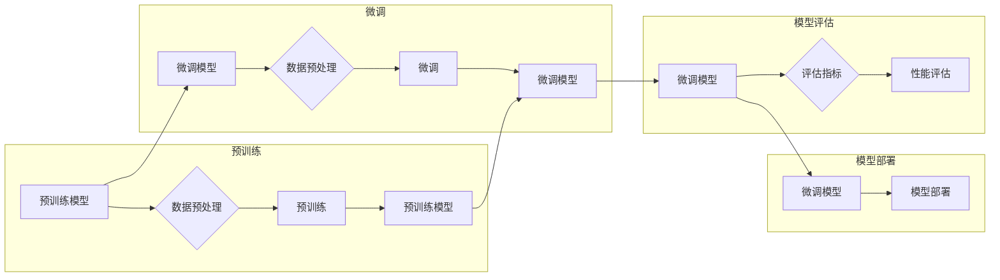

> 大模型开发, 微调, ticks, Layer Normalization, Transformer, 自然语言处理, 深度学习, 预训练

# 从零开始大模型开发与微调：ticks和Layer Normalization

大模型（Large Language Model，LLM）是近年来自然语言处理（Natural Language Processing，NLP）领域的一个重要突破。它们通过在庞大的文本语料库上进行预训练，学习到了丰富的语言知识和上下文理解能力，从而在下游任务中展现出惊人的性能。然而，大模型的开发与微调并非易事，其中涉及到许多复杂的技术细节。本文将深入探讨大模型开发中的两个关键概念：ticks和Layer Normalization，并从零开始介绍大模型的开发与微调过程。

## 1. 背景介绍

### 1.1 大模型的兴起

近年来，随着计算能力的提升和深度学习技术的进步，大模型在NLP领域取得了显著的进展。从最初的基于循环神经网络（RNN）的模型，到后来的基于Transformer的模型，大模型在多个NLP任务上都取得了突破性的成果。这些模型能够处理复杂的语言现象，生成流畅的自然语言文本，为各种应用场景提供了强大的支持。

### 1.2 大模型开发与微调

大模型的开发主要包括预训练和微调两个阶段。预训练阶段在大规模无标注数据上进行，使模型学习到通用的语言表示；微调阶段则在小规模标注数据上进行，使模型适应特定的下游任务。本文将重点关注微调阶段，特别是ticks和Layer Normalization这两个关键概念。

## 2. 核心概念与联系

### 2.1 Mermaid 流程图

以下是大模型开发与微调的Mermaid流程图：



### 2.2 核心概念

- **预训练模型**：在大规模无标注数据上进行训练，学习到通用的语言表示。
- **微调模型**：在预训练模型的基础上，使用小规模标注数据进一步训练，以适应特定任务。
- **数据预处理**：对输入数据进行清洗、分词、编码等处理。
- **性能评估**：使用评估指标（如准确率、F1分数等）评估模型性能。
- **模型部署**：将微调后的模型部署到实际应用场景。

## 3. 核心算法原理 & 具体操作步骤

### 3.1 算法原理概述

大模型微调的核心原理是在预训练模型的基础上，通过以下步骤进行：

1. 数据预处理：对输入数据进行清洗、分词、编码等处理。
2. 损失函数设计：根据具体任务设计合适的损失函数，如交叉熵损失、均方误差损失等。
3. 梯度下降优化：使用梯度下降等优化算法更新模型参数。
4. 模型评估：使用评估指标评估模型性能，并根据评估结果调整超参数。
5. 模型部署：将微调后的模型部署到实际应用场景。

### 3.2 算法步骤详解

1. **数据预处理**：
   - 清洗数据：去除噪声、无关信息等。
   - 分词：将文本分割成单词、短语等。
   - 编码：将单词、短语等转换为模型可处理的数字表示。

2. **损失函数设计**：
   - 交叉熵损失：适用于分类任务。
   - 均方误差损失：适用于回归任务。

3. **梯度下降优化**：
   - 选择合适的优化算法，如Adam、SGD等。
   - 设置学习率、批大小等超参数。
   - 计算梯度并更新模型参数。

4. **模型评估**：
   - 使用评估指标评估模型性能，如准确率、F1分数等。
   - 根据评估结果调整超参数，如学习率、批大小等。

5. **模型部署**：
   - 将微调后的模型部署到实际应用场景。
   - 提供模型接口，方便调用。

### 3.3 算法优缺点

**优点**：

- **简单高效**：只需少量标注数据，即可对预训练模型进行快速适配。
- **通用适用**：适用于各种NLP下游任务。
- **效果显著**：在多个NLP任务上取得了突破性的成果。

**缺点**：

- **依赖标注数据**：需要大量高质量标注数据。
- **迁移能力有限**：当目标任务与预训练数据的分布差异较大时，性能提升有限。

### 3.4 算法应用领域

大模型微调在以下领域取得了显著的应用成果：

- **文本分类**：情感分析、主题分类、意图识别等。
- **命名实体识别**：人名、地名、机构名等的识别。
- **关系抽取**：实体之间的关系抽取。
- **问答系统**：问答、对话等。
- **机器翻译**：将一种语言的文本翻译成另一种语言。

## 4. 数学模型和公式 & 详细讲解 & 举例说明

### 4.1 数学模型构建

大模型微调的数学模型主要包括以下几个部分：

- **输入表示**：将文本数据转换为模型可处理的数字表示。
- **模型架构**：Transformer、RNN等。
- **损失函数**：交叉熵损失、均方误差损失等。
- **优化算法**：Adam、SGD等。

### 4.2 公式推导过程

以下是一个简单的交叉熵损失函数的推导过程：

$$
L(y,\hat{y}) = -\sum_{i=1}^N y_i \log(\hat{y}_i)
$$

其中，$y$ 为真实标签，$\hat{y}$ 为模型预测结果。

### 4.3 案例分析与讲解

以文本分类任务为例，假设我们有一个包含两类的分类任务，真实标签为 $y \in \{0, 1\}$，模型预测结果为 $\hat{y} = \sigma(w^T x + b)$，其中 $w$ 为权重，$b$ 为偏置，$x$ 为输入特征，$\sigma$ 为Sigmoid函数。则交叉熵损失函数为：

$$
L(y,\hat{y}) = -[y\log \hat{y} + (1-y)\log (1-\hat{y})]
$$

## 5. 项目实践：代码实例和详细解释说明

### 5.1 开发环境搭建

1. 安装Python环境和PyTorch库。
2. 下载预训练模型和预训练数据。

### 5.2 源代码详细实现

以下是一个基于PyTorch的文本分类任务的简单实现：

```python
import torch
import torch.nn as nn
import torch.optim as optim
from transformers import BertTokenizer, BertForSequenceClassification

# 加载预训练模型
tokenizer = BertTokenizer.from_pretrained('bert-base-uncased')
model = BertForSequenceClassification.from_pretrained('bert-base-uncased', num_labels=2)

# 加载训练数据
train_data = ...  # 加载训练数据
dev_data = ...    # 加载验证数据
test_data = ...   # 加载测试数据

# 训练模型
optimizer = optim.AdamW(model.parameters(), lr=5e-5)
criterion = nn.CrossEntropyLoss()

def train_model(model, data_loader, optimizer, criterion, epochs):
    model.train()
    for epoch in range(epochs):
        for batch in data_loader:
            inputs, labels = batch
            inputs = tokenizer(inputs, padding=True, truncation=True, return_tensors="pt")
            labels = torch.tensor(labels)
            optimizer.zero_grad()
            outputs = model(**inputs)
            loss = criterion(outputs.logits, labels)
            loss.backward()
            optimizer.step()

# 训练和评估模型
train_model(model, train_data, optimizer, criterion, epochs=3)
```

### 5.3 代码解读与分析

- 加载预训练模型和分词器。
- 加载训练、验证和测试数据。
- 定义优化器和损失函数。
- 定义训练模型函数。
- 训练和评估模型。

### 5.4 运行结果展示

```python
# 预测测试集结果
test_predictions = model(**test_data)
test_loss = criterion(test_predictions.logits, test_data['labels'])

# 计算准确率
test_accuracy = (test_predictions.logits.argmax(dim=-1) == test_data['labels']).float().mean().item()

print(f"Test loss: {test_loss:.4f}")
print(f"Test accuracy: {test_accuracy:.4f}")
```

## 6. 实际应用场景

大模型微调在实际应用场景中具有广泛的应用，以下列举几个例子：

- **智能客服**：使用微调后的模型进行问答、对话等。
- **文本摘要**：使用微调后的模型生成摘要。
- **机器翻译**：使用微调后的模型进行翻译。
- **文本分类**：使用微调后的模型进行情感分析、主题分类等。

## 7. 工具和资源推荐

### 7.1 学习资源推荐

- 《Deep Learning for Natural Language Processing》
- 《NLP with Transformers》
- Hugging Face官方文档

### 7.2 开发工具推荐

- PyTorch
- TensorFlow
- Transformers库

### 7.3 相关论文推荐

- Transformer: Attention is All You Need
- BERT: Pre-training of Deep Bidirectional Transformers for Language Understanding
- GPT-3: Language Models are few-shot learners

## 8. 总结：未来发展趋势与挑战

### 8.1 研究成果总结

大模型微调在NLP领域取得了显著的成果，为各种应用场景提供了强大的支持。

### 8.2 未来发展趋势

- **模型规模增大**：更大规模的模型将具有更丰富的语言知识，从而在下游任务中取得更好的效果。
- **多模态融合**：将文本信息与其他模态信息（如图像、语音等）进行融合，提高模型的语义理解能力。
- **可解释性增强**：提高模型的可解释性，使其决策过程更加透明。

### 8.3 面临的挑战

- **计算资源**：大模型的训练和推理需要大量的计算资源。
- **数据隐私**：如何保护用户隐私是一个重要挑战。
- **模型可解释性**：提高模型的可解释性，使其决策过程更加透明。

### 8.4 研究展望

大模型微调技术将继续发展，为NLP领域带来更多创新成果，并在更多应用场景中得到广泛应用。

## 9. 附录：常见问题与解答

**Q1：大模型微调是否适用于所有NLP任务？**

A：大模型微调适用于大多数NLP任务，但对于一些特定领域的任务，可能需要针对特定领域数据进行预训练。

**Q2：如何选择合适的学习率？**

A：学习率的选择需要根据具体任务和数据特点进行调整，通常从较小的值开始尝试，如1e-5。

**Q3：如何防止模型过拟合？**

A：可以使用正则化、Dropout、Early Stopping等方法防止模型过拟合。

**Q4：如何提高模型的可解释性？**

A：可以使用注意力机制、特征可视化等方法提高模型的可解释性。

作者：禅与计算机程序设计艺术 / Zen and the Art of Computer Programming