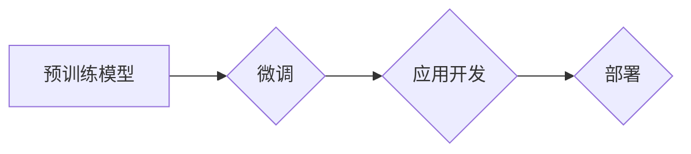

# 大规模语言模型从理论到实践 LangChain框架核心模块

> 关键词：大规模语言模型，LangChain，框架，NLP，编程，微调，应用

## 1. 背景介绍

随着深度学习技术的飞速发展，大规模语言模型（Large Language Models，LLMs）已经成为自然语言处理（Natural Language Processing，NLP）领域的热点。LLMs在文本生成、机器翻译、问答系统等领域取得了显著的成果，但同时也面临着模型复杂度高、部署困难等问题。为了解决这些问题，LangChain框架应运而生。本文将深入探讨LangChain框架的核心模块，从理论到实践，帮助读者全面理解LLMs的应用。

### 1.1 问题的由来

LLMs在训练过程中需要大量计算资源和存储空间，部署也相对复杂。此外，LLMs的应用场景多样，需要根据不同的应用场景进行调整和优化。LangChain框架旨在解决这些问题，提供一个简单易用的LLMs应用开发平台。

### 1.2 研究现状

目前，LangChain框架已经成为了LLMs应用开发的重要工具。它支持多种LLMs，如GPT、BERT等，并提供了一系列实用的功能，如命令行接口、Web API、插件系统等。

### 1.3 研究意义

LangChain框架的研究意义在于：

1. 降低LLMs应用开发的门槛，让更多开发者能够利用LLMs技术。
2. 提高LLMs应用的部署效率，降低成本。
3. 促进LLMs技术的创新和应用。

### 1.4 本文结构

本文将按照以下结构展开：

- 第2部分介绍LangChain框架的核心概念与联系。
- 第3部分讲解LangChain框架的核心算法原理和操作步骤。
- 第4部分介绍LangChain框架的数学模型和公式。
- 第5部分通过代码实例展示LangChain框架的应用。
- 第6部分探讨LangChain框架的实际应用场景。
- 第7部分展望LangChain框架的未来发展趋势。
- 第8部分总结研究成果和面临挑战。
- 第9部分提供常见问题与解答。

## 2. 核心概念与联系

### 2.1 核心概念

- **大规模语言模型（LLMs）**：基于深度学习技术构建的、能够理解和生成自然语言的大规模模型。
- **LangChain**：一个用于构建LLMs应用的框架，提供一系列实用的功能和工具。
- **微调（Fine-tuning）**：在预训练模型的基础上，针对特定任务进行训练，以提高模型在目标任务上的性能。
- **应用开发**：利用LLMs技术构建实际应用的过程。

### 2.2 架构图

以下是一个简化的LangChain框架架构图：



其中，预训练模型是LangChain框架的基础，通过微调可以针对不同任务进行优化，最终应用于实际场景并部署。

## 3. 核心算法原理 & 具体操作步骤

### 3.1 算法原理概述

LangChain框架的核心算法原理如下：

1. 预训练：在大量无标签文本数据上训练LLMs，使其具备基本的语言理解能力。
2. 微调：在特定任务的标注数据上对LLMs进行微调，以适应特定任务的需求。
3. 应用开发：利用微调后的LLMs构建实际应用。
4. 部署：将应用部署到生产环境，提供服务。

### 3.2 算法步骤详解

1. **预训练**：选择合适的LLMs，如BERT、GPT等，在大量无标签文本数据上训练。
2. **微调**：在特定任务的标注数据上对LLMs进行微调，调整模型参数以提高模型在目标任务上的性能。
3. **应用开发**：利用微调后的LLMs开发实际应用，如问答系统、文本生成等。
4. **部署**：将应用部署到生产环境，提供服务。

### 3.3 算法优缺点

**优点**：

- **易用性**：LangChain框架提供了简单易用的API，降低了LLMs应用开发的门槛。
- **灵活性**：LangChain框架支持多种LLMs和微调方法，可以适应不同的应用场景。
- **高效性**：LangChain框架提供了多种优化工具，如模型压缩、量化等，以提高应用效率。

**缺点**：

- **资源消耗**：LLMs训练和微调需要大量计算资源和存储空间。
- **部署复杂**：将LLMs应用部署到生产环境相对复杂。

### 3.4 算法应用领域

LangChain框架可以应用于以下领域：

- **文本生成**：如自动写作、机器翻译、对话系统等。
- **文本分类**：如情感分析、主题分类、垃圾邮件检测等。
- **问答系统**：如自动问答、智能客服等。
- **其他NLP任务**：如命名实体识别、机器翻译、文本摘要等。

## 4. 数学模型和公式 & 详细讲解 & 举例说明

### 4.1 数学模型构建

LLMs通常使用深度神经网络（Deep Neural Networks，DNNs）进行建模。以下是一个简化的DNN模型结构：

$$
y = f(WL(x) + b)
$$

其中，$W$ 是权重矩阵，$L$ 是激活函数，$x$ 是输入数据，$b$ 是偏置项，$y$ 是输出结果。

### 4.2 公式推导过程

以BERT模型为例，其数学模型如下：

$$
\text{logits} = \text{MLP}(W_{\text{cls}}\text{[CLS}:H, [SEP]:H, [CLS]:H, [SEP]:H, [CLS]:H, [SEP]:H, \text{input_ids}, [SEP]:H, \text{token_type_ids}, [SEP]:H, \text{attention_mask}, [SEP]:H])
$$

其中，$[CLS]$ 和 $[SEP]$ 是特殊的token，用于表示句子开头和结尾。

### 4.3 案例分析与讲解

以下是一个使用BERT模型进行文本分类的案例：

1. **输入**：一段文本数据。
2. **预训练**：使用BERT模型在大量无标签文本数据上进行预训练。
3. **微调**：在特定任务的标注数据上对BERT模型进行微调。
4. **输出**：微调后的模型对输入文本进行分类。

## 5. 项目实践：代码实例和详细解释说明

### 5.1 开发环境搭建

1. 安装Python环境（如Anaconda）。
2. 安装transformers库：`pip install transformers`。
3. 安装torch库：`pip install torch`。

### 5.2 源代码详细实现

以下是一个使用transformers库和torch库进行文本分类的简单示例：

```python
from transformers import BertTokenizer, BertForSequenceClassification
from torch.utils.data import DataLoader, TensorDataset
from torch.optim import AdamW

# 加载预训练模型和分词器
tokenizer = BertTokenizer.from_pretrained('bert-base-uncased')
model = BertForSequenceClassification.from_pretrained('bert-base-uncased')

# 准备数据
texts = [...]  # 文本数据
labels = [...]  # 标签数据

# 编码数据
encoded_data = tokenizer(texts, padding=True, truncation=True, return_tensors="pt")

# 创建数据集
dataset = TensorDataset(encoded_data['input_ids'], encoded_data['attention_mask'], torch.tensor(labels))

# 创建数据加载器
dataloader = DataLoader(dataset, batch_size=16, shuffle=True)

# 定义优化器
optimizer = AdamW(model.parameters(), lr=5e-5)

# 训练模型
model.train()
for epoch in range(3):
    for batch in dataloader:
        optimizer.zero_grad()
        outputs = model(**batch)
        loss = outputs.loss
        loss.backward()
        optimizer.step()

# 保存模型
model.save_pretrained("my_bert_model")
```

### 5.3 代码解读与分析

以上代码展示了如何使用transformers库和torch库进行文本分类的基本流程：

1. 加载预训练模型和分词器。
2. 准备文本数据和标签数据。
3. 对数据进行编码，并创建数据集。
4. 创建数据加载器。
5. 定义优化器。
6. 训练模型。
7. 保存模型。

## 6. 实际应用场景

### 6.1 自动写作

LangChain框架可以用于自动写作，如生成新闻稿、文章、报告等。通过微调LLMs，可以使其在特定领域生成高质量的文本内容。

### 6.2 机器翻译

LangChain框架可以用于机器翻译，如将英语翻译成中文、法语等。通过微调LLMs，可以使其在特定领域实现高精度翻译。

### 6.3 智能客服

LangChain框架可以用于智能客服，如自动回答用户问题、提供个性化推荐等。通过微调LLMs，可以使其更好地理解用户需求，提供更准确的答复。

### 6.4 其他应用场景

除了上述应用场景外，LangChain框架还可以应用于以下领域：

- 文本摘要
- 命名实体识别
- 情感分析
- 问答系统

## 7. 工具和资源推荐

### 7.1 学习资源推荐

- 《深度学习与自然语言处理》
- 《自然语言处理入门》
- Hugging Face官网：https://huggingface.co/

### 7.2 开发工具推荐

- PyTorch：https://pytorch.org/
- Transformers库：https://github.com/huggingface/transformers

### 7.3 相关论文推荐

- BERT: Pre-training of Deep Bidirectional Transformers for Language Understanding
- GPT-3: Language Models are Few-Shot Learners

## 8. 总结：未来发展趋势与挑战

### 8.1 研究成果总结

本文介绍了LangChain框架的核心模块，从理论到实践，帮助读者全面理解LLMs的应用。通过实例代码展示了如何使用LangChain框架进行文本分类等任务，并探讨了LangChain框架的实际应用场景。

### 8.2 未来发展趋势

- LLMs的规模将继续扩大，模型参数量将达到数十亿甚至上千亿。
- 微调方法将更加高效，降低对标注数据的依赖。
- LangChain框架将支持更多LLMs和任务，提供更多实用功能。
- LLMs将在更多领域得到应用，如医疗、金融、教育等。

### 8.3 面临的挑战

- LLMs的资源和计算需求巨大，需要更强大的硬件支持。
- LLMs的可解释性和安全性问题亟待解决。
- LLMs的应用需要遵守相关伦理规范。

### 8.4 研究展望

- 开发更加高效、可解释、安全的LLMs。
- 探索LLMs在更多领域的应用。
- 促进LLMs技术的产业化进程。

## 9. 附录：常见问题与解答

**Q1：什么是LangChain框架？**

A1：LangChain框架是一个用于构建LLMs应用的框架，提供了一系列实用的功能和工具，如命令行接口、Web API、插件系统等。

**Q2：LangChain框架支持哪些LLMs？**

A2：LangChain框架支持多种LLMs，如BERT、GPT等。

**Q3：如何使用LangChain框架进行微调？**

A3：使用LangChain框架进行微调，首先需要加载预训练模型和分词器，然后准备数据，接着进行数据编码和创建数据集，最后进行模型训练和评估。

**Q4：LangChain框架有哪些优势？**

A4：LangChain框架的优势包括易用性、灵活性、高效性等。

**Q5：LangChain框架有哪些应用场景？**

A5：LangChain框架的应用场景包括文本生成、机器翻译、智能客服等。

---

作者：禅与计算机程序设计艺术 / Zen and the Art of Computer Programming