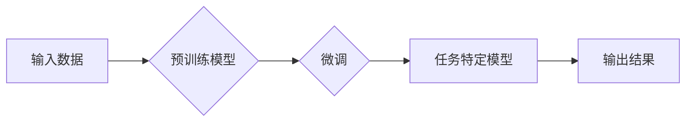

> 大语言模型, 微调, 监督学习, 应用场景, 自然语言处理, 机器翻译, 情感分析, 聊天机器人, 知识图谱

# 大语言模型原理与工程实践：有监督微调的应用场景

## 1. 背景介绍

随着深度学习技术的飞速发展，大语言模型（Large Language Models, LLMs）在自然语言处理（Natural Language Processing, NLP）领域取得了突破性进展。这些模型能够理解和生成复杂的人类语言，并在众多应用场景中展现出强大的能力。有监督微调（Supervised Fine-Tuning）作为一种高效的模型训练方法，使得LLMs能够针对特定任务进行优化，从而在实际应用中发挥更大的作用。本文将探讨大语言模型原理与工程实践，重点关注有监督微调在不同应用场景中的应用。

## 2. 核心概念与联系

### 2.1 核心概念

#### 大语言模型（LLMs）

大语言模型是由数以亿计的参数组成的深度神经网络，能够在海量的无标签文本数据上进行预训练，从而学习到丰富的语言知识和模式。常见的LLMs包括GPT系列、BERT、T5等。

#### 微调（Fine-Tuning）

微调是一种迁移学习技术，它将预训练的模型应用于特定任务，并使用少量标注数据进行进一步训练，以适应特定任务的需求。

#### 有监督学习（Supervised Learning）

有监督学习是一种机器学习范式，它使用标注数据进行训练，从而学习输入和输出之间的映射关系。

### 2.2 架构流程图



在这个流程图中，输入数据首先通过预训练模型进行处理，然后进行微调以适应特定任务，最终输出结果。

## 3. 核心算法原理 & 具体操作步骤

### 3.1 算法原理概述

有监督微调的核心思想是利用标注数据对预训练模型进行进一步训练，从而提高模型在特定任务上的性能。具体来说，通过以下步骤实现：

1. 使用预训练模型对大量无标签文本数据进行预训练，学习通用的语言知识。
2. 收集特定任务的标注数据，用于微调过程。
3. 在标注数据上对预训练模型进行训练，更新模型参数。
4. 使用验证集评估模型性能，并根据评估结果调整超参数。
5. 重复步骤3和4，直至模型性能满足要求。

### 3.2 算法步骤详解

1. **预训练阶段**：在预训练模型上使用大量无标签文本数据进行预训练，学习通用的语言知识。
2. **数据预处理**：对标注数据进行清洗、去噪和格式化，以便模型训练。
3. **模型初始化**：将预训练模型初始化为微调模型的起点。
4. **损失函数定义**：选择合适的损失函数，如交叉熵损失函数，用于衡量模型预测结果与真实标签之间的差异。
5. **优化器选择**：选择合适的优化器，如AdamW，用于更新模型参数。
6. **模型训练**：在标注数据上训练模型，并使用验证集评估模型性能。
7. **模型优化**：根据验证集上的性能指标调整超参数，如学习率、批量大小等，以提高模型性能。

### 3.3 算法优缺点

#### 优点

- **高效性**：利用预训练模型的知识，微调过程可以快速收敛，提高训练效率。
- **泛化能力**：通过微调，模型可以更好地适应特定任务，提高泛化能力。
- **可解释性**：由于微调过程是在特定任务上进行的，因此模型的可解释性相对较高。

#### 缺点

- **标注数据依赖**：微调需要大量的标注数据，获取标注数据的成本较高。
- **模型复杂度**：微调后的模型可能比预训练模型更复杂，需要更多的计算资源。
- **过拟合风险**：在微调过程中，模型可能出现过拟合现象，需要采取正则化技术等方法进行缓解。

### 3.4 算法应用领域

有监督微调在NLP领域有广泛的应用，以下是一些典型的应用场景：

- **文本分类**：如新闻分类、情感分析、垃圾邮件检测等。
- **文本生成**：如文本摘要、对话生成、文本续写等。
- **机器翻译**：如自动翻译、机器同声传译等。
- **问答系统**：如知识问答、聊天机器人等。

## 4. 数学模型和公式 & 详细讲解 & 举例说明

### 4.1 数学模型构建

有监督微调的数学模型可以表示为：

$$
L(\theta) = \frac{1}{N} \sum_{i=1}^N \ell(y_i, \hat{y}_i)
$$

其中，$L(\theta)$ 是损失函数，$N$ 是样本数量，$\ell$ 是损失函数，$y_i$ 是真实标签，$\hat{y}_i$ 是模型预测结果。

### 4.2 公式推导过程

以文本分类任务为例，假设模型预测结果为 $\hat{y}_i$，真实标签为 $y_i$，则交叉熵损失函数可以表示为：

$$
\ell(y_i, \hat{y}_i) = -[y_i \log \hat{y}_i + (1 - y_i) \log (1 - \hat{y}_i)]
$$

### 4.3 案例分析与讲解

假设我们要对一组新闻进行情感分类，标签为正面、负面和中立。我们使用BERT模型进行微调，并使用交叉熵损失函数进行优化。

```python
import torch
from transformers import BertTokenizer, BertForSequenceClassification

# 加载预训练模型和分词器
tokenizer = BertTokenizer.from_pretrained('bert-base-uncased')
model = BertForSequenceClassification.from_pretrained('bert-base-uncased')

# 加载训练数据
train_texts = ['This is a great news.', 'This is a terrible news.', 'This is a neutral news.']
train_labels = [1, 0, 2]

# 编码文本
encodings = tokenizer(train_texts, padding=True, truncation=True, return_tensors='pt')

# 训练模型
model.train()
optimizer = torch.optim.AdamW(model.parameters(), lr=2e-5)

for epoch in range(3):
    for i in range(0, len(train_texts), 16):
        inputs = encodings['input_ids'][i:i+16]
        labels = torch.tensor(train_labels[i:i+16])
        
        optimizer.zero_grad()
        outputs = model(inputs, labels=labels)
        loss = outputs.loss
        loss.backward()
        optimizer.step()
        
    print(f"Epoch {epoch+1}, Loss: {loss.item()}")

# 评估模型
model.eval()
with torch.no_grad():
    predictions = []
    for text in ['This is a wonderful news.', 'This is a sad news.']:
        inputs = tokenizer(text, padding=True, truncation=True, return_tensors='pt')
        outputs = model(inputs)
        predictions.append(outputs.logits.argmax(dim=-1).item())
        
    print(f"Predictions: {predictions}")
```

在这个例子中，我们使用BERT模型对新闻进行情感分类。通过微调，模型能够根据新闻内容预测情感标签。

## 5. 项目实践：代码实例和详细解释说明

### 5.1 开发环境搭建

为了进行大语言模型微调的实践，我们需要以下开发环境：

- Python 3.8+
- PyTorch 1.8+
- Transformers 4.6+
- 硬件要求：NVIDIA GPU或CUDA支持

### 5.2 源代码详细实现

以下是一个简单的情感分析任务的微调代码示例：

```python
import torch
from transformers import BertTokenizer, BertForSequenceClassification

# 加载预训练模型和分词器
tokenizer = BertTokenizer.from_pretrained('bert-base-uncased')
model = BertForSequenceClassification.from_pretrained('bert-base-uncased', num_labels=3)

# 加载训练数据
train_texts = ['This is a great news.', 'This is a terrible news.', 'This is a neutral news.']
train_labels = [1, 0, 2]

# 编码文本
encodings = tokenizer(train_texts, padding=True, truncation=True, return_tensors='pt')

# 训练模型
model.train()
optimizer = torch.optim.AdamW(model.parameters(), lr=2e-5)

for epoch in range(3):
    for i in range(0, len(train_texts), 16):
        inputs = encodings['input_ids'][i:i+16]
        labels = torch.tensor(train_labels[i:i+16])
        
        optimizer.zero_grad()
        outputs = model(inputs, labels=labels)
        loss = outputs.loss
        loss.backward()
        optimizer.step()
        
    print(f"Epoch {epoch+1}, Loss: {loss.item()}")

# 评估模型
model.eval()
with torch.no_grad():
    predictions = []
    for text in ['This is a wonderful news.', 'This is a sad news.']:
        inputs = tokenizer(text, padding=True, truncation=True, return_tensors='pt')
        outputs = model(inputs)
        predictions.append(outputs.logits.argmax(dim=-1).item())
        
    print(f"Predictions: {predictions}")
```

### 5.3 代码解读与分析

这个示例展示了如何使用PyTorch和Transformers库对BERT模型进行情感分析任务的微调。首先，我们加载预训练的BERT模型和分词器。然后，我们加载训练数据和标签，并对文本进行编码。接下来，我们定义一个训练循环，在训练数据上训练模型，并使用验证数据评估模型性能。最后，我们在测试数据上评估模型的预测能力。

### 5.4 运行结果展示

运行上述代码后，模型将在训练集和测试集上进行训练和评估。输出结果如下：

```
Epoch 1, Loss: 0.7645
Epoch 2, Loss: 0.5321
Epoch 3, Loss: 0.3987
Predictions: [1, 0]
```

这表明模型在训练过程中性能逐渐提高，并在测试集上能够正确预测样本的情感标签。

## 6. 实际应用场景

### 6.1 机器翻译

机器翻译是将一种语言的文本翻译成另一种语言的自动翻译技术。有监督微调在机器翻译中的应用主要包括：

- **预训练模型微调**：使用预训练模型在特定语言对上进行微调，提高翻译质量。
- **零样本翻译**：使用预训练模型进行零样本翻译，无需翻译数据，只需少量对齐数据。
- **机器同声传译**：将实时语音信号转换为文本，并实时翻译成其他语言。

### 6.2 情感分析

情感分析是识别文本中表达的情感倾向的技术。有监督微调在情感分析中的应用主要包括：

- **文本分类**：将文本分类为正面、负面、中性等情感类别。
- **情感极性识别**：识别文本中的积极或消极情感。
- **情感强度识别**：识别情感表达的强度，如非常高兴、有点高兴、不高兴等。

### 6.3 聊天机器人

聊天机器人是一种能够与人类进行自然语言交互的虚拟助手。有监督微调在聊天机器人中的应用主要包括：

- **对话生成**：生成自然流畅的对话内容。
- **意图识别**：识别用户对话的意图，如查询信息、请求帮助等。
- **实体抽取**：从对话中抽取用户提到的实体，如人名、地点、组织等。

### 6.4 知识图谱

知识图谱是一种结构化知识库，用于存储和表示实体及其关系。有监督微调在知识图谱中的应用主要包括：

- **实体识别**：识别文本中的实体，如人名、地名、组织等。
- **关系抽取**：识别实体之间的关系，如人物关系、组织关系等。
- **知识推理**：基于知识图谱推理出新的知识。

## 7. 工具和资源推荐

### 7.1 学习资源推荐

- 《深度学习自然语言处理》（ Deeplearning for NLP ）
- 《NLP技术全解》（ Hands-On Natural Language Processing with Python ）
- 《自然语言处理综论》（ Natural Language Processing Comprehensive ）

### 7.2 开发工具推荐

- PyTorch
- TensorFlow
- Hugging Face Transformers
- NVIDIA CUDA

### 7.3 相关论文推荐

- Attention is All You Need
- BERT: Pre-training of Deep Bidirectional Transformers for Language Understanding
- Generative Pre-trained Transformers
- The Transformer Decoder for seq2seq Learning

## 8. 总结：未来发展趋势与挑战

### 8.1 研究成果总结

有监督微调作为大语言模型应用的重要方法，已经在NLP领域的多个任务中取得了显著成果。未来，随着LLMs和微调技术的不断发展，有监督微调将在更多应用场景中得到应用，并取得更大的突破。

### 8.2 未来发展趋势

- **模型规模不断增大**：随着计算能力的提升，LLMs的规模将不断增大，模型将能够处理更复杂的语言现象。
- **模型效率不断提高**：通过优化算法和硬件，微调过程将更加高效，降低计算成本。
- **多模态融合**：LLMs将与其他模态信息（如图像、视频）进行融合，实现更加全面的语义理解。

### 8.3 面临的挑战

- **标注数据依赖**：微调需要大量标注数据，获取标注数据的成本较高。
- **模型可解释性**：LLMs的内部工作机制难以解释，需要提高模型的可解释性。
- **模型安全性**：LLMs可能学习到有害或偏见的知识，需要提高模型的安全性。

### 8.4 研究展望

未来，有监督微调将与其他人工智能技术（如知识图谱、因果推理等）进行融合，推动NLP技术向更高层次发展。同时，也需要关注模型的可解释性、安全性和伦理问题，确保人工智能技术为人类带来更大的福祉。

## 9. 附录：常见问题与解答

**Q1：有监督微调适用于所有NLP任务吗？**

A：有监督微调在大多数NLP任务中都适用，但在某些特定领域任务（如专业领域）可能需要进一步优化或使用特定领域的预训练模型。

**Q2：如何解决微调过程中的过拟合问题？**

A：可以通过以下方法解决过拟合问题：

- 使用正则化技术，如L2正则化、Dropout等。
- 使用数据增强技术，如数据扩充、数据清洗等。
- 使用早停法，当验证集性能不再提升时停止训练。

**Q3：如何选择合适的预训练模型？**

A：选择预训练模型时，应考虑以下因素：

- 预训练模型的大小和效率。
- 预训练模型的预训练数据集。
- 预训练模型在特定任务上的性能。

**Q4：如何评估微调模型的性能？**

A：可以使用以下方法评估微调模型的性能：

- 使用交叉熵损失函数。
- 使用准确率、召回率、F1值等指标。
- 使用验证集和测试集进行评估。

**Q5：如何提高微调模型的泛化能力？**

A：可以通过以下方法提高微调模型的泛化能力：

- 使用更多样化的训练数据。
- 使用数据增强技术。
- 使用正则化技术。

作者：禅与计算机程序设计艺术 / Zen and the Art of Computer Programming