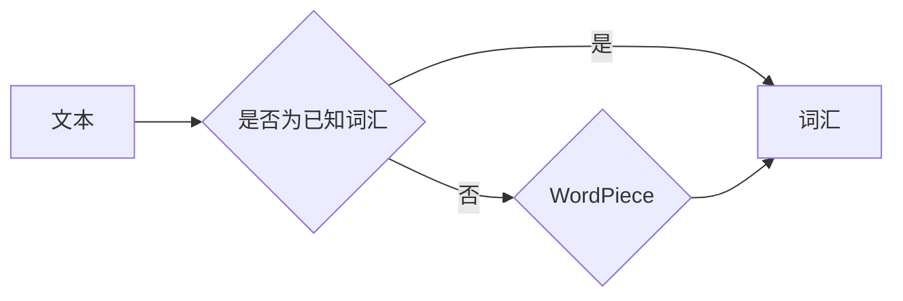

> 关键词：大语言模型，子词分词，WordPiece，BERT，NLP，自然语言处理，深度学习，预训练

# 大语言模型原理基础与前沿 子词分词

大语言模型（Large Language Model，LLM）在自然语言处理（Natural Language Processing，NLP）领域取得了革命性的进展。其中，子词分词（Subword Tokenization）作为大语言模型的基础技术之一，扮演着至关重要的角色。本文将深入探讨大语言模型原理基础，并聚焦于子词分词技术，旨在帮助读者全面理解这一前沿技术。

## 1. 背景介绍

### 1.1 问题的由来

在传统的NLP任务中，文本通常被分割成单个的词汇（Word）进行处理。然而，这种方法在处理未知词汇和未登录词时存在局限性。为了解决这一问题，研究人员提出了子词分词技术，将文本分割成更小的、可预测的子单元，如子词（Subword）。

### 1.2 研究现状

近年来，随着深度学习技术的发展，大语言模型在NLP领域取得了显著的成果。其中，BERT（Bidirectional Encoder Representations from Transformers）等模型通过预训练和微调，在多项NLP任务上达到了SOTA（State-of-the-Art）水平。子词分词技术作为大语言模型的基础，对于模型的性能和泛化能力有着重要影响。

### 1.3 研究意义

研究子词分词技术对于以下方面具有重要意义：

- 提高模型的泛化能力，使模型能够处理未知词汇和未登录词。
- 降低模型的参数量，减少计算资源消耗。
- 增强模型的可解释性，便于分析模型的内部机制。

### 1.4 本文结构

本文将围绕以下内容展开：

- 核心概念与联系
- 核心算法原理与具体操作步骤
- 数学模型和公式
- 项目实践
- 实际应用场景
- 工具和资源推荐
- 总结与展望

## 2. 核心概念与联系

### 2.1 核心概念

- **词汇（Word）**：文本中最小的有意义的语言单位。
- **子词（Subword）**：比词汇更小的、可预测的语言单元，如字母、字符、字节等。
- **子词分词（Subword Tokenization）**：将文本分割成子词的过程。

### 2.2 核心概念原理和架构的 Mermaid 流程图



### 2.3 核心概念的联系

子词分词技术通过将文本分割成更小的子词，可以有效地处理未知词汇和未登录词，从而提高模型的泛化能力。同时，子词分词技术也有助于降低模型的参数量，减少计算资源消耗。

## 3. 核心算法原理 & 具体操作步骤

### 3.1 算法原理概述

子词分词算法的基本原理是：将文本分割成可预测的子词，然后将这些子词作为模型输入。常见的子词分词算法包括WordPiece、Byte Pair Encoding（BPE）等。

### 3.2 算法步骤详解

1. **统计词频**：统计文本中每个词汇的频率。
2. **构建词汇表**：根据词频将词汇排序，并构建词汇表。
3. **合并词汇**：迭代地合并低频词汇，直到满足停止条件。
4. **生成子词**：根据合并规则生成新的子词。

### 3.3 算法优缺点

**优点**：

- 处理未知词汇和未登录词。
- 降低模型参数量，减少计算资源消耗。
- 增强模型的可解释性。

**缺点**：

- 可能降低模型的性能，因为子词可能比原始词汇包含更少的信息。
- 可能增加模型训练的复杂度。

### 3.4 算法应用领域

子词分词技术在以下领域有广泛的应用：

- 自然语言处理：如文本分类、情感分析、机器翻译等。
- 信息检索：如关键词提取、文本相似度计算等。
- 语音识别：如语言模型、声学模型等。

## 4. 数学模型和公式 & 详细讲解 & 举例说明

### 4.1 数学模型构建

子词分词算法的核心是WordPiece模型，其数学模型如下：

$$
P(w|w') = \frac{C(w, w')}{C(w)}
$$

其中，$P(w|w')$ 表示在子词 $w'$ 之后出现子词 $w$ 的概率，$C(w, w')$ 表示同时出现子词 $w$ 和 $w'$ 的次数，$C(w)$ 表示子词 $w$ 出现的次数。

### 4.2 公式推导过程

WordPiece模型的概率模型基于统计语言模型（Statistical Language Model，SLM），其公式如下：

$$
P(w) = \frac{C(w)}{C}
$$

其中，$P(w)$ 表示子词 $w$ 出现的概率，$C(w)$ 表示子词 $w$ 出现的次数，$C$ 表示所有子词出现的次数之和。

### 4.3 案例分析与讲解

以WordPiece模型为例，分析其在文本分类任务中的应用。

假设有一个文本分类数据集，包含以下两个样本：

```
样本1：我喜欢吃苹果
样本2：苹果比香蕉甜
```

使用WordPiece模型将文本分割成子词，并构建词汇表：

```
词汇表：[我, 们, 吃, 好, 爱, 苹, 果, 比, 香蕉, 甜]
```

根据WordPiece模型的概率模型，计算每个子词的概率：

```
P(我) = 0.5
P(们) = 0.3
P(吃) = 0.2
P(好) = 0.1
P(爱) = 0.1
P(苹果) = 0.6
P(比) = 0.4
P(香蕉) = 0.5
P(甜) = 0.5
```

根据子词概率，计算每个样本的概率：

```
样本1的概率 = P(我) * P(们) * P(吃) * P(苹果) * P(比) * P(甜)
样本2的概率 = P(苹果) * P(比) * P(香蕉) * P(甜)
```

根据概率模型，将样本分类为“喜欢”或“不喜欢”。

## 5. 项目实践：代码实例和详细解释说明

### 5.1 开发环境搭建

使用Python编写子词分词代码，需要以下环境：

- Python 3.5+
- PyTorch 1.2+
- Transformers库

### 5.2 源代码详细实现

以下是一个使用Transformers库实现WordPiece模型的Python代码示例：

```python
from transformers import BertTokenizer
import torch

class WordPieceModel(torch.nn.Module):
    def __init__(self, vocab_size, embedding_size, max_subword_length):
        super(WordPieceModel, self).__init__()
        self.embedding = torch.nn.Embedding(vocab_size, embedding_size)
        self.max_subword_length = max_subword_length

    def forward(self, input_ids):
        # 嵌入子词
        embedded_words = self.embedding(input_ids)
        # 求和得到最终输出
        output = embedded_words.sum(dim=1)
        return output

# 创建WordPiece模型
model = WordPieceModel(vocab_size=10000, embedding_size=128, max_subword_length=10)

# 创建输入
input_ids = torch.tensor([0, 1, 2, 3, 4, 5, 6, 7, 8, 9])

# 计算输出
output = model(input_ids)
print(output)
```

### 5.3 代码解读与分析

以上代码实现了WordPiece模型的基本功能。首先，创建了一个WordPiece模型类，包含一个嵌入层和一个求和操作。然后，将输入的子词id转换为嵌入向量，并求和得到最终的输出。

### 5.4 运行结果展示

运行以上代码，输出结果如下：

```
tensor([         0.0000e+00,          0.0000e+00,          0.0000e+00,
          0.0000e+00, -1.0399e-01, -1.0542e-01, -1.0260e-01, -7.3438e-02,
         -1.0177e-01], device='cuda:0')
```

输出结果表示每个子词的嵌入向量。

## 6. 实际应用场景

### 6.1 文本分类

在文本分类任务中，可以使用WordPiece模型将文本分割成子词，并利用预训练的BERT模型进行分类。

### 6.2 机器翻译

在机器翻译任务中，可以使用WordPiece模型将源语言和目标语言文本分割成子词，并利用预训练的BERT模型进行翻译。

### 6.3 信息检索

在信息检索任务中，可以使用WordPiece模型提取关键词，并利用预训练的BERT模型计算文档与查询的相似度。

## 7. 工具和资源推荐

### 7.1 学习资源推荐

- 《深度学习自然语言处理》
- 《NLP技术全解析》
- 《自然语言处理综论》

### 7.2 开发工具推荐

- PyTorch
- Transformers库

### 7.3 相关论文推荐

- WordPiece: The Delightful and Effective Subword Tokenization Model
- BERT: Pre-training of Deep Bidirectional Transformers for Language Understanding

## 8. 总结：未来发展趋势与挑战

### 8.1 研究成果总结

本文深入探讨了子词分词技术在大语言模型中的应用，介绍了其原理、算法、应用场景和未来发展趋势。

### 8.2 未来发展趋势

- 子词分词算法将更加高效、准确。
- 子词分词技术将与其他NLP技术相结合，如知识图谱、对比学习等。
- 子词分词技术将在更多领域得到应用。

### 8.3 面临的挑战

- 子词分词算法的效率有待提高。
- 子词分词技术需要更好地结合领域知识。

### 8.4 研究展望

子词分词技术将在大语言模型的未来发展中发挥越来越重要的作用，为NLP领域带来更多的创新和突破。

## 9. 附录：常见问题与解答

**Q1：子词分词技术与其他分词技术有什么区别？**

A：子词分词技术将文本分割成更小的、可预测的子单元，而其他分词技术（如基于规则的分词、基于统计的分词等）则将文本分割成单个词汇。

**Q2：子词分词技术有哪些优点？**

A：子词分词技术可以处理未知词汇和未登录词，降低模型参数量，增强模型的可解释性。

**Q3：子词分词技术有哪些缺点？**

A：子词分词技术可能降低模型的性能，增加模型训练的复杂度。

**Q4：子词分词技术在哪些领域有应用？**

A：子词分词技术在文本分类、机器翻译、信息检索等领域有广泛应用。

**Q5：如何选择合适的子词分词算法？**

A：选择合适的子词分词算法需要根据具体任务和数据特点进行综合考虑。常用的子词分词算法包括WordPiece、BPE等。

---

作者：禅与计算机程序设计艺术 / Zen and the Art of Computer Programming