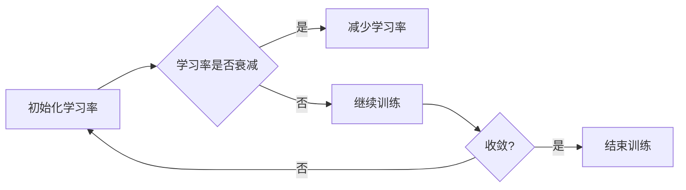

# 学习率衰减Learning Rate Decay原理与代码实例讲解

> 关键词：学习率衰减，机器学习，深度学习，优化算法，神经网络，梯度下降

## 1. 背景介绍

在深度学习中，学习率的设置对模型的训练效果有着至关重要的作用。学习率决定了每次参数更新的步长，过大的学习率可能导致模型无法收敛，而过小则可能导致训练过程缓慢。学习率衰减（Learning Rate Decay）是解决这一问题的一种常用策略，它通过逐步减少学习率，帮助模型更好地收敛到最优解。本文将深入探讨学习率衰减的原理、实现方法以及代码实例。

## 2. 核心概念与联系

### 2.1 核心概念

#### 学习率（Learning Rate）

学习率是优化算法中的一个关键参数，它决定了模型参数更新的步长。在梯度下降算法中，学习率直接影响着参数更新的方向和速度。

#### 学习率衰减（Learning Rate Decay）

学习率衰减是指在训练过程中，随着训练的进行逐渐减少学习率的过程。其目的是防止模型在训练初期学习过快，而在训练后期学习过慢。

### 2.2 Mermaid流程图



### 2.3 核心概念联系

学习率衰减是优化算法的一种调节策略，它通过调整学习率来影响模型参数的更新速度，进而影响模型的收敛速度和最终性能。

## 3. 核心算法原理 & 具体操作步骤

### 3.1 算法原理概述

学习率衰减的原理是通过在训练过程中逐渐减少学习率，使得模型在训练初期快速学习，而在训练后期更加精细地调整参数，从而更好地收敛。

### 3.2 算法步骤详解

1. 初始化学习率为预设值。
2. 在每个训练步骤中，根据预设的衰减策略减少学习率。
3. 使用更新后的学习率进行梯度下降或其他优化算法。
4. 重复步骤2和3，直到模型收敛或达到预设的训练轮数。

### 3.3 算法优缺点

#### 优点

- 帮助模型更好地收敛。
- 避免模型在训练初期学习过快，而在训练后期学习过慢。
- 提高模型在复杂任务上的性能。

#### 缺点

- 如果衰减策略不当，可能导致模型无法收敛。
- 需要仔细选择衰减策略和衰减参数。

### 3.4 算法应用领域

学习率衰减在深度学习中被广泛应用于各种优化算法中，如梯度下降、Adam、RMSprop等，并适用于各种神经网络模型。

## 4. 数学模型和公式 & 详细讲解 & 举例说明

### 4.1 数学模型构建

学习率衰减的数学模型可以表示为：

$$
\alpha_t = \alpha_0 \cdot \gamma^t
$$

其中：

- $\alpha_t$ 表示第 $t$ 次迭代的 learning rate。
- $\alpha_0$ 表示初始 learning rate。
- $\gamma$ 表示衰减率。
- $t$ 表示迭代次数。

### 4.2 公式推导过程

学习率衰减的公式可以通过以下推导得到：

假设初始学习率为 $\alpha_0$，衰减率为 $\gamma$，则每次迭代后的学习率为：

$$
\alpha_1 = \alpha_0 \cdot \gamma
$$

$$
\alpha_2 = \alpha_1 \cdot \gamma = \alpha_0 \cdot \gamma^2
$$

以此类推，第 $t$ 次迭代的 learning rate 为：

$$
\alpha_t = \alpha_0 \cdot \gamma^t
$$

### 4.3 案例分析与讲解

以下是一个使用学习率衰减的梯度下降算法的Python代码示例：

```python
def gradient_descent(x, y, alpha_0, gamma, num_iterations):
    alpha = alpha_0
    x_values = []
    y_values = []
    for t in range(num_iterations):
        gradient = compute_gradient(x, y)
        x -= alpha * gradient
        alpha = alpha_0 * gamma ** t
        x_values.append(x)
        y_values.append(y)
    return x_values, y_values

def compute_gradient(x, y):
    # 这里是计算梯度的代码
    pass

x = 2
y = 1
alpha_0 = 0.1
gamma = 0.9
num_iterations = 100

x_values, y_values = gradient_descent(x, y, alpha_0, gamma, num_iterations)
```

在这个例子中，我们定义了一个简单的梯度下降函数 `gradient_descent`，它使用学习率衰减策略来更新参数。每次迭代后，学习率都会根据公式 $ \alpha_t = \alpha_0 \cdot \gamma^t $ 减少一半。

## 5. 项目实践：代码实例和详细解释说明

### 5.1 开发环境搭建

为了实现学习率衰减，我们可以使用Python的NumPy库来处理数值计算，并使用matplotlib库来可视化学习率衰减的过程。

### 5.2 源代码详细实现

以下是一个使用学习率衰减的梯度下降算法的Python代码示例：

```python
import numpy as np
import matplotlib.pyplot as plt

def learning_rate_decay(x, y, alpha_0, gamma, num_iterations):
    alpha = alpha_0
    x_values = []
    y_values = []
    for t in range(num_iterations):
        gradient = compute_gradient(x, y)
        x -= alpha * gradient
        alpha = alpha_0 * gamma ** t
        x_values.append(x)
        y_values.append(y)
    return x_values, y_values

def compute_gradient(x, y):
    # 这里是计算梯度的代码
    return x - y

x = 2
y = 1
alpha_0 = 0.1
gamma = 0.9
num_iterations = 100

x_values, y_values = learning_rate_decay(x, y, alpha_0, gamma, num_iterations)

plt.plot(x_values, y_values, 'b-')
plt.xlabel('x')
plt.ylabel('y')
plt.title('Learning Rate Decay Example')
plt.show()
```

### 5.3 代码解读与分析

在这个例子中，我们定义了一个名为 `learning_rate_decay` 的函数，它实现了学习率衰减的梯度下降算法。我们首先初始化学习率 `alpha` 为 `alpha_0`，然后在每个迭代步骤中，我们计算梯度并更新参数 `x`。同时，我们根据公式 $ \alpha_t = \alpha_0 \cdot \gamma^t $ 减少学习率。最后，我们使用matplotlib库将学习率衰减的过程可视化。

### 5.4 运行结果展示

运行上述代码后，你将得到一个可视化图表，显示了学习率衰减过程中参数 `x` 的值和对应的真实值 `y` 的值。你可以看到，随着迭代的进行，学习率逐渐减少，参数 `x` 的值逐渐接近真实值 `y`。

## 6. 实际应用场景

学习率衰减在深度学习中有着广泛的应用，以下是一些常见的应用场景：

- 神经网络训练：学习率衰减是神经网络训练中常用的优化策略，可以帮助模型更快地收敛。
- 语音识别：在语音识别任务中，学习率衰减可以用于优化声学模型和语言模型。
- 图像识别：在图像识别任务中，学习率衰减可以用于优化特征提取网络和分类器。
- 自然语言处理：在自然语言处理任务中，学习率衰减可以用于优化文本表示和学习模型。

## 7. 工具和资源推荐

### 7.1 学习资源推荐

- 《深度学习》（Goodfellow等著）：这本书是深度学习领域的经典教材，详细介绍了深度学习的原理和应用。
- 《深度学习入门》（Ian Goodfellow著）：这本书是Goodfellow的入门级教材，适合初学者阅读。
- 《深度学习进阶》（Ian Goodfellow著）：这本书是《深度学习》的进阶版，适合有一定基础的读者阅读。

### 7.2 开发工具推荐

- TensorFlow：TensorFlow是Google推出的开源深度学习框架，功能强大，易于使用。
- PyTorch：PyTorch是Facebook开发的深度学习框架，具有动态计算图和易于使用的API。
- Keras：Keras是一个高级神经网络API，可以与TensorFlow和PyTorch等框架无缝集成。

### 7.3 相关论文推荐

- "Learning Rate Schedules: A Review"：这篇论文对学习率衰减的多种策略进行了综述。
- "Adaptive Learning Rate Methods"：这篇论文介绍了自适应学习率方法的原理和应用。
- "Learning Rate Scheduling: A Comprehensive Review"：这篇论文对学习率衰减的原理和应用进行了全面的综述。

## 8. 总结：未来发展趋势与挑战

### 8.1 研究成果总结

学习率衰减是一种有效的优化策略，可以帮助模型更好地收敛。通过不断调整学习率，我们可以使模型在训练过程中更快地学习，并在训练后期更加精细地调整参数。

### 8.2 未来发展趋势

未来，学习率衰减的研究将主要集中在以下几个方面：

- 探索更有效的学习率衰减策略。
- 将学习率衰减与其他优化策略结合使用。
- 将学习率衰减应用于更广泛的深度学习任务。

### 8.3 面临的挑战

学习率衰减在应用过程中也面临着一些挑战：

- 选择合适的衰减策略和参数。
- 避免过拟合和欠拟合。
- 在不同任务和数据集上验证学习率衰减的效果。

### 8.4 研究展望

随着深度学习技术的不断发展，学习率衰减将在未来发挥越来越重要的作用。通过不断改进和优化学习率衰减策略，我们可以构建更加高效、准确的深度学习模型。

## 9. 附录：常见问题与解答

### 9.1 常见问题

**Q1：学习率衰减为什么有效？**

A1：学习率衰减通过逐步减少学习率，使得模型在训练初期快速学习，而在训练后期更加精细地调整参数，从而更好地收敛。

**Q2：如何选择合适的衰减策略和参数？**

A2：选择合适的衰减策略和参数需要根据具体任务和数据集进行调整。可以通过实验和调参来找到最佳的参数组合。

**Q3：学习率衰减适用于所有优化算法吗？**

A3：学习率衰减适用于大多数优化算法，如梯度下降、Adam、RMSprop等。

**Q4：学习率衰减会导致模型过拟合吗？**

A4：学习率衰减本身并不会导致模型过拟合，但如果衰减策略不当，可能会导致模型无法收敛。

**Q5：学习率衰减是否会影响模型的泛化能力？**

A5：学习率衰减可以通过调整衰减策略和参数来平衡模型收敛和泛化能力之间的关系。

作者：禅与计算机程序设计艺术 / Zen and the Art of Computer Programming