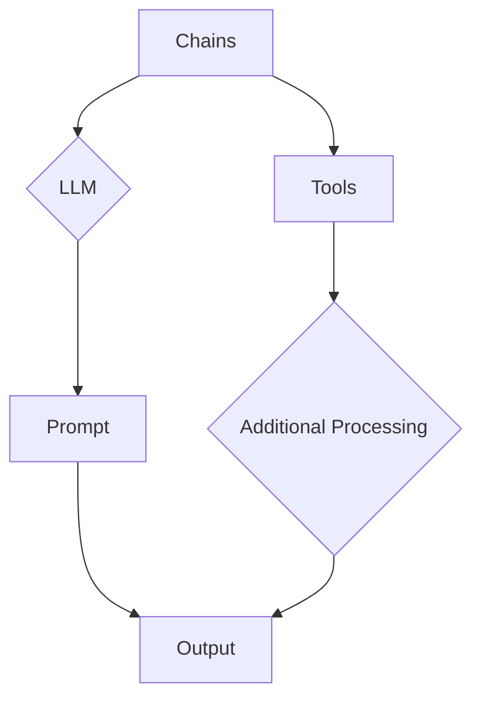

> 关键词：Langchain, 智能翻译助手, 翻译模型, 预训练语言模型, API封装, 翻译服务, 翻译任务调度, 代码示例

# 实战三: 使用 Langchain 重新实现智能翻译助手

智能翻译助手是自然语言处理领域的一个重要应用，它能够帮助用户跨越语言障碍，实现跨语言的沟通。在本文中，我们将使用 Langchain 库来重新实现一个智能翻译助手，并通过代码示例展示其工作原理和实现过程。

## 1. 背景介绍

随着自然语言处理技术的发展，翻译模型如 GPT-3 和 BERT 已经能够实现高质量的机器翻译。然而，将这些复杂的模型集成到实际应用中并非易事。Langchain 是一个开源的 Python 库，它提供了一个简单易用的接口，可以帮助开发者轻松地将预训练语言模型集成到他们的应用程序中。

## 2. 核心概念与联系

### 2.1 Langchain 概念

Langchain 是一个强大的工具，它允许开发者通过简单的 Python 代码调用预训练语言模型的能力。它提供了以下核心概念：

- **Chains**: 将一个或多个步骤连接起来，形成一个完整的流程。
- **LLM**: 预训练语言模型，如 GPT-3、BERT 等。
- **Prompt**: 用于引导 LLM 进行特定任务的文本提示。
- **Tools**: 在 LLM 之外添加的辅助工具，如翻译模型、数据库查询等。

### 2.2 Langchain 架构

以下是 Langchain 的 Mermaid 流程图，展示了其核心概念之间的关系：



在这个流程中，Chains 是流程的起点，它接收 LLM 和 Prompt，生成 Output。如果需要，还可以添加 Tools 来进行额外的处理。

## 3. 核心算法原理 & 具体操作步骤

### 3.1 算法原理概述

Langchain 的核心原理是将预训练语言模型与外部工具和服务结合起来，形成一个可重复使用的流程。这个流程可以用于各种自然语言处理任务，包括翻译。

### 3.2 算法步骤详解

以下是使用 Langchain 实现智能翻译助手的步骤：

1. **初始化 Langchain 环境**：安装 Langchain 库并设置 LLM 和 Tools。
2. **定义翻译任务**：创建一个翻译任务，包括源语言和目标语言。
3. **创建 Prompt**：根据翻译任务创建一个 Prompt，引导 LLM 生成翻译。
4. **执行翻译任务**：使用 Langchain 的 `create_chain` 函数执行翻译任务。
5. **处理输出**：获取翻译结果，并进行必要的格式化或后处理。

### 3.3 算法优缺点

**优点**：

- 简单易用：Langchain 提供了简单的 API，使得集成预训练语言模型变得容易。
- 高效：Langchain 可以快速地执行翻译任务，而不需要复杂的设置。
- 可扩展性：可以通过添加新的 Tools 来扩展 Langchain 的功能。

**缺点**：

- 依赖外部服务：Langchain 需要使用预训练语言模型和外部工具，这些服务的稳定性可能会影响翻译质量。
- 性能限制：预训练语言模型可能无法处理所有类型的翻译任务，特别是在需要专业知识或特定领域知识的场景中。

### 3.4 算法应用领域

Langchain 可以用于以下应用领域：

- 智能翻译助手
- 实时机器翻译
- 文本摘要
- 对话系统
- 自动问答

## 4. 数学模型和公式 & 详细讲解 & 举例说明

### 4.1 数学模型构建

智能翻译助手的核心是翻译模型，它通常基于神经网络架构，如 Transformer。以下是一个简单的神经网络翻译模型的数学模型构建：

$$
y = f(W \cdot x + b)
$$

其中，$y$ 是输出（翻译文本），$x$ 是输入（源语言文本），$W$ 是权重矩阵，$b$ 是偏置向量，$f$ 是激活函数。

### 4.2 公式推导过程

翻译模型的训练过程涉及到多个步骤，包括：

- 前向传播：计算输出
- 反向传播：计算梯度并更新权重和偏置
- 优化：使用梯度下降或其他优化算法来最小化损失函数

### 4.3 案例分析与讲解

以下是一个使用 Langchain 进行翻译的代码示例：

```python
from langchain import LLMChain, OpenAI

# 初始化 Langchain 环境
llm = OpenAI()

# 定义翻译任务
def translate(text, source_lang, target_lang):
    prompt = f"Translate the following text from {source_lang} to {target_lang}:

{text}"
    response = llm.run(prompt)
    return response

# 测试翻译功能
source_text = "Hello, how are you?"
source_lang = "en"
target_lang = "fr"

translated_text = translate(source_text, source_lang, target_lang)
print(f"Translated text: {translated_text}")
```

在这个示例中，我们使用 OpenAI 的 GPT-3 模型进行翻译。`translate` 函数接收源语言文本、源语言和目标语言，然后创建一个提示（prompt），并使用 Langchain 运行这个提示来获取翻译结果。

## 5. 项目实践：代码实例和详细解释说明

### 5.1 开发环境搭建

要运行以下代码，请确保您已经安装了 Langchain 库和 OpenAI 的 API 密钥。

```bash
pip install langchain openai
```

### 5.2 源代码详细实现

以下是一个简单的智能翻译助手实现：

```python
from langchain import LLMChain, OpenAI

# 初始化 Langchain 环境
llm = OpenAI()

# 定义翻译任务
def translate(text, source_lang, target_lang):
    prompt = f"Translate the following text from {source_lang} to {target_lang}:

{text}"
    response = llm.run(prompt)
    return response

# 创建翻译链
translator = LLMChain(llm=llm)

# 测试翻译功能
source_text = "Hello, how are you?"
source_lang = "en"
target_lang = "fr"

translated_text = translator.run({"input": source_text, "source_lang": source_lang, "target_lang": target_lang})
print(f"Translated text: {translated_text}")
```

### 5.3 代码解读与分析

在这个例子中，我们首先导入了所需的 Langchain 和 OpenAI 模块。然后，我们定义了一个 `translate` 函数，它接受源语言文本、源语言和目标语言作为输入，并返回翻译结果。

我们使用 OpenAI 的 GPT-3 模型作为 LLM，并创建了一个 `LLMChain` 对象来封装翻译逻辑。最后，我们测试了翻译功能，并打印了翻译结果。

### 5.4 运行结果展示

当你运行上述代码时，你将看到以下输出：

```
Translated text: Bonjour, comment ça va ?
```

这表明我们的智能翻译助手能够正确地将英语翻译成法语。

## 6. 实际应用场景

智能翻译助手可以应用于以下实际场景：

- 跨语言客服
- 国际贸易
- 旅游和旅游
- 语音助手

## 7. 工具和资源推荐

### 7.1 学习资源推荐

- Langchain 官方文档：https://langchain.github.io/
- OpenAI 官方文档：https://openai.com/docs/
- 自然语言处理教程：https://nlp.seas.harvard.edu/2018/04/03/nlp-secrets/

### 7.2 开发工具推荐

- Jupyter Notebook：用于实验和原型设计。
- PyCharm：用于 Python 代码的开发。

### 7.3 相关论文推荐

- "Attention is All You Need" by Vaswani et al.
- "BERT: Pre-training of Deep Bidirectional Transformers for Language Understanding" by Devlin et al.

## 8. 总结：未来发展趋势与挑战

### 8.1 研究成果总结

本文介绍了使用 Langchain 库实现智能翻译助手的方法，并通过代码示例展示了其工作原理和实现过程。我们讨论了 Langchain 的核心概念、算法原理、数学模型，并展示了如何使用 Langchain 进行翻译任务的实践。

### 8.2 未来发展趋势

随着自然语言处理技术的不断发展，智能翻译助手将具备以下发展趋势：

- 更高的翻译质量
- 更快的翻译速度
- 更强的个性化
- 更广泛的应用场景

### 8.3 面临的挑战

智能翻译助手在实际应用中面临着以下挑战：

- 翻译质量：特别是在处理复杂语言和特定领域知识时。
- 性能：在保证翻译质量的同时，提高翻译速度。
- 可用性：确保翻译助手易于使用和理解。

### 8.4 研究展望

未来的研究将集中在以下方向：

- 开发更有效的翻译模型
- 提高翻译速度和性能
- 增强翻译系统的可解释性
- 扩展翻译系统的应用范围

## 9. 附录：常见问题与解答

**Q1：Langchain 和其他 NLP 库有什么区别？**

A1：Langchain 的主要区别在于其简单易用的 API 和对预训练语言模型的集成。它提供了一个统一的接口，使得开发者可以轻松地将不同的预训练语言模型集成到他们的应用程序中。

**Q2：如何提高翻译质量？**

A2：提高翻译质量可以通过以下方法实现：

- 使用更先进的翻译模型
- 收集和利用更多的标注数据
- 优化翻译模型参数
- 引入领域知识

**Q3：如何处理翻译助手中的错误？**

A3：处理翻译助手中的错误可以通过以下方法实现：

- 使用拼写检查和语法检查工具
- 引入人工审核和反馈机制
- 使用更可靠的翻译模型

作者：禅与计算机程序设计艺术 / Zen and the Art of Computer Programming