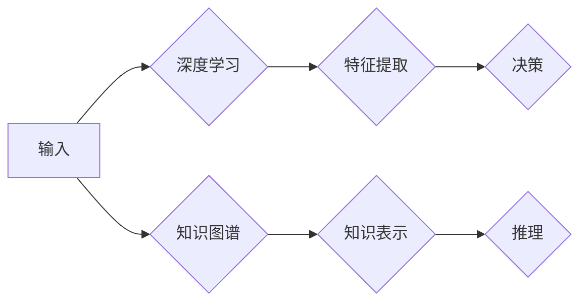

# 张钹院士：人工智能的两条路径

> 关键词：人工智能，深度学习，知识图谱，张钹院士，认知智能，强人工智能

## 1. 背景介绍

在人工智能领域，张钹院士是一位享有盛誉的学者，他的研究涵盖机器学习、知识表示、自然语言处理等多个方向。张钹院士提出了人工智能发展的两条路径，即“深度学习”和“知识图谱”，为人工智能领域的研究和实践提供了重要的理论指导和实践参考。本文将深入探讨张钹院士提出的这两条路径，分析其原理、应用场景，并展望未来发展趋势。

## 2. 核心概念与联系

### 2.1 深度学习

深度学习是一种模仿人脑神经网络结构和功能的人工智能技术，通过多层的神经网络进行特征提取和学习。其核心概念包括：

- 神经元：神经网络的基本单元，负责接收输入信息并进行处理。
- 神经网络：由多个神经元组成的层次结构，通过前向传播和反向传播进行信息传递和学习。
- 激活函数：用于引入非线性因素，使神经网络能够学习更复杂的非线性关系。

### 2.2 知识图谱

知识图谱是一种结构化知识库，通过实体、属性和关系来描述现实世界中的信息。其核心概念包括：

- 实体：知识图谱中的对象，如人、地点、组织等。
- 属性：实体的属性，如年龄、身高、出生地等。
- 关系：实体之间的关系，如“居住在”、“属于”等。

### 2.3 Mermaid 流程图



### 2.4 核心概念联系

深度学习和知识图谱在人工智能领域中相互补充，共同推动人工智能技术的发展。深度学习可以用于从大量数据中提取特征，而知识图谱则可以用于表示和推理这些特征之间的关系。

## 3. 核心算法原理 & 具体操作步骤

### 3.1 算法原理概述

#### 3.1.1 深度学习

深度学习的算法原理主要包括：

- 前向传播：将输入数据传递到神经网络，通过每层神经元计算输出结果。
- 反向传播：根据损失函数计算梯度，反向传播更新神经网络参数。
- 激活函数：引入非线性因素，使神经网络能够学习更复杂的非线性关系。

#### 3.1.2 知识图谱

知识图谱的算法原理主要包括：

- 实体识别：识别文本中的实体，如人名、地名、组织名等。
- 属性抽取：从文本中抽取实体的属性，如年龄、身高、出生地等。
- 关系抽取：从文本中抽取实体之间的关系，如“居住在”、“属于”等。
- 知识推理：根据实体和关系进行推理，如根据“张三的年龄是30岁”，推理出“张三出生于1993年”。

### 3.2 算法步骤详解

#### 3.2.1 深度学习

深度学习的基本步骤包括：

1. 数据预处理：对输入数据进行清洗、标准化等处理。
2. 模型设计：选择合适的神经网络结构，如卷积神经网络(CNN)、循环神经网络(RNN)等。
3. 模型训练：使用训练数据对模型进行训练，优化模型参数。
4. 模型评估：使用验证数据评估模型性能，调整模型参数。
5. 模型部署：将训练好的模型部署到实际应用中。

#### 3.2.2 知识图谱

知识图谱的基本步骤包括：

1. 数据收集：收集实体、属性和关系数据。
2. 数据处理：对数据进行清洗、去重、标准化等处理。
3. 实体识别：使用命名实体识别(NER)技术识别文本中的实体。
4. 属性抽取：使用关系抽取技术抽取实体的属性。
5. 关系抽取：使用关系抽取技术抽取实体之间的关系。
6. 知识存储：将实体、属性和关系存储到知识图谱中。
7. 知识推理：使用推理算法从知识图谱中推理出新的知识。

### 3.3 算法优缺点

#### 3.3.1 深度学习

深度学习的优点包括：

- 能够学习复杂的非线性关系。
- 能够处理大规模数据。
- 能够自动提取特征。

深度学习的缺点包括：

- 训练数据量大。
- 计算资源需求高。
- 模型可解释性差。

#### 3.3.2 知识图谱

知识图谱的优点包括：

- 能够表示和推理复杂关系。
- 能够提供结构化的知识表示。
- 能够支持多种知识推理任务。

知识图谱的缺点包括：

- 数据获取和清洗困难。
- 模型构建复杂。
- 难以处理动态变化的现实世界。

### 3.4 算法应用领域

#### 3.4.1 深度学习

深度学习在以下领域有广泛应用：

- 图像识别：如人脸识别、物体检测等。
- 语音识别：如语音转文字、语音合成等。
- 自然语言处理：如机器翻译、文本分类等。

#### 3.4.2 知识图谱

知识图谱在以下领域有广泛应用：

- 智能问答：如知识图谱问答系统、智能客服等。
- 推荐系统：如个性化推荐、商品推荐等。
- 决策支持系统：如智能决策、风险控制等。

## 4. 数学模型和公式 & 详细讲解 & 举例说明

### 4.1 数学模型构建

#### 4.1.1 深度学习

深度学习中的数学模型主要包括：

- 线性回归模型：用于预测连续值。
- 逻辑回归模型：用于预测二分类问题。
- 支持向量机(SVM)：用于分类和回归任务。

#### 4.1.2 知识图谱

知识图谱中的数学模型主要包括：

- 实体识别：使用条件随机场(CRF)进行实体识别。
- 属性抽取：使用命名实体识别(NER)技术进行属性抽取。
- 关系抽取：使用机器学习或深度学习模型进行关系抽取。

### 4.2 公式推导过程

#### 4.2.1 深度学习

以下为线性回归模型的公式推导：

假设输入特征为 $x$，输出为 $y$，则线性回归模型为：

$$
y = \beta_0 + \beta_1 x_1 + \beta_2 x_2 + \cdots + \beta_n x_n
$$

其中，$\beta_0, \beta_1, \beta_2, \cdots, \beta_n$ 为模型参数。

损失函数为均方误差(MSE)：

$$
MSE = \frac{1}{2} \sum_{i=1}^{N}(y_i - \hat{y_i})^2
$$

其中，$N$ 为样本数量，$\hat{y_i}$ 为预测值。

通过最小化损失函数，可以得到参数的优化目标：

$$
\theta = \mathop{\arg\min}_{\theta} \mathcal{L}(\theta)
$$

#### 4.2.2 知识图谱

以下为条件随机场(CRF)的公式推导：

CRF是一种用于序列标注的机器学习模型，其概率模型为：

$$
P(y|x) = \frac{1}{Z} \exp \left( \sum_{i=1}^{N} \theta_{y_i} \phi(x_i, y_i) \right)
$$

其中，$x$ 为输入序列，$y$ 为标签序列，$\theta_{y_i}$ 为权重参数，$\phi(x_i, y_i)$ 为特征函数。

### 4.3 案例分析与讲解

#### 4.3.1 深度学习

以下为使用深度学习进行图像分类的案例：

1. 数据预处理：对图像进行裁剪、缩放等处理，得到统一的图像尺寸。
2. 模型设计：选择卷积神经网络(CNN)作为模型结构，包括卷积层、池化层和全连接层。
3. 模型训练：使用训练数据对模型进行训练，优化模型参数。
4. 模型评估：使用验证数据评估模型性能，调整模型参数。
5. 模型部署：将训练好的模型部署到实际应用中。

#### 4.3.2 知识图谱

以下为使用知识图谱进行智能问答的案例：

1. 数据收集：收集实体、属性和关系数据，构建知识图谱。
2. 实体识别：使用命名实体识别(NER)技术识别用户输入中的实体。
3. 属性抽取：使用关系抽取技术抽取实体的属性。
4. 关系抽取：使用关系抽取技术抽取实体之间的关系。
5. 知识推理：根据实体和关系进行推理，返回用户期望的答案。

## 5. 项目实践：代码实例和详细解释说明

### 5.1 开发环境搭建

1. 安装Python环境：安装Python 3.7或更高版本。
2. 安装深度学习框架：安装PyTorch或TensorFlow等深度学习框架。
3. 安装知识图谱工具：安装Neo4j或JanusGraph等知识图谱工具。

### 5.2 源代码详细实现

以下为使用PyTorch进行图像分类的示例代码：

```python
import torch
import torch.nn as nn

# 定义CNN模型
class CNN(nn.Module):
    def __init__(self):
        super(CNN, self).__init__()
        self.conv1 = nn.Conv2d(3, 32, kernel_size=3, padding=1)
        self.conv2 = nn.Conv2d(32, 64, kernel_size=3, padding=1)
        self.fc1 = nn.Linear(64 * 6 * 6, 128)
        self.fc2 = nn.Linear(128, 10)
    
    def forward(self, x):
        x = torch.relu(self.conv1(x))
        x = torch.max_pool2d(x, 2)
        x = torch.relu(self.conv2(x))
        x = torch.max_pool2d(x, 2)
        x = x.view(x.size(0), -1)
        x = torch.relu(self.fc1(x))
        x = self.fc2(x)
        return x

# 加载训练数据
train_loader = DataLoader(...)
test_loader = DataLoader(...)

# 实例化模型、损失函数和优化器
model = CNN().to(device)
criterion = nn.CrossEntropyLoss()
optimizer = torch.optim.Adam(model.parameters())

# 训练模型
for epoch in range(num_epochs):
    for batch_idx, (data, target) in enumerate(train_loader):
        data, target = data.to(device), target.to(device)
        optimizer.zero_grad()
        output = model(data)
        loss = criterion(output, target)
        loss.backward()
        optimizer.step()
        if batch_idx % 100 == 0:
            print('Train Epoch: {} [{}/{} ({:.0f}%)]\tLoss: {:.6f}'.format(
                epoch, batch_idx * len(data), len(train_loader.dataset),
                100. * batch_idx / len(train_loader), loss.item()))

# 评估模型
model.eval()
test_loss = 0
correct = 0
with torch.no_grad():
    for data, target in test_loader:
        data, target = data.to(device), target.to(device)
        output = model(data)
        test_loss += criterion(output, target).item()
        pred = output.argmax(dim=1, keepdim=True)
        correct += pred.eq(target.view_as(pred)).sum().item()

test_loss /= len(test_loader.dataset)
print('
Test set: Average loss: {:.4f}, Accuracy: {}/{} ({:.0f}%)
'.format(
    test_loss, correct, len(test_loader.dataset),
    100. * correct / len(test_loader.dataset)))
```

### 5.3 代码解读与分析

以上代码展示了使用PyTorch进行图像分类的基本流程。首先，定义了一个CNN模型，包括卷积层、池化层和全连接层。然后，加载训练数据和测试数据，并实例化模型、损失函数和优化器。接着，进行多轮训练，并在测试集上评估模型性能。

### 5.4 运行结果展示

运行上述代码，将在训练集和测试集上打印出模型损失和准确率。通过观察这些指标，可以判断模型性能是否达到预期。

## 6. 实际应用场景

### 6.1 智能问答

智能问答是人工智能领域的重要应用之一，通过结合深度学习和知识图谱技术，可以实现如下功能：

1. 实体识别：识别用户输入中的实体，如人名、地名、组织名等。
2. 属性抽取：从知识图谱中抽取实体的属性，如年龄、身高、出生地等。
3. 关系抽取：从知识图谱中抽取实体之间的关系，如“居住在”、“属于”等。
4. 知识推理：根据实体和关系进行推理，返回用户期望的答案。

### 6.2 个性化推荐

个性化推荐是另一个重要的应用场景，通过结合深度学习和知识图谱技术，可以实现如下功能：

1. 用户画像：根据用户的历史行为数据，构建用户画像。
2. 商品画像：根据商品信息，构建商品画像。
3. 推荐算法：根据用户画像和商品画像，为用户推荐合适的商品。

### 6.3 决策支持系统

决策支持系统是另一个重要的应用场景，通过结合深度学习和知识图谱技术，可以实现如下功能：

1. 数据挖掘：从大量数据中挖掘出有价值的信息。
2. 预测分析：根据历史数据，预测未来的发展趋势。
3. 决策优化：根据预测结果，优化决策方案。

## 7. 工具和资源推荐

### 7.1 学习资源推荐

1. 《深度学习》——Ian Goodfellow、Yoshua Bengio、Aaron Courville
2. 《统计学习方法》——李航
3. 《图灵奖得主张钹院士谈人工智能》——张钹

### 7.2 开发工具推荐

1. PyTorch：深度学习框架
2. TensorFlow：深度学习框架
3. Neo4j：知识图谱数据库
4. JanusGraph：知识图谱数据库

### 7.3 相关论文推荐

1. "Deep Learning for NLP: A Survey"——Zhiyuan Liu et al.
2. "Knowledge Graph Embedding: A Survey of Techniques and Applications"——Hongyuan Zeng et al.
3. "Deep Learning: A Brief Introduction"——Ian Goodfellow

## 8. 总结：未来发展趋势与挑战

### 8.1 研究成果总结

本文深入探讨了张钹院士提出的人工智能发展的两条路径：深度学习和知识图谱。通过分析这两条路径的原理、应用场景，本文为人工智能领域的研究和实践提供了重要的理论指导和实践参考。

### 8.2 未来发展趋势

未来，深度学习和知识图谱将在以下方面取得更大的发展：

1. 深度学习：将更加关注可解释性和可扩展性，同时探索新的神经网络结构和技术。
2. 知识图谱：将更加关注知识表示、知识推理和知识获取，同时探索跨领域知识融合。

### 8.3 面临的挑战

深度学习和知识图谱在发展过程中也面临着一些挑战：

1. 数据质量和标注：高质量的数据和标注是深度学习和知识图谱发展的基础。
2. 模型可解释性：提高模型的可解释性，使其更加可信和可靠。
3. 模型泛化能力：提高模型的泛化能力，使其能够处理更多样化的任务和数据。

### 8.4 研究展望

未来，深度学习和知识图谱将继续在人工智能领域发挥重要作用，并与其他人工智能技术相结合，共同推动人工智能技术的进步。

## 9. 附录：常见问题与解答

**Q1：深度学习和知识图谱有哪些区别？**

A：深度学习和知识图谱是两种不同的人工智能技术。深度学习主要用于特征提取和学习，而知识图谱主要用于知识表示和推理。

**Q2：深度学习和知识图谱如何结合？**

A：深度学习和知识图谱可以结合使用，例如在深度学习模型中引入知识图谱中的先验知识，或者使用知识图谱进行深度学习模型的推理。

**Q3：深度学习和知识图谱有哪些应用场景？**

A：深度学习和知识图谱在智能问答、个性化推荐、决策支持系统等领域有广泛应用。

**Q4：如何提高深度学习和知识图谱的性能？**

A：提高深度学习和知识图谱的性能可以通过以下方法：

- 提高数据质量和标注质量。
- 优化模型结构和算法。
- 融合其他人工智能技术，如强化学习等。

作者：禅与计算机程序设计艺术 / Zen and the Art of Computer Programming