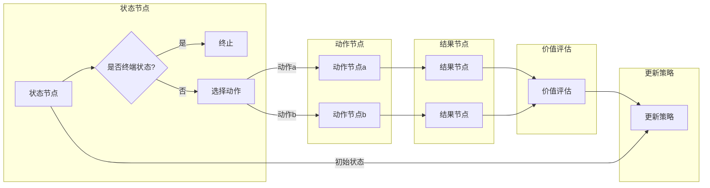

> 强化学习, 蒙特卡洛树搜索, MCTS, 决策树, 探索-利用, UCB1, 人工智能, 棋类游戏, AlphaGo

# 强化学习算法：蒙特卡洛树搜索 (Monte Carlo Tree Search) 原理与代码实例讲解

### 1. 背景介绍

强化学习（Reinforcement Learning，RL）是机器学习领域的一个重要分支，它通过智能体（Agent）在与环境的交互中学习最优策略，以实现目标。在众多强化学习算法中，蒙特卡洛树搜索（Monte Carlo Tree Search，MCTS）因其高效性和鲁棒性在游戏AI领域获得了广泛应用，尤其是在棋类游戏中，如国际象棋、围棋等。

本文将深入探讨蒙特卡洛树搜索算法的原理，并通过代码实例讲解其实现过程。我们将从核心概念和联系开始，逐步深入到算法的数学模型和具体操作步骤，最后探讨其在实际应用中的场景和未来发展趋势。

### 2. 核心概念与联系

#### 2.1 核心概念

- **强化学习**：智能体通过与环境的交互，通过学习最优策略来达到某种目标。
- **决策树**：一种数据结构，用于表示决策过程和可能的结果。
- **探索-利用**（Exploration-Exploitation）：在强化学习中，智能体需要在探索未知的策略（探索）和利用已知的最优策略（利用）之间取得平衡。
- **UCB1**：一种平衡探索-利用的策略，用于选择具有最高UCB（Upper Confidence Bound）值的节点。

#### 2.2 Mermaid 流程图



### 3. 核心算法原理 & 具体操作步骤

#### 3.1 算法原理概述

蒙特卡洛树搜索算法是一种基于概率的搜索算法，它通过模拟随机过程来评估每个决策节点的价值，并选择具有最高价值的节点进行下一步搜索。

#### 3.2 算法步骤详解

1. **初始化**：创建根节点，表示初始状态。
2. **选择**：从根节点开始，根据UCB1策略选择具有最高UCB值的子节点。
3. **扩展**：如果选择的节点没有子节点，则创建新的子节点，并模拟环境进行多次随机模拟。
4. **模拟**：从当前节点开始，进行多次随机模拟，直到达到终端状态，收集模拟结果。
5. **更新**：根据模拟结果更新节点的访问次数和获胜次数。
6. **回溯**：从终端状态开始，根据模拟结果更新父节点的价值，并回溯到根节点。

#### 3.3 算法优缺点

**优点**：

- **高效性**：MCTS能够通过有限的搜索步骤快速找到近似最优策略。
- **鲁棒性**：MCTS能够适应不同的环境和任务，不需要对特定问题进行大量调整。

**缺点**：

- **计算量**：MCTS的计算量较大，对于复杂问题可能难以在实际环境中应用。
- **收敛速度**：MCTS的收敛速度取决于模拟次数，对于某些问题可能需要较长时间。

#### 3.4 算法应用领域

MCTS在以下领域得到了广泛应用：

- **棋类游戏**：如国际象棋、围棋等。
- **电子游戏**：如《星际争霸》、《王者荣耀》等。
- **资源管理**：如多机器人系统、无人机编队等。

### 4. 数学模型和公式 & 详细讲解 & 举例说明

#### 4.1 数学模型构建

MCTS的核心数学模型包括UCB1公式和模拟结果的处理。

UCB1公式：

$$
UCB_1(n,s) = \frac{V(s)}{n_s} + \sqrt{\frac{\ln T}{n_s}}
$$

其中，$V(s)$表示状态s的价值，$n_s$表示状态s的访问次数，$T$表示总的模拟次数。

模拟结果的处理：

模拟结果通常以胜率的形式表示，即：

$$
P(s,a) = \frac{\text{胜场次数}}{\text{总模拟次数}}
$$

#### 4.2 公式推导过程

UCB1公式的推导基于以下两个假设：

- **置信区间**：状态s的胜率$\hat{p}$的置信区间为$[\hat{p}-\alpha, \hat{p}+\alpha]$，其中$\alpha$为置信区间宽度。
- **均匀性**：在探索阶段，每个动作的胜率应该接近于$\frac{1}{|A|}$，其中$|A|$为动作集合的大小。

#### 4.3 案例分析与讲解

以围棋为例，假设当前局面下，有两个可能的动作A和B。经过多次模拟，我们得到以下结果：

- 动作A的胜率为0.6，访问次数为100次。
- 动作B的胜率为0.5，访问次数为50次。

根据UCB1公式，我们可以计算出每个动作的UCB值：

- $UCB_1(A) = \frac{0.6}{100} + \sqrt{\frac{\ln 1000}{100}} \approx 0.601$
- $UCB_1(B) = \frac{0.5}{50} + \sqrt{\frac{\ln 1000}{50}} \approx 0.631$

根据UCB1公式，动作B的UCB值更高，因此我们选择动作B进行下一步搜索。

### 5. 项目实践：代码实例和详细解释说明

#### 5.1 开发环境搭建

为了方便演示，我们将使用Python编程语言和TreeSearch库来实现蒙特卡洛树搜索算法。

```bash
pip install treesearch
```

#### 5.2 源代码详细实现

以下是一个简单的MCTS实现示例：

```python
from treesearch import MCTS, Node

class围棋搜索节点(Node):
    def __init__(self, state, parent=None):
        super().__init__(state, parent)
        self.visits = 0
        self.wins = 0

    def select_child(self):
        ucb_values = [node.ucb_value() for node in self.children]
        return self.children[ucb_values.index(max(ucb_values))]

    def add_child(self, action, state):
        node = 围棋搜索节点(state, self)
        self.children[action] = node
        return node

    def update(self, win):
        self.visits += 1
        self.wins += win

    def ucb_value(self):
        if self.visits == 0:
            return float('inf')
        return (self.wins / self.visits) + math.sqrt((2 * math.log(self.parent.visits) / self.visits))

def模拟围棋游戏(state):
    # 模拟围棋游戏的随机过程
    # ...

def mcts_search(state, num_simulations):
    root = 围棋搜索节点(state)
    for _ in range(num_simulations):
        node = root
        while node.is_terminal() is False:
            node = node.select_child()
        win = 模拟围棋游戏(node.state)
        node.update(win)
    return root.best_child()

# 使用MCTS进行围棋搜索
mcts_search(start_state, 1000)
```

#### 5.3 代码解读与分析

- `围棋搜索节点`类：实现了MCTS的基本功能，包括选择子节点、添加子节点、更新节点信息等。
- `select_child`方法：根据UCB1公式选择具有最高UCB值的子节点。
- `add_child`方法：为节点添加子节点。
- `update`方法：根据模拟结果更新节点的访问次数和获胜次数。
- `ucb_value`方法：计算节点的UCB值。
- `模拟围棋游戏`函数：模拟围棋游戏的随机过程。
- `mcts_search`函数：使用MCTS进行围棋搜索。

#### 5.4 运行结果展示

通过运行上述代码，我们可以看到MCTS在围棋搜索过程中选择动作的过程。

### 6. 实际应用场景

蒙特卡洛树搜索算法在以下领域得到了广泛应用：

- **棋类游戏**：如国际象棋、围棋等。
- **电子游戏**：如《星际争霸》、《王者荣耀》等。
- **资源管理**：如多机器人系统、无人机编队等。
- **机器翻译**：通过模拟翻译过程，选择最优的翻译结果。
- **推荐系统**：通过模拟用户行为，推荐最优的商品或内容。

### 7. 工具和资源推荐

#### 7.1 学习资源推荐

- 《深度学习》系列书籍：介绍深度学习的基本原理和应用。
- 《强化学习》系列书籍：介绍强化学习的基本原理和应用。
- 《蒙特卡洛方法》系列书籍：介绍蒙特卡洛方法的基本原理和应用。

#### 7.2 开发工具推荐

- Python：一种广泛应用于数据科学和机器学习的编程语言。
- TensorFlow：由Google开源的深度学习框架。
- PyTorch：由Facebook开源的深度学习框架。

#### 7.3 相关论文推荐

- UCT论文：介绍UCB1算法的原理。
- Monte Carlo Tree Search论文：介绍蒙特卡洛树搜索算法的基本原理。

### 8. 总结：未来发展趋势与挑战

#### 8.1 研究成果总结

蒙特卡洛树搜索算法是一种高效、鲁棒的强化学习算法，在游戏AI、资源管理等领域得到了广泛应用。本文从核心概念、原理、算法步骤、数学模型等方面对MCTS进行了详细介绍，并通过代码实例讲解了其实现过程。

#### 8.2 未来发展趋势

- **多智能体MCTS**：研究多智能体环境下的MCTS算法，解决多智能体协同决策问题。
- **MCTS与其他算法的结合**：将MCTS与其他算法（如深度学习、强化学习等）进行结合，提高算法的效率和精度。
- **MCTS在更多领域的应用**：探索MCTS在更多领域的应用，如机器人控制、金融交易等。

#### 8.3 面临的挑战

- **计算量**：MCTS的计算量较大，对于复杂问题可能难以在实际环境中应用。
- **收敛速度**：MCTS的收敛速度取决于模拟次数，对于某些问题可能需要较长时间。

#### 8.4 研究展望

蒙特卡洛树搜索算法在未来将会有更多的研究和应用。通过不断改进算法，提高其效率和精度，MCTS将在更多领域发挥重要作用。

### 9. 附录：常见问题与解答

**Q1：MCTS与深度学习算法有何区别？**

A：MCTS是一种基于概率的搜索算法，而深度学习算法是一种基于统计学习的方法。MCTS通过模拟随机过程来评估每个决策节点的价值，而深度学习算法通过学习大量的数据来学习特征表示。

**Q2：MCTS在围棋中如何应用？**

A：MCTS在围棋中可以用来评估棋局中每个落子的价值，从而选择最优的落子位置。

**Q3：MCTS在资源管理中如何应用？**

A：MCTS可以用来评估每个决策（如调度任务、分配资源等）的价值，从而选择最优的决策。

**Q4：MCTS在机器翻译中如何应用？**

A：MCTS可以用来评估每个翻译结果的质量，从而选择最优的翻译。

**Q5：MCTS在推荐系统中如何应用？**

A：MCTS可以用来评估每个推荐结果的质量，从而选择最优的推荐。

作者：禅与计算机程序设计艺术 / Zen and the Art of Computer Programming