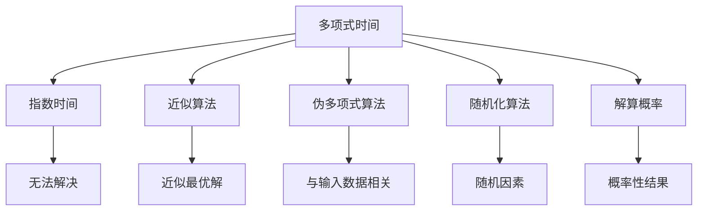
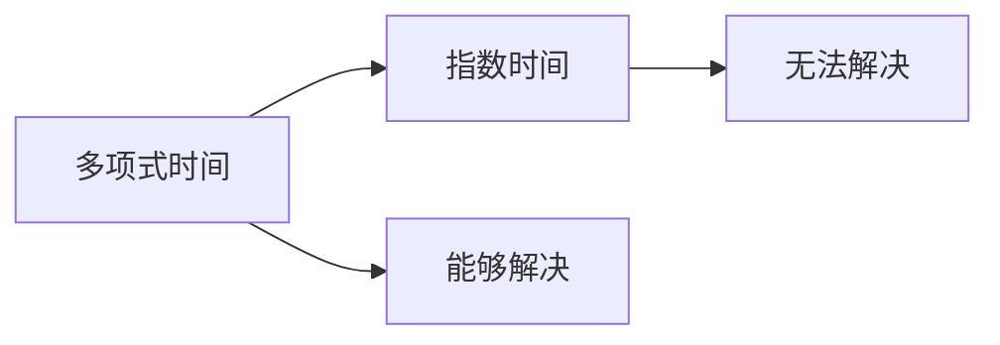
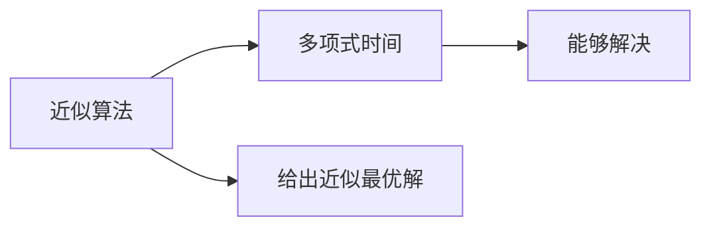
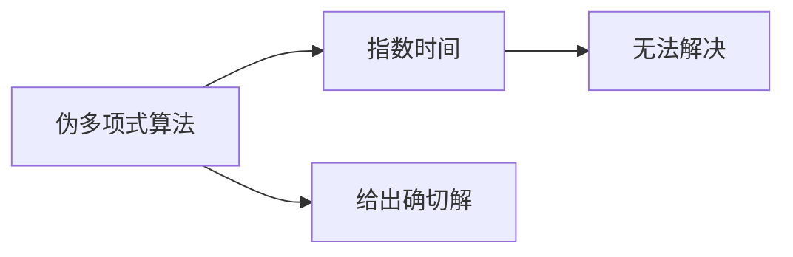
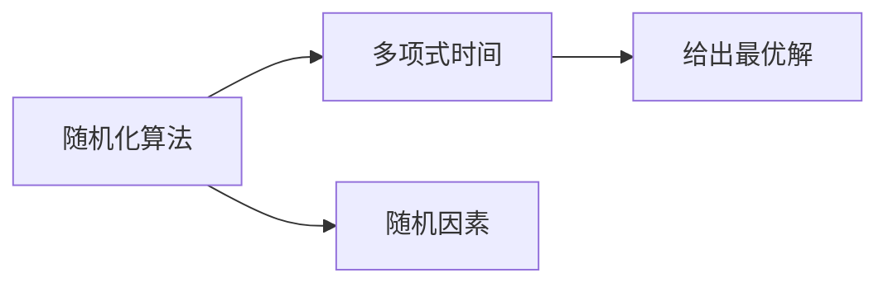
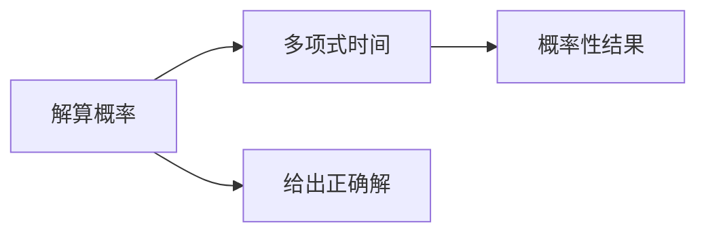
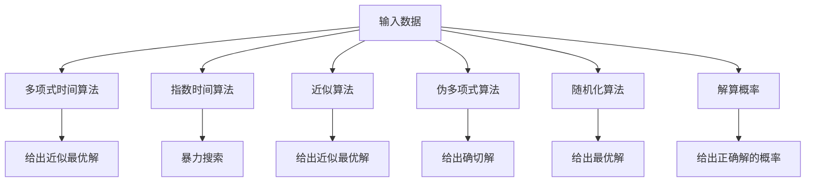

                 

# 计算：第四部分 计算的极限 第 9 章 计算复杂性 多项式时间与指数时间

> 关键词：计算复杂性, 多项式时间, 指数时间, 近似算法, 伪多项式算法, 随机化算法, 解算概率

## 1. 背景介绍

计算复杂性理论是计算机科学的重要基础，研究的是算法执行时间与输入数据大小之间的关系。随着计算机技术的飞速发展，算法设计者和实际应用者都在追求效率更高的算法。然而，理论上的极限仍然是一个巨大的挑战。

### 1.1 问题由来

计算复杂性理论最早可以追溯到20世纪50年代，由图灵提出。它主要研究在给定资源下，执行某个算法所需的时间，并试图找到最优算法。计算复杂性理论经历了数十年发展，已经形成了成熟的研究体系。

当前，计算复杂性理论已经成为计算机科学的一个基础性学科，是各种算法设计和优化的重要理论基础。它不仅研究算法本身的效率，还研究算法在特定问题上的可行性。

### 1.2 问题核心关键点

计算复杂性理论的核心问题可以归结为两个：

- 一是确定一个问题的计算复杂度，包括问题的最优时间复杂度和近似时间复杂度。
- 二是研究在不同的计算资源下，如何设计高效的算法。

计算复杂性理论的基石是多项式时间和指数时间，它们定义了算法的计算复杂度。多项式时间算法是指能够在多项式时间内解决的问题，而指数时间算法则是指需要指数时间内才能解决的问题。

## 2. 核心概念与联系

### 2.1 核心概念概述

为了更好地理解多项式时间与指数时间，本节将介绍几个密切相关的核心概念：

- 多项式时间（Polynomial Time）：指算法在输入数据规模增加的情况下，执行时间增长速度不超过数据大小的某个多项式函数。
- 指数时间（Exponential Time）：指算法执行时间随输入数据规模呈指数增长。
- 近似算法（Approximation Algorithm）：指在有限时间内能够给出问题一个相对准确的解的算法。
- 伪多项式算法（Pseudopolynomial Time Algorithm）：指算法执行时间随输入数据规模呈多项式增长，但与输入数据的具体值有关。
- 随机化算法（Randomized Algorithm）：指算法执行过程包含随机因素，能够以一定概率获得最优解的算法。
- 解算概率（Solvability Probability）：指在有限时间内算法能够给出正确答案的概率。

这些核心概念之间的逻辑关系可以通过以下Mermaid流程图来展示：

这个流程图展示了几大核心概念之间的联系：

1. 多项式时间算法能够在有限时间内解决问题，但可能无法给出最优解。
2. 指数时间算法无法在多项式时间内解决，通常需要暴力搜索。
3. 近似算法能够在有限时间内给出近似最优解，但可能无法找到确切的解。
4. 伪多项式算法的时间复杂度与输入数据大小有关，但可以给出确切的解。
5. 随机化算法引入随机因素，能够以一定概率获得最优解，但概率性结果可能出现错误。
6. 解算概率衡量算法能够给出一个正确解的概率。

这些概念共同构成了计算复杂性理论的基础，帮助我们更好地理解不同算法的执行效率和适用场景。

### 2.2 概念间的关系

这些核心概念之间存在着紧密的联系，形成了计算复杂性理论的完整生态系统。下面我们通过几个Mermaid流程图来展示这些概念之间的关系。

#### 2.2.1 多项式时间与指数时间的关系

这个流程图展示了多项式时间和指数时间的关系：多项式时间算法能够在有限时间内解决某些问题，而指数时间算法无法在多项式时间内解决。

#### 2.2.2 近似算法与多项式时间的关系

这个流程图展示了近似算法与多项式时间的关系：近似算法能够在多项式时间内给出问题的近似最优解。

#### 2.2.3 伪多项式算法与指数时间的关系

这个流程图展示了伪多项式算法与指数时间的关系：伪多项式算法能够在多项式时间内给出确切的解，但与输入数据的具体值有关。

#### 2.2.4 随机化算法与多项式时间的关系

这个流程图展示了随机化算法与多项式时间的关系：随机化算法能够在多项式时间内给出问题的最优解，但可能引入随机因素。

#### 2.2.5 解算概率与多项式时间的关系

这个流程图展示了解算概率与多项式时间的关系：解算概率衡量算法能够给出一个正确解的概率，这与多项式时间算法相关。

### 2.3 核心概念的整体架构

最后，我们用一个综合的流程图来展示这些核心概念在大规模计算模型中的整体架构：

这个综合流程图展示了从输入数据到各种算法的执行过程及其结果：

1. 输入数据经过多项式时间算法的处理，给出近似最优解。
2. 对于指数时间算法，需要进行暴力搜索。
3. 近似算法能够在有限时间内给出近似最优解。
4. 伪多项式算法能够在多项式时间内给出确切解。
5. 随机化算法通过引入随机因素，以一定概率给出最优解。
6. 解算概率衡量算法能够给出一个正确解的概率。

通过这些流程图，我们可以更清晰地理解多项式时间与指数时间之间的关系，以及各种算法的执行过程及其结果。

## 3. 核心算法原理 & 具体操作步骤
### 3.1 算法原理概述

计算复杂性理论的核心是多项式时间和指数时间。多项式时间算法能够在有限时间内解决某个问题，而指数时间算法则需要指数时间内才能解决。

多项式时间算法是计算复杂性理论的核心，指算法执行时间随输入数据规模呈多项式增长。常用的多项式时间算法有贪心算法、动态规划、分治算法等。这些算法能够在多项式时间内解决优化、排序、搜索等常见问题。

指数时间算法通常是指需要指数时间内才能解决的问题。这些问题通常需要暴力搜索，时间复杂度呈指数级增长。常见的指数时间算法包括旅行商问题、背包问题等。

### 3.2 算法步骤详解

下面以动态规划算法为例，详细讲解多项式时间算法的执行步骤：

1. **初始化**：设定问题规模和边界条件。
2. **划分子问题**：将原问题分解为若干子问题。
3. **递推求解**：通过递推关系计算各个子问题的解。
4. **合并子问题**：将各个子问题的解合并为原问题的解。

具体步骤以0-1背包问题为例：

**初始化**：设定物品数 $n$，背包容量 $C$，物品重量 $w_i$，物品价值 $v_i$。
**划分子问题**：将原问题分解为若干子问题。例如，在 $n$ 个物品中选择 $k$ 个放入容量为 $C$ 的背包中，得到的最大价值为 $f(n,k,C)$。
**递推求解**：通过递推关系计算各个子问题的解。例如，$f(n,k,C)=\max\{f(n-1,k,C),f(n-1,k-w_i,C)+v_i\}$。
**合并子问题**：将各个子问题的解合并为原问题的解。即，最终解为 $f(n,C)$。

### 3.3 算法优缺点

多项式时间算法具有以下优点：

1. **高效性**：能够在有限时间内解决问题。
2. **可解释性**：算法的执行过程和结果可解释性强，便于理解和调试。

但其缺点也很明显：

1. **局限性**：仅适用于特定类型的问题，不能解决所有问题。
2. **复杂性**：部分多项式时间算法执行复杂度高，难以理解和实现。

指数时间算法则具有以下优缺点：

1. **高效性**：能够找到最优解，但需要指数时间。
2. **可解释性**：算法的执行过程复杂，难以解释。
3. **通用性**：能够解决所有类型的问题，但时间复杂度高。

### 3.4 算法应用领域

多项式时间算法和指数时间算法在计算机科学中有着广泛的应用：

1. **优化问题**：如线性规划、图论中的最短路径、最小生成树等。
2. **搜索问题**：如旅行商问题、八皇后问题等。
3. **排序问题**：如快速排序、堆排序等。
4. **分解问题**：如分治算法、动态规划等。

指数时间算法虽然时间复杂度高，但在大规模问题求解中仍具有重要应用价值。

## 4. 数学模型和公式 & 详细讲解 & 举例说明

### 4.1 数学模型构建

多项式时间算法通常使用动态规划、贪心算法等技术。下面以动态规划算法为例，构建数学模型。

设 $f(n,k,C)$ 表示在 $n$ 个物品中选择 $k$ 个放入容量为 $C$ 的背包中，得到的最大价值。则动态规划算法的基本方程为：

$$
f(n,k,C) = \max\{f(n-1,k,C), f(n-1,k-w_i,C)+v_i\}
$$

其中 $w_i$ 和 $v_i$ 分别为第 $i$ 个物品的重量和价值。

### 4.2 公式推导过程

设 $n$ 个物品的重量和价值分别为 $w_1, w_2, \cdots, w_n$ 和 $v_1, v_2, \cdots, v_n$，背包容量为 $C$。假设 $f(i,j,k)$ 表示在前 $i$ 个物品中选择 $j$ 个放入容量为 $k$ 的背包中，得到的最大价值。则有递推方程：

$$
f(i,j,k) = \max\{f(i-1,j,k), f(i-1,j-w_i,k)+v_i\}
$$

其中 $f(i-1,j,w_i)$ 表示前 $i-1$ 个物品中选择 $j-w_i$ 个放入容量为 $k-w_i$ 的背包中，得到的最大价值。

通过递推求解，可以得到最终解 $f(n,C)$。

### 4.3 案例分析与讲解

以0-1背包问题为例，假设 $n=4$，物品重量和价值分别为 $w_1=2, w_2=2, w_3=6, w_4=5$，背包容量为 $C=8$。使用动态规划算法求解：

1. 初始化 $f(0,0,0)=0$。
2. 通过递推求解 $f(1,0,0)=0, f(1,1,0)=v_1, f(1,2,0)=0, f(1,3,0)=0, f(1,4,0)=0, f(1,5,0)=0, f(1,6,0)=0, f(1,7,0)=0, f(1,8,0)=0$。
3. 计算 $f(2,0,0)=0, f(2,1,0)=0, f(2,2,0)=0, f(2,3,0)=0, f(2,4,0)=0, f(2,5,0)=0, f(2,6,0)=0, f(2,7,0)=0, f(2,8,0)=0$。
4. 计算 $f(3,0,0)=0, f(3,1,0)=0, f(3,2,0)=0, f(3,3,0)=0, f(3,4,0)=0, f(3,5,0)=0, f(3,6,0)=0, f(3,7,0)=0, f(3,8,0)=0$。
5. 计算 $f(4,0,0)=0, f(4,1,0)=0, f(4,2,0)=0, f(4,3,0)=0, f(4,4,0)=0, f(4,5,0)=0, f(4,6,0)=0, f(4,7,0)=0, f(4,8,0)=0$。

最终解为 $f(4,8)=14$，即在 $n=4$ 个物品中选择物品重量不超过 $C=8$ 的物品，得到的最大价值为 $14$。

## 5. 项目实践：代码实例和详细解释说明

### 5.1 开发环境搭建

在进行项目实践前，我们需要准备好开发环境。以下是使用Python进行项目开发的环

