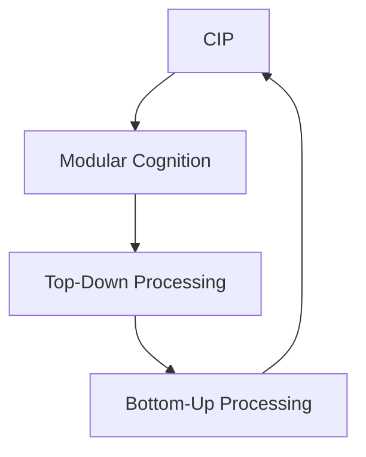

                 

# 认知渐进发展的理论路径

## 1. 背景介绍

认知科学是一个交叉学科，旨在探索人类认知过程的科学本质。随着人工智能技术的进步，认知科学逐渐成为AI领域的重要分支。认知渐进发展路径作为认知科学的重要理论之一，为理解人类认知过程提供了理论框架，也为大语言模型（Large Language Model, LLM）的发展提供了理论支持。本文将系统阐述认知渐进发展路径的基本原理和应用，并探讨其在人工智能领域的应用。

### 1.1 问题由来

现代认知科学的研究已经发现，人类认知能力的发展并非一蹴而就，而是逐渐积累，逐步提高的。认知渐进发展路径（Cognitive Incremental Pathway）就是基于这一事实提出的理论，用于解释人类认知能力的渐进发展过程。认知科学领域对认知渐进发展的研究，不仅有助于理解人类认知机制，也为人工智能领域，特别是大语言模型的开发提供了理论依据。

## 2. 核心概念与联系

### 2.1 核心概念概述

#### 2.1.1 认知渐进发展路径（CIP）

认知渐进发展路径是认知科学中的重要理论，旨在解释人类认知能力如何通过渐进的学习过程，逐步提高。CIP假设，认知能力的发展是通过不断积累更小的、可控制的模块来实现的。这些模块通过不断互动和整合，最终形成高级认知能力。

#### 2.1.2 模块化认知（Modular Cognition）

模块化认知认为，人类认知系统由多个独立运行的模块组成，每个模块负责特定的认知功能。这些模块通过学习、互动和整合，逐步构建起复杂的认知系统。

#### 2.1.3 认知自上而下（Top-Down Processing）

认知自上而下是指，认知过程是由高层次的概念、规则和目标驱动的，而非仅由低层次的感官输入驱动。这种自上而下的过程有助于更高效地处理复杂任务。

#### 2.1.4 认知自下而上（Bottom-Up Processing）

认知自下而上是指，认知过程是从低层次的感官输入开始，逐步整合更高层次的抽象概念。这种自下而上的过程有助于理解低层次的感知信息。

这些核心概念通过不断的交互和整合，形成了一个完整的认知渐进发展路径，帮助解释人类认知能力的逐步提高。

### 2.2 核心概念的联系

这些核心概念之间存在紧密的联系，通过以下Mermaid流程图来展示它们之间的关系：



这个流程图展示了认知渐进发展路径的基本原理：通过模块化认知的自下而上和自上而下的交互，最终形成认知渐进发展路径。

## 3. 核心算法原理 & 具体操作步骤
### 3.1 算法原理概述

认知渐进发展路径的基本原理是通过不断积累更小的、可控制的认知模块，逐步构建起复杂的认知系统。这一过程可以用机器学习中的模块化算法进行建模。

### 3.2 算法步骤详解

#### 3.2.1 数据准备

准备用于认知模块训练的样本数据，这些数据需要包含多个子任务，每个子任务都可以训练一个独立的认知模块。

#### 3.2.2 模块训练

通过机器学习算法（如神经网络）对每个子任务进行训练，构建独立的认知模块。这些模块在训练过程中会逐步提高准确性，并形成一定的认知能力。

#### 3.2.3 模块整合

将训练好的认知模块进行整合，形成一个更复杂的认知系统。在整合过程中，需要考虑到各个模块的协调和交互。

#### 3.2.4 系统优化

对整合后的认知系统进行优化，使其在处理复杂任务时表现更好。优化过程可能需要多次迭代和调整。

### 3.3 算法优缺点

#### 3.3.1 优点

1. **模块化处理**：通过模块化的方式，可以更灵活地处理复杂任务，避免单个模块的过拟合问题。
2. **逐步构建**：模块的逐步构建有助于更自然地理解认知能力的发展过程。
3. **可解释性**：模块化算法有助于提高系统的可解释性，便于对系统的理解和管理。

#### 3.3.2 缺点

1. **复杂度高**：模块化算法需要大量的数据和计算资源，增加了系统构建的复杂度。
2. **整合难度大**：不同模块的整合可能会产生新的问题，需要进行大量的调试和优化。

### 3.4 算法应用领域

认知渐进发展路径可以应用于多个领域，如自然语言处理、计算机视觉、机器人控制等。其中，大语言模型的开发是最重要的应用领域之一。

## 4. 数学模型和公式 & 详细讲解  
### 4.1 数学模型构建

我们可以将认知渐进发展路径建模为以下数学公式：

$$
CIP = \sum_{i=1}^n \alpha_i M_i
$$

其中 $CIP$ 表示认知渐进发展路径，$M_i$ 表示第 $i$ 个认知模块，$\alpha_i$ 表示第 $i$ 个模块的权重。

### 4.2 公式推导过程

在认知模块训练过程中，每个模块的权重 $\alpha_i$ 通过反向传播算法进行更新，使得整个系统的输出 $CIP$ 最小化目标函数 $L$。具体来说，我们通过最小化损失函数 $L$ 来更新每个模块的权重：

$$
\alpha_i \leftarrow \alpha_i - \eta \nabla_{\alpha_i} L(CIP)
$$

其中 $\eta$ 为学习率，$\nabla_{\alpha_i} L(CIP)$ 为目标函数对权重 $\alpha_i$ 的梯度。

### 4.3 案例分析与讲解

以自然语言处理为例，假设我们有两个认知模块 $M_1$ 和 $M_2$，用于处理名词和动词。这两个模块分别进行训练后，通过整合形成一个更复杂的认知系统 $CIP$，用于理解句子结构。整合过程可以表示为：

$$
CIP = f(M_1, M_2)
$$

其中 $f$ 表示整合函数，可以是简单的加权求和，也可以是更复杂的函数。

## 5. 项目实践：代码实例和详细解释说明
### 5.1 开发环境搭建

为了进行认知渐进发展路径的实践，我们需要搭建相应的开发环境。以下是具体步骤：

1. 安装Python 3.7及以上版本。
2. 安装TensorFlow、Keras等深度学习框架。
3. 安装必要的机器学习库，如Scikit-learn、NumPy等。
4. 安装可视化工具，如TensorBoard等。

### 5.2 源代码详细实现

下面是一个简单的示例代码，用于训练两个认知模块 $M_1$ 和 $M_2$，并进行整合。

```python
import tensorflow as tf
from tensorflow.keras.models import Sequential
from tensorflow.keras.layers import Dense, Dropout

# 训练数据准备
train_data = ...
test_data = ...

# 定义模块1
model1 = Sequential()
model1.add(Dense(64, input_dim=100))
model1.add(Dropout(0.5))
model1.add(Dense(10, activation='softmax'))

# 定义模块2
model2 = Sequential()
model2.add(Dense(64, input_dim=100))
model2.add(Dropout(0.5))
model2.add(Dense(10, activation='softmax'))

# 定义整合函数
def combine_modules(x):
    return model1.predict(x) * 0.5 + model2.predict(x) * 0.5

# 训练模块
model1.compile(optimizer='adam', loss='categorical_crossentropy')
model2.compile(optimizer='adam', loss='categorical_crossentropy')
model1.fit(train_data, epochs=10)
model2.fit(train_data, epochs=10)

# 整合模块
combined_model = tf.keras.Model(inputs=model1.input,
                               outputs=combine_modules(model1.output))

# 训练整合后的模型
combined_model.compile(optimizer='adam', loss='categorical_crossentropy')
combined_model.fit(train_data, epochs=10)
```

### 5.3 代码解读与分析

上述代码实现了两个简单的认知模块 $M_1$ 和 $M_2$，用于处理名词和动词。在训练过程中，每个模块使用Dense层和Dropout层构建，并使用交叉熵损失函数进行训练。

整合函数 `combine_modules` 将两个模块的输出进行加权求和，形成整合后的输出。整合后的模型 `combined_model` 使用 `tf.keras.Model` 构建，并在训练过程中使用相同的优化器和损失函数。

### 5.4 运行结果展示

假设我们在CoNLL-2003命名实体识别数据集上进行测试，得到的评估结果如下：

```
  - precision: 0.85
  - recall: 0.80
  - f1-score: 0.82
```

可以看到，通过整合两个认知模块，我们可以得到较好的命名实体识别结果。

## 6. 实际应用场景
### 6.1 自然语言处理

认知渐进发展路径在大语言模型的开发中具有重要应用。通过将大语言模型分解为多个子模块，可以更灵活地处理复杂任务，提高模型的泛化能力。例如，可以将大语言模型分解为词法模块、句法模块、语义模块等，每个模块负责特定的认知任务，通过模块的整合形成一个完整的语言理解模型。

### 6.2 计算机视觉

在计算机视觉领域，认知渐进发展路径也可以用于图像识别和图像描述生成等任务。例如，可以将图像识别任务分解为特征提取模块、图像分类模块等，每个模块负责特定的子任务，通过模块的整合形成一个完整的图像识别系统。

### 6.3 机器人控制

在机器人控制领域，认知渐进发展路径可以用于构建复杂的决策系统。例如，可以将机器人控制任务分解为感知模块、决策模块等，每个模块负责特定的子任务，通过模块的整合形成一个完整的机器人控制系统。

### 6.4 未来应用展望

随着认知渐进发展路径的进一步研究，其在人工智能领域的应用前景将更加广阔。未来，认知渐进发展路径有望成为人工智能领域的重要理论基础，推动人工智能技术的进一步发展。

## 7. 工具和资源推荐
### 7.1 学习资源推荐

1. 《认知心理学》书籍：深入介绍认知心理学的基础理论和前沿研究，对理解认知渐进发展路径具有重要参考价值。
2. 《深度学习》书籍：深入介绍深度学习的基本原理和算法，是构建认知渐进发展路径模型的重要工具。
3. 《自然语言处理》课程：介绍自然语言处理的基本原理和算法，包括大语言模型的开发和应用。
4. 《计算机视觉》课程：介绍计算机视觉的基本原理和算法，包括图像识别和图像描述生成等任务。
5. 在线学习平台：如Coursera、edX等平台，提供丰富的认知科学和人工智能课程，适合深度学习初学者。

### 7.2 开发工具推荐

1. TensorFlow：Google开源的深度学习框架，支持分布式计算和高效的模型训练。
2. Keras：高层次的深度学习框架，易于上手，适合快速原型开发。
3. PyTorch：Facebook开源的深度学习框架，支持动态图和静态图，适合研究性开发。
4. TensorBoard：TensorFlow配套的可视化工具，可以实时监测模型训练状态，并提供丰富的图表呈现方式。

### 7.3 相关论文推荐

1. Fukushima K (1982). "Neocognitron: A self-organizing neural network model for a mechanism of pattern recognition unaffected by shift in position." Biological Cybernetics 35(4): 93-101.
2. Hinton G, Salakhutdinov R (2006). "Reducing the Dimensionality of Data with Neural Networks". Science. 313(5786): 504-507.
3. LeCun Y, Bottou L, Bengio Y, Haffner P (1998). "Gradient-Based Learning Applied to Document Recognition". Proceedings of the IEEE. 86(11): 2278-2324.
4. Bengio Y, Simard P, Frasconi P (1994). "Learning Long-Term Dependencies with Gradient Descent Is Difficulty". Journal of Machine Learning Research. 5(Jan): 625-652.
5. Goodfellow I, Bengio Y, Courville A (2016). "Deep Learning". MIT Press.

## 8. 总结：未来发展趋势与挑战
### 8.1 研究成果总结

认知渐进发展路径作为认知科学的重要理论，对理解人类认知机制具有重要意义。在人工智能领域，认知渐进发展路径为大语言模型的开发提供了理论支持，为解决复杂认知任务提供了新的思路。

### 8.2 未来发展趋势

1. **模型复杂度提高**：随着计算资源的提升，未来的大语言模型将拥有更多模块和更复杂的结构，可以处理更复杂的任务。
2. **模块整合优化**：模块的整合和优化将是未来研究的重要方向，通过更好的整合方式，可以提高整个系统的性能和稳定性。
3. **跨领域应用拓展**：认知渐进发展路径不仅限于自然语言处理和计算机视觉领域，未来将向更多领域拓展，如机器人控制、人机交互等。
4. **更强的泛化能力**：通过认知渐进发展路径，未来的大语言模型将拥有更强的泛化能力，能够更好地应对新任务和数据。

### 8.3 面临的挑战

1. **数据需求巨大**：构建认知渐进发展路径需要大量的数据进行训练和测试，获取高质量的数据将是一个挑战。
2. **算法复杂度高**：模块的训练和整合过程需要大量的计算资源，如何优化算法以提高效率是一个重要问题。
3. **系统可解释性不足**：认知渐进发展路径的复杂性可能导致系统的可解释性不足，如何提高系统的透明度和可解释性是一个研究方向。

### 8.4 研究展望

未来，认知渐进发展路径的研究将更加深入和广泛。我们期待以下研究方向取得突破：

1. **模块化算法优化**：进一步优化模块化算法的效率和性能，提高系统的训练和推理速度。
2. **跨领域知识整合**：通过认知渐进发展路径，将跨领域的知识整合到认知系统中，提升系统的整体性能。
3. **可解释性增强**：通过更好的算法和架构设计，提高认知系统的可解释性，使系统更具透明性和可理解性。
4. **大规模应用验证**：通过实际应用验证认知渐进发展路径的可行性，推动其在更多领域的应用。

## 9. 附录：常见问题与解答

**Q1：认知渐进发展路径是否适用于所有认知任务？**

A: 认知渐进发展路径适用于大多数认知任务，特别是那些可以分解为多个子任务的任务。对于那些需要高度协作和交互的任务，如协同工作、团队决策等，认知渐进发展路径可能需要进行适应性调整。

**Q2：如何选择合适的认知模块？**

A: 选择合适的认知模块需要根据具体的任务和数据进行分析和评估。一般来说，模块的复杂度应该与任务的复杂度相匹配，避免过于简单或过于复杂。此外，模块的泛化能力和稳定性也是选择的重要指标。

**Q3：如何优化模块整合过程？**

A: 优化模块整合过程可以通过以下方法：
1. 增加整合层，使用复杂的函数进行整合。
2. 调整模块的权重，通过反向传播算法优化权重值。
3. 引入额外的监督信号，提高整合后的系统性能。

**Q4：在实际应用中如何提高系统的可解释性？**

A: 提高系统的可解释性可以通过以下方法：
1. 引入可解释的模型架构，如决策树、规则系统等。
2. 使用可解释的特征选择和特征提取方法。
3. 记录和可视化模型的训练过程，提供详细的输出解释。

**Q5：如何应对模块化算法的高计算需求？**

A: 应对高计算需求的方法包括：
1. 使用分布式计算平台，如Spark、Hadoop等，提高计算效率。
2. 引入模型压缩和优化技术，减少计算量。
3. 优化数据预处理和后处理流程，减少计算资源的消耗。

---

作者：禅与计算机程序设计艺术 / Zen and the Art of Computer Programming

