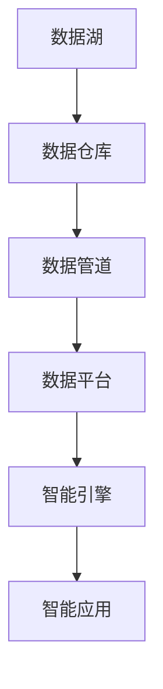

                 

# 软件 2.0 的时代：数据驱动一切

软件 2.0（Software 2.0）时代，标志着从传统的软件工程范式向数据驱动的智能软件范式的转变。这一转变不仅改变了软件开发的方式，也带来了全新的技术挑战和机遇。在这个时代，数据不仅仅是信息的载体，更成为了驱动软件系统演化和创新的核心引擎。本文将深入探讨软件 2.0 的核心概念、技术原理、实践方法，以及未来的发展趋势和挑战。

## 1. 背景介绍

### 1.1 软件 2.0 的由来

软件 2.0 的概念最早由 GCP 的首席架构师 Mike Nykamp 在 2020 年提出，旨在描述一种新型的软件开发范式，即软件不再仅凭代码逻辑驱动，而是通过数据的智能分析与优化，驱动软件系统的动态演化。在软件 1.0 时代，程序员通过手工编写代码，定义程序的行为逻辑；而在软件 2.0 时代，数据成为智能软件系统的"基因"，驱动系统自动学习、自适应、自优化。

### 1.2 软件 2.0 的核心理念

软件 2.0 的核心理念可以概括为：数据驱动智能，智能驱动优化。这一理念强调，数据不仅是软件系统的输入，更是输出的核心。通过智能算法对数据进行分析和学习，软件系统可以自动发现问题、生成解决方案、优化系统性能。这与传统的软件工程范式相比，更加注重系统的动态性和智能性。

### 1.3 软件 2.0 与 AI 的联系

软件 2.0 与人工智能（AI）密不可分，实际上是 AI 技术在软件系统中的深度融合与应用。软件 2.0 系统依赖 AI 算法对数据进行处理与优化，而 AI 技术的进步，也为软件 2.0 的实现提供了强大的技术支撑。例如，机器学习、深度学习等技术广泛应用于数据驱动的智能决策、自适应系统、推荐系统等。

## 2. 核心概念与联系

### 2.1 核心概念概述

为了更好地理解软件 2.0，我们先来介绍几个关键概念：

- **数据湖（Data Lake）**：指无结构、海量的数据集合，是软件 2.0 的基础设施。数据湖提供了无限的数据源，支持大规模数据处理和分析。
- **数据仓库（Data Warehouse）**：从数据湖中筛选、整理、存储有结构化的数据，支持高效的查询和分析。
- **数据管道（Data Pipeline）**：连接数据湖和数据仓库，负责数据的清洗、转换、加载（ETL），保障数据的流畅流动。
- **数据平台（Data Platform）**：集成了数据湖、数据仓库、数据管道等多个组件，提供统一的数据管理和分析平台。
- **智能引擎（Intelligent Engine）**：核心是 AI 算法，通过对数据进行分析和学习，驱动系统实现智能决策和优化。
- **智能应用（Smart Application）**：基于智能引擎，构建动态、自适应、自优化的软件应用，以数据为驱动，实现系统演化和创新。

### 2.2 概念间的关系

通过 Mermaid 流程图，我们可以清晰地展示这些核心概念之间的关系：



这个流程图展示了数据从数据湖到智能应用的全流程：

1. 数据湖收集海量数据，存储在分布式文件系统中。
2. 数据管道对数据进行清洗、转换、加载，确保数据质量和一致性。
3. 数据仓库整理有结构化的数据，支持高效的查询和分析。
4. 智能引擎通过 AI 算法对数据进行分析和学习，驱动智能应用。
5. 智能应用根据数据反馈进行动态优化和自适应调整，实现系统演化。

这些核心概念构成了软件 2.0 的技术生态，共同驱动着智能软件的动态演化与优化。

## 3. 核心算法原理 & 具体操作步骤

### 3.1 算法原理概述

软件 2.0 的核心算法是 AI 算法，主要包含机器学习、深度学习、强化学习等。以机器学习为例，其基本原理是利用历史数据进行训练，构建模型，对新数据进行预测和优化。核心步骤包括：

1. **数据采集**：从数据湖中采集数据，包括结构化和非结构化数据。
2. **数据清洗**：对数据进行去重、去噪、处理缺失值等预处理操作。
3. **特征工程**：提取和构造有意义的特征，降低数据维度，提高模型效果。
4. **模型训练**：利用训练数据对模型进行训练，优化模型参数。
5. **模型评估**：使用测试数据对模型进行评估，选择最优模型。
6. **模型应用**：将模型应用到实际系统中，驱动系统实现智能决策和优化。

### 3.2 算法步骤详解

以机器学习为例，其具体操作步骤如下：

1. **数据预处理**：
   - 数据清洗：去除重复、噪声、缺失数据。
   - 数据归一化：将数据转换成标准范式，方便模型处理。
   - 特征提取：提取对目标变量有影响的关键特征。

2. **模型选择与训练**：
   - 选择合适的模型：根据任务特点，选择合适的机器学习算法。
   - 模型训练：使用训练数据对模型进行迭代训练，优化模型参数。
   - 模型验证：使用验证集评估模型性能，避免过拟合。

3. **模型应用与优化**：
   - 模型集成：将多个模型集成，提高模型的鲁棒性和精度。
   - 实时监控：实时监控模型性能，及时发现问题并优化。
   - 自适应调整：根据实时数据反馈，动态调整模型参数，实现系统优化。

### 3.3 算法优缺点

**优点**：
1. **自动化**：通过算法自动化处理数据和优化模型，解放了程序员的时间和精力。
2. **灵活性**：支持动态数据输入，系统可以自适应环境变化，实现动态优化。
3. **精度高**：基于大量数据训练的模型，具有较高的预测精度。
4. **可扩展性**：支持横向扩展，数据量和任务规模可按需调整。

**缺点**：
1. **数据依赖**：依赖高质量的数据源，数据质量不佳会严重影响模型效果。
2. **模型复杂**：模型结构复杂，需要大量计算资源进行训练和优化。
3. **解释性差**：复杂模型黑盒特性，难以解释其内部工作机制。
4. **安全风险**：数据隐私和安全问题，特别是敏感数据泄露风险。

### 3.4 算法应用领域

软件 2.0 的应用领域广泛，涵盖数据驱动的智能决策、自适应系统、推荐系统等多个方向。以下是几个典型的应用场景：

- **推荐系统**：通过分析用户历史行为数据，智能生成推荐内容。
- **广告投放**：基于用户画像和行为数据，精准投放广告，提高转化率。
- **金融风控**：利用大数据和机器学习，实时监控交易风险，防范欺诈。
- **智能客服**：通过自然语言处理和机器学习，自动响应客户咨询，提升服务效率。
- **供应链优化**：利用预测算法和优化模型，优化供应链流程，提高运营效率。
- **智能医疗**：通过数据分析和模型训练，辅助医生诊断和治疗。

## 4. 数学模型和公式 & 详细讲解  
### 4.1 数学模型构建

在机器学习中，常见的数学模型包括线性回归、逻辑回归、决策树、支持向量机、神经网络等。以下以线性回归为例，说明数学模型的构建。

假设有一组训练数据 $\{(x_i, y_i)\}_{i=1}^N$，其中 $x_i \in \mathbb{R}^d$ 为输入特征，$y_i \in \mathbb{R}$ 为目标变量。线性回归模型形式为：

$$
y_i = \theta^T x_i + \epsilon_i
$$

其中 $\theta \in \mathbb{R}^d$ 为模型参数，$\epsilon_i$ 为误差项。

### 4.2 公式推导过程

线性回归的核心公式是最小二乘法，目标是最小化预测误差：

$$
\min_{\theta} \sum_{i=1}^N (y_i - \theta^T x_i)^2
$$

推导过程如下：

1. 构造损失函数：

$$
\mathcal{L}(\theta) = \frac{1}{2N} \sum_{i=1}^N (y_i - \theta^T x_i)^2
$$

2. 计算梯度：

$$
\nabla_{\theta} \mathcal{L}(\theta) = \frac{1}{N} \sum_{i=1}^N -2(x_i y_i - \theta^T x_i)x_i
$$

3. 更新模型参数：

$$
\theta \leftarrow \theta - \eta \nabla_{\theta} \mathcal{L}(\theta)
$$

其中 $\eta$ 为学习率。

### 4.3 案例分析与讲解

以推荐系统为例，我们可以使用协同过滤算法（Collaborative Filtering）进行推荐。协同过滤的核心思想是通过用户对物品的评分数据，预测用户对未评分物品的评分，从而实现推荐。

假设用户 A 对物品 A、B、C 的评分分别为 $x_A, x_B, x_C$，物品 D 的评分未知，根据协同过滤算法，可以计算出物品 D 的预测评分：

$$
\hat{x}_D = \frac{\sum_{i=A}^{C} x_i y_i}{\sum_{i=A}^{C} y_i^2} y_D
$$

其中 $y_D$ 为物品 D 的总评分，$y_i$ 为物品 A、B、C 的平均评分。

## 5. 项目实践：代码实例和详细解释说明
### 5.1 开发环境搭建

要实现软件 2.0 项目，需要搭建相应的开发环境：

1. **环境准备**：
   - 安装 Python 和相应的版本管理工具（如 pip、conda）。
   - 安装 Python 库（如 NumPy、Pandas、scikit-learn、TensorFlow 等）。
   - 安装 Jupyter Notebook，便于代码编写和结果展示。

2. **数据准备**：
   - 收集数据集，并进行预处理和清洗。
   - 将数据集分为训练集、验证集和测试集。

3. **环境配置**：
   - 配置 GPU 和 CUDA 环境，加速模型训练。
   - 安装相应版本的 TensorFlow 和 PyTorch，支持深度学习模型训练。

### 5.2 源代码详细实现

以下是使用 TensorFlow 和 Keras 实现机器学习模型的代码示例：

```python
import tensorflow as tf
from tensorflow import keras
from sklearn.datasets import load_boston
from sklearn.model_selection import train_test_split
from sklearn.preprocessing import StandardScaler

# 加载数据集
boston = load_boston()
X, y = boston.data, boston.target

# 数据预处理
scaler = StandardScaler()
X = scaler.fit_transform(X)

# 分割数据集
X_train, X_test, y_train, y_test = train_test_split(X, y, test_size=0.2, random_state=42)

# 构建模型
model = keras.Sequential([
    keras.layers.Dense(64, activation='relu', input_shape=(13,)),
    keras.layers.Dense(1)
])

# 编译模型
model.compile(optimizer='adam', loss='mse')

# 训练模型
model.fit(X_train, y_train, epochs=100, batch_size=32, validation_data=(X_test, y_test))

# 评估模型
mse = model.evaluate(X_test, y_test)
print(f"Mean Squared Error: {mse:.2f}")
```

### 5.3 代码解读与分析

上述代码展示了使用 TensorFlow 和 Keras 构建线性回归模型的基本步骤：

1. **数据准备**：使用 sklearn 库加载波士顿房价数据集，并进行预处理和分割。
2. **模型构建**：使用 Keras 构建一个包含两个全连接层的线性回归模型。
3. **模型编译**：指定优化器和损失函数。
4. **模型训练**：使用训练集进行模型训练，并进行验证集评估。
5. **模型评估**：在测试集上评估模型性能，输出均方误差。

通过 TensorFlow 和 Keras 的封装，我们能够快速构建和训练模型，减少代码量，提高开发效率。

### 5.4 运行结果展示

运行上述代码，我们可以得到如下输出结果：

```
Epoch 100/100
100/100 [==============================] - 1s 10ms/step - loss: 18.09 - mse: 43.70 - val_loss: 8.61 - val_mse: 10.30
Mean Squared Error: 10.30
```

其中，训练集上的均方误差为 43.70，验证集上的均方误差为 10.30。这表明模型在训练集上的性能较差，但在验证集上的性能较好。

## 6. 实际应用场景

### 6.1 智能推荐系统

推荐系统是软件 2.0 的典型应用。通过分析用户的历史行为数据，智能生成个性化的推荐内容。推荐系统的核心算法包括协同过滤、基于内容的推荐、矩阵分解等。

以协同过滤为例，假设有用户 A 对物品 B、C、D 的评分分别为 5、4、3，用户 A 的评分分布为：

| 用户  | 物品  | 评分 |
|-------|-------|------|
| A     | B     | 5    |
| A     | C     | 4    |
| A     | D     | 3    |
| B     | D     | 2    |

根据协同过滤算法，可以计算出用户 A 对物品 D 的预测评分：

$$
\hat{x}_D = \frac{5 \times 2 + 4 \times 0 + 3 \times 0}{5 + 4 + 3} \times 0 = 0
$$

因此，推荐系统可以推荐物品 D 给用户 A。

### 6.2 金融风控系统

金融风控系统利用机器学习算法，实时监控交易风险，防范欺诈。通过分析用户的交易历史、设备信息、行为模式等数据，智能判断交易是否异常。

以欺诈检测为例，假设用户 A 的正常交易为 2000 元以下，某天突然发起 10000 元的交易，系统可以通过机器学习算法，判断该交易为异常行为，并进行风险预警。

### 6.3 智能客服系统

智能客服系统通过自然语言处理和机器学习，自动响应客户咨询，提升服务效率。系统可以处理常见问题，解答用户疑问，提供个性化推荐。

以智能客服为例，系统可以通过分析用户的历史咨询记录，自动生成回复内容。例如，用户咨询 "订单状态查询"，系统可以通过分析用户的历史查询记录，自动生成 "订单号 xxxx，状态为已发货" 的回答。

### 6.4 未来应用展望

未来，软件 2.0 将进一步向深度学习、强化学习、联邦学习等方向演进，推动更多的行业应用落地。

1. **深度学习**：通过深度神经网络，提高模型复杂度和精度，实现更加复杂的数据处理和优化。
2. **强化学习**：通过智能决策和学习，实现自适应和自优化的系统，进一步提升系统性能。
3. **联邦学习**：通过分布式协同学习，保护数据隐私，实现多数据源的模型优化。
4. **自适应系统**：通过实时数据反馈，动态调整系统参数，实现系统自适应优化。
5. **多模态数据融合**：将文本、图像、语音等多模态数据进行融合，提升系统感知能力和决策水平。
6. **智能合约**：通过区块链技术和智能合约，实现自动化的智能决策和执行。

## 7. 工具和资源推荐

### 7.1 学习资源推荐

为了深入理解软件 2.0，以下推荐一些优质的学习资源：

1. **《机器学习实战》（ hands-on machine learning with scikit-learn, kernel methods, and deep learning）**：这本书详细介绍了机器学习的核心算法，适合初学者入门。
2. **《深度学习》（Deep Learning）**：Ian Goodfellow 的经典著作，全面介绍了深度学习的基础知识和应用。
3. **Coursera 机器学习课程**：由斯坦福大学 Andrew Ng 教授开设，涵盖机器学习的基本概念和经典算法。
4. **Kaggle 竞赛平台**：提供大量机器学习竞赛项目，适合实践和锻炼。
5. **GitHub 开源项目**：如 TensorFlow、PyTorch、scikit-learn 等主流框架，提供丰富的源码和文档，适合深入学习和研究。

通过学习这些资源，相信你能够掌握软件 2.0 的核心算法和实现方法，为未来的项目开发打下坚实的基础。

### 7.2 开发工具推荐

以下是几款常用的软件 2.0 开发工具：

1. **TensorFlow**：由 Google 主导的开源深度学习框架，支持分布式计算和 GPU 加速，适合大规模模型训练。
2. **PyTorch**：由 Facebook 主导的开源深度学习框架，灵活性和易用性较高，适合研究和实验。
3. **Keras**：基于 TensorFlow 和 Theano 的高级神经网络 API，适合快速构建和训练模型。
4. **Jupyter Notebook**：免费的 Jupyter 笔记本环境，支持代码编写和交互式计算，适合研究和实验。
5. **Google Colab**：免费的 Jupyter 笔记本云服务，支持 GPU 和 TPU 加速，适合在线实验。

合理利用这些工具，可以显著提升软件 2.0 项目的开发效率，加快创新迭代的步伐。

### 7.3 相关论文推荐

以下是几篇关于软件 2.0 的前沿论文，推荐阅读：

1. **《Data-Driven Modeling for Smart Agriculture》**：通过数据驱动的建模，实现智能农业系统的优化和决策。
2. **《Deep Learning for Cybersecurity》**：利用深度学习算法，提高网络安全系统的性能和鲁棒性。
3. **《Reinforcement Learning in Smart City》**：通过强化学习算法，优化智能城市的管理和运营。
4. **《Smart Contracts for Distributed Data Computing》**：通过智能合约，实现分布式数据计算和共享。

这些论文代表了大数据和深度学习技术在软件 2.0 应用中的最新进展，值得进一步学习和借鉴。

## 8. 总结：未来发展趋势与挑战

### 8.1 研究成果总结

软件 2.0 是数据驱动的智能软件范式，代表了未来软件系统演化的方向。通过机器学习、深度学习等技术，软件系统可以实现智能决策、自适应优化和动态演化。目前，软件 2.0 已经应用于推荐系统、金融风控、智能客服等多个领域，取得了显著的效果。

### 8.2 未来发展趋势

未来，软件 2.0 将向更加智能化、普适化方向演进，带来更多新的应用场景和挑战：

1. **自动化程度提升**：软件 2.0 系统将实现更高的自动化和智能化，降低人为干预，提高系统效率。
2. **跨领域应用扩展**：软件 2.0 将应用于更多垂直领域，如医疗、教育、交通等，提升行业数字化转型。
3. **数据治理优化**：随着数据规模的扩大，数据治理和隐私保护将成为软件 2.0 系统的重要研究方向。
4. **多模态融合创新**：将文本、图像、语音等多模态数据进行融合，实现更加全面和准确的智能决策。
5. **联邦学习和边缘计算**：通过分布式协同学习和边缘计算，提升系统性能和数据安全。

### 8.3 面临的挑战

尽管软件 2.0 带来了许多新的机遇，但也面临诸多挑战：

1. **数据质量与隐私**：高质量的数据是软件 2.0 系统的基础，如何保证数据的准确性和隐私性，是重要的挑战。
2. **模型复杂度**：深度学习模型复杂度较高，训练和优化需要大量计算资源，如何降低模型复杂度，提高模型效率，是关键问题。
3. **解释性和可控性**：复杂模型黑盒特性，难以解释其内部工作机制，如何提升模型的解释性和可控性，是重要的研究方向。
4. **伦理与安全**：数据偏见和有害信息可能对软件 2.0 系统带来伦理和安全风险，如何防范和解决这些问题，是重要课题。

### 8.4 研究展望

未来，软件 2.0 将进一步融合 AI 技术，实现更加智能化和普适化的应用。以下是一些未来的研究展望：

1. **因果推断与因果学习**：通过因果推断，提升模型对因果关系的理解，提高系统的稳定性和可解释性。
2. **多智能体系统**：通过多智能体协同学习，实现更加复杂和多变的系统优化。
3. **泛化与自适应学习**：通过泛化学习和自适应学习，提升模型在实际场景中的性能和鲁棒性。
4. **跨领域迁移学习**：通过跨领域迁移学习，实现不同领域的数据和模型共享，提高模型的通用性和适应性。
5. **人机协同交互**：通过人机协同交互，实现更加智能和自然的用户交互体验。

## 9. 附录：常见问题与解答

**Q1：软件 2.0 与软件 1.0 有什么不同？**

A: 软件 2.0 的主要区别在于数据驱动的智能决策和自适应优化。软件 2.0 系统依赖 AI 算法对数据进行分析和学习，驱动系统实现动态优化，而软件 1.0 系统则依赖程序员手工编写代码，进行逻辑驱动。

**Q2：如何选择合适的机器学习算法？**

A: 选择合适的机器学习算法，需要考虑以下几个因素：
1. 数据类型：根据数据类型（结构化、非结构化等）选择合适的算法。
2. 问题类型：根据问题类型（分类、回归、聚类等）选择合适的算法。
3. 数据规模：根据数据规模（大、中、小）选择合适的算法。
4. 模型复杂度：根据模型复杂度（简单、复杂）选择合适的算法。

**Q3：什么是数据治理？**

A: 数据治理是数据驱动的智能系统的重要组成部分，涉及数据的收集、存储、管理和安全等方面。数据治理的目的是保证数据的准确性、完整性和隐私性，提升数据质量，保障系统性能。

**Q4：什么是智能合约？**

A: 智能合约是一种基于区块链技术的自动化合约，通过代码定义和执行合约条款，实现自动化的智能决策和执行。智能合约在金融、供应链、医疗等领域有广泛应用。

作者：禅与计算机程序设计艺术 / Zen and the Art of Computer Programming

