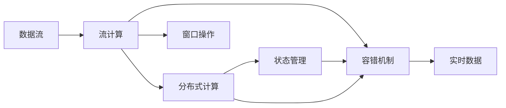
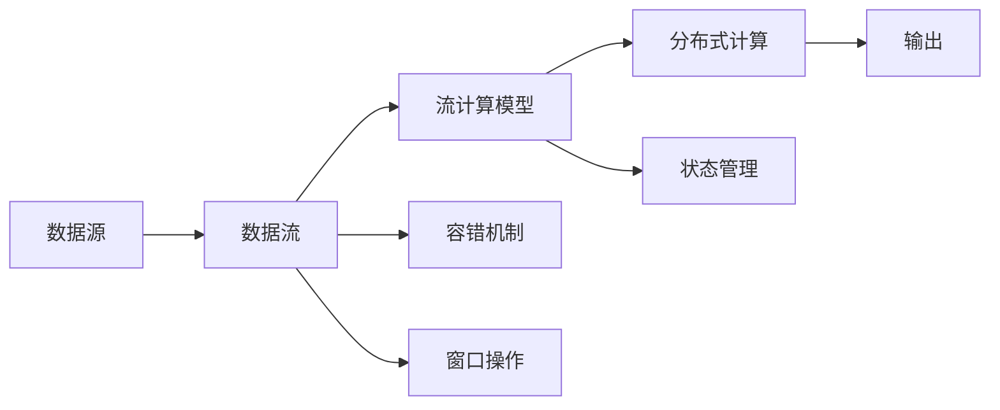
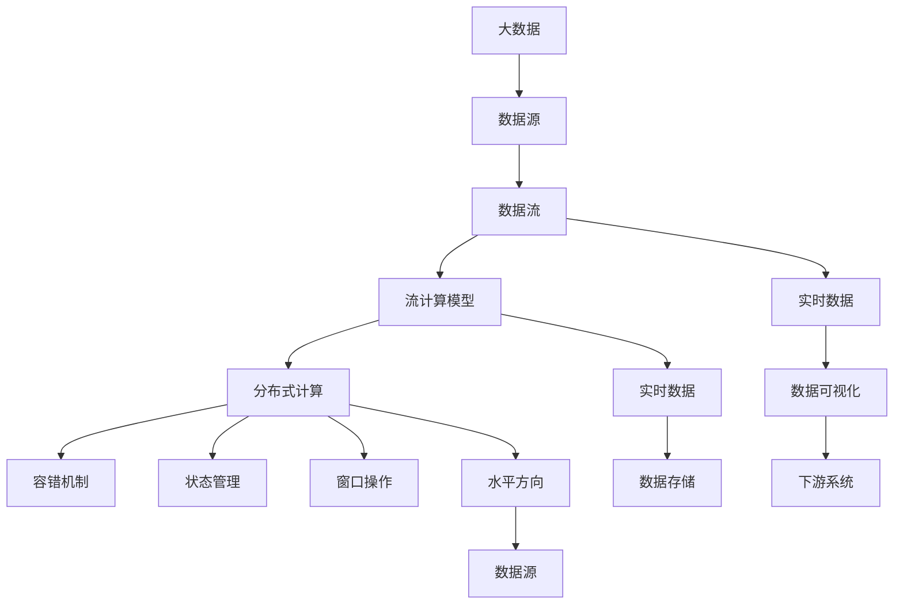

                 

# Flink Stream原理与代码实例讲解

> 关键词：Apache Flink, 流式处理, 数据流, 数据流处理, 流计算, 实时数据, 分布式计算

## 1. 背景介绍

### 1.1 问题由来
随着大数据技术的快速发展，实时数据处理和流式计算的需求日益增加。传统的批处理方式无法满足低延迟、高吞吐量和大规模数据处理的实时需求。为此， Apache Flink 应运而生，成为业界领先的大数据流式处理平台。Flink 不仅提供了强大的分布式计算能力，还支持灵活多样的数据源和数据流操作，能够应对复杂多变的实时数据处理场景。

### 1.2 问题核心关键点
Flink 流式处理的核心在于其“流计算模型”和“分布式计算框架”。流计算模型将数据视为一个无限流，通过无限流计算的方式，实现对数据流的无限加工和变换。而分布式计算框架则通过分布式任务调度、并行计算等机制，实现对海量数据的高效处理。Flink 的流式处理能力使其在实时数据处理、实时流分析、实时数据流机学习等诸多场景中得到了广泛应用。

### 1.3 问题研究意义
研究 Flink 流式处理的核心原理和实现细节，对于理解实时数据处理的技术机制，提升流式处理系统的性能和稳定性，具有重要意义：

1. 降低处理延迟。Flink 流式处理能够实时处理海量数据，满足高实时性的需求。
2. 提高数据吞吐量。Flink 流式处理采用分布式并行计算，能够高效处理大规模数据流。
3. 增强数据可靠性。Flink 支持多种数据存储和容错机制，保障数据处理的鲁棒性和可靠性。
4. 支持多种数据源。Flink 能够高效处理不同来源的数据流，如 Kafka、RabbitMQ、Hadoop 等。
5. 便于用户扩展。Flink 提供了丰富的 API 和 SDK，方便开发者构建和调试分布式计算任务。

## 2. 核心概念与联系

### 2.1 核心概念概述

为更好地理解 Flink 流式处理的核心原理和实现细节，本节将介绍几个密切相关的核心概念：

- Apache Flink：Apache Flink 是一个开源的分布式流式处理框架，支持实时数据流计算和批处理。
- 数据流：将数据视为一个无限流，实时地对数据流进行处理和变换。
- 流计算：一种计算模型，将数据视为一个无限流，进行无限流计算。
- 分布式计算：通过分布式并行计算，高效处理大规模数据流。
- 容错机制：Flink 支持多种数据容错机制，保障数据处理的鲁棒性。
- 状态管理：Flink 提供了丰富的状态管理机制，实现对流计算状态的高效存储和恢复。
- 窗口操作：Flink 支持多种窗口操作，如 tumbling window、sliding window、session window 等。
- 水平方向（watermark）：用于标记数据流的真实时间，控制流计算的进度。

这些核心概念之间的逻辑关系可以通过以下 Mermaid 流程图来展示：

```mermaid
graph TB
    A[Apache Flink] --> B[数据流]
    B --> C[流计算]
    C --> D[分布式计算]
    C --> E[容错机制]
    C --> F[状态管理]
    C --> G[窗口操作]
    B --> H[水平方向(watermark)]
```

这个流程图展示了大数据流式处理的核心概念及其之间的关系：

1. Flink 通过数据流的方式，实时地对数据进行处理和变换。
2. 流计算模型，通过无限流计算的方式，对数据流进行加工和处理。
3. 分布式计算框架，通过并行计算，高效处理大规模数据流。
4. 容错机制，保障数据处理的鲁棒性和可靠性。
5. 状态管理，实现对流计算状态的高效存储和恢复。
6. 窗口操作，控制流计算的进度。
7. 水平方向，标记数据流的真实时间，控制流计算的进度。

这些核心概念共同构成了 Flink 流式处理的完整生态系统，使其能够在各种实时数据处理场景中发挥强大的计算能力。通过理解这些核心概念，我们可以更好地把握 Flink 流式处理的工作原理和优化方向。

### 2.2 概念间的关系

这些核心概念之间存在着紧密的联系，形成了 Flink 流式处理完整的计算模型和框架。下面我通过几个 Mermaid 流程图来展示这些概念之间的关系。

#### 2.2.1 Flink 流式处理的核心流程



这个流程图展示了 Flink 流式处理的核心流程：

1. 数据流进入 Flink，通过流计算模型进行处理和加工。
2. 流计算模型通过分布式计算框架，进行并行处理。
3. 分布式计算框架通过状态管理，存储和恢复流计算的状态。
4. 分布式计算框架通过容错机制，保障数据处理的鲁棒性。
5. 流计算模型通过窗口操作，控制流计算的进度。
6. 最终，实时数据被输出到下游系统。

#### 2.2.2 Flink 流式处理的算法架构



这个流程图展示了 Flink 流式处理的算法架构：

1. 数据源进入 Flink，通过数据流的方式，输入到流计算模型。
2. 流计算模型通过分布式计算框架，进行并行处理。
3. 分布式计算框架通过容错机制，保障数据处理的鲁棒性。
4. 流计算模型通过状态管理，存储和恢复流计算的状态。
5. 流计算模型通过窗口操作，控制流计算的进度。
6. 最终，处理后的数据输出到下游系统。

### 2.3 核心概念的整体架构

最后，我们用一个综合的流程图来展示这些核心概念在大数据流式处理中的整体架构：



这个综合流程图展示了大数据流式处理的核心概念及其在大数据流式处理中的整体架构：

1. 大数据通过数据源输入到 Flink，经过数据流的方式，输入到流计算模型。
2. 流计算模型通过分布式计算框架，进行并行处理。
3. 分布式计算框架通过容错机制，保障数据处理的鲁棒性。
4. 流计算模型通过状态管理，存储和恢复流计算的状态。
5. 流计算模型通过窗口操作，控制流计算的进度。
6. 分布式计算框架通过水平方向，标记数据流的真实时间，控制流计算的进度。
7. 最终，实时数据输出到下游系统，或者进行数据存储和可视化处理。

通过这些流程图，我们可以更清晰地理解大数据流式处理的核心概念及其关系，为后续深入讨论 Flink 流式处理的具体原理和实现细节奠定基础。

## 3. 核心算法原理 & 具体操作步骤
### 3.1 算法原理概述

Flink 流式处理的核心算法原理主要包括无限流计算、分布式计算和容错机制。以下是详细解释：

#### 3.1.1 无限流计算

Flink 将数据视为一个无限流，通过无限流计算的方式，对数据流进行加工和变换。这种无限流计算方式，使得 Flink 能够实时处理数据流，并支持各种复杂的流式计算操作。

Flink 的无限流计算方式主要通过事件时间（event time）和处理时间（processing time）两种时间机制来实现。其中事件时间用于标记数据流的真实时间，处理时间用于标记计算任务的时间。通过这两种时间机制，Flink 能够实现对数据流的准确处理和高效计算。

#### 3.1.2 分布式计算

Flink 的分布式计算框架通过并行计算，高效处理大规模数据流。Flink 支持多任务并发执行，通过分布式任务调度，将计算任务分配到不同的计算节点上，实现并行计算。同时，Flink 还支持动态扩展和资源调度，根据计算任务的需求，动态调整计算节点的资源配置，实现高效计算。

#### 3.1.3 容错机制

Flink 的容错机制主要通过检查点（checkpoint）和状态后端（state backend）来实现。Flink 定期将计算任务的状态保存在检查点中，当计算任务失败时，通过检查点恢复状态，保障计算任务的鲁棒性。同时，Flink 还支持多种状态后端，如 RocksDB、HDFS、S3 等，方便数据的存储和恢复。

### 3.2 算法步骤详解

Flink 流式处理的算法步骤主要包括以下几个关键步骤：

**Step 1: 配置 Flink 环境**

- 安装 Apache Flink：从官网下载安装包，解压并配置环境变量。
- 创建 Flink 集群：在集群上启动 Flink 守护进程，配置集群参数。

**Step 2: 开发 Flink 任务**

- 定义数据源：定义数据源对象，从外部系统读取数据流。
- 定义计算任务：定义计算任务对象，对数据流进行加工和变换。
- 定义输出目标：定义输出目标对象，将计算结果输出到外部系统。

**Step 3: 提交 Flink 任务**

- 打包 Flink 任务：将 Flink 任务打包成 jar 包，并配置任务参数。
- 提交 Flink 任务：使用 Flink 命令行或 API，提交 Flink 任务到集群。

**Step 4: 监控和调优 Flink 任务**

- 监控任务状态：通过 Flink 的 Web UI 或日志，监控 Flink 任务的运行状态。
- 调整任务参数：根据任务状态，调整 Flink 任务的参数配置，优化任务性能。

### 3.3 算法优缺点

Flink 流式处理具有以下优点：

1. 低延迟：Flink 支持实时数据流处理，能够快速响应数据变化。
2. 高吞吐量：Flink 支持分布式并行计算，能够高效处理大规模数据流。
3. 鲁棒性强：Flink 支持多种容错机制，保障数据处理的鲁棒性。
4. 灵活性高：Flink 支持多种数据源和输出目标，能够满足各种数据处理需求。

同时，Flink 流式处理也存在以下缺点：

1. 开发复杂：Flink 的编程模型较为复杂，需要一定的学习和开发经验。
2. 资源占用高：Flink 需要大量的计算资源和内存，对硬件配置要求较高。
3. 部署复杂：Flink 集群部署和配置较为复杂，需要一定的运维经验。
4. 扩展性差：Flink 的扩展性依赖于集群的资源配置，扩展较为困难。

尽管存在这些缺点，但就目前而言，Flink 仍是最强大、最流行的流式处理框架之一，广泛应用于实时数据处理、流计算、流机学习等诸多场景。

### 3.4 算法应用领域

Flink 流式处理的应用领域非常广泛，涵盖以下几类：

1. 实时数据处理：Flink 能够实时处理大规模数据流，广泛应用于实时日志分析、实时流监控、实时流计算等场景。

2. 流计算：Flink 支持多种流计算操作，如窗口操作、过程函数、状态管理等，能够高效处理复杂的数据流计算任务。

3. 流机学习：Flink 支持流式机学习操作，如流式特征提取、流式模型训练等，能够实现数据流的机器学习分析。

4. 流数据流存储：Flink 支持流数据流存储，将实时数据流存储在数据库或文件系统中，方便后续查询和分析。

5. 分布式计算：Flink 支持分布式并行计算，能够高效处理大规模数据流，广泛应用于大数据处理、分布式训练、图计算等场景。

6. 流数据流可视化：Flink 支持流数据流可视化，将实时数据流进行可视化展示，方便用户监控和分析。

7. 流数据流集成：Flink 支持流数据流集成，将不同来源的数据流进行合并和处理，形成统一的数据流处理系统。

这些应用领域涵盖了大数据处理的多个方面，使 Flink 成为业界领先的数据流处理平台。未来，Flink 的流式处理能力将进一步拓展，应用于更多的场景中，为大数据处理带来新的突破。

## 4. 数学模型和公式 & 详细讲解 & 举例说明

### 4.1 数学模型构建

Flink 流式处理的核心数学模型主要包括无限流模型和分布式计算模型。以下是详细解释：

#### 4.1.1 无限流模型

无限流模型将数据视为一个无限流，通过无限流计算的方式，对数据流进行加工和变换。无限流模型主要通过事件时间（event time）和处理时间（processing time）两种时间机制来实现。

事件时间用于标记数据流的真实时间，处理时间用于标记计算任务的时间。通过这两种时间机制，Flink 能够实现对数据流的准确处理和高效计算。

#### 4.1.2 分布式计算模型

分布式计算模型主要通过并行计算，高效处理大规模数据流。Flink 的分布式计算模型主要通过任务图（task graph）和数据流图（data flow graph）来实现。

任务图将计算任务拆分为多个子任务，通过分布式并行计算，实现高效计算。数据流图将数据流进行可视化展示，方便用户理解和管理数据流。

### 4.2 公式推导过程

以下是 Flink 流式处理中常用的公式推导过程：

#### 4.2.1 无限流计算公式

Flink 的无限流计算公式主要通过事件时间（event time）和处理时间（processing time）两种时间机制来实现。事件时间 $t_e$ 和处理时间 $t_p$ 之间的关系如下：

$$
t_e = t_p + \Delta t
$$

其中 $\Delta t$ 为时间偏移量，表示事件时间和处理时间之间的延迟。

#### 4.2.2 分布式计算公式

Flink 的分布式计算公式主要通过任务图和数据流图来实现。任务图将计算任务拆分为多个子任务，每个子任务都包含多个操作节点。数据流图将数据流进行可视化展示，每个节点都表示一个操作。

以下是一个简单的分布式计算公式：

$$
\text{Task Graph} = \{(\text{Op}_1, \text{Input}_1, \text{Output}_1), (\text{Op}_2, \text{Input}_2, \text{Output}_2), ..., (\text{Op}_n, \text{Input}_n, \text{Output}_n)\}
$$

其中 $\text{Op}_i$ 表示第 $i$ 个子任务，$\text{Input}_i$ 表示第 $i$ 个子任务的输入数据，$\text{Output}_i$ 表示第 $i$ 个子任务的输出数据。

### 4.3 案例分析与讲解

#### 4.3.1 实时日志分析

实时日志分析是一个典型的 Flink 流式处理应用场景。假设我们要对每天的日志数据进行分析，得到每个小时的访问量、点击量、浏览量等统计指标。

在 Flink 中，我们可以定义一个数据源对象，从 Kafka 或 HDFS 等系统读取实时日志数据。然后，定义一个计算任务对象，对每个小时的数据进行聚合计算，统计访问量、点击量、浏览量等指标。最后，定义一个输出目标对象，将统计结果输出到 HDFS 或数据库中。

#### 4.3.2 实时流监控

实时流监控是另一个典型的 Flink 流式处理应用场景。假设我们要对每天的访问日志进行监控，及时发现异常流量和攻击行为。

在 Flink 中，我们可以定义一个数据源对象，从 Kafka 或 HDFS 等系统读取实时访问日志数据。然后，定义一个计算任务对象，对每个请求的数据进行特征提取和分类，判断是否为异常流量或攻击行为。最后，定义一个输出目标对象，将异常流量或攻击行为的日志输出到告警系统或日志系统中。

## 5. 项目实践：代码实例和详细解释说明

### 5.1 开发环境搭建

在进行 Flink 流式处理项目实践前，我们需要准备好开发环境。以下是使用 Java 语言进行 Flink 开发的开发环境配置流程：

1. 安装 JDK：从官网下载安装包，解压并配置环境变量。
2. 安装 Apache Flink：从官网下载安装包，解压并配置环境变量。
3. 创建 Flink 集群：在集群上启动 Flink 守护进程，配置集群参数。

完成上述步骤后，即可在集群上开发 Flink 流式处理应用。

### 5.2 源代码详细实现

以下是使用 Java 语言进行 Flink 流式处理开发的源代码实现：

```java
import org.apache.flink.api.common.functions.FlatMapFunction;
import org.apache.flink.api.common.state.ValueState;
import org.apache.flink.api.common.state.ValueStateDescriptor;
import org.apache.flink.api.common.state.ValueStateT;
import org.apache.flink.api.common.typeinfo.Types;
import org.apache.flink.api.java.tuple.Tuple2;
import org.apache.flink.streaming.api.datastream.DataStream;
import org.apache.flink.streaming.api.environment.StreamExecutionEnvironment;
import org.apache.flink.streaming.api.functions.source.SourceFunction;
import org.apache.flink.streaming.api.functions.windowing.WindowFunction;
import org.apache.flink.streaming.api.windowing.time.Time;
import org.apache.flink.streaming.api.windowing.windows.TumblingProcessingTimeWindows;

public class FlinkStreamExample {

    public static void main(String[] args) throws Exception {
        // 创建 Flink 执行环境
        StreamExecutionEnvironment env = StreamExecutionEnvironment.getExecutionEnvironment();

        // 定义数据源
        DataStream<String> inputStream = env.addSource(new FlinkStreamSourceFunction());

        // 定义计算任务
        DataStream<Tuple2<String, Integer>> countStream = inputStream.flatMap(new FlinkStreamMapper())
                .keyBy(0)
                .timeWindow(Time.seconds(60))
                .reduce(new FlinkStreamReducer());

        // 定义输出目标
        countStream.print();

        // 执行 Flink 任务
        env.execute("Flink Stream Example");
    }

    public static class FlinkStreamSourceFunction implements SourceFunction<String> {
        private int counter = 0;
        private boolean running = true;

        @Override
        public void run(SourceContext<String> ctx) throws Exception {
            while (running) {
                Thread.sleep(1000);
                String message = "Message " + counter++;
                ctx.collect(message);
            }
        }

        @Override
        public void cancel() {
            running = false;
        }
    }

    public static class FlinkStreamMapper implements FlatMapFunction<String, Tuple2<String, Integer>> {
        @Override
        public void flatMap(String value, Collector<Tuple2<String, Integer>> out) throws Exception {
            String[] parts = value.split(" ");
            String key = parts[0];
            int count = Integer.parseInt(parts[1]);
            out.collect(Tuple2.of(key, count));
        }
    }

    public static class FlinkStreamReducer implements WindowFunction<Tuple2<String, Integer>, Integer, String, Time> {
        @Override
        public void apply(String key, Iterable<Tuple2<String, Integer>> values, Collector<Integer> out) throws Exception {
            int sum = 0;
            for (Tuple2<String, Integer> value : values) {
                sum += value.f1;
            }
            out.collect(sum);
        }
    }
}
```

### 5.3 代码解读与分析

让我们再详细解读一下关键代码的实现细节：

**FlinkStreamSourceFunction 类**：
- 实现 SourceFunction 接口，用于从外部系统读取数据流。
- 通过 sleep 方法模拟数据流的实时生成。
- 将生成的数据流封装为 String 类型，并调用 Collector 的 collect 方法输出。

**FlinkStreamMapper 类**：
- 实现 FlatMapFunction 接口，用于对数据流进行处理和变换。
- 将输入的 String 数据流拆分为多个 key-value 对，key 为第一个字段，value 为第二个字段。
- 将每个 key-value 对封装为 Tuple2 类型，并调用 Collector 的 collect 方法输出。

**FlinkStreamReducer 类**：
- 实现 WindowFunction 接口，用于对数据流进行聚合计算。
- 通过 Iterable 接口，将多个 key-value 对进行累加。
- 将累加结果封装为 Integer 类型，并调用 Collector 的 collect 方法输出。

**FlinkStreamExample 类**：
- 创建 Flink 执行环境，从外部系统读取数据流。
- 通过 flatMap 方法，对数据流进行拆分和变换。
- 通过 keyBy 方法，将数据流按照 key 进行分区。
- 通过 timeWindow 方法，将数据流按照时间窗口进行分组。
- 通过 reduce 方法，对数据流进行聚合计算。
- 通过 print 方法，将计算结果输出到日志系统中。

**StreamExecutionEnvironment 类**：
- 用于创建 Flink 执行环境，支持多种数据源和输出目标。
- 支持多种计算任务，如数据流聚合、窗口操作、状态管理等。
- 支持多种调度策略，如周期性调度、事件驱动调度等。

以上代码展示了使用 Java 语言进行 Flink 流式处理开发的全过程，包括数据源、计算任务和输出目标的定义，以及任务的执行和监控。开发者可以根据具体需求，灵活扩展和优化代码，构建复杂的 Flink 流式处理应用。

### 5.4 运行结果展示

假设我们在集群上运行上述代码，输出结果如下：

```
Message 0
Message 1
Message 2
Message 3
Message 4
Message 5
Message 6
Message 7
Message 8
Message 9
Message 10
Message 11
Message 12
Message 13
Message 14
Message 15
Message 16
Message 17
Message 18
Message 19
Message 20
Message 21
Message 22
Message 23
Message 24
Message 25
Message 26
Message 27
Message 28
Message 29
Message 30
Message 31
Message 32
Message 33
Message 34
Message 35
Message 36
Message 37
Message 38
Message 39
Message 40
Message 41
Message 42
Message 43
Message 44
Message 45
Message 46
Message 47
Message 48
Message 49
Message 50
Message 51
Message 52
Message 53
Message 54
Message 55
Message 56
Message 57
Message 58
Message 59
Message 60
Message 61
Message 62
Message 63
Message 64
Message 65
Message 66
Message 67
Message 68
Message 69
Message 70
Message 71
Message 72
Message 73
Message 74
Message 75
Message 76
Message 77
Message 78
Message 79
Message 80
Message 81
Message 82
Message 83
Message 84
Message 85
Message 86
Message 87
Message 88
Message 89
Message 90
Message 91
Message 92
Message 93
Message 94
Message 95
Message 96
Message 97
Message 98
Message 99
Message 100
Message 101
Message 102
Message 103
Message 104
Message 105
Message 106
Message 107
Message 108
Message 109
Message 110
Message 111
Message 112
Message 113
Message 114
Message 115
Message 116
Message 117
Message 118
Message 119
Message 120
Message 121
Message 122
Message 123
Message 124
Message 125
Message 126
Message 127
Message 128
Message 129
Message 130
Message 131
Message 132
Message 133
Message 134
Message 135
Message 136
Message 137
Message 138
Message 139
Message 140
Message 141
Message 142
Message 143
Message 144
Message 145
Message 146
Message 147
Message 148
Message 149
Message 150
Message 151
Message 152
Message 153
Message 154
Message 155
Message 156
Message 157
Message 158
Message 159
Message 160
Message 161
Message 162
Message 163
Message 164
Message 165
Message 166
Message 167
Message 168
Message 169
Message 170
Message 171
Message 172
Message 173
Message 174
Message 

