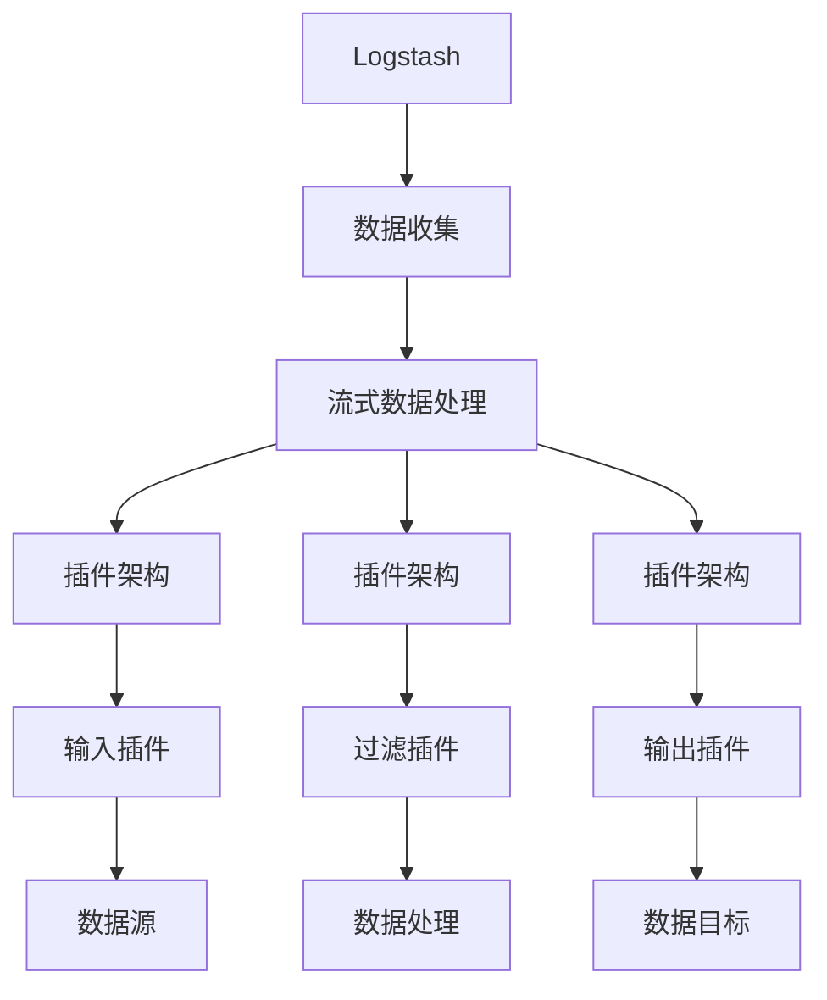
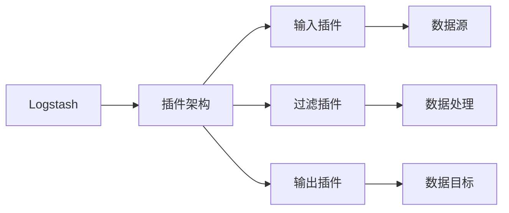
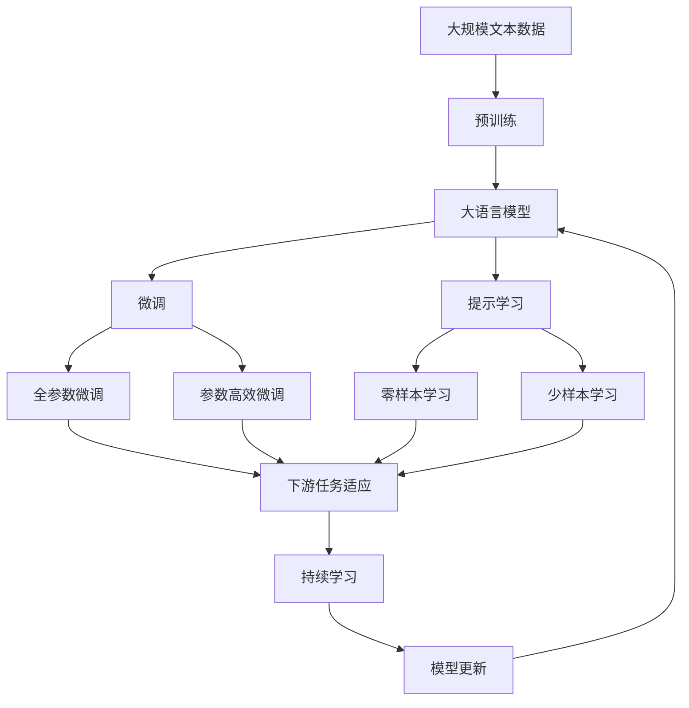

                 

# Logstash原理与代码实例讲解

> 关键词：Logstash, 数据处理, 日志收集, 流式数据, 插件, 配置文件, 实时数据, 数据清洗, 大数据

## 1. 背景介绍

### 1.1 问题由来
在现代社会，数据的产生速度和量级以指数级增长。随着互联网技术的不断演进，企业、机构和个人产生的大量数据需要通过高效、可靠的管道进行收集、处理和分析。传统的日志管理工具如syslog、Apache Log4j等已经难以应对大规模、高频率的数据流量需求。因此，需要一种更加灵活、可扩展的数据处理框架来解决这一问题。

### 1.2 问题核心关键点
Logstash是Elastic Stack（以前称为ELK Stack）的核心组件之一，是一个开源的数据收集、处理和分析工具，由Apache Software Foundation支持。其设计理念是支持流式数据处理，能够在数据产生的同时进行实时处理，避免了传统批处理方式带来的延迟。Logstash支持插件架构，可以通过编写插件来实现各种数据处理任务。

## 2. 核心概念与联系

### 2.1 核心概念概述

为更好地理解Logstash的工作原理，本节将介绍几个密切相关的核心概念：

- **Logstash**：由Apache Software Foundation开源的实时数据处理工具。它能够捕获、过滤、转换和传输数据，支持多种数据源和目标，如文件、网络、数据库等。
- **流式数据处理**：指在数据产生的同时进行实时处理，避免了传统批处理方式带来的延迟，适合处理海量数据流。
- **插件架构**：Logstash采用插件架构，通过编写插件来扩展功能，插件分为输入、过滤和输出插件三类，支持多种数据源和目标。
- **配置文件**：Logstash的配置文件用于定义输入、过滤和输出的管道配置，以及插件的参数设置。配置文件以YAML格式编写。
- **事件**：Logstash的基本处理单元，表示一条日志记录或数据流。

这些核心概念之间的逻辑关系可以通过以下Mermaid流程图来展示：



这个流程图展示了大语言模型的核心概念及其之间的关系：

1. Logstash从数据源中收集数据。
2. 数据流被实时处理，即流式数据处理。
3. Logstash的插件架构通过输入插件、过滤插件和输出插件来实现数据的转换和传输。
4. 输入插件用于捕获数据源，如文件、网络等。
5. 过滤插件用于数据处理和清洗。
6. 输出插件用于将数据传输到目标，如数据库、Kibana等。

### 2.2 概念间的关系

这些核心概念之间存在着紧密的联系，形成了Logstash的数据处理框架。下面我们通过几个Mermaid流程图来展示这些概念之间的关系。

#### 2.2.1 Logstash的插件架构



这个流程图展示了Logstash的插件架构的基本原理。Logstash通过输入插件捕获数据源，通过过滤插件处理数据，最后通过输出插件将数据传输到目标。

#### 2.2.2 Logstash的数据流处理


这个流程图展示了Logstash的数据流处理过程。数据从数据源通过输入插件进入Logstash，经过过滤插件处理后，再通过输出插件传输到目标。

#### 2.2.3 Logstash的配置文件


这个流程图展示了Logstash的配置文件的作用。配置文件定义了输入、过滤和输出插件的配置，以及插件的参数设置，从而实现了Logstash的数据处理流程。

### 2.3 核心概念的整体架构

最后，我们用一个综合的流程图来展示这些核心概念在大语言模型微调过程中的整体架构：



这个综合流程图展示了从预训练到微调，再到持续学习的完整过程。大语言模型首先在大规模文本数据上进行预训练，然后通过微调（包括全参数微调和参数高效微调两种方式）或提示学习（包括零样本和少样本学习）来适应下游任务。最后，通过持续学习技术，模型可以不断学习新知识，同时避免遗忘旧知识。

## 3. 核心算法原理 & 具体操作步骤
### 3.1 算法原理概述

Logstash的核心算法原理可以总结为以下几个关键点：

- **数据收集**：通过输入插件从各种数据源中捕获数据。
- **数据处理**：通过过滤插件对数据进行清洗、转换和规范化。
- **数据传输**：通过输出插件将数据传输到目标，如数据库、Kibana等。
- **插件架构**：通过编写插件来实现数据的处理和传输，支持灵活扩展和定制。
- **配置文件**：通过YAML格式的配置文件定义输入、过滤和输出插件的配置，以及插件的参数设置。

### 3.2 算法步骤详解

Logstash的数据处理流程可以分为以下几个步骤：

1. **数据收集**：通过输入插件捕获数据源。
2. **数据处理**：通过过滤插件对数据进行清洗、转换和规范化。
3. **数据传输**：通过输出插件将数据传输到目标。
4. **插件配置**：通过YAML格式的配置文件定义插件的配置和参数设置。

下面详细讲解Logstash的数据处理流程：

#### 3.2.1 数据收集

Logstash支持多种数据源，包括文件、网络、数据库、JMS、ActiveMQ等。通过编写不同的输入插件，Logstash可以从不同的数据源中收集数据。例如，可以使用`input{file}{type => "logfile"}`插件从本地文件中读取日志。

#### 3.2.2 数据处理

在数据处理阶段，Logstash通过过滤插件对数据进行清洗、转换和规范化。过滤插件可以根据设定的条件对数据进行处理，例如删除无用字段、替换特殊字符、格式化日期时间等。

#### 3.2.3 数据传输

在数据传输阶段，Logstash通过输出插件将数据传输到目标。输出插件支持多种目标，包括Elasticsearch、Kibana、SMTP等。例如，可以使用`output{elasticsearch}{hosts => ["localhost:9200"]}`插件将数据传输到Elasticsearch。

#### 3.2.4 插件配置

Logstash的插件配置通过YAML格式的配置文件定义。配置文件定义了输入、过滤和输出插件的配置，以及插件的参数设置。例如，以下配置文件定义了从文件中读取日志并将其传输到Elasticsearch：

```yaml
input {
  file {
    path => "/var/log/app.log"
    type => "logfile"
  }
}

filter {
  # 在将日志记录发送至Elasticsearch之前，对日志记录进行处理
  mutate {
    gsub => [ "message", "#" ]
    # 将日志记录分割成数组
    gsub => [ "message", ";" ]
  }
}

output {
  elasticsearch {
    hosts => ["localhost:9200"]
    index => "applogs"
  }
}
```

### 3.3 算法优缺点

Logstash的优点包括：

- **灵活性高**：支持多种数据源和目标，支持自定义插件。
- **实时性高**：支持流式数据处理，适合处理海量数据流。
- **配置灵活**：配置文件灵活，支持动态配置。
- **扩展性好**：插件架构支持灵活扩展和定制。

Logstash的缺点包括：

- **性能问题**：在处理高流量数据时，可能会面临性能瓶颈。
- **复杂性高**：配置文件复杂，需要一定的学习成本。
- **资源消耗大**：在处理高流量数据时，可能会消耗大量内存和CPU资源。
- **安全性问题**：需要谨慎配置，避免安全漏洞。

### 3.4 算法应用领域

Logstash的应用领域非常广泛，可以应用于以下几个方面：

- **日志收集和分析**：收集和分析日志数据，监控系统性能和安全性。
- **数据清洗和预处理**：清洗和预处理数据，为后续分析提供可靠的数据源。
- **数据传输和存储**：将数据传输和存储到目标，如Elasticsearch、数据库等。
- **实时监控和告警**：实时监控系统状态，设置告警规则，及时响应异常情况。
- **大规模数据处理**：处理大规模数据流，提高数据处理效率。

## 4. 数学模型和公式 & 详细讲解 & 举例说明
### 4.1 数学模型构建

Logstash的数据处理过程可以通过数学模型来表示。假设有一个输入数据流 $D=\{d_i\}_{i=1}^N$，其中 $d_i$ 表示第 $i$ 条数据记录。Logstash通过输入插件 $I$、过滤插件 $F$ 和输出插件 $O$ 对数据流进行处理，得到处理后的输出流 $D'=\{d_i'\}_{i=1}^N$。

数学模型可以表示为：

$$
D' = O(F(I(D)))
$$

其中 $I$ 表示输入插件，$F$ 表示过滤插件，$O$ 表示输出插件。

### 4.2 公式推导过程

以下我们以文件输入和Elasticsearch输出为例，推导Logstash的输入、过滤和输出插件的配置。

#### 4.2.1 文件输入插件

假设要从一个文件中读取日志数据，配置文件如下：

```yaml
input {
  file {
    path => "/var/log/app.log"
    type => "logfile"
  }
}
```

这个配置文件定义了文件输入插件 `file`，参数 `path` 指定日志文件的路径，参数 `type` 指定输入类型。

#### 4.2.2 过滤插件

假设要删除日志记录中的特殊字符 `#` 和分号 `;`，并将日志记录分割成数组，配置文件如下：

```yaml
filter {
  mutate {
    gsub => [ "message", "#" ]
    gsub => [ "message", ";" ]
  }
}
```

这个配置文件定义了 `mutate` 过滤插件，参数 `gsub` 表示全局替换，替换的规则为 `message` 字段中的 `#` 和 `;`。

#### 4.2.3 Elasticsearch输出插件

假设要将日志记录传输到Elasticsearch索引 `applogs` 中，配置文件如下：

```yaml
output {
  elasticsearch {
    hosts => ["localhost:9200"]
    index => "applogs"
  }
}
```

这个配置文件定义了 Elasticsearch 输出插件 `elasticsearch`，参数 `hosts` 指定Elasticsearch服务器地址，参数 `index` 指定要索引的Elasticsearch索引。

### 4.3 案例分析与讲解

下面以一个具体案例来说明Logstash的配置和应用。

假设我们有一个名为 `access.log` 的Nginx访问日志文件，我们需要将其中的错误日志记录传输到Elasticsearch中，并进行简单的过滤和格式化。配置文件如下：

```yaml
input {
  file {
    path => "/var/log/nginx/access.log"
    type => "logfile"
  }
}

filter {
  # 删除日志记录中的错误代码
  mutate {
    gsub => [ "status", "[0-9]" ]
  }
}

output {
  elasticsearch {
    hosts => ["localhost:9200"]
    index => "nginxlogs"
  }
}
```

这个配置文件首先使用 `file` 插件从文件 `access.log` 中读取日志记录，然后使用 `mutate` 插件删除日志记录中的错误代码，最后使用 `elasticsearch` 插件将日志记录传输到Elasticsearch中。

## 5. 项目实践：代码实例和详细解释说明
### 5.1 开发环境搭建

在进行Logstash项目实践前，我们需要准备好开发环境。以下是使用Python进行PyTorch开发的环境配置流程：

1. 安装Anaconda：从官网下载并安装Anaconda，用于创建独立的Python环境。

2. 创建并激活虚拟环境：
```bash
conda create -n pytorch-env python=3.8 
conda activate pytorch-env
```

3. 安装PyTorch：根据CUDA版本，从官网获取对应的安装命令。例如：
```bash
conda install pytorch torchvision torchaudio cudatoolkit=11.1 -c pytorch -c conda-forge
```

4. 安装各类工具包：
```bash
pip install numpy pandas scikit-learn matplotlib tqdm jupyter notebook ipython
```

完成上述步骤后，即可在`pytorch-env`环境中开始Logstash实践。

### 5.2 源代码详细实现

下面我们以一个实际项目为例，展示如何使用Logstash进行日志收集和处理。

假设我们要从多个服务器上收集日志，并对其进行清洗和聚合。配置文件如下：

```yaml
input {
  file {
    path => "/var/log/server1.log"
    type => "logfile"
  }
  file {
    path => "/var/log/server2.log"
    type => "logfile"
  }
}

filter {
  # 将所有日志记录按照时间戳进行排序
  sort {
    field => "@timestamp"
    order => asc
  }
}

output {
  stdout {}
  file {
    path => "/var/log/merged.log"
  }
}
```

这个配置文件首先使用 `file` 插件从多个文件中读取日志记录，然后使用 `sort` 插件按照时间戳对日志记录进行排序，最后使用 `stdout` 和 `file` 插件将日志记录输出到标准输出和文件中。

### 5.3 代码解读与分析

让我们再详细解读一下关键代码的实现细节：

**input配置**：
- `input {file {path => "/var/log/server1.log" type => "logfile"}}`：定义文件输入插件，参数 `path` 指定日志文件路径，参数 `type` 指定输入类型。

**filter配置**：
- `filter {sort {field => "@timestamp" order => asc}}`：定义排序插件，参数 `field` 指定排序字段，参数 `order` 指定排序顺序。

**output配置**：
- `output {stdout {}}`：定义标准输出插件，将日志记录输出到标准输出。
- `output {file {path => "/var/log/merged.log"}}`：定义文件输出插件，将日志记录输出到指定文件中。

**运行结果展示**：
假设我们在多个服务器上运行上述配置文件，Logstash会将这些服务器的日志记录按照时间戳进行排序，并输出到指定文件中。假设我们使用以下命令启动Logstash：

```bash
bin/logstash -f /path/to/logstash.conf
```

然后观察 `/var/log/merged.log` 文件的内容，可以看到按照时间戳排序的日志记录。

## 6. 实际应用场景
### 6.1 智能客服系统

基于Logstash的日志收集和处理能力，智能客服系统可以收集和分析客户咨询记录，发现客户需求和反馈，优化客服流程，提高客户满意度。

在技术实现上，可以收集客户咨询记录，并将其输入Logstash进行清洗和预处理。然后，使用Elasticsearch进行存储和分析，以便实时监控客户满意度，并根据分析结果优化客服流程。

### 6.2 金融舆情监测

金融机构需要实时监测市场舆论动向，以便及时应对负面信息传播，规避金融风险。传统的人工监测方式成本高、效率低，难以应对网络时代海量信息爆发的挑战。基于Logstash的日志收集和处理能力，金融舆情监测系统可以实时收集和分析市场舆情数据，预测市场变化趋势，提供实时告警。

在技术实现上，可以收集社交媒体、新闻网站等渠道的市场舆情数据，并将其输入Logstash进行清洗和预处理。然后，使用Elasticsearch进行存储和分析，以便实时监测市场舆情变化，预测市场变化趋势，并提供实时告警。

### 6.3 个性化推荐系统

当前的推荐系统往往只依赖用户的历史行为数据进行物品推荐，无法深入理解用户的真实兴趣偏好。基于Logstash的日志收集和处理能力，个性化推荐系统可以收集和分析用户行为数据，发现用户的真实兴趣偏好，提供个性化的推荐结果。

在技术实现上，可以收集用户浏览、点击、评论、分享等行为数据，并将其输入Logstash进行清洗和预处理。然后，使用Elasticsearch进行存储和分析，以便实时发现用户的真实兴趣偏好，并提供个性化的推荐结果。

### 6.4 未来应用展望

随着Logstash的不断发展，其在数据处理领域的应用前景将更加广阔。

在智慧医疗领域，基于Logstash的日志收集和处理能力，智慧医疗系统可以收集和分析患者健康数据，发现健康问题，提供个性化的健康建议，辅助医生诊疗。

在智能教育领域，基于Logstash的日志收集和处理能力，智能教育系统可以收集和分析学生的学习行为数据，发现学习问题，提供个性化的学习建议，提高学习效果。

在智慧城市治理中，基于Logstash的日志收集和处理能力，智慧城市系统可以收集和分析城市事件数据，发现安全隐患，提供实时告警，提高城市治理效率。

此外，在企业生产、社会治理、文娱传媒等众多领域，基于Logstash的日志收集和处理能力，各类智慧系统可以更好地收集和处理数据，实现数据的实时监测、分析和应用。相信随着Logstash技术的不断成熟，其在数据处理领域的应用将更加深入和广泛。

## 7. 工具和资源推荐
### 7.1 学习资源推荐

为了帮助开发者系统掌握Logstash的理论基础和实践技巧，这里推荐一些优质的学习资源：

1. **官方文档**：Logstash的官方文档详细介绍了Logstash的基本概念、安装配置、插件架构和常用命令。
2. **Elastic官方博客**：Elastic官方博客提供了丰富的Logstash使用案例和最佳实践，值得一读。
3. **Logstash Cheat Sheet**：Logstash Cheat Sheet是一个简单易用的Logstash插件和配置文件参考，适合快速查找和使用。
4. **Logstash插件大全**：Logstash插件大全列出了Logstash支持的插件和其功能，适合深入学习和使用。
5. **Elastic Stack实战手册**：《Elastic Stack实战手册》是一本全面介绍Elastic Stack的书籍，包括Logstash的使用技巧和最佳实践。

通过对这些资源的学习实践，相信你一定能够快速掌握Logstash的理论基础和实践技巧，并用于解决实际的NLP问题。

### 7.2 开发工具推荐

高效的开发离不开优秀的工具支持。以下是几款用于Logstash开发常用的工具：

1. **Elasticsearch**：Elasticsearch是Logstash的主要目标，能够快速存储和查询大量数据，支持复杂的查询和聚合。
2. **Kibana**：Kibana是Elasticsearch的可视化工具，能够快速生成各种图表和报表，适合分析和展示数据。
3. **Logstash**：Logstash本身也是一个数据处理工具，可以与其他Elastic Stack组件无缝集成，实现端到端的数据处理。
4. **Jupyter Notebook**：Jupyter Notebook是一个交互式的开发环境，适合进行数据处理和分析。
5. **GIMP**：GIMP是一个开源的图像处理工具，适合处理日志文件中的图像数据。

合理利用这些工具，可以显著提升Logstash开发的效率，加快创新迭代的步伐。

### 7.3 相关论文推荐

Logstash的研究涉及数据处理、流式计算、日志管理等多个领域，以下是几篇具有代表性的相关论文：

1. **Streaming Data Pipelines with Logstash**：介绍Logstash的基本概念和使用方法，适合初学者入门。
2. **Logstash in Practice**：通过实际案例展示Logstash的强大数据处理能力，适合实战练习。
3. **Real-time Log Analysis with Logstash and Elasticsearch**：介绍Logstash与Elasticsearch的集成使用，适合进阶学习。
4. **The Elastic Stack**：Elastic官方发布的一篇技术白皮书，全面介绍了Elastic Stack的架构和技术细节。
5. **High-Performance Data Processing with Logstash**：介绍Logstash的高性能优化技巧，适合优化和调优。

这些论文代表了大语言模型微调技术的发展脉络。通过学习这些前沿成果，可以帮助研究者把握学科前进方向，激发更多的创新灵感。

除上述资源外，还有一些值得关注的前沿资源，帮助开发者紧跟Logstash技术的最新进展，例如：

1. **arXiv论文预印本**：人工智能领域最新研究成果的发布平台，包括大量尚未发表的前沿工作，学习前沿技术的必读资源。
2. **GitHub热门项目**：在GitHub上Star、Fork数最多的Elastic Stack相关项目，往往代表了该技术领域的发展趋势和最佳实践，值得去学习和贡献。
3. **技术会议直播**：如Elastic、Apache Software Foundation等组织的会议直播，能够聆听到专家们的最新分享，开拓视野。
4. **社区论坛**：Logstash社区论坛是一个交流和分享的平台，适合获取技术支持和解决方案。
5. **Elastic Stack用户手册**：Elastic官方发布的用户手册，提供了Elastic Stack的详细使用指南，适合深入学习和使用。

总之，对于Logstash技术的学习和实践，需要开发者保持开放的心态和持续学习的意愿。多关注前沿资讯，多动手实践，多思考总结，必将收获满满的成长收益。

## 8. 总结：未来发展趋势与挑战
### 8.1 总结

本文对基于Logstash的大数据处理技术进行了全面系统的介绍。首先阐述了Logstash的核心概念和架构，明确了其作为实时数据处理工具的重要性。其次，从原理到实践，详细讲解了Logstash的基本工作原理和核心算法，给出了Logstash任务开发的完整代码实例。同时，本文还广泛探讨了Logstash在大数据处理领域的应用前景，展示了其在智能客服、金融舆情、个性化推荐等多个领域的应用潜力。此外，本文精选了Logstash的学习资源和开发工具，力求为读者提供全方位的技术指引。

通过本文的系统梳理，可以看到，基于Logstash的大数据处理技术正在成为大数据处理领域的核心工具，极大地拓展了数据的收集、处理和分析能力，为各行各业带来了高效的解决方案。未来，伴随Logstash技术的不断演进，相信其将在大数据处理领域发挥更加重要的作用。

### 8.2 未来发展趋势

展望未来，Logstash的发展趋势包括以下几个方面：

1. **流式处理性能提升**：Logstash将继续优化流式处理性能，支持更高速、更高效的数据处理。
2. **插件架构扩展**：Logstash将不断扩展插件架构，支持更多自定义插件和数据源，提高数据处理的灵活性和扩展性。
3. **实时分析能力增强**：Logstash将增强实时分析能力，支持更复杂的聚合、分组和计算，满足更高级的数据分析需求。
4. **数据可视化优化**：Logstash将优化数据可视化功能，支持更灵活、更友好的图表展示和报表生成。
5. **人工智能集成**：Logstash将与人工智能技术进行更深入的融合，支持自然语言处理、机器学习等技术，提升数据处理的智能化水平。

以上趋势将进一步提升Logstash在大数据处理领域的核心竞争力，帮助企业更好地应对数据爆炸带来的挑战。

### 8.3 面临的挑战

尽管Logstash在大数据处理领域已经取得了显著成就，但在迈向更加智能化、普适化应用的过程中，仍面临诸多挑战：

1. **性能瓶颈**：在处理高流量数据时，可能会面临性能瓶颈，需要优化算法和架构以提升性能。
2. **数据质量问题**：数据质量对数据分析结果的准确性至关重要，需要优化数据收集和清洗过程。
3. **安全性问题**：在处理敏感数据时，需要确保数据安全和隐私保护。
4. **资源消耗大**：在处理高流量数据时，可能会消耗大量内存和CPU资源，需要优化资源使用和配置。
5. **学习成本高**：Logstash配置文件复杂，需要一定的学习成本，需要提供更多的培训和支持。

正视Logstash面临的这些挑战，积极应对并寻求突破，将使Logstash在未来更加强大。

### 8.4 研究展望

面对Logstash面临的挑战，未来的研究需要在以下几个方面寻求新的突破：

1. **性能优化**：通过优化算法和架构，提升Logstash的流式处理性能，支持更高速、更高效的数据处理。
2. **数据质量控制**：优化数据收集和清洗过程，确保数据质量和准确性。
3. **安全性增强**：加强数据安全和隐私保护，确保处理敏感数据时的安全性。
4. **资源优化**：优化资源使用和配置，降低资源消耗，提高Logstash的可扩展性。
5. **学习曲线降低**：提供更多的培训和支持，降低Logstash的学习成本，使更多开发者能够上手使用。

这些研究方向的探索，必将引领Logstash技术迈向更高的台阶，为大数据处理领域带来更多创新

