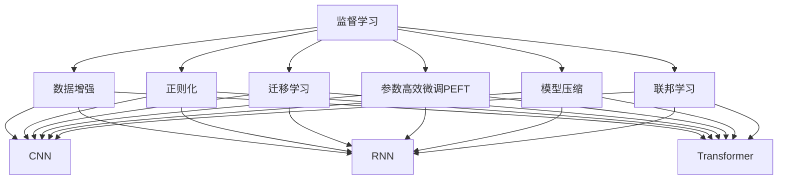
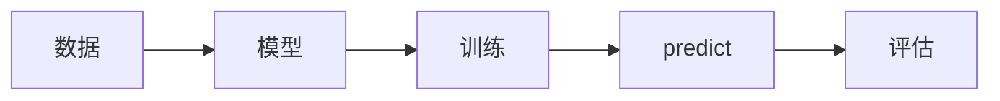
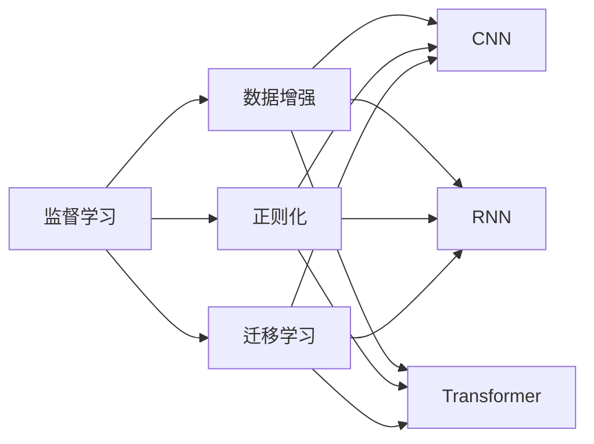
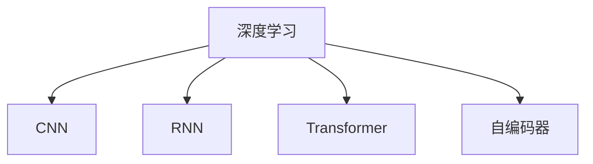

                 

# Machine Learning原理与代码实例讲解

> 关键词：机器学习,监督学习,无监督学习,强化学习,深度学习,卷积神经网络(CNN),循环神经网络(RNN),递归神经网络(RNN),Transformer

## 1. 背景介绍

### 1.1 问题由来

机器学习(Machine Learning)作为人工智能(AI)的重要分支，是让计算机从数据中学习规律并进行预测和决策的学科。其广泛应用在图像识别、语音识别、自然语言处理、推荐系统等诸多领域，是现代科技发展的基石。

近年来，随着深度学习(Deep Learning)技术的突破，机器学习领域取得了前所未有的进展。特别是深度神经网络(如卷积神经网络CNN、循环神经网络RNN等)的广泛应用，使得机器学习模型在图像、语音、文本等各类数据上的表现不断刷新，取得了令人瞩目的成果。

然而，深度学习模型对大量标注数据和计算资源的需求，使得其在实际应用中面临成本高、效率低的挑战。特别是对于中小型企业或个人开发者，构建复杂的深度学习模型往往难以实现。因此，如何高效利用有限的资源，实现机器学习模型的快速迭代和优化，成为了当前的迫切需求。

### 1.2 问题核心关键点

机器学习模型的核心在于其训练过程。通过大量标注数据，模型能够学习到数据的特征和规律，并进行预测和决策。然而，由于深度学习模型的复杂性，其在训练过程中容易过拟合，且需要大量的计算资源。因此，如何高效训练模型、提升模型泛化能力，并实现低成本、高效率的模型构建，成为当前研究的重点。

常见的方法包括：
- 数据增强：通过对训练样本进行扩充，增加样本多样性，提升模型泛化能力。
- 正则化：使用L2正则、Dropout等方法，防止模型过拟合。
- 迁移学习：利用预训练模型的知识，在新的任务上进行微调，提升模型性能。
- 参数高效微调(PEFT)：只调整少量模型参数，避免过拟合，提高训练效率。
- 模型压缩：通过剪枝、量化等方法，减小模型尺寸，提升推理速度。
- 联邦学习：通过分布式计算，实现模型参数的联合训练，降低单个节点的计算负担。

这些方法能够有效提高机器学习模型的训练和应用效率，使得更多开发者能够便捷地使用深度学习技术，推动人工智能技术在更多行业落地应用。

### 1.3 问题研究意义

研究机器学习的训练技巧和优化方法，对于提升模型的泛化能力、降低训练成本、提高模型部署效率具有重要意义：

1. 提升模型泛化能力。通过数据增强、正则化等方法，可以使模型更好地泛化到未见过的数据上，避免过拟合。
2. 降低训练成本。参数高效微调和模型压缩等方法，可以显著减小模型尺寸，减少对计算资源的需求。
3. 提高模型部署效率。通过联邦学习等方法，可以实现分布式训练，降低单个节点的计算负担，加速模型构建。
4. 推动人工智能技术普及。高效的机器学习训练技巧能够降低技术门槛，使得更多开发者能够便捷地构建和优化模型，推动AI技术在更多行业的应用。
5. 加速创新迭代。优化后的机器学习模型能够快速迭代更新，不断适应新的应用需求，提高技术竞争力。

## 2. 核心概念与联系

### 2.1 核心概念概述

为更好地理解机器学习的训练技巧和优化方法，本节将介绍几个密切相关的核心概念：

- 监督学习(Supervised Learning)：使用带有标签的数据，训练模型学习数据特征与标签之间的映射关系。
- 无监督学习(Unsupervised Learning)：不使用标签数据，通过数据的统计特性，学习数据的结构和规律。
- 强化学习(Reinforcement Learning)：通过与环境的互动，使智能体学习最优策略以最大化累计奖励。
- 深度学习(Deep Learning)：基于深度神经网络，实现对数据的高级特征提取和表示学习。
- 卷积神经网络(CNN)：一种经典的深度神经网络，适用于图像识别等数据。
- 循环神经网络(RNN)：一种经典的序列模型，适用于文本、语音等序列数据。
- 递归神经网络(RNN)：一种特殊的循环神经网络，能够处理具有层次结构的序列数据。
- 自编码器(Autocoder)：一种无监督学习算法，用于数据降维和特征提取。
- 卷积自编码器(Convolutional Autoencoder)：一种特殊的自编码器，适用于图像等数据。
- 残差网络(ResNet)：一种通过残差连接来解决深度网络退化问题的技术。
- Transformer：一种用于序列数据处理的深度神经网络，能够处理变长的输入和输出。

这些核心概念之间存在着紧密的联系，形成了机器学习训练技巧和优化方法的整体框架。下面通过一个Mermaid流程图来展示这些概念之间的关系：



这个流程图展示了各个机器学习训练技巧和优化方法之间的联系，以及它们在不同深度神经网络模型上的应用。

### 2.2 概念间的关系

这些核心概念之间存在着紧密的联系，形成了机器学习训练技巧和优化方法的整体框架。下面通过几个Mermaid流程图来展示这些概念之间的关系。

#### 2.2.1 机器学习的训练过程



这个流程图展示了机器学习的基本训练过程：首先准备数据，然后训练模型，接着进行预测，并评估预测结果。

#### 2.2.2 监督学习与无监督学习的关系



这个流程图展示了监督学习和无监督学习之间的关系，以及它们在不同深度神经网络模型上的应用。

#### 2.2.3 深度学习中的主要模型



这个流程图展示了深度学习中的主要模型，包括卷积神经网络、循环神经网络、递归神经网络和自编码器等。

## 3. 核心算法原理 & 具体操作步骤
### 3.1 算法原理概述

机器学习模型的训练过程，本质上是通过大量标注数据，使模型学习到数据的特征和规律，并能够进行预测和决策。常见的训练方法包括监督学习、无监督学习、强化学习等。

形式化地，设机器学习模型为 $M_{\theta}:\mathcal{X} \rightarrow \mathcal{Y}$，其中 $\mathcal{X}$ 为输入空间，$\mathcal{Y}$ 为输出空间，$\theta \in \mathbb{R}^d$ 为模型参数。假设训练数据集为 $D=\{(x_i,y_i)\}_{i=1}^N$，其中 $x_i \in \mathcal{X}$ 为输入，$y_i \in \mathcal{Y}$ 为标签。训练目标为最小化经验风险，即找到最优参数 $\hat{\theta}$，使得：

$$
\hat{\theta}=\mathop{\arg\min}_{\theta} \mathcal{L}(M_{\theta},D)
$$

其中 $\mathcal{L}$ 为损失函数，用于衡量模型预测输出与真实标签之间的差异。常见的损失函数包括交叉熵损失、均方误差损失等。

### 3.2 算法步骤详解

机器学习模型的训练过程一般包括以下几个关键步骤：

**Step 1: 准备数据集**
- 收集标注数据集 $D=\{(x_i,y_i)\}_{i=1}^N$，其中 $x_i \in \mathcal{X}$ 为输入，$y_i \in \mathcal{Y}$ 为标签。
- 将数据集划分为训练集、验证集和测试集，通常将80%的数据用于训练，10%用于验证，10%用于测试。

**Step 2: 选择模型和损失函数**
- 根据任务类型，选择适合的深度神经网络模型，如CNN、RNN、Transformer等。
- 选择合适的损失函数，如交叉熵损失、均方误差损失等。

**Step 3: 设置超参数**
- 选择合适的优化算法及其参数，如SGD、Adam、Adagrad等，设置学习率、批大小、迭代轮数等。
- 设置正则化技术及强度，包括权重衰减、Dropout、Early Stopping等。

**Step 4: 执行训练**
- 使用优化算法，在训练集上迭代优化模型参数 $\theta$。
- 在每个epoch（迭代轮数）结束时，在验证集上评估模型性能，记录最佳性能参数。
- 重复训练直至满足预设的迭代轮数或Early Stopping条件。

**Step 5: 测试和部署**
- 在测试集上评估训练好的模型性能，对比训练前后的精度提升。
- 使用训练好的模型对新样本进行预测，集成到实际的应用系统中。
- 定期重新训练模型，以适应数据分布的变化。

以上是机器学习模型的训练过程，但具体的实施细节还需要根据任务类型和数据特点进行优化。

### 3.3 算法优缺点

机器学习模型的训练技巧和优化方法具有以下优点：
1. 自动化特征提取：通过学习数据的特征和规律，机器学习模型能够自动提取数据中的有用信息，减少人工干预。
2. 泛化能力强：通过数据增强、正则化等方法，机器学习模型能够更好地泛化到未见过的数据上，避免过拟合。
3. 高效优化：通过梯度下降等优化算法，机器学习模型能够快速迭代优化，提高模型性能。
4. 适应性强：通过迁移学习和联邦学习等方法，机器学习模型能够适应不同领域和环境，实现跨领域知识共享和分布式训练。

同时，这些方法也存在一些缺点：
1. 数据需求量大：机器学习模型需要大量的标注数据进行训练，数据获取成本较高。
2. 模型复杂度高：深度神经网络模型参数量庞大，训练和推理需要大量计算资源。
3. 模型解释性差：机器学习模型往往是"黑盒"系统，难以解释其内部工作机制和决策逻辑。
4. 训练过程慢：大规模深度神经网络模型训练时间较长，需要耗费大量时间进行实验。

尽管存在这些缺点，但机器学习模型的训练技巧和优化方法仍然是当前研究的热点，广泛应用于各类NLP任务中。未来，随着计算资源和数据规模的不断扩大，机器学习模型将变得更加高效、可靠，具有更广泛的应用前景。

### 3.4 算法应用领域

机器学习训练技巧和优化方法，在NLP领域已经得到了广泛的应用，涵盖从数据预处理、模型选择、训练优化到模型评估的各个环节。以下是几个典型应用场景：

1. 文本分类：如情感分析、主题分类、意图识别等。通过微调BERT等预训练模型，能够在少量标注数据下取得优异效果。
2. 命名实体识别：识别文本中的人名、地名、机构名等特定实体。通过数据增强和正则化等方法，能够提升模型性能。
3. 关系抽取：从文本中抽取实体之间的语义关系。通过结构化数据增强和对抗训练等方法，能够提高模型泛化能力。
4. 问答系统：对自然语言问题给出答案。通过迁移学习和对抗训练等方法，能够构建高效、可靠的问答系统。
5. 机器翻译：将源语言文本翻译成目标语言。通过参数高效微调和联邦学习等方法，能够提升翻译效果和效率。
6. 文本摘要：将长文本压缩成简短摘要。通过深度学习模型和模型压缩等方法，能够提高摘要生成质量。
7. 对话系统：使机器能够与人自然对话。通过参数高效微调和对抗训练等方法，能够实现高效、自然的对话交互。

除了上述这些经典任务外，机器学习训练技巧和优化方法还在更多场景中得到应用，如可控文本生成、常识推理、代码生成、数据增强等，为NLP技术带来了全新的突破。随着模型的不断演进和优化，NLP技术将在更广阔的应用领域大放异彩。

## 4. 数学模型和公式 & 详细讲解  
### 4.1 数学模型构建

本节将使用数学语言对机器学习模型的训练过程进行更加严格的刻画。

记机器学习模型为 $M_{\theta}:\mathcal{X} \rightarrow \mathcal{Y}$，其中 $\mathcal{X}$ 为输入空间，$\mathcal{Y}$ 为输出空间，$\theta \in \mathbb{R}^d$ 为模型参数。假设训练数据集为 $D=\{(x_i,y_i)\}_{i=1}^N$，其中 $x_i \in \mathcal{X}$ 为输入，$y_i \in \mathcal{Y}$ 为标签。训练目标为最小化经验风险，即找到最优参数 $\hat{\theta}$，使得：

$$
\hat{\theta}=\mathop{\arg\min}_{\theta} \mathcal{L}(M_{\theta},D)
$$

其中 $\mathcal{L}$ 为损失函数，用于衡量模型预测输出与真实标签之间的差异。常见的损失函数包括交叉熵损失、均方误差损失等。

### 4.2 公式推导过程

以下我们以二分类任务为例，推导交叉熵损失函数及其梯度的计算公式。

假设模型 $M_{\theta}$ 在输入 $x$ 上的输出为 $\hat{y}=M_{\theta}(x) \in [0,1]$，表示样本属于正类的概率。真实标签 $y \in \{0,1\}$。则二分类交叉熵损失函数定义为：

$$
\ell(M_{\theta}(x),y) = -[y\log \hat{y} + (1-y)\log (1-\hat{y})]
$$

将其代入经验风险公式，得：

$$
\mathcal{L}(\theta) = -\frac{1}{N}\sum_{i=1}^N [y_i\log M_{\theta}(x_i)+(1-y_i)\log(1-M_{\theta}(x_i))]
$$

根据链式法则，损失函数对参数 $\theta_k$ 的梯度为：

$$
\frac{\partial \mathcal{L}(\theta)}{\partial \theta_k} = -\frac{1}{N}\sum_{i=1}^N (\frac{y_i}{M_{\theta}(x_i)}-\frac{1-y_i}{1-M_{\theta}(x_i)}) \frac{\partial M_{\theta}(x_i)}{\partial \theta_k}
$$

其中 $\frac{\partial M_{\theta}(x_i)}{\partial \theta_k}$ 可进一步递归展开，利用自动微分技术完成计算。

在得到损失函数的梯度后，即可带入参数更新公式，完成模型的迭代优化。重复上述过程直至收敛，最终得到适应下游任务的最优模型参数 $\theta^*$。

## 5. 项目实践：代码实例和详细解释说明
### 5.1 开发环境搭建

在进行机器学习模型训练前，我们需要准备好开发环境。以下是使用Python进行TensorFlow开发的环境配置流程：

1. 安装Anaconda：从官网下载并安装Anaconda，用于创建独立的Python环境。

2. 创建并激活虚拟环境：
```bash
conda create -n tensorflow-env python=3.8 
conda activate tensorflow-env
```

3. 安装TensorFlow：根据CUDA版本，从官网获取对应的安装命令。例如：
```bash
conda install tensorflow=2.4 cudatoolkit=11.1 -c tf -c conda-forge
```

4. 安装各类工具包：
```bash
pip install numpy pandas scikit-learn matplotlib tqdm jupyter notebook ipython
```

完成上述步骤后，即可在`tensorflow-env`环境中开始模型训练。

### 5.2 源代码详细实现

这里我们以图像分类任务为例，给出使用TensorFlow构建卷积神经网络(CNN)模型的代码实现。

首先，定义数据处理函数：

```python
import tensorflow as tf
from tensorflow.keras import layers, models
import numpy as np

def load_data():
    train_images = np.load('train_images.npy')
    train_labels = np.load('train_labels.npy')
    test_images = np.load('test_images.npy')
    test_labels = np.load('test_labels.npy')
    return train_images, train_labels, test_images, test_labels

train_images, train_labels, test_images, test_labels = load_data()
```

然后，定义模型：

```python
model = models.Sequential([
    layers.Conv2D(32, (3, 3), activation='relu', input_shape=(64, 64, 3)),
    layers.MaxPooling2D((2, 2)),
    layers.Conv2D(64, (3, 3), activation='relu'),
    layers.MaxPooling2D((2, 2)),
    layers.Conv2D(64, (3, 3), activation='relu'),
    layers.Flatten(),
    layers.Dense(64, activation='relu'),
    layers.Dense(10, activation='softmax')
])
```

接着，定义损失函数和优化器：

```python
model.compile(optimizer='adam',
              loss='categorical_crossentropy',
              metrics=['accuracy'])
```

最后，执行训练过程：

```python
batch_size = 64
epochs = 10

history = model.fit(train_images, train_labels, batch_size=batch_size, epochs=epochs, 
                    validation_data=(test_images, test_labels))
```

以上就是使用TensorFlow构建CNN模型的代码实现。可以看到，利用TensorFlow的高级API，构建模型和训练过程变得异常简洁高效。

### 5.3 代码解读与分析

让我们再详细解读一下关键代码的实现细节：

**数据处理函数**：
- 定义了加载数据、处理数据的函数，将原始数据加载到Numpy数组中，并返回训练集和测试集的图像和标签。

**模型定义**：
- 使用`Sequential`模型依次添加卷积层、池化层、全连接层等，最终输出分类结果。
- 其中，卷积层通过滑动窗口提取图像特征，池化层进行特征降维，全连接层进行特征映射，Softmax层进行分类输出。

**损失函数和优化器**：
- 选择交叉熵损失函数和Adam优化器，用于训练模型。

**训练过程**：
- 定义批量大小和迭代轮数，使用`fit`函数进行模型训练。
- `fit`函数会对数据进行批处理和随机化，确保训练过程的泛化能力。

**训练结果展示**：
- `fit`函数会自动记录训练过程中的各项指标，如损失和精度，并生成训练历史。
- 通过`plot`函数，可以可视化训练历史，观察模型性能变化。

通过上述代码实现，我们展示了使用TensorFlow构建CNN模型的全过程。TensorFlow提供了丰富的API和工具，能够快速构建和优化深度学习模型，使得模型开发变得更加便捷高效。

当然，工业级的系统实现还需考虑更多因素，如模型的保存和部署、超参数的自动搜索、更灵活的任务适配层等。但核心的模型构建和训练过程，可以通过这些代码实现进行快速迭代和优化。

## 6. 实际应用场景
### 6.1 智能医疗影像分析

基于深度学习技术的机器学习模型，在医疗影像分析领域具有广泛应用。传统的影像分析依赖放射科医生的手动判断，耗时长、成本高、易疲劳。利用深度学习模型，可以快速、准确地对医学影像进行分析和诊断。

具体而言，可以收集大量的医学影像数据，并标注相应的疾病信息。利用这些数据训练深度神经网络模型，实现对病变区域的自动检测和分类。通过微调和优化，模型能够逐步提升对不同疾病影像的识别能力，从而提高医疗诊断的准确性和效率。

### 6.2 自动驾驶系统

自动驾驶系统依赖深度学习模型对感知数据进行处理，实现对环境和车辆的精确预测。基于机器学习的深度神经网络模型，能够通过大量的模拟和现实数据进行训练，提升对复杂交通场景的适应能力。

在训练过程中，可以收集大量的交通数据，包括车辆、行人、路标等。利用这些数据训练深度神经网络模型，实现对环境信息的感知和预测。通过微调和优化，模型能够逐步提升对不同交通场景的理解能力，从而提高自动驾驶的安全性和可靠性。

### 6.3 金融风险预测

金融领域的数据量大、业务复杂，传统的统计方法难以满足需求。基于深度学习技术的机器学习模型，能够通过大量的金融数据进行训练，实现对市场趋势和风险的预测。

在训练过程中，可以收集大量的金融数据，包括股票、期货、外汇等。利用这些数据训练深度神经网络模型，实现对市场趋势和风险的预测。通过微调和优化，模型能够逐步提升对不同金融数据的理解能力，从而提高风险预测的准确性和及时性。

### 6.4 未来应用展望

随着深度学习模型的不断演进和优化，机器学习模型将在更多领域得到应用，为人类生产和生活带来深远影响。

在智慧医疗领域，基于深度学习技术的医疗影像分析、病理诊断等应用将提升医疗服务的智能化水平，辅助医生诊疗，加速新药开发进程。

在自动驾驶领域，深度学习模型将用于实现车辆的精准定位、障碍物检测、行为预测等功能，推动无人驾驶技术的广泛应用。

在金融领域，深度学习模型将用于实现市场趋势预测、风险评估、交易策略优化等功能，提高金融机构的决策效率和风险控制能力。

此外，在工业制造、智能家居、智能安防、智能客服等众多领域，深度学习模型也将广泛应用，推动智能化和自动化技术的普及。相信随着技术的日益成熟，机器学习模型必将在更广阔的领域带来变革性影响，深刻影响人类的生产生活方式。

## 7. 工具和资源推荐
### 7.1 学习资源推荐

为了帮助开发者系统掌握深度学习模型的训练技巧和优化方法，这里推荐一些优质的学习资源：

1. 《深度学习》系列书籍：由深度学习领域权威学者撰写，系统介绍了深度学习模型的原理、训练技巧和优化方法。
2. 《动手学深度学习》书籍：由MXNet社区成员撰写，通过实践项目，深入讲解深度学习模型的实现和应用。
3. 《TensorFlow官方文档》：TensorFlow的官方文档，提供了完整的API文档和代码示例，是学习TensorFlow的必备资料。
4. Coursera《深度学习专项课程》：由深度学习领域专家授课，涵盖深度学习模型的基础和进阶内容。
5. Kaggle：数据科学竞赛平台，提供了丰富的数据集和模型训练竞赛，可以学习深度学习模型的实际应用。

通过对这些资源的学习实践，相信你一定能够快速掌握深度学习模型的训练技巧和优化方法，并用于解决实际的NLP问题。
###  7.2 开发工具推荐

高效的深度学习模型开发离不开优秀的工具支持。以下是几款用于深度学习模型训练开发的常用工具：

1. TensorFlow：由Google主导开发的开源深度学习框架，生产部署方便，适合大规模工程应用。
2. PyTorch：基于Python的开源深度学习框架，灵活动态的计算图，适合快速迭代研究。
3. Keras：基于TensorFlow和Theano的高级API，简洁易用，适合快速构建深度学习模型。
4. MXNet：由亚马逊开发的开源深度学习框架，支持分布式计算，适合大规模深度学习模型的训练。
5. Caffe：由Berkeley Vision and Learning Center开发的深度学习框架，适用于图像识别等数据。
6. Torch：由Lua语言开发的深度学习框架，支持GPU加速，适合研究和实验。
7. Theano：由蒙特利尔大学开发的深度学习框架，支持高效的数值计算和自动微分，适合深度学习研究。

合理利用这些工具，可以显著提升深度学习模型的开发效率，加快创新迭代的步伐。

### 7.3 相关论文推荐

深度学习模型的训练技巧和优化方法的研究源于学界的持续研究。以下是几篇奠基性的相关论文，推荐阅读：

1. AlexNet: ImageNet Classification with Deep Convolutional Neural Networks：提出卷积神经网络，是深度学习在图像识别领域的重要突破。
2. VGGNet: Very Deep Convolutional Networks for Large-Scale Image Recognition：提出VGG网络结构，进一步提升了深度神经网络在图像识别上的表现。
3. ResNet: Deep Residual Learning for Image Recognition：提出残差网络，解决了深度神经网络退化的问题。
4. Transformer: Attention is All You Need：提出Transformer模型，实现了序列数据的端到端建模。
5. GANs Trained by a Two Time-Scale Update Rule Converge to a Local Nash Equilibrium：提出生成对抗网络，实现了高质量的无监督学习。
6. Progressive Growing of GANs for Improved Quality, Stability, and Variation：提出渐进式生成对抗网络，提升了生成对抗网络的训练稳定性和效果。
7

