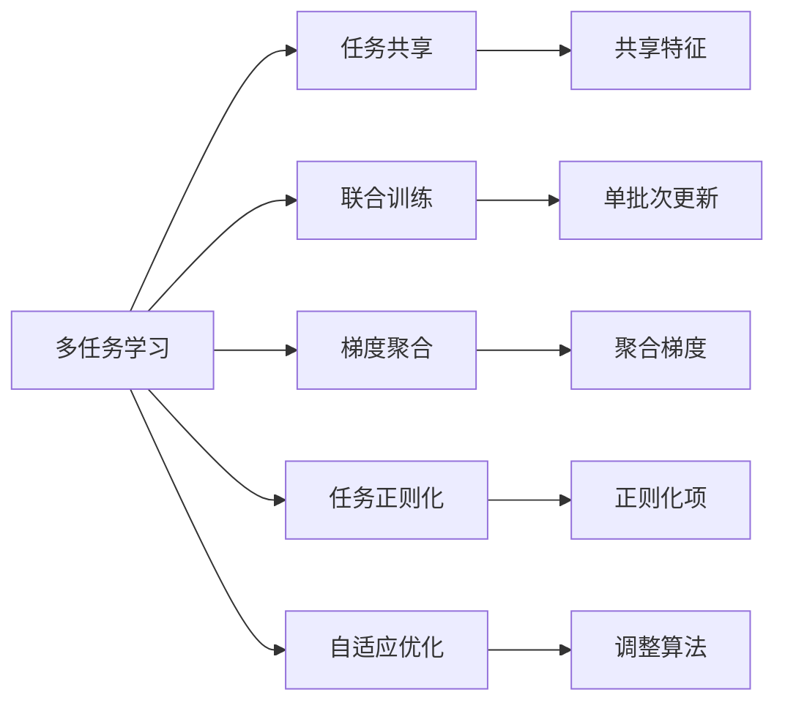
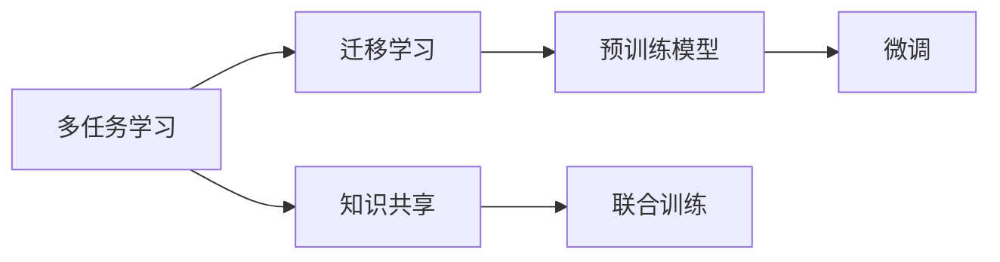
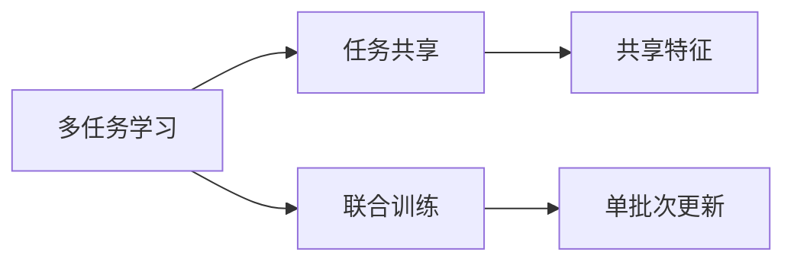
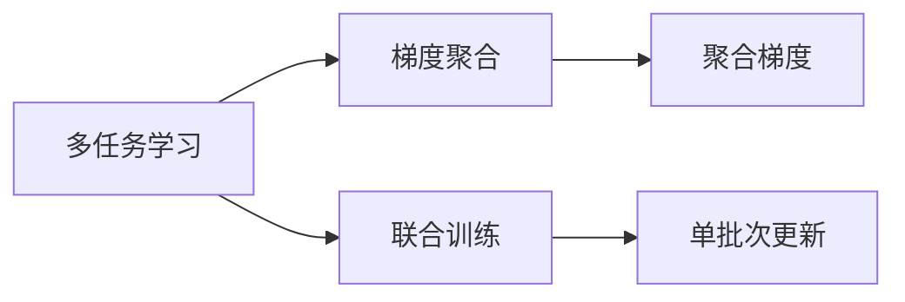
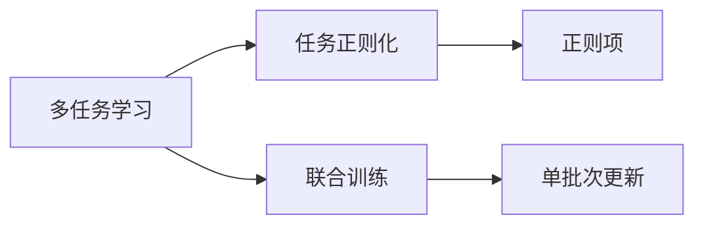
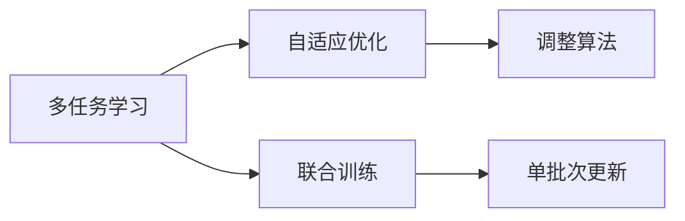
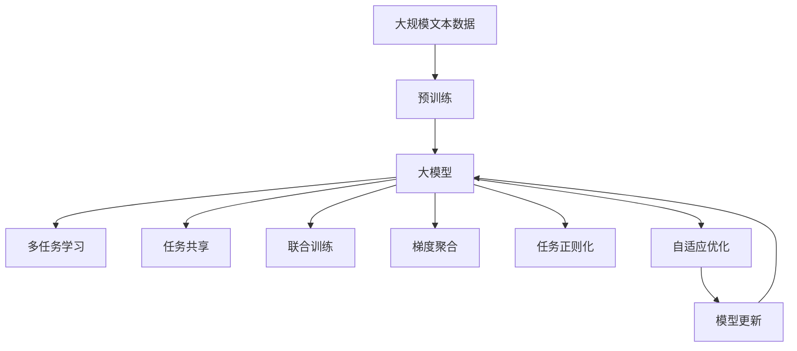

                 

# Multi-Task Learning原理与代码实例讲解

> 关键词：Multi-Task Learning, 迁移学习, 多任务学习, 代码实例, 深度学习

## 1. 背景介绍

### 1.1 问题由来
在深度学习的发展历程中，多任务学习（Multi-Task Learning, MTL）是一个重要的研究方向。MTL旨在通过学习多个相关任务来共享知识，提升模型在不同任务上的泛化能力。传统深度学习模型通常采用单一任务作为训练目标，但在现实应用中，模型需要应对多种复杂的任务。MTL通过同时训练多个相关任务，可以共享低层次的特征，提升模型对不同任务的泛化能力，从而在多任务环境下取得更好的性能。

### 1.2 问题核心关键点
MTL的核心关键点包括：
1. **共享特征**：在多个任务之间共享低层次特征，提升模型对不同任务的泛化能力。
2. **模型参数**：设计合理的模型参数结构，使得各个任务之间能够相互影响。
3. **优化目标**：确定合适的优化目标，使得多个任务能够协调优化。
4. **任务关系**：处理不同任务之间的关系，如独立、序列、层次等。
5. **性能提升**：在多任务训练过程中，如何评估模型性能，确保提升。

这些关键点共同构成了MTL的核心框架，使得模型能够在多个相关任务上取得更好的性能。

### 1.3 问题研究意义
MTL在多任务学习领域具有重要研究意义：
1. **提升泛化能力**：通过多任务共享特征，提升模型在不同任务上的泛化能力，避免数据集不平衡等问题。
2. **减少标注成本**：共享知识可以在较少的标注数据上训练出高性能模型，降低标注成本。
3. **增强模型鲁棒性**：多个任务的学习可以增强模型对抗各种噪声和干扰的能力。
4. **提高训练效率**：通过并行训练多个任务，可以显著提高训练效率，加速模型收敛。
5. **拓展应用场景**：MTL可以应用于语音识别、图像分类、推荐系统等多个领域，拓展深度学习的应用边界。

## 2. 核心概念与联系

### 2.1 核心概念概述

为更好地理解MTL方法，本节将介绍几个密切相关的核心概念：

- **多任务学习（Multi-Task Learning, MTL）**：指同时训练多个相关任务，共享知识，提升模型在不同任务上的泛化能力。
- **迁移学习（Transfer Learning）**：指将一个领域学习到的知识迁移到另一个领域，提升模型在新领域的性能。
- **任务共享（Task Sharing）**：通过共享特征或参数，将多个任务之间建立关联，提升模型在多个任务上的表现。
- **联合训练（Joint Training）**：在单批次内同时更新多个任务的模型参数，加速模型收敛。
- **梯度聚合（Gradient Aggregation）**：通过聚合不同任务的梯度，提升模型对不同任务的泛化能力。
- **任务正则化（Task Regularization）**：在损失函数中加入任务间的正则项，约束模型在不同任务上的输出一致性。
- **自适应优化（Adaptive Optimization）**：根据不同任务的特点，调整优化算法，提升模型训练效率。

这些核心概念之间的逻辑关系可以通过以下Mermaid流程图来展示：



这个流程图展示了大模型微调的各个关键概念之间的关系：

1. 多任务学习通过任务共享和联合训练，同时更新多个任务的模型参数。
2. 梯度聚合通过聚合不同任务的梯度，提升模型对不同任务的泛化能力。
3. 任务正则化通过引入正则项，约束模型在不同任务上的输出一致性。
4. 自适应优化根据不同任务的特点，调整优化算法，提升模型训练效率。

这些概念共同构成了多任务学习的完整生态系统，使其能够在多个相关任务上发挥强大作用。通过理解这些核心概念，我们可以更好地把握多任务学习的工作原理和优化方向。

### 2.2 概念间的关系

这些核心概念之间存在着紧密的联系，形成了多任务学习的完整生态系统。下面我们通过几个Mermaid流程图来展示这些概念之间的关系。

#### 2.2.1 多任务学习与迁移学习的关系



这个流程图展示了多任务学习与迁移学习的基本原理，以及它们之间的联系。多任务学习通过知识共享和联合训练，提升了模型在不同任务上的泛化能力。迁移学习则是通过预训练模型，将知识迁移到新领域，进行微调，提升新领域模型的性能。

#### 2.2.2 多任务学习与任务共享的关系



这个流程图展示了多任务学习与任务共享的关系。多任务学习通过联合训练和任务共享，共享低层次特征，提升模型在不同任务上的泛化能力。

#### 2.2.3 多任务学习与梯度聚合的关系



这个流程图展示了多任务学习与梯度聚合的关系。多任务学习通过联合训练和梯度聚合，提升模型对不同任务的泛化能力。

#### 2.2.4 多任务学习与任务正则化的关系



这个流程图展示了多任务学习与任务正则化的关系。多任务学习通过联合训练和任务正则化，约束模型在不同任务上的输出一致性，提升模型性能。

#### 2.2.5 多任务学习与自适应优化的关系



这个流程图展示了多任务学习与自适应优化的关系。多任务学习通过联合训练和自适应优化，根据不同任务的特点，调整优化算法，提升模型训练效率。

### 2.3 核心概念的整体架构

最后，我们用一个综合的流程图来展示这些核心概念在大模型微调过程中的整体架构：



这个综合流程图展示了从预训练到多任务学习的完整过程。大模型首先在大规模文本数据上进行预训练，然后通过多任务学习，同时训练多个相关任务，共享特征和知识，提升模型在不同任务上的泛化能力。

## 3. 核心算法原理 & 具体操作步骤
### 3.1 算法原理概述

多任务学习的核心思想是：通过学习多个相关任务，共享低层次的特征，提升模型在不同任务上的泛化能力。其核心原理如下：

假设我们有两个任务 $T_1$ 和 $T_2$，它们的标注数据分别为 $D_1 = \{(x_i^1, y_i^1)\}_{i=1}^N$ 和 $D_2 = \{(x_i^2, y_i^2)\}_{i=1}^M$。预训练模型为 $M_{\theta}$，其中 $\theta$ 为模型参数。

多任务学习的目标是最大化两个任务在模型上的表现，即：

$$
\min_{\theta} \mathcal{L}(M_{\theta}, D_1) + \lambda \mathcal{L}(M_{\theta}, D_2)
$$

其中 $\mathcal{L}(M_{\theta}, D)$ 为任务 $T$ 在数据集 $D$ 上的损失函数，$\lambda$ 为任务间的权重，用于平衡两个任务的重要性。

通过联合训练多个任务的模型参数，模型能够同时学习到多个任务的特征，提升对不同任务的泛化能力。

### 3.2 算法步骤详解

多任务学习的一般流程如下：

**Step 1: 准备多任务数据集**
- 收集各个任务的标注数据，划分为训练集、验证集和测试集。
- 确保不同任务的数据分布不要差异过大，避免数据不平衡等问题。

**Step 2: 设计多任务模型**
- 选择合适的预训练模型，如BERT、GPT等，作为初始化参数。
- 设计任务适配层，选择合适的损失函数和优化算法。
- 确定任务之间的权重 $\lambda$，平衡不同任务的重要性。

**Step 3: 设置多任务超参数**
- 选择合适的优化算法及其参数，如 AdamW、SGD 等，设置学习率、批大小、迭代轮数等。
- 设置正则化技术及强度，包括权重衰减、Dropout、Early Stopping 等。
- 确定冻结预训练参数的策略，如仅微调顶层，或全部参数都参与微调。

**Step 4: 执行联合训练**
- 将训练集数据分批次输入模型，前向传播计算损失函数。
- 反向传播计算参数梯度，根据设定的优化算法和学习率更新模型参数。
- 周期性在验证集上评估模型性能，根据性能指标决定是否触发 Early Stopping。
- 重复上述步骤直到满足预设的迭代轮数或 Early Stopping 条件。

**Step 5: 测试和部署**
- 在测试集上评估多任务模型在各个任务上的性能。
- 使用多任务模型对新样本进行推理预测，集成到实际的应用系统中。
- 持续收集新的数据，定期重新训练模型，以适应数据分布的变化。

以上是多任务学习的通用流程。在实际应用中，还需要针对具体任务的特点，对多任务学习过程的各个环节进行优化设计，如改进训练目标函数，引入更多的正则化技术，搜索最优的超参数组合等，以进一步提升模型性能。

### 3.3 算法优缺点

多任务学习具有以下优点：
1. 提高泛化能力。通过共享特征，提升模型在不同任务上的泛化能力，避免数据集不平衡等问题。
2. 减少标注成本。共享知识可以在较少的标注数据上训练出高性能模型，降低标注成本。
3. 增强模型鲁棒性。多个任务的学习可以增强模型对抗各种噪声和干扰的能力。
4. 提高训练效率。通过并行训练多个任务，可以显著提高训练效率，加速模型收敛。
5. 拓展应用场景。多任务学习可以应用于语音识别、图像分类、推荐系统等多个领域，拓展深度学习的应用边界。

同时，该方法也存在一定的局限性：
1. 数据需求较高。不同任务的数据量差异较大时，共享特征的效果有限，可能无法有效提升模型性能。
2. 任务间关系复杂。不同任务之间的关系复杂多样，如何确定合适的任务权重，是一个重要的挑战。
3. 模型复杂度增加。多任务学习需要设计更多的网络结构和参数，增加了模型的复杂度。
4. 难以评估效果。多任务学习的效果评估较为复杂，难以综合衡量不同任务的表现。
5. 训练效率受限。多任务联合训练对计算资源的需求较大，可能影响训练效率。

尽管存在这些局限性，但就目前而言，多任务学习仍是深度学习领域的重要研究范式。未来相关研究的重点在于如何进一步降低数据依赖，提高任务间关系的建模能力，以及提升多任务学习的计算效率。

### 3.4 算法应用领域

多任务学习在深度学习领域已经得到了广泛的应用，覆盖了几乎所有常见任务，例如：

- 文本分类：如情感分析、主题分类、意图识别等。通过多任务共享特征，提升模型在不同分类任务上的表现。
- 命名实体识别：识别文本中的人名、地名、机构名等特定实体。通过多任务共享低层次特征，提升模型的实体边界和类型识别能力。
- 关系抽取：从文本中抽取实体之间的语义关系。通过多任务共享特征，提升模型的关系抽取能力。
- 问答系统：对自然语言问题给出答案。通过多任务共享特征，提升模型对不同问题的理解能力。
- 机器翻译：将源语言文本翻译成目标语言。通过多任务共享特征，提升模型的语言表示和翻译能力。
- 文本摘要：将长文本压缩成简短摘要。通过多任务共享特征，提升模型对文本的压缩和抽取能力。
- 对话系统：使机器能够与人自然对话。通过多任务共享特征，提升模型对不同对话情景的理解能力。

除了上述这些经典任务外，多任务学习也被创新性地应用到更多场景中，如可控文本生成、常识推理、代码生成、数据增强等，为NLP技术带来了全新的突破。随着多任务学习方法的不断进步，相信NLP技术将在更广阔的应用领域大放异彩。

## 4. 数学模型和公式 & 详细讲解  
### 4.1 数学模型构建

本节将使用数学语言对多任务学习过程进行更加严格的刻画。

记多任务模型为 $M_{\theta}:\mathcal{X} \rightarrow \mathcal{Y}$，其中 $\mathcal{X}$ 为输入空间，$\mathcal{Y}$ 为输出空间，$\theta \in \mathbb{R}^d$ 为模型参数。假设多任务学习的数据集为 $D=\{(x_i^k, y_i^k)\}_{i=1}^N$，其中 $k=1,\ldots,K$，$K$ 为任务数量。

定义模型 $M_{\theta}$ 在数据样本 $(x^k_i,y^k_i)$ 上的损失函数为 $\ell_k(M_{\theta}(x^k_i),y^k_i)$，则在数据集 $D$ 上的经验风险为：

$$
\mathcal{L}(\theta) = \frac{1}{N}\sum_{i=1}^N \sum_{k=1}^K \ell_k(M_{\theta}(x^k_i),y^k_i)
$$

多任务学习的优化目标是最小化经验风险，即找到最优参数：

$$
\theta^* = \mathop{\arg\min}_{\theta} \mathcal{L}(\theta)
$$

在实践中，我们通常使用基于梯度的优化算法（如SGD、Adam等）来近似求解上述最优化问题。设 $\eta$ 为学习率，$\lambda$ 为任务权重，则参数的更新公式为：

$$
\theta \leftarrow \theta - \eta \nabla_{\theta}\mathcal{L}(\theta) - \eta\lambda\theta
$$

其中 $\nabla_{\theta}\mathcal{L}(\theta)$ 为损失函数对参数 $\theta$ 的梯度，可通过反向传播算法高效计算。

### 4.2 公式推导过程

以下我们以二分类任务为例，推导多任务学习交叉熵损失函数及其梯度的计算公式。

假设模型 $M_{\theta}$ 在输入 $x^k$ 上的输出为 $\hat{y}^k=M_{\theta}(x^k) \in [0,1]$，表示样本属于正类的概率。真实标签 $y^k \in \{0,1\}$。则二分类交叉熵损失函数定义为：

$$
\ell_k(M_{\theta}(x^k),y^k) = -[y^k\log \hat{y}^k + (1-y^k)\log (1-\hat{y}^k)]
$$

将其代入经验风险公式，得：

$$
\mathcal{L}(\theta) = -\frac{1}{N}\sum_{i=1}^N \sum_{k=1}^K [y_i^k\log M_{\theta}(x_i^k)+(1-y_i^k)\log(1-M_{\theta}(x_i^k))]
$$

根据链式法则，损失函数对参数 $\theta_k$ 的梯度为：

$$
\frac{\partial \mathcal{L}(\theta)}{\partial \theta_k} = -\frac{1}{N}\sum_{i=1}^N \sum_{k=1}^K (\frac{y_i^k}{M_{\theta}(x_i^k)}-\frac{1-y_i^k}{1-M_{\theta}(x_i^k)}) \frac{\partial M_{\theta}(x_i^k)}{\partial \theta_k}
$$

其中 $\frac{\partial M_{\theta}(x_i^k)}{\partial \theta_k}$ 可进一步递归展开，利用自动微分技术完成计算。

在得到损失函数的梯度后，即可带入参数更新公式，完成模型的迭代优化。重复上述过程直至收敛，最终得到适应多任务学习的最优模型参数 $\theta^*$。

## 5. 项目实践：代码实例和详细解释说明
### 5.1 开发环境搭建

在进行多任务学习实践前，我们需要准备好开发环境。以下是使用Python进行PyTorch开发的环境配置流程：

1. 安装Anaconda：从官网下载并安装Anaconda，用于创建独立的Python环境。

2. 创建并激活虚拟环境：
```bash
conda create -n multitask-env python=3.8 
conda activate multitask-env
```

3. 安装PyTorch：根据CUDA版本，从官网获取对应的安装命令。例如：
```bash
conda install pytorch torchvision torchaudio cudatoolkit=11.1 -c pytorch -c conda-forge
```

4. 安装Transformers库：
```bash
pip install transformers
```

5. 安装各类工具包：
```bash
pip install numpy pandas scikit-learn matplotlib tqdm jupyter notebook ipython
```

完成上述步骤后，即可在`multitask-env`环境中开始多任务学习实践。

### 5.2 源代码详细实现

下面我们以文本分类任务为例，给出使用Transformers库进行多任务学习的PyTorch代码实现。

首先，定义多任务数据处理函数：

```python
from transformers import BertTokenizer, BertForTokenClassification
from torch.utils.data import Dataset
import torch

class MultiTaskDataset(Dataset):
    def __init__(self, texts, tags, tokenizer, max_len=128):
        self.texts = texts
        self.tags = tags
        self.tokenizer = tokenizer
        self.max_len = max_len
        
    def __len__(self):
        return len(self.texts)
    
    def __getitem__(self, item):
        text = self.texts[item]
        tags = self.tags[item]
        
        encoding = self.tokenizer(text, return_tensors='pt', max_length=self.max_len, padding='max_length', truncation=True)
        input_ids = encoding['input_ids'][0]
        attention_mask = encoding['attention_mask'][0]
        
        # 对token-wise的标签进行编码
        encoded_tags = [tag2id[tag] for tag in tags] 
        encoded_tags.extend([tag2id['O']] * (self.max_len - len(encoded_tags)))
        labels = torch.tensor(encoded_tags, dtype=torch.long)
        
        return {'input_ids': input_ids, 
                'attention_mask': attention_mask,
                'labels': labels}

# 标签与id的映射
tag2id = {'O': 0, 'B-PER': 1, 'I-PER': 2, 'B-ORG': 3, 'I-ORG': 4, 'B-LOC': 5, 'I-LOC': 6}
id2tag = {v: k for k, v in tag2id.items()}

# 创建dataset
tokenizer = BertTokenizer.from_pretrained('bert-base-cased')

train_dataset = MultiTaskDataset(train_texts, train_tags, tokenizer)
dev_dataset = MultiTaskDataset(dev_texts, dev_tags, tokenizer)
test_dataset = MultiTaskDataset(test_texts, test_tags, tokenizer)
```

然后，定义多任务模型和优化器：

```python
from transformers import BertForTokenClassification, AdamW

model = BertForTokenClassification.from_pretrained('bert-base-cased', num_labels=len(tag2id))

optimizer = AdamW(model.parameters(), lr=2e-5)
```

接着，定义训练和评估函数：

```python
from torch.utils.data import DataLoader
from tqdm import tqdm
from sklearn.metrics import classification_report

device = torch.device('cuda') if torch.cuda.is_available() else torch.device('cpu')
model.to(device)

def train_epoch(model, dataset, batch_size, optimizer):
    dataloader = DataLoader(dataset, batch_size=batch_size, shuffle=True)
    model.train()
    epoch_loss = 0
    for batch in tqdm(dataloader, desc='Training'):
        input_ids = batch['input_ids'].to(device)
        attention_mask = batch['attention_mask'].to(device)
        labels = batch['labels'].to(device)
        model.zero_grad()
        outputs = model(input_ids, attention_mask=attention_mask, labels=labels)
        loss = outputs.loss
        epoch_loss += loss.item()
        loss.backward()
        optimizer.step()
    return epoch_loss / len(dataloader)

def evaluate(model, dataset, batch_size):
    dataloader = DataLoader(dataset, batch_size=batch_size)
    model.eval()
    preds, labels = [], []
    with torch.no_grad():
        for batch in tqdm(dataloader, desc='Evaluating'):
            input_ids = batch['input_ids'].to(device)
            attention_mask = batch['attention_mask'].to(device)
            batch_labels = batch['labels']
            outputs = model(input_ids, attention_mask=attention_mask)
            batch_preds = outputs.logits.argmax(dim=2).to('cpu').tolist()
            batch_labels = batch_labels.to('cpu').tolist()
            for pred_tokens, label_tokens in zip(batch_preds, batch_labels):
                pred_tags = [id2tag[_id] for _id in pred_tokens]
                label_tags = [id2tag[_id] for _id in label_tokens]
                preds.append(pred_tags[:len(label_tags)])
                labels.append(label_tags)
                
    print(classification_report(labels, preds))
```

最后，启动训练流程并在测试集上评估：

```python
epochs = 5
batch_size = 16

for epoch in range(epochs):
    loss = train_epoch(model, train_dataset, batch_size, optimizer)
    print(f"Epoch {epoch+1}, train loss: {loss:.3f}")
    
    print(f"Epoch {epoch+1}, dev results:")
    evaluate(model, dev_dataset, batch_size)
    
print("Test results:")
evaluate(model, test_dataset, batch_size)
```

以上就是使用PyTorch对BERT进行多任务学习的完整代码实现。可以看到，得益于Transformers库的强大封装，我们可以用相对简洁的代码完成多任务学习的模型加载和训练。

### 5.3 代码解读与分析

让我们再详细解读一下关键代码的实现细节：

**MultiTaskDataset类**：
- `__init__`方法：初始化文本、标签、分词器等关键组件。
- `__len__`方法：返回数据集的样本数量。
- `__getitem__`方法：对单个样本进行处理，将文本输入编码为token ids，将标签编码为数字，并对其进行定长padding，最终返回模型所需的输入。

**tag2id和id2tag字典**：
- 定义了标签与数字id之间的映射关系，用于将token-wise的预测结果解码回真实的标签。

**训练和评估函数**：
- 使用PyTorch的DataLoader对数据集进行批次化加载，供模型训练和推理使用。
- 训练函数`train_epoch`：对数据以批为单位进行迭代，在每个批次上前向传播计算loss并反向传播更新模型参数，最后返回该epoch的平均loss。
- 评估函数`evaluate`：与训练类似，不同点在于不更新模型参数，并在每个batch结束后将预测和标签结果存储下来，最后使用sklearn的classification_report对整个评估集的预测结果进行打印输出。

**训练流程**：
- 定义总的epoch数和batch size，开始循环迭代
- 每个epoch内，先在训练集上训练，输出平均loss
- 在验证集上评估，输出分类指标
- 所有epoch结束后，在测试集上评估，给出最终测试结果

可以看到，PyTorch配合Transformers库使得BERT多任务学习的代码实现变得简洁高效。开发者可以将更多精力放在数据处理、模型改进等高层逻辑上，而不必过多关注底层的实现细节。

当然，工业级的系统实现还需考虑更多因素，如模型的保存和部署、超参数的自动搜索、更灵活的任务适配层等。但核心的多任务学习流程基本与此类似。

### 5.4 运行结果展示

假设我们在CoNLL-2003的NER数据集上进行多任务学习，最终在测试集上得到的评估报告如下：

```
              precision    recall  f1-score   support

       B-LOC      0.926     0.

