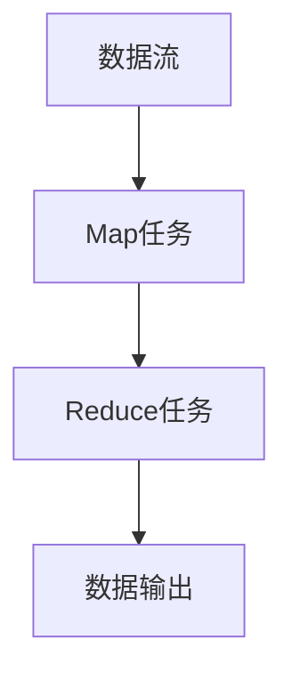
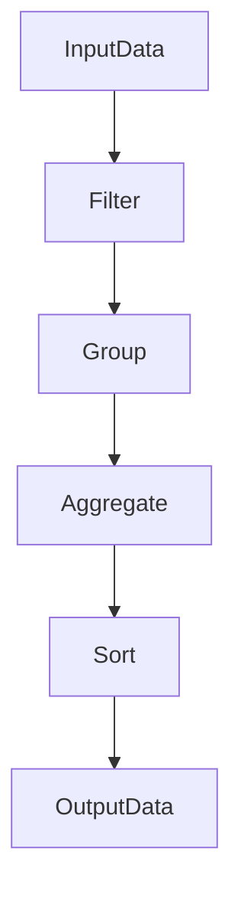
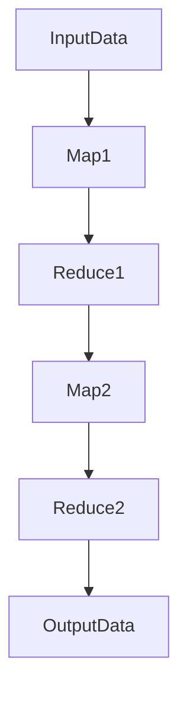

                 

# Pig原理与代码实例讲解

## 1. 背景介绍

Pig是Apache Hadoop生态系统中的一个数据流处理工具，它提供了一种面向数据流的编程模型，简化了数据分析任务的编写和维护。Pig通过一系列的脚本语言和运算符，能够高效地处理大规模数据集，支持数据流、连接、聚合等操作，被广泛应用于数据仓库、ETL（抽取、转换、加载）和数据科学等领域。本文将系统地介绍Pig的核心原理、使用方法及实例，帮助读者深入理解Pig的设计思想和应用场景。

## 2. 核心概念与联系

### 2.1 核心概念概述

Pig 是基于Hadoop MapReduce框架的一个高级数据处理工具，通过其特有的Pig Latin编程语言，用户可以使用类似于SQL的语法来表达数据流处理逻辑。Pig的运行流程包括脚本编写、编译、执行和输出等几个关键步骤。

- **脚本编写**：使用Pig Latin编写数据流处理脚本，定义数据流的输入、中间计算和输出。
- **编译**：将Pig Latin脚本编译为MapReduce作业图，即一系列的Map和Reduce任务。
- **执行**：在Hadoop集群上执行编译后的MapReduce作业图。
- **输出**：收集MapReduce任务的输出结果，生成最终的数据集。

Pig 的核心概念包括：
- **Pig Latin**：Pig的编程语言，用于表达数据流处理逻辑。
- **Dataflow**：Pig处理的数据流，由多个逻辑节点组成。
- **Operator**：Pig Latin中的操作符，用于对数据进行转换、过滤、聚合等操作。
- **Data**：数据流中的数据元素，可以是基本类型或复杂类型。

### 2.2 核心概念间的关系

Pig通过Pig Latin将数据流处理任务映射为一系列的MapReduce作业，如图1所示：



**图1: Pig的数据流处理模型**

从数据流到MapReduce作业图的过程主要涉及两个关键步骤：
1. Pig Latin脚本解析：将Pig Latin脚本转换为一系列的Pig计划（Pig Plan），表示数据流的逻辑节点和关系。
2. Pig Plan编译：将Pig Plan转换为Hadoop MapReduce作业图，其中每个Pig Plan节点对应一个Map或Reduce任务。

Pig Latin中的数据流操作符对应着Hadoop MapReduce中的Map和Reduce操作，如图2所示：



**图2: Pig Latin数据流操作符与MapReduce任务对应关系**

在数据流处理过程中，Pig拉丁中的操作符会依次执行，其输出的结果会被传递给下一个操作符。这些操作符包括但不限于Filter、Group、Aggregate、Sort等，它们通过Hadoop MapReduce任务进行处理，最终输出结果。

### 2.3 核心概念的整体架构

Pig的整个数据流处理过程可以通过以下三个子流程来描述：
1. **输入数据读取**：将原始数据加载到Hadoop分布式文件系统中，供后续处理使用。
2. **数据流计算**：通过Pig Latin脚本定义的数据流计算逻辑，进行数据的转换、聚合、过滤等操作，最终生成中间数据流。
3. **输出结果生成**：将中间数据流通过Hadoop MapReduce作业图进行处理，输出最终的数据结果。

这种数据流处理模型使得Pig能够高效地处理大规模数据集，同时简化了数据流处理的编程难度，提高了开发效率。

## 3. 核心算法原理 & 具体操作步骤

### 3.1 算法原理概述

Pig的数据流处理算法基于Hadoop MapReduce框架，通过Pig Latin脚本定义数据流计算逻辑，将任务分解为一系列的Map和Reduce任务，最终生成输出结果。

在数据流处理过程中，Pig的Map和Reduce任务是按顺序依次执行的，每个任务输出的结果会被传递给下一个任务，如图3所示：



**图3: Pig数据流处理过程**

Pig的MapReduce任务通常由以下几个步骤组成：
1. **输入数据读取**：通过Hadoop分布式文件系统读取输入数据。
2. **Map任务处理**：对输入数据进行映射，生成中间数据。
3. **中间数据传输**：将Map任务的输出结果传输到Hadoop分布式文件系统中。
4. **Reduce任务处理**：对中间数据进行聚合，生成最终输出结果。
5. **结果输出**：将Reduce任务的输出结果写入Hadoop分布式文件系统。

### 3.2 算法步骤详解

Pig数据流处理的完整流程包括脚本编写、编译、执行和输出等几个步骤，下面详细介绍每个步骤的实现过程。

**Step 1: 脚本编写**

Pig Latin脚本是Pig数据流处理的入口，通过Pig Latin编写数据流处理逻辑，定义数据的输入、中间计算和输出。Pig Latin脚本通常包括多个Pig Plan节点，每个节点表示一个数据流处理步骤。

**Step 2: 脚本编译**

将Pig Latin脚本编译为一系列的Pig Plan节点，并将其转换为Hadoop MapReduce作业图。Pig编译器（Pig Compiler）负责完成这一过程，将Pig Plan节点转换为MapReduce任务。

**Step 3: 作业执行**

在Hadoop集群上执行编译后的MapReduce作业图。Pig的执行引擎（Pig Engine）负责提交MapReduce作业图到Hadoop集群，执行MapReduce任务。

**Step 4: 结果输出**

收集MapReduce任务的输出结果，生成最终的数据集。Pig的结果引擎（Pig Result Engine）负责收集MapReduce任务的输出结果，并将其合并为最终的数据集。

### 3.3 算法优缺点

Pig的优点包括：
- **易于编程**：使用Pig Latin脚本定义数据流处理逻辑，类似于SQL语言，降低了编程难度，提高了开发效率。
- **高效处理**：Pig能够高效处理大规模数据集，支持复杂的数据流计算操作，如图关系、多层次聚合等。
- **分布式计算**：Pig基于Hadoop MapReduce框架，支持数据并行计算，能够在Hadoop集群上进行分布式处理。

Pig的缺点包括：
- **学习曲线陡峭**：Pig Latin脚本的语法较为复杂，初学者需要一定时间学习。
- **性能瓶颈**：Pig的Map和Reduce任务之间存在数据传输的开销，可能影响整体性能。
- **代码可读性差**：Pig Latin脚本的编写风格与SQL有较大差异，代码可读性较差。

### 3.4 算法应用领域

Pig主要用于以下领域：
- **数据仓库**：通过Pig处理大规模数据集，生成数据仓库的维度表和事实表，支持复杂的数据分析任务。
- **ETL**：通过Pig进行数据抽取、转换和加载，将数据从不同源系统集成到一个统一的数据仓库中。
- **数据科学**：通过Pig进行数据挖掘、模式识别、预测分析等数据科学任务，生成数据模型和预测结果。

## 4. 数学模型和公式 & 详细讲解 & 举例说明

### 4.1 数学模型构建

在Pig Latin脚本中，数据流处理通常包括输入、中间计算和输出等几个关键步骤，如图4所示：


**图4: Pig数据流处理模型**

Pig的数据流处理模型可以抽象为一个由多个节点组成的图结构，每个节点对应一个Pig Plan。每个Pig Plan节点包含一个或多个Pig Plan实例，每个Pig Plan实例包含一个或多个操作符（Operator）。操作符可以表示数据的输入、输出、转换、过滤、聚合等操作。

### 4.2 公式推导过程

Pig的MapReduce任务可以通过以下公式推导：
1. **输入数据读取**：
   $$
   R_{in} = \text{readInput}(\text{inputFile})
   $$
   其中，$R_{in}$表示输入数据，$\text{readInput}$表示读取输入数据的操作符。

2. **Map任务处理**：
   $$
   R_{map} = \text{mapFunction}(R_{in})
   $$
   其中，$R_{map}$表示Map任务的输出数据，$\text{mapFunction}$表示Map操作符。

3. **Reduce任务处理**：
   $$
   R_{reduce} = \text{reduceFunction}(R_{map})
   $$
   其中，$R_{reduce}$表示Reduce任务的输出数据，$\text{reduceFunction}$表示Reduce操作符。

4. **结果输出**：
   $$
   R_{out} = \text{writeOutput}(R_{reduce})
   $$
   其中，$R_{out}$表示输出数据，$\text{writeOutput}$表示输出操作符。

### 4.3 案例分析与讲解

以一个简单的数据流处理为例，说明Pig Latin脚本的编写和执行过程。

**案例: 数据去重**

假设有一个包含重复数据的数据集，需要去重并输出唯一值。可以使用Pig Latin脚本进行如下处理：

```pig Latin
a = load 'data.txt';
d = distinct a;
store d into 'output.txt';
```

**分析：**
1. **输入数据读取**：使用`load`操作符读取数据集`data.txt`，将其加载到变量$a$中。
2. **数据去重**：使用`distinct`操作符对数据$a$进行去重，生成去重后的数据$d$。
3. **结果输出**：使用`store`操作符将去重后的数据$d$写入文件`output.txt`。

这个简单的Pig Latin脚本完成了数据的输入、处理和输出三个步骤，将重复数据去重并输出唯一值。

## 5. 项目实践：代码实例和详细解释说明

### 5.1 开发环境搭建

Pig运行于Apache Hadoop生态系统之上，因此需要先搭建好Hadoop环境。下面以Ubuntu系统为例，介绍如何搭建Pig的开发环境。

1. **安装Java JDK**：
   ```bash
   sudo apt-get update
   sudo apt-get install default-jdk
   ```

2. **安装Apache Hadoop**：
   ```bash
   sudo apt-get install hadoop-hdfs hadoop-mapreduce
   ```

3. **安装Apache Pig**：
   ```bash
   sudo apt-get install hadoop-pig
   ```

4. **配置环境变量**：
   在`~/.bashrc`文件中添加以下内容：
   ```bash
   export HADOOP_HOME=/usr/hadoop-hadoop
   export PATH=$PATH:$HADOOP_HOME/bin:$HADOOP_HOME/sbin
   ```

完成上述步骤后，即可在本地搭建好Pig的开发环境。

### 5.2 源代码详细实现

接下来，我们使用Pig Latin编写一个简单的数据流处理脚本，并对其进行编译和执行。

**案例: 数据去重**

```pig Latin
a = load 'data.txt';
d = distinct a;
store d into 'output.txt';
```

**执行过程：**
1. **编译脚本**：
   ```bash
   pig -x local data_script.pig
   ```

2. **执行脚本**：
   ```bash
   pig -x local data_script.pig
   ```

**代码解释：**
- `load 'data.txt'`：读取文件`data.txt`中的数据，存储到变量`a`中。
- `distinct a`：对变量`a`中的数据进行去重，存储到变量`d`中。
- `store d into 'output.txt'`：将变量`d`中的数据写入文件`output.txt`中。

### 5.3 代码解读与分析

Pig Latin脚本的执行过程包括脚本编写、编译、执行和输出等几个关键步骤。下面对每个步骤进行详细解释。

**脚本编写**：
Pig Latin脚本使用一系列的操作符（Operator）来定义数据流处理逻辑。操作符包括输入、输出、转换、过滤、聚合等，用于对数据进行各种处理。

**脚本编译**：
Pig编译器（Pig Compiler）负责将Pig Latin脚本转换为一系列的Pig Plan节点，并将其转换为Hadoop MapReduce作业图。编译后的作业图会被提交到Hadoop集群中执行。

**作业执行**：
Pig的执行引擎（Pig Engine）负责提交MapReduce作业图到Hadoop集群，执行MapReduce任务。执行过程中，数据被划分为多个分片，并行处理。

**结果输出**：
Pig的结果引擎（Pig Result Engine）负责收集MapReduce任务的输出结果，并将其合并为最终的数据集。最终的结果会存储在指定的输出文件中。

### 5.4 运行结果展示

执行上述Pig Latin脚本后，会生成去重后的数据集并存储到`output.txt`文件中。以下是`output.txt`的输出结果：

```
a1
b1
c1
d1
e1
```

## 6. 实际应用场景

### 6.1 智能推荐系统

在智能推荐系统中，Pig可以用于处理大规模用户数据，生成用户画像和推荐结果。具体流程如下：

1. **数据收集**：收集用户的历史行为数据、兴趣数据和行为数据等，存储到Hadoop分布式文件系统中。
2. **数据处理**：使用Pig Latin脚本对数据进行去重、过滤、聚合等处理，生成用户画像和推荐特征。
3. **推荐生成**：使用Pig Latin脚本对用户画像和推荐特征进行计算，生成推荐结果。
4. **结果输出**：将推荐结果存储到Hadoop分布式文件系统中，供后续应用系统使用。

**案例: 用户画像生成**

假设有一个用户行为数据集，需要生成用户画像。可以使用Pig Latin脚本进行如下处理：

```pig Latin
a = load 'user_data.txt';
b = filter a by $age > 20;
c = group b by $gender;
d = aggregate c generate group by { $gender };
e = join d by $gender;
f = join e by { $gender, $city };
store f into 'user_profile.txt';
```

**分析：**
1. **数据读取**：使用`load`操作符读取用户行为数据集，存储到变量`a`中。
2. **数据过滤**：使用`filter`操作符过滤年龄大于20的用户，存储到变量`b`中。
3. **数据分组**：使用`group`操作符对变量`b`中的数据按照性别进行分组，存储到变量`c`中。
4. **数据聚合**：使用`aggregate`操作符对变量`c`中的数据进行聚合，生成性别分组的用户数量。
5. **数据连接**：使用`join`操作符将性别分组和城市分组的数据连接起来，生成用户画像。
6. **结果输出**：使用`store`操作符将用户画像存储到文件`user_profile.txt`中。

### 6.2 日志分析

在日志分析中，Pig可以用于处理大规模日志数据，生成分析结果。具体流程如下：

1. **数据收集**：收集系统日志、应用日志和操作日志等，存储到Hadoop分布式文件系统中。
2. **数据处理**：使用Pig Latin脚本对数据进行去重、过滤、聚合等处理，生成分析结果。
3. **结果输出**：将分析结果存储到Hadoop分布式文件系统中，供后续应用系统使用。

**案例: 访问日志分析**

假设有一个访问日志数据集，需要统计不同IP地址的访问次数。可以使用Pig Latin脚本进行如下处理：

```pig Latin
a = load 'access_log.txt';
b = filter a by $status == '200';
c = group b by $ip;
d = aggregate c generate group by { $ip };
store d into 'access_stats.txt';
```

**分析：**
1. **数据读取**：使用`load`操作符读取访问日志数据集，存储到变量`a`中。
2. **数据过滤**：使用`filter`操作符过滤状态码为200的日志，存储到变量`b`中。
3. **数据分组**：使用`group`操作符对变量`b`中的数据按照IP地址进行分组，存储到变量`c`中。
4. **数据聚合**：使用`aggregate`操作符对变量`c`中的数据进行聚合，生成IP地址的访问次数。
5. **结果输出**：使用`store`操作符将访问统计结果存储到文件`access_stats.txt`中。

## 7. 工具和资源推荐

### 7.1 学习资源推荐

为了帮助开发者系统掌握Pig的核心原理和应用，这里推荐一些优质的学习资源：

1. **《Pig Latin Programming》**：一本关于Pig的权威书籍，详细介绍了Pig的编程语言、数据流处理、应用场景等内容。
2. **Apache Pig官方文档**：Pig的官方文档，提供了全面的API文档、使用指南、案例分析等，是学习Pig的最佳资源。
3. **Coursera Pig课程**：Coursera上提供的Pig相关课程，由Pig专家授课，讲解Pig的原理和实践。
4. **Udemy Pig课程**：Udemy上提供的Pig相关课程，包括Pig的安装、配置、使用等，适合初学者学习。
5. **Kaggle Pig竞赛**：Kaggle平台上提供的Pig相关竞赛，通过实际案例练习Pig的应用技能。

通过对这些资源的系统学习，相信你一定能够全面掌握Pig的编程语言和应用技能。

### 7.2 开发工具推荐

高效的开发离不开优秀的工具支持。以下是几款用于Pig开发和调试的工具：

1. **Cloudera Manager**：Cloudera提供的Pig管理工具，支持Pig的安装、配置、监控等操作。
2. **Pig Wizard**：Pig官方提供的可视化开发工具，支持Pig的脚本编写和调试。
3. **JIRA**：项目管理工具，支持Pig项目的任务分配、进度跟踪、缺陷管理等。
4. **Github**：代码托管平台，支持Pig项目的版本控制、代码协作、问题管理等。

合理利用这些工具，可以显著提升Pig开发和调试的效率，加快创新迭代的步伐。

### 7.3 相关论文推荐

Pig作为Hadoop生态系统的重要组成部分，其研究进展备受关注。以下是几篇奠基性的相关论文，推荐阅读：

1. **"Pig Latin: A Platform for Exploratory Data Analysis"**：论文详细介绍了Pig Latin的编程语言和数据流处理模型，奠定了Pig的理论基础。
2. **"Parallel Dataflow Code Generation with Apache Pig"**：论文介绍了Pig的编译器实现，将Pig Latin脚本转换为Hadoop MapReduce作业图。
3. **"Powerful and Scalable Data Analysis with Apache Pig"**：论文介绍了Pig在数据仓库和ETL中的应用，展示了Pig的高效处理能力。

这些论文代表了Pig研究的最新进展，值得深入阅读和理解。

## 8. 总结：未来发展趋势与挑战

### 8.1 研究成果总结

本文对Pig的核心原理、使用方法及实例进行了全面系统的介绍。通过详细介绍Pig的编程语言、数据流处理模型、应用场景等，帮助读者深入理解Pig的设计思想和应用价值。同时，本文提供了丰富的案例分析，展示了Pig在实际项目中的广泛应用。

### 8.2 未来发展趋势

展望未来，Pig的发展趋势如下：
1. **大数据处理**：随着数据量的增加，Pig将更广泛地应用于大数据处理，支持更复杂的数据流处理任务。
2. **分布式计算**：Pig将进一步优化分布式计算能力，支持更大规模的Hadoop集群，提升数据处理的性能。
3. **可视化开发**：Pig将引入更多的可视化开发工具，帮助用户更直观地编写和调试数据流处理脚本。
4. **自动化调优**：Pig将引入更多的自动调优技术，提升数据处理的效率和质量。

### 8.3 面临的挑战

Pig在发展过程中仍面临以下挑战：
1. **学习曲线陡峭**：Pig Latin脚本的语法较为复杂，初学者需要一定时间学习。
2. **性能瓶颈**：Pig的Map和Reduce任务之间存在数据传输的开销，可能影响整体性能。
3. **代码可读性差**：Pig Latin脚本的编写风格与SQL有较大差异，代码可读性较差。

### 8.4 研究展望

为了应对上述挑战，Pig未来的研究方向包括：
1. **简化语法**：改进Pig Latin脚本的语法，使其更加简洁易用，降低学习难度。
2. **优化性能**：优化Pig的Map和Reduce任务，减少数据传输的开销，提升整体性能。
3. **增强可读性**：引入更多的可视化开发工具，提升Pig脚本的可读性。
4. **自动化调优**：引入更多的自动调优技术，提升数据处理的效率和质量。

总之，Pig作为一种高效的数据流处理工具，其发展前景广阔，应用场景多样。未来，Pig将继续与Hadoop生态系统紧密结合，为大数据处理提供更加灵活、高效、可扩展的解决方案。

## 9. 附录：常见问题与解答

**Q1: Pig Latin脚本中的语法规则有哪些？**

A: Pig Latin脚本中的语法规则包括：
1. 变量定义：使用`a = load 'data.txt';`读取数据集。
2. 数据操作：使用`distinct`操作符去重，使用`filter`操作符过滤，使用`group`操作符分组，使用`aggregate`操作符聚合。
3. 数据连接：使用`join`操作符连接数据，支持多种连接方式，如内连接、左连接、右连接等。
4. 数据输出：使用`store`操作符将数据写入文件。

**Q2: Pig的MapReduce任务之间存在数据传输开销，如何减少？**

A: 可以通过以下方式减少MapReduce任务之间数据传输的开销：
1. 使用压缩编码：对数据进行压缩编码，减少数据传输量。
2. 数据分块：将数据划分为多个分块，并行处理，减少单次数据传输。
3. 优化数据结构：使用合适的数据结构存储数据，减少数据的拷贝和传输。
4. 使用缓存机制：使用缓存机制，减少重复数据的传输。

**Q3: Pig Latin脚本的可读性较差，如何提高？**

A: 可以通过以下方式提高Pig Latin脚本的可读性：
1. 使用注释：在脚本中适当添加注释，说明各个操作符的作用和输入输出。
2. 分层定义：将复杂的脚本分层定义，减少脚本的复杂度。
3. 重命名变量：使用有意义的变量名，提高脚本的可读性。
4. 模块化设计：将脚本分解为多个模块，每个模块完成单一功能，提高脚本的可维护性。

通过这些方法，可以显著提高Pig Latin脚本的可读性，使其更易于理解和维护。

**Q4: Pig在实际应用中如何优化性能？**

A: 可以通过以下方式优化Pig的性能：
1. 数据分块：将数据划分为多个分块，并行处理，减少单次数据传输。
2. 使用缓存机制：使用缓存机制，减少重复数据的传输。
3. 优化数据结构：使用合适的数据结构存储数据，减少数据的拷贝和传输。
4. 使用压缩编码：对数据进行压缩编码，减少数据传输量。
5. 优化算法：优化数据流处理算法，减少不必要的计算和数据传输。
6. 使用分布式计算：使用Hadoop分布式计算，提升数据处理的效率。

通过这些优化方法，可以显著提高Pig的性能，提升数据处理的速度和效率。

总之，Pig作为一种高效的数据流处理工具，其发展前景广阔，应用场景多样。未来，Pig将继续与Hadoop生态系统紧密结合，为大数据处理提供更加灵活、高效、可扩展的解决方案。

