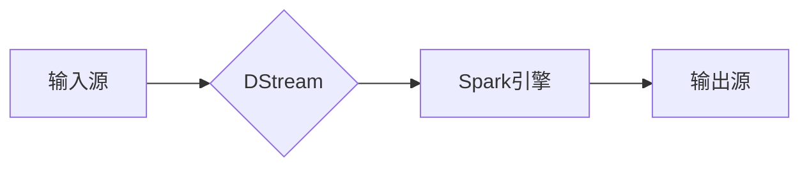

> 关键词：Spark Streaming, 实时计算, 大数据处理, 流处理, 持续集成, 消息队列

# 【AI大数据计算原理与代码实例讲解】Spark Streaming

在当今数据爆炸的时代，实时处理和分析大量数据变得越来越重要。Spark Streaming是Apache Spark生态系统中用于实时数据流处理的组件，它能够轻松地集成到Spark生态系统，提供高吞吐量和容错的流处理能力。本文将深入探讨Spark Streaming的原理、操作步骤，并通过实际代码实例进行详细讲解，帮助读者全面理解并掌握Spark Streaming的使用。

## 1. 背景介绍

### 1.1 问题的由来

随着互联网和物联网的发展，实时数据已经成为了企业决策和运营的关键。例如，电商平台的用户行为分析、金融市场的交易监控、社交网络的数据分析等，都需要实时处理和分析数据。传统的批处理系统在处理实时数据时存在延迟高、扩展性差等问题，而Spark Streaming凭借其高性能和易用性，成为了实时数据处理的理想选择。

### 1.2 研究现状

Spark Streaming自2013年首次发布以来，已经成为了Apache Spark生态系统的重要组成部分。随着Spark版本的更新，Spark Streaming的功能不断增强，性能也得到了显著提升。目前，Spark Streaming已经成为了实时数据处理领域的领先技术之一。

### 1.3 研究意义

掌握Spark Streaming技术，对于数据科学家、大数据工程师和AI开发人员来说至关重要。它能够帮助开发者高效地处理实时数据，从而为业务决策提供及时的支持。

### 1.4 本文结构

本文将按照以下结构进行阐述：

- 核心概念与联系
- 核心算法原理与操作步骤
- 数学模型和公式
- 项目实践
- 实际应用场景
- 工具和资源推荐
- 总结与展望
- 附录

## 2. 核心概念与联系

### 2.1 核心概念

- **实时数据流**：指在产生时就需要被处理和分析的数据流，例如股票交易、社交媒体更新等。
- **Spark Streaming**：Apache Spark的一个组件，用于实时数据流处理。
- **DStream**：Spark Streaming中的数据抽象，代表不断产生数据的分布式数据流。
- **微批次处理**：Spark Streaming将实时数据流切分成微批次，然后在Spark的批处理引擎上进行处理。

### 2.2 架构图

以下是一个简化的Spark Streaming架构图，展示了其核心组件和数据流处理流程：



- **A（输入源）**：可以是Kafka、Flume、Twitter等消息队列或数据源。
- **B（DStream）**：Spark Streaming将输入源中的数据流切分成微批次，形成DStream。
- **C（Spark引擎）**：使用Spark的批处理能力对DStream中的微批次进行计算和分析。
- **D（输出源）**：将处理结果输出到数据库、文件系统或其他系统。

## 3. 核心算法原理 & 具体操作步骤

### 3.1 算法原理概述

Spark Streaming的核心原理是将实时数据流切分成微批次，然后使用Spark的批处理能力进行高效处理。这种微批次处理的方式，既保证了实时性，又充分利用了Spark的强大计算能力。

### 3.2 算法步骤详解

1. **数据输入**：从消息队列或数据源中获取数据，形成DStream。
2. **微批次切分**：将DStream切分成微批次，通常是固定的时长。
3. **数据转换**：在Spark引擎中对每个微批次进行转换和计算。
4. **结果输出**：将处理结果输出到目标系统。

### 3.3 算法优缺点

**优点**：

- **高性能**：利用Spark的批处理能力，能够高效地处理大规模数据流。
- **易用性**：Spark Streaming与Spark的其他组件无缝集成，易于使用。
- **容错性**：Spark Streaming具有高容错性，能够在遇到故障时自动恢复。

**缺点**：

- **资源开销**：微批次处理需要额外的资源来管理DStream和微批次。
- **延迟**：微批次处理可能引入一定的延迟。

### 3.4 算法应用领域

Spark Streaming适用于以下应用领域：

- 实时数据分析
- 实时监控
- 实时推荐
- 实时广告投放
- 实时数据清洗和转换

## 4. 数学模型和公式 & 详细讲解 & 举例说明

### 4.1 数学模型构建

Spark Streaming中的微批次处理可以通过以下数学模型进行描述：

$$
X_t = f(X_{t-1}, I_t)
$$

其中，$X_t$ 是第 $t$ 个微批次的数据，$X_{t-1}$ 是前一个微批次的数据，$I_t$ 是第 $t$ 个微批次的输入数据。

### 4.2 公式推导过程

假设输入数据流 $I$ 是连续的，那么每个微批次 $X_t$ 可以通过以下公式进行推导：

$$
X_t = f(X_{t-1}, I_t) = f(X_{t-1}, I_{t-1}, I_t - I_{t-1})
$$

这里，$I_t - I_{t-1}$ 表示第 $t$ 个微批次相对于前一个微批次新增的数据。

### 4.3 案例分析与讲解

以下是一个简单的例子，演示如何使用Spark Streaming计算实时数据的平均值。

```python
from pyspark.streaming import StreamingContext
from pyspark.storagelevel import StorageLevel

# 创建StreamingContext
ssc = StreamingContext(sc, 1)  # 1秒一个批次

# 创建DStream，从socket获取数据
lines = ssc.socketTextStream("localhost", 9999)

# 计算每批次的平均数，并打印
averages = lines.map(lambda line: int(line)).reduce(lambda x, y: x + y) / 10.0

# 持续打印平均数
averages.pprint()

# 启动流处理
ssc.start()

# 等待流处理结束
ssc.awaitTermination()
```

在这个例子中，我们从本地的9999端口读取数据，每个微批次包含10条记录，计算这10条记录的平均值，并持续打印。

## 5. 项目实践：代码实例和详细解释说明

### 5.1 开发环境搭建

为了运行Spark Streaming程序，需要以下环境：

- Java开发环境（Java 8或更高版本）
- Scala或Python编程语言
- Spark安装

### 5.2 源代码详细实现

以下是一个简单的Spark Streaming程序，演示了如何从Kafka读取数据，并进行处理。

```python
from pyspark.streaming import StreamingContext
from pyspark.streaming.kafka import KafkaUtils

# 创建StreamingContext
ssc = StreamingContext(sc, 1)  # 1秒一个批次

# 创建Kafka DStream
kafkaStream = KafkaUtils.createStream(ssc, "kafka-broker:2181", "spark-streaming", {"topic1": 1})

# 处理数据
kafkaStream.map(lambda (k, v): v).foreachRDD(lambda rdd: rdd.foreachPartition(lambda partitionIter: 
    # 这里可以写入数据库或进行其他处理
    print("Partition: %s" % partitionIter)))
```

### 5.3 代码解读与分析

- 首先，我们创建了一个`StreamingContext`，指定了批次时间为1秒。
- 然后，我们使用`KafkaUtils.createStream`从Kafka读取数据。
- 接着，我们对数据进行映射处理，这里简单地打印了每条记录。
- 最后，我们使用`foreachRDD`对每个批次的数据进行迭代处理，这里可以写入数据库或其他存储系统。

### 5.4 运行结果展示

运行上述程序后，可以从Kafka的`topic1`主题中读取数据，并实时打印到控制台。

## 6. 实际应用场景

### 6.1 社交网络分析

Spark Streaming可以用于实时分析社交媒体数据，例如检测网络舆情、监控热点事件等。

### 6.2 电商推荐

Spark Streaming可以用于实时分析用户行为，从而提供个性化的商品推荐。

### 6.3 IT运维监控

Spark Streaming可以用于实时监控IT系统性能，及时发现异常并采取措施。

## 7. 工具和资源推荐

### 7.1 学习资源推荐

- Spark官方文档：[https://spark.apache.org/docs/latest/streamingprogramming.html](https://spark.apache.org/docs/latest/streamingprogramming.html)
- 《Spark Streaming Programming Guide》：[https://spark.apache.org/docs/latest/streaming-programming-guide.html](https://spark.apache.org/docs/latest/streaming-programming-guide.html)
- 《Spark in Action》：[https://www.manning.com/books/the-definitive-guide-to-spark-action](https://www.manning.com/books/the-definitive-guide-to-spark-action)

### 7.2 开发工具推荐

- IntelliJ IDEA：支持Scala、Python等语言的集成开发环境。
- PyCharm：支持Python、Scala等语言的集成开发环境。
- Eclipse：支持Java、Scala等语言的集成开发环境。

### 7.3 相关论文推荐

- 《Spark Streaming: Large-Scale Incremental Processing of Streaming Data》：Spark Streaming的原论文，详细介绍了其设计原理和实现。

## 8. 总结：未来发展趋势与挑战

### 8.1 研究成果总结

Spark Streaming作为Apache Spark生态系统中的一部分，为实时数据处理提供了强大的支持。它凭借其高性能、易用性和容错性，成为了实时数据处理领域的领先技术。

### 8.2 未来发展趋势

- **更高级的流处理算法**：随着流处理技术的发展，更多的先进算法将被引入Spark Streaming，例如时间序列分析、图处理等。
- **更灵活的集成**：Spark Streaming将与其他大数据技术，如Kubernetes、Apache Flink等，实现更灵活的集成。
- **更低的延迟**：通过优化算法和资源管理，Spark Streaming将实现更低的处理延迟。

### 8.3 面临的挑战

- **资源管理**：实时数据处理需要高效的资源管理，以应对动态的数据流。
- **数据质量**：实时数据可能包含噪声和异常值，需要有效的方法进行数据清洗和预处理。
- **安全性和隐私**：实时数据处理涉及大量敏感数据，需要保证数据的安全性和用户隐私。

### 8.4 研究展望

Spark Streaming将继续发展和完善，为实时数据处理提供更加强大的功能和更好的性能。同时，随着人工智能技术的发展，Spark Streaming也将与机器学习、深度学习等技术结合，为构建智能化的实时系统提供支持。

## 9. 附录：常见问题与解答

**Q1：Spark Streaming与Spark的其他组件有何区别？**

A1：Spark Streaming是Spark生态系统中用于实时数据处理的一个组件，而Spark还包括Spark SQL、Spark MLlib等组件，用于批处理、SQL查询、机器学习等。

**Q2：Spark Streaming如何处理大规模数据流？**

A2：Spark Streaming将数据流切分成微批次，然后使用Spark的批处理能力进行高效处理。这种微批次处理的方式，既保证了实时性，又充分利用了Spark的强大计算能力。

**Q3：Spark Streaming如何保证容错性？**

A3：Spark Streaming通过记录操作历史和重新计算丢失的微批次来保证容错性。

**Q4：Spark Streaming适用于哪些场景？**

A4：Spark Streaming适用于需要实时处理和分析大量数据的场景，例如实时数据分析、实时监控、实时推荐等。

---

作者：禅与计算机程序设计艺术 / Zen and the Art of Computer Programming