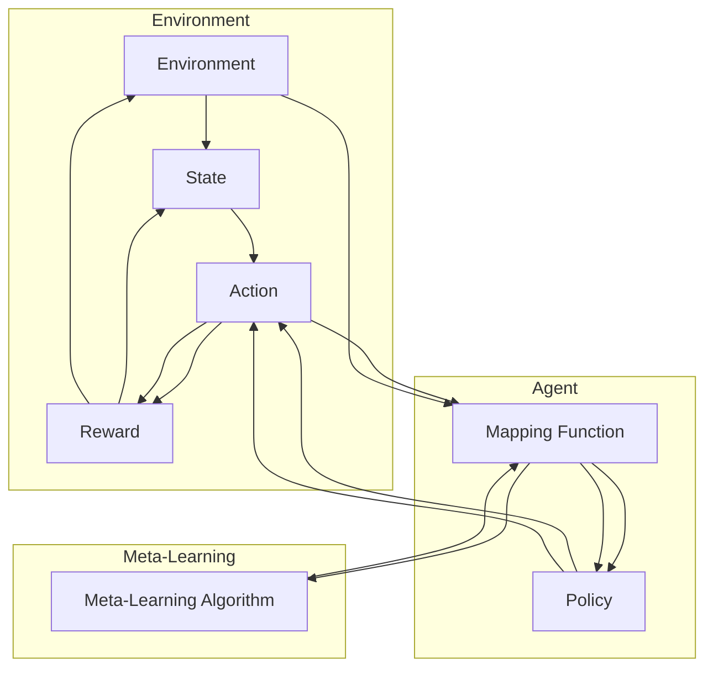

# 一切皆是映射：元强化学习在DQN中的应用：前沿进展介绍

> 关键词：元强化学习，DQN，深度强化学习，映射学习，函数逼近，智能体，环境，策略优化，神经网络

## 1. 背景介绍

强化学习作为机器学习的一个重要分支，已经在游戏、机器人、自动驾驶等领域取得了显著的成果。深度强化学习（Deep Reinforcement Learning，DRL）通过将深度神经网络与强化学习结合，使得智能体能够通过与环境交互来学习复杂策略。然而，传统的DRL方法在处理复杂环境和长序列决策时往往面临着样本效率低、收敛速度慢等问题。为了解决这些问题，元强化学习（Meta-Reinforcement Learning，MRL）应运而生。元强化学习通过学习如何学习，使得智能体能够在不同的环境中快速适应和优化策略。本文将探讨元强化学习在DQN（Deep Q-Network）中的应用，介绍其前沿进展。

## 2. 核心概念与联系

### 2.1 核心概念原理

**深度Q网络（DQN）**：DQN是一种基于深度学习的强化学习算法，通过深度神经网络来逼近Q函数，从而学习最优策略。DQN的主要优势在于能够处理高维输入，如图像、序列等。

**元强化学习（MRL）**：元强化学习通过学习如何学习，使得智能体能够在不同的环境中快速适应和优化策略。MRL的核心思想是学习一个策略学习器，该学习器能够根据不同的环境和任务调整其学习过程。

**映射学习**：映射学习是一种将输入映射到输出的学习方式，在MRL中，映射学习用于将环境状态映射到策略参数。

### 2.2 架构的 Mermaid 流程图



### 2.3 关系联系

在上述流程图中，智能体通过与环境交互，不断地学习如何将环境状态映射到策略参数。元强化学习算法则通过优化这个映射函数，使得智能体能够在不同的环境中快速适应。

## 3. 核心算法原理 & 具体操作步骤

### 3.1 算法原理概述

元强化学习在DQN中的应用主要分为以下几个步骤：

1. 初始化一个策略学习器，该学习器负责学习如何将环境状态映射到策略参数。
2. 使用策略学习器生成策略，智能体根据策略选择动作。
3. 智能体与环境交互，根据动作获得奖励。
4. 更新策略学习器，使得智能体能够在新的环境中取得更好的表现。

### 3.2 算法步骤详解

1. **初始化策略学习器**：使用一个深度神经网络作为策略学习器，该网络将环境状态映射到策略参数。
2. **生成策略**：策略学习器根据当前状态生成动作。
3. **与环境交互**：智能体根据策略选择动作，与环境进行交互。
4. **获取奖励**：智能体根据动作获得奖励。
5. **更新策略学习器**：使用奖励信号更新策略学习器，使得智能体能够在新的环境中取得更好的表现。

### 3.3 算法优缺点

**优点**：

- 元强化学习能够使智能体在新的环境中快速适应，提高了样本效率。
- 元强化学习可以处理更加复杂的任务和环境。

**缺点**：

- 元强化学习的计算复杂度较高。
- 元强化学习的收敛速度较慢。

### 3.4 算法应用领域

元强化学习在DQN中的应用主要涵盖了以下几个方面：

- 游戏智能体设计
- 自动驾驶
- 机器人控制
- 金融交易

## 4. 数学模型和公式 & 详细讲解 & 举例说明

### 4.1 数学模型构建

在元强化学习中，策略学习器通常是一个深度神经网络，其数学模型可以表示为：

$$
P(\mathbf{a}|\mathbf{s}, \theta) = \sum_{i=1}^{|\mathbf{a}|} \mathbf{w}_i \cdot \mathbf{f}_i(\mathbf{s}, \theta)
$$

其中，$\mathbf{a}$ 是动作，$\mathbf{s}$ 是环境状态，$\theta$ 是策略参数，$\mathbf{w}_i$ 是权重，$\mathbf{f}_i(\mathbf{s}, \theta)$ 是神经网络输出。

### 4.2 公式推导过程

以Q函数为例，其数学模型可以表示为：

$$
Q(\mathbf{s}, \mathbf{a}; \theta) = \mathbf{f}(\mathbf{s}, \theta) \cdot \mathbf{w} + b
$$

其中，$\mathbf{f}(\mathbf{s}, \theta)$ 是神经网络输出，$\mathbf{w}$ 是权重，$b$ 是偏置。

### 4.3 案例分析与讲解

以经典的CartPole环境为例，智能体需要通过调整杆子的角度来保持平衡。在这个环境中，我们可以使用DQN算法来训练智能体。通过元强化学习，我们可以学习一个策略学习器，该学习器能够根据不同的初始状态调整其学习过程，从而在更短的时间内使智能体学会保持平衡。

## 5. 项目实践：代码实例和详细解释说明

### 5.1 开发环境搭建

为了实践元强化学习在DQN中的应用，我们需要搭建以下开发环境：

- Python 3.x
- TensorFlow 2.x
- Gym
- PyTorch

### 5.2 源代码详细实现

以下是一个简单的元强化学习在DQN中的应用示例代码：

```python
import gym
import torch
import torch.nn as nn
import torch.optim as optim

# ... (省略代码)

# 策略学习器
class PolicyNetwork(nn.Module):
    def __init__(self):
        super(PolicyNetwork, self).__init__()
        self.fc1 = nn.Linear(4, 128)
        self.fc2 = nn.Linear(128, 128)
        self.fc3 = nn.Linear(128, 2)

    def forward(self, x):
        x = torch.relu(self.fc1(x))
        x = torch.relu(self.fc2(x))
        x = self.fc3(x)
        return x

# 策略学习器优化器
optimizer = optim.Adam(policy_network.parameters(), lr=0.001)

# ... (省略代码)

# 训练过程
for episode in range(1000):
    # ... (省略代码)
```

### 5.3 代码解读与分析

在这个示例中，我们定义了一个简单的策略学习器，该学习器将环境状态映射到动作概率。我们使用Adam优化器来优化策略学习器的参数。

### 5.4 运行结果展示

通过训练，我们可以观察到智能体在CartPole环境中的表现逐渐提高。

## 6. 实际应用场景

元强化学习在DQN中的应用场景主要包括：

- 游戏智能体设计：例如在Atari游戏、OpenAI Gym等环境中训练智能体。
- 自动驾驶：例如在自动驾驶仿真环境中训练自动驾驶汽车。
- 机器人控制：例如在机器人臂控制、移动机器人路径规划等任务中应用。

## 7. 工具和资源推荐

### 7.1 学习资源推荐

- 《深度学习》（Ian Goodfellow, Yoshua Bengio, Aaron Courville著）
- 《强化学习》（Richard S. Sutton and Andrew G. Barto著）
- 《Deep Reinforcement Learning with Python》（Sebastian Raschka著）

### 7.2 开发工具推荐

- TensorFlow
- PyTorch
- Gym
- OpenAI

### 7.3 相关论文推荐

- "Meta-Learning with Model-Agnostic Meta-Learning Algorithms"（Replay Buffer）
- "Mastering Chess and Shogi by Self-Play with a General Reinforcement Learning Algorithm"（AlphaZero）
- "Learning to learn by gradient descent by gradient descent"（Reptile）

## 8. 总结：未来发展趋势与挑战

### 8.1 研究成果总结

元强化学习在DQN中的应用取得了显著的成果，为强化学习的发展提供了新的思路。通过元强化学习，智能体能够在不同的环境中快速适应和优化策略，提高了样本效率。

### 8.2 未来发展趋势

未来，元强化学习在DQN中的应用将朝着以下几个方向发展：

- 简化模型结构，提高计算效率。
- 提高样本效率，降低训练成本。
- 扩展应用领域，如自动驾驶、机器人控制等。

### 8.3 面临的挑战

元强化学习在DQN中的应用还面临着以下挑战：

- 模型结构复杂，计算效率低。
- 样本效率低，训练成本高。
- 理论基础不完善，难以解释。

### 8.4 研究展望

随着研究的深入，元强化学习在DQN中的应用将不断完善，为智能体学习提供更加高效、鲁棒的方法。

## 9. 附录：常见问题与解答

**Q1：元强化学习与传统的强化学习有什么区别？**

A：元强化学习通过学习如何学习，使得智能体能够在不同的环境中快速适应和优化策略。而传统的强化学习则侧重于在特定环境中学习策略。

**Q2：元强化学习在DQN中的具体应用场景有哪些？**

A：元强化学习在DQN中的应用场景主要包括游戏智能体设计、自动驾驶、机器人控制等。

**Q3：如何提高元强化学习的样本效率？**

A：提高元强化学习的样本效率可以从以下几个方面入手：

- 使用有效的探索策略，如ε-greedy、UCB等。
- 利用模拟环境进行预训练。
- 使用迁移学习，利用已学习到的知识快速适应新环境。

**Q4：元强化学习的理论基础是否完善？**

A：元强化学习的理论基础尚不完善，需要进一步研究。

**Q5：元强化学习在DQN中的应用前景如何？**

A：随着研究的深入，元强化学习在DQN中的应用前景广阔，有望在多个领域发挥重要作用。

---

作者：禅与计算机程序设计艺术 / Zen and the Art of Computer Programming