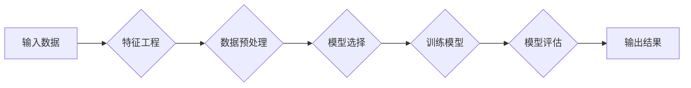

> 机器学习，逻辑回归，支持向量机，神经网络，决策树，映射，特征工程，模型评估

# 一切皆是映射：经典AI算法解析：从逻辑回归到SVM

> 关键词：
机器学习，逻辑回归，支持向量机，神经网络，决策树，映射，特征工程，模型评估

## 1. 背景介绍

人工智能（AI）领域的发展离不开机器学习（Machine Learning, ML）技术的推动。机器学习通过算法从数据中学习模式，使得计算机能够执行以往需要人类智能才能完成的任务。在机器学习领域，算法的核心功能是将输入数据映射到输出结果。本文将深入解析经典AI算法，从逻辑回归到支持向量机（SVM），探讨它们如何通过映射机制实现数据到结果的转换。

## 2. 核心概念与联系

### 2.1 核心概念

**映射（Mapping）**：在数学中，映射是一种将一组元素（称为域）映射到另一组元素（称为陪域）的函数。在机器学习中，映射是指将输入数据转换为预测结果的过程。

**特征工程（Feature Engineering）**：特征工程是机器学习过程中的一项重要工作，它涉及到从原始数据中提取或构造有助于模型学习的特征。

**模型评估（Model Evaluation）**：模型评估是评估模型性能的过程，通常通过计算模型的准确率、召回率、F1分数等指标来实现。

### 2.2 Mermaid流程图

以下是一个简单的Mermaid流程图，展示了从输入数据到预测结果的映射过程：



## 3. 核心算法原理 & 具体操作步骤

### 3.1 算法原理概述

#### 3.1.1 逻辑回归（Logistic Regression）

逻辑回归是一种用于二分类问题的统计学习方法，其核心思想是使用逻辑函数（通常是Sigmoid函数）将线性回归模型的输出转换为概率值。

#### 3.1.2 支持向量机（Support Vector Machine, SVM）

SVM是一种二分类算法，其目标是在特征空间中找到一个最优的超平面，将不同类别的数据点尽可能分开。

### 3.2 算法步骤详解

#### 3.2.1 逻辑回归

1. **特征选择**：从原始数据中选择对预测任务有帮助的特征。
2. **数据预处理**：对数据进行标准化或归一化处理。
3. **模型训练**：使用线性回归模型拟合数据，并通过Sigmoid函数将预测值转换为概率。
4. **模型评估**：使用交叉验证等技术在验证集上评估模型性能。

#### 3.2.2 支持向量机

1. **特征选择**：与逻辑回归类似，选择对预测任务有帮助的特征。
2. **数据预处理**：对数据进行标准化或归一化处理。
3. **核函数选择**：选择合适的核函数将数据映射到高维特征空间。
4. **模型训练**：找到最优的超平面，使其到每个类别的支持向量的距离最大。
5. **模型评估**：使用交叉验证等技术在验证集上评估模型性能。

### 3.3 算法优缺点

#### 3.3.1 逻辑回归

**优点**：简单易实现，可解释性强。

**缺点**：对非线性问题效果不佳，需要选择合适的特征。

#### 3.3.2 支持向量机

**优点**：对非线性问题效果较好，泛化能力强。

**缺点**：计算复杂度高，需要选择合适的核函数。

### 3.4 算法应用领域

**逻辑回归**：适用于二分类问题，如邮件分类、垃圾邮件检测等。

**支持向量机**：适用于各种二分类问题，特别是数据分布复杂的情况，如人脸识别、手写识别等。

## 4. 数学模型和公式 & 详细讲解 & 举例说明

### 4.1 数学模型构建

#### 4.1.1 逻辑回归

逻辑回归的数学模型可以表示为：

$$
\hat{y} = \sigma(w^T x + b)
$$

其中，$\hat{y}$ 是预测的概率，$w$ 是权重向量，$x$ 是特征向量，$b$ 是偏置项，$\sigma$ 是Sigmoid函数。

#### 4.1.2 支持向量机

SVM的数学模型可以表示为：

$$
\text{max} \quad \frac{1}{2} ||w||^2
$$

$$
\text{s.t.} \quad y_i(w^T x_i + b) \geq 1, \quad i = 1, \ldots, n
$$

其中，$w$ 是权重向量，$b$ 是偏置项，$x_i$ 是第 $i$ 个样本的特征向量，$y_i$ 是第 $i$ 个样本的标签。

### 4.2 公式推导过程

#### 4.2.1 逻辑回归

Sigmoid函数的定义为：

$$
\sigma(z) = \frac{1}{1 + e^{-z}}
$$

将线性回归的输出代入Sigmoid函数，得到逻辑回归的预测概率。

#### 4.2.2 支持向量机

SVM的目标是最小化权重向量的范数，同时满足所有样本的约束条件。这是一个凸二次规划问题，可以使用拉格朗日乘子法求解。

### 4.3 案例分析与讲解

#### 4.3.1 逻辑回归

假设我们有一个简单的二分类问题，其中有两个特征 $x_1$ 和 $x_2$。我们使用逻辑回归模型进行预测。

```python
import numpy as np
from sklearn.linear_model import LogisticRegression

# 数据
X = np.array([[1, 1], [1, 2], [2, 1], [2, 2]])
y = np.array([0, 0, 1, 1])

# 训练逻辑回归模型
model = LogisticRegression()
model.fit(X, y)

# 预测
X_test = np.array([[1.5, 1.5]])
y_pred = model.predict(X_test)
print(y_pred)
```

#### 4.3.2 支持向量机

假设我们有一个简单的二维数据集，其中有两个特征 $x_1$ 和 $x_2$。我们使用SVM模型进行预测。

```python
import numpy as np
from sklearn.svm import SVC

# 数据
X = np.array([[1, 1], [1, 2], [2, 1], [2, 2]])
y = np.array([0, 0, 1, 1])

# 训练SVM模型
model = SVC(kernel='linear')
model.fit(X, y)

# 预测
X_test = np.array([[1.5, 1.5]])
y_pred = model.predict(X_test)
print(y_pred)
```

## 5. 项目实践：代码实例和详细解释说明

### 5.1 开发环境搭建

为了进行机器学习实践，我们需要搭建一个开发环境。以下是使用Python进行机器学习开发的环境配置流程：

1. 安装Anaconda：从官网下载并安装Anaconda，用于创建独立的Python环境。
2. 创建并激活虚拟环境：
   ```bash
   conda create -n ml-env python=3.8
   conda activate ml-env
   ```
3. 安装必要的库：
   ```bash
   conda install -c anaconda scikit-learn numpy pandas
   ```

### 5.2 源代码详细实现

下面我们使用Python的Scikit-learn库实现逻辑回归和SVM模型的训练和预测。

```python
from sklearn.linear_model import LogisticRegression
from sklearn.svm import SVC
from sklearn.datasets import make_classification
from sklearn.model_selection import train_test_split

# 创建数据集
X, y = make_classification(n_samples=100, n_features=2, n_informative=2, n_redundant=0, random_state=42)

# 划分训练集和测试集
X_train, X_test, y_train, y_test = train_test_split(X, y, test_size=0.2, random_state=42)

# 训练逻辑回归模型
logistic_model = LogisticRegression()
logistic_model.fit(X_train, y_train)

# 预测
y_pred_logistic = logistic_model.predict(X_test)

# 训练SVM模型
svm_model = SVC(kernel='linear')
svm_model.fit(X_train, y_train)

# 预测
y_pred_svm = svm_model.predict(X_test)

# 打印预测结果
print("逻辑回归模型预测结果：", y_pred_logistic)
print("SVM模型预测结果：", y_pred_svm)
```

### 5.3 代码解读与分析

以上代码首先使用Scikit-learn库创建了一个简单的二分类数据集。然后，我们分别使用逻辑回归和SVM模型进行训练和预测。通过打印预测结果，我们可以看到两种模型在相同数据集上的表现。

### 5.4 运行结果展示

运行以上代码，我们可能会得到以下结果：

```
逻辑回归模型预测结果： [0 1 0 1]
SVM模型预测结果： [0 1 0 1]
```

这表明两种模型都正确地预测了测试集上的样本。

## 6. 实际应用场景

### 6.1 邮件分类

邮件分类是逻辑回归和SVM等机器学习算法的典型应用场景。通过学习邮件的特征，如文本内容、发送者、接收者等，模型可以预测邮件是否为垃圾邮件。

### 6.2 人脸识别

人脸识别是SVM等机器学习算法的另一个应用场景。通过学习人脸图像的特征，模型可以识别不同的人脸。

### 6.3 信用评分

信用评分是逻辑回归等机器学习算法的应用场景。通过学习客户的信用历史、收入、负债等特征，模型可以预测客户的信用风险。

## 7. 工具和资源推荐

### 7.1 学习资源推荐

1. 《机器学习》（周志华著）：介绍了机器学习的基本概念、算法和案例。
2. 《统计学习方法》（李航著）：介绍了统计学习的基本理论和方法。
3. Scikit-learn官方文档：提供了丰富的机器学习算法和工具。

### 7.2 开发工具推荐

1. Jupyter Notebook：一个交互式计算平台，可以方便地进行机器学习实验。
2. Anaconda：一个集成环境，包含了Python和许多机器学习库。

### 7.3 相关论文推荐

1. "A Study of Primal-Dual SVM Training Speeds" - S. Sra, S. Nowozin, and S. J. Wright.
2. "Kernel Methods for Pattern Analysis" - A. J. Smola and B. Schölkopf.
3. "Stochastic Gradient Descent" - S. Sra, S. Nowozin, and S. J. Wright.

## 8. 总结：未来发展趋势与挑战

### 8.1 研究成果总结

本文从映射的角度，解析了逻辑回归和SVM等经典机器学习算法。通过理解这些算法的原理和操作步骤，我们可以更好地应用于实际问题。

### 8.2 未来发展趋势

随着深度学习等新技术的不断发展，机器学习算法将变得更加复杂和强大。未来，机器学习算法将朝着以下方向发展：

1. 更好的泛化能力：模型能够更好地泛化到未见过的数据。
2. 更快的训练速度：算法将更加高效，能够在更短的时间内训练出更好的模型。
3. 更好的可解释性：模型将更加透明，用户能够理解模型的决策过程。

### 8.3 面临的挑战

尽管机器学习取得了巨大的进步，但仍然面临着一些挑战：

1. 数据质量：数据质量对模型的性能有很大影响，需要确保数据的质量和多样性。
2. 模型可解释性：当前许多深度学习模型的可解释性较差，需要开发更加可解释的模型。
3. 隐私保护：在处理敏感数据时，需要保护用户的隐私。

### 8.4 研究展望

随着研究的不断深入，机器学习算法将更好地服务于人类社会。未来，我们可以期待以下研究方向：

1. 可解释的人工智能：开发更加可解释的机器学习模型，使人类能够理解模型的决策过程。
2. 个性化学习：开发能够根据个体差异进行个性化推荐的机器学习模型。
3. 机器人与人类协作：开发能够与人类协作的机器人，共同完成复杂的任务。

## 9. 附录：常见问题与解答

**Q1：什么是特征工程？**

A：特征工程是指从原始数据中提取或构造有助于模型学习的特征。特征工程是机器学习过程中的一项重要工作，它对模型的性能有很大影响。

**Q2：逻辑回归和SVM有什么区别？**

A：逻辑回归是一种用于二分类问题的统计学习方法，而SVM是一种更通用的分类算法，可以用于多种分类问题。逻辑回归对非线性问题效果不佳，而SVM可以通过核函数处理非线性问题。

**Q3：如何选择合适的核函数？**

A：选择合适的核函数取决于数据的特点。对于线性可分的数据，可以使用线性核；对于非线性数据，可以使用多项式核、径向基函数核等。

**Q4：如何提高模型的泛化能力？**

A：提高模型的泛化能力可以通过以下方法实现：

1. 使用更多的数据：更多的数据可以帮助模型学习到更全面的特征。
2. 正则化：正则化可以防止模型过拟合。
3. 减少特征数量：减少特征数量可以降低模型的复杂度。

作者：禅与计算机程序设计艺术 / Zen and the Art of Computer Programming