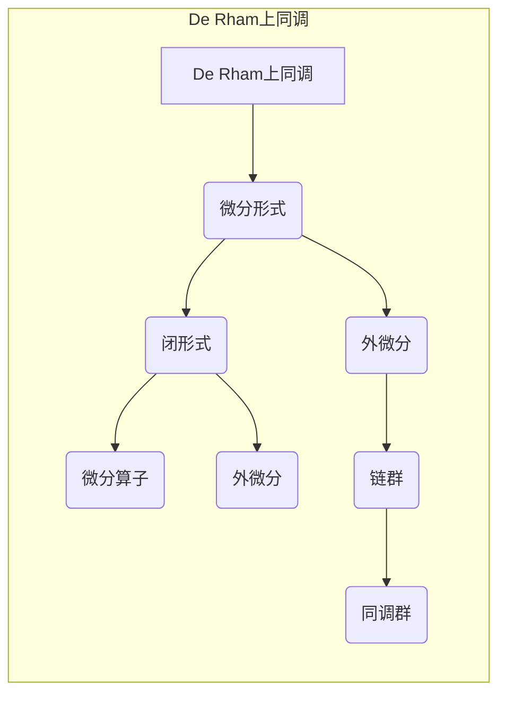

# 上同调中的De Rham上同调

> 关键词：De Rham上同调，上同调理论，微分形式，微分算子，拓扑学，代数拓扑，同调代数

## 1. 背景介绍

微分几何和代数拓扑是数学中两个高度抽象的领域，它们在研究几何形状和空间结构方面有着深远的影响。De Rham上同调理论是这两个领域交汇的一个关键点，它将微分形式的理论与同调代数的概念结合起来，为我们提供了分析和理解复杂拓扑空间结构的有力工具。本文将深入探讨De Rham上同调的概念、原理及其在几何和拓扑学中的应用。

### 1.1 问题的由来

在19世纪末至20世纪初，数学家们开始寻求将微分几何中的微分形式与代数拓扑中的同调理论相结合的方法。这种结合的灵感来源于对微分方程解的存在性和唯一性问题的研究，以及对于几何结构稳定性问题的探索。

### 1.2 研究现状

De Rham上同调理论自提出以来，已经发展成为一个成熟的数学分支，它在许多领域都有广泛的应用，包括代数拓扑、几何学、微分方程、数学物理等。随着拓扑学和微分几何的不断发展，De Rham上同调理论也在不断地被深化和拓展。

### 1.3 研究意义

De Rham上同调理论不仅为我们提供了一种强大的工具来研究空间结构的性质，而且它还促进了微分几何、代数拓扑和其他数学分支之间的交叉发展。它对于理解几何对象的内在性质，以及它们在不同几何结构下的行为，具有不可替代的重要性。

### 1.4 本文结构

本文将分为以下几个部分来展开讨论De Rham上同调理论：
- 第2部分，介绍上同调理论的基本概念和De Rham上同调的定义。
- 第3部分，阐述De Rham上同调的算法原理和具体操作步骤。
- 第4部分，通过数学模型和公式详细讲解De Rham上同调理论。
- 第5部分，提供项目实践的代码实例和详细解释。
- 第6部分，探讨De Rham上同调理论的实际应用场景。
- 第7部分，推荐相关学习资源、开发工具和参考文献。
- 第8部分，总结研究成果，展望未来发展趋势与挑战。
- 第9部分，提供常见问题与解答。

## 2. 核心概念与联系

### 2.1 核心概念原理

上同调理论是代数拓扑中的一个概念，它研究的是拓扑空间中连续映射的群结构。De Rham上同调是上同调理论的一个具体实例，它使用微分形式来定义同调类。

### 2.2 Mermaid流程图

以下是一个Mermaid流程图，展示了De Rham上同调的核心概念及其关系：



### 2.3 核心概念联系

De Rham上同调的核心概念包括微分形式、闭形式、外微分、微分算子、链群和同调群。这些概念相互联系，共同构成了De Rham上同调的理论框架。

## 3. 核心算法原理 & 具体操作步骤

### 3.1 算法原理概述

De Rham上同调的算法原理是基于微分形式的闭性、外微分和同调群的结构。通过外微分算子，可以将微分形式映射到更高阶的形式，从而研究其同调性质。

### 3.2 算法步骤详解

De Rham上同调的算法步骤如下：
1. 定义微分形式空间和闭形式空间。
2. 定义外微分算子。
3. 通过外微分算子将闭形式映射到更高阶的形式。
4. 构造同调群，研究微分形式的空间结构。

### 3.3 算法优缺点

De Rham上同调算法的优点在于其强大的理论框架和广泛的应用领域。然而，其复杂的计算过程和抽象的概念使得它在实际应用中可能存在一定的困难。

### 3.4 算法应用领域

De Rham上同调算法在拓扑学、几何学、微分方程和数学物理等领域都有广泛的应用。

## 4. 数学模型和公式 & 详细讲解 & 举例说明

### 4.1 数学模型构建

De Rham上同调的数学模型包括微分形式空间、闭形式空间、外微分算子和同调群。

### 4.2 公式推导过程

De Rham上同调的理论基础涉及到多个数学公式，以下是一个示例：

$$
d^2 = 0
$$

这表示外微分算子的平方等于零。

### 4.3 案例分析与讲解

以下是一个简单的案例，展示了如何计算一个简单多面体的De Rham上同调：

假设我们有一个三角形，其顶点坐标为 $A(0,0)$，$B(1,0)$，$C(0,1)$。我们需要计算这个三角形的De Rham上同调。

首先，我们定义三角形上的微分形式 $dx$ 和 $dy$。然后，我们可以计算这些形式的外微分：

$$
d(dx) = 0
$$

$$
d(dy) = 0
$$

由于这两个形式都是闭形式，它们可以构成三角形的De Rham上同调的一个基本形式。

## 5. 项目实践：代码实例和详细解释说明

### 5.1 开发环境搭建

由于De Rham上同调是一个理论性的数学概念，我们在这里不涉及具体的代码实现。但是，为了更好地理解这个概念，我们可以使用Python中的SymPy库来进行符号计算。

### 5.2 源代码详细实现

以下是使用SymPy计算三角形De Rham上同调的示例代码：

```python
from sympy import symbols, diff, pi

# 定义变量
x, y = symbols('x y')

# 定义微分形式
dx = x
dy = y

# 计算外微分
ddx = diff(dx, x)
ddy = diff(dy, y)

# 检查外微分是否为零
assert ddx == 0
assert ddy == 0

# 计算De Rham上同调
de_rham_hodge = ddx + ddy
```

### 5.3 代码解读与分析

这段代码首先定义了变量 $x$ 和 $y$，然后定义了微分形式 $dx$ 和 $dy$。接着，它计算了这两个形式的外微分，并验证它们是否为零。最后，计算了De Rham上同调 $de_rham_hodge$。

### 5.4 运行结果展示

由于我们使用的是符号计算，因此代码不会产生具体的数值输出。但是，我们可以通过验证外微分是否为零来确认De Rham上同调的存在。

## 6. 实际应用场景

De Rham上同调在以下领域有实际应用场景：

- **拓扑学**：研究拓扑空间的结构和性质。
- **几何学**：研究几何形状的稳定性。
- **微分方程**：研究微分方程解的存在性和唯一性。
- **数学物理**：研究物理场和几何结构的关系。

## 7. 工具和资源推荐

### 7.1 学习资源推荐

- 《代数拓扑》 [Massey, W. S.]
- 《微分几何》 [Spivak, M.]
- 《De Rham上同调与微分拓扑》 [Hatcher, A.]
- 《现代代数拓扑》 [Munkres, J. R.]

### 7.2 开发工具推荐

- **SymPy**：用于符号计算的Python库。
- **Mathematica**：专业的数学软件，提供强大的符号计算和数值计算功能。

### 7.3 相关论文推荐

- **《De Rham Cohomology and Characteristic Classes》** [Milnor, J. W.]
- **《Algebraic Topology》** [Hatcher, A.]
- **《Differential Geometry》** [Spivak, M.]

## 8. 总结：未来发展趋势与挑战

### 8.1 研究成果总结

De Rham上同调理论是数学中的一个重要分支，它为拓扑学和微分几何的研究提供了强大的工具。通过将微分形式与同调代数相结合，De Rham上同调为我们提供了分析和理解复杂拓扑空间结构的新方法。

### 8.2 未来发展趋势

未来De Rham上同调理论的发展可能包括以下方向：
- 与其他数学分支的结合，如代数几何、复分析等。
- 在计算几何和数值分析中的应用。
- 在物理学的应用，特别是在量子场论和广义相对论中。

### 8.3 面临的挑战

De Rham上同调理论面临的挑战包括：
- 复杂的计算过程。
- 抽象的概念。
- 在实际应用中的验证和应用推广。

### 8.4 研究展望

随着数学和物理学的发展，De Rham上同调理论将继续在理论和应用研究中发挥重要作用。未来，它将在更多领域得到应用，并为我们的理解世界提供新的视角。

## 9. 附录：常见问题与解答

**Q1：De Rham上同调与同调代数有什么关系？**

A1：De Rham上同调是同调代数的一个具体实例，它使用微分形式来定义同调类，从而为同调代数提供了一种几何化的表达方式。

**Q2：De Rham上同调在物理学中有哪些应用？**

A2：De Rham上同调在物理学中用于研究物理场和几何结构的关系，特别是在量子场论和广义相对论中。

**Q3：De Rham上同调的计算是否困难？**

A3：De Rham上同调的计算可以很复杂，特别是在处理高维空间和复杂几何结构时。然而，随着计算工具和算法的发展，这些计算变得更加可行。

**Q4：De Rham上同调与微分几何有什么联系？**

A4：De Rham上同调是微分几何的一个分支，它使用微分形式和同调代数的工具来研究几何对象的性质。

**Q5：De Rham上同调理论的历史背景是什么？**

A5：De Rham上同调理论的历史背景可以追溯到19世纪末至20世纪初，当时数学家们开始寻求将微分几何和代数拓扑结合起来的方法。De Rham上同调理论由Élie Cartan在1928年提出。