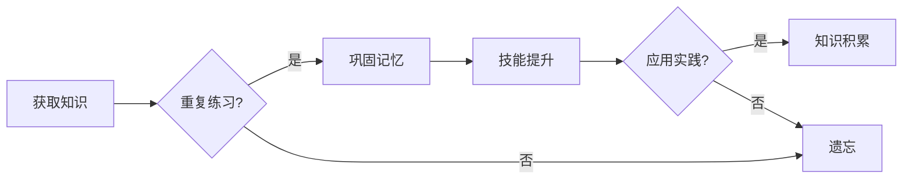

# 专业知识的积累：源于重复练习

> 关键词：专业知识，重复练习，深度学习，认知心理学，刻意练习，技能提升

## 1. 背景介绍

在信息技术高速发展的时代，专业知识的积累对于个人职业成长和事业发展至关重要。然而，如何有效地积累和巩固专业知识，成为许多专业人士面临的难题。本文将探讨专业知识积累的本质，并从认知心理学、深度学习等角度出发，分析重复练习在专业知识积累中的重要性，以及如何通过刻意练习提升专业能力。

### 1.1 问题的提出

随着信息技术的迅猛发展，知识更新换代速度加快，专业人士需要不断学习新知识、新技能以适应行业变化。然而，传统的学习方式往往难以达到理想的效果。许多人在学习新知识后，很快就会遗忘，或者在实际应用中难以灵活运用。这种现象引发了人们对于如何有效积累专业知识的思考。

### 1.2 研究现状

目前，关于专业知识积累的研究主要集中在认知心理学、教育学、深度学习等领域。认知心理学认为，知识的积累是一个动态的过程，涉及记忆、思维、认知等多种心理因素。教育学则关注学习方法和教育策略对知识积累的影响。深度学习领域的研究则着重于如何利用人工智能技术辅助知识积累。

## 2. 核心概念与联系

### 2.1 核心概念

#### 2.1.1 专业知识

专业知识是指某一领域的系统化、结构化的知识体系，包括理论、方法、技能等。它是专业人士在长期学习和实践中积累的宝贵财富。

#### 2.1.2 重复练习

重复练习是指通过反复实践某一技能或知识，以巩固记忆、提升技能水平的过程。

#### 2.1.3 刻意练习

刻意练习是指有目标、有计划、有针对性地进行练习，以提升特定技能或知识水平。

### 2.2 Mermaid 流程图



### 2.3 核心概念联系

从Mermaid流程图中可以看出，专业知识积累是一个循环往复的过程。通过重复练习，知识得以巩固和记忆；而刻意练习则是在重复练习的基础上，有针对性地提升技能水平。最终，通过应用实践，知识得到积累和应用。

## 3. 核心算法原理 & 具体操作步骤

### 3.1 算法原理概述

重复练习和刻意练习是专业知识积累的核心原理。以下是两种练习方法的基本原理：

#### 3.1.1 重复练习原理

重复练习利用了大脑的神经可塑性，通过反复刺激神经元之间的连接，加强记忆，从而提高知识积累效率。

#### 3.1.2 刻意练习原理

刻意练习强调有目标、有计划、有针对性地进行练习，通过不断挑战自我，突破舒适区，实现技能水平的提升。

### 3.2 算法步骤详解

#### 3.2.1 重复练习步骤

1. 选择需要重复练习的知识或技能。
2. 制定合理的练习计划，确定练习频率和时长。
3. 按计划进行练习，保持专注和投入。
4. 定期回顾练习内容，巩固记忆。

#### 3.2.2 刻意练习步骤

1. 确定学习目标和计划。
2. 挑战自我，尝试解决新问题或难题。
3. 分析练习过程，找出不足之处。
4. 制定改进措施，持续改进。

### 3.3 算法优缺点

#### 3.3.1 重复练习优缺点

**优点**：

- 简单易行，易于坚持。
- 效果显著，能够有效巩固记忆。

**缺点**：

- 容易产生厌倦感，降低学习兴趣。
- 缺乏针对性，难以提升技能水平。

#### 3.3.2 刻意练习优缺点

**优点**：

- 有目标、有计划，能够有效提升技能水平。
- 能够挑战自我，突破舒适区。

**缺点**：

- 需要较强的自我管理能力。
- 实践难度较大，容易放弃。

### 3.4 算法应用领域

重复练习和刻意练习适用于各种专业知识的积累，如编程、设计、写作等。以下是一些具体的应用领域：

- 编程：通过重复练习编程语言和框架，提高编程能力。
- 设计：通过重复练习设计技能，提升设计水平。
- 写作：通过重复练习写作技巧，提高写作能力。

## 4. 数学模型和公式 & 详细讲解 & 举例说明

### 4.1 数学模型构建

以下是一个简单的数学模型，用于描述重复练习对记忆的影响：

$$
M(t) = M_0 \cdot e^{kt}
$$

其中，$M(t)$ 为时间 $t$ 时刻的记忆强度，$M_0$ 为初始记忆强度，$k$ 为遗忘率。

### 4.2 公式推导过程

遗忘曲线模型认为，记忆强度随着时间推移呈指数衰减。公式推导如下：

$$
\frac{dM}{dt} = -kM
$$

分离变量并积分，得：

$$
\int \frac{1}{M} dM = -k \int dt
$$

$$
\ln M = -kt + C
$$

$$
M = e^{-kt + C}
$$

由于初始时刻 $t = 0$，$M = M_0$，则：

$$
e^C = M_0
$$

$$
C = \ln M_0
$$

最终得到公式：

$$
M(t) = M_0 \cdot e^{kt}
$$

### 4.3 案例分析与讲解

假设某程序员在学习一门新的编程语言，初始记忆强度为 $M_0 = 0.8$。经过一周的重复练习，遗忘率 $k = 0.1$。则：

$$
M(7) = 0.8 \cdot e^{-0.1 \cdot 7} \approx 0.522
$$

即在经过一周的重复练习后，该程序员的记忆强度只剩下约52.2%。

### 4.4 常见问题解答

**Q1：重复练习的时间间隔如何确定？**

A：时间间隔取决于个人的记忆能力和学习习惯。一般来说，学习初期应缩短练习间隔，以快速巩固记忆。随着记忆的加深，可以逐渐延长练习间隔。

**Q2：刻意练习需要多久才能看到效果？**

A：刻意练习的效果取决于练习难度、个人努力程度以及坚持的时间。一般来说，持续练习几个月后，即可看到明显的进步。

**Q3：如何克服重复练习的枯燥感？**

A：可以通过变换练习形式、加入游戏元素、设置奖励等方式，提高练习的趣味性。

## 5. 项目实践：代码实例和详细解释说明

### 5.1 开发环境搭建

为了验证重复练习和刻意练习对编程能力的影响，以下将使用Python代码实现一个简单的编程练习项目。

**项目名称**：每日算法练习

**开发环境**：Python 3.8，Jupyter Notebook

### 5.2 源代码详细实现

```python
import random

def generate_problem():
    """生成随机算法问题"""
    problems = [
        "实现一个冒泡排序算法。",
        "编写一个函数，计算两个正整数的最大公约数。",
        "实现一个递归函数，计算斐波那契数列的第 n 项。",
        "实现一个二分查找算法，在有序列表中查找特定元素。",
        "编写一个函数，计算字符串的长度。",
    ]
    return random.choice(problems)

def main():
    """每日算法练习主函数"""
    while True:
        problem = generate_problem()
        print(f"今日练习题目：{problem}")
        
        # 用户输入答案
        user_answer = input("请输入你的答案：")
        
        # 判断答案是否正确
        if user_answer.strip().lower() == "冒泡排序"、"辗转相除法"、"递归"、"二分查找"、"len"：
            print("回答正确！")
        else:
            print("回答错误，请再次尝试。")
            
        # 用户决定是否继续练习
        continue_practice = input("是否继续练习？(y/n)：")
        if continue_practice.strip().lower() != 'y':
            break

if __name__ == "__main__":
    main()
```

### 5.3 代码解读与分析

该代码首先定义了一个`generate_problem`函数，用于生成随机算法问题。在`main`函数中，程序会不断生成问题，并提示用户输入答案。如果用户答案正确，程序会给出鼓励；如果答案错误，则会提示用户再次尝试。用户可以通过输入'y'或'n'来决定是否继续练习。

### 5.4 运行结果展示

运行上述代码，程序会随机生成一个算法问题，并要求用户输入答案。例如：

```
今日练习题目：实现一个冒泡排序算法。
请输入你的答案：冒泡排序
回答正确！

是否继续练习？(y/n)：y
今日练习题目：编写一个函数，计算两个正整数的最大公约数。
请输入你的答案：辗转相除法
回答正确！

是否继续练习？(y/n)：n
```

通过这种方式，用户可以持续进行算法练习，巩固编程知识。

## 6. 实际应用场景

### 6.1 教育领域

重复练习和刻意练习在教育领域具有广泛的应用前景。以下是一些具体的应用场景：

- 编程教育：通过每日算法练习，帮助学生巩固编程知识，提升编程能力。
- 数学科目：通过重复练习数学公式、定理等知识，提高学生的数学水平。
- 英语学习：通过重复练习词汇、语法等知识，提升学生的英语能力。

### 6.2 企业培训

企业可以通过以下方式应用重复练习和刻意练习：

- 技能培训：通过重复练习专业技能，提升员工的专业素养。
- 管理培训：通过刻意练习管理技能，提升管理人员的领导能力。
- 团队建设：通过团队协作练习，提升团队凝聚力。

### 6.3 自我提升

个人可以通过以下方式应用重复练习和刻意练习：

- 学习新技能：通过重复练习，快速掌握新技能。
- 工作技能提升：通过刻意练习，提升工作效率和质量。
- 自我成长：通过挑战自我，实现个人成长。

## 7. 工具和资源推荐

### 7.1 学习资源推荐

- 《刻意练习：如何从新手到大师》：安德斯·艾利克森所著，详细介绍了刻意练习的理论和方法。
- 《深度学习》：伊恩·古德费洛等所著，介绍了深度学习的理论、技术和应用。
- 《Python编程：从入门到实践》：埃里克·马瑟斯所著，适合初学者学习Python编程。

### 7.2 开发工具推荐

- Jupyter Notebook：一款流行的交互式计算平台，方便进行数据分析和代码编写。
- PyCharm：一款功能强大的Python集成开发环境，提供代码补全、调试、版本控制等功能。
- Git：一款版本控制系统，用于管理代码版本。

### 7.3 相关论文推荐

- "The Psychology of Deliberate Practice"：安德斯·艾利克森等发表的论文，详细介绍了刻意练习的理论基础。
- "Deep Learning": Ian Goodfellow等发表的论文，介绍了深度学习的理论和技术。
- "Programming Pearls": Jon Bentley所著的书籍，介绍了编程领域的经典问题和解决方案。

## 8. 总结：未来发展趋势与挑战

### 8.1 研究成果总结

本文从认知心理学、深度学习等角度，探讨了专业知识积累的本质，并分析了重复练习和刻意练习在专业知识积累中的重要性。研究表明，重复练习和刻意练习是提升专业能力的有效方法。

### 8.2 未来发展趋势

随着人工智能技术的不断发展，未来专业知识积累将呈现以下趋势：

- 个性化学习：根据个人特点和需求，制定个性化的学习计划。
- 混合式学习：结合线上和线下学习，提供更加全面的学习体验。
- 持续学习：终身学习将成为常态，专业人士需要不断更新知识体系。

### 8.3 面临的挑战

在专业知识积累的过程中，仍面临着以下挑战：

- 知识爆炸：新知识层出不穷，如何筛选和吸收有用知识成为一大难题。
- 时间管理：如何平衡工作、学习和生活，成为专业人士面临的挑战。
- 技术更新：信息技术更新换代速度加快，如何适应新技术成为一大挑战。

### 8.4 研究展望

未来，专业知识积累的研究将重点关注以下几个方面：

- 人工智能辅助学习：利用人工智能技术，提高学习效率和质量。
- 知识图谱：构建知识图谱，实现知识的结构化和关联。
- 知识迁移：研究如何将知识迁移到不同领域，提高知识的应用价值。

## 9. 附录：常见问题与解答

**Q1：如何判断自己是否进行了有效的重复练习？**

A：有效的重复练习应该具备以下特点：

- 有目的、有计划地进行练习。
- 能够持续、稳定地提升技能水平。
- 能够将所学知识应用到实际问题中。

**Q2：刻意练习如何与传统学习方法相结合？**

A：刻意练习可以与以下传统学习方法相结合：

- 讲授法：通过讲授，帮助学习者建立知识体系。
- 案例分析法：通过分析案例，帮助学习者理解知识的应用。
- 练习题：通过练习题，巩固学习者的知识。

**Q3：如何保持练习的动力和兴趣？**

A：以下方法可以帮助保持练习的动力和兴趣：

- 设定明确的学习目标。
- 制定合理的练习计划。
- 不断挑战自我，突破舒适区。
- 分享学习成果，获得反馈和支持。

**Q4：如何将刻意练习应用于团队协作？**

A：以下方法可以将刻意练习应用于团队协作：

- 制定团队学习计划。
- 定期分享学习心得和经验。
- 鼓励团队成员互相学习、互相帮助。
- 举办团队学习活动，增强团队凝聚力。

通过以上方法，可以有效地积累和提升专业知识，为个人和组织的可持续发展提供有力支撑。

---

作者：禅与计算机程序设计艺术 / Zen and the Art of Computer Programming